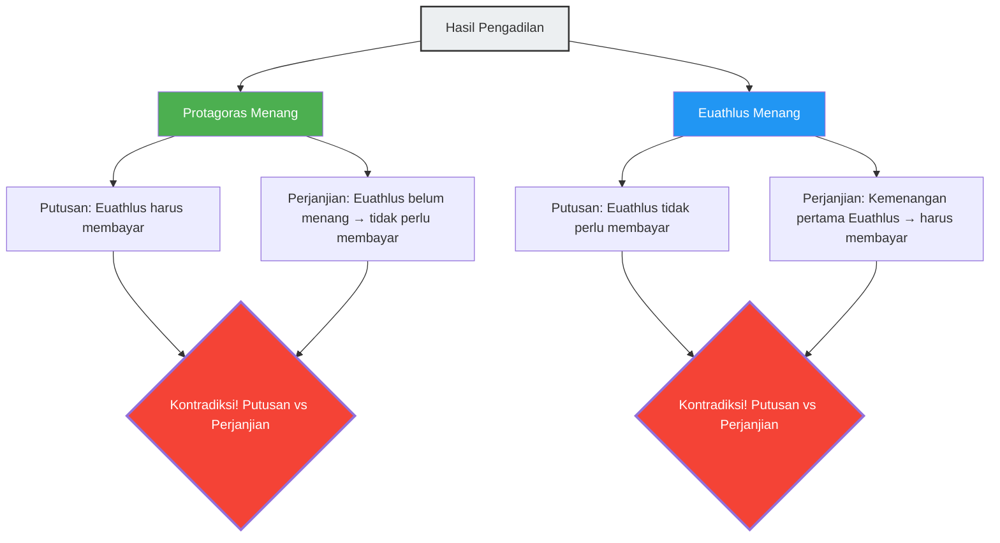

Di Yunani Kuno, seorang pemuda bernama Euathlus menjadi murid Protagoras, seorang Sofis (guru retorika) terhebat. Di antara keduanya, dibuatlah perjanjian pembayaran biaya kuliah sebagai berikut:

> **Isi Perjanjian:**
> Setelah Euathlus menyelesaikan seluruh kursus retorika, ia akan membayar sisa biaya kuliah kepada Protagoras **saat ia memenangkan kasus pengadilan pertamanya**.

Euathlus adalah murid yang berprestasi dan berhasil menyelesaikan seluruh kursus retorika dengan sangat baik.
Namun setelah lulus, entah mengapa ia tidak mau mengambil satu pun kasus pengadilan. Jika ia tidak maju ke pengadilan, syarat "memenangkan kasus pengadilan pertamanya" tidak akan pernah terpenuhi selamanya, sehingga ia tidak perlu membayar biaya kuliah.

Kehabisan kesabaran, Protagoras menggugat Euathlus ke pengadilan.
"Bayarlah biaya kuliahmu."

Dan dari sinilah labirin logika dimulai.

## Logika Sang Guru, Protagoras

Protagoras berargumen di pengadilan seperti ini:

"Wahai Hakim, bagaimanapun hasilnya, akulah yang menang.
- Jika di pengadilan ini **aku menang**, berdasarkan putusan pengadilan, Euathlus harus membayar biaya kuliah kepadaku.
- Jika di pengadilan ini **aku kalah**, itu berarti bagi Euathlus ia 'telah memenangkan kasus pengadilan pertamanya'. Dengan kata lain, syarat perjanjian terpenuhi, dan ia harus membayar biaya kuliah berdasarkan perjanjian.

Dalam kedua kasus, ia memiliki kewajiban untuk membayar biaya kuliah."

## Logika Sang Murid, Euathlus

Menanggapi hal ini, Euathlus pun tidak mau kalah.

"Wahai Hakim, bagaimanapun hasilnya, akulah yang menang.
- Jika di pengadilan ini **aku menang**, berdasarkan putusan pengadilan, aku tidak perlu membayar biaya kuliah.
- Jika di pengadilan ini **aku kalah**, aku belum 'memenangkan kasus pengadilan pertamanya'. Dengan kata lain, karena syarat perjanjian belum terpenuhi, secara kontrak aku tidak memiliki kewajiban untuk membayar biaya kuliah.

Dalam kedua kasus, aku tidak perlu membayar biaya kuliah."

## Mengapa Terjadi Kontradiksi?

Akar penyebab munculnya paradoks ini adalah karena **dua sistem aturan yang berbeda (hukum dan perjanjian) menghasilkan keputusan yang saling bertentangan**.

- **Aturan Hukum**: Patuhi putusan pengadilan.
- **Aturan Perjanjian**: Patuhi syarat "memenangkan kasus pengadilan pertama lalu membayar".

Biasanya, hukum dan perjanjian berfungsi sebagai domain independen masing-masing. Namun, karena Protagoras menjadikan "pembayaran biaya kuliah" sebagai isu utama dalam pengadilan, hasil pengadilan itu sendiri memengaruhi syarat perjanjian, menyebabkan kedua sistem tersebut jatuh ke dalam putaran yang merujuk pada diri sendiri (self-referential loop).

## Jawaban para Ahli Hukum

Seorang ahli hukum Romawi Kuno, Aulus Gellius, mengajukan solusi berikut untuk masalah ini:

"Pengadilan harus memberikan putusan yang menguntungkan Euathlus (tidak perlu membayar). Karena faktanya, syarat perjanjian belum terpenuhi. Namun, setelah putusan ini, Protagoras dapat menuntut Euathlus **sekali lagi**. Alasannya, karena Euathlus menang di pengadilan pertama, syarat perjanjian telah terpenuhi. Pada sidang kedua ini, Protagoras yang akan menang."

Singkatnya, jawaban ini menyatakan bahwa kontradiksi akan terjadi jika paradoks tersebut "diselesaikan secara bersamaan dalam satu kali persidangan", tetapi kontradiksi dapat diselesaikan jika diproses "dibagi menjadi dua kali persidangan".

## Hubungannya dengan Paradoks Referensi Diri

Paradoks Protagoras memiliki **struktur referensi diri (self-referential structure)** yang sama dengan "Paradoks Pembohong ('Kalimat ini adalah kebohongan')" dan "Paradoks Russell". Suatu proposisi (kesimpulan pengadilan) memengaruhi kondisi (pemenuhan perjanjian) yang menentukan kebenaran atau kepalsuan dirinya sendiri.

Paradoks semacam ini memiliki kaitan yang erat dengan masalah-masalah yang menunjukkan batasan mendasar logika dan komputasi dalam ilmu komputer modern, seperti "Halting Problem (kita tidak dapat membuat program yang menentukan apakah suatu program akan berhenti atau tidak)" dan Teorema Ketidaklengkapan Gödel.

Paradoks Protagoras adalah sebuah peringatan dari 2.400 tahun yang lalu bahwa sistem aturan yang dibuat manusia (seperti hukum dan perjanjian) dapat runtuh dari dalam karena referensi diri yang cerdik.
