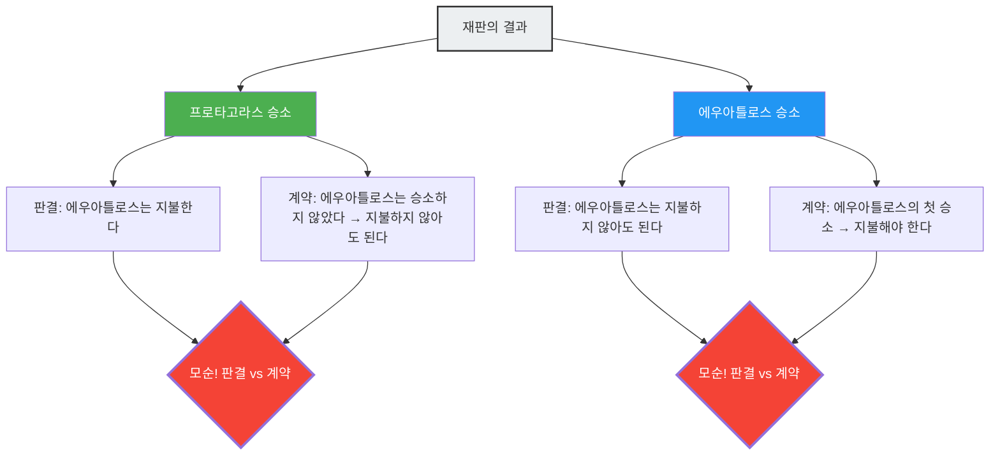

고대 그리스, 가장 위대한 소피스트(변론술 교사)인 프로타고라스에게 에우아틀로스라는 젊은이가 제자로 들어갔습니다. 두 사람 사이에는 다음과 같은 수업료 지불 계약이 체결되었습니다.

> **계약 내용:**
> 에우아틀로스는 변론술의 전 과정을 수료한 후, **첫 번째 재판에서 승소한 시점에** 수업료 잔액을 프로타고라스에게 지불한다.

에우아틀로스는 우수한 학생으로, 변론술의 전 과정을 훌륭히 수료했습니다.
그러나 수료 후, 그는 어찌 된 일인지 단 한 건의 재판도 맡으려 하지 않았습니다. 재판에 나가지 않으면 '첫 번째 재판에서 승소한다'는 조건이 영원히 충족되지 않기 때문에 수업료를 지불할 필요가 없었기 때문입니다.

애가 탄 프로타고라스는 에우아틀로스를 법정에 고소했습니다.
"수업료를 지불하라"고 말이죠.

그리고 여기서부터 논리의 미궁이 시작됩니다.

## 스승 프로타고라스의 논리

프로타고라스는 법정에서 이렇게 주장했습니다.

"재판관님, 어떻게 되든 저의 승리입니다.
- 만약 이 재판에서 **제가 이기면**, 법원의 판결에 따라 에우아틀로스는 저에게 수업료를 지불해야 합니다.
- 만약 이 재판에서 **제가 지면**, 에우아틀로스에게는 '첫 번째 재판에서 승소한' 것이 됩니다. 즉 계약 조건이 충족되어, 그는 계약에 따라 수업료를 지불해야 합니다.

어느 경우든 그는 수업료를 지불할 의무가 있습니다."

## 제자 에우아틀로스의 논리

이에 맞서 에우아틀로스도 지지 않았습니다.

"재판관님, 어떻게 되든 저의 승리입니다.
- 만약 이 재판에서 **제가 이기면**, 법원의 판결에 따라 저는 수업료를 지불할 필요가 없습니다.
- 만약 이 재판에서 **제가 지면**, 저는 아직 '첫 번째 재판에서 승소'하지 않았습니다. 즉 계약 조건이 충족되지 않았기 때문에, 계약상 저는 수업료를 지불할 의무가 없습니다.

어느 경우든 저는 수업료를 지불할 필요가 없습니다."

## 왜 모순되는가

이 역설이 발생하는 근본적인 원인은 **서로 다른 두 가지 규칙 시스템(법률과 계약)이 서로 모순되는 판단을 내리기** 때문입니다.

- **법률의 규칙**: 법원의 판결을 따르라.
- **계약의 규칙**: "첫 번째 재판에서 승소하면 지불한다"는 조건을 따르라.

일반적으로 법률과 계약은 각각 독립적인 도메인으로 기능하지만, 프로타고라스가 "수업료 지불"을 재판의 쟁점으로 삼으면서, 이 재판의 결과 자체가 계약 조건에 영향을 미치게 되어 두 시스템이 자기 언급적인 루프에 빠진 것입니다.

## 법학자들의 답변

고대 로마의 법학자 아울루스 겔리우스는 이 문제에 대해 다음과 같은 해결책을 제시했습니다.

"법원은 에우아틀로스에게 유리한 판결(지불 불필요)을 내려야 한다. 왜냐하면 계약 조건이 아직 충족되지 않은 것은 사실이기 때문이다. 그러나 이 판결 이후, 프로타고라스는 에우아틀로스를 **다시** 고소할 수 있다. 왜냐하면 첫 번째 재판에서 에우아틀로스가 승소함에 따라 계약 조건이 충족되었기 때문이다. 두 번째 재판에서는 프로타고라스가 승소할 것이다."

즉, 역설을 '한 번의 재판으로 동시에 해결'하려고 하면 모순이 발생하지만, '두 번으로 나누어' 처리하면 모순이 해소될 수 있다는 것이 이 답변입니다.

## 자기 언급의 역설과의 연결

프로타고라스의 역설은 '거짓말쟁이의 역설("이 문장은 거짓이다")'이나 '러셀의 역설'과 동일한 **자기 언급 구조**를 가지고 있습니다. 어떤 명제(재판의 결론)가 자기 자신의 진위를 결정하는 조건(계약의 성립)에 영향을 미치게 되는 것입니다.

이러한 종류의 역설은 현대 컴퓨터 과학의 '정지 문제(어떤 프로그램이 정지할지 여부를 판정하는 프로그램은 만들 수 없다)'나 괴델의 불완전성 정리 등, 논리와 계산의 근본적인 한계를 보여주는 문제들과 깊은 관련이 있습니다.

프로타고라스의 역설은 인간이 만든 규칙 시스템(법률이나 계약)이 교묘한 자기 언급에 의해 내부 붕괴될 수 있음을 가르쳐주는, 2400년 전부터 내려온 경고입니다.
