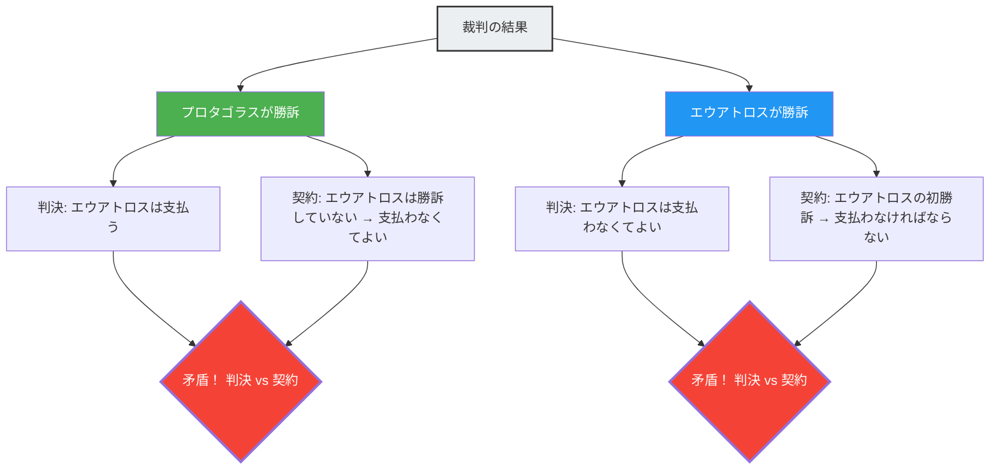

古代ギリシャ、最も偉大なソフィスト（弁論術の教師）であるプロタゴラスに、エウアトロスという若者が弟子入りしました。二人の間には、次のような授業料の支払い契約が結ばれました。

> **契約内容：**
> エウアトロスは弁論術の全課程を修了した後、**最初の裁判に勝訴した時点で**、授業料の残額をプロタゴラスに支払う。

エウアトロスは優秀な生徒で、弁論術の全課程を立派に修了しました。
しかし修了後、彼はなぜか一件も裁判を引き受けようとしません。裁判に出なければ「最初の裁判に勝訴する」という条件が永遠に満たされないため、授業料を払う必要がないからです。

業を煮やしたプロタゴラスは、エウアトロスを裁判所に訴えました。
「授業料を払え」と。

そしてここから、論理の迷宮が始まります。

## 師匠プロタゴラスの論理

プロタゴラスは法廷でこう主張しました。

「裁判官よ、どう転んでも私の勝ちです。
- もしこの裁判で**私が勝てば**、裁判所の判決によりエウアトロスは私に授業料を支払わなければなりません。
- もしこの裁判で**私が負ければ**、エウアトロスにとって『最初の裁判に勝訴した』ことになります。つまり契約の条件が満たされ、彼は契約によって授業料を支払わなければなりません。

どちらの場合でも、彼は授業料を支払う義務があります」

## 弟子エウアトロスの論理

これに対して、エウアトロスも負けていません。

「裁判官よ、どう転んでも私の勝ちです。
- もしこの裁判で**私が勝てば**、裁判所の判決により私は授業料を支払う必要がありません。
- もしこの裁判で**私が負ければ**、私はまだ『最初の裁判に勝訴して』いません。つまり契約の条件が満たされていないため、契約上、私は授業料を支払う義務がありません。

どちらの場合でも、私は授業料を支払う必要がありません」

## なぜ矛盾するのか

このパラドックスが生じる根本原因は、**2つの異なるルールシステム（法律と契約）が互いに矛盾する判断を下す**ことにあります。

- **法律のルール**：裁判所の判決に従え。
- **契約のルール**：「最初の裁判に勝訴したら支払う」という条件に従え。

通常、法律と契約はそれぞれ独立したドメインとして機能しますが、プロタゴラスが「授業料の支払い」を裁判の争点としたことで、この裁判の結果自体が契約の条件に影響を与えてしまい、ふたつのシステムが自己言及的なループに陥ったのです。

## 法学者たちの回答

古代ローマの法学者アウルス・ゲッリウスは、この問題に次のような解決策を提示しました。

「裁判所はエウアトロスに有利な判決（支払い不要）を下すべきである。なぜなら、契約の条件がまだ満たされていないのは事実だからだ。しかし、この判決の後、プロタゴラスはエウアトロスを**再度**訴えることができる。なぜなら、最初の裁判でエウアトロスが勝訴したことにより、契約の条件が満たされたからだ。二度目の裁判では、プロタゴラスが勝訴するだろう」

つまり、パラドックスを「1回の裁判で同時に解決しよう」とすると矛盾が生じるが、「2回に分けて」処理すれば矛盾は解消できるというのがこの回答です。

## 自己言及のパラドックスとの繋がり

プロタゴラスのパラドックスは、「嘘つきのパラドックス（『この文は嘘である』）」や「ラッセルのパラドックス」と同じ**自己言及構造**を持っています。ある命題（裁判の結論）が、自分自身の真偽を決定する条件（契約の成就）に影響を与えてしまうのです。

この種のパラドックスは、現代のコンピュータサイエンスにおける「停止問題（あるプログラムが停止するかどうかを判定するプログラムは作れない）」や、ゲーデルの不完全性定理など、論理と計算の根本的な限界を示す問題と深い関連があります。

プロタゴラスのパラドックスは、人間が作ったルールのシステム（法律や契約）が、巧妙な自己言及によって内部崩壊しうることを教えてくれる、2400年前からの警告なのです。
