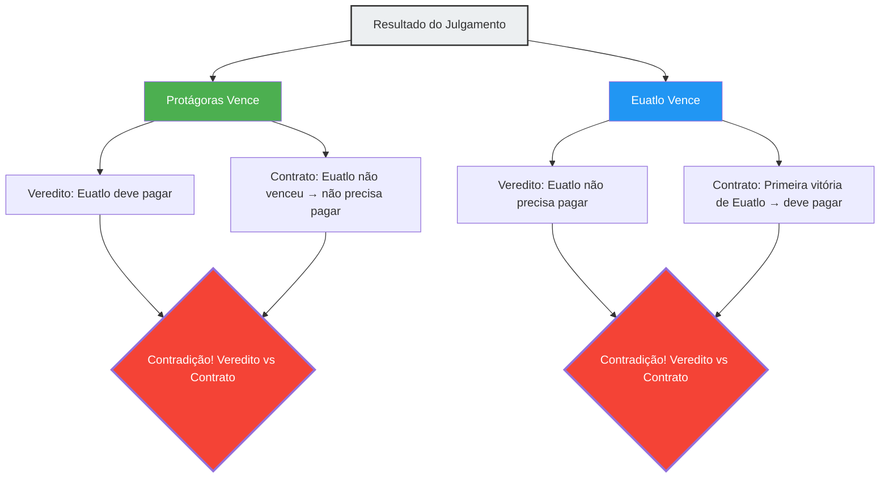

Na Grécia Antiga, um jovem chamado Euatlo tornou-se discípulo de Protágoras, o maior dos sofistas (professores de retórica). Entre os dois, foi firmado o seguinte contrato para o pagamento das aulas:

> **Termos do Contrato:**
> Após concluir o curso completo de retórica, Euatlo pagará o restante das mensalidades a Protágoras **no momento em que vencer o seu primeiro julgamento**.

Euatlo era um aluno brilhante e concluiu com excelência todo o curso de retórica.
No entanto, após a conclusão, por algum motivo, ele não aceitava nenhum caso no tribunal. Como não comparecia a julgamentos, a condição de "vencer o primeiro julgamento" nunca seria satisfeita e, portanto, ele não precisaria pagar as mensalidades.

Protágoras, perdendo a paciência, processou Euatlo no tribunal.
"Pague as mensalidades", exigiu.

E a partir daqui, começa um labirinto lógico.

## A Lógica do Mestre Protágoras

No tribunal, Protágoras argumentou da seguinte forma:

"Juízes, de qualquer maneira eu venço.
- Se **eu vencer** este julgamento, pela decisão do tribunal, Euatlo deverá me pagar as mensalidades.
- Se **eu perder** este julgamento, significará que Euatlo 'venceu o seu primeiro julgamento'. Ou seja, a condição do contrato será satisfeita, e ele deverá pagar as mensalidades conforme o acordo.

Em ambos os casos, ele tem a obrigação de pagar as mensalidades."

## A Lógica do Discípulo Euatlo

Em resposta a isso, Euatlo não ficou atrás:

"Juízes, de qualquer maneira eu venço.
- Se **eu vencer** este julgamento, pela decisão do tribunal, não precisarei pagar as mensalidades.
- Se **eu perder** este julgamento, significará que eu ainda não 'venci o meu primeiro julgamento'. Ou seja, como a condição do contrato não foi satisfeita, pelo contrato, não tenho a obrigação de pagar as mensalidades.

Em ambos os casos, não preciso pagar as mensalidades."

## Por que há contradição?

A causa raiz desse paradoxo está no fato de que **dois sistemas de regras diferentes (a lei e o contrato) emitem julgamentos contraditórios entre si**.

- **Regra da lei**: Obedecer à decisão do tribunal.
- **Regra do contrato**: Obedecer à condição de "pagar se vencer o primeiro julgamento".

Normalmente, a lei e o contrato funcionam como domínios independentes. No entanto, como Protágoras transformou o "pagamento das mensalidades" no ponto de disputa do julgamento, o próprio resultado do julgamento acabou influenciando a condição do contrato, fazendo com que os dois sistemas caíssem em um loop autorreferencial.

## A Resposta dos Juristas

O jurista da Roma Antiga, Aulo Gélio, apresentou a seguinte solução para este problema:

"O tribunal deve dar o veredito a favor de Euatlo (sem necessidade de pagamento). Isso porque é fato que a condição do contrato ainda não foi satisfeita. No entanto, após esse veredito, Protágoras pode processar Euatlo **novamente**. Isso porque, com a vitória de Euatlo no primeiro julgamento, a condição do contrato foi preenchida. No segundo julgamento, Protágoras sairá vencedor."

Em outras palavras, a resposta é que tentar resolver o paradoxo "simultaneamente em um único julgamento" gera contradição, mas se processado "em duas etapas", a contradição pode ser resolvida.

## A Conexão com Paradoxos de Autorreferência

O Paradoxo de Protágoras possui a mesma **estrutura de autorreferência** de paradoxos como o "Paradoxo do Mentiroso ('Esta frase é falsa')" e o "Paradoxo de Russell". Uma determinada proposição (a conclusão do julgamento) afeta a condição (o cumprimento do contrato) que determina a sua própria verdade ou falsidade.

Esse tipo de paradoxo tem uma profunda conexão com problemas que demonstram os limites fundamentais da lógica e da computação, como o "Problema da Parada" (a impossibilidade de criar um programa que determine se outro programa irá parar ou não) e os Teoremas da Incompletude de Gödel na ciência da computação moderna.

O Paradoxo de Protágoras é um aviso de 2.400 anos atrás que nos ensina que os sistemas de regras criados pelo homem (leis e contratos) podem entrar em colapso interno devido a autorreferências engenhosas.
