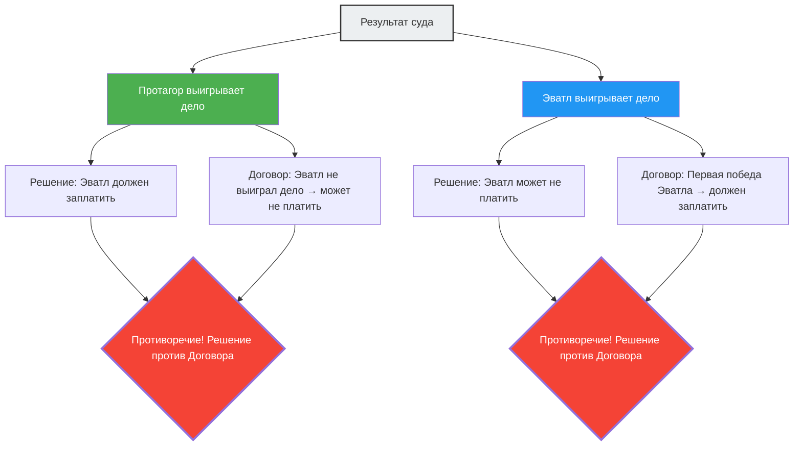

---
title: "Учитель и ученик: суд, в котором победа любой стороны ведет к противоречию — парадокс Протагора"
description: "Судебный спор между учителем и учеником об условиях оплаты обучения. Древнегреческий юридический парадокс, в котором любая победа или поражение приводит к логическому противоречию."
date: 2026-09-10T21:00:00+09:00
draft: false
slug: "paradox-of-the-court"
image: "img/paradox_of_court.jpg"
math: true
mermaid: true
categories: ["Математические парадоксы", "Философия", "Логика"]
tags: ["Парадокс", "Самореференция", "Право", "Протагор", "Логика"]
---

В Древней Греции молодой человек по имени Эватл нанялся в ученики к Протагору, величайшему софисту (учителю риторики). Они заключили следующий договор об оплате обучения:

> **Условия договора:**
> Эватл должен выплатить Протагору оставшуюся часть платы за обучение **после того, как выиграет свой первый судебный процесс**, пройдя полный курс риторики.

Эватл был отличным учеником и блестяще завершил весь курс обучения.
Однако после окончания он почему-то не брался ни за одно судебное дело. Не выступая в суде, условие «выиграть свой первый судебный процесс» никогда не выполнялось бы, поэтому ему не нужно было бы платить за обучение.

Протагор, потеряв терпение, подал на Эватла в суд.
С требованием: «Заплати за обучение».

И здесь начинается логический лабиринт.

## Логика учителя Протагора

В суде Протагор заявил следующее:

«О судьи, при любом исходе я выигрываю.
- Если в этом суде **выиграю я**, по решению суда Эватл должен будет выплатить мне деньги за обучение.
- Если в этом суде **я проиграю**, для Эватла это будет означать, что он «выиграл свой первый судебный процесс». То есть условия договора будут выполнены, и по договору он обязан заплатить за обучение.

В любом случае, он обязан заплатить за обучение».

## Логика ученика Эватла

На это Эватл ответил не менее достойно:

«О судьи, при любом исходе я выигрываю.
- Если в этом суде **выиграю я**, по решению суда мне не нужно будет платить за обучение.
- Если в этом суде **я проиграю**, я еще не «выиграл свой первый судебный процесс». То есть условия договора не будут выполнены, и по договору я не обязан платить за обучение.

В любом случае, мне не нужно платить за обучение».

## Почему возникает противоречие?

Основная причина этого парадокса кроется в том, что **две разные системы правил (закон и договор) выносят противоречащие друг другу решения**.

- **Правило закона**: Подчиняйтесь решению суда.
- **Правило договора**: Подчиняйтесь условию «заплатить после победы в первом суде».

Обычно закон и договор функционируют как независимые области, но поскольку Протагор сделал предметом судебного спора «плату за обучение», сам результат этого суда повлиял на условия договора, из-за чего обе системы попали в самореферентную петлю.

## Ответ правоведов

Древнеримский юрист Авл Геллий предложил следующее решение этой проблемы.

«Суд должен вынести решение в пользу Эватла (отсутствие необходимости платить). Потому что факт в том, что условия договора еще не выполнены. Однако после этого решения Протагор может подать в суд на Эватла **снова**. Поскольку Эватл выиграл свой первый судебный процесс, условия договора теперь выполнены. Во втором суде победа будет за Протагором».

Иными словами, ответ заключается в том, что если попытаться «решить парадокс за один судебный процесс», возникнет противоречие, но если разделить процесс на «два этапа», противоречие можно разрешить.

## Связь с парадоксом самореференции

Парадокс Протагора имеет ту же **структуру самореференции**, что и «Парадокс лжеца» («Это утверждение ложно») и «Парадокс Рассела». Определенное утверждение (решение суда) влияет на условие, которое определяет его собственную истинность или ложность (выполнение договора).

Такого рода парадоксы глубоко связаны с проблемами, демонстрирующими фундаментальные пределы логики и вычислений, такими как «Проблема остановки» в современной информатике (невозможно создать программу, которая бы определяла, остановится ли любая другая программа) и теорема Гёделя о неполноте.

Парадокс Протагора — это предупреждение 2400-летней давности о том, что созданные человеком системы правил (законы и договоры) могут рухнуть изнутри из-за изощренной самореференции.
