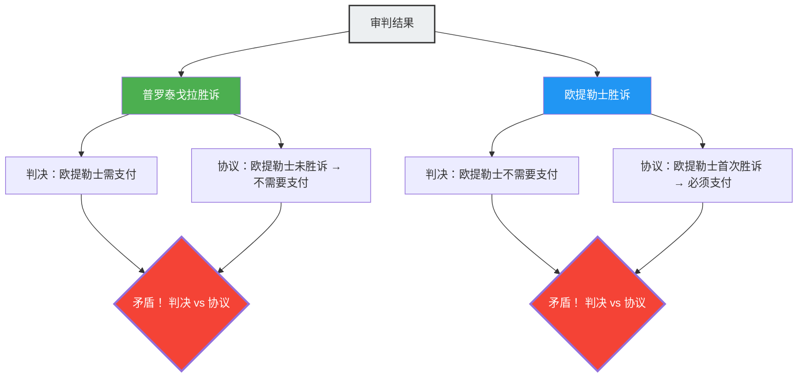

---
title: "师徒之争，无论谁赢都矛盾的法庭：普罗泰戈拉悖论"
description: "一场围绕学费支付条件的师徒法庭争论。无论谁胜诉或败诉，逻辑都会陷入矛盾的古希腊法律悖论。"
date: 2026-09-10T21:00:00+09:00
draft: false
slug: "paradox-of-the-court"
image: "img/paradox_of_court.jpg"
math: true
mermaid: true
categories: ["数学悖论", "哲学", "逻辑学"]
tags: ["悖论", "自我指涉", "法律", "普罗泰戈拉", "逻辑"]
---

在古希腊，一位名叫欧提勒士的年轻人拜在最伟大的智者（雄辩术教师）普罗泰戈拉门下学习。两人之间达成了如下的学费支付协议。

> **协议内容：**
> 欧提勒士在完成全部雄辩术课程后，**在他赢得第一场官司时**，向普罗泰戈拉支付剩余的学费。

欧提勒士是一名优秀的学生，顺利完成了雄辩术的全部课程。
然而，毕业后他却不知为何不愿接手任何案件。因为只要他不上法庭，“赢得第一场官司”的条件就永远无法满足，所以他就不需要支付学费。

普罗泰戈拉对此感到非常恼火，于是将欧提勒士告上了法庭。
要求“支付学费”。

从此，逻辑的迷宫便展开了。

## 师傅普罗泰戈拉的逻辑

普罗泰戈拉在法庭上这样主张：

“法官大人，无论如何都是我赢。
- 如果在这场官司中**我胜诉了**，根据法院的判决，欧提勒士必须向我支付学费。
- 如果在这场官司中**我败诉了**，对欧提勒士来说就意味着『赢得了第一场官司』。也就是说，协议条件得到满足，他必须按照协议支付学费。

无论哪种情况，他都有义务支付学费。”

## 徒弟欧提勒士的逻辑

对此，欧提勒士也不甘示弱：

“法官大人，无论如何都是我赢。
- 如果在这场官司中**我胜诉了**，根据法院的判决，我不需要支付学费。
- 如果在这场官司中**我败诉了**，我还没有『赢得第一场官司』。也就是说，由于协议条件尚未满足，根据协议，我没有支付学费的义务。

无论哪种情况，我都不需要支付学费。”

## 为什么会产生矛盾

这个悖论产生的根本原因在于，**两个不同的规则系统（法律与协议）做出了互相矛盾的判断**。

- **法律规则**：服从法院的判决。
- **协议规则**：服从“赢得第一场官司就支付”的条件。

通常，法律和协议分别作为独立的领域运作，但由于普罗泰戈拉将“学费的支付”作为诉讼的焦点，导致这场官司的结果本身影响了协议的条件，从而使两个系统陷入了自我指涉的循环。

## 法学家的回答

古罗马法学家奥鲁斯·格利乌斯对这个问题提出了如下的解决方案：

“法院应该做出有利于欧提勒士的判决（不需要支付）。因为协议的条件尚未满足，这是事实。但是，在这个判决之后，普罗泰戈拉可以**再次**起诉欧提勒士。因为由于在第一场官司中欧提勒士胜诉，协议的条件已经满足了。在第二次的官司中，普罗泰戈拉将会胜诉。”

也就是说，如果想“通过一次审判同时解决”悖论就会产生矛盾，但如果“分两次”处理就能消除矛盾，这就是这个回答。

## 与自我指涉悖论的联系

普罗泰戈拉悖论与“说谎者悖论（『这句话是谎言』）”和“罗素悖论”具有相同的**自我指涉结构**。某个命题（审判的结论）影响了决定其自身真伪的条件（协议的达成）。

这种类型的悖论，与现代计算机科学中的“停机问题（无法编写出一个程序来判断另一个程序是否会停止）”，以及哥德尔不完备定理等揭示逻辑与计算根本极限的问题有着深刻的联系。

普罗泰戈拉悖论是一个来自2400年前的警告，它告诉我们，人类制定的规则系统（法律或协议）可能会因为巧妙的自我指涉而发生内部崩溃。
