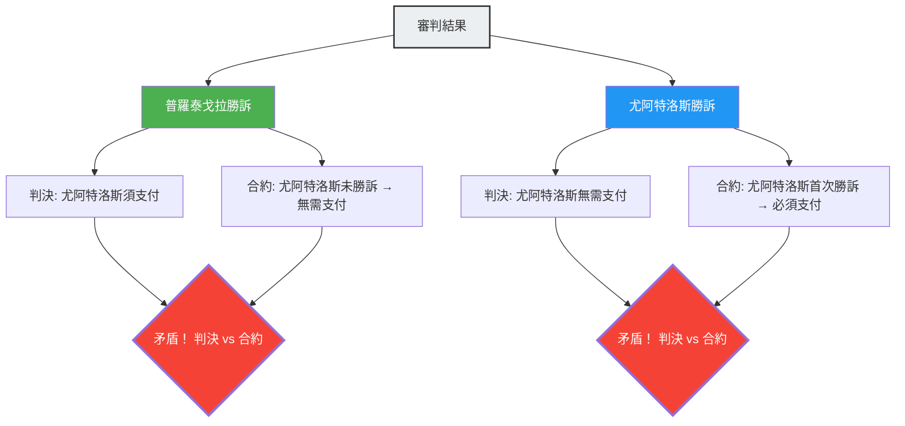

---
title: "師傅與徒弟，無論誰勝訴都矛盾的審判：普羅泰戈拉悖論"
description: "圍繞學費支付條件的師徒法庭爭論。無論誰勝誰負，邏輯上都會產生矛盾的古希臘法律悖論。"
date: 2026-09-10T21:00:00+09:00
draft: false
slug: "paradox-of-the-court"
image: "img/paradox_of_court.jpg"
math: true
mermaid: true
categories: ["數學悖論", "哲學", "邏輯學"]
tags: ["悖論", "自我指涉", "法律", "普羅泰戈拉", "邏輯"]
---

在古希臘，一位名叫尤阿特洛斯（Euathlus）的年輕人拜了最偉大的智者（修辭學教師）普羅泰戈拉（Protagoras）為師。兩人之間簽訂了以下關於學費支付的合約。

> **合約內容：**
> 尤阿特洛斯在完成所有修辭學課程後，**在第一次贏得法庭訴訟時**，須向普羅泰戈拉支付剩餘的學費。

尤阿特洛斯是一名優秀的學生，出色地完成了所有修辭學課程。
然而畢業後，他卻不知為何不肯接手任何訴訟案件。因為只要不上法庭，「第一次贏得法庭訴訟」的條件就永遠不會滿足，他也就無需支付學費。

失去耐心的普羅泰戈拉將尤阿特洛斯告上了法庭。
要求他「支付學費」。

於是，邏輯的迷宮便由此展開。

## 師傅普羅泰戈拉的邏輯

普羅泰戈拉在法庭上如此主張：

「法官大人，無論結果如何，都是我贏。
- 如果在這場訴訟中**我勝訴了**，根據法庭的判決，尤阿特洛斯必須向我支付學費。
- 如果在這場訴訟中**我敗訴了**，對尤阿特洛斯而言就意味著『第一次贏得法庭訴訟』。也就是說滿足了合約的條件，根據合約他必須支付學費。

無論是哪種情況，他都有義務支付學費。」

## 徒弟尤阿特洛斯的邏輯

對此，尤阿特洛斯也不甘示弱。

「法官大人，無論結果如何，都是我贏。
- 如果在這場訴訟中**我勝訴了**，根據法庭的判決，我無需支付學費。
- 如果在這場訴訟中**我敗訴了**，我就還沒有『第一次贏得法庭訴訟』。也就是說合約的條件尚未滿足，根據合約，我沒有義務支付學費。

無論是哪種情況，我都無需支付學費。」

## 為何會產生矛盾

這個悖論產生的根本原因在於，**兩個不同的規則系統（法律與合約）做出了互相矛盾的判斷**。

- **法律規則**：服從法庭的判決。
- **合約規則**：服從「第一次贏得法庭訴訟時支付」的條件。

通常情況下，法律和合約分別作為獨立的領域運作，但由於普羅泰戈拉將「支付學費」作為訴訟的爭議點，這場審判的結果本身就影響了合約的條件，使得這兩個系統陷入了自我指涉（self-referential）的迴圈中。

## 法學家們的解答

古羅馬法學家奧魯斯·格利烏斯（Aulus Gellius）對這個問題提出了以下的解決方案。

「法庭應該做出對尤阿特洛斯有利的判決（無需支付）。因為合約的條件確實尚未滿足。但是，在這場判決之後，普羅泰戈拉可以**再次**起訴尤阿特洛斯。因為尤阿特洛斯在第一次訴訟中勝訴，合約的條件已經滿足了。在第二次訴訟中，普羅泰戈拉將會勝訴。」

換句話說，如果試圖「在一次審判中同時解決」悖論就會產生矛盾，但如果「分兩次」處理就能夠化解矛盾，這就是這個解答的精髓。

## 與自我指涉悖論的關聯

普羅泰戈拉悖論與「說謊者悖論（『這句話是謊言』）」和「羅素悖論」具有相同的**自我指涉結構**。某個命題（審判的結論）影響了決定其自身真假的條件（合約的達成）。

這類悖論與現代計算機科學中的「停機問題（無法編寫出一個能判斷任意程式是否會停止的程式）」以及哥德爾不完備定理等，揭示邏輯與計算根本侷限的問題有著深厚的關聯。

普羅泰戈拉悖論是一個來自2400年前的警告，它告訴我們，人類制定的規則系統（如法律或合約）可能會因為巧妙的自我指涉而從內部崩潰。
