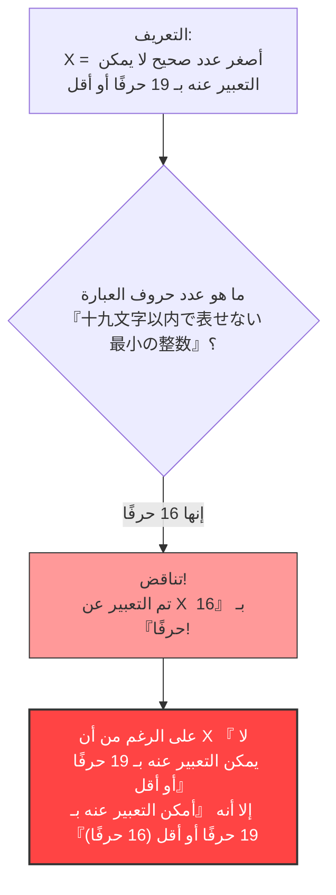

## 1. التعبير عن الأرقام بالكلمات

نحن نستخدم في حياتنا اليومية ليس فقط "الأرقام العربية (1، 2، 3...)" بل أيضًا "الكلمات (مثل اليابانية أو الإنجليزية)" للتعبير عن الأرقام.

على سبيل المثال، الرقم "$10$" يمكن التعبير عنه بكلمات مختلفة كما يلي:
- "عشرة" (في اليابانية: じゅう - 3 حروف)
- "ضعف الخمسة" (في اليابانية: ごの2ばい - 5 حروف)
- "عُشر المائة" (في اليابانية: ひゃくの10ぶんの1 - 9 حروف)

دعونا نفكر في وصف رقم معين باستخدام "الحروف اليابانية" على هذا النحو.
سنضع حدًا لعدد الحروف المسموح باستخدامها. هنا سنفكر في الأرقام التي يمكن التعبير عنها باللغة اليابانية بـ **"19 حرفًا أو أقل"**.

بالطبع، هناك **حد** للأرقام التي يمكن التعبير عنها في حدود 19 حرفًا.
ذلك لأن أنواع الحروف اليابانية (هيراغانا، كاتاكانا، كانجي وغيرها) محدودة، والتراكيب الممكنة لترتيبها في 19 حرفًا أو أقل هي أيضًا محدودة (رغم أنها ستكون رقمًا فلكيًا، إلا أنها ليست لا نهائية).

بعبارة أخرى، لا بد أن يوجد دائمًا **"عدد صحيح ضخم لا يمكن التعبير عنه أبدًا بـ 19 حرفًا أو أقل باللغة اليابانية"**.

---

## 2. ولادة المفارقة

حسنًا، من هنا يبدأ الموضوع الرئيسي.
توجد أعداد لا حصر لها من "الأعداد الصحيحة التي لا يمكن التعبير عنها بـ 19 حرفًا أو أقل باللغة اليابانية".
لنفترض أننا بحثنا ووجدنا **"أصغرها (أصغر عدد صحيح)"** من بين تلك الأعداد التي لا حصر لها والتي لا يمكن التعبير عنها.

سنطلق على هذا الرقم اسم $X$.
بحكم التعريف، $X$ هو أصغر عدد من بين "الأعداد التي لا يمكن التعبير عنها بـ 19 حرفًا أو أقل باللغة اليابانية"، لذلك يمكننا تسميته كالتالي:

**"じゅうきゅうもじいないであらわせないさいしょうのせいすう"** (أصغر عدد صحيح لا يمكن التعبير عنه بتسعة عشر حرفًا أو أقل)

دعونا نعد عدد الحروف (في اليابانية باستخدام الهيراغانا).
「じゅ・う・きゅ・う・も・じ・い・な・い・で・あ・ら・わ・せ・な・い・さ・い・しょ・う・の・せ・い・す・う」
... مهلاً؟ حتى لو أزلنا علامات الترقيم، سنجد أنها 25 حرفًا.
بهذا الشكل، فقد تجاوزنا حد الـ "19 حرفًا".

إذن، دعونا نبتكر طريقة أخرى للتعبير ونستخدم الكانجي لتقصيرها.

**"十九文字以内で表せない最小の整数"**

حسنًا، حاول عد عدد حروف هذه العبارة اليابانية:

1. 十
2. 九
3. 文
4. 字
5. 以
6. 内
7. で
8. 表
9. せ
10. な
11. い
12. 最
13. 小
14. の
15. 整
16. 数

يا للعجب، إنها **"16 حرفًا" فقط**.

لقد حدث شيء غريب.
نحن الآن قد عبرنا عن الرقم $X$ باستخدام **"16 حرفًا يابانيًا" في العبارة "十九文字以内で表せない最小の整数"**!

من المفترض أن $X$ هو رقم "لا يمكن التعبير عنه بـ 19 حرفًا أو أقل"، لكن كلمات التعريف نفسها تعبر عن $X$ بشكل كامل بـ "16 حرفًا (أقل من 19 حرفًا)".
هذا هو ما يُعرف بـ **"مفارقة بيري (Berry Paradox)"**.

---

## 3. من الذي ابتكر هذه المفارقة؟

ابتكر هذه المفارقة شخص يُدعى **جي. جي. بيري** (G. G. Berry)، والذي كان يعمل أمين مكتبة في جامعة أكسفورد في عام 1904.
وبعد ذلك، قام عالم الرياضيات والفيلسوف العبقري الذي يمثل القرن العشرين، **بيرتراند راسل**، بتقديمها في إحدى أوراقه البحثية، مما أدى إلى انتشارها في جميع أنحاء العالم.

(※ في الورقة البحثية الأصلية باللغة الإنجليزية، استُخدم التعبير "The least integer not nameable in fewer than nineteen syllables" (أصغر عدد صحيح لا يمكن تسميته بأقل من تسعة عشر مقطعًا لفظيًا)، وتمت صياغة المفارقة بحيث تتحقق بناءً على عدد المقاطع اللفظية في اللغة الإنجليزية.)

---

## 4. لماذا حدث هذا التناقض؟

السبب الجذري لهذه المفارقة يكمن في **الغموض** و**المرجعية الذاتية** التي تتميز بها "اللغات الطبيعية (مثل اليابانية والإنجليزية وغيرها)" التي نستخدمها في حياتنا اليومية.

### اللغة الطبيعية لا تستطيع تحمل صرامة الرياضيات
في عالم الرياضيات، يعتبر "تعريف الأرقام" عملية صارمة للغاية (حيث تُستخدم المعادلات والرموز).
ولكن في مفارقة بيري، حاولنا تعريف كائن رياضي (عدد صحيح) باستخدام **اللغة اليومية** للبشر مثل "يمكن التعبير عنه" و"لا يمكن التعبير عنه".

اللغة اليومية قوية ومرنة للغاية، وبسبب هذه المرونة، يمكننا القيام بأشياء بهلوانية مثل "الإشارة إلى عدد حروفها نفسها".
ونتيجة لذلك، حدث تناقض ذاتي (مفارقة المرجعية الذاتية) حيث "التعريف نفسه يكسر قاعدة التعريف".

### ماذا يعني "أن يُسمى"؟
بالإضافة إلى ذلك، فإن تعريف عبارة "يمكن التعبير عنه بـ 16 حرفًا" هو أيضًا غامض.
عبارة "أصغر عدد صحيح لا يمكن التعبير عنه بـ 19 حرفًا أو أقل" **لا تشير بشكل مباشر** إلى رقم محدد ومعين (مثل الرقم $987654321...$).
إنها ببساطة **تصف بشكل غير مباشر** قائلة: "يجب أن يكون هناك رقم يستوفي هذه الشروط".

رياضياً، يجب التمييز بوضوح بين "التعبير عنه بطريقة قابلة للحساب بشكل مباشر" و"ذكر شروط غير مباشرة بالكلمات". هناك خدعة منطقية مخفية في الخلط بين هذين الأمرين والادعاء بأنه "تم التعبير عنه بـ 16 حرفًا!".

---

## 5. الخلاصة وتأثيرها على العصر الحديث

قد تبدو مفارقة بيري للوهلة الأولى مجرد "تلاعب بالكلمات" أو "دعابة".
ولكن هذه المشكلة جعلت علماء الرياضيات في القرن العشرين يدركون بعمق **"خطر بناء أسس الرياضيات باستخدام اللغة اليومية"**.

"يجب ألا نعرّف الأرقام بالكلمات. يجب بناء الرياضيات بالكامل باستخدام رموز صارمة ومستقلة تمامًا."

أصبحت هذه المفارقة علامة إرشادية هامة أدت إلى تطورات في العلوم المتطورة، مثل "مبرهنات عدم الاكتمال لغودل" (التي تنص على وجود حقائق في الرياضيات لا يمكن إثباتها أبدًا) التي غيرت تاريخ الرياضيات لاحقًا، و"تعقيد كولموغوروف" في علوم الكمبيوتر (وهي نظرية حول مدى قصر ضغط المعلومات).

إن 16 حرفًا يابانيًا فقط كانت كفيلة بكشف حدود الرياضيات. هذا هو الجمال الكامن في مفارقة بيري.
