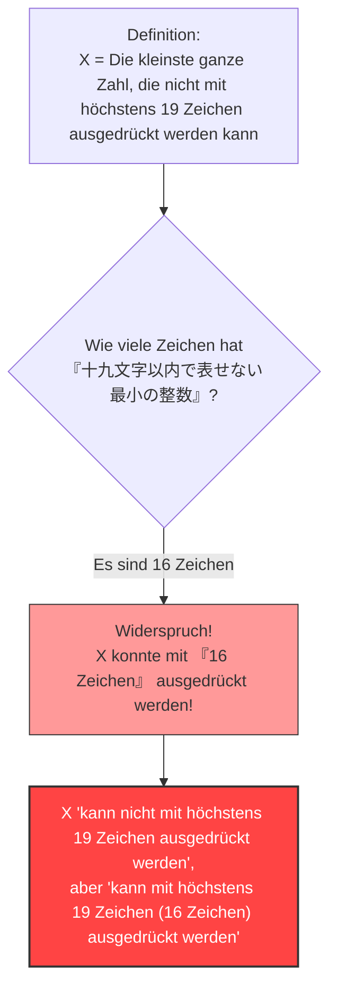

## 1. Zahlen mit Wörtern ausdrücken

Wir drücken Zahlen im Alltag nicht nur mit "arabischen Ziffern (1, 2, 3...)" aus, sondern auch mit "Wörtern (Japanisch, Deutsch usw.)".

Zum Beispiel kann die Zahl "$10$" auf verschiedene Weise in japanischen Zeichen ausgedrückt werden:
- "じゅう" (Zehn, 3 Zeichen)
- "ごの2ばい" (Das Zweifache von fünf, 5 Zeichen)
- "ひゃくの10ぶんの1" (Ein Zehntel von hundert, 9 Zeichen)

Lassen Sie uns darüber nachdenken, eine bestimmte Zahl mit "japanischen Zeichen" zu beschreiben.
Wir setzen eine Grenze für die Anzahl der Zeichen, die verwendet werden dürfen. Hier betrachten wir Zahlen, die mit **"höchstens 19 Zeichen"** im Japanischen ausgedrückt werden können.

Natürlich gibt es eine **Grenze** für die Zahlen, die mit höchstens 19 Zeichen ausgedrückt werden können.
Die Anzahl der Arten japanischer Zeichen (Hiragana, Katakana, Kanji usw.) ist endlich, und die Kombinationen, diese in 19 Zeichen oder weniger anzuordnen, sind ebenfalls endlich (es ist eine astronomisch große Zahl, aber nicht unendlich).

Das bedeutet, dass es unweigerlich eine **"riesige ganze Zahl gibt, die unmöglich in japanischer Sprache mit 19 Zeichen oder weniger ausgedrückt werden kann"**.

---

## 2. Die Entstehung des Paradoxons

Nun kommen wir zum Hauptpunkt.
Es gibt unzählig viele "ganze Zahlen, die nicht mit 19 japanischen Zeichen oder weniger ausgedrückt werden können".
Nehmen wir an, wir finden aus dieser unzähligen Menge von nicht ausdrückbaren Zahlen **"die kleinste (die kleinste ganze Zahl)"**.

Nennen wir diese Zahl $X$.
Da $X$ per Definition die kleinste unter den "Zahlen ist, die nicht in 19 japanischen Zeichen oder weniger ausgedrückt werden können", können wir sie wie folgt nennen:

**"じゅうきゅうもじいないであらわせないさいしょうのせいすう"** (Die kleinste ganze Zahl, die nicht mit höchstens neunzehn Zeichen ausgedrückt werden kann)

Lassen Sie uns die Zeichen zählen.
"じゅ・う・きゅ・う・も・じ・い・な・い・で・あ・ら・わ・せ・な・い・さ・い・しょ・う・の・せ・い・す・う"
...Nanu? Selbst ohne Satzzeichen sind es 25 Zeichen, nicht wahr?
Das überschreitet "19 Zeichen".

Lassen Sie uns den Ausdruck ein wenig anpassen und ihn mithilfe von Kanji kürzer machen.

**「十九文字以内で表せない最小の整数」**

Zählen Sie nun die Anzahl der Zeichen in diesem japanischen Ausdruck:

1. 十
2. 九
3. 文
4. 字
5. 以
6. 内
7. で
8. 表
9. せ
10. な
11. い
12. 最
13. 小
14. の
15. 整
16. 数

Erstaunlicherweise sind es **nur "16 Zeichen"**.

Hier passiert etwas Seltsames.
Wir haben soeben die Zahl $X$ mit **einem japanischen Ausdruck von "16 Zeichen" ("十九文字以内で表せない最小の整数") ausgedrückt**!

Obwohl $X$ eine Zahl sein soll, die "nicht mit höchstens 19 Zeichen ausgedrückt werden kann", hat der genaue Wortlaut der Definition selbst $X$ in "16 Zeichen (höchstens 19 Zeichen)" perfekt ausgedrückt.
Das ist das **"Berry-Paradoxon (Berry Paradox)"**.

---

## 3. Wer hat dieses Paradoxon erschaffen?

Dieses Paradoxon wurde 1904 von einem Bibliothekar der Universität Oxford namens **G. G. Berry** erdacht.
Es wurde weltweit bekannt, als der geniale Mathematiker und Philosoph des 20. Jahrhunderts, **Bertrand Russell**, es in seiner eigenen Arbeit vorstellte.

(*In der englischen Originalarbeit wurde der Ausdruck "The least integer not nameable in fewer than nineteen syllables" (die kleinste ganze Zahl, die nicht mit weniger als neunzehn Silben benannt werden kann) verwendet, und das Paradoxon ist so konstruiert, dass es mit der Anzahl der englischen Silben funktioniert.)

---

## 4. Warum ist der Widerspruch entstanden?

Die grundlegende Ursache für dieses Paradoxon liegt in der **Mehrdeutigkeit** und **Selbstreferenz**, die den "natürlichen Sprachen (wie Japanisch oder Englisch)", die wir täglich verwenden, innewohnt.

### Natürliche Sprachen können der Strenge der Mathematik nicht standhalten
In der Welt der Mathematik ist das "Definieren einer Zahl" ein sehr strenger Prozess (unter Verwendung von Gleichungen und Symbolen).
Beim Berry-Paradoxon wurde jedoch der Versuch unternommen, ein mathematisches Objekt (eine ganze Zahl) mithilfe unserer **Alltagssprache** ("kann ausgedrückt werden", "kann nicht ausgedrückt werden") zu definieren.

Die Alltagssprache ist sehr mächtig und flexibel, aber gerade wegen dieser Flexibilität erlaubt sie akrobatische Dinge wie das "Bezugnehmen auf die eigene Zeichenanzahl".
Infolgedessen entsteht ein Selbstwiderspruch (Paradoxon der Selbstreferenz), bei dem "die Definition selbst die Regeln der Definition bricht".

### Was bedeutet "benannt werden"?
Außerdem ist die Definition der Worte "kann mit 16 Zeichen ausgedrückt werden" mehrdeutig.
Die Phrase "die kleinste ganze Zahl, die nicht mit höchstens 19 Zeichen ausgedrückt werden kann" zeigt **nicht direkt** auf eine bestimmte, konkrete Zahl (wie zum Beispiel $987654321...$).
Sie **beschreibt lediglich indirekt**, dass "es eine Zahl geben muss, die diese Bedingung erfüllt".

Mathematisch muss streng unterschieden werden zwischen "etwas in einer direkt berechenbaren Form ausdrücken" und "eine indirekte Bedingung in Worten angeben". Der logische Trick liegt darin, diese beiden zu verwechseln und zu behaupten: "Ich konnte es in 16 Zeichen ausdrücken!"

---

## 5. Fazit und Auswirkungen auf die Moderne

Auf den ersten Blick mag das Berry-Paradoxon wie ein bloßes "Wortspiel" oder ein "Rätsel" erscheinen.
Dieses Problem veranlasste jedoch die Mathematiker des 20. Jahrhunderts dazu, **"die Gefahr der Verwendung der Alltagssprache zur Grundlegung der Mathematik"** zutiefst zu erkennen.

"Man darf Zahlen nicht mit Wörtern definieren. Die Mathematik muss vollständig aus unabhängigen, strengen Symbolen aufgebaut sein."

Dieses Paradoxon wurde zu einem wichtigen Meilenstein, der zur fortgeschrittenen akademischen Forschung führte, wie beispielsweise zum "Gödelschen Unvollständigkeitssatz (es gibt in der Mathematik Wahrheiten, die niemals bewiesen werden können)", der die Geschichte der Mathematik veränderte, und zur "Kolmogorow-Komplexität (eine Theorie darüber, wie kurz Informationen komprimiert werden können)" in der Informatik.

Nur 16 japanische Zeichen enthüllten die Grenzen der Mathematik. Darin liegt die Schönheit des Berry-Paradoxons.
