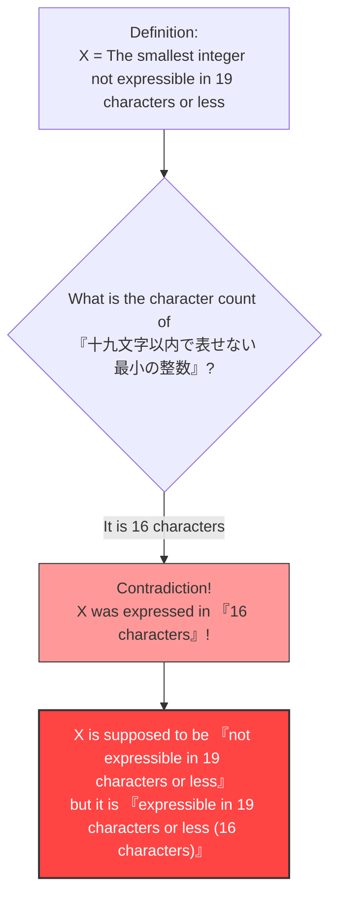

## 1. Expressing Numbers with Words

We routinely express numbers not only using "Arabic numerals (1, 2, 3...)" but also using "words (Japanese, English, etc.)".

For example, the number "$10$" can be expressed in various words as follows:
- "じゅう" (jū: 3 characters)
- "ごの2ばい" (twice five: 5 characters)
- "ひゃくの10ぶんの1" (one tenth of a hundred: 9 characters)

In this way, let's consider explaining a certain number using "Japanese characters".
We will set a limit on the number of characters we can use. Here, let's consider numbers that can be expressed in Japanese using **"19 characters or less"**.

Naturally, there is a **limit** to the numbers that can be expressed in 19 characters or less.
The number of Japanese character types (hiragana, katakana, kanji, etc.) is finite, and the number of combinations arranging them in 19 characters or less is also finite (it will be an astronomical number, but it is not infinite).

In other words, there absolutely must exist **"huge integers that simply cannot be fully expressed in Japanese using 19 characters or less"**.

---

## 2. Birth of the Paradox

Now, here is the main point.
There are countless "integers that cannot be expressed in Japanese using 19 characters or less".
Suppose we find the **"smallest one (the least integer)"** among those countless unexpressible numbers.

Let's call that number $X$.
Since $X$ is by definition the smallest among the "numbers that cannot be expressed in Japanese using 19 characters or less", we can refer to it as follows:

**"じゅうきゅうもじいないであらわせないさいしょうのせいすう"** (the smallest integer not expressible in nineteen characters or less)

Let's count the number of characters.
"じゅ・う・きゅ・う・も・じ・い・な・い・で・あ・ら・わ・せ・な・い・さ・い・しょ・う・の・せ・い・す・う"
...Wait? Even without the punctuation, there are 25 characters.
This exceeds "19 characters".

So, let's tweak the expression a bit and use kanji to make it shorter.

**「十九文字以内で表せない最小の整数」**

Now, please count the number of characters in this Japanese phrase.

1. 十
2. 九
3. 文
4. 字
5. 以
6. 内
7. で
8. 表
9. せ
10. な
11. い
12. 最
13. 小
14. の
15. 整
16. 数

Surprisingly, it is **only "16 characters"**.

Something strange has happened.
We have just expressed the number $X$ using the **"16 Japanese characters"** in the phrase **"十九文字以内で表せない最小の整数"**!

Even though $X$ is supposed to be a number that "cannot be expressed in 19 characters or less", the very words defining it perfectly express $X$ in "16 characters (which is 19 characters or less)".
This is the **"Berry Paradox"**.

---

## 3. Who Created This Paradox?

This paradox was devised in 1904 by a person named **G. G. Berry**, a librarian at Oxford University.
It spread worldwide after the genius mathematician and philosopher representing the 20th century, **Bertrand Russell**, introduced it in his own paper.

(*In the original English paper, the expression "The least integer not nameable in fewer than nineteen syllables" was used, and the paradox was constructed to work with the number of syllables in English.)

---

## 4. Why Did the Contradiction Occur?

The fundamental cause of this paradox lies in the **ambiguity** and **self-reference** of the "natural languages (such as Japanese or English)" that we usually use.

### Natural Language Cannot Withstand the Rigor of Mathematics
In the world of mathematics, "defining a number" is a highly rigorous process (using equations and symbols).
However, in the Berry Paradox, an attempt was made to define a mathematical object (an integer) using the **everyday language** of humans, such as "expressible" or "not expressible".

Everyday language is incredibly powerful and flexible, but due to that flexibility, it allows for acrobatic feats like "referring to its own character count".
As a result, it caused a self-contradiction (a paradox of self-reference) where "the definition itself breaks the rules of the definition."

### What Does It Mean to Be "Nameable"?
Furthermore, the definition of the phrase "expressible in 16 characters" is also ambiguous.
The phrase "the smallest integer not expressible in 19 characters or less" **does not directly point** to a specific, concrete number (like $987654321...$, for example).
It **merely describes indirectly** that "there must be a number satisfying the condition."

Mathematically, a clear distinction must be made between "expressing in a directly calculable form" and "stating indirect conditions in words." The logical trick is hidden in the fact that these two are conflated to claim, "It could be expressed in 16 characters!"

---

## 5. Summary and Impact on the Modern Era

At first glance, the Berry Paradox seems like a mere "wordplay" or "riddle".
However, this problem served as a catalyst that made 20th-century mathematicians deeply recognize the **"danger of building the foundations of mathematics using everyday language"**.

"We must not define numbers with words. Mathematics must be constructed entirely and exclusively with independent, rigorous symbols."

This paradox became an important milestone leading to cutting-edge studies that changed the history of mathematics, such as "Gödel's incompleteness theorems" (there are truths in mathematics that can never be proven) and "Kolmogorov complexity" (the theory of how short information can be compressed) in computer science.

Just 16 characters of Japanese exposed the limits of mathematics. That is the beauty of the Berry Paradox.
