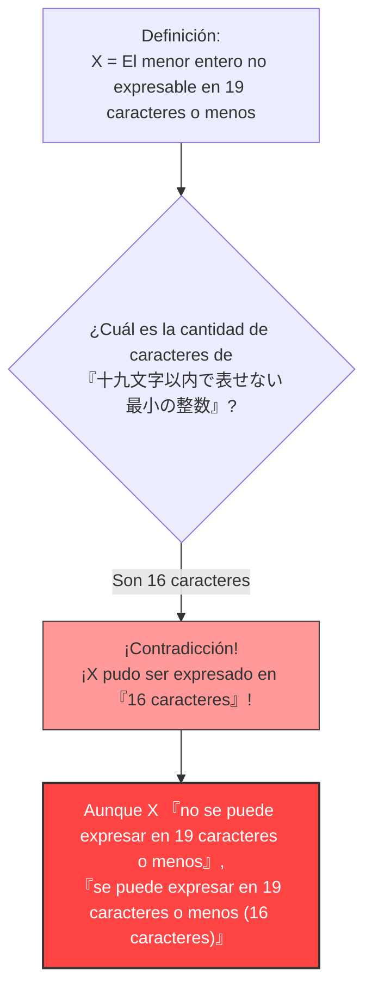

## 1. Expresar números con palabras

A diario, no solo expresamos los números con "números arábigos (1, 2, 3...)", sino también usando "palabras" (en japonés, español, inglés, etc.).

Por ejemplo, el número "$10$" se puede expresar de varias maneras con palabras:
- "diez" (4 letras)
- "el doble de cinco" (15 letras)
- "la décima parte de cien" (21 letras)

Consideremos cómo explicar un cierto número utilizando "caracteres o letras".
Estableceremos un límite en la cantidad de caracteres que podemos usar. Aquí pensaremos en números que se pueden expresar utilizando **"19 caracteres o menos"**.

Naturalmente, existe un **límite** para los números que se pueden expresar en 19 caracteres o menos.
La cantidad de caracteres (letras, símbolos, caracteres japoneses, etc.) es finita, y las combinaciones de ellos alineados en 19 caracteres o menos también es finita (es un número astronómico, pero no es infinito).

En otras palabras, obligatoriamente existirá un **"entero gigante que de ninguna manera se puede expresar en 19 caracteres o menos"**.

---

## 2. El nacimiento de la paradoja

Ahora, aquí viene el tema principal.
Existen infinitos "enteros que no se pueden expresar en 19 caracteres o menos".
Supongamos que de esos infinitos números inexpresables, encontramos **"el más pequeño (el entero mínimo)"**.

Llamaremos a ese número $X$.
Por definición, $X$ es el más pequeño entre "los números que no se pueden expresar en 19 caracteres o menos", por lo que podemos llamarlo de la siguiente manera en japonés:

**「じゅうきゅうもじいないであらわせないさいしょうのせいすう」**  
*(juu kyuu moji inai de arawasenai saishou no seisuu - "el menor entero no expresable en 19 caracteres o menos")*

Contemos la cantidad de caracteres (en el silabario hiragana).
「じゅ・う・きゅ・う・も・じ・い・な・い・で・あ・ら・わ・せ・な・い・さ・い・しょ・う・の・せ・い・す・う」
... ¿Oh? Incluso omitiendo los signos de puntuación, hay 25 caracteres.
Esto supera el límite de "19 caracteres".

Entonces, ideemos una mejor forma de expresarlo y hagámoslo más corto utilizando kanji (caracteres logográficos).

**「十九文字以内で表せない最小の整数」**

Ahora, cuenta la cantidad de caracteres de esta frase en japonés:

1. 十
2. 九
3. 文
4. 字
5. 以
6. 内
7. で
8. 表
9. せ
10. な
11. い
12. 最
13. 小
14. の
15. 整
16. 数

¡Sorprendentemente, son solo **"16 caracteres"**!

Ha ocurrido algo extraño.
¡Ahora mismo, acabamos de expresar el número $X$ utilizando **la frase en japonés de "16 caracteres" que dice "十九文字以内で表せない最小の整数" (el menor entero no expresable en 19 caracteres o menos)**!

Aunque $X$ debería ser un número que "no se puede expresar en 19 caracteres o menos", la misma frase que lo define expresa perfectamente a $X$ en "16 caracteres (dentro del límite de 19)".
Esta es la **"Paradoja de Berry" (Berry Paradox)**.

---

## 3. ¿Quién creó esta paradoja?

Esta paradoja fue ideada en 1904 por un bibliotecario de la Universidad de Oxford llamado **G. G. Berry**.
Se dio a conocer en todo el mundo cuando el genial matemático y filósofo representativo del siglo XX, **Bertrand Russell**, la presentó en su propio artículo.

(* En el artículo original en inglés, se utiliza la expresión "The least integer not nameable in fewer than nineteen syllables" (El menor entero no nombrable en menos de diecinueve sílabas), y está construida para que la paradoja funcione contando el número de sílabas en inglés.)

---

## 4. ¿Por qué ocurrió la contradicción?

La causa fundamental de esta paradoja radica en la **ambigüedad** y la **autorreferencia** del "lenguaje natural (japonés, español, inglés, etc.)" que usamos habitualmente.

### El lenguaje natural no puede soportar el rigor de las matemáticas
En el mundo de las matemáticas, "definir un número" es una tarea extremadamente rigurosa (se utilizan ecuaciones y símbolos).
Sin embargo, en la paradoja de Berry, se intentó definir un objeto matemático (un entero) utilizando el **lenguaje cotidiano** humano de "se puede expresar" o "no se puede expresar".

El lenguaje cotidiano es muy poderoso y flexible, pero debido a esa flexibilidad, es posible hacer acrobacias lógicas como "hacer referencia a su propia cantidad de caracteres".
Como resultado, provocó una autocontradicción (paradoja de autorreferencia) en la que "la definición misma rompe la regla de su propia definición".

### ¿Qué significa "ser nombrado"?
Además, la definición de la frase "se puede expresar en 16 caracteres" también es ambigua.
La frase "el menor entero no expresable en 19 caracteres o menos" **no señala directamente** a un número concreto y específico (por ejemplo, un número como $987654321...$).
Simplemente **describe de manera indirecta** que "debe haber un número que cumpla con la condición".

Matemáticamente, "expresar de una forma directamente calculable" y "declarar condiciones indirectas con palabras" deben distinguirse claramente. Al confundir estas dos cosas e insistir en que "¡se pudo expresar en 16 caracteres!", se esconde un truco lógico.

---

## 5. Resumen e impacto en la actualidad

A primera vista, la paradoja de Berry parece un simple "juego de palabras" o una "adivinanza".
Sin embargo, este problema sirvió como detonante para que los matemáticos del siglo XX reconocieran profundamente **"el peligro de utilizar el lenguaje cotidiano para construir los fundamentos de las matemáticas"**.

"No se deben definir números con palabras. Las matemáticas deben construirse enteramente con símbolos rigurosos e independientes".

Esta paradoja se convirtió en un importante hito que condujo a disciplinas de vanguardia que cambiarían la historia de las matemáticas, como el "Teorema de incompletitud de Gödel (existen verdades en matemáticas que no se pueden demostrar)" y, en la ciencia de la computación, la "Complejidad de Kolmogórov (la teoría sobre qué tan corta puede comprimirse la información)".

Solo 16 caracteres de japonés expusieron los límites de las matemáticas. Esa es la belleza de la Paradoja de Berry.
