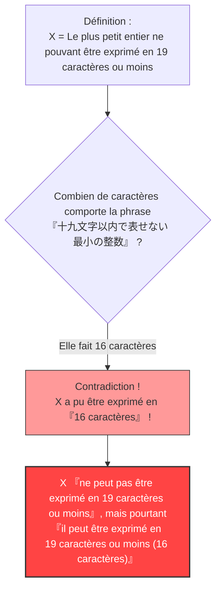

## 1. Exprimer des nombres avec des mots

Nous utilisons couramment non seulement des « chiffres arabes (1, 2, 3...) », mais aussi des « mots (en japonais, en français ou autre) » pour exprimer des nombres.

Par exemple, le nombre « $10$ » peut être exprimé de différentes manières avec des mots en japonais :
- « じゅう » (dix, 3 caractères)
- « ごの2ばい » (le double de 5, 5 caractères)
- « ひゃくの10ぶんの1 » (le dixième de 100, 9 caractères)

Ainsi, considérons le fait d'expliquer un certain nombre en utilisant les « caractères de la langue japonaise ».
Nous imposerons une limite au nombre de caractères utilisables. Ici, nous considérerons les nombres pouvant être exprimés avec **« 19 caractères ou moins »** en japonais.

Naturellement, il y a une **limite** aux nombres qui peuvent être exprimés en 19 caractères ou moins.
En effet, le nombre de types de caractères japonais (hiragana, katakana, kanji, etc.) est fini, et les combinaisons possibles en les alignant sur 19 caractères ou moins sont également finies (ce sera un nombre astronomique, mais pas infini).

En d'autres termes, il existe nécessairement **« un entier gigantesque qui ne peut absolument pas être exprimé en 19 caractères japonais ou moins »**.

---

## 2. La naissance du paradoxe

Maintenant, voici le vif du sujet.
Il existe une infinité d'« entiers qui ne peuvent pas être exprimés en 19 caractères japonais ou moins ».
Parmi cette infinité de nombres inexprimables, supposons que nous trouvions **« le plus petit (le plus petit entier) »**.

Appelons ce nombre $X$.
Puisque $X$ est par définition le plus petit parmi les « nombres qui ne peuvent pas être exprimés en 19 caractères japonais ou moins », nous pouvons l'appeler ainsi en japonais :

**« じゅうきゅうもじいないであらわせないさいしょうのせいすう »** (le plus petit entier qui ne peut pas être exprimé en dix-neuf caractères ou moins)

Comptons le nombre de caractères (hiragana) :
« じゅ・う・きゅ・う・も・じ・い・な・い・で・あ・ら・わ・せ・な・い・さ・い・しょ・う・の・せ・い・す・う »
...Tiens ? Même en ignorant la ponctuation, il y a 25 caractères.
Cela dépasse les « 19 caractères ».

Essayons donc de raccourcir l'expression en utilisant des kanjis (idéogrammes).

**« 十九文字以内で表せない最小の整数 »**

Maintenant, comptez le nombre de caractères de cette phrase japonaise :

1. 十
2. 九
3. 文
4. 字
5. 以
6. 内
7. で
8. 表
9. せ
10. な
11. い
12. 最
13. 小
14. の
15. 整
16. 数

Incroyable, il n'y a que **« 16 caractères »**.

Quelque chose d'étrange vient de se produire.
Nous venons tout juste d'exprimer le nombre $X$ en utilisant la phrase **« 十九文字以内で表せない最小の整数 », qui est « un texte japonais de 16 caractères »** !

Alors que $X$ est censé être un nombre qui « ne peut pas être exprimé en 19 caractères ou moins », les mots mêmes de sa définition expriment parfaitement $X$ en « 16 caractères (ce qui est inférieur ou égal à 19) ».
C'est ce qu'on appelle le **« Paradoxe de Berry (Berry Paradox) »**.

---

## 3. Qui a créé ce paradoxe ?

Ce paradoxe a été imaginé en 1904 par **G. G. Berry**, un bibliothécaire de l'Université d'Oxford.
Il est devenu mondialement célèbre lorsque **Bertrand Russell**, mathématicien et philosophe de génie du 20e siècle, l'a présenté dans l'un de ses articles.

(* Dans l'article original en anglais, l'expression utilisée est "The least integer not nameable in fewer than nineteen syllables" (le plus petit entier qui ne peut pas être nommé en moins de dix-neuf syllabes), et le paradoxe est conçu pour fonctionner avec le nombre de syllabes en anglais.)

---

## 4. Pourquoi cette contradiction se produit-elle ?

La cause fondamentale de ce paradoxe réside dans **l'ambiguïté** et **l'auto-référence** du « langage naturel (japonais, anglais, français, etc.) » que nous utilisons quotidiennement.

### Le langage naturel ne peut pas supporter la rigueur des mathématiques
Dans le monde des mathématiques, « définir un nombre » est une tâche extrêmement rigoureuse (on utilise des équations et des symboles).
Cependant, dans le paradoxe de Berry, on a tenté de définir un objet mathématique (un entier) en utilisant le **langage quotidien** humain avec des notions telles que « pouvoir exprimer » et « ne pas pouvoir exprimer ».

Le langage courant est extrêmement puissant et flexible, mais cette flexibilité permet de faire des choses acrobatiques, comme « faire référence au nombre de ses propres caractères ».
En conséquence, cela a provoqué une auto-contradiction (un paradoxe d'auto-référence) où « la définition elle-même enfreint les règles de la définition ».

### Que signifie « nommer » ou « exprimer » ?
De plus, la définition de « peut être exprimé en 16 caractères » est ambiguë.
L'expression « le plus petit entier qui ne peut pas être exprimé en 19 caractères ou moins » ne pointe **pas directement** vers un nombre spécifique concret (par exemple, un nombre comme $987654321...$).
Elle ne fait que **décrire indirectement** le fait qu'« il doit y avoir un nombre qui remplit cette condition ».

Mathématiquement, « exprimer de manière directement calculable » et « énoncer une condition indirecte avec des mots » doivent être clairement distingués. C'est en confondant ces deux choses pour affirmer « on a pu l'exprimer en 16 caractères ! » que se cache le tour de passe-passe logique.

---

## 5. Conclusion et influence moderne

À première vue, le paradoxe de Berry peut sembler n'être qu'un « jeu de mots » ou une « devinette ».
Cependant, ce problème a été pour les mathématiciens du 20e siècle l'occasion de prendre profondément conscience du **« danger d'utiliser le langage naturel pour jeter les bases des mathématiques »**.

« Il ne faut pas définir des nombres avec des mots. Les mathématiques doivent être construites uniquement avec des symboles rigoureux et totalement indépendants. »

Ce paradoxe a servi de jalon important, ouvrant la voie à des disciplines de pointe qui allaient changer l'histoire des mathématiques, comme le « Théorème d'incomplétude de Gödel (il existe en mathématiques des vérités qui ne peuvent absolument pas être prouvées) » et la « Complexité de Kolmogorov en informatique (une théorie sur la façon dont l'information peut être compressée) ».

Le fait que seulement 16 caractères japonais aient pu exposer les limites des mathématiques : telle est la beauté du paradoxe de Berry.
