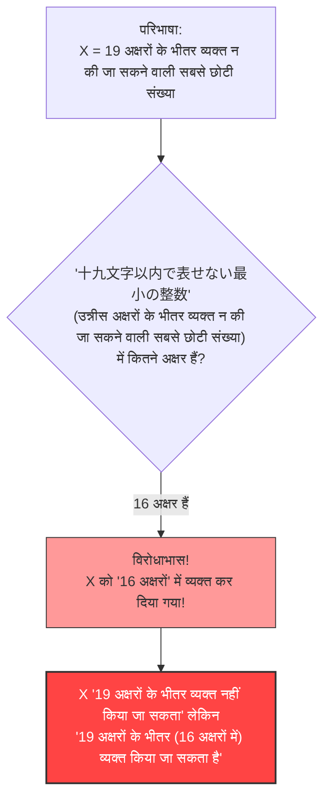

## 1. शब्दों से संख्याओं को व्यक्त करना

हम दैनिक जीवन में संख्याओं को केवल "अरबी अंकों (1, 2, 3...)" में ही नहीं, बल्कि "शब्दों (जैसे जापानी या हिंदी)" का उपयोग करके भी व्यक्त करते हैं।

उदाहरण के लिए, संख्या "$10$" को विभिन्न शब्दों में इस प्रकार व्यक्त किया जा सकता है:
- "दस" (जापानी में 3 अक्षर: じゅう)
- "पांच का दोगुना" (जापानी में 5 अक्षर: ごの2ばい)
- "सौ का दसवां भाग" (जापानी में 9 अक्षर: ひゃくの10ぶんの1)

इस प्रकार, किसी संख्या को "जापानी अक्षरों" का उपयोग करके समझाने पर विचार करें।
उपयोग किए जा सकने वाले अक्षरों की संख्या पर हम एक सीमा निर्धारित करेंगे। यहाँ हम उन संख्याओं के बारे में विचार करेंगे जिन्हें **"19 अक्षरों के भीतर"** की जापानी भाषा में व्यक्त किया जा सकता है।

जाहिर है, 19 अक्षरों के भीतर व्यक्त की जा सकने वाली संख्याओं की **एक सीमा** होती है।
क्योंकि जापानी अक्षरों (हिरागाना, काताकाना, कांजी आदि) के प्रकार सीमित हैं, और उन्हें 19 अक्षरों या उससे कम में व्यवस्थित करने के संयोजन भी सीमित हैं (भले ही यह एक खगोलीय संख्या हो, लेकिन यह अनंत नहीं है)।

यानी, **"एक ऐसा विशाल पूर्णांक जिसे 19 जापानी अक्षरों के भीतर व्यक्त नहीं किया जा सकता"** हमेशा मौजूद रहेगा।

---

## 2. विरोधाभास का जन्म

अब, मुख्य विषय पर आते हैं।
"ऐसे पूर्णांक जिन्हें 19 जापानी अक्षरों के भीतर व्यक्त नहीं किया जा सकता" अनगिनत हैं।
मान लीजिए कि हमने उन अनगिनत अव्यक्त संख्याओं में से **"सबसे छोटी (न्यूनतम पूर्णांक)"** खोज निकाली है।

उस संख्या को हम $X$ मान लेते हैं।
$X$ परिभाषा के अनुसार, "19 जापानी अक्षरों के भीतर व्यक्त न की जा सकने वाली संख्याओं" में सबसे छोटी है, इसलिए इसे इस प्रकार कहा जा सकता है:

**"उन्नीस अक्षरों के भीतर व्यक्त न की जा सकने वाली सबसे छोटी संख्या" (जापानी: じゅうきゅうもじいないであらわせないさいしょうのせいすう)**

आइए जापानी अक्षरों को गिनते हैं।
"じゅ・う・きゅ・う・も・じ・い・な・い・で・あ・ら・わ・せ・な・い・さ・い・しょ・う・の・せ・い・す・う"
...अरे? अल्पविराम हटाने पर भी यह 25 अक्षर हैं।
यह तो "19 अक्षरों" से अधिक हो गया है।

तो, आइए अभिव्यक्ति में थोड़ा बदलाव करें और इसे जापानी कांजी का उपयोग करके छोटा करें:

**"十九文字以内で表せない最小の整数" (उन्नीस अक्षरों के भीतर व्यक्त न की जा सकने वाली सबसे छोटी संख्या)**

अब, इस जापानी वाक्य के अक्षरों की संख्या गिनकर देखें।

1. 十
2. 九
3. 文
4. 字
5. 以
6. 内
7. で
8. 表
9. せ
10. な
11. い
12. 最
13. 小
14. の
15. 整
16. 数

आश्चर्यजनक रूप से, **यह केवल "16 अक्षर"** हैं।

यह तो अजीब हो गया।
हमने अभी $X$ नामक संख्या को **"十九文字以内で表せない最小の整数" नामक "16 जापानी अक्षरों" का उपयोग करके व्यक्त कर दिया है**!

भले ही $X$ एक ऐसी संख्या होनी चाहिए जिसे "19 अक्षरों के भीतर व्यक्त नहीं किया जा सकता", लेकिन उसकी परिभाषा वाले शब्द स्वयं "16 अक्षरों (19 अक्षरों के भीतर)" में $X$ को पूरी तरह से व्यक्त कर रहे हैं।
यही **"बेरी का विरोधाभास (Berry Paradox)"** है।

---

## 3. यह विरोधाभास किसने बनाया?

यह विरोधाभास 1904 में ऑक्सफोर्ड विश्वविद्यालय के एक लाइब्रेरियन **जी. जी. बेरी** (G. G. Berry) द्वारा तैयार किया गया था।
जब 20वीं सदी के महान गणितज्ञ और दार्शनिक **बर्ट्रेंड रसेल** ने इसे अपने एक शोध पत्र में पेश किया, तो यह पूरी दुनिया में लोकप्रिय हो गया।

(※ मूल अंग्रेजी शोध पत्र में "The least integer not nameable in fewer than nineteen syllables" (19 शब्दांशों से कम में व्यक्त न की जा सकने वाली सबसे छोटी संख्या) वाक्यांश का उपयोग किया गया है, और इसे इस तरह से बनाया गया था कि अंग्रेजी शब्दांशों के आधार पर विरोधाभास उत्पन्न हो।)

---

## 4. विरोधाभास क्यों उत्पन्न हुआ?

इस विरोधाभास का मूल कारण उस "प्राकृतिक भाषा (जैसे जापानी, हिंदी या अंग्रेजी)" की **अस्पष्टता** और **स्व-संदर्भ (Self-reference)** है जिसका हम दैनिक उपयोग करते हैं।

### प्राकृतिक भाषा गणित की कठोरता को सहन नहीं कर सकती
गणित की दुनिया में, "संख्याओं को परिभाषित करना" एक बहुत ही सख्त कार्य है (जिसमें समीकरणों और प्रतीकों का उपयोग किया जाता है)।
हालांकि, बेरी के विरोधाभास में, गणितीय वस्तु (पूर्णांक) को "व्यक्त किया जा सकता है" या "व्यक्त नहीं किया जा सकता" जैसी मानवीय **दैनिक भाषा** का उपयोग करके परिभाषित करने का प्रयास किया गया।

दैनिक भाषा बहुत शक्तिशाली और लचीली है, लेकिन इस लचीलेपन के कारण यह "अपने स्वयं के अक्षरों की संख्या के बारे में बात करने" जैसी कलाबाजियां कर सकती है।
परिणामस्वरूप, "परिभाषा स्वयं परिभाषा के नियम को तोड़ती है" जैसी स्थिति उत्पन्न हो जाती है, जो आत्म-विरोधाभास (स्व-संदर्भ विरोधाभास) का कारण बनती है।

### "नाम दिए जाने" का क्या अर्थ है?
इसके अलावा, "16 अक्षरों में व्यक्त किया जा सकता है" शब्द की परिभाषा भी अस्पष्ट है।
"19 अक्षरों के भीतर व्यक्त न की जा सकने वाली सबसे छोटी संख्या" वाक्यांश किसी विशेष ठोस संख्या (उदाहरण के लिए $987654321...$ जैसी संख्या) को **प्रत्यक्ष रूप से इंगित नहीं कर रहा है**।
यह केवल **परोक्ष रूप से** यह बता रहा है कि "एक ऐसी संख्या होनी चाहिए जो शर्तों को पूरा करती हो"।

गणितीय रूप से, "सीधे गणना योग्य रूप में व्यक्त करने" और "शब्दों में अप्रत्यक्ष शर्तों को बताने" के बीच स्पष्ट अंतर किया जाना चाहिए। इन दोनों को मिलाने और यह दावा करने के बीच तार्किक चाल छिपी हुई है कि "इसे 16 अक्षरों में व्यक्त किया गया था!"।

---

## 5. निष्कर्ष और आधुनिक समय पर प्रभाव

पहली नज़र में, बेरी का विरोधाभास सिर्फ "शब्दों का खेल" या "चतुराई" लग सकता है।
हालांकि, इस समस्या ने 20वीं सदी के गणितज्ञों को **"गणित की नींव बनाने के लिए दैनिक भाषा का उपयोग करने के खतरों"** से गहराई से अवगत कराया।

"शब्दों से संख्याओं को परिभाषित नहीं किया जाना चाहिए। गणित को पूरी तरह से स्वतंत्र और सख्त प्रतीकों से ही बनाया जाना चाहिए।"

यह विरोधाभास एक महत्वपूर्ण मील का पत्थर बन गया जो बाद में गणित के इतिहास को बदलने वाली "गोडेल की अपूर्णता प्रमेय (Gödel's incompleteness theorems)" (गणित में ऐसे सत्य हैं जिन्हें कभी सिद्ध नहीं किया जा सकता) और कंप्यूटर विज्ञान में "कोल्मोगोरोव जटिलता (Kolmogorov complexity)" (जानकारी को कितना छोटा संकुचित किया जा सकता है, इसका सिद्धांत) जैसे अत्याधुनिक अध्ययनों तक ले गया।

केवल 16 जापानी अक्षरों ने गणित की सीमाओं को उजागर कर दिया। यही बेरी के विरोधाभास की सुंदरता है।
