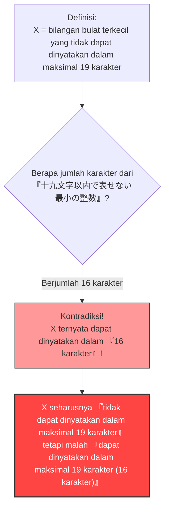

## 1. Mengekspresikan Angka dengan Kata-kata

Dalam kehidupan sehari-hari, kita sering mengekspresikan angka tidak hanya menggunakan "angka Arab (1, 2, 3...)" tetapi juga menggunakan "kata-kata (bahasa Jepang, Inggris, atau Indonesia)".

Misalnya, angka "$10$" dapat diekspresikan dengan berbagai kata (dalam bahasa Jepang) sebagai berikut:
- "じゅう" (juu - 3 karakter)
- "ごの2ばい" (2 kali lipat dari 5 - 5 karakter)
- "ひゃくの10ぶんの1" (1/10 dari 100 - 9 karakter)

Dengan cara ini, mari kita pertimbangkan untuk menjelaskan angka menggunakan "karakter bahasa Jepang".
Kita akan menetapkan batasan jumlah karakter yang dapat digunakan. Di sini, kita akan memikirkan angka-angka yang dapat diekspresikan dalam bahasa Jepang dengan **"maksimal 19 karakter"**.

Tentu saja, ada **batasan** untuk angka yang dapat diekspresikan dalam batas 19 karakter.
Jenis karakter bahasa Jepang (hiragana, katakana, kanji, dll.) jumlahnya terbatas, dan kombinasi penyusunannya dalam 19 karakter atau kurang juga terbatas (meskipun jumlahnya sangat besar secara astronomis, tetapi tidak tak terhingga).

Dengan kata lain, pasti selalu ada **"bilangan bulat sangat besar yang tidak mungkin diekspresikan dalam bahasa Jepang menggunakan maksimal 19 karakter"**.

---

## 2. Lahirnya Paradoks

Nah, dari sinilah intinya dimulai.
Ada jumlah tak terhingga dari "bilangan bulat yang tidak dapat diekspresikan dalam bahasa Jepang menggunakan maksimal 19 karakter".
Dari jumlah tak terhingga angka yang tidak dapat diekspresikan tersebut, misalkan kita menemukan **"yang paling kecil (bilangan bulat terkecil)"**.

Mari kita sebut angka tersebut $X$.
Berdasarkan definisinya, $X$ adalah yang paling kecil dari "angka yang tidak dapat diekspresikan dalam bahasa Jepang menggunakan maksimal 19 karakter", jadi kita dapat menyebutnya sebagai berikut:

**"じゅうきゅうもじいないであらわせないさいしょうのせいすう"** (juu-kyuu-mo-ji-i-na-i-de-a-ra-wa-se-na-i-sa-i-sho-u-no-se-i-su-u / bilangan bulat terkecil yang tidak dapat diekspresikan dalam maksimal 19 karakter)

Mari kita hitung jumlah karakternya.
"じゅ・う・きゅ・う・も・じ・い・な・い・で・あ・ら・わ・せ・な・い・さ・い・しょ・う・の・せ・い・す・う"
...Oh? Bahkan jika kita tidak menghitung tanda baca, totalnya ada 25 karakter.
Ini sudah melebihi batas "19 karakter".

Kalau begitu, mari kita sedikit menyesuaikan ekspresinya dan menggunakan Kanji agar lebih pendek.

**"十九文字以内で表せない最小の整数"**

Nah, silakan hitung jumlah karakter bahasa Jepang ini.

1. 十
2. 九
3. 文
4. 字
5. 以
6. 内
7. で
8. 表
9. せ
10. な
11. い
12. 最
13. 小
14. の
15. 整
16. 数

Percaya atau tidak, ini **hanya "16 karakter"**.

Hal yang aneh pun terjadi.
Kita baru saja mengekspresikan angka $X$ menggunakan **"bahasa Jepang sepanjang 16 karakter", yaitu frasa "十九文字以内で表せない最小の整数"**!

Padahal $X$ seharusnya merupakan angka yang "tidak dapat dinyatakan dalam maksimal 19 karakter", namun kata-kata dari definisi itu sendiri justru mewakili $X$ dengan sempurna dalam "16 karakter (maksimal 19 karakter)".
Inilah yang disebut **"Paradoks Berry (Berry Paradox)"**.

---

## 3. Siapa yang Menciptakan Paradoks Ini?

Paradoks ini digagas pada tahun 1904 oleh seorang pustakawan Universitas Oxford yang bernama **G. G. Berry**.
Paradoks ini kemudian menyebar ke seluruh dunia setelah matematikawan dan filsuf jenius abad ke-20, **Bertrand Russell**, memperkenalkannya dalam makalahnya.

（※Dalam makalah asli berbahasa Inggris, frasa yang digunakan adalah "The least integer not nameable in fewer than nineteen syllables" (bilangan bulat terkecil yang tidak dapat dinamai dalam kurang dari 19 suku kata), dan paradoks ini disusun agar berlaku dengan menghitung jumlah suku kata dalam bahasa Inggris.）

---

## 4. Mengapa Kontradiksi Terjadi?

Penyebab mendasar dari paradoks ini terletak pada **ambiguitas** dan **sifat referensi diri** dari "bahasa alami (seperti bahasa Jepang atau bahasa Inggris)" yang kita gunakan sehari-hari.

### Bahasa Alami Tidak Dapat Menahan Ketelitian Matematika
Dalam dunia matematika, "mendefinisikan angka" adalah proses yang sangat ketat dan teliti (menggunakan persamaan dan simbol).
Namun, dalam Paradoks Berry, objek matematika (bilangan bulat) dicoba untuk didefinisikan menggunakan **bahasa sehari-hari** manusia, dengan konsep "dapat dinyatakan" atau "tidak dapat dinyatakan".

Bahasa sehari-hari sangat kuat dan fleksibel, tetapi karena kefleksibelannya itulah ia bisa melakukan hal-hal akrobatik seperti "merujuk pada jumlah karakternya sendiri".
Akibatnya, hal ini memicu kontradiksi diri (paradoks referensi diri) di mana "definisi itu sendiri melanggar aturan definisi tersebut".

### Apa Artinya "Diberi Nama"?
Selain itu, definisi dari kata "dapat diekspresikan dalam 16 karakter" juga ambigu.
Frasa "bilangan bulat terkecil yang tidak dapat dinyatakan dalam maksimal 19 karakter" **tidak secara langsung menunjuk** pada angka spesifik tertentu (seperti angka $987654321...$).
Frasa tersebut **hanya mendeskripsikan secara tidak langsung** bahwa "pasti ada angka yang memenuhi kondisi tersebut".

Secara matematis, "menyatakannya secara langsung dalam bentuk yang dapat dihitung" dan "menyatakan kondisi tidak langsung dengan kata-kata" harus dibedakan dengan jelas. Trik logisnya tersembunyi di tempat kita mencampuradukkan kedua hal ini dan bersikeras bahwa "itu dapat diekspresikan dalam 16 karakter!".

---

## 5. Kesimpulan dan Pengaruhnya di Era Modern

Sekilas, Paradoks Berry mungkin hanya terlihat seperti "permainan kata" atau "teka-teki".
Namun, masalah ini menjadi pemicu yang membuat para matematikawan abad ke-20 menyadari secara mendalam mengenai **"bahayanya membangun fondasi matematika menggunakan bahasa sehari-hari"**.

"Kita tidak boleh mendefinisikan angka dengan kata-kata. Matematika harus dibangun menggunakan simbol ketat yang sepenuhnya independen."

Paradoks ini menjadi tonggak penting yang mengarah pada studi-studi mutakhir yang mengubah sejarah matematika selanjutnya, seperti "Teorema Ketidaklengkapan Gödel" (bahwa ada kebenaran dalam matematika yang tidak akan pernah bisa dibuktikan) dan "Kompleksitas Kolmogorov" dalam ilmu komputer (teori tentang seberapa pendek informasi dapat dikompresi).

Hanya dengan 16 karakter bahasa Jepang telah mengungkap batasan-batasan matematika. Itulah keindahan dari Paradoks Berry.
