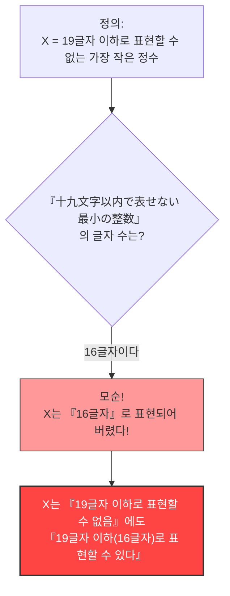

## 1. 언어로 숫자 표현하기

우리는 일상적으로 숫자를 "아라비아 숫자(1, 2, 3...)"뿐만 아니라 "언어(한국어나 영어 등)"를 사용하여 표현하고 있습니다.

예를 들어, "$10$"이라는 숫자는 일본어로 다음과 같이 여러 가지 말로 표현할 수 있습니다.
- "じゅう(십)" (3글자)
- "ごの2ばい(오의 2배)" (5글자)
- "ひゃくの10ぶんの1(백의 10분의 1)" (9글자)

이처럼 어떤 숫자를 "일본어 글자"를 사용하여 설명하는 것을 생각해 봅시다.
사용할 수 있는 글자 수에는 제한을 둡니다. 여기서는 **"19글자 이하"**의 일본어로 표현할 수 있는 숫자에 대해 생각합니다.

당연하지만, 19글자 이하로 표현할 수 있는 숫자에는 **한계**가 있습니다.
일본어의 글자(히라가나, 가타카나, 한자 등) 종류는 유한하고, 이를 19글자 이하로 나열하는 조합도 유한하기 때문입니다(천문학적인 수가 되겠지만, 무한하지는 않습니다).

즉, **"19글자 이하의 일본어로는 도저히 표현할 수 없는 거대한 정수"**가 반드시 존재하게 됩니다.

---

## 2. 역설의 탄생

자, 지금부터가 본론입니다.
"19글자 이하의 일본어로는 표현할 수 없는 정수"는 무수히 존재합니다.
그 무수히 많은 표현 불가능한 수 중에서, **"가장 작은 것(최소의 정수)"**을 하나 찾아냈다고 가정해 봅시다.

그 숫자를 $X$라고 합니다.
$X$는 정의상 "19글자 이하의 일본어로는 표현할 수 없는 수" 중에서 가장 작은 것이므로, 다음과 같이 부를 수 있습니다.

**"じゅうきゅうもじいないであらわせないさいしょうのせいすう" (십구 문자 이하로 나타낼 수 없는 최소의 정수)**

글자 수를 세어 봅시다.
"じゅ・う・きゅ・う・も・じ・い・な・い・で・あ・ら・わ・せ・な・い・さ・い・しょ・う・の・せ・い・す・う"
…어라? 독점을 빼고도 25글자네요.
이래서는 "19글자"를 초과해 버립니다.

그럼, 조금 표현을 궁리해서, 한자를 사용하여 짧게 만들어 봅시다.

**"十九文字以内で表せない最小の整数"**

자, 이 일본어의 글자 수를 세어 보세요.

1. 十
2. 九
3. 文
4. 字
5. 以
6. 内
7. で
8. 表
9. せ
10. な
11. い
12. 最
13. 小
14. の
15. 整
16. 数

무려, **단 "16글자"**입니다.

이상한 일이 벌어졌습니다.
우리는 지금, $X$라는 숫자를 **"十九文字以内で表せない最小の整数"라는 "16글자의 일본어"를 사용하여 표현해 버린** 것입니다!

$X$는 "19글자 이하로 표현할 수 없는" 숫자여야 하는데, 바로 그 정의하는 말 자체가 "16글자(19글자 이하)"로 $X$를 완벽하게 표현하고 있습니다.
이것이 **"베리의 역설(Berry Paradox)"**입니다.

---

## 3. 누가 이 역설을 만들었을까?

이 역설은 1904년에 옥스퍼드 대학교의 도서관 사서였던 **G. G. 베리**(G. G. Berry)라는 인물이 고안했습니다.
그것을 20세기를 대표하는 천재 수학자이자 철학자인 **버트런드 러셀**이 자신의 논문에서 소개하면서 전 세계에 알려졌습니다.

(※ 영어 원문 논문에서는 "The least integer not nameable in fewer than nineteen syllables"(19음절 미만으로 이름 붙일 수 없는 가장 작은 정수)라는 표현이 사용되었으며, 영어의 음절 수로 역설이 성립하도록 만들어졌습니다.)

---

## 4. 왜 모순이 일어났을까?

이 역설의 근본적인 원인은, 우리가 평소에 사용하는 "자연어(한국어나 영어, 일본어 등)"가 가진 **모호성**과 **자기언급성**에 있습니다.

### 자연어는 수학의 엄밀함을 견디지 못한다
수학의 세계에서, "숫자를 정의한다"는 것은 매우 엄밀한 작업입니다(방정식이나 기호를 사용합니다).
그러나 베리의 역설에서는 수학적인 대상(정수)을 "표현할 수 있다", "표현할 수 없다"는 인간의 **일상 언어**를 사용하여 정의하려고 했습니다.

일상 언어는 매우 강력하고 유연하지만, 그 유연함 때문에 "자기 자신의 글자 수에 대해 언급한다"는 곡예와 같은 일이 가능해집니다.
그 결과, "정의 그 자체가, 정의의 규칙을 깬다"는 자기 모순(자기언급의 역설)을 일으키고 만 것입니다.

### "이름 붙여진다"는 것은 어떤 의미인가?
또한, "16글자로 표현할 수 있다"는 말의 정의도 모호합니다.
"19글자 이하로 표현할 수 없는 가장 작은 정수"라는 문구는, 특정한 구체적인 숫자(예를 들어 $987654321...$과 같은 수)를 **직접 가리키고 있는 것은 아닙니다**.
단지 "조건을 만족하는 숫자가 있을 것이다"라고 **간접적으로 기술하고 있을 뿐**입니다.

수학적으로는, "직접적으로 계산 가능한 형태로 표현하는 것"과 "간접적인 조건을 언어로 서술하는 것"은 명확히 구별되어야 합니다. 이 두 가지를 혼동하여 "16글자로 표현할 수 있었다!"라고 주장하는 데에, 논리적인 속임수가 숨겨져 있습니다.

---

## 5. 요약과 현대에 미친 영향

베리의 역설은 얼핏 보면 그저 단순한 "말장난"이나 "억지"처럼 보입니다.
그러나 이 문제는 20세기 수학자들에게 **"일상 언어를 사용하여 수학의 기초를 세우는 것의 위험성"**을 깊이 인식시키는 계기가 되었습니다.

"언어로 숫자를 정의해서는 안 된다. 수학은 완전히 독립적이고 엄밀한 기호만으로 구축되어야 한다."

이 역설은 훗날 수학의 역사를 바꾸는 "괴델의 불완전성 정리(수학에는 절대 증명할 수 없는 진리가 존재한다)"나 컴퓨터 과학에서의 "콜모고로프 복잡도(정보를 얼마나 짧게 압축할 수 있는가 하는 이론)" 등, 최첨단 학문으로 이어지는 중요한 이정표가 되었습니다.

단 16글자의 언어가 수학의 한계를 파헤쳤다. 그것이 베리의 역설이 가진 아름다움입니다.
