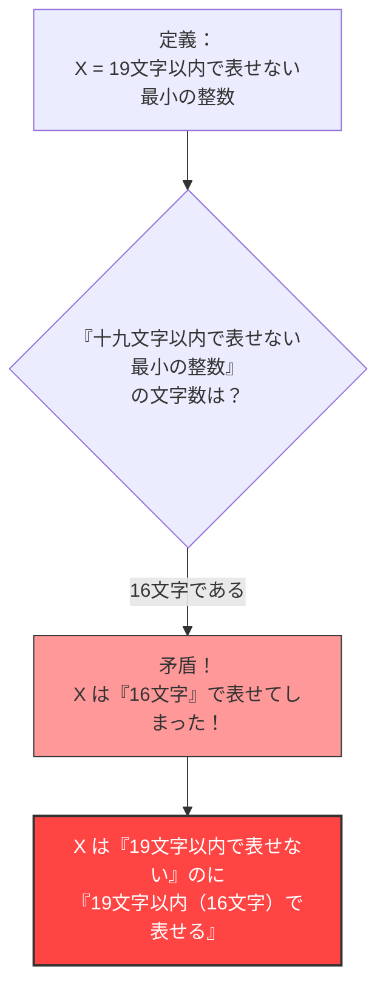

## 1. 言葉で数字を表す

私たちは日常的に、数字を「アラビア数字（1, 2, 3...）」だけでなく、「言葉（日本語や英語）」を使って表現しています。

たとえば、「$10$」という数字は、次のように色々な言葉で表すことができます。
- 「じゅう」（3文字）
- 「ごの2ばい」（5文字）
- 「ひゃくの10ぶんの1」（9文字）

このように、ある数字を「日本語の文字」を使って説明することを考えてみましょう。
使える文字の数には制限を設けます。ここでは**「19文字以内」**の日本語で表現できる数字について考えます。

当然ですが、19文字以内で表現できる数字には**限界**があります。
日本語の文字（ひらがな、カタカナ、漢字など）の種類は有限ですし、それを19文字以下で並べる組み合わせも有限だからです（天文学的な数にはなりますが、無限ではありません）。

つまり、**「19文字以内の日本語では、どうしても表現しきれない巨大な整数」**が必ず存在することになります。

---

## 2. パラドックスの誕生

さて、ここからが本題です。
「19文字以内の日本語では表現できない整数」は無数に存在します。
その無数にある表現不可能な数の中から、**「一番小さいもの（最小の整数）」**を一つ見つけ出してきたとしましょう。

その数字を $X$ とします。
$X$ は、定義上「19文字以内の日本語では表せない数」の中で一番小さいものですから、次のように呼ぶことができます。

**「じゅうきゅうもじいないであらわせないさいしょうのせいすう」**

文字数を数えてみましょう。
「じゅ・う・きゅ・う・も・じ・い・な・い・で・あ・ら・わ・せ・な・い・さ・い・しょ・う・の・せ・い・す・う」
…おや？ 読点を抜いても25文字ありますね。
これでは「19文字」を超えてしまっています。

では、少し表現を工夫して、漢字を使って短くしてみましょう。

**「十九文字以内で表せない最小の整数」**

さて、この日本語の文字数を数えてみてください。

1. 十
2. 九
3. 文
4. 字
5. 以
6. 内
7. で
8. 表
9. せ
10. な
11. い
12. 最
13. 小
14. の
15. 整
16. 数

なんと、**たったの「16文字」**です。

おかしなことになりました。
私たちは今、$X$ という数字を**「十九文字以内で表せない最小の整数」という「16文字の日本語」を使って表現してしまった**のです！

$X$ は「19文字以内で表せない」はずの数字なのに、まさにその定義の言葉自体が「16文字（19文字以内）」で $X$ を完璧に表現してしまっています。
これが**「ベリーのパラドックス（Berry Paradox）」**です。

---

## 3. 誰がこのパラドックスを作ったのか？

このパラドックスは、1904年にオックスフォード大学の図書館員であった**G.G. ベリー**（G. G. Berry）という人物が考案しました。
それを、20世紀を代表する天才数学者・哲学者である**バートランド・ラッセル**が自身の論文の中で紹介したことで、世界中に広まりました。

（※英語の原論文では "The least integer not nameable in fewer than nineteen syllables"（19音節未満で名付けられない最小の整数）という表現が使われており、英語の音節数でパラドックスが成立するように作られています。）

---

## 4. なぜ矛盾が起きたのか？

このパラドックスの根本的な原因は、私たちが普段使っている「自然言語（日本語や英語など）」の持つ**曖昧さ**と**自己言及性**にあります。

### 自然言語は数学の厳密さに耐えられない
数学の世界において、「数字を定義する」というのは非常に厳密な作業です（方程式や記号を使います）。
しかし、ベリーのパラドックスでは、数学的な対象（整数）を、「表せる」「表せない」という人間の**日常言語**を使って定義しようとしました。

日常言語は非常に強力で柔軟ですが、その柔軟さゆえに「自分自身の文字数について言及する」といったアクロバティックなことができてしまいます。
その結果、「定義そのものが、定義のルールを破る」という自己矛盾（自己言及のパラドックス）を引き起こしてしまったのです。

### 「名付けられる」とはどういうことか？
また、「16文字で表せる」という言葉の定義も曖昧です。
「19文字以内で表せない最小の整数」というフレーズは、特定の具体的な数字（例えば $987654321...$ のような数）を**直接指し示しているわけではありません**。
単に「条件を満たす数字があるはずだ」と**間接的に記述しているだけ**です。

数学的には、「直接的に計算可能な形で表現すること」と、「間接的な条件を言葉で述べること」は明確に区別されなければなりません。この2つを混同して「16文字で表現できた！」と言い張っているところに、論理的なトリックが隠されています。

---

## 5. まとめと現代への影響

ベリーのパラドックスは、一見するとただの「言葉遊び」や「トンチ」のように思えます。
しかし、この問題は20世紀の数学者たちに**「日常言語を使って数学の基礎を築くことの危険性」**を深く認識させるきっかけとなりました。

「言葉で数字を定義してはいけない。数学は完全に独立した厳密な記号だけで構築しなければならない」

このパラドックスは、後の数学の歴史を変える「ゲーデルの不完全性定理（数学には絶対に証明できない真理が存在する）」や、コンピュータ科学における「コルモゴロフ複雑性（情報をどれだけ短く圧縮できるかという理論）」など、最先端の学問へと繋がっていく重要な道標となったのです。

たった16文字の日本語が、数学の限界を暴き出した。それがベリーのパラドックスの美しさです。
