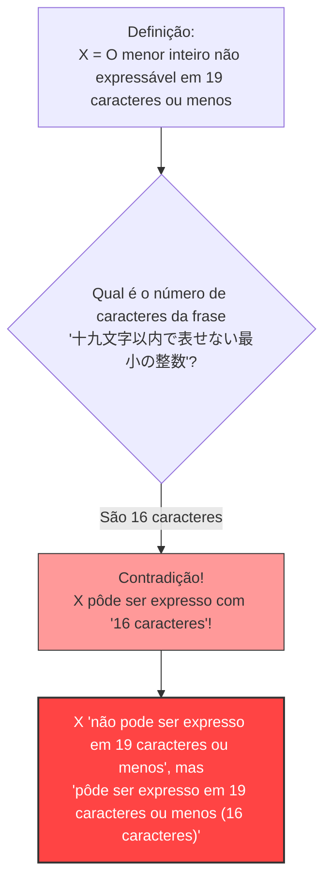

## 1. Expressando números com palavras

Diariamente, nós expressamos os números não apenas usando "algarismos arábicos (1, 2, 3...)", mas também usando "palavras (japonês, português, inglês, etc.)".

Por exemplo, o número "$10$" pode ser expresso de várias maneiras usando palavras, como a seguir:
- "dez" (3 letras)
- "o dobro de 5" (12 letras)
- "um décimo de 100" (15 letras)

Desta forma, vamos pensar em explicar um certo número usando "caracteres da língua japonesa".
Estabeleceremos um limite para o número de caracteres que podem ser usados. Aqui, consideraremos os números que podem ser expressos em japonês com **"19 caracteres ou menos"**.

Naturalmente, existe um **limite** para os números que podem ser expressos com 19 caracteres ou menos.
Isso ocorre porque os tipos de caracteres japoneses (hiragana, katakana, kanji, etc.) são finitos, e as combinações de organizá-los em 19 caracteres ou menos também são finitas (pode ser um número astronômico, mas não é infinito).

Em outras palavras, sempre existirá **"um número inteiro gigante que simplesmente não pode ser expresso em japonês com 19 caracteres ou menos"**.

---

## 2. O nascimento do paradoxo

Agora, aqui está o ponto principal.
Existem inúmeros "números inteiros que não podem ser expressos em japonês com 19 caracteres ou menos".
Suponha que, dentre essa infinidade de números inexprimíveis, encontremos **"o menor deles (o menor inteiro)"**.

Vamos chamar esse número de $X$.
Como $X$ é, por definição, o menor dos "números que não podem ser expressos em japonês com 19 caracteres ou menos", podemos chamá-lo da seguinte forma (em hiragana):

**「じゅうきゅうもじいないであらわせないさいしょうのせいすう」** (O menor inteiro não expressável em dezenove caracteres ou menos)

Vamos contar o número de caracteres.
"じゅ・う・きゅ・う・も・じ・い・な・い・で・あ・ら・わ・せ・な・い・さ・い・しょ・う・の・せ・い・す・う"
...Oh? Mesmo sem pontuação, há 25 caracteres.
Isso já ultrapassa os "19 caracteres".

Então, vamos criar uma expressão um pouco melhor e encurtá-la usando kanji (ideogramas):

**「十九文字以内で表せない最小の整数」**

Agora, por favor, tente contar o número de caracteres nesta frase em japonês:

1. 十
2. 九
3. 文
4. 字
5. 以
6. 内
7. で
8. 表
9. せ
10. な
11. い
12. 最
13. 小
14. の
15. 整
16. 数

Surpreendentemente, são **apenas "16 caracteres"**.

Algo estranho aconteceu.
Nós acabamos de expressar o número $X$ usando **"16 caracteres em japonês", que é a frase "十九文字以内で表せない最小の整数"**!

$X$ é um número que supostamente "não pode ser expresso em 19 caracteres ou menos", mas as próprias palavras dessa definição expressam $X$ perfeitamente em "16 caracteres (o que é 19 caracteres ou menos)".
Este é o **"Paradoxo de Berry" (Berry Paradox)**.

---

## 3. Quem criou este paradoxo?

Este paradoxo foi concebido em 1904 por um bibliotecário da Universidade de Oxford chamado **G. G. Berry**.
Ele se espalhou pelo mundo depois de ser introduzido em um artigo do gênio matemático e filósofo representativo do século XX, **Bertrand Russell**.

(* No artigo original em inglês, foi usada a expressão "The least integer not nameable in fewer than nineteen syllables" (O menor inteiro não nomeável em menos de dezenove sílabas), e foi criada de modo que o paradoxo funcione com o número de sílabas em inglês.)

---

## 4. Por que a contradição ocorreu?

A causa fundamental desse paradoxo reside na **ambiguidade** e na **autorreferência** das "linguagens naturais (japonês, inglês, etc.)" que usamos normalmente.

### A linguagem natural não suporta o rigor da matemática
No mundo da matemática, "definir um número" é uma tarefa extremamente rigorosa (usando equações e símbolos).
No entanto, no Paradoxo de Berry, houve uma tentativa de definir um objeto matemático (um inteiro) usando a **linguagem cotidiana** humana, como "pode ser expresso" ou "não pode ser expresso".

A linguagem cotidiana é muito poderosa e flexível, mas, devido a essa flexibilidade, é possível fazer acrobacias como "fazer referência ao seu próprio número de caracteres".
Como resultado, isso causou uma autocontradição (um paradoxo de autorreferência) onde "a própria definição quebra a regra da definição".

### O que significa "ser nomeável"?
Além disso, a definição das palavras "pode ser expresso em 16 caracteres" também é ambígua.
A frase "o menor inteiro não expressável em 19 caracteres ou menos" **não aponta diretamente** para um número específico (como, por exemplo, o número $987654321...$).
Apenas **descreve indiretamente** afirmando que "deve haver um número que satisfaça a condição".

Matematicamente, "expressar algo diretamente em uma forma calculável" e "declarar uma condição indireta em palavras" devem ser claramente distinguidos. O truque lógico está escondido no fato de confundir essas duas coisas e insistir que "pôde ser expresso em 16 caracteres!".

---

## 5. Resumo e o impacto na era moderna

À primeira vista, o Paradoxo de Berry pode parecer apenas um "jogo de palavras" ou um "enigma".
No entanto, esse problema serviu como um catalisador para fazer os matemáticos do século XX reconhecerem profundamente **"o perigo de construir os fundamentos da matemática usando a linguagem cotidiana"**.

"Não se deve definir números com palavras. A matemática deve ser construída inteiramente com símbolos rigorosos e independentes."

Este paradoxo tornou-se um importante marco que levou a estudos avançados que mudariam a história posterior da matemática, como os "Teoremas da Incompletude de Gödel" (existem verdades na matemática que não podem ser absolutamente provadas) e a "Complexidade de Kolmogorov" na ciência da computação (a teoria de quão curta a informação pode ser comprimida).

Apenas 16 caracteres de japonês revelaram os limites da matemática. Essa é a beleza do Paradoxo de Berry.
