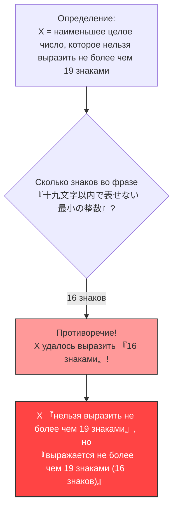

## 1. Выражение чисел словами

Мы каждый день выражаем числа не только «арабскими цифрами» (1, 2, 3...), но и с помощью «слов» (на русском, английском, японском и т.д.).

Например, число $10$ можно описать различными словами (для наглядности рассмотрим на примере японского языка):
- «дзю» (じゅう, 3 знака)
- «пять умножить на два» (ごの2ばい, 5 знаков)
- «одна десятая от ста» (ひゃくの10ぶんの1, 9 знаков)

Давайте подумаем о том, как объяснить определенное число с помощью таких японских знаков.
Мы установим ограничение на количество знаков. Здесь мы рассмотрим числа, которые можно выразить японским языком, используя **«не более 19 знаков»**.

Естественно, существует **предел** чисел, которые можно выразить в пределах 19 знаков.
Количество видов японских символов (хирагана, катакана, кандзи и т.д.) конечно, и количество их комбинаций длиной не более 19 знаков также конечно (это астрономическое число, но оно не бесконечно).

Иными словами, обязательно должно существовать **«огромное целое число, которое никак нельзя выразить на японском языке в пределах 19 знаков»**.

---

## 2. Рождение парадокса

А теперь перейдем к главному.
Существует бесчисленное множество «целых чисел, которые нельзя выразить на японском языке в пределах 19 знаков».
Предположим, что из этого бесчисленного множества невыразимых чисел мы нашли одно — **«самое маленькое (наименьшее целое число)»**.

Обозначим это число за $X$.
Поскольку $X$ по определению является самым маленьким из «чисел, которые нельзя выразить на японском языке в пределах 19 знаков», мы можем назвать его так (записав азбукой):

**«дзю-ю-кю-ю-мо-дзи-и-на-и-дэ-а-ра-ва-сэ-на-и-са-и-сё-у-но-сэ-и-су-у»**
(じゅうきゅうもじいないであらわせないさいしょうのせいすう)

Давайте посчитаем количество знаков:
«дзю・у・кю・у・мо・дзи・и・на・и・дэ・а・ра・ва・сэ・на・и・са・и・сё・у・но・сэ・и・су・у»
...Ой? Даже без учета знаков препинания здесь 25 символов.
Это превышает «19 знаков».

Тогда давайте немного изменим выражение и сделаем его короче, используя иероглифы (кандзи).

**「十九文字以内で表せない最小の整数」** (Наименьшее целое число, которое нельзя выразить не более чем девятнадцатью знаками)

А теперь давайте посчитаем количество знаков в этом выражении:

1. 十
2. 九
3. 文
4. 字
5. 以
6. 内
7. で
8. 表
9. せ
10. な
11. い
12. 最
13. 小
14. の
15. 整
16. 数

Поразительно, но здесь **всего лишь «16 знаков»**.

Произошло нечто странное.
Мы только что выразили число $X$ с помощью **«16-значного выражения»: «十九文字以内で表せない最小の整数»**!

$X$ — это число, которое «нельзя выразить не более чем 19 знаками», но сама фраза этого определения идеально описывает $X$ с помощью «16 знаков (что меньше 19 знаков)».
Это и есть **«Парадокс Берри (Berry Paradox)»**.

---

## 3. Кто создал этот парадокс?

Этот парадокс был придуман в 1904 году библиотекарем Оксфордского университета по имени **Г. Г. Берри** (G. G. Berry).
Он стал известен во всем мире благодаря тому, что **Бертран Рассел**, гениальный математик и философ, представляющий 20-й век, упомянул его в одной из своих работ.

(※ В оригинальной статье на английском языке используется выражение "The least integer not nameable in fewer than nineteen syllables" (наименьшее целое число, которое нельзя назвать менее чем девятнадцатью слогами), и парадокс построен на количестве слогов в английском языке.)

---

## 4. Почему возникло противоречие?

Коренная причина этого парадокса заключается в **неоднозначности** и **самореференции** «естественного языка» (японского, английского, русского и т.д.), который мы обычно используем.

### Естественный язык не выдерживает математической строгости
В мире математики «определение чисел» — это очень строгий процесс (используются уравнения и символы).
Однако в парадоксе Берри была предпринята попытка определить математический объект (целое число) с помощью **повседневного языка** людей: «можно выразить» и «нельзя выразить».

Повседневный язык очень мощен и гибок, но именно из-за этой гибкости с ним можно проделывать такие акробатические трюки, как «упоминание количества знаков в самом себе».
В результате это вызвало логическое противоречие (парадокс самореференции), когда «само определение нарушает правило определения».

### Что значит «быть названным»?
Кроме того, определение фразы «можно выразить 16 знаками» также является неоднозначным.
Фраза «наименьшее целое число, которое нельзя выразить не более чем 19 знаками» **не указывает напрямую** на какое-то конкретное число (например, $987654321...$).
Она **лишь косвенно описывает**, что «должно существовать число, удовлетворяющее этому условию».

Математически «выражение в форме, которую можно непосредственно вычислить» и «описание косвенного условия словами» должны быть четко разделены. Логический трюк скрыт в смешивании этих двух понятий и утверждении, что «его удалось выразить 16 знаками!».

---

## 5. Заключение и влияние на современность

На первый взгляд парадокс Берри кажется просто «игрой слов» или «загадкой».
Однако эта проблема заставила математиков 20-го века глубоко осознать **«опасность использования повседневного языка для построения основ математики»**.

«Нельзя определять числа словами. Математика должна строиться исключительно на строгих и полностью независимых символах».

Этот парадокс стал важным ориентиром, который привел к таким передовым областям знаний, изменившим последующую историю математики, как «Теоремы Гёделя о неполноте» (существуют истины, которые в математике абсолютно невозможно доказать) и «Колмогоровская сложность» (теория о том, насколько кратко можно сжать информацию) в информатике.

Всего 16 знаков японского языка обнажили пределы математики. В этом и заключается красота парадокса Берри.
