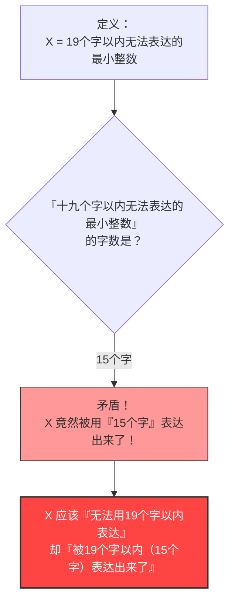

## 1. 用语言表达数字

我们在日常生活中，不仅使用“阿拉伯数字（1, 2, 3...）”，也会使用“语言（中文、英文等）”来表达数字。

例如，“$10$”这个数字，可以用多种语言方式来表达：
- “十”（1个字）
- “五的两倍”（4个字）
- “一百的十分之一”（8个字）

像这样，让我们试着考虑用“中文字符”来描述某个数字。
我们对可以使用的字数设定一个限制。在这里，我们考虑能用**“19个字以内”**的中文表达的数字。

当然，19个字以内能够表达的数字是有**极限**的。
因为中文字符（汉字、拼音等）的种类是有限的，将它们组合成19个字以内的排列也是有限的（虽然是一个天文数字，但并非无限）。

也就是说，必定存在**“无论如何都无法用19个字以内的中文表达的巨大整数”**。

---

## 2. 悖论的诞生

那么，接下来是正题。
“无法用19个字以内的中文表达的整数”有无数个。
假设我们从这无数个无法表达的数中，找出了**“最小的那一个（最小的整数）”**。

我们将这个数字记作 $X$。
根据定义，$X$ 是“无法用19个字以内的中文表达的数字”中最小的，因此我们可以这样称呼它：

**“不能用少于十九个中文字符来表达的最小的整数”**

让我们来数一数字数。
“不・能・用・少・于・十・九・个・中・文・字・符・来・表・达・的・最・小・的・整・数”
……哎呀？连标点符号都不算，这里已经有21个字了。
这样就超过了“19个字”的限制。

那么，我们在表达上稍微下点功夫，让它变得更简短。

**“十九个字以内无法表达的最小整数”**

现在，请数一数这句中文的字数。

1. 十
2. 九
3. 个
4. 字
5. 以
6. 内
7. 无
8. 法
9. 表
10. 达
11. 的
12. 最
13. 小
14. 整
15. 数

竟然**仅仅只有“15个字”**。

事情变得奇怪了。
我们现在竟然用了一句**“十九个字以内无法表达的最小整数”这个“15个字的中文”**，成功地表达了数字 $X$！

$X$ 明明应该是“无法用19个字以内表达”的数字，但正是这个定义的句子本身，却用“15个字（19个字以内）”完美地表达了 $X$。
这就是**“贝里悖论（Berry Paradox）”**。

---

## 3. 是谁提出了这个悖论？

这个悖论是由牛津大学的图书馆员**G.G. 贝里**（G. G. Berry）在1904年提出的。
后来，由20世纪最具代表性的天才数学家、哲学家**伯特兰·罗素**（Bertrand Russell）在自己的论文中进行了介绍，从而广为世人所知。

（※在英文原版论文中，使用的表达是“The least integer not nameable in fewer than nineteen syllables”（不能用少于十九个音节命名的最小整数），该悖论是基于英文的音节数来构建成立的。）

---

## 4. 为什么会产生矛盾？

这个悖论的根本原因，在于我们平时使用的“自然语言（如中文、英文等）”所具有的**模糊性**与**自我指涉性（self-reference）**。

### 自然语言无法承受数学的严密性
在数学世界中，“定义数字”是一项非常严密的工作（需要使用方程式或符号）。
然而，在贝里悖论中，却试图使用人类**日常语言**中的“能表达”、“无法表达”等词汇来定义数学对象（整数）。

日常语言非常强大且灵活，但正是因为这种灵活性，使得它可以做出像“提及自身的字数”这样如同杂技般的行为。
结果，就导致了“定义本身破坏了定义的规则”这种自我矛盾（自我指涉的悖论）。

### “被命名（表达）”到底意味着什么？
此外，“用15个字表达”这句话的定义也是模糊的。
“十九个字以内无法表达的最小整数”这个短语，**并没有直接指出**某个特定的具体数字（例如 $987654321...$ 这样的数）。
它仅仅是**间接地描述**了“应该存在一个满足条件的数字”。

在数学上，“以可直接计算的形式进行表达”与“用语言陈述间接条件”必须被明确区分开来。将这两者混为一谈，并硬说“用15个字表达出来了！”，这其中就隐藏着逻辑上的诡计。

---

## 5. 总结与对现代的影响

贝里悖论乍看之下似乎只是个“文字游戏”或“脑筋急转弯”。
然而，这个问题却成为了让20世纪的数学家们深刻认识到**“使用日常语言来建立数学基础的危险性”**的契机。

“不能用语言来定义数字。数学必须完全由独立且严密的符号来构建。”

这个悖论成为了重要的路标，通向了后来改变数学历史的“哥德尔不完备定理（数学中存在绝对无法证明的真理）”，以及计算机科学中的“柯尔莫哥洛夫复杂性（研究信息能被压缩到多短的理论）”等最前沿的学问。

仅仅15个中文字，就揭露了数学的局限性。这正是贝里悖论的优美之处。
