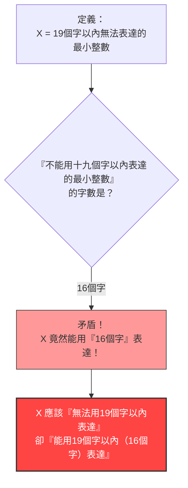

## 1. 用文字表達數字

我們在日常生活中，不僅會使用「阿拉伯數字（1, 2, 3...）」，還會使用「文字（如中文或英文）」來表達數字。

例如，「$10$」這個數字，可以用各種文字來表達，如下所示：
- 「十」（1個字）
- 「五的兩倍」（4個字）
- 「一百的十分之一」（8個字）

像這樣，讓我們來考慮使用「中文字」來描述某個數字。
我們對可使用的字數設定一個限制。這裡我們來考慮能夠用**「19個字以內」**的中文來表達的數字。

當然，用19個字以內能夠表達的數字是**有極限的**。
因為中文字的種類是有限的，將它們排列成19個字以下的組合也是有限的（雖然會是一個天文數字，但並非無限）。

也就是說，必定存在著**「19個字以內的中文字絕對無法表達的巨大整數」**。

---

## 2. 悖論的誕生

那麼，接下來才是正題。
「19個字以內的中文字無法表達的整數」有無數個。
假設我們從那些無數個無法表達的數字中，找出了**「最小的一個（最小的整數）」**。

我們將這個數字設為 $X$。
根據定義，$X$ 是「19個字以內的中文字無法表達的數字」中最小的一個，因此我們可以這樣稱呼它：

**「在十九個中文字以內的長度裡無法被表達出來的最小整數」**

讓我們來數一數這句話的字數：
「在・十・九・個・中・文・字・以・內・的・長・度・裡・無・法・被・表・達・出・來・的・最・小・整・數」
…哎呀？這句話有25個字呢。
這樣就超過「19個字」的限制了。

那麼，讓我們稍微在表達上花點心思，將它縮短一點：

**「不能用十九個字以內表達的最小整數」**

現在，請數數看這句中文的字數：

1. 不
2. 能
3. 用
4. 十
5. 九
6. 個
7. 字
8. 以
9. 內
10. 表
11. 達
12. 的
13. 最
14. 小
15. 整
16. 數

竟然**只有「16個字」**。

奇怪的事情發生了。
我們現在居然用了「不能用十九個字以內表達的最小整數」這**「16個中文字」，把 $X$ 這個數字表達出來了**！

$X$ 明明應該是「無法用19個字以內表達」的數字，但這個定義的文字本身，卻完美地用「16個字（19個字以內）」表達了 $X$。
這就是**「貝里悖論（Berry Paradox）」**。

---

## 3. 是誰提出了這個悖論？

這個悖論是由一位名叫**G.G. 貝里**（G. G. Berry）的人在1904年提出，他當時是牛津大學的圖書館員。
後來，20世紀代表性的天才數學家暨哲學家**伯特蘭·羅素**（Bertrand Russell）在自己的論文中介紹了它，因而廣為世界所知。

（※在英文的原版論文中，使用的是 "The least integer not nameable in fewer than nineteen syllables"（少於19個音節無法命名的最小整數）這樣的表達方式，是設計成以英文的音節數來成立這個悖論的。）

---

## 4. 為什麼會發生矛盾？

這個悖論的根本原因在於，我們平時使用的「自然語言（如中文或英文等）」具有**模糊性**和**自我指涉性（自我提及）**。

### 自然語言無法承受數學的嚴密性
在數學的世界裡，「定義數字」是一項非常嚴密的作業（會使用方程式或符號）。
然而，在貝里悖論中，卻試圖用人類**日常語言**中的「能表達」與「無法表達」來定義數學對象（整數）。

日常語言非常強大且靈活，但也正因為這種靈活性，使得它能夠做出像「提及自身的字數」這樣高難度的雜技動作。
結果就引發了「定義本身破壞了定義的規則」這種自我矛盾（自我指涉的悖論）。

### 「被命名」代表什麼意思？
此外，「能用16個字表達」這句話的定義也很模糊。
「不能用十九個字以內表達的最小整數」這句話，並**沒有直接指出**特定的具體數字（例如 $987654321...$ 這樣的數字）。
它只是**間接地描述**了「應該有一個滿足條件的數字」。

在數學上，「以可以直接計算的形式來表達」與「用文字陳述間接的條件」，這兩者必須被明確地區分。將這兩者混為一談並堅稱「用16個字表達出來了！」，這就是隱藏在其中的邏輯把戲。

---

## 5. 總結與對現代的影響

貝里悖論乍看之下似乎只是個「文字遊戲」或「腦筋急轉彎」。
然而，這個問題卻成為讓20世紀的數學家們深刻體認到**「使用日常語言來建立數學基礎的危險性」**的契機。

「不能用文字來定義數字。數學必須完全由獨立且嚴密的符號來建構。」

這個悖論成為了通往最先進學問的重要路標，它與後來改變數學歷史的「哥德爾不完備定理（數學中存在絕對無法證明的真理）」，以及資訊科學中的「柯爾莫哥洛夫複雜性（探討資訊能被壓縮到多短的理論）」等都有著緊密的關聯。

僅僅16個中文字，就揭露了數學的極限。這就是貝里悖論的美妙之處。
