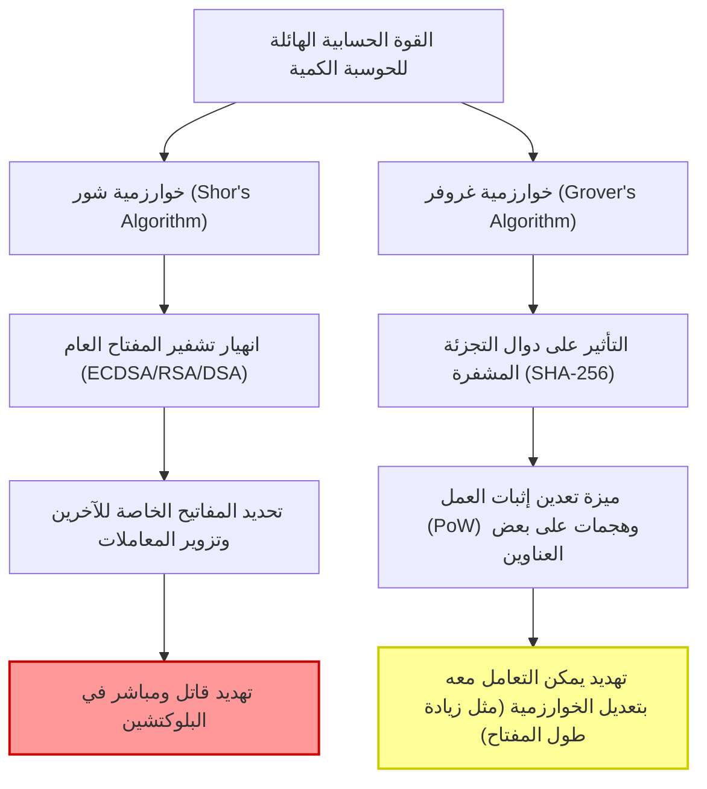
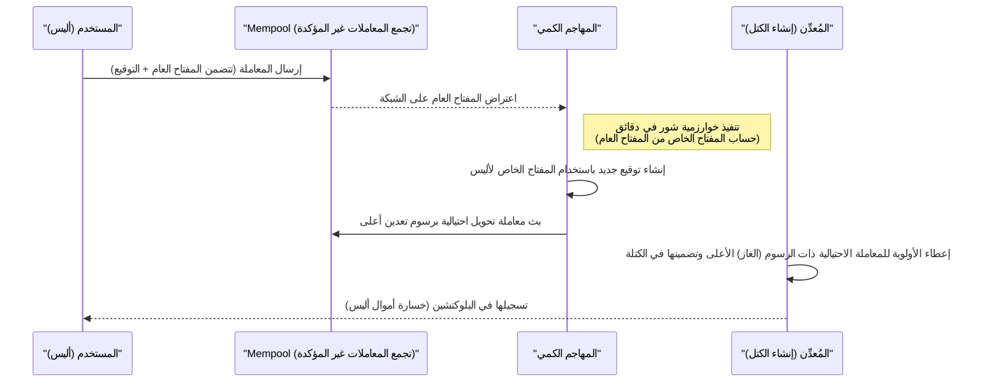
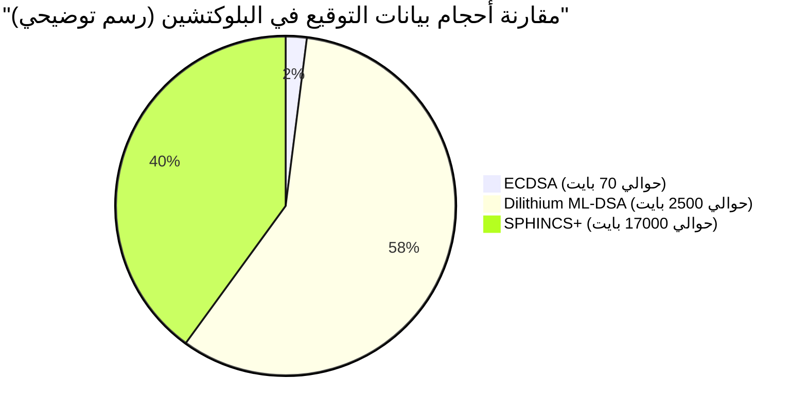

## 1. مقدمة: خطوات عصر ما بعد الكم وأزمة البلوكتشين

منذ ولادة البيتكوين (Bitcoin) على يد ساتوشي ناكاموتو في عام 2009، نمت تقنية البلوكتشين كـ "سجل لامركزي مقاوم للعبث" لتصبح الأساس للأنظمة المالية والتطبيقات حول العالم. يعتمد هذا الأمان القوي على تقنيات التشفير الحديثة: **تشفير المفتاح العام (Public Key Cryptography)** و**دوال التجزئة المشفرة (Cryptographic Hash Functions)**.

تضمن هذه التقنيات الأمان بناءً على "الصعوبة الحسابية" الرياضية التي تجعل الحواسيب الكلاسيكية (أجهزة الكمبيوتر الشخصية والحواسيب العملاقة التي نستخدمها حاليًا) تستغرق وقتًا يقارب عمر الكون لفك تشفيرها.

ومع ذلك، فإن هذا الافتراض على وشك أن ينقلب رأسًا على عقب بسبب التطور السريع والتطبيق العملي لـ **أجهزة الكمبيوتر الكمية (Quantum Computers)**، وهي حدود الفيزياء وعلوم المعلومات. الحواسيب الكمية، التي تستخدم ظواهر ميكانيكا الكم مثل "التراكب" (Superposition) و"التشابك" (Entanglement)، تُظهر قوة حسابية هائلة تتفوق على الحواسيب الكلاسيكية في بعض المشكلات الرياضية، وهو ما يُعرف بـ "التفوق الكمي" (Quantum Supremacy).

في هذا المقال، سنشرح بالتفصيل التهديدات المحددة التي تواجهها تقنية البلوكتشين بسبب أجهزة الكمبيوتر الكمية، وأحدث الاتجاهات في الحلول مثل **التشفير ما بعد الكمي (PQC: Post-Quantum Cryptography)**، وسيناريوهات انتقال شبكات الأصول المشفرة، وذلك من منظور تقني ورياضي متعمق.

---

## 2. أساسيات الحوسبة الكمية والتهديدان الرئيسيان للبلوكتشين

تتكون أنظمة البلوكتشين الحالية بشكل أساسي من عنصري التشفير التاليين، وكلاهما معرض لتهديدات مختلفة بسبب الخوارزميات الكمية.

### 2.1. أساسيات تشفير المنحنى الإهليلجي (ECDSA) والصعوبة الحسابية

تعتمد العديد من البلوكتشين، بما في ذلك البيتكوين والإيثريوم (Ethereum)، على **خوارزمية التوقيع الرقمي للمنحنى الإهليلجي (ECDSA: Elliptic Curve Digital Signature Algorithm)** كخوارزمية توقيع رقمي. على وجه التحديد، تستخدم البيتكوين منحنى إهليلجي ذو المعلمة `secp256k1`.

يعتمد أمان تشفير المنحنى الإهليلجي على الصعوبة الحسابية لـ **مشكلة اللوغاريتم المتقطع للمنحنى الإهليلجي (ECDLP: Elliptic Curve Discrete Logarithm Problem)**.
يتم تعريف المنحنى الإهليلجي من خلال المعادلة التالية في نموذج فايرشتراس القياسي:

$$
y^2 \equiv x^3 + ax + b \pmod{p}
$$

في `secp256k1` الخاص بالبيتكوين، $a = 0, b = 7$ و $p$ هو عدد أولي ضخم للغاية.
لنفترض أن النقطة الأساسية (نقطة المرجع) على هذا المنحنى هي $G$، وأن المفتاح الخاص هو عدد صحيح ضخم عشوائي بحجم 256 بت يُرمز له بالرمز $k$. في هذه الحالة، يتم الحصول على المفتاح العام $K$ عن طريق إضافة النقطة الأساسية $k$ مرة (الضرب القياسي).

$$
K = k \times G = \underbrace{G + G + \dots + G}_{k \text{ times}}
$$

إن استخدام الحواسيب الكلاسيكية لعكس (حساب اللوغاريتم المتقطع) المفتاح الخاص $k$ من المفتاح العام المكشوف $K$ والنقطة الأساسية $G$ يتطلب وقتًا أسيًا $\mathcal{O}(\sqrt{p})$ حتى باستخدام أفضل الخوارزميات الكلاسيكية مثل خوارزمية بولارد-رو لتفكيك العوامل الأولية. بالنسبة لمفتاح بحجم 256 بت، يتطلب ذلك حوالي $2^{128}$ عملية حسابية، وهو أمر لا يمكن حله حتى لو تم تشغيل الحواسيب العملاقة الحالية لمليارات السنين.

### 2.2. الانهيار بسبب خوارزمية شور (Shor's Algorithm)

ومع ذلك، فإن **خوارزمية شور** التي اقترحها بيتر شور في عام 1994 قد دمرت هذا الافتراض بالكامل. تم اقتراح خوارزمية شور في الأصل لحل مشكلة التحليل إلى العوامل الأولية (أساس تشفير RSA) في وقت كثير الحدود، ولكن يمكن تطبيقها أيضًا على مشكلة اللوغاريتم المتقطع ومشكلة اللوغاريتم المتقطع للمنحنى الإهليلجي.

يكمن جوهر خوارزمية شور في استخدام **تحويل فورييه الكمي (QFT: Quantum Fourier Transform)** للعثور على "دورة" (Period) الدالة بسرعة عالية.

$$
\text{التعقيد الزمني الكلاسيكي} = \mathcal{O}(2^{n/2}) \quad (n \text{ هو طول البت})
$$
$$
\text{التعقيد الزمني للخوارزمية الكمية} = \mathcal{O}(n^3)
$$

وهكذا، تعمل خوارزمية شور على تقليص الوقت الأسي بشكل كبير إلى **وقت كثير الحدود (Polynomial Time)**. إذا تم بناء كمبيوتر كمي يحتوي على عدد كافٍ من الكيوبتات المنطقية، فسيكون من الممكن تحديد المفتاح الخاص $k$ من المفتاح العام $K$ المنشور على الشبكة في غضون دقائق أو ثوانٍ. سيسمح هذا للمهاجمين بالحصول بسهولة على المفاتيح الخاصة لمحافظ الآخرين والسيطرة الكاملة على أموالهم.

#### 2.2.1. خطوة بخطوة: فك تشفير ECDLP باستخدام خوارزمية شور

دعنا نستعرض العمليات الداخلية لكيفية حل الكمبيوتر الكمي لمشكلة اللوغاريتم المتقطع للمنحنى الإهليلجي (ECDLP) خطوة بخطوة.

إعداد المشكلة: في المعادلة $K = k \times G$، $G$ و $K$ معروفان، ونريد إيجاد العدد الصحيح المجهول $k$ (المفتاح الخاص). لنفترض أن رتبة المنحنى الإهليلجي هي $N$.

**الخطوة 1: إنشاء حالة التراكب**
أولاً، نقوم بإعداد سجلين كميين وتطبيق بوابة هادامارد (Hadamard Gate) على كل منهما لإنشاء حالة تراكب لجميع مجموعات الأعداد الصحيحة الممكنة.
$$
|\psi_1\rangle = \frac{1}{N} \sum_{x=0}^{N-1} \sum_{y=0}^{N-1} |x\rangle |y\rangle |0\rangle
$$

**الخطوة 2: تطبيق الأوراكل الكمي (تقييم الدالة)**
بعد ذلك، باستخدام دائرة كمية (أوراكل) تقوم بجمع النقاط على المنحنى الإهليلجي، نحسب الدالة $f(x, y) = x \times G + y \times K$ في السجل الثالث.
$$
|\psi_2\rangle = \frac{1}{N} \sum_{x=0}^{N-1} \sum_{y=0}^{N-1} |x\rangle |y\rangle |x \times G + y \times K\rangle
$$
النقطة المهمة هنا هي أنه نظرًا لأن $K = k \times G$، يمكن إعادة كتابة المعادلة كـ $f(x, y) = (x + y \cdot k) \times G$.

**الخطوة 3: قياس السجل الثالث**
عند قياس السجل الثالث، ينهار إلى نقطة معينة $R$ على المنحنى الإهليلجي. نتيجة لذلك، ينهار السجلان الأول والثاني إلى حالة تراكب للأزواج $(x, y)$ التي تلبي المعادلة $x + y \cdot k \equiv c \pmod{N}$ (حيث $c$ ثابت).
$$
|\psi_3\rangle = \frac{1}{\sqrt{N}} \sum_{y=0}^{N-1} |c - y \cdot k \pmod{N}\rangle |y\rangle
$$

**الخطوة 4: تطبيق تحويل فورييه الكمي (QFT)**
تحتوي هذه الحالة على دورية مرتبطة بالدورة $k$. بتطبيق تحويل فورييه الكمي العكسي (Inverse QFT) هنا، نتسبب في تداخل الطور، مما يحول معلومات الدورة إلى سعة.

**الخطوة 5: القياس والمعالجة الكلاسيكية اللاحقة**
عند قياس السجلين الأول والثاني، نحصل باحتمال كبير على قيمة تحتوي على معلومات حول $k$. بتطبيق خوارزميات نظرية الأعداد الكلاسيكية مثل الكسور المستمرة (Continued Fractions) على القيمة المقاسة، يمكننا تحديد المفتاح الخاص المجهول $k$ تمامًا.

عدد البوابات الكمية المطلوبة لهذه العملية بأكملها هو $\mathcal{O}(\log^3 N)$، وهي تكشف عن المفتاح الخاص بسرعة فائقة لا يمكن مقارنتها ببحث $\mathcal{O}(\sqrt{N})$ بواسطة الحواسيب الكلاسيكية.

### 2.3. خوارزمية غروفر (Grover's Algorithm) والتأثير على دوال التجزئة

التهديد الآخر هو **خوارزمية غروفر** التي اقترحها لوف غروفر في عام 1996. هذه الخوارزمية لها تأثير كبير على دوال التجزئة (مثل: SHA-256).

في البلوكتشين، تُستخدم دوال التجزئة لضمان سلامة البيانات، وتوليد العناوين، وكأساس لـ **تعدين إثبات العمل (PoW: Proof of Work)** في البيتكوين. يمكن اعتبار الحساب العكسي لدالة التجزئة (حساب الصورة المسبقة) كـ "مشكلة بحث في قاعدة بيانات غير مهيكلة"، حيث نبحث عن قيمة الإدخال $x$ التي تحقق $H(x) = y$ لقيمة إخراج معينة $y$.

في الحواسيب الكلاسيكية، يتطلب العثور على الإجابة الصحيحة من بين $N$ احتمال إجراء $\frac{N}{2}$ محاولة في المتوسط، و $N$ محاولة في أسوأ الحالات. بعبارة أخرى، التعقيد الحسابي هو $\mathcal{O}(N)$.
ومع ذلك، تستخدم خوارزمية غروفر تقنية كمية تسمى "تضخيم السعة" (Amplitude Amplification). من خلال التضخيم المتكرر لسعة الاحتمال للحالة التي تمثل الإجابة الصحيحة من بين جميع الاحتمالات في حالة التراكب، يتم تقليل وقت البحث إلى الجذر التربيعي.

$$
\text{التعقيد الحسابي لخوارزمية غروفر} = \mathcal{O}(\sqrt{N})
$$

في حالة SHA-256، نظرًا لأن $N = 2^{256}$، يتطلب البحث الشامل الكلاسيكي حوالي $2^{256}$ محاولة. ومع ذلك، باستخدام خوارزمية غروفر، لا يتطلب الأمر سوى $\sqrt{2^{256}} = 2^{128}$ محاولة. هذا يعني أن دالة التجزئة بحجم 256 بت تُقلل فعليًا إلى النصف لتصبح **قوة أمان 128 بت** ضد الحواسيب الكمية.

#### 2.3.1. هل ستنجو SHA-256؟ (التفوق الكمي في التجزئة)

على الرغم من أن الأمان ينخفض إلى النصف، إلا أن "أمان 128 بت" لا يزال قويًا للغاية. عدد العمليات الحسابية $2^{128}$ يمثل رقمًا فلكيًا حتى من منظور المستوى التكنولوجي الحالي، ويتطلب فترة زمنية تقارب عمر الكون.
لذلك، يُعتقد على نطاق واسع أن **"SHA-256 ستحافظ على أمان عملي حتى ضد أجهزة الكمبيوتر الكمية"**. في المستقبل، إذا كانت هناك حاجة لزيادة هامش الأمان، فإن مجرد مضاعفة طول إخراج التجزئة (على سبيل المثال، الانتقال من SHA-256 إلى SHA-512) سيكفي للحفاظ على أمان 256 بت الكلاسيكي في العالم الكمي.

في الختام، يمكن القول إن التهديد الكمي لدوال التجزئة "طفيف ويمكن إدارته"، بينما التهديد لتشفير المفتاح العام (ECDSA) "قاتل".

---

## 3. تحليل التأثير الملموس على الأصول المشفرة الحالية (البيتكوين، الإيثريوم)

في عالم حيث أصبح فك تشفير ECDSA ممكنًا بواسطة الحواسيب الكمية، ما هي نقاط الضعف المحددة التي ستواجهها شبكات الأصول المشفرة؟ هنا، سنقوم بإجراء تحليل مفصل باستخدام آلية البيتكوين كمثال، من منظور **"توقيت الكشف عن المفتاح العام"**.

### 3.1. إنشاء العناوين و "سرية" المفتاح العام

لا تستخدم عناوين البيتكوين (P2PKH: Pay-to-Public-Key-Hash أو P2WPKH: Pay-to-Witness-Public-Key-Hash) المفتاح العام بحد ذاته، بل يتم تجزئة المفتاح العام عدة مرات.

$$
\text{Bitcoin Address} = \text{Base58Check}(\text{RIPEMD160}(\text{SHA256}(\text{Public Key})))
$$

كما ذكرنا سابقًا، نظرًا لأن دوال التجزئة مقاومة للهجمات الكمية (خوارزمية غروفر)، فمن المستحيل حتى على الكمبيوتر الكمي إجراء حساب عكسي لـ "المفتاح العام" الأصلي من "العنوان" الذي هو قيمة التجزئة.
بعبارة أخرى، بالنسبة لـ **"العناوين غير المستخدمة (التي لم يتم إرسال أموال منها أبدًا)"**، لا يتم الكشف عن المفتاح العام إطلاقًا على البلوكتشين، ويتم تسجيل قيمة التجزئة فقط. لذلك، طالما أن المفتاح العام غير معروف، فلا يوجد هدف لتشغيل خوارزمية شور، ولا يمكن تحديد المفتاح الخاص. يمكن القول إن المحافظ في هذه الحالة آمنة كميًا (Quantum-safe).

### 3.2. الضعف القاتل عند إرسال المعاملات (هجوم الجري الاستباقي)

تظهر المشكلة عندما يقوم المستخدم بإرسال أموال.
عند بث (إرسال) معاملة إلى الشبكة، يجب على المستخدم تضمين **مفتاحه العام في بيانات المعاملة والكشف عنه للشبكة بأكملها** للتحقق، بالإضافة إلى توقيعه الرقمي.

بمجرد إرسال المفتاح العام إلى Mempool (منطقة انتظار المعاملات غير المؤكدة)، تتم مشاركة هذه البيانات مع العُقد حول العالم. إذا كان المهاجم يمتلك كمبيوتر كمي فائق السرعة، فيمكنه سرقة الأموال من خلال العملية التالية:

1. اعتراض معاملة المستخدم الشرعي (أليس) من Mempool و**استخراج المفتاح العام**.
2. تشغيل خوارزمية شور و**حساب المفتاح الخاص من المفتاح العام في غضون دقائق (قبل تأكيد الكتلة)**.
3. استخدام المفتاح الخاص الذي تم الحصول عليه لإنشاء **معاملة مزيفة** ترسل أموال أليس إلى عنوان المهاجم.
4. إرسال هذه المعاملة المزيفة إلى الشبكة مع تحديد **رسوم تعدين (Fee) أعلى بكثير** من المعاملة الأصلية لأليس.

بناءً على الحوافز الاقتصادية، يقوم المُعدنون بشكل تفضيلي بتضمين المعاملات ذات الرسوم المرتفعة في الكتلة. نتيجة لذلك، يتم تأكيد (Confirm) المعاملة الاحتيالية للمهاجم أولاً، ويتم تجاهل معاملة أليس الشرعية باعتبارها "إنفاقًا مزدوجًا" (Double Spend) بسبب نقص الرصيد.
تُسمى هذه السلسلة من الأحداث **هجوم الجري الاستباقي (Front-running Attack)**، وفي عالم أصبحت فيه الحواسيب الكمية حقيقة واقعة، ستؤدي إلى موقف مرعب حيث يتم سرقة الأموال من قبل قراصنة بمجرد ضغط شخص ما على زر الإرسال.

### 3.3. أزمة العناوين المعاد استخدامها والعناوين القديمة (P2PK)

المشكلة الأكثر خطورة هي أن العناوين التي تم إرسال أموال منها ولو مرة واحدة في الماضي (مثل حالة إعادة الاستخدام كعناوين تغيير) قد سُجل مفتاحها العام بالفعل وبشكل دائم على البلوكتشين. هذه العناوين معرضة باستمرار لخطر حساب المفتاح الخاص الخاص بها وسرقة رصيدها، دون الحاجة حتى لانتظار إرسال معاملة جديدة.

علاوة على ذلك، في تنسيق **P2PK (Pay-to-Public-Key)** الذي كان سائدًا في حوالي عام 2009-2010، والذي يتضمن مكافآت التعدين الأولية لساتوشي ناكاموتو (أكثر من مليون BTC)، تم تسجيل المفتاح العام نفسه مباشرة على البلوكتشين كعنوان بدلاً من قيمة التجزئة. هذه الكمية الهائلة من البيتكوين الخاملة ستكون الهدف الأسهل لأجهزة الكمبيوتر الكمية، ومن الممكن أن تُسرق كلها مرة واحدة وتُغرق السوق، مما قد يتسبب في انهيار كارثي في الأسعار.

---

## 4. سيناريو الانتقال إلى التشفير المقاوم للكم (PQC: Post-Quantum Cryptography)

لتجنب كارثة "يوم Q" (اليوم الذي تخترق فيه الحواسيب الكمية التشفير)، يخطط مجتمع التشفير ومجتمع البلوكتشين للانتقال إلى **التشفير ما بعد الكمي (PQC)** الذي يصعب فك تشفيره حتى بواسطة الخوارزميات الكمية.
على مر السنين، قاد المعهد الوطني للمعايير والتقنية (NIST) في الولايات المتحدة عملية التوحيد القياسي لـ PQC، وبعد عدة جولات من التقييم الصارم، تم اختيار بعض أنظمة التشفير الواعدة كمعايير نهائية.

سنشرح بالتفصيل خوارزميات PQC الرئيسية التي تجذب الانتباه كبدائل للتوقيعات الرقمية في البلوكتشين، إلى جانب آلياتها الرياضية.

### 4.1. التوقيعات المستندة إلى التجزئة (Hash-Based Signatures)

التوقيعات المستندة إلى التجزئة هي مخطط تشفير يعتمد أمانه حصريًا على أساس بسيط وقوي للغاية، ألا وهو "مقاومة الاصطدام في دوال التجزئة". نظرًا لأنه قد تم بالفعل إثبات أمان دوال التجزئة ضد أجهزة الكمبيوتر الكمية (كما ذكرنا، يكفي هامش أمان يبلغ 128 بت)، فإن هذا النهج موثوق للغاية.
من الأمثلة البارزة **توقيع لامبورت (Lamport Signatures)**، وامتداده WOTS (Winternitz One-Time Signature)، ومرشح معيار NIST المسمى **SPHINCS+** (المعروف الآن باسم SLH-DSA ضمن معيار FIPS 205).

#### 4.1.1. التفاصيل الرياضية لتوقيع لامبورت (التوقيع لمرة واحدة)

دعنا نلقي نظرة فاحصة على الرياضيات الكامنة وراء توقيع لامبورت.
لنفترض أن دالة التجزئة هي $H: \{0, 1\}^* \to \{0, 1\}^{256}$.

**【توليد المفاتيح】**
تستخدم أليس (المرسل) مولد أرقام عشوائية حقيقي (TRNG) لإنشاء 256 زوجًا من المفاتيح الخاصة.
$$
\text{sk}_{i,0} \in \{0, 1\}^{256}, \quad \text{sk}_{i,1} \in \{0, 1\}^{256} \quad (1 \le i \le 256)
$$
وبالتالي، يتكون المفتاح الخاص $\text{sk}$ من 512 سلسلة نصية بحجم 256 بت (الحجم: $512 \times 32 = 16,384$ بايت).

بعد ذلك، يتم حساب المفتاح العام $\text{pk}$. يتم تجزئة كل مكون من مكونات المفتاح الخاص على حدة.
$$
\text{pk}_{i,0} = H(\text{sk}_{i,0}), \quad \text{pk}_{i,1} = H(\text{sk}_{i,1})
$$
يبلغ حجم المفتاح العام أيضًا $16,384$ بايت. يتم نشر هذا على شبكة البلوكتشين.

**【توليد التوقيع】**
لتوقيع بيانات المعاملة $M$، تقوم أليس أولاً بحساب قيمة التجزئة الخاصة بها.
$$
h = H(M) \in \{0, 1\}^{256}
$$
لنفترض أن البت $i$ من قيمة التجزئة $h$ هو $h_i \in \{0, 1\}$.
سيكون توقيع أليس $\sigma$ عبارة عن مجموعة من مكونات المفتاح الخاص المقابلة لكل بت $h_i$.
$$
\sigma = (\text{sk}_{1, h_1}, \text{sk}_{2, h_2}, \dots, \text{sk}_{256, h_{256}})
$$
بعبارة أخرى، إذا كان بت تجزئة الرسالة هو `0`، فسيتم الكشف عن $\text{sk}_{i,0}$، وإذا كان `1`، فسيتم الكشف عن $\text{sk}_{i,1}$. سيكون حجم التوقيع $256 \times 32 = 8,192$ بايت.

**【التحقق من التوقيع】**
يقوم المُعدِّن (المدقق) بالتحقق باستخدام المعاملة المستلمة $M$ والتوقيع $\sigma = (s_1, s_2, \dots, s_{256})$ والمفتاح العام $\text{pk}$.
يعيد حساب تجزئة المعاملة $h = H(M)$ ويتحقق مما إذا كانت تجزئة كل $s_i$ تتطابق مع العنصر المقابل في المفتاح العام $\text{pk}_{i, h_i}$.
$$
H(s_i) \overset{?}{=} \text{pk}_{i, h_i} \quad (\text{for all } 1 \le i \le 256)
$$

هذه العملية بسيطة للغاية من الناحية الرياضية، ومن المستحيل تزوير التوقيع ما لم يتمكن الكمبيوتر الكمي من إجراء حساب عكسي لـ $H$. ومع ذلك، بمجرد توقيع رسالة، يتم الكشف عن نصف المفتاح الخاص للشبكة. إذا تم استخدام نفس زوج المفاتيح لتوقيع رسالة أخرى، فإن المفاتيح الخاصة المكشوفة ستجتمع لمنح المهاجم فرصة للتزوير. لذلك، هناك قيد قوي بأنه لا يمكن استخدامه إلا "لمرة واحدة" (One-Time).
لجعل هذا عمليًا، تم تطوير تقنيات مثل **XMSS**، التي تستخدم شجرة ميركل لربط العديد من مفاتيح المرة الواحدة بمفتاح عام جذري واحد، و **SPHINCS+** عديمة الحالة. ومع ذلك، هناك عيب يتمثل في أن حجم التوقيع يصل إلى عشرات الكيلوبايتات.

### 4.2. التشفير المستند إلى الشبكية (Lattice-Based Cryptography)

حاليًا، يُتوقع أن يكون التشفير المستند إلى الشبكية هو التيار الرئيسي لـ PQC، وقد تم تبنيه كمعيار رئيسي لـ NIST (مثل FIPS 204: ML-DSA / CRYSTALS-Dilithium سابقًا، و Falcon).

يعتمد أمان التشفير الشبكي على مشكلات يصعب حلها رياضيًا وتم إثباتها، مثل "مشكلة المتجه الأقصر في الشبكات متعددة الأبعاد (SVP: Shortest Vector Problem)" و "التعلم مع الأخطاء (LWE: Learning With Errors)". لم يتم اكتشاف خوارزميات فعالة لحل مشاكل الشبكية حتى باستخدام أجهزة الكمبيوتر الكمية.

**النموذج الرياضي لـ LWE (التعلم مع الأخطاء):**
الفكرة الأساسية وراء مشكلة LWE هي أن إضافة "ضوضاء صغيرة (خطأ)" متعمدة إلى نظام من المعادلات الخطية يجعل المشكلة صعبة للغاية.
لنفترض أن المتجه السري هو $\mathbf{s} \in \mathbb{Z}_q^n$.
يوجد مصفوفة عامة ضخمة تم اختيارها عشوائيًا $\mathbf{A} \in \mathbb{Z}_q^{m \times n}$ ومتجه ضوضاء صغير يضاف عن قصد $\mathbf{e} \in \mathbb{Z}_q^m$.
يتم حساب المفتاح العام $\mathbf{b}$ على النحو التالي:

$$
\mathbf{b} = \mathbf{A}\mathbf{s} + \mathbf{e} \pmod{q}
$$

حتى لو كانت المصفوفة $\mathbf{A}$ والمتجه $\mathbf{b}$ (المفتاح العام) عامين، فإن حساب المفتاح السري $\mathbf{s}$ منهما يصبح صعبًا جدًا بسبب وجود الضوضاء $\mathbf{e}$. بدون الضوضاء، يمكن حلها ببساطة باستخدام الحذف الغاوسي، ولكن مع الضوضاء، تتوسع مساحة البحث في جميع الأبعاد بشكل انفجاري، مما يوفر أمانًا قويًا ضد كل من أجهزة الكمبيوتر الكلاسيكية والكمية.
في الخوارزميات الفعلية المستخدمة في البلوكتشين (مثل Dilithium)، يتم استخدام هذا المفهوم موسعًا على الحلقات متعددة الحدود كـ **Ring-LWE (أو Module-LWE)**، مما يؤدي إلى تقليل حجم المفتاح وتسريع العمليات الحسابية.

* **المزايا**: بالمقارنة مع التوقيعات المستندة إلى التجزئة، فإن أحجام المفتاح العام والتوقيع صغيرة نسبيًا (بضعة كيلوبايتات)، وسرعة توليد التوقيع والتحقق منه سريعة للغاية (مكافئة أو أفضل من ECDSA).
* **العيوب**: الهيكل الرياضي معقد، وفترة التحقق التاريخية قصيرة، لذا فإن خطر اكتشاف خوارزمية فك تشفير جديدة في المستقبل ليس صفراً.

---

## 5. التحديات التقنية في انتقال البلوكتشين إلى PQC

مجرد وجود خوارزميات PQC (مثل Dilithium و SPHINCS+) لا يعني أنه يمكن تقديمها إلى البيتكوين أو الإيثريوم غدًا. هناك عدد من التحديات الخطيرة الخاصة بالأنظمة اللامركزية.

### 5.1. تضخم حجم التوقيع وانهيار قابلية التوسع

العائق الأكبر أمام اعتماد PQC هو التضخم الهائل في حجم البيانات.
بينما يبلغ حجم توقيع ECDSA الحالي حوالي 70 بايت، فإن حجم التوقيع في تشفير الشبكية Dilithium (ML-DSA) يتراوح من حوالي 2,420 بايت إلى 4,595 بايت (اعتمادًا على مستوى الأمان)، ويتجاوز حجم المفتاح العام أيضًا 1,300 بايت. أما بالنسبة لـ SPHINCS+ القائم على التجزئة، فإن التوقيع وحده يصل إلى عشرات الآلاف من البايتات.

إذا قدمت البيتكوين PQC بنفس الحد الأقصى الحالي لحجم الكتلة (حوالي 4 ميغابايت وزن مع SegWit)، فإن عدد المعاملات التي يمكن تخزينها في كتلة واحدة سينخفض بشكل حاد. ستنخفض إنتاجية الشبكة (TPS: المعاملات في الثانية) بشكل مدمر، وسيصبح ازدحام التحويلات هو الوضع الطبيعي.
لحل هذه المشكلة، ستكون هناك حاجة إلى زيادة كبيرة في حجم الكتلة، ولكن هذا سيزيد من متطلبات التخزين وعرض النطاق الترددي للشبكة للعقد الكاملة (Full Nodes)، مما سيجعل تشغيل العقد الفردية أمرًا صعبًا، وسيؤدي في النهاية إلى معضلة **المركزية في الشبكة**.

*(※ تضخم بيانات المعاملات بسبب تقديم PQC سيكون بمثابة عنق زجاجة قاتل لقابلية التوسع)*

### 5.2. التأثير على آلة الإيثريوم الافتراضية (EVM) والعقود المترجمة مسبقًا

في منصات العقود الذكية مكتملة تورنغ (Turing-complete) مثل الإيثريوم، يتطلب تقديم PQC ترقية أساسية لـ EVM (آلة الإيثريوم الافتراضية).
في EVM الحالية، يتوفر عقد مترجم مسبقًا (Precompiled Contract) يسمى `ecrecover` (في العنوان: `0x01`) للتحقق من توقيعات ECDSA، وهو مُحسَّن للسماح بالتحقق من التوقيع بتكلفة غاز منخفضة للغاية (3000 غاز).

ومع ذلك، فإن عملية التحقق الخاصة بخوارزميات تشفير الشبكية الجديدة مثل Dilithium أو Falcon تتضمن عمليات معقدة لمتعددات الحدود والمصفوفات. إذا تم تنفيذها باستخدام أكواد عمليات EVM (Opcodes) الحالية فقط، فقد يستهلك التحقق من توقيع واحد ملايين إلى عشرات الملايين من الغاز. هذا المستوى يمكن أن يستنفد الحد الأقصى لغاز الكتلة الحالي (حوالي 30 مليون غاز) في معاملة واحدة.

لتجنب ذلك، من الضروري دمج عقد جديد مترجم مسبقًا للتحقق من PQC (على سبيل المثال: تعيين DilithiumVerify إلى `0x10`) في EVM نفسها من خلال هارد فورك (Hard Fork) للشبكة. سيتطلب هذا عملية طويلة المدى يتعاون فيها المطورون الأساسيون لمختلف عملاء الإيثريوم (Geth و Nethermind و Erigon وما إلى ذلك) لتنفيذ منطق التحقق من تشفير الشبكية الأمثل بلغات مثل C++ و Go و Rust، وإجراء عمليات تدقيق أمني.

### 5.3. صعوبة التوافق عبر الهارد فورك (Hard Fork)

لتغيير خوارزمية التوقيع الأساسية، يعد إجراء **هارد فورك (Hard Fork)** لتحديث بروتوكول الشبكة بالكامل أمرًا لا غنى عنه. ومع ذلك، في المجتمعات التي تولي أهمية كبيرة لـ "عدم تغيير القواعد واللامركزية" مثل مجتمع البيتكوين، تكون عملية تحقيق التوافق صعبة للغاية من الناحية السياسية. من المحتمل أن تمر عدة سنوات من المناقشات والاختبارات من وقت اقتراح مقترح تحسين البيتكوين (BIP) المتعلق بالانتقال إلى PQC حتى تنفيذه.

---

## 6. متى سيأتي "يوم Q"؟ خريطة الطريق نحو الانتقال

متى سيأتي "اليوم الذي ستتمكن فيه الحواسيب الكمية من فك تشفير المنحنى الإهليلجي ذو 256 بت بالكامل (Q-Day)"؟
تختلف الآراء بين الباحثين، لكن العديد من الخبراء يتوقعون ظهور حواسيب كمية واسعة النطاق تحتوي على آلاف إلى عشرات الآلاف من الكيوبتات المنطقية المستقرة (كيوبتات مصححة الأخطاء ومقاومة للضوضاء) **"من منتصف الثلاثينيات إلى الأربعينيات من القرن الحادي والعشرين"**. ومع ذلك، واستنادًا إلى الاختراقات المحتملة في بنية الأجهزة أو اكتشاف خوارزميات كمية أكثر كفاءة، لا يمكن استبعاد احتمال أن يأتي هذا اليوم في وقت أبكر (حوالي عام 2030).

فيما يلي خريطة الطريق التي يجب أن يتخذها النظام البيئي للأصول المشفرة قبل فوات الأوان:

### المرحلة 1: التوقيعات الهجينة وتجريد الحساب (من الآن وحتى حوالي عام 2028)
في عالم البلوكتشين الحالي، وخاصة مطوري الإيثريوم (مثل فيتاليك بوتيرين)، يدرسون استخدام **"التوقيعات الهجينة"** التي تجمع بين ECDSA و PQC (التوقيعات المستندة إلى التجزئة أو التشفير الشبكي). هذا نهج يتم فيه إرفاق كل من توقيع ECDSA الآمن الحالي وتوقيع PQC بالمعاملة، بحيث تظل المعاملة آمنة حتى لو تم اختراق أحدهما.
بالإضافة إلى ذلك، من خلال استخدام تجريد الحساب (Account Abstraction, ERC-4337)، هناك جهود جارية لتنفيذ ودعم توقيعات PQC على محافظ العقود الذكية على أساس اختيار المستخدم (Opt-in) دون انتظار هارد فورك على مستوى البروتوكول.

### المرحلة 2: استخدام إثبات المعرفة الصفرية (ZK-Rollups) (2025 وما بعده)
ورقة رابحة متوقعة لحل نقطة الضعف الأكبر في PQC، وهي "تضخم بيانات التوقيع"، تتمثل في استخدام **ZK-Rollups (إثبات المعرفة الصفرية)**، وهي تقنية الطبقة الثانية (Layer 2).
بدلاً من كتابة بيانات توقيع PQC الضخمة مباشرة على الطبقة الأولى (Layer 1 - السلسلة الرئيسية)، يتم التحقق من وتجميع العديد من معاملات PQC على الطبقة الثانية. بعد ذلك، باستخدام ZK-SNARKs أو ZK-STARKs، يتم ضغطها في "بيانات إثبات" (Proof) صغيرة جدًا وتسجيلها على الطبقة الأولى.
وتجدر الإشارة إلى أن بعض هياكل SNARKs (مثل Groth16) بحد ذاتها عرضة للكم، لذا فإن الاعتماد على **ZK-STARKs**، الذي يعتمد فقط على دوال التجزئة المقاومة للكم، سيكون هو المفتاح.

### المرحلة 3: الهارد فورك على مستوى البروتوكول (حوالي عام 2030)
بمجرد ترسيخ التوحيد القياسي لـ PQC من قبل NIST بشكل كامل واختبار مكتبات معايير الصناعة بشكل كافٍ، من المتوقع أن يتم تنفيذ هارد فورك للانتقال بالكامل إلى PQC كطريقة توقيع افتراضية على السلاسل الرئيسية مثل Bitcoin و Ethereum. خلال هذه الفترة الانتقالية، ستكون هناك إعلانات ضخمة تحث المستخدمين على "نقل الأموال من المحافظ القديمة إلى المحافظ الجديدة المتوافقة مع PQC".

### أمثلة على المشاريع الرائدة

استبقت بعض مشاريع البلوكتشين هذا التهديد الكمي وتم تطويرها بمقاومة الكم منذ البداية.
* **QRL (Quantum Resistant Ledger)**: بلوكتشين مبكر يطبق محليًا PQC مستند إلى التجزئة يسمى XMSS (مخطط توقيع ميركل الممتد) على مستوى البروتوكول.
* **Algorand / Cellframe**: مشاريع تتميز ببنية تركيبية مرنة لطبقة التشفير تحسبًا لتحديثات PQC المستقبلية، وتبحث بنشاط عن دمج تشفير الشبكية.

---

## 7. الخاتمة: من أجل حماية مستقبل الأصول المشفرة وأصولنا

إن وصول "عصر ما بعد الكم" قد تجاوز عالم الخيال العلمي، ويقترب منا بالفعل كتحدٍ تقني ملموس يواجه أنظمة التشفير الحقيقية.

يهدد سيفا الحواسيب الكمية ذوا الحدين - خوارزمية شور وخوارزمية غروفر - تشفير المفتاح العام ودوال التجزئة، وهما أساس البلوكتشين الحالي، على التوالي. على وجه الخصوص، يعد ضعف ECDSA أمرًا قاتلًا، والانتقال إلى التشفير ما بعد الكمي (PQC) أمر لا مفر منه على الإطلاق لتجنب خطر سرقة الأموال من خلال هجمات الجري الاستباقي.

ومع ذلك، فإن عالم التكنولوجيا ومجتمع البلوكتشين لا ينتظران الدمار مكتوفي الأيدي. يتقدم اختيار وتوحيد خوارزميات PQC مثل التشفير الشبكي والتوقيعات المستندة إلى التجزئة بثبات، وبدأنا نرى طريقًا للتغلب على العقبة الأكبر لاعتماد PQC، وهي "تضخم حجم البيانات"، من خلال الاستفادة من إثباتات المعرفة الصفرية (ZK-STARKs) وتقنيات توسع الطبقة الثانية.

لا داعي للمستخدمين والمستثمرين العاديين للأصول المشفرة للذعر وبيع جميع أموالهم الآن. ومع ذلك، من المهم أن يكون لديهم المعرفة الأساسية والوعي بالدفاع عن النفس على النحو التالي:

* **تجنب إعادة استخدام العناوين**: من منظور الخصوصية والأمان على حد سواء، تأكد من عدم تخزين الأموال لفترات طويلة في "العناوين المستخدمة (العناوين التي تم إرسال الأموال منها ولو مرة واحدة، مما أدى إلى كشف المفتاح العام على البلوكتشين)".
* **الانتباه إلى الاتجاهات التقنية**: كن على اطلاع دائم بمقترحات تحسين الشبكات الرئيسية (مثل BIP للبيتكوين و EIP للإيثريوم)، وأخبار الهارد فورك المتعلقة بالانتقال إلى PQC، حتى تتمكن من ترحيل محافظك بشكل صحيح عند الحاجة.

تاريخ البلوكتشين هو دائمًا تاريخ من الترقيات والمرونة في مواجهة التهديدات التقنية الجديدة. تمامًا كما تم التغلب على مشاكل قابلية التوسع والمشاكل البيئية (مثل الانتقال من PoW إلى PoS)، فإن النظام البيئي بأكمله سيبحث بلا شك عن حلول ويتكيف مع هذا التهديد الكمي غير المسبوق.
نأمل في مستقبل حيث حكمة البشرية الجديدة، المتمثلة في الحواسيب الكمية، وتكنولوجيا الثقة، المتمثلة في دفاتر الأستاذ الموزعة اللامركزية، لا تدمر بعضها البعض من خلال التصادم، بل تتسامى إلى نظام قوي مدمج في مستوى أعلى.

---
*المراجع والروابط ذات الصلة:*
* National Institute of Standards and Technology (NIST) - Post-Quantum Cryptography Standardization Project
* Shor, P. W. (1994). Algorithms for quantum computation: discrete logarithms and factoring.
* Grover, L. K. (1996). A fast quantum mechanical algorithm for database search.
* Buterin, V. (2024). How to hard-fork to save most users' funds in a quantum emergency.
