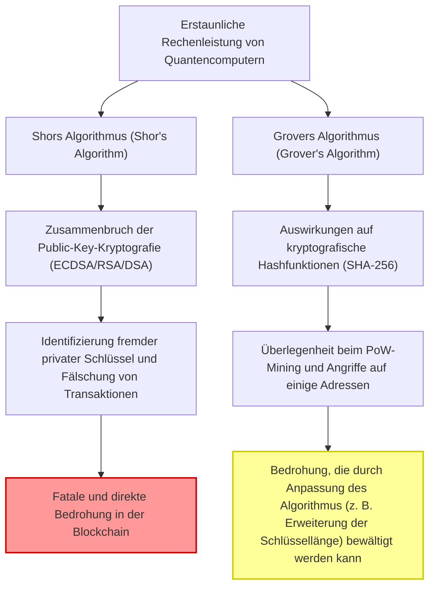
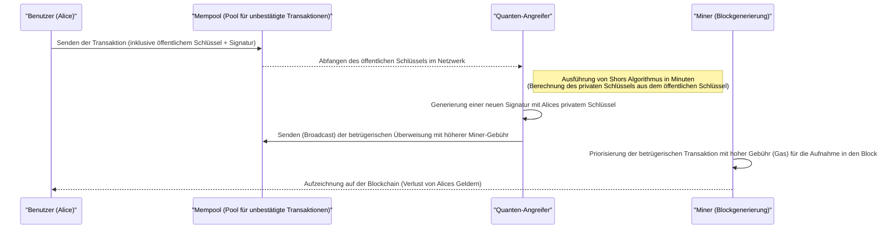
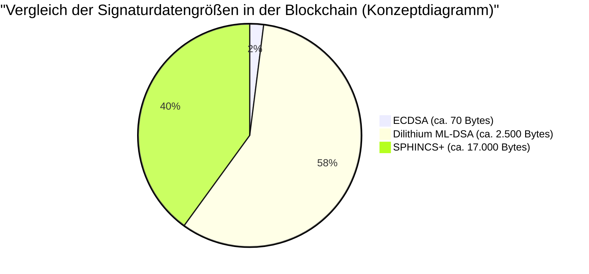

## 1. Einführung: Die Schritte des Post-Quanten-Zeitalters und die Krise der Blockchain

Seit der Erfindung von Bitcoin durch Satoshi Nakamoto im Jahr 2009 hat sich die Blockchain-Technologie als "dezentrales und manipulationssicheres Hauptbuch" zur Grundlage von Finanzsystemen und Anwendungen weltweit entwickelt. Diese robuste Sicherheit wird durch moderne kryptografische Technologien wie die **Public-Key-Kryptografie (Public Key Cryptography)** und **kryptografische Hashfunktionen (Cryptographic Hash Functions)** aufrechterhalten.

Diese kryptografischen Technologien garantieren Sicherheit basierend auf mathematischer "Rechenschwierigkeit", was bedeutet, dass selbst mit klassischen Computern (den PCs oder Supercomputern, die wir heute verwenden) eine Entschlüsselung unmöglich ist, selbst wenn man die Lebensdauer des Universums dafür aufwenden würde.

Diese Prämisse wird jedoch durch die rasche Entwicklung und praktische Anwendung von **Quantencomputern (Quantum Computers)**, der Grenze von Physik und Informatik, grundlegend umgestoßen. Quantencomputer, die quantenmechanische Phänomene wie "Superposition" und "Quantenverschränkung (Entanglement)" nutzen, weisen bei bestimmten mathematischen Problemen eine Rechenleistung auf, die klassische Computer bei weitem übertrifft – die sogenannte "Quantenüberlegenheit (Quantum Supremacy)".

In diesem Artikel werden wir eingehend und aus einer technischen und mathematischen Perspektive untersuchen, welchen spezifischen Bedrohungen die Blockchain-Technologie durch Quantencomputer ausgesetzt ist. Wir werden die neuesten Entwicklungen der **Post-Quanten-Kryptografie (PQC: Post-Quantum Cryptography)** als Lösung und die Migrationsszenarien für Krypto-Asset-Netzwerke detailliert erläutern.

---

## 2. Grundlagen von Quantencomputern und zwei große Bedrohungen für die Blockchain

Aktuelle Blockchain-Systeme bestehen hauptsächlich aus den folgenden zwei kryptografischen Elementen, die jeweils unterschiedlichen Bedrohungen durch Quantenalgorithmen ausgesetzt sind.

### 2.1. Grundlagen der Elliptic Curve Cryptography (ECDSA) und Rechenschwierigkeit

Viele Blockchains wie Bitcoin und Ethereum verwenden den **Elliptic Curve Digital Signature Algorithm (ECDSA)** als ihren digitalen Signaturalgorithmus. Insbesondere nutzt Bitcoin eine elliptische Kurve mit den Parametern `secp256k1`.

Die Sicherheit der Elliptic Curve Cryptography beruht auf der Rechenschwierigkeit des **Elliptic Curve Discrete Logarithm Problem (ECDLP)**.
Eine elliptische Kurve wird durch eine Gleichung in der folgenden Weierstraß-Normalform definiert.

$$
y^2 \equiv x^3 + ax + b \pmod{p}
$$

Bei Bitcoins `secp256k1` gilt $a = 0, b = 7$ und $p$ ist eine sehr große Primzahl.
Sei $G$ ein Basispunkt auf dieser Kurve und $k$ ein zufällig gewählter privater Schlüssel, der eine riesige 256-Bit-Zahl ist. Dann wird der öffentliche Schlüssel $K$ durch $k$-malige Addition (Skalarmultiplikation) des Basispunktes berechnet.

$$
K = k \times G = \underbrace{G + G + \dots + G}_{k \text{ times}}
$$

Die umgekehrte Berechnung des privaten Schlüssels $k$ aus dem veröffentlichten öffentlichen Schlüssel $K$ und dem Basispunkt $G$ (Berechnung des diskreten Logarithmus) mit einem klassischen Computer erfordert selbst mit den besten klassischen Algorithmen wie der Pollard-Rho-Methode eine exponentielle Rechenzeit von $\mathcal{O}(\sqrt{p})$. Bei einem 256-Bit-Schlüssel sind etwa $2^{128}$ Operationen erforderlich, was auf einem Niveau liegt, das selbst bei Milliarden Jahren Betrieb aktueller Supercomputer nicht gelöst werden kann.

### 2.2. Der Zusammenbruch durch Shors Algorithmus (Shor's Algorithm)

Dieser Ansatz wurde jedoch 1994 durch **Shors Algorithmus**, der von Peter Shor veröffentlicht wurde, vollständig zerstört. Shors Algorithmus wurde ursprünglich vorgeschlagen, um das Primfaktorzerlegungsproblem (die Basis der RSA-Kryptografie) in polynomieller Zeit zu lösen, er kann jedoch auch auf das Problem des diskreten Logarithmus und das Problem des diskreten Logarithmus auf elliptischen Kurven angewendet werden.

Der Kern von Shors Algorithmus liegt in der Verwendung der **Quanten-Fourier-Transformation (QFT: Quantum Fourier Transform)**, um die "Periode (Period)" einer Funktion schnell zu finden.

$$
\text{Klassische Berechnungskomplexität} = \mathcal{O}(2^{n/2}) \quad (n\text{ ist die Bitlänge})
$$
$$
\text{Berechnungskomplexität des Quantenalgorithmus} = \mathcal{O}(n^3)
$$

Auf diese Weise reduziert Shors Algorithmus die exponentielle Zeit drastisch auf **polynomielle Zeit (Polynomial Time)**. Sobald ein Quantencomputer mit ausreichend logischen Qubits fertiggestellt ist, wird es möglich sein, den privaten Schlüssel $k$ innerhalb von Minuten oder Sekunden aus einem im Netzwerk veröffentlichten öffentlichen Schlüssel $K$ zu identifizieren. Dies würde es einem Angreifer ermöglichen, leicht an den privaten Schlüssel der Wallet einer anderen Person zu gelangen und die vollständige Kontrolle über die Gelder zu übernehmen.

#### 2.2.1 Schritt-für-Schritt-Erklärung der ECDLP-Entschlüsselung durch Shors Algorithmus

Lassen Sie uns den internen Prozess Schritt für Schritt betrachten, wie ein Quantencomputer das Elliptic Curve Discrete Logarithm Problem (ECDLP) löst.

Problemstellung: In $K = k \times G$ sind $G$ und $K$ bekannt, und wir möchten die unbekannte ganze Zahl $k$ (den privaten Schlüssel) finden. Sei die Ordnung der elliptischen Kurve $N$.

**Schritt 1: Erzeugung des Superpositionszustands**
Zunächst werden zwei Quantenregister vorbereitet, und auf jedes wird ein Hadamard-Gatter (Hadamard Gate) angewendet, um einen Superpositionszustand aller möglichen Kombinationen ganzer Zahlen zu erzeugen.
$$
|\psi_1\rangle = \frac{1}{N} \sum_{x=0}^{N-1} \sum_{y=0}^{N-1} |x\rangle |y\rangle |0\rangle
$$

**Schritt 2: Anwendung des Quantenorakels (Auswertung der Funktion)**
Als nächstes wird unter Verwendung eines Quantenschaltkreises (Orakel), der Punkte auf einer elliptischen Kurve addiert, die Funktion $f(x, y) = x \times G + y \times K$ in einem dritten Register berechnet.
$$
|\psi_2\rangle = \frac{1}{N} \sum_{x=0}^{N-1} \sum_{y=0}^{N-1} |x\rangle |y\rangle |x \times G + y \times K\rangle
$$
Wichtig hierbei ist, da $K = k \times G$ gilt, kann dies als $f(x, y) = (x + y \cdot k) \times G$ umgeschrieben werden.

**Schritt 3: Messung des dritten Registers**
Wenn das dritte Register gemessen wird, kollabiert es zu einem Punkt $R$ auf der elliptischen Kurve. Dadurch kollabieren das erste und zweite Register in einen Superpositionszustand von Paaren $(x, y)$, die $x + y \cdot k \equiv c \pmod{N}$ ($c$ ist eine Konstante) erfüllen.
$$
|\psi_3\rangle = \frac{1}{\sqrt{N}} \sum_{y=0}^{N-1} |c - y \cdot k \pmod{N}\rangle |y\rangle
$$

**Schritt 4: Anwendung der Quanten-Fourier-Transformation (QFT)**
Dieser Zustand hat eine Periodizität, die mit der Periode $k$ zusammenhängt. Durch Anwendung der inversen Quanten-Fourier-Transformation (Inverse QFT) auf diesen Zustand wird eine Phaseninterferenz ausgelöst, die die Periodeninformationen in Amplituden umwandelt.

**Schritt 5: Messung und klassische Nachbearbeitung**
Wenn das erste und zweite Register gemessen werden, erhält man mit hoher Wahrscheinlichkeit einen Wert, der Informationen über $k$ enthält. Durch die Anwendung klassischer zahlentheoretischer Algorithmen wie der Kettenbruchentwicklung (Continued Fractions) auf den gemessenen Wert kann der unbekannte private Schlüssel $k$ vollständig identifiziert werden.

Die Anzahl der für diesen gesamten Prozess benötigten Quantengatter beträgt $\mathcal{O}(\log^3 N)$, und der private Schlüssel wird mit einer extremen Geschwindigkeit aufgedeckt, die nicht mit der Suche in $\mathcal{O}(\sqrt{N})$ durch klassische Computer vergleichbar ist.

### 2.3. Grovers Algorithmus (Grover's Algorithm) und Auswirkungen auf Hashfunktionen

Eine weitere Bedrohung ist **Grovers Algorithmus**, der 1996 von Lov Grover vorgeschlagen wurde. Dieser hat große Auswirkungen auf Hashfunktionen (z. B. SHA-256).

In der Blockchain werden Hashfunktionen zur Gewährleistung der Datenintegrität, zur Generierung von Adressen und als Grundlage für das **PoW-Mining (Proof of Work)** in Bitcoin verwendet. Die Rückrechnung (Urbildberechnung) einer Hashfunktion kann als "Problem der Suche in unstrukturierten Datenbanken" betrachtet werden, bei dem nach einem Eingabewert $x$ gesucht wird, für den $H(x) = y$ für einen bestimmten Ausgabewert $y$ gilt.

Mit einem klassischen Computer sind im Durchschnitt $\frac{N}{2}$ und im schlimmsten Fall $N$ Versuche erforderlich, um die richtige Antwort unter $N$ Möglichkeiten zu finden. Die Berechnungskomplexität beträgt also $\mathcal{O}(N)$.
Grovers Algorithmus verwendet jedoch eine Quantentechnologie namens "Amplitudenverstärkung (Amplitude Amplification)". Durch iteratives Verstärken der Wahrscheinlichkeitsamplitude des Zustands, der die richtige Antwort darstellt, aus allen Möglichkeiten im Superpositionszustand, wird die Suchzeit auf die Quadratwurzel reduziert.

$$
\text{Berechnungskomplexität von Grovers Algorithmus} = \mathcal{O}(\sqrt{N})
$$

Im Fall von SHA-256 ist $N = 2^{256}$, sodass eine klassische Brute-Force-Suche etwa $2^{256}$ Versuche erfordert. Wenn jedoch Grovers Algorithmus verwendet wird, sind nur $\sqrt{2^{256}} = 2^{128}$ Versuche erforderlich. Dies bedeutet, dass eine 256-Bit-Hashfunktion gegenüber Quantencomputern **praktisch auf eine Sicherheitsstärke von 128 Bit halbiert wird**.

#### 2.3.1. Wird SHA-256 überleben? (Quantum Supremacy in Hashing)

Obwohl sich die Sicherheit halbiert, ist eine "128-Bit-Sicherheit" immer noch extrem stark. $2^{128}$ Operationen sind selbst nach heutigem Stand der Technik eine astronomische Zahl und würden die Lebensdauer des Universums erfordern.
Daher ist die Ansicht weit verbreitet, dass **"SHA-256 auch gegenüber Quantencomputern eine praktische Sicherheit beibehält"**. Wenn es in Zukunft erforderlich sein sollte, die Sicherheitsmarge zu erhöhen, kann die klassische 256-Bit-Sicherheit auch in der Quantenwelt aufrechterhalten werden, indem einfach die Ausgabelänge des Hashs verdoppelt wird (z. B. Migration von SHA-256 zu SHA-512).

Zusammenfassend lässt sich sagen, dass die Quantenbedrohung für Hashfunktionen "gering und handhabbar" ist, während die Bedrohung für Public-Key-Kryptografie (ECDSA) "fatal" ist.

---

## 3. Analyse der konkreten Auswirkungen auf aktuelle Krypto-Assets (Bitcoin, Ethereum)

Welchen spezifischen Schwachstellen werden Krypto-Asset-Netzwerke in einer Welt ausgesetzt sein, in der ECDSA durch Quantencomputer entschlüsselt werden kann? Hier werden wir am Beispiel der Funktionsweise von Bitcoin eine detaillierte Analyse aus der Perspektive des **"Zeitpunkts der Offenlegung des öffentlichen Schlüssels"** durchführen.

### 3.1. Generierung von Adressen und die "Nicht-Öffentlichkeit" des öffentlichen Schlüssels

Bitcoin-Adressen (P2PKH: Pay-to-Public-Key-Hash und P2WPKH: Pay-to-Witness-Public-Key-Hash) verwenden nicht den öffentlichen Schlüssel selbst, sondern einen mehrfach gehashten öffentlichen Schlüssel.

$$
\text{Bitcoin Address} = \text{Base58Check}(\text{RIPEMD160}(\text{SHA256}(\text{Public Key})))
$$

Wie bereits erwähnt, sind Hashfunktionen resistent gegen Quantenangriffe (Grovers Algorithmus), sodass es selbst für Quantencomputer unmöglich ist, den ursprünglichen "öffentlichen Schlüssel" aus der "Adresse", die ein Hashwert ist, rückzurechnen.
Das bedeutet, dass für **"unbenutzte Adressen (solche, von denen noch nie Gelder gesendet wurden)"** der öffentliche Schlüssel überhaupt nicht auf der Blockchain offengelegt ist und nur der Hashwert aufgezeichnet wird. Da der öffentliche Schlüssel unbekannt ist, gibt es daher kein Ziel für die Ausführung von Shors Algorithmus, und der private Schlüssel kann nicht identifiziert werden. Es kann gesagt werden, dass Wallets in diesem Zustand quantensicher (Quantum-safe) sind.

### 3.2. Fatale Schwachstelle beim Senden von Transaktionen (Front-Running-Angriff)

Das Problem tritt auf, wenn der Benutzer Gelder überweist.
Beim Übertragen (Senden) einer Transaktion an das Netzwerk muss der Benutzer zusammen mit der digitalen Signatur **seinen öffentlichen Schlüssel in die Transaktionsdaten aufnehmen und ihn dem gesamten Netzwerk zur Überprüfung offenlegen**.

Sobald der öffentliche Schlüssel an den Mempool (den Wartebereich für unbestätigte Transaktionen) gesendet wurde, werden diese Daten mit Nodes weltweit geteilt. Wenn ein Angreifer über einen ultraschnellen Quantencomputer verfügt, könnte er mit folgendem Prozess Gelder stehlen:

1. Eine legitime Benutzertransaktion (Alice) aus dem Mempool abfangen und **den öffentlichen Schlüssel extrahieren**.
2. Shors Algorithmus ausführen und **den privaten Schlüssel aus dem öffentlichen Schlüssel innerhalb von Minuten (bevor der Block bestätigt wird) berechnen**.
3. Den erhaltenen privaten Schlüssel verwenden, um **eine gefälschte Transaktion zu erstellen**, die Alices Gelder an die Adresse des Angreifers sendet.
4. Diese gefälschte Transaktion mit einer **viel höheren Miner-Gebühr (Fee)** als Alices ursprüngliche Transaktion an das Netzwerk senden.

Miner folgen wirtschaftlichen Anreizen und priorisieren Transaktionen mit hohen Gebühren für die Aufnahme in Blöcke. Infolgedessen wird die betrügerische Überweisung des Angreifers zuerst bestätigt (Confirm), und Alices legitime Überweisung wird als "unzureichendes Guthaben (Double Spend)" verworfen.
Diese Abfolge von Ereignissen wird als **Front-Running-Angriff (Front-running Attack)** bezeichnet. In einer Welt, in der Quantencomputer praktisch einsetzbar sind, würde dies zu der erschreckenden Situation führen, dass in dem Moment, in dem jemand auf den Senden-Button drückt, seine Gelder von Hackern gestohlen werden.

### 3.3. Die Krise wiederverwendeter Adressen und alter Adressen (P2PK)

Ein noch größeres Problem ist, dass bei Adressen, von denen in der Vergangenheit bereits Gelder gesendet wurden (z. B. wenn sie als Wechselgeldadressen wiederverwendet werden), der öffentliche Schlüssel bereits dauerhaft auf der Blockchain aufgezeichnet ist. Bei diesen Adressen besteht jederzeit die Gefahr, dass der private Schlüssel berechnet und das Guthaben gestohlen wird, ohne dass auf das Senden einer Transaktion gewartet werden muss.

Darüber hinaus wurde beim **P2PK-Format (Pay-to-Public-Key)**, das von 2009 bis etwa 2010 vorherrschte und die frühen Mining-Belohnungen von Satoshi Nakamoto (über 1 Million BTC) enthält, der öffentliche Schlüssel selbst direkt als Adresse auf der Blockchain aufgezeichnet, nicht als Hash. Diese massiven Mengen an ruhenden Bitcoins wären das leichteste Ziel für Quantencomputer, und wenn sie alle auf einmal gestohlen und auf den Markt geworfen werden, könnte dies einen massiven Preisverfall auslösen.

---

## 4. Migrationsszenarien zur Post-Quanten-Kryptografie (PQC: Post-Quantum Cryptography)

Um eine solche Katastrophe am "Q-Day (dem Tag, an dem die Kryptografie durch Quantencomputer gebrochen wird)" zu vermeiden, planen die kryptografische Wissenschaft und die Blockchain-Community den Übergang zur **Post-Quanten-Kryptografie (PQC)**, die auch von Quantenalgorithmen schwer zu knacken ist.
Das US National Institute of Standards and Technology (NIST) führt seit Jahren einen PQC-Standardisierungsprozess durch, und nach mehreren Runden strenger Evaluierung wurden einige vielversprechende kryptografische Methoden als endgültige Standards ausgewählt.

Wir werden die wichtigsten PQC-Algorithmen, die als Alternativen für digitale Blockchain-Signaturen Beachtung finden, zusammen mit ihren mathematischen Mechanismen im Detail erläutern.

### 4.1. Hash-basierte Signaturen (Hash-Based Signatures)

Hash-basierte Signaturen sind eine kryptografische Methode, deren Sicherheit ausschließlich auf einer sehr einfachen und starken Grundlage beruht: der "Kollisionsresistenz der Hashfunktion". Da die Sicherheit von Hashfunktionen gegen Quantencomputer bereits nachgewiesen ist (wie oben erwähnt, ist eine Sicherheitsmarge von 128 Bit ausreichend), handelt es sich um einen äußerst zuverlässigen Ansatz.
Bemerkenswerte Beispiele sind **Lamport-Signaturen (Lamport Signatures)**, das davon abgeleitete WOTS (Winternitz One-Time Signature) und der NIST-Standardisierungskandidat **SPHINCS+** (jetzt als FIPS 205 unter dem Namen SLH-DSA bekannt).

#### 4.1.1. Mathematische Details der Lamport-Signatur (One-Time Signature)

Lassen Sie uns den Mechanismus von Lamport-Signaturen in mathematischerem Detail betrachten.
Sei die Hashfunktion $H: \{0, 1\}^* \to \{0, 1\}^{256}$.

**【Schlüsselerzeugung】**
Alice (die Senderin) verwendet einen echten Zufallszahlengenerator (TRNG), um 256 Paare von privaten Schlüsseln zu generieren.
$$
\text{sk}_{i,0} \in \{0, 1\}^{256}, \quad \text{sk}_{i,1} \in \{0, 1\}^{256} \quad (1 \le i \le 256)
$$
Der private Schlüssel $\text{sk}$ besteht somit aus insgesamt 512 256-Bit-Strings (Größe: $512 \times 32 = 16.384$ Byte).

Als nächstes berechnet sie den öffentlichen Schlüssel $\text{pk}$. Jede Komponente des privaten Schlüssels wird individuell gehasht.
$$
\text{pk}_{i,0} = H(\text{sk}_{i,0}), \quad \text{pk}_{i,1} = H(\text{sk}_{i,1})
$$
Der öffentliche Schlüssel ist ebenfalls $16.384$ Byte groß. Dieser wird im Blockchain-Netzwerk veröffentlicht.

**【Signaturerstellung】**
Um Transaktionsdaten $M$ zu signieren, berechnet Alice zunächst deren Hashwert.
$$
h = H(M) \in \{0, 1\}^{256}
$$
Sei das $i$-te Bit des Hashwertes $h$ gleich $h_i \in \{0, 1\}$.
Alices Signatur $\sigma$ ist die Menge der privaten Schlüsselkomponenten, die jedem Bit $h_i$ entsprechen.
$$
\sigma = (\text{sk}_{1, h_1}, \text{sk}_{2, h_2}, \dots, \text{sk}_{256, h_{256}})
$$
Mit anderen Worten, wenn das Bit des Nachrichtenhashs `0` ist, wird $\text{sk}_{i,0}$ veröffentlicht, und wenn es `1` ist, wird $\text{sk}_{i,1}$ veröffentlicht. Die Signaturgröße beträgt $256 \times 32 = 8.192$ Byte.

**【Signaturprüfung】**
Der Miner (Prüfer) verwendet die empfangene Transaktion $M$, die Signatur $\sigma = (s_1, s_2, \dots, s_{256})$ und den öffentlichen Schlüssel $\text{pk}$, um eine Überprüfung durchzuführen.
Der Hash der Transaktion $h = H(M)$ wird neu berechnet, und es wird geprüft, ob der Hash jedes $s_i$ mit dem entsprechenden Element $\text{pk}_{i, h_i}$ des öffentlichen Schlüssels übereinstimmt.
$$
H(s_i) \overset{?}{=} \text{pk}_{i, h_i} \quad (\text{für alle } 1 \le i \le 256)
$$

Dieser Prozess ist mathematisch extrem einfach, und solange ein Quantencomputer die Funktion $H$ nicht rückrechnen kann, ist es unmöglich, eine Signatur zu fälschen. Da jedoch bei einer Signatur die Hälfte des privaten Schlüssels dem Netzwerk offengelegt wird, führt das Signieren einer anderen Nachricht mit demselben Schlüsselpaar dazu, dass die offengelegten privaten Schlüssel kombiniert werden und dem Angreifer Raum für Fälschungen bieten. Dies führt zu der starken Einschränkung, dass sie nur "einmalig (One-Time)" verwendet werden können.
Um dies praktikabel zu machen, wurden Technologien wie **XMSS**, die einen Merkle-Baum verwenden, um zahlreiche One-Time-Schlüssel in einem Stamm-Public-Key (Root Public Key) zu bündeln, und zustandslose (**stateless**) Methoden wie **SPHINCS+** entwickelt, die jedoch den Nachteil haben, dass die Signaturgrößen mehrere Dutzend Kilobyte erreichen.

### 4.2. Gitterbasierte Kryptografie (Lattice-Based Cryptography)

Derzeit ist die **gitterbasierte Kryptografie** als Mainstream der PQC am vielversprechendsten und wurde als Hauptstandard des NIST übernommen (FIPS 204: ML-DSA / ehemals CRYSTALS-Dilithium sowie Falcon usw.).

Die Sicherheit der gitterbasierten Kryptografie beruht auf mathematisch bewiesenen schweren Problemen, wie dem "Kürzesten-Vektor-Problem (SVP: Shortest Vector Problem)" in mehrdimensionalen Gittern oder dem "Learning With Errors-Problem (LWE)". Es wurden keine Algorithmen gefunden, die Gitterprobleme selbst mit Quantencomputern effizient lösen.

**Mathematisches Modell von LWE (Learning With Errors):**
Die Grundidee des LWE-Problems besteht darin, simultanen linearen Gleichungen absichtlich ein "kleines Rauschen (Fehler)" hinzuzufügen, um das Problem drastisch zu erschweren.
Sei der geheime Vektor $\mathbf{s} \in \mathbb{Z}_q^n$.
Es gibt eine zufällig ausgewählte große öffentliche Matrix $\mathbf{A} \in \mathbb{Z}_q^{m \times n}$ und einen absichtlich hinzugefügten kleinen Rauschvektor $\mathbf{e} \in \mathbb{Z}_q^m$.
Der öffentliche Schlüssel $\mathbf{b}$ wird wie folgt berechnet:

$$
\mathbf{b} = \mathbf{A}\mathbf{s} + \mathbf{e} \pmod{q}
$$

Selbst wenn die Matrix $\mathbf{A}$ und der Vektor $\mathbf{b}$ (öffentlicher Schlüssel) öffentlich bekannt sind, ist die Rückrechnung des privaten Schlüssels $\mathbf{s}$ durch das Vorhandensein des Rauschens $\mathbf{e}$ sehr schwierig. Ohne das Rauschen könnte es einfach durch Gaußsche Elimination gelöst werden, aber das Hinzufügen von Rauschen führt zu einer explosiven Vergrößerung des Suchraums in allen Dimensionen, was eine robuste Sicherheit sowohl gegen klassische als auch gegen Quantencomputer bietet.
In tatsächlichen Algorithmen, die in Blockchains und ähnlichem verwendet werden (wie Dilithium), wird dies als **Ring-LWE (oder Module-LWE)** auf einem Polynomring eingesetzt, um die Schlüsselgröße zu reduzieren und Berechnungen zu beschleunigen.

* **Vorteile**: Im Vergleich zu Hash-basierten Signaturen sind der öffentliche Schlüssel und die Signaturgröße relativ klein (wenige Kilobyte), und die Rechengeschwindigkeit für die Signaturerstellung und -überprüfung ist extrem schnell (vergleichbar oder schneller als ECDSA).
* **Nachteile**: Die mathematische Struktur ist komplex und der historische Bewertungszeitraum ist kurz, sodass das Risiko, dass in Zukunft neue Entschlüsselungsalgorithmen entdeckt werden, nicht Null ist.

---

## 5. Technische Herausforderungen beim PQC-Übergang in Blockchains

Auch wenn es PQC-Algorithmen (wie Dilithium oder SPHINCS+) gibt, bedeutet das nicht, dass sie ab morgen in Bitcoin oder Ethereum eingeführt werden können. Es gibt mehrere große Herausforderungen, die spezifisch für dezentrale Systeme sind.

### 5.1. Aufblähen der Signaturgrößen und der Zusammenbruch der Skalierbarkeit

Die größte Hürde bei der Einführung von PQC ist die massive Aufblähung der Datengrößen.
Während die aktuelle Signaturgröße von ECDSA etwa 70 Byte beträgt, beträgt die Signaturgröße von Dilithium (ML-DSA) etwa 2.420 bis 4.595 Byte (je nach Sicherheitsniveau) und die Größe des öffentlichen Schlüssels übersteigt 1.300 Byte. Bei Hash-basiertem SPHINCS+ erreicht allein die Signatur mehrere zehntausend Byte.

Wenn Bitcoin PQC bei gleicher Blockgrößenbeschränkung (etwa 4 MB Gewicht einschließlich SegWit) einführen würde, würde die Anzahl der Transaktionen, die in einem Block gespeichert werden können, drastisch sinken. Der Durchsatz des Netzwerks (TPS: Transactions Per Second) würde katastrophal abnehmen, und Transaktionsstaus würden zur Norm werden.
Um dies zu beheben, wäre eine deutliche Erhöhung der Blockgröße erforderlich, was jedoch die Speicheranforderungen und Netzwerkbandbreitenanforderungen für Full Nodes erhöhen würde, was es für Einzelpersonen schwierig macht, Nodes zu betreiben, und letztendlich zum Dilemma einer **Zentralisierung des Netzwerks** führt.

*(※ Die Datenaufblähung von Transaktionen bei der Einführung von PQC wird zu einem fatalen Engpass für die Skalierbarkeit werden)*

### 5.2. Auswirkungen auf die Ethereum Virtual Machine (EVM) und vorkompilierte Smart Contracts

In Turing-vollständigen Smart-Contract-Plattformen wie Ethereum erfordert die Einführung von PQC ein grundlegendes Upgrade der EVM (Ethereum Virtual Machine).
In der aktuellen EVM wird zur Überprüfung von ECDSA-Signaturen ein vorkompilierter Contract (Precompiled Contract) namens `ecrecover` (Adresse: `0x01`) bereitgestellt, der so optimiert ist, dass er Signaturprüfungen mit sehr niedrigen Gasgebühren (3000 Gas) durchführt.

Die Verarbeitungslogik für neue Gitter-basierte Kryptoalgorithmen wie Dilithium oder Falcon beinhaltet jedoch komplexe Polynom- oder Matrixoperationen. Wenn sie nur mit bestehenden EVM-Opcodes (Opcode) implementiert würde, könnte eine einzige Signaturüberprüfung Millionen bis Zehnmillionen von Gas verbrauchen. Dies liegt auf einem Niveau, das das aktuelle Block-Gaslimit (etwa 30 Millionen Gas) mit einer einzigen Transaktion aufbrauchen würde.

Um dies zu vermeiden, ist es notwendig, durch einen Hard Fork (Hard Fork) des Netzwerks einen neuen Precompiled Contract zur PQC-Überprüfung (z.B. Zuweisung von DilithiumVerify zu `0x10`) in die EVM selbst aufzunehmen. Dies erfordert einen langfristigen Prozess, bei dem die Core-Entwickler jedes Ethereum-Clients (Geth, Nethermind, Erigon usw.) zusammenarbeiten, um die Logik der Gitterkryptografie-Überprüfung auf Sprachebene in C++, Go, Rust usw. optimiert zu implementieren und Sicherheitsaudits durchzuführen.

### 5.3. Schwierigkeit der Konsensfindung durch Hard Forks

Um den zugrunde liegenden Signaturalgorithmus zu ändern, ist ein **Hard Fork (Hard Fork)** erforderlich, der das Protokoll des gesamten Netzwerks aktualisiert. Der Prozess zur Erzielung eines Konsenses ist jedoch in Gemeinschaften wie Bitcoin, die großen Wert auf "Keine Regeländerungen und Dezentralisierung" legen, politisch extrem schwierig. Von dem Moment an, in dem ein BIP (Bitcoin Improvement Proposal) für den Übergang zu PQC vorgeschlagen wird, bis zu seiner Umsetzung werden Jahre der Diskussion und Tests erforderlich sein.

---

## 6. Wann kommt der "Q-Day"? Roadmap für die Migration

Wann wird der "Q-Day", an dem Quantencomputer die 256-Bit Elliptic Curve Cryptography vollständig entschlüsseln, eintreten?
Obwohl die Meinungen unter Forschern auseinandergehen, prognostizieren viele Experten, dass groß angelegte Quantencomputer mit Tausenden bis Zehntausenden stabiler logischer Qubits (fehlerkorrigierte Qubits mit Rauschtoleranz) **"zwischen Mitte der 2030er und den 2040er Jahren"** auf den Markt kommen werden. Je nach Durchbrüchen in der Hardware-Architektur oder der Entdeckung effizienterer Quantenalgorithmen kann jedoch nicht ausgeschlossen werden, dass dieser Zeitpunkt früher eintreten könnte (um 2030).

Die Roadmap, die das Krypto-Asset-Ökosystem einschlagen sollte, bevor es zu spät ist, sieht wie folgt aus.

### Phase 1: Hybride Signaturen und Kontoabstraktion (Account Abstraction) (Jetzt bis ca. 2028)
Die derzeitige Blockchain-Community, insbesondere das Ethereum-Entwicklungsteam (Vitalik Buterin usw.), erwägt **"hybride Signaturen"**, die ECDSA und PQC (Hash-basierte Signaturen oder gitterbasierte Kryptografie) kombinieren. Dies ist ein Ansatz, bei dem einer Transaktion sowohl die bestehende sichere ECDSA-Signatur als auch eine PQC-Signatur hinzugefügt werden, wodurch die Sicherheit erhalten bleibt, selbst wenn eine davon gebrochen wird.
Darüber hinaus werden durch die Nutzung der Kontoabstraktion (Account Abstraction, ERC-4337) Bemühungen vorangetrieben, PQC-Signaturen auf Smart-Contract-Wallets auf Opt-in-Basis (nur für Benutzer, die dies wünschen) zu implementieren und zu unterstützen, ohne auf einen Protokoll-Hard-Fork zu warten.

### Phase 2: Nutzung von Zero-Knowledge Proofs (ZK-Rollups) (2025 ~)
Die Trumpfkarte zur Lösung des größten Schwachpunkts von PQC, der "Aufblähung von Signaturdaten", ist die erwartete Nutzung der Layer-2-Technologie, **ZK-Rollups (Zero-Knowledge Proofs)**.
Anstatt riesige PQC-Signaturdaten direkt in Layer 1 (die Mainchain) zu schreiben, werden zahlreiche PQC-Transaktionen auf Layer 2 verifiziert und aggregiert. Dann werden sie mithilfe von ZK-SNARKs oder ZK-STARKs in einen extrem kleinen, einzelnen "Beweis (Proof)" komprimiert und auf Layer 1 aufgezeichnet.
Es ist anzumerken, dass bestimmte SNARK-Konstruktionen (wie Groth16) selbst quanten-anfällig sind. Daher ist die Annahme von **ZK-STARKs**, die sich ausschließlich auf quantenresistente Hashfunktionen stützen, der Schlüssel.

### Phase 3: Protokoll-Level Hard Fork (ca. 2030)
Sobald die NIST-Standardisierung für PQC vollständig etabliert ist und branchenübliche Bibliotheken verfügbar und gründlich getestet sind, wird erwartet, dass große Chains wie Bitcoin und Ethereum einen Hard Fork durchführen, um die Standard-Signaturmethode vollständig auf PQC umzustellen. Während dieser Übergangsphase wird es groß angelegte Ankündigungen geben, die die Benutzer auffordern, "ihre Gelder von alten Wallets in neue PQC-kompatible Wallets zu verschieben".

### Wegweisende Projektbeispiele

Einige Blockchain-Projekte haben diese Quantenbedrohung antizipiert und wurden von Anfang an mit dem Anspruch auf Quantenresistenz entwickelt.
* **QRL (Quantum Resistant Ledger)**: Eine frühe Blockchain, die XMSS (eXtended Merkle Signature Scheme), eine Hash-basierte PQC, nativ auf Protokollebene implementiert hat.
* **Algorand / Cellframe**: Projektgruppen, die über eine flexible modulare Architektur der Kryptografie-Schicht im Hinblick auf zukünftige PQC-Updates verfügen und aktiv nach der Integration von Gitterkryptografie suchen.

---

## 7. Fazit: Die Zukunft von Krypto-Assets und der Schutz unserer Vermögenswerte

Die Ankunft des "Post-Quanten-Zeitalters" hat den Bereich der reinen Science-Fiction überschritten und steht uns bereits als konkretes technisches Problem für reale kryptografische Systeme unmittelbar bevor.

Die beiden Schwerter des Quantencomputings, Shors Algorithmus und Grovers Algorithmus, bedrohen die Grundlage der heutigen Blockchains, nämlich die Public-Key-Kryptografie bzw. Hashfunktionen. Insbesondere die Verwundbarkeit von ECDSA ist fatal, und der Übergang zur Post-Quanten-Kryptografie (PQC) ist eine absolute Notwendigkeit, um das Risiko eines Diebstahls von Geldern durch Front-Running-Angriffe zu vermeiden.

Die Tech-Welt und die Blockchain-Community warten jedoch nicht tatenlos auf den Weltuntergang. Die Auswahl und Standardisierung von PQC-Algorithmen wie der gitterbasierten Kryptografie und Hash-basierten Signaturen schreitet stetig voran, und durch den Einsatz von Zero-Knowledge-Proofs (ZK-STARKs) und Layer-2-Skalierungstechnologien zeichnet sich ein Weg ab, das größte Hindernis der PQC-Einführung, die "Aufblähung der Datengröße", zu überwinden.

Normale Krypto-Benutzer und Investoren wie wir müssen jetzt nicht in Panik geraten und alle unsere Gelder verkaufen. Es ist jedoch wichtig, ein grundlegendes Verständnis und Bewusstsein für den Selbstschutz wie folgt zu haben:

* **Vermeiden Sie die Wiederverwendung von Adressen**: Vermeiden Sie es strikt, Gelder für lange Zeiträume an "verwendeten Adressen (Adressen, von denen mindestens einmal Gelder gesendet wurden und der öffentliche Schlüssel auf der Blockchain freigelegt ist)" zu speichern. Dies gilt nicht nur aus Gründen des Datenschutzes, sondern auch aus Sicherheitsgründen.
* **Behalten Sie Technologietrends im Auge**: Verfolgen Sie Nachrichten über Diskussionen und Hard Forks im Zusammenhang mit der PQC-Migration auf großen Netzwerken wie Bitcoin-BIPs oder Ethereum-EIPs, damit Sie Ihre Wallets bei Bedarf rechtzeitig migrieren können.

Die Geschichte der Blockchain ist immer eine Geschichte von Upgrades und Widerstandsfähigkeit (Resilience) gegenüber neuen technologischen Bedrohungen. So wie sie Skalierbarkeitsprobleme und Umweltbedenken (wie den Übergang von PoW zu PoS) überwunden hat, wird das gesamte Ökosystem zweifellos nach Lösungen für diese beispiellose Quantenbedrohung suchen und sich anpassen.
Wir können auf eine Zukunft hoffen, in der die neue Weisheit der Menschheit in Form von Quantencomputern und die Vertrauenstechnologie dezentraler Ledger nicht durch eine Kollision zusammenbrechen, sondern auf einer höheren Ebene zu einem robusteren System verschmelzen.

---
*Referenzen und weiterführende Links:*
* National Institute of Standards and Technology (NIST) - Post-Quantum Cryptography Standardization Project
* Shor, P. W. (1994). Algorithms for quantum computation: discrete logarithms and factoring.
* Grover, L. K. (1996). A fast quantum mechanical algorithm for database search.
* Buterin, V. (2024). How to hard-fork to save most users' funds in a quantum emergency.
