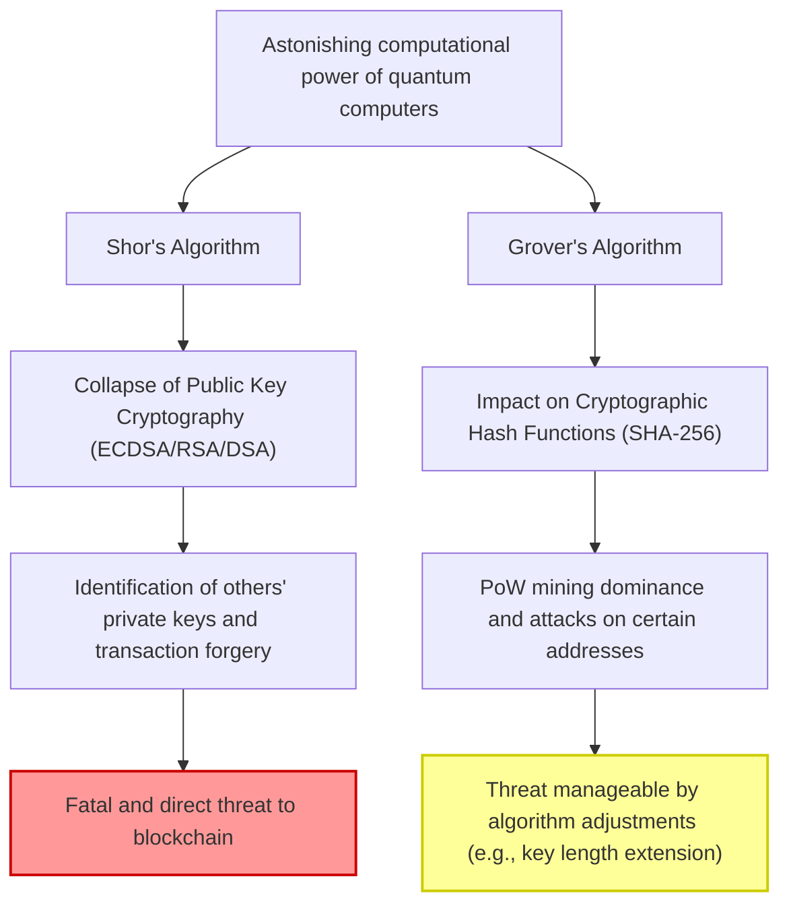
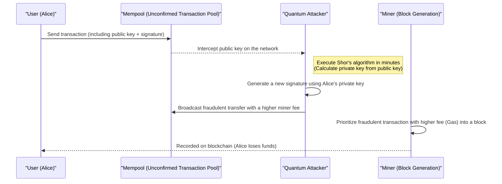
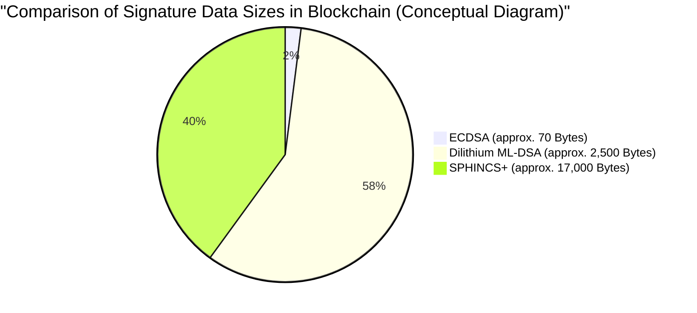

## 1. Introduction: The Footsteps of the Post-Quantum Era and the Crisis of Blockchain

Since the birth of Bitcoin by Satoshi Nakamoto in 2009, blockchain technology has grown to become the foundation of financial systems and applications worldwide as a "decentralized and tamper-proof ledger." This robust security is supported by modern cryptographic technologies: **Public Key Cryptography** and **Cryptographic Hash Functions**.

These cryptographic technologies guarantee security based on the mathematical "computational difficulty" that classical computers (the PCs and supercomputers we currently use) cannot decipher even if they took time equivalent to the lifespan of the universe.

However, this premise is about to be fundamentally overturned by the rapid development and practical application of **Quantum Computers**, the frontier of physics and information science. Quantum computers, which utilize quantum mechanics specifics such as "Superposition" and "Entanglement," demonstrate computational power that overwhelms conventional classical computers in specific mathematical problems, a phenomenon known as "Quantum Supremacy."

In this article, we will thoroughly and deeply delve into what specific threats blockchain technology faces from quantum computers, the latest trends in **Post-Quantum Cryptography (PQC)** that serve as a solution, and the transition scenarios for crypto asset networks from a technical and mathematical perspective.

---

## 2. Basics of Quantum Computers and Two Major Threats to Blockchain

Current blockchain systems are primarily composed of the following two cryptographic elements, each of which is exposed to different threats from quantum algorithms.

### 2.1. Basics of Elliptic Curve Cryptography (ECDSA) and Computational Difficulty

Many blockchains, including Bitcoin and Ethereum, employ the **Elliptic Curve Digital Signature Algorithm (ECDSA)** as their digital signature algorithm. Specifically, Bitcoin uses an elliptic curve with the parameter `secp256k1`.

The security of elliptic curve cryptography relies on the computational difficulty of the **Elliptic Curve Discrete Logarithm Problem (ECDLP)**.
An elliptic curve is defined by the following equation in the Weierstrass normal form:

$$
y^2 \equiv x^3 + ax + b \pmod{p}
$$

In Bitcoin's `secp256k1`, $a = 0, b = 7$, and $p$ is a very large prime number.
Let $G$ be the base point (reference point) on this curve, and $k$ be the private key, which is a randomly chosen massive 256-bit integer. The public key $K$ is then obtained by adding the base point $k$ times (scalar multiplication).

$$
K = k \times G = \underbrace{G + G + \dots + G}_{k \text{ times}}
$$

Calculating the private key $k$ (finding the discrete logarithm) from the exposed public key $K$ and base point $G$ using classical computers requires an exponential computational time of $\mathcal{O}(\sqrt{p})$, even when using the best classical algorithms like Pollard's rho algorithm. For a 256-bit key, it takes about $2^{128}$ operations, a level that cannot be solved even if current supercomputers are run for billions of years.

### 2.2. Collapse by Shor's Algorithm

However, **Shor's Algorithm**, published by Peter Shor in 1994, completely destroyed this premise. Shor's algorithm was originally proposed to solve the prime factorization problem (the foundation of RSA cryptography) in polynomial time, but it can also be applied to the discrete logarithm problem and the elliptic curve discrete logarithm problem.

The core of Shor's algorithm lies in rapidly finding the "Period" of a function using the **Quantum Fourier Transform (QFT)**.

$$
\text{Classical computational complexity} = \mathcal{O}(2^{n/2}) \quad (\text{where } n \text{ is the bit length})
$$
$$
\text{Quantum algorithm computational complexity} = \mathcal{O}(n^3)
$$

In this way, Shor's algorithm dramatically reduces exponential time to **Polynomial Time**. If a quantum computer with sufficient logical qubits is completed, it will be possible to determine the private key $k$ from the public key $K$ exposed on the network in minutes or seconds. This allows attackers to easily obtain the private keys of others' wallets and take full control of their funds.

#### 2.2.1 Step-by-Step Explanation of ECDLP Decryption by Shor's Algorithm

Let's look at the internal process of how a quantum computer solves the Elliptic Curve Discrete Logarithm Problem (ECDLP) step by step.

Problem setting: In $K = k \times G$, $G$ and $K$ are known, and we want to find the unknown integer $k$ (private key). Let the order of the elliptic curve be $N$.

**Step 1: Creation of a superposition state**
First, prepare two quantum registers and apply a Hadamard Gate to each to create a superposition state of all possible integer combinations.
$$
|\psi_1\rangle = \frac{1}{N} \sum_{x=0}^{N-1} \sum_{y=0}^{N-1} |x\rangle |y\rangle |0\rangle
$$

**Step 2: Application of the quantum oracle (evaluation of the function)**
Next, using a quantum circuit (oracle) that performs point addition on the elliptic curve, compute the function $f(x, y) = x \times G + y \times K$ in the third register.
$$
|\psi_2\rangle = \frac{1}{N} \sum_{x=0}^{N-1} \sum_{y=0}^{N-1} |x\rangle |y\rangle |x \times G + y \times K\rangle
$$
The important point here is that since $K = k \times G$, we can rewrite it as $f(x, y) = (x + y \cdot k) \times G$.

**Step 3: Measurement of the third register**
When the third register is measured, it collapses to a point $R$ on the elliptic curve. As a result, the first and second registers collapse to a superposition state of pairs $(x, y)$ that satisfy $x + y \cdot k \equiv c \pmod{N}$ (where $c$ is a constant).
$$
|\psi_3\rangle = \frac{1}{\sqrt{N}} \sum_{y=0}^{N-1} |c - y \cdot k \pmod{N}\rangle |y\rangle
$$

**Step 4: Application of the Quantum Fourier Transform (QFT)**
This state has a periodicity related to the period $k$. By applying the Inverse QFT here, phase interference is induced, converting the period information into amplitudes.

**Step 5: Measurement and classical post-processing**
When the first and second registers are measured, a value containing information about $k$ is obtained with high probability. By applying classical number theory algorithms such as Continued Fractions to the measured value, the unknown private key $k$ can be completely determined.

The number of quantum gates required for this entire process is $\mathcal{O}(\log^3 N)$, uncovering the private key at ultra-high speeds completely incomparable to the $\mathcal{O}(\sqrt{N})$ search by classical computers.

### 2.3. Grover's Algorithm and its Impact on Hash Functions

Another threat is **Grover's Algorithm**, proposed by Lov Grover in 1996. This significantly impacts hash functions (e.g., SHA-256).

In blockchain, hash functions are used to ensure data integrity, generate addresses, and serve as the foundation for **PoW (Proof of Work) mining** in Bitcoin. Reversing a hash function (preimage computation) can be seen as an "unstructured database search problem" to find the input value $x$ such that $H(x) = y$ for a specific output value $y$.

For classical computers, finding the correct answer out of $N$ possibilities requires an average of $\frac{N}{2}$ trials and a worst-case of $N$ trials. That is, the computational complexity is $\mathcal{O}(N)$.
However, Grover's algorithm uses a quantum technique called "Amplitude Amplification." By iteratively amplifying the probability amplitude of the correct state from among all possibilities in a superposition state, it reduces the search time to its square root.

$$
\text{Computational complexity of Grover's Algorithm} = \mathcal{O}(\sqrt{N})
$$

For SHA-256, since $N = 2^{256}$, a classical brute-force search requires about $2^{256}$ trials. But using Grover's algorithm, it only takes $\sqrt{2^{256}} = 2^{128}$ trials. This means that a 256-bit hash function's security strength is **effectively halved to 128 bits** against quantum computers.

#### 2.3.1. Will SHA-256 Survive? (Quantum Supremacy in Hashing)

Even if the security is halved, "128-bit security" remains extremely robust. The $2^{128}$ operations is an astronomical number even from the current technological level, requiring a timescale of the lifespan of the universe.
Therefore, it is widely believed that **"SHA-256 maintains practical security against quantum computers."** If it becomes necessary to increase the security margin in the future, simply doubling the hash output length (e.g., migrating from SHA-256 to SHA-512) will preserve classical 256-bit security in the quantum world.

In conclusion, the quantum threat to hash functions is "minor and manageable," whereas the threat to public key cryptography (ECDSA) is "fatal."

---

## 3. Specific Impact Analysis on Current Crypto Assets (Bitcoin, Ethereum)

In a world where ECDSA decryption by quantum computers is possible, what specific vulnerabilities will crypto asset networks face? Here, we provide a detailed analysis using Bitcoin's mechanism as an example, from the perspective of **"the timing of public key exposure."**

### 3.1. Address Generation and the "Privacy" of Public Keys

Bitcoin addresses (P2PKH: Pay-to-Public-Key-Hash or P2WPKH: Pay-to-Witness-Public-Key-Hash) use a public key hashed multiple times rather than the public key itself.

$$
\text{Bitcoin Address} = \text{Base58Check}(\text{RIPEMD160}(\text{SHA256}(\text{Public Key})))
$$

As mentioned earlier, since hash functions are resistant to quantum attacks (Grover's algorithm), reversing the original "public key" from the "address" (which is a hash value) is impossible even for a quantum computer.
In other words, for **"unused addresses (those that have never sent funds),"** the public key is not exposed on the blockchain at all, and only the hash value is recorded. Therefore, as long as the public key is unknown, there is no target to execute Shor's algorithm, and the private key cannot be identified. Wallets in this state can be said to be Quantum-safe.

### 3.2. Fatal Vulnerability During Transaction Transmission (Front-running Attack)

The problem arises when users send funds.
When broadcasting (sending) a transaction to the network, the user must **include their public key in the transaction data along with the digital signature and expose it to the entire network** for verification.

Once the public key is sent to the Mempool (the waiting area for unconfirmed transactions), that data is shared with nodes worldwide. If an attacker possesses an ultra-fast quantum computer, they can steal funds through the following process:

1. Intercept a legitimate user's (Alice's) transaction from the Mempool and **extract the public key**.
2. Execute Shor's algorithm and **calculate the private key from the public key within minutes (before the block is confirmed)**.
3. Using the obtained private key, **create a fake transaction** sending Alice's funds to the attacker's address.
4. Set a **much higher miner fee** for this fake transaction than Alice's original transaction and send it to the network.

Miners prioritize transactions with higher fees into blocks according to economic incentives. As a result, the attacker's fraudulent transfer is confirmed first, and Alice's legitimate transfer is discarded as a "Double Spend" due to insufficient balance.
This series of events is called a **Front-running Attack**, and in a world where quantum computers are commercialized, it will cause a terrifying situation where funds are stolen by hackers the moment someone presses the send button.

### 3.3. The Crisis of Reused Addresses and Old Addresses (P2PK)

An even more serious problem is that addresses that have sent funds at least once in the past (such as when reused as change addresses) already have their public keys permanently recorded on the blockchain. These are in danger of having their private keys calculated and balances stolen at any time, without even waiting to send a transaction.

Additionally, in the **P2PK (Pay-to-Public-Key)** format, which was mainstream around 2009-2010 and includes Satoshi Nakamoto's early mining rewards (over 1 million BTC), the public key itself was recorded directly on the blockchain as the address instead of a hash. These massive amounts of dormant Bitcoins would be the easiest targets for quantum computers, and if stolen all at once and dumped on the market, could cause a massive price crash.

---

## 4. Transition Scenarios to Post-Quantum Cryptography (PQC)

To avoid such a "Q-Day (the day quantum computers break cryptography)" catastrophe, the cryptography and blockchain communities are planning a transition to **Post-Quantum Cryptography (PQC)**, which is difficult even for quantum algorithms to decrypt.
The National Institute of Standards and Technology (NIST) has been progressing with the standardization process of PQC for many years, and after several rounds of rigorous evaluation, some promising cryptographic schemes have been selected as final standards.

We will explain in detail the major PQC algorithms that are drawing attention as digital signature alternatives for blockchains, along with their mathematical mechanisms.

### 4.1. Hash-Based Signatures

Hash-based signatures are a cryptographic scheme whose security relies solely on a very simple and robust foundation: the "collision resistance of hash functions." Since the safety of hash functions against quantum computers has already been proven (as mentioned above, a 128-bit security margin is sufficient), this is a highly reliable approach.
Representative examples include **Lamport Signatures**, WOTS (Winternitz One-Time Signature) which extended it, and the NIST standardization candidate **SPHINCS+** (now called SLH-DSA under FIPS 205).

#### 4.1.1. Mathematical Details of Lamport Signatures (One-Time Signature)

Let's look at the mechanism of Lamport signatures in more mathematical detail.
Let the hash function be $H: \{0, 1\}^* \to \{0, 1\}^{256}$.

**[Key Generation]**
Alice (sender) generates 256 pairs of private keys using a True Random Number Generator (TRNG).
$$
\text{sk}_{i,0} \in \{0, 1\}^{256}, \quad \text{sk}_{i,1} \in \{0, 1\}^{256} \quad (1 \le i \le 256)
$$
Thus, the private key $\text{sk}$ consists of a total of 512 256-bit strings (Size: $512 \times 32 = 16,384$ bytes).

Next, she computes the public key $\text{pk}$. Each private key component is individually hashed.
$$
\text{pk}_{i,0} = H(\text{sk}_{i,0}), \quad \text{pk}_{i,1} = H(\text{sk}_{i,1})
$$
The public key is also $16,384$ bytes. This is published to the blockchain network.

**[Signature Generation]**
To sign a transaction data $M$, Alice first calculates its hash value.
$$
h = H(M) \in \{0, 1\}^{256}
$$
Let the $i$-th bit of the hash value $h$ be $h_i \in \{0, 1\}$.
Alice's signature $\sigma$ is a set of private key components corresponding to each bit $h_i$.
$$
\sigma = (\text{sk}_{1, h_1}, \text{sk}_{2, h_2}, \dots, \text{sk}_{256, h_{256}})
$$
In other words, if the message hash bit is `0`, $\text{sk}_{i,0}$ is revealed, and if `1`, $\text{sk}_{i,1}$ is revealed. The signature size is $256 \times 32 = 8,192$ bytes.

**[Signature Verification]**
The miner (verifier) verifies using the received transaction $M$, signature $\sigma = (s_1, s_2, \dots, s_{256})$, and the public key $\text{pk}$.
They recalculate the hash of the transaction $h = H(M)$, and check whether hashing each $s_i$ matches the corresponding element $\text{pk}_{i, h_i}$ of the public key.
$$
H(s_i) \overset{?}{=} \text{pk}_{i, h_i} \quad (\text{for all } 1 \le i \le 256)
$$

This process is mathematically extremely simple, and it is impossible to forge a signature unless a quantum computer can reverse $H$. However, once signed, half of the private key is exposed to the network, so if another message is signed with the same key pair, the exposed private keys combine to give the attacker room for forgery, creating a strong restriction that it can only be used "One-Time."
To make this practical, technologies like **XMSS**, which bundles many one-time keys into a single root public key using a Merkle tree, and the stateless **SPHINCS+** have been developed, but they have the drawback of signature sizes reaching tens of kilobytes.

### 4.2. Lattice-Based Cryptography

Currently, the most anticipated mainstream of PQC, adopted as NIST's main standard specification (FIPS 204: ML-DSA / formerly CRYSTALS-Dilithium, and Falcon, etc.), is **Lattice-Based Cryptography**.

The security of lattice cryptography depends on mathematically proven hard problems such as the "Shortest Vector Problem (SVP) in multi-dimensional lattices" or the "Learning With Errors (LWE) problem." No algorithm has been found to solve lattice problems efficiently even using quantum computers.

**Mathematical Model of LWE (Learning With Errors):**
The basic idea of the LWE problem is to dramatically increase the difficulty of a problem by intentionally adding "small noise (errors)" to a system of linear equations.
Let the secret vector be $\mathbf{s} \in \mathbb{Z}_q^n$.
There is a massive randomly chosen public matrix $\mathbf{A} \in \mathbb{Z}_q^{m \times n}$ and an intentionally added small noise vector $\mathbf{e} \in \mathbb{Z}_q^m$.
The public key $\mathbf{b}$ is calculated as follows:

$$
\mathbf{b} = \mathbf{A}\mathbf{s} + \mathbf{e} \pmod{q}
$$

Even if matrix $\mathbf{A}$ and vector $\mathbf{b}$ (public key) are public, reversing them to find the private key $\mathbf{s}$ becomes extremely difficult due to the presence of the noise $\mathbf{e}$. Without the noise, it could be solved by simple Gaussian elimination, but with the noise, the search space in all dimensions explodes, providing robust security against both classical and quantum computers.
In actual algorithms used in blockchain and elsewhere (like Dilithium), **Ring-LWE (or Module-LWE)**, which expands this over polynomial rings, is used to reduce key sizes and speed up computations.

* **Pros**: Compared to hash-based signatures, public key and signature sizes are relatively small (a few kilobytes), and signature generation/verification computation speeds are extremely fast (equivalent to or better than ECDSA).
* **Cons**: The mathematical structure is complex, and because the historical verification period is short, the risk of a new decryption algorithm being discovered in the future is not zero.

---

## 5. Technical Challenges in Migrating Blockchains to PQC

Just because PQC algorithms (like Dilithium and SPHINCS+) exist doesn't mean they can be introduced to Bitcoin or Ethereum tomorrow. There are several heavy challenges unique to decentralized systems.

### 5.1. Signature Size Bloat and the Collapse of Scalability

The biggest barrier to introducing PQC is the significant bloat in data size.
While the current ECDSA signature size is about 70 bytes, the lattice-based Dilithium (ML-DSA) has a signature size of about 2,420 to 4,595 bytes (depending on the security level), and a public key size exceeding 1,300 bytes. For the hash-based SPHINCS+, the signature alone reaches tens of thousands of bytes.

If Bitcoin introduces PQC with the current block size limit (about 4MB weight including SegWit), the number of transactions that can be stored in one block will drastically decrease. Network throughput (TPS: Transactions Per Second) would fall devastatingly, and transaction congestion would become normal.
To solve this, a massive increase in block size is necessary, but this would increase the storage and network bandwidth requirements for full nodes, making it difficult for individuals to operate nodes, resulting in the dilemma of causing **centralization of the network**.

*(Note: Transaction data bloat due to PQC introduction is a fatal bottleneck for scalability)*

### 5.2. Impact on the Ethereum Virtual Machine (EVM) and Precompiled Contracts

In a Turing-complete smart contract platform like Ethereum, the introduction of PQC demands a fundamental upgrade to the EVM (Ethereum Virtual Machine).
In the current EVM, a precompiled contract `ecrecover` (address: `0x01`) is provided for ECDSA signature verification, optimized to perform signature verification at a very low gas cost (3000 Gas).

However, the verification process of new lattice-based cryptographic algorithms like Dilithium and Falcon involves complex polynomial and matrix operations. Implementing this using only existing EVM Opcodes could consume millions to tens of millions of gas for just one signature verification. This is a level that would deplete the current block gas limit (about 30 million Gas) with a single transaction.

To avoid this, it is necessary to incorporate a new Precompiled Contract for PQC verification (e.g., assigning DilithiumVerify to `0x10`) into the EVM itself through a network hard fork. This requires a long-term process where core developers of each Ethereum client (Geth, Nethermind, Erigon, etc.) collaborate to optimally implement lattice cryptography verification logic at the language level (C++, Go, Rust, etc.) and conduct security audits.

### 5.3. Difficulties in Consensus Building Through Hard Forks

Changing the underlying signature algorithm inherently requires a **Hard Fork** that updates the entire network protocol. However, in communities like Bitcoin that emphasize "not changing rules, being decentralized," the consensus-building process is politically very difficult. From the time a BIP (Bitcoin Improvement Proposal) for migrating to PQC is proposed until it is implemented, years of discussion and testing will be required.

---

## 6. When Will "Q-Day" Arrive? A Roadmap for Transition

When will "Q-Day (the day a quantum computer completely decrypts 256-bit elliptic curve cryptography)" arrive?
Although opinions are divided even among researchers, many experts predict that large-scale quantum computers with at least thousands to tens of thousands of stable logical qubits (error-corrected qubits with noise tolerance) will emerge **"from the mid-2030s to the 2040s."** However, depending on breakthroughs in hardware architecture or the discovery of more efficient quantum algorithms, the possibility of this arriving sooner (around 2030) cannot be ruled out.

The roadmap the crypto asset ecosystem must take before it's too late is as follows:

### Phase 1: Hybrid Signatures and Account Abstraction (Present to around 2028)
The current blockchain scene, particularly Ethereum developers (like Vitalik Buterin), is considering **"Hybrid Signatures"** that combine ECDSA and PQC (hash-based signatures or lattice cryptography). This approach attaches both the existing secure ECDSA signature and a PQC signature to a transaction, maintaining security even if one of them is broken.
Additionally, by utilizing Account Abstraction (ERC-4337), efforts are underway to implement and support PQC signatures on an opt-in basis (only for users who want it) on smart contract wallets without waiting for a protocol-level hard fork.

### Phase 2: Utilizing Zero-Knowledge Proofs (ZK-Rollups) (2025 onwards)
The trump card expected to solve PQC's biggest weakness, "signature data bloat," is the utilization of **ZK-Rollups (Zero-Knowledge Proofs)**, a Layer 2 technology.
Instead of writing massive PQC signature data directly to Layer 1 (the main chain), numerous PQC transactions are verified and aggregated on Layer 2. Then, using ZK-SNARKs or ZK-STARKs, they are compressed into a single extraordinarily small "Proof" and recorded on Layer 1.
Note that since some SNARKs configurations (like Groth16) are themselves vulnerable to quantum attacks, adopting **ZK-STARKs**, which rely solely on quantum-resistant hash functions, is key.

### Phase 3: Protocol-Level Hard Forks (Around 2030)
Once NIST's PQC standardization is fully established, and industry-standard libraries are available and well-tested, it is expected that a hard fork completely transitioning the default signature scheme to PQC will be implemented on major chains like Bitcoin and Ethereum. During this transition period, a massive announcement urging users to "move funds from old wallets to new PQC-compatible wallets" will take place.

### Pioneering Project Examples

Some blockchain projects have anticipated this quantum threat and have been developed with quantum resistance from their initial stages.
* **QRL (Quantum Resistant Ledger)**: An early blockchain that natively implemented a hash-based PQC called XMSS (eXtended Merkle Signature Scheme) at the protocol level.
* **Algorand / Cellframe**: A group of projects actively exploring the integration of lattice cryptography, possessing a flexible cryptographic layer modular architecture anticipating future PQC updates.

---

## 7. Conclusion: The Future of Crypto Assets and Protecting Our Wealth

The arrival of the "Post-Quantum Era" goes beyond mere science fiction fantasy; it is already looming before us as a concrete technical challenge to real-world cryptographic systems.

The two swords of quantum computers, Shor's algorithm and Grover's algorithm, threaten public key cryptography and hash functions, respectively, which are the foundations of current blockchains. In particular, the vulnerability of ECDSA is fatal, and to avoid the risk of fund theft through front-running attacks, transitioning to Post-Quantum Cryptography (PQC) is an absolutely unavoidable path.

However, the technology sector and blockchain community are not just twiddling their thumbs waiting for destruction. The selection and standardization of PQC algorithms like lattice cryptography and hash-based signatures are steadily progressing, and a path to overcoming PQC's biggest hurdle, "data size bloat," is beginning to emerge by utilizing Zero-Knowledge Proofs (ZK-STARKs) and Layer 2 scaling technologies.

There is no need for everyday crypto asset users and investors to panic right now and sell all their funds. However, it is important to have the following basic literacy and sense of self-defense:

* **Avoid address reuse**: Thoroughly avoid keeping funds long-term in "used addresses (addresses that have sent funds even once, exposing their public key on the blockchain)" from a security perspective, not just a privacy one.
* **Pay attention to technology trends**: Keep an antenna up for discussions on major networks' PQC transitions and hard fork news (like Bitcoin's BIPs and Ethereum's EIPs), so that you can appropriately transition your wallet when necessary.

The history of blockchain is also a history of continuous upgrades and resilience against new technological threats. Just as it has overcome scalability issues and environmental problems (like the transition from PoW to PoS), the entire ecosystem will surely seek solutions and adapt to this unprecedented quantum threat.
We look forward to a future where the new human wisdom of quantum computers and the trusted technology of decentralized ledgers do not collapse through collision, but rather sublimate into a higher-dimension, robustly fused system.

---
*References & Related Links:*
* National Institute of Standards and Technology (NIST) - Post-Quantum Cryptography Standardization Project
* Shor, P. W. (1994). Algorithms for quantum computation: discrete logarithms and factoring.
* Grover, L. K. (1996). A fast quantum mechanical algorithm for database search.
* Buterin, V. (2024). How to hard-fork to save most users' funds in a quantum emergency.
