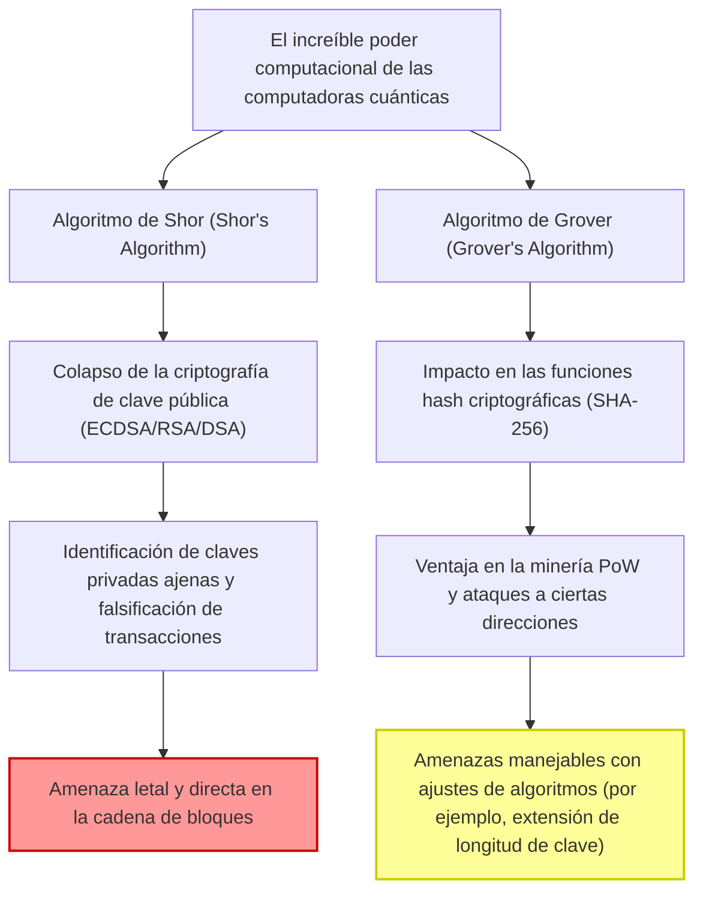
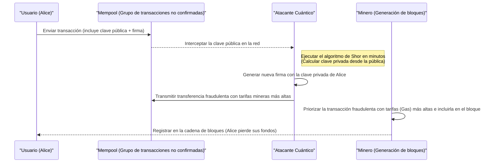
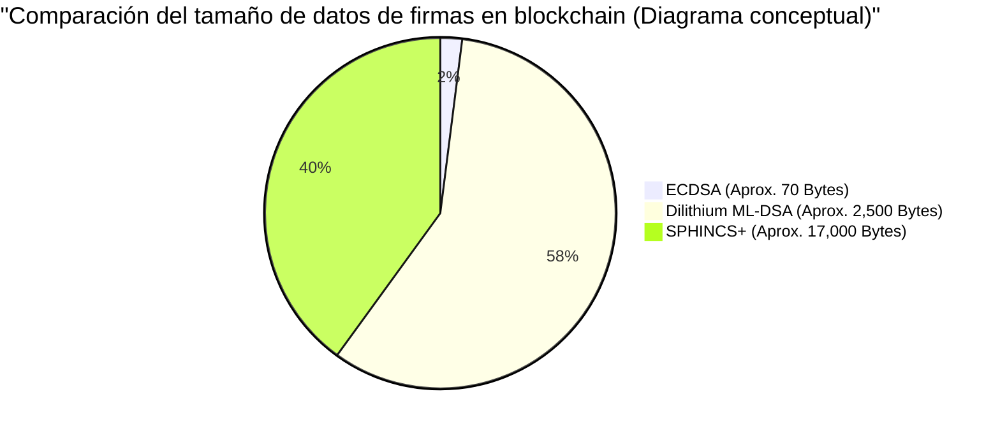

## 1. Introducción: Los pasos de la era post-cuántica y la crisis del blockchain

Desde el nacimiento de Bitcoin en 2009 por Satoshi Nakamoto, la tecnología blockchain ha crecido hasta convertirse en la base de sistemas financieros y aplicaciones en todo el mundo como un "libro mayor descentralizado e inalterable". Esta robusta seguridad está respaldada por tecnologías criptográficas modernas: **Criptografía de Clave Pública (Public Key Cryptography)** y **Funciones Hash Criptográficas (Cryptographic Hash Functions)**.

Estas tecnologías criptográficas garantizan la seguridad basándose en la "dificultad computacional" matemática, lo que significa que una computadora clásica (como las PC o supercomputadoras que usamos hoy en día) tardaría la edad del universo en descifrarlas.

Sin embargo, esta premisa está a punto de ser anulada desde su raíz debido al rápido desarrollo y aplicación práctica de las **Computadoras Cuánticas (Quantum Computers)**, la frontera de la física y las ciencias de la información. Aprovechando propiedades únicas de la mecánica cuántica como la "Superposición (Superposition)" y el "Entrelazamiento (Entanglement)", las computadoras cuánticas exhiben un poder computacional en ciertos problemas matemáticos que abruma abrumadoramente a las computadoras clásicas convencionales, lo que se conoce como "Supremacía Cuántica (Quantum Supremacy)".

En este artículo, exploraremos en profundidad, desde un punto de vista técnico y matemático, las amenazas específicas que la tecnología blockchain enfrenta debido a las computadoras cuánticas, así como las últimas tendencias en la **Criptografía Post-Cuántica (PQC: Post-Quantum Cryptography)** como solución, y los escenarios de transición para las redes de criptoactivos.

---

## 2. Fundamentos de las computadoras cuánticas y dos grandes amenazas para el blockchain

Los sistemas de blockchain actuales consisten principalmente en los siguientes dos elementos criptográficos, y cada uno está expuesto a diferentes amenazas por algoritmos cuánticos.

### 2.1. Fundamentos y dificultad computacional de la Criptografía de Curva Elíptica (ECDSA)

Muchas blockchains, incluidas Bitcoin y Ethereum, adoptan el **Algoritmo de Firma Digital de Curva Elíptica (ECDSA: Elliptic Curve Digital Signature Algorithm)** como su algoritmo de firma digital. Específicamente, Bitcoin utiliza la curva elíptica con el parámetro `secp256k1`.

La seguridad de la criptografía de curva elíptica se basa en la dificultad computacional del **Problema del Logaritmo Discreto de Curva Elíptica (ECDLP: Elliptic Curve Discrete Logarithm Problem)**.
Una curva elíptica se define por una ecuación en la forma normal de Weierstrass de la siguiente manera:

$$
y^2 \equiv x^3 + ax + b \pmod{p}
$$

En la `secp256k1` de Bitcoin, $a = 0, b = 7$, y $p$ es un número primo muy grande.
Sea $G$ el punto base (punto de referencia) en esta curva, y $k$ una clave privada, que es un número entero aleatorio masivo de 256 bits. Entonces, la clave pública $K$ se obtiene mediante la suma (multiplicación escalar) del punto base $k$ veces.

$$
K = k \times G = \underbrace{G + G + \dots + G}_{k \text{ veces}}
$$

Usando una computadora clásica, calcular inversamente la clave privada $k$ (encontrar el logaritmo discreto) a partir de la clave pública expuesta $K$ y el punto base $G$ requiere un tiempo computacional exponencial de $\mathcal{O}(\sqrt{p})$ incluso usando los mejores algoritmos clásicos como el método de factorización rho de Pollard. Para una clave de 256 bits, se requieren aproximadamente $2^{128}$ operaciones, un nivel que no podría resolverse ni operando supercomputadoras actuales durante miles de millones de años.

### 2.2. Colapso por el Algoritmo de Shor (Shor's Algorithm)

Sin embargo, el **Algoritmo de Shor**, publicado por Peter Shor en 1994, destruyó por completo esta premisa. El algoritmo de Shor fue propuesto originalmente para resolver el problema de factorización de enteros (la base del cifrado RSA) en tiempo polinómico, pero también es aplicable al problema del logaritmo discreto y al problema del logaritmo discreto de curva elíptica.

El núcleo del algoritmo de Shor radica en el uso de la **Transformada de Fourier Cuántica (QFT: Quantum Fourier Transform)** para encontrar rápidamente el "período (Period)" de una función.

$$
\text{Complejidad clásica} = \mathcal{O}(2^{n/2}) \quad (n\text{ es la longitud en bits})
$$
$$
\text{Complejidad del algoritmo cuántico} = \mathcal{O}(n^3)
$$

De esta manera, el algoritmo de Shor reduce drásticamente el tiempo exponencial a un **tiempo polinómico (Polynomial Time)**. Si se completa una computadora cuántica con suficientes cúbits lógicos, será posible determinar la clave privada $k$ a partir de la clave pública $K$ expuesta en la red en minutos o segundos. Esto permitiría a los atacantes obtener fácilmente las claves privadas de las carteras de otras personas y tomar control total de los fondos.

#### 2.2.1 Paso a paso del descifrado de ECDLP mediante el algoritmo de Shor

Veamos paso a paso los procesos internos mediante los cuales una computadora cuántica resuelve el problema del logaritmo discreto de curva elíptica (ECDLP).

Planteamiento del problema: En $K = k \times G$, dado que se conocen $G$ y $K$, se desea encontrar el entero desconocido $k$ (clave privada). Supongamos que el orden de la curva elíptica es $N$.

**Paso 1: Creación de un estado de superposición**
Primero, se preparan dos registros cuánticos, y se aplica una compuerta de Hadamard (Hadamard Gate) a cada uno para crear un estado de superposición de todas las posibles combinaciones de números enteros.
$$
|\psi_1\rangle = \frac{1}{N} \sum_{x=0}^{N-1} \sum_{y=0}^{N-1} |x\rangle |y\rangle |0\rangle
$$

**Paso 2: Aplicación del oráculo cuántico (evaluación de la función)**
A continuación, utilizando un circuito cuántico (oráculo) que realiza adición de puntos en la curva elíptica, la función $f(x, y) = x \times G + y \times K$ se calcula en el tercer registro.
$$
|\psi_2\rangle = \frac{1}{N} \sum_{x=0}^{N-1} \sum_{y=0}^{N-1} |x\rangle |y\rangle |x \times G + y \times K\rangle
$$
Aquí lo importante es que, como $K = k \times G$, se puede reescribir como $f(x, y) = (x + y \cdot k) \times G$.

**Paso 3: Medición del tercer registro**
Al medir el tercer registro, este colapsa en algún punto $R$ sobre la curva elíptica. En consecuencia, el primer y el segundo registro colapsan en un estado de superposición de pares $(x, y)$ que satisfacen $x + y \cdot k \equiv c \pmod{N}$ (donde $c$ es una constante).
$$
|\psi_3\rangle = \frac{1}{\sqrt{N}} \sum_{y=0}^{N-1} |c - y \cdot k \pmod{N}\rangle |y\rangle
$$

**Paso 4: Aplicación de la Transformada de Fourier Cuántica (QFT)**
Este estado tiene una periodicidad relacionada con el período $k$. Al aplicar aquí la Transformada de Fourier Cuántica Inversa (Inverse QFT), se causa una interferencia de fase, convirtiendo la información del período en amplitud.

**Paso 5: Medición y posprocesamiento clásico**
Al medir el primer y segundo registros, se obtiene con alta probabilidad un valor que contiene información sobre $k$. Aplicando algoritmos clásicos de teoría de números, como las fracciones continuas (Continued Fractions), al valor medido, se puede determinar completamente la clave privada desconocida $k$.

El número de compuertas cuánticas necesarias para todo este proceso es $\mathcal{O}(\log^3 N)$, lo que desvela la clave privada a una velocidad increíblemente más alta que la búsqueda $\mathcal{O}(\sqrt{N})$ con una computadora clásica.

### 2.3. Algoritmo de Grover (Grover's Algorithm) y su impacto en las funciones hash

Otra amenaza es el **Algoritmo de Grover**, propuesto por Lov Grover en 1996. Esto tiene un impacto importante en las funciones hash (por ejemplo: SHA-256).

En blockchain, las funciones hash se utilizan para garantizar la integridad de los datos, generar direcciones y como base para la minería **PoW (Proof of Work)** en Bitcoin. Calcular a la inversa una función hash (cálculo de preimagen) puede considerarse como un "problema de búsqueda en base de datos no estructurada" donde, dado un valor de salida específico $y$, se busca un valor de entrada $x$ tal que $H(x) = y$.

En una computadora clásica, para encontrar la respuesta correcta entre $N$ posibilidades, se requieren en promedio $\frac{N}{2}$ intentos, y en el peor de los casos, $N$ intentos. Es decir, la complejidad computacional es $\mathcal{O}(N)$.
Sin embargo, el algoritmo de Grover utiliza una técnica cuántica llamada "Amplificación de Amplitud (Amplitude Amplification)". Al amplificar iterativamente la amplitud de probabilidad del estado que es la respuesta correcta entre todas las posibilidades en estado de superposición, se reduce el tiempo de búsqueda a la raíz cuadrada.

$$
\text{Complejidad del algoritmo de Grover} = \mathcal{O}(\sqrt{N})
$$

En el caso de SHA-256, como $N = 2^{256}$, una búsqueda exhaustiva clásica requeriría aproximadamente $2^{256}$ intentos. Pero si se usa el algoritmo de Grover, bastaría con $\sqrt{2^{256}} = 2^{128}$ intentos. Esto significa que, para una computadora cuántica, una función hash de 256 bits **se reduce a la mitad de su nivel de seguridad, efectivamente a 128 bits**.

#### 2.3.1. ¿Sobrevivirá SHA-256? (Quantum Supremacy in Hashing)

Aunque la seguridad se reduce a la mitad, una "seguridad de 128 bits" sigue siendo extremadamente sólida. $2^{128}$ operaciones es una cifra astronómica desde el nivel tecnológico actual y requeriría una escala de tiempo de la edad del universo.
Por lo tanto, se cree ampliamente que **"SHA-256 mantendrá una seguridad práctica incluso frente a computadoras cuánticas"**. Si en el futuro es necesario aumentar el margen de seguridad, duplicando simplemente la longitud de salida del hash (por ejemplo, pasando de SHA-256 a SHA-512), se puede mantener la seguridad clásica de 256 bits en el mundo cuántico.

En conclusión, la amenaza cuántica a las funciones hash se puede considerar "leve y manejable", mientras que la amenaza a la criptografía de clave pública (ECDSA) se puede considerar "letal".

---

## 3. Análisis detallado del impacto en criptoactivos actuales (Bitcoin, Ethereum)

En un mundo donde es posible descifrar ECDSA con computadoras cuánticas, ¿a qué vulnerabilidades específicas se enfrentan las redes de criptoactivos? Aquí haremos un análisis detallado, tomando el mecanismo de Bitcoin como ejemplo, desde la perspectiva del **"momento de la exposición de la clave pública"**.

### 3.1. Generación de direcciones y "privacidad" de las claves públicas

Las direcciones de Bitcoin (P2PKH: Pay-to-Public-Key-Hash o P2WPKH: Pay-to-Witness-Public-Key-Hash) no utilizan la clave pública directamente, sino un hash repetido de la clave pública.

$$
\text{Bitcoin Address} = \text{Base58Check}(\text{RIPEMD160}(\text{SHA256}(\text{Public Key})))
$$

Como se mencionó anteriormente, debido a que las funciones hash son resistentes a los ataques cuánticos (algoritmo de Grover), deducir a la inversa la "clave pública" original a partir de la "dirección" (valor hash) es imposible incluso con una computadora cuántica.
En otras palabras, para una **"dirección no utilizada (una desde la que nunca se han enviado fondos)"**, la clave pública no se ha expuesto en la cadena de bloques en absoluto, y solo está registrado el valor hash. Por lo tanto, dado que se desconoce la clave pública, no hay un objetivo sobre el cual ejecutar el algoritmo de Shor y es imposible determinar la clave privada. Las carteras en este estado pueden considerarse cuánticamente seguras (Quantum-safe).

### 3.2. Vulnerabilidad letal al enviar transacciones (Ataque Front-running)

El problema surge en el momento en que un usuario transfiere fondos.
Al transmitir una transacción a la red, junto con la firma digital, el usuario debe **incluir su propia clave pública dentro de los datos de la transacción para su verificación y exponerla a toda la red**.

Una vez que se envía la clave pública a la Mempool (la sala de espera de transacciones no confirmadas), esos datos se comparten con nodos en todo el mundo. Si un atacante poseyera una computadora cuántica ultrarrápida, podría robar los fondos mediante el siguiente proceso:

1. Interceptar la transacción de un usuario legítimo (Alice) desde la Mempool y **extraer la clave pública**.
2. Ejecutar el algoritmo de Shor para **calcular la clave privada a partir de la clave pública en cuestión de minutos (antes de que se apruebe el bloque)**.
3. Usar la clave privada obtenida para **crear una transacción falsa** que envíe los fondos de Alice a la dirección del atacante.
4. Enviar esta transacción falsa a la red con una **tarifa minera (Fee) mucho más alta** que la de la transacción original de Alice.

Guiados por los incentivos económicos, los mineros priorizan incluir transacciones con altas tarifas en los bloques. Como resultado, la transferencia fraudulenta del atacante es confirmada (Confirm) primero, y la transferencia legítima de Alice se descarta por "fondos insuficientes (Double Spend)".
Esta serie de eventos se conoce como **Ataque Front-running (Front-running Attack)**, y en un mundo con computadoras cuánticas prácticas, causaría una situación aterradora donde los fondos son robados por un hacker en el mismo momento en que alguien presiona el botón de enviar.

### 3.3. Peligros de la reutilización de direcciones y direcciones antiguas (P2PK)

Un problema aún más grave es que en direcciones desde las que se han transferido fondos al menos una vez en el pasado (por ejemplo, si se reutilizan como direcciones de cambio), la clave pública ya está registrada de forma permanente en la cadena de bloques. Sin siquiera esperar a enviar una transacción, estas corren un peligro constante de que su clave privada sea calculada y se roben sus saldos.

Además, en el formato dominante **P2PK (Pay-to-Public-Key)** de los años 2009-2010, que incluye las recompensas de minería tempranas de Satoshi Nakamoto (más de 1 millón de BTC), la clave pública en sí se registraba directamente en la cadena de bloques como dirección en lugar del hash. Estos enormes volúmenes de bitcoins inactivos son los blancos más fáciles para las computadoras cuánticas y podrían ser robados de golpe para un "dumping" masivo en el mercado, potencialmente causando un desplome colosal del precio.

---

## 4. Escenario de transición a la Criptografía Post-Cuántica (PQC: Post-Quantum Cryptography)

Para evitar la catástrofe del "Q-Day (el día de la vulneración criptográfica por computadoras cuánticas)", la comunidad de blockchain y criptografía planea migrar a una **Criptografía Post-Cuántica (PQC)** que sea difícil de descifrar incluso mediante algoritmos cuánticos.
El Instituto Nacional de Estándares y Tecnología de los EE. UU. (NIST) ha estado avanzando en el proceso de estandarización de PQC durante años y, tras varias rondas de rigurosas evaluaciones, se han seleccionado algunos prometedores métodos criptográficos como estándares finales.

Explicaremos detalladamente los principales algoritmos PQC, que están ganando atención como alternativas a las firmas digitales en blockchain, junto con sus mecanismos matemáticos.

### 4.1. Firmas basadas en Hash (Hash-Based Signatures)

Las firmas basadas en hash son un método criptográfico cuya seguridad se basa exclusivamente en una base muy simple y sólida: "la resistencia a colisiones de las funciones hash". Dado que la seguridad de las funciones hash contra las computadoras cuánticas ya está comprobada (como mencionamos, tener un margen de seguridad de 128 bits es suficiente), es un enfoque extremadamente confiable.
Los ejemplos representativos incluyen las **Firmas de Lamport (Lamport Signatures)**, su versión extendida WOTS (Winternitz One-Time Signature) y la candidata estandarizada por el NIST **SPHINCS+** (ahora llamada SLH-DSA como FIPS 205).

#### 4.1.1. Detalles matemáticos de las firmas de Lamport (One-Time Signature)

Echemos un vistazo más detallado al mecanismo matemático de las firmas de Lamport.
Asumamos una función hash $H: \{0, 1\}^* \to \{0, 1\}^{256}$.

**[Generación de claves]**
Alice (la emisora) genera 256 pares de claves privadas utilizando un generador de números aleatorios verdadero (TRNG).
$$
\text{sk}_{i,0} \in \{0, 1\}^{256}, \quad \text{sk}_{i,1} \in \{0, 1\}^{256} \quad (1 \le i \le 256)
$$
Con esto, la clave privada $\text{sk}$ consta de un total de 512 cadenas de 256 bits (tamaño: $512 \times 32 = 16,384$ bytes).

A continuación, se calcula la clave pública $\text{pk}$. Cada componente de la clave privada es hasheado individualmente.
$$
\text{pk}_{i,0} = H(\text{sk}_{i,0}), \quad \text{pk}_{i,1} = H(\text{sk}_{i,1})
$$
La clave pública es, del mismo modo, de $16,384$ bytes. Esta se expone a la red de blockchain.

**[Generación de firmas]**
Para firmar los datos de transacción $M$, Alice primero calcula su valor hash.
$$
h = H(M) \in \{0, 1\}^{256}
$$
Sea el $i$-ésimo bit del valor hash $h$ $h_i \in \{0, 1\}$.
La firma $\sigma$ de Alice es el conjunto de los componentes de la clave privada que corresponden a cada bit $h_i$.
$$
\sigma = (\text{sk}_{1, h_1}, \text{sk}_{2, h_2}, \dots, \text{sk}_{256, h_{256}})
$$
Es decir, si el bit del hash del mensaje es `0`, se expone $\text{sk}_{i,0}$, y si es `1`, se expone $\text{sk}_{i,1}$. El tamaño de la firma será $256 \times 32 = 8,192$ bytes.

**[Verificación de firmas]**
El minero (verificador) realiza la verificación usando la transacción recibida $M$, la firma $\sigma = (s_1, s_2, \dots, s_{256})$ y la clave pública $\text{pk}$.
Recalcula el hash de la transacción $h = H(M)$ y comprueba si el hash de cada $s_i$ coincide con el correspondiente elemento de la clave pública $\text{pk}_{i, h_i}$.
$$
H(s_i) \overset{?}{=} \text{pk}_{i, h_i} \quad (\text{para todo } 1 \le i \le 256)
$$

Este proceso es matemáticamente extremadamente simple, y es imposible falsificar una firma a menos que una computadora cuántica pueda invertir $H$. Sin embargo, una vez que se realiza una firma, la mitad de la clave privada se expone a la red. Si se firma otro mensaje con el mismo par de claves, las claves privadas expuestas se combinan, dejando espacio para la falsificación por parte de los atacantes, de ahí la fuerte restricción de que "solo se puede usar una vez (One-Time)".
Para hacer esto práctico, se desarrollaron tecnologías como **XMSS**, que agrupa múltiples claves de un solo uso en una sola clave pública raíz utilizando árboles de Merkle, y la firma sin estado **SPHINCS+**, pero tienen la desventaja de que el tamaño de la firma alcanza decenas de kilobytes.

### 4.2. Criptografía basada en retículos (Lattice-Based Cryptography)

Actualmente, la corriente principal y más esperada en PQC, y la adoptada como principal estándar del NIST (FIPS 204: ML-DSA / anteriormente CRYSTALS-Dilithium y Falcon, etc.), es la **Criptografía basada en retículos**.

La seguridad de la criptografía basada en retículos depende de problemas matemáticamente probados como el "Problema del Vector Más Corto en retículos multidimensionales (SVP: Shortest Vector Problem)" y el "Problema del Aprendizaje con Errores (LWE: Learning With Errors)". No se han encontrado algoritmos que resuelvan eficientemente problemas de retículos incluso con computadoras cuánticas.

**Modelo matemático del LWE (Learning With Errors):**
La idea básica del problema LWE es hacer que un sistema de ecuaciones lineales sea drásticamente más difícil de resolver al agregar intencionalmente un "pequeño ruido (error)".
Sea el vector secreto $\mathbf{s} \in \mathbb{Z}_q^n$.
Se toma una matriz pública masiva $\mathbf{A} \in \mathbb{Z}_q^{m \times n}$ elegida al azar, y un vector de ruido pequeño agregado intencionalmente $\mathbf{e} \in \mathbb{Z}_q^m$.
La clave pública $\mathbf{b}$ se calcula de la siguiente manera:

$$
\mathbf{b} = \mathbf{A}\mathbf{s} + \mathbf{e} \pmod{q}
$$

Aun cuando la matriz $\mathbf{A}$ y el vector $\mathbf{b}$ (clave pública) sean públicos, calcular inversamente la clave secreta $\mathbf{s}$ a partir de ellos es muy difícil debido a la presencia del ruido $\mathbf{e}$. Sin ruido, podría resolverse con simple eliminación de Gauss, pero el ruido provoca que el espacio de búsqueda en todas las dimensiones aumente explosivamente, lo que proporciona una seguridad sólida frente a computadoras clásicas y cuánticas.
En algoritmos reales utilizados en blockchain, etc. (como Dilithium), se utiliza **Ring-LWE (o Module-LWE)** expandido sobre anillos polinómicos para reducir el tamaño de las claves y acelerar los cálculos.

* **Ventajas**: Comparado con las firmas basadas en hash, los tamaños de las claves públicas y las firmas son relativamente pequeños (alrededor de unos pocos kilobytes), y la velocidad de cálculo para la generación y verificación de firmas es muy rápida (igual o mayor a ECDSA).
* **Desventajas**: Debido a que la estructura matemática es compleja y el período histórico de validación es corto, el riesgo de que se descubran nuevos algoritmos de descifrado en el futuro no es cero.

---

## 5. Retos técnicos en la transición a PQC del blockchain

El mero hecho de que existan los algoritmos PQC (como Dilithium o SPHINCS+) no significa que se puedan implementar mañana en Bitcoin o Ethereum. Existen varios desafíos importantes específicos de los sistemas descentralizados.

### 5.1. Aumento en el tamaño de firmas y el colapso de la escalabilidad

La mayor barrera para la introducción de PQC es el crecimiento drástico del tamaño de datos.
Mientras que el tamaño de las firmas ECDSA actuales es de unos 70 bytes, en Dilithium (ML-DSA), de criptografía basada en retículos, el tamaño de la firma oscila entre unos 2,420 y 4,595 bytes (dependiendo del nivel de seguridad), y la clave pública supera los 1,300 bytes. Las firmas basadas en hash SPHINCS+ llegan a decenas de miles de bytes tan solo para la firma.

Si Bitcoin introdujera PQC manteniendo el límite actual de tamaño de bloque (aproximadamente 4 MB de peso incluyendo SegWit), el número de transacciones que podrían incluirse en un bloque disminuiría drásticamente. El rendimiento de la red (TPS: Transactions Per Second) caería de manera devastadora y la congestión en los pagos se volvería la norma.
Resolver esto requiere aumentar masivamente el tamaño del bloque, pero esto a su vez elevaría los requerimientos de almacenamiento y ancho de banda de los nodos completos, dificultaría que las personas ejecuten nodos por sí mismas y, en consecuencia, resultaría en el dilema de propiciar **la centralización de la red**.

*(※ El abultamiento de datos en las transacciones debido a la introducción de PQC es un cuello de botella letal para la escalabilidad)*

### 5.2. Impacto en la Ethereum Virtual Machine (EVM) y contratos precompilados

En plataformas de contratos inteligentes Turing-completos como Ethereum, la adopción de PQC exige una actualización fundamental de la EVM (Ethereum Virtual Machine).
La EVM actual provee un contrato precompilado (Precompiled Contract) llamado `ecrecover` (dirección: `0x01`) para la verificación de firmas ECDSA, que está optimizado para realizar verificaciones de firmas con un coste de gas muy bajo (3000 Gas).

No obstante, los nuevos algoritmos de criptografía de retículo como Dilithium y Falcon involucran cálculos polinómicos y matriciales complejos. Si se implementan usando solamente los códigos de operación (Opcodes) actuales de la EVM, una simple verificación de firma podría consumir desde millones hasta decenas de millones de gas. A este nivel, el límite de gas por bloque (actualmente de unos 30 millones de Gas) se agotaría en una sola transacción.

Para eludir esto, la red deberá llevar a cabo un "Hard Fork" (Bifurcación dura) para integrar un nuevo Precompiled Contract dedicado a la verificación PQC (por ejemplo, asignar `0x10` para DilithiumVerify) directamente en la EVM. Esto requiere un proceso de largo plazo donde los desarrolladores principales de cada cliente de Ethereum (Geth, Nethermind, Erigon, etc.) colaboren en implementaciones optimizadas de lógicas de verificación criptográfica de retículos a nivel de lenguajes como C++, Go, y Rust, así como ejecutar auditorías de seguridad.

### 5.3. Dificultad para lograr consensos a través de Hard Forks

Cambiar el algoritmo de firma subyacente requiere una actualización de todo el protocolo de la red, un **Hard Fork (Bifurcación dura)**. Sin embargo, en comunidades que valoran mucho los principios de "no cambiar las reglas y mantenerse descentralizados", como Bitcoin, el proceso para alcanzar un consenso es políticamente muy desafiante. Desde la proposición inicial de un BIP (Bitcoin Improvement Proposal) para migrar a PQC hasta su implementación definitiva, se requerirán años de debates y pruebas rigurosas.

---

## 6. ¿Cuándo llegará el "Q-Day"? Hoja de ruta hacia la transición

¿Cuándo llegará el "Q-Day", el día en que las computadoras cuánticas logren descifrar completamente la criptografía de curva elíptica de 256 bits?
Aunque las opiniones difieren entre investigadores, muchos expertos prevén que será **"entre mediados de la década de 2030 y 2040"**, cuando podrían aparecer computadoras cuánticas a gran escala con al menos miles o decenas de miles de cúbits lógicos estables (cúbits que toleran el ruido con corrección de errores). Sin embargo, dependiendo de descubrimientos disruptivos en arquitecturas de hardware o el hallazgo de algoritmos cuánticos más eficientes, no se descarta la posibilidad de que se adelante (alrededor del 2030).

La hoja de ruta que debería seguir el ecosistema de criptoactivos antes de que sea demasiado tarde es la siguiente:

### Fase 1: Firmas híbridas y abstracción de cuentas (Ahora a ~2028)
En los círculos actuales de desarrollo de blockchain, especialmente entre los desarrolladores de Ethereum (como Vitalik Buterin), se están estudiando las **"firmas híbridas"** que combinan ECDSA con PQC (firmas basadas en hash o criptografía basada en retículos). Este enfoque implica adjuntar en la transacción ambas firmas: la de ECDSA existente (que hoy es segura) y la firma PQC. Así, si una de las dos falla, la seguridad se mantiene íntegra.
Además, aprovechando la abstracción de cuentas (Account Abstraction, ERC-4337), se avanza en iniciativas que permiten integrar firmas PQC como opción de consentimiento (opt-in para los usuarios) mediante carteras de contratos inteligentes sin necesidad de esperar un hard fork en el nivel del protocolo base.

### Fase 2: Uso de Pruebas de Conocimiento Cero (ZK-Rollups) (2025 en adelante)
La carta clave que se espera para resolver la mayor debilidad de la PQC, el "abultamiento del tamaño de los datos de firmas", es el uso de tecnologías de Capa 2 (Layer 2) conocidas como **ZK-Rollups (Pruebas de Conocimiento Cero)**.
En lugar de registrar directamente las enormes firmas PQC en la Layer 1 (cadena principal), innumerables transacciones PQC se agrupan y verifican en la Layer 2. A continuación, mediante pruebas como ZK-SNARKs o ZK-STARKs, se comprimen todas en una diminuta pieza de "datos de prueba (Proof)" para grabarse en la Layer 1.
Cabe señalar que algunas configuraciones de SNARKs (como Groth16) son inherentemente vulnerables frente a computadoras cuánticas, por lo que la adopción de **ZK-STARKs**, dependientes de funciones hash que poseen resistencia cuántica, se vuelve esencial.

### Fase 3: Hard Fork a Nivel del Protocolo (Alrededor de 2030)
En una etapa donde la estandarización PQC del NIST esté totalmente asimilada, se desarrollen librerías consolidadas en el sector, y el software haya sido suficientemente probado, es previsible que cadenas principales como Bitcoin y Ethereum implementen un Hard Fork para cambiar sus firmas por defecto al ecosistema PQC de manera definitiva. Durante este período de transición, presenciaríamos inmensas campañas de anuncios animando a los usuarios a "transferir fondos de carteras antiguas a carteras nuevas y compatibles con PQC".

### Ejemplos de Proyectos Pioneros

Algunos proyectos de blockchain han sido proactivos ante esta amenaza cuántica y afirman poseer resistencia cuántica desde sus etapas de desarrollo tempranas.
* **QRL (Quantum Resistant Ledger)**: Una de las primeras blockchains que implementó nativamente PQC en la capa de protocolo base utilizando XMSS (Esquema Extendido de Firma de Merkle), un esquema PQC basado en hashes.
* **Algorand / Cellframe**: Proyectos con una arquitectura modular para su capa criptográfica con vistas a facilitar las actualizaciones de PQC en el futuro, investigando activamente la integración de la criptografía basada en retículos.

---

## 7. Conclusión: El futuro de los criptoactivos y la protección de nuestros activos

La llegada de la "era post-cuántica" ya ha rebasado los dominios imaginarios de la ciencia ficción para transformarse en un desafío técnico concreto y una amenaza inminente frente a nuestros sistemas criptográficos del mundo real.

Las dos grandes espadas computacionales del mundo cuántico —el Algoritmo de Shor y el Algoritmo de Grover— amenazan los pilares de la criptografía de clave pública y las funciones hash de las blockchains modernas. En particular, la debilidad de ECDSA es letal, haciendo que la migración hacia Criptografía Post-Cuántica (PQC) sea el único camino ineludible para eludir el hurto masivo de fondos vía ataques front-running.

Sin embargo, ni el ámbito tecnológico ni la comunidad de blockchain observan esto sin accionar. La selección y normalización de algoritmos PQC, como la criptografía basada en retículos y las firmas fundamentadas en hashes, están evolucionando con certidumbre; además, ya comienzan a dibujarse las formas en que superaremos la gran barrera del "aumento colosal de volumen de datos", haciendo uso de ZK-STARKs (Pruebas de Conocimiento Cero) y soluciones de escalado en Capa 2.

No existe necesidad de que los inversores o usuarios comunes de criptoactivos entren en pánico y liquiden todos sus fondos en estos momentos. Lo vital es cultivar un conocimiento elemental y una actitud preventiva basada en los siguientes puntos:

* **Evitar la reutilización de direcciones**: No atesorar fondos por períodos prolongados en "direcciones usadas (que se hayan empleado alguna vez para realizar una transacción, por lo que su clave pública ha sido expuesta permanentemente en la cadena)". Una regla esencial no solo para resguardar la privacidad, sino también por pura seguridad cuántica.
* **Atención a las tendencias tecnológicas**: Permanecer sintonizados a discusiones vitales (por ej. los BIP de Bitcoin y EIP de Ethereum) respecto a la transición PQC o los posibles Hard Forks, a fin de ser capaces de migrar nuestras carteras correctamente cuando llegue el instante apropiado.

La historia del blockchain consiste, en gran medida, en una evolución constante propiciada por su resiliencia contra amenazas tecnológicas inéditas. Tal como se superaron las crisis de la escalabilidad o el impacto medioambiental (con el salto del PoW al PoS), es más que seguro que el ecosistema completo investigará y se ajustará a este inédito peligro cuántico.
Nuestra expectación se deposita en visualizar un porvenir donde el nacimiento de la computación cuántica —el nuevo apogeo del ingenio humano— y el blockchain (la tecnología de la confianza descentralizada) logren amoldarse armoniosamente para constituir sistemas invulnerables de orden superior, lejos de sucumbir en un colapso.

---
*Referencias y enlaces relacionados:*
* National Institute of Standards and Technology (NIST) - Post-Quantum Cryptography Standardization Project
* Shor, P. W. (1994). Algorithms for quantum computation: discrete logarithms and factoring.
* Grover, L. K. (1996). A fast quantum mechanical algorithm for database search.
* Buterin, V. (2024). How to hard-fork to save most users' funds in a quantum emergency.
