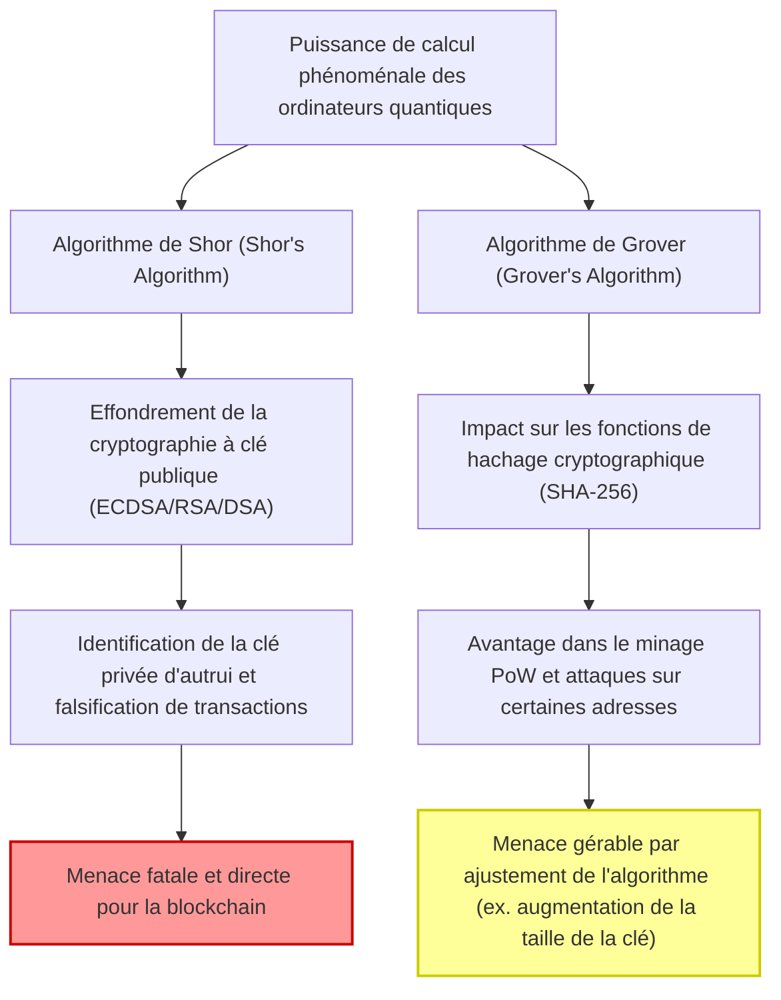
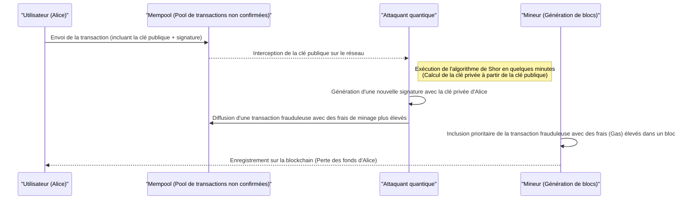
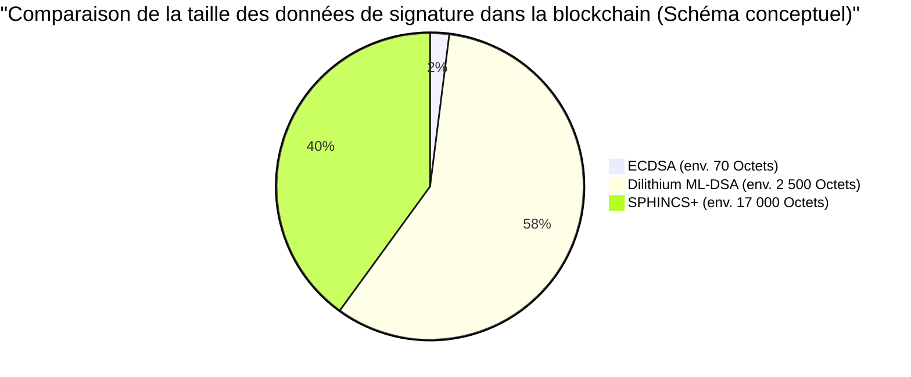

## 1. Introduction : L'approche de l'ère post-quantique et la crise de la blockchain

Depuis la création du Bitcoin par Satoshi Nakamoto en 2009, la technologie de la blockchain s'est développée pour devenir l'infrastructure des systèmes financiers et des applications à travers le monde, en tant que « registre décentralisé et infalsifiable ». Cette sécurité robuste repose sur des technologies cryptographiques modernes : la **cryptographie à clé publique (Public Key Cryptography)** et les **fonctions de hachage cryptographique (Cryptographic Hash Functions)**.

Ces technologies cryptographiques garantissent la sécurité en s'appuyant sur la « difficulté de calcul » mathématique, c'est-à-dire qu'un ordinateur classique (les PC ou supercalculateurs que nous utilisons aujourd'hui) mettrait un temps comparable à l'âge de l'univers pour les déchiffrer.

Cependant, cette prémisse est sur le point d'être fondamentalement bouleversée par le développement rapide et la mise en pratique des **ordinateurs quantiques (Quantum Computers)**, qui représentent la frontière de la physique et des sciences de l'information. Les ordinateurs quantiques, qui utilisent les propriétés de la mécanique quantique telles que la « superposition (Superposition) » et l'« intrication (Entanglement) », font preuve d'une puissance de calcul surpassant de loin les ordinateurs classiques pour certains problèmes mathématiques, ce que l'on appelle la « suprématie quantique (Quantum Supremacy) ».

Dans cet article, nous explorerons en profondeur, d'un point de vue technique et mathématique, les menaces spécifiques auxquelles la technologie de la blockchain est confrontée à cause des ordinateurs quantiques, ainsi que les dernières tendances de la **cryptographie post-quantique (PQC : Post-Quantum Cryptography)** qui s'annonce comme la solution, et les scénarios de transition pour les réseaux de crypto-actifs.

---

## 2. Les bases de l'informatique quantique et ses 2 grandes menaces pour la blockchain

Les systèmes de blockchain actuels sont principalement constitués des deux éléments cryptographiques suivants, chacun étant exposé à des menaces différentes de la part des algorithmes quantiques.

### 2.1. Les fondements de la cryptographie sur les courbes elliptiques (ECDSA) et la difficulté de calcul

De nombreuses blockchains, dont le Bitcoin et l'Ethereum, utilisent l'**algorithme de signature numérique sur courbe elliptique (ECDSA : Elliptic Curve Digital Signature Algorithm)** comme algorithme de signature numérique. Plus précisément, le Bitcoin utilise une courbe elliptique avec le paramètre `secp256k1`.

La sécurité de la cryptographie sur les courbes elliptiques dépend de la difficulté de calcul du **problème du logarithme discret sur courbe elliptique (ECDLP : Elliptic Curve Discrete Logarithm Problem)**.
La courbe elliptique est définie par l'équation sous forme de Weierstrass suivante :

$$
y^2 \equiv x^3 + ax + b \pmod{p}
$$

Pour le `secp256k1` du Bitcoin, $a = 0, b = 7$, et $p$ est un très grand nombre premier.
Soit $G$ un point de base sur cette courbe, et $k$ la clé privée, qui est un très grand nombre entier de 256 bits choisi au hasard. Alors, la clé publique $K$ est obtenue par l'addition de $G$ à lui-même $k$ fois (multiplication scalaire).

$$
K = k \times G = \underbrace{G + G + \dots + G}_{k \text{ fois}}
$$

En utilisant un ordinateur classique, calculer la clé privée $k$ à partir de la clé publique $K$ (calculer le logarithme discret) nécessite un temps de calcul exponentiel $\mathcal{O}(\sqrt{p})$ même avec les meilleurs algorithmes classiques tels que l'algorithme rho de Pollard. Pour une clé de 256 bits, environ $2^{128}$ opérations sont nécessaires, ce qui est impossible à résoudre même en faisant fonctionner les supercalculateurs actuels pendant des milliards d'années.

### 2.2. L'effondrement causé par l'algorithme de Shor (Shor's Algorithm)

Cependant, l'**algorithme de Shor**, publié par Peter Shor en 1994, a complètement détruit cette hypothèse. L'algorithme de Shor a été initialement proposé pour résoudre le problème de la factorisation en nombres premiers (la base du chiffrement RSA) en temps polynomial, mais il s'applique également au problème du logarithme discret et au problème du logarithme discret sur courbe elliptique.

Le cœur de l'algorithme de Shor réside dans l'utilisation de la **transformée de Fourier quantique (QFT : Quantum Fourier Transform)** pour trouver rapidement la « période (Period) » d'une fonction.

$$
\text{Complexité classique} = \mathcal{O}(2^{n/2}) \quad (n\text{ est la longueur en bits})
$$
$$
\text{Complexité de l'algorithme quantique} = \mathcal{O}(n^3)
$$

Ainsi, l'algorithme de Shor réduit considérablement un temps exponentiel à un **temps polynomial (Polynomial Time)**. Si un ordinateur quantique doté d'un nombre suffisant de qubits logiques est achevé, il sera possible d'identifier la clé privée $k$ à partir de la clé publique $K$ publiée sur le réseau en quelques minutes ou quelques secondes. Par conséquent, un attaquant pourra facilement obtenir la clé privée du portefeuille de quelqu'un d'autre et prendre le contrôle total des fonds.

#### 2.2.1 Étapes par étapes de la résolution de l'ECDLP par l'algorithme de Shor

Voyons étape par étape le processus interne par lequel un ordinateur quantique résout le problème du logarithme discret sur courbe elliptique (ECDLP).

Définition du problème : Dans $K = k \times G$, $G$ et $K$ sont connus, et nous voulons trouver l'entier inconnu $k$ (la clé privée). Soit $N$ l'ordre de la courbe elliptique.

**Étape 1 : Création de l'état de superposition**
Tout d'abord, nous préparons deux registres quantiques et appliquons une porte de Hadamard (Hadamard Gate) à chacun d'eux pour créer un état de superposition de toutes les combinaisons possibles d'entiers.
$$
|\psi_1\rangle = \frac{1}{N} \sum_{x=0}^{N-1} \sum_{y=0}^{N-1} |x\rangle |y\rangle |0\rangle
$$

**Étape 2 : Application de l'oracle quantique (évaluation de la fonction)**
Ensuite, à l'aide d'un circuit quantique (oracle) qui effectue l'addition de points sur la courbe elliptique, nous calculons la fonction $f(x, y) = x \times G + y \times K$ dans le troisième registre.
$$
|\psi_2\rangle = \frac{1}{N} \sum_{x=0}^{N-1} \sum_{y=0}^{N-1} |x\rangle |y\rangle |x \times G + y \times K\rangle
$$
Ce qui est important ici, c'est que puisque $K = k \times G$, cela peut être réécrit comme $f(x, y) = (x + y \cdot k) \times G$.

**Étape 3 : Mesure du troisième registre**
Lorsque le troisième registre est mesuré, il s'effondre sur un certain point $R$ sur la courbe elliptique. Par conséquent, les premier et deuxième registres s'effondrent dans un état de superposition des paires $(x, y)$ satisfaisant $x + y \cdot k \equiv c \pmod{N}$ (où $c$ est une constante).
$$
|\psi_3\rangle = \frac{1}{\sqrt{N}} \sum_{y=0}^{N-1} |c - y \cdot k \pmod{N}\rangle |y\rangle
$$

**Étape 4 : Application de la transformée de Fourier quantique (QFT)**
Cet état a une périodicité liée à la période $k$. En appliquant ici la transformée de Fourier quantique inverse (Inverse QFT), on provoque des interférences de phase et on convertit l'information de période en amplitude.

**Étape 5 : Mesure et post-traitement classique**
Lorsque les premier et deuxième registres sont mesurés, une valeur contenant des informations sur $k$ est obtenue avec une forte probabilité. En appliquant des algorithmes de théorie des nombres classiques tels que le développement en fractions continues (Continued Fractions) à la valeur mesurée, la clé privée inconnue $k$ peut être complètement identifiée.

Le nombre de portes quantiques requis pour l'ensemble de ce processus est $\mathcal{O}(\log^3 N)$, ce qui permet de révéler la clé privée à une vitesse ultra-rapide, incomparable avec la recherche $\mathcal{O}(\sqrt{N})$ par un ordinateur classique.

### 2.3. L'algorithme de Grover (Grover's Algorithm) et son impact sur les fonctions de hachage

L'autre menace est l'**algorithme de Grover**, proposé par Lov Grover en 1996. Celui-ci a un impact majeur sur les fonctions de hachage (ex. : SHA-256).

Dans la blockchain, les fonctions de hachage sont utilisées pour garantir l'intégrité des données, générer des adresses et servent de base au **minage PoW (Proof of Work)** du Bitcoin. L'inversion d'une fonction de hachage (calcul de la préimage) peut être considérée comme un « problème de recherche dans une base de données non structurée », consistant à trouver une valeur d'entrée $x$ telle que $H(x) = y$ pour une valeur de sortie $y$ donnée.

Dans un ordinateur classique, pour trouver la bonne réponse parmi $N$ possibilités, il faut en moyenne $\frac{N}{2}$ essais, et $N$ essais dans le pire des cas. En d'autres termes, la complexité est $\mathcal{O}(N)$.
Cependant, l'algorithme de Grover utilise une technique quantique appelée « amplification d'amplitude (Amplitude Amplification) ». En amplifiant itérativement l'amplitude de probabilité de l'état correspondant à la bonne réponse parmi toutes les possibilités dans un état de superposition, le temps de recherche est réduit à sa racine carrée.

$$
\text{Complexité de l'algorithme de Grover} = \mathcal{O}(\sqrt{N})
$$

Dans le cas de SHA-256, puisque $N = 2^{256}$, une recherche exhaustive classique nécessiterait environ $2^{256}$ essais. Cependant, en utilisant l'algorithme de Grover, il suffit de $\sqrt{2^{256}} = 2^{128}$ essais. Cela signifie qu'une fonction de hachage de 256 bits voit son niveau de sécurité **effectivement divisé par deux, à 128 bits**, face à un ordinateur quantique.

#### 2.3.1. SHA-256 survivra-t-il ? (Quantum Supremacy in Hashing)

Bien que la sécurité soit réduite de moitié, « une sécurité de 128 bits » reste extrêmement solide. $2^{128}$ opérations représentent un chiffre astronomique même selon les standards technologiques actuels, nécessitant une échelle de temps comparable à la durée de vie de l'univers.
Par conséquent, il est largement considéré que **« SHA-256 maintiendra un niveau de sécurité pratique même face aux ordinateurs quantiques »**. S'il s'avère nécessaire d'augmenter la marge de sécurité à l'avenir, il suffira simplement de doubler la longueur de sortie du hachage (par exemple, passer de SHA-256 à SHA-512) pour maintenir le niveau de sécurité classique de 256 bits dans le monde quantique.

En conclusion, on peut dire que la menace quantique pesant sur les fonctions de hachage est « mineure et gérable », tandis que la menace sur la cryptographie à clé publique (ECDSA) est « fatale ».

---

## 3. Analyse des impacts concrets sur les crypto-actifs actuels (Bitcoin, Ethereum)

Dans un monde où le déchiffrement de l'ECDSA par un ordinateur quantique deviendrait possible, à quelles vulnérabilités spécifiques les réseaux de crypto-actifs seront-ils confrontés ? Nous ferons ici une analyse détaillée en prenant l'exemple du fonctionnement du Bitcoin, du point de vue du **« timing d'exposition de la clé publique »**.

### 3.1. Génération d'adresses et « confidentialité » de la clé publique

Les adresses Bitcoin (P2PKH : Pay-to-Public-Key-Hash ou P2WPKH : Pay-to-Witness-Public-Key-Hash) n'utilisent pas la clé publique elle-même, mais un hachage multiple de la clé publique.

$$
\text{Bitcoin Address} = \text{Base58Check}(\text{RIPEMD160}(\text{SHA256}(\text{Public Key})))
$$

Comme mentionné précédemment, les fonctions de hachage résistent aux attaques quantiques (l'algorithme de Grover), il est donc impossible, même pour un ordinateur quantique, de retrouver la « clé publique » d'origine à partir de « l'adresse » (la valeur de hachage).
En d'autres termes, pour **« une adresse inutilisée (qui n'a jamais envoyé de fonds) »**, la clé publique n'est exposée nulle part sur la blockchain, et seule la valeur de hachage est enregistrée. Par conséquent, tant que la clé publique est inconnue, il n'y a pas de cible pour exécuter l'algorithme de Shor, et la clé privée ne peut pas être identifiée. On peut dire que les portefeuilles dans cet état sont sûrs sur le plan quantique (Quantum-safe).

### 3.2. La vulnérabilité fatale lors de l'envoi de transactions (Attaque de front-running)

Le problème survient au moment où un utilisateur envoie des fonds.
Lorsqu'il diffuse (broadcast) une transaction sur le réseau, l'utilisateur doit inclure sa signature numérique ainsi que **sa propre clé publique dans les données de la transaction pour la vérification, et la rendre publique sur tout le réseau**.

Une fois que la clé publique est envoyée au Mempool (la zone d'attente des transactions non confirmées), ces données sont partagées avec les nœuds du monde entier. Si un attaquant possède un ordinateur quantique ultra-rapide, il peut voler les fonds grâce au processus suivant :

1. Intercepter la transaction légitime de l'utilisateur (Alice) depuis le Mempool et en **extraire la clé publique**.
2. Exécuter l'algorithme de Shor et **calculer la clé privée à partir de la clé publique en quelques minutes (avant que le bloc ne soit confirmé)**.
3. Utiliser la clé privée obtenue pour **créer une fausse transaction** envoyant les fonds d'Alice vers l'adresse de l'attaquant.
4. Définir pour cette fausse transaction des **frais de minage (Fee) beaucoup plus élevés** que ceux de la transaction originale d'Alice et l'envoyer sur le réseau.

Les mineurs, obéissant aux incitations économiques, incluront en priorité la transaction avec les frais les plus élevés dans un bloc. Par conséquent, la transaction frauduleuse de l'attaquant sera confirmée en premier, et la transaction légitime d'Alice sera rejetée pour « fonds insuffisants (Double Spend) ».
Cette séquence d'événements est appelée **attaque de front-running (Front-running Attack)**. Dans un monde où les ordinateurs quantiques sont devenus réalité, cela entraînera une situation effrayante où les fonds seront volés par des pirates informatiques à la seconde où quelqu'un appuiera sur le bouton d'envoi.

### 3.3. Le danger des adresses réutilisées et des anciennes adresses (P2PK)

Un problème encore plus grave est que les adresses à partir desquelles des fonds ont été envoyés au moins une fois par le passé (comme lorsqu'elles sont réutilisées comme adresses de monnaie de retour) ont déjà leur clé publique enregistrée de manière permanente sur la blockchain. Celles-ci risquent de voir leur clé privée calculée et leur solde volé à tout moment, sans même attendre l'envoi d'une transaction.

De plus, dans le format **P2PK (Pay-to-Public-Key)**, qui était dominant autour de 2009-2010 et qui inclut les récompenses de minage initiales de Satoshi Nakamoto (plus d'un million de BTC), la clé publique elle-même, et non un hachage, était directement enregistrée sur la blockchain comme adresse. Ces énormes quantités de bitcoins dormants deviendront les cibles les plus faciles pour les ordinateurs quantiques, et pourraient déclencher un krach majeur des prix en étant volées en masse et déversées sur le marché.

---

## 4. Scénarios de transition vers la cryptographie post-quantique (PQC : Post-Quantum Cryptography)

Afin d'éviter la catastrophe du « Q-Day (le jour où les ordinateurs quantiques briseront la cryptographie) », la communauté cryptographique et celle de la blockchain prévoient de migrer vers une **cryptographie post-quantique (PQC)** difficile à déchiffrer même avec des algorithmes quantiques.
Le National Institute of Standards and Technology (NIST) des États-Unis mène depuis de nombreuses années un processus de standardisation PQC, et après plusieurs phases d'évaluations rigoureuses, quelques systèmes de chiffrement prometteurs ont été sélectionnés comme normes finales.

Nous expliquerons en détail les principaux algorithmes PQC qui attirent l'attention en tant qu'alternatives aux signatures numériques de la blockchain, ainsi que leurs mécanismes mathématiques.

### 4.1. Signatures basées sur le hachage (Hash-Based Signatures)

Les signatures basées sur le hachage sont un schéma cryptographique dont la sécurité repose uniquement sur une base très simple et robuste : la « résistance aux collisions des fonctions de hachage ». Étant donné que la sécurité des fonctions de hachage contre les ordinateurs quantiques a déjà été prouvée (comme mentionné précédemment, une marge de sécurité de 128 bits est suffisante), il s'agit d'une approche extrêmement fiable.
Parmi les exemples représentatifs, citons la **signature de Lamport (Lamport Signatures)**, son extension WOTS (Winternitz One-Time Signature), et le candidat à la standardisation du NIST, **SPHINCS+** (désormais appelé SLH-DSA sous FIPS 205).

#### 4.1.1. Détails mathématiques de la signature de Lamport (One-Time Signature)

Examinons plus en détail le fonctionnement mathématique de la signature de Lamport.
Soit une fonction de hachage $H: \{0, 1\}^* \to \{0, 1\}^{256}$.

**[Génération des clés]**
Alice (l'expéditrice) utilise un véritable générateur de nombres aléatoires (TRNG) pour générer 256 paires de clés privées.
$$
\text{sk}_{i,0} \in \{0, 1\}^{256}, \quad \text{sk}_{i,1} \in \{0, 1\}^{256} \quad (1 \le i \le 256)
$$
Ainsi, la clé privée $\text{sk}$ se compose d'un total de 512 chaînes de 256 bits (taille : $512 \times 32 = 16 384$ octets).

Ensuite, elle calcule la clé publique $\text{pk}$. Chaque composant de la clé privée est haché.
$$
\text{pk}_{i,0} = H(\text{sk}_{i,0}), \quad \text{pk}_{i,1} = H(\text{sk}_{i,1})
$$
La clé publique fait également $16 384$ octets. Celle-ci est publiée sur le réseau de la blockchain.

**[Génération de la signature]**
Pour signer les données de transaction $M$, Alice calcule d'abord sa valeur de hachage.
$$
h = H(M) \in \{0, 1\}^{256}
$$
Soit $h_i \in \{0, 1\}$ le $i$-ème bit de la valeur de hachage $h$.
La signature d'Alice, $\sigma$, sera l'ensemble des composants de la clé privée correspondant à chaque bit $h_i$.
$$
\sigma = (\text{sk}_{1, h_1}, \text{sk}_{2, h_2}, \dots, \text{sk}_{256, h_{256}})
$$
En d'autres termes, si le bit du hachage du message est `0`, elle révèle $\text{sk}_{i,0}$, et s'il est `1`, elle révèle $\text{sk}_{i,1}$. La taille de la signature sera de $256 \times 32 = 8 192$ octets.

**[Vérification de la signature]**
Le mineur (vérificateur) vérifie en utilisant la transaction $M$ reçue, la signature $\sigma = (s_1, s_2, \dots, s_{256})$ et la clé publique $\text{pk}$.
Il recalcule le hachage de la transaction $h = H(M)$ et vérifie si le hachage de chaque $s_i$ correspond à l'élément correspondant de la clé publique, $\text{pk}_{i, h_i}$.
$$
H(s_i) \overset{?}{=} \text{pk}_{i, h_i} \quad (\text{pour tout } 1 \le i \le 256)
$$

Ce processus est mathématiquement très simple, et à moins qu'un ordinateur quantique ne puisse inverser $H$, il est impossible de falsifier une signature. Cependant, une fois signée, la moitié de la clé privée est exposée au réseau. Si la même paire de clés est utilisée pour signer un autre message, les clés privées exposées se combinent, donnant à un attaquant la possibilité de forger des signatures. Cela crée une forte contrainte : la clé ne peut être utilisée qu'**« une seule fois (One-Time) »**.
Pour rendre cela pratique, des technologies comme **XMSS**, qui utilise un arbre de Merkle pour regrouper de nombreuses clés à usage unique en une seule clé publique racine, ou **SPHINCS+**, qui est sans état, ont été développées, mais elles présentent l'inconvénient de tailles de signature atteignant des dizaines de kilo-octets.

### 4.2. Cryptographie fondée sur les réseaux euclidiens (Lattice-Based Cryptography)

Actuellement, la cryptographie qui suscite le plus d'attentes en tant que courant principal du PQC, et qui a été adoptée comme norme principale du NIST (FIPS 204 : ML-DSA / anciennement CRYSTALS-Dilithium, ou Falcon), est la **cryptographie fondée sur les réseaux euclidiens**.

La sécurité de la cryptographie sur les réseaux euclidiens repose sur des problèmes dont la difficulté a été mathématiquement prouvée, tels que le « problème du vecteur le plus court dans un réseau multidimensionnel (SVP : Shortest Vector Problem) » ou le « problème d'apprentissage avec erreurs (LWE : Learning With Errors) ». Il n'existe aucun algorithme connu capable de résoudre efficacement les problèmes de réseau, même avec un ordinateur quantique.

**Modèle mathématique du LWE (Learning With Errors) :**
L'idée fondamentale du problème LWE est d'ajouter intentionnellement un « petit bruit (erreur) » à un système d'équations linéaires, ce qui rend le problème considérablement plus difficile.
Soit un vecteur secret $\mathbf{s} \in \mathbb{Z}_q^n$.
Il y a une grande matrice publique choisie aléatoirement $\mathbf{A} \in \mathbb{Z}_q^{m \times n}$ et un vecteur de petit bruit intentionnellement ajouté $\mathbf{e} \in \mathbb{Z}_q^m$.
La clé publique $\mathbf{b}$ est calculée comme suit :

$$
\mathbf{b} = \mathbf{A}\mathbf{s} + \mathbf{e} \pmod{q}
$$

Même si la matrice $\mathbf{A}$ et le vecteur $\mathbf{b}$ (clé publique) sont publiés, il devient très difficile de calculer la clé privée $\mathbf{s}$ à l'envers en raison de la présence du bruit $\mathbf{e}$. S'il n'y avait pas de bruit, cela pourrait être résolu par une simple élimination de Gauss, mais le bruit provoque une explosion de l'espace de recherche dans toutes les dimensions, offrant une sécurité robuste contre les ordinateurs classiques et quantiques.
Dans les algorithmes réels utilisés dans les blockchains et ailleurs (comme Dilithium), cela est déployé sur des anneaux polynomiaux, ce que l'on appelle **Ring-LWE (ou Module-LWE)**, afin de réduire la taille des clés et d'accélérer les calculs.

* **Avantages** : Comparé aux signatures basées sur le hachage, la taille des clés publiques et des signatures est relativement petite (de l'ordre de quelques kilo-octets), et la vitesse de calcul pour la génération et la vérification des signatures est très élevée (équivalente ou supérieure à l'ECDSA).
* **Inconvénients** : La structure mathématique est complexe et la période d'examen historique est courte, de sorte que le risque de découverte de nouveaux algorithmes de déchiffrement à l'avenir n'est pas nul.

---

## 5. Les défis techniques de la migration PQC pour la blockchain

Ce n'est pas parce que des algorithmes PQC (comme Dilithium ou SPHINCS+) existent qu'ils peuvent être introduits demain dans Bitcoin ou Ethereum. Plusieurs défis majeurs spécifiques aux systèmes décentralisés se posent.

### 5.1. L'augmentation de la taille des signatures et l'effondrement de la scalabilité

Le plus grand obstacle à l'introduction de la PQC est l'augmentation significative de la taille des données.
Alors que la taille actuelle d'une signature ECDSA est d'environ 70 octets, dans le cas du Dilithium (ML-DSA) basé sur les réseaux, la taille de la signature est d'environ 2 420 octets à 4 595 octets (selon le niveau de sécurité), et la taille de la clé publique dépasse 1 300 octets. Quant au SPHINCS+ basé sur le hachage, la signature seule atteint des dizaines de milliers d'octets.

Si le Bitcoin introduisait la PQC en conservant la limite de taille de bloc actuelle (un poids d'environ 4 Mo en incluant SegWit), le nombre de transactions pouvant être stockées dans un seul bloc chuterait considérablement. Le débit du réseau (TPS : Transactions Per Second) s'effondrerait, et les congestions de transferts deviendraient la norme.
Pour résoudre ce problème, il faudrait augmenter considérablement la taille des blocs, mais cela accroîtrait les besoins en stockage et en bande passante des nœuds complets, rendant difficile l'exploitation de nœuds par des particuliers et entraînant en conséquence **une centralisation du réseau**, créant ainsi un dilemme.

*(※ L'augmentation de la taille des données de transaction due à l'introduction du PQC constitue un goulot d'étranglement fatal pour la scalabilité)*

### 5.2. Impact sur l'Ethereum Virtual Machine (EVM) et les contrats précompilés

Dans une plateforme de contrats intelligents Turing-complète comme Ethereum, l'introduction de la PQC nécessitera une mise à niveau fondamentale de l'EVM (Ethereum Virtual Machine).
L'EVM actuel dispose d'un contrat précompilé (Precompiled Contract) appelé `ecrecover` (adresse : `0x01`) pour vérifier les signatures ECDSA, qui est optimisé pour effectuer la vérification de signature avec des frais de gaz très faibles (3000 Gas).

Cependant, le processus de vérification des nouveaux algorithmes de cryptographie sur réseau tels que Dilithium ou Falcon implique des calculs polynomiaux et matriciels complexes. Si l'on tente de l'implémenter uniquement avec les codes d'opération (Opcodes) de l'EVM existant, une seule vérification de signature pourrait consommer des millions, voire des dizaines de millions de gaz. Cela suffirait à épuiser la limite de gaz de bloc actuelle (environ 30 millions de Gas) avec une seule transaction.

Pour éviter cela, il est nécessaire, via un hard fork du réseau, d'intégrer dans l'EVM lui-même un nouveau contrat précompilé pour la vérification PQC (par exemple, assigner DilithiumVerify à `0x10`). Cela nécessitera un long processus dans lequel les développeurs principaux de chaque client Ethereum (Geth, Nethermind, Erigon, etc.) devront collaborer pour implémenter de manière optimisée la logique de vérification de la cryptographie sur réseau au niveau des langages C++, Go, Rust, etc., et réaliser des audits de sécurité.

### 5.3. La difficulté d'atteindre un consensus par hard fork

Pour modifier l'algorithme de signature sous-jacent, un **hard fork (Hard Fork)** mettant à jour le protocole de l'ensemble du réseau est indispensable. Cependant, dans les communautés qui accordent une grande importance à « ne pas changer les règles et rester décentralisé » comme le Bitcoin, le processus de recherche de consensus est politiquement très difficile. Il faudra probablement des années de discussions et de tests entre la proposition d'un BIP (Bitcoin Improvement Proposal) pour la transition PQC et sa mise en œuvre.

---

## 6. Quand le « Q-Day » arrivera-t-il ? La feuille de route vers la transition

Quand viendra le « Q-Day » (le jour où un ordinateur quantique déchiffrera complètement la cryptographie sur les courbes elliptiques de 256 bits) ?
Les avis des chercheurs divergent, mais de nombreux experts prédisent l'apparition d'ordinateurs quantiques à grande échelle dotés d'au moins quelques milliers à plusieurs dizaines de milliers de qubits logiques stables (qubits corrigés des erreurs avec une tolérance au bruit) **« entre le milieu des années 2030 et les années 2040 »**. Toutefois, selon les percées dans l'architecture matérielle ou la découverte d'algorithmes quantiques plus efficaces, il n'est pas impossible que cela arrive plus tôt (vers 2030).

La feuille de route que l'écosystème des crypto-actifs devrait suivre avant qu'il ne soit trop tard est la suivante :

### Phase 1 : Signatures hybrides et abstraction de compte (Maintenant - vers 2028)
L'industrie actuelle de la blockchain, et en particulier les développeurs d'Ethereum (comme Vitalik Buterin), envisage des **« signatures hybrides »** combinant l'ECDSA et le PQC (signatures basées sur le hachage ou cryptographie sur réseau). C'est une approche où les transactions reçoivent à la fois la signature ECDSA sécurisée existante et une signature PQC, garantissant la sécurité même si l'une des deux est compromise.
De plus, en utilisant l'abstraction de compte (Account Abstraction, ERC-4337), des initiatives sont en cours pour implémenter et prendre en charge les signatures PQC sur des portefeuilles de contrats intelligents via opt-in (pour les utilisateurs qui le souhaitent) sans attendre un hard fork au niveau du protocole.

### Phase 2 : Utilisation des preuves à divulgation nulle de connaissance (ZK-Rollups) (2025 - )
L'atout majeur attendu pour résoudre le plus grand point faible de la PQC, à savoir « l'augmentation de la taille des données de signature », est l'utilisation des **ZK-Rollups (preuves à divulgation nulle de connaissance)**, une technologie de couche 2 (Layer 2).
Plutôt que d'écrire d'énormes données de signature PQC directement sur la couche 1 (Layer 1, la chaîne principale), de nombreuses transactions PQC sont vérifiées et agrégées sur la couche 2. Ensuite, à l'aide de ZK-SNARKs ou ZK-STARKs, elles sont compressées en une très petite « donnée de preuve (Proof) » unique qui est enregistrée sur la couche 1.
Il convient de noter que certaines configurations de SNARKs (comme Groth16) sont intrinsèquement vulnérables au niveau quantique, de sorte que l'adoption des **ZK-STARKs**, qui ne dépendent que des fonctions de hachage résistantes au quantique, sera essentielle.

### Phase 3 : Hard fork au niveau du protocole (vers 2030)
Une fois la standardisation de la PQC par le NIST pleinement établie, et que les bibliothèques standards de l'industrie seront disponibles et suffisamment testées, un hard fork devrait être effectué sur les principales chaînes telles que Bitcoin et Ethereum pour migrer complètement l'algorithme de signature par défaut vers la PQC. Durant cette période de transition, des annonces à grande échelle exhorteront les utilisateurs à « transférer leurs fonds de leurs anciens portefeuilles vers de nouveaux portefeuilles compatibles PQC ».

### Exemples de projets pionniers

Certains projets de blockchain ont anticipé cette menace quantique et sont développés avec une résistance quantique revendiquée dès les premières étapes.
* **QRL (Quantum Resistant Ledger)** : Une blockchain précoce qui a implémenté nativement au niveau de son protocole la PQC basée sur le hachage appelée XMSS (eXtended Merkle Signature Scheme).
* **Algorand / Cellframe** : Projets qui possèdent une architecture modulaire de couche cryptographique flexible en vue des futures mises à jour PQC, et qui explorent activement l'intégration de la cryptographie sur les réseaux euclidiens.

---

## 7. Conclusion : L'avenir des crypto-actifs et la protection de nos actifs

L'arrivée de « l'ère post-quantique » a dépassé le simple stade de la science-fiction et se présente déjà devant nous comme un défi technique concret pour les systèmes cryptographiques réels.

Les deux épées des ordinateurs quantiques, l'algorithme de Shor et l'algorithme de Grover, menacent respectivement la cryptographie à clé publique et les fonctions de hachage qui constituent les fondations des blockchains actuelles. La vulnérabilité de l'ECDSA, en particulier, est fatale, et la transition vers la cryptographie post-quantique (PQC) est absolument incontournable pour éviter le risque de vol de fonds via les attaques de front-running.

Cependant, le monde de la technologie et la communauté de la blockchain ne se contentent pas de croiser les bras en attendant la fin du monde. La sélection et la standardisation des algorithmes PQC, comme la cryptographie sur les réseaux euclidiens et les signatures basées sur le hachage, progressent de manière constante. De plus, grâce à l'utilisation des preuves à divulgation nulle de connaissance (ZK-STARKs) et des technologies de scalabilité de couche 2, la voie pour surmonter le principal obstacle à l'introduction du PQC, à savoir « l'augmentation de la taille des données », commence à se dessiner.

En tant qu'utilisateurs ordinaires de crypto-actifs et investisseurs, nous n'avons pas besoin de paniquer immédiatement ni de vendre tous nos fonds. Toutefois, il est important d'avoir les connaissances de base suivantes et d'être conscient de l'importance de l'autoprotection :

* **Éviter la réutilisation des adresses** : Pour des raisons non seulement de confidentialité mais aussi de sécurité, assurez-vous de ne pas conserver vos fonds à long terme sur des « adresses utilisées (des adresses ayant envoyé des fonds au moins une fois, dont la clé publique a été exposée sur la blockchain) ».
* **Prêter attention aux tendances technologiques** : Restez à l'affût des actualités concernant les discussions sur la transition PQC et les hard forks des principaux réseaux, comme les BIP de Bitcoin et les EIP d'Ethereum, afin de pouvoir procéder à la migration de votre portefeuille de manière appropriée lorsque cela sera nécessaire.

L'histoire de la blockchain est aussi l'histoire d'améliorations constantes et de résilience (capacité de récupération) face aux nouvelles menaces technologiques. Tout comme l'écosystème a surmonté les problèmes de scalabilité et les problèmes environnementaux (par la transition du PoW au PoS, par exemple), il cherchera sans aucun doute des solutions et s'adaptera globalement à cette menace quantique sans précédent.
Plutôt que d'être détruites par leur confrontation, on peut s'attendre à ce que la nouvelle sagesse de l'humanité qu'est l'ordinateur quantique et la technologie de confiance qu'est le registre décentralisé soient sublimées en un système robuste fusionné à un niveau supérieur.

---
*Références et liens utiles :*
* National Institute of Standards and Technology (NIST) - Post-Quantum Cryptography Standardization Project
* Shor, P. W. (1994). Algorithms for quantum computation: discrete logarithms and factoring.
* Grover, L. K. (1996). A fast quantum mechanical algorithm for database search.
* Buterin, V. (2024). How to hard-fork to save most users' funds in a quantum emergency.
