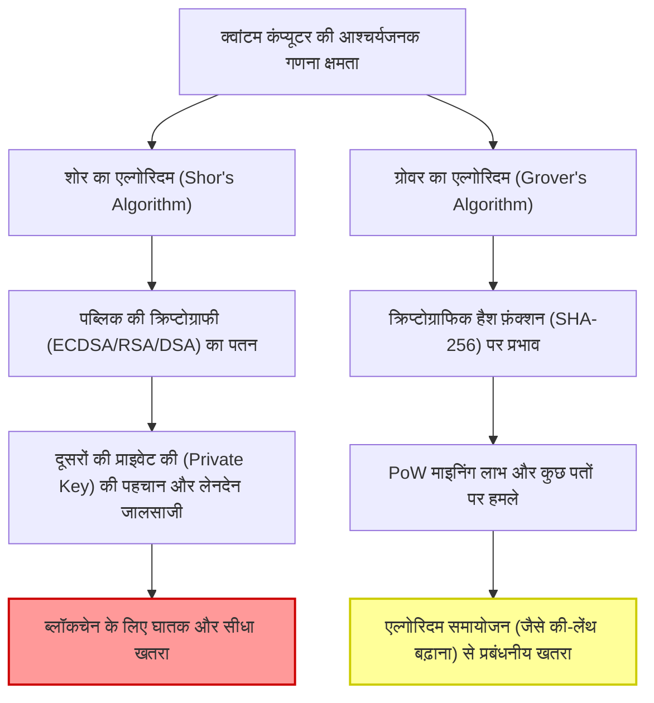
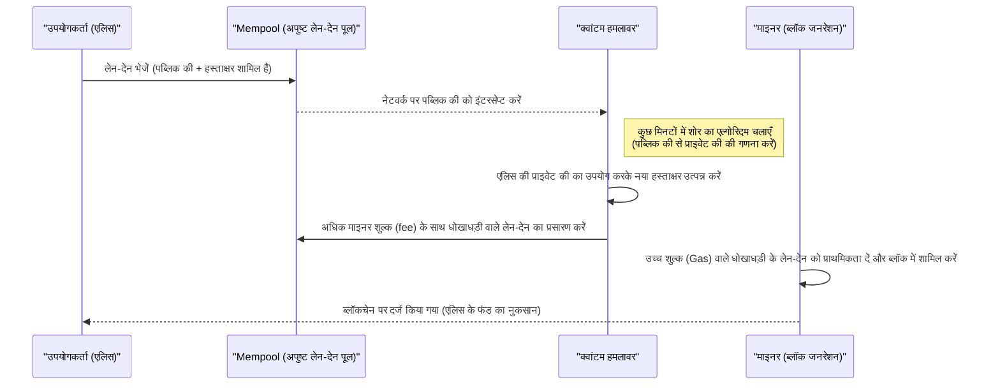
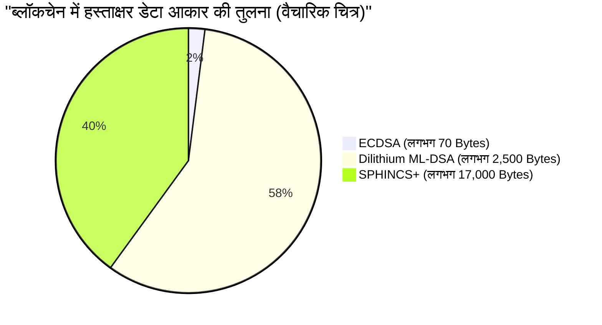

## 1. परिचय: पोस्ट-क्वांटम युग की आहट और ब्लॉकचेन का संकट

2009 में सतोशी नाकामोतो द्वारा बिटकॉइन (Bitcoin) के निर्माण के बाद से, ब्लॉकचेन तकनीक "विकेंद्रीकृत और अपरिवर्तनीय खाता बही" के रूप में दुनिया भर में वित्तीय प्रणालियों और अनुप्रयोगों की नींव बन गई है। इस मजबूत सुरक्षा का आधार आधुनिक क्रिप्टोग्राफिक तकनीकें हैं: **पब्लिक की क्रिप्टोग्राफी (Public Key Cryptography)** और **क्रिप्टोग्राफिक हैश फ़ंक्शंस (Cryptographic Hash Functions)**।

ये क्रिप्टोग्राफिक तकनीकें गणितीय "कम्प्यूटेशनल कठिनाई (Computational Hardness)" के आधार पर सुरक्षा की गारंटी देती हैं, जिसका अर्थ है कि एक क्लासिकल कंप्यूटर (जैसे कि आज हम जो पीसी या सुपरकंप्यूटर इस्तेमाल करते हैं) को इसे क्रैक करने में ब्रह्मांड के जीवनकाल जितना समय लग जाएगा।

हालाँकि, भौतिकी और सूचना विज्ञान की सीमा पर स्थित **क्वांटम कंप्यूटर (Quantum Computers)** के तेजी से विकास और व्यावहारिक अनुप्रयोग के कारण इस धारणा को जड़ से पलटने की तैयारी है। क्वांटम यांत्रिकी की विशिष्ट विशेषताओं जैसे "सुपरपोज़िशन (Superposition)" और "क्वांटम इंटैंगलमेंट (Entanglement)" का उपयोग करने वाले क्वांटम कंप्यूटर, कुछ गणितीय समस्याओं में पारंपरिक क्लासिकल कंप्यूटरों पर भारी पड़ने वाली कम्प्यूटेशनल क्षमता प्रदर्शित करते हैं, जिसे "क्वांटम सुप्रीमेसी (Quantum Supremacy)" कहा जाता है।

इस लेख में, हम गहराई से तकनीकी और गणितीय दृष्टिकोण से व्याख्या करेंगे कि क्वांटम कंप्यूटरों द्वारा ब्लॉकचेन तकनीक को विशेष रूप से किन खतरों का सामना करना पड़ रहा है, और इसके समाधान के रूप में **पोस्ट-क्वांटम क्रिप्टोग्राफी (PQC: Post-Quantum Cryptography)** के नवीनतम रुझानों और क्रिप्टो एसेट नेटवर्क के संक्रमण परिदृश्यों पर चर्चा करेंगे।

---

## 2. क्वांटम कंप्यूटर की मूल बातें और ब्लॉकचेन के लिए 2 बड़े खतरे

वर्तमान ब्लॉकचेन सिस्टम मुख्य रूप से निम्नलिखित 2 क्रिप्टोग्राफिक तत्वों से बने हैं, और इनमें से प्रत्येक क्वांटम एल्गोरिदम के कारण अलग-अलग खतरों के संपर्क में है।

### 2.1. एलिप्टिक कर्व क्रिप्टोग्राफी (ECDSA) की मूल बातें और कम्प्यूटेशनल कठिनाई

बिटकॉइन और एथेरियम (Ethereum) सहित कई ब्लॉकचेन अपने डिजिटल हस्ताक्षर एल्गोरिदम के रूप में **एलिप्टिक कर्व डिजिटल सिग्नेचर एल्गोरिदम (ECDSA: Elliptic Curve Digital Signature Algorithm)** का उपयोग करते हैं। विशेष रूप से, बिटकॉइन `secp256k1` नामक मापदंडों वाले एलिप्टिक कर्व का उपयोग करता है।

एलिप्टिक कर्व क्रिप्टोग्राफी की सुरक्षा **एलिप्टिक कर्व डिस्क्रीट लॉगरिथम प्रॉब्लम (ECDLP: Elliptic Curve Discrete Logarithm Problem)** की कम्प्यूटेशनल कठिनाई पर निर्भर करती है।
एलिप्टिक कर्व को वीयरस्ट्रास सामान्य रूप (Weierstrass normal form) में व्यक्त निम्नलिखित समीकरण द्वारा परिभाषित किया गया है:

$$
y^2 \equiv x^3 + ax + b \pmod{p}
$$

बिटकॉइन के `secp256k1` में, $a = 0, b = 7$ है, और $p$ एक बहुत बड़ी अभाज्य संख्या है।
इस वक्र (curve) पर एक बेस पॉइंट (संदर्भ बिंदु) को $G$ मान लेते हैं, और यादृच्छिक रूप से चुने गए 256-बिट के एक विशाल पूर्णांक को प्राइवेट की (Private Key) $k$ मानते हैं। इस स्थिति में, पब्लिक की (Public Key) $K$ की गणना बेस पॉइंट को $k$ बार जोड़कर (स्केलर गुणन) की जाती है।

$$
K = k \times G = \underbrace{G + G + \dots + G}_{k \text{ times}}
$$

क्लासिकल कंप्यूटर का उपयोग करके प्रकाशित पब्लिक की $K$ और बेस पॉइंट $G$ से प्राइवेट की $k$ की रिवर्स-इंजीनियरिंग (डिस्क्रीट लॉगरिथम खोजना) में, पोलार्ड-रो (Pollard's rho) एल्गोरिदम जैसे सबसे अच्छे क्लासिकल एल्गोरिदम का उपयोग करने पर भी $\mathcal{O}(\sqrt{p})$ का एक्सपोनेंशियल कम्प्यूटेशनल समय लगता है। 256-बिट की (key) के लिए, लगभग $2^{128}$ ऑपरेशनों की आवश्यकता होगी, जिसे वर्तमान सुपरकंप्यूटरों को अरबों वर्षों तक चलाने पर भी हल नहीं किया जा सकता है।

### 2.2. शोर का एल्गोरिदम (Shor's Algorithm) द्वारा पतन

हालाँकि, 1994 में पीटर शोर द्वारा प्रस्तुत किए गए **शोर के एल्गोरिदम** ने इस धारणा को पूरी तरह से नष्ट कर दिया। शोर का एल्गोरिदम मूल रूप से अभाज्य गुणनखंडन समस्या (RSA क्रिप्टोग्राफी का आधार) को पॉलिनॉमियल टाइम (polynomial time) में हल करने के लिए प्रस्तावित किया गया था, लेकिन इसे डिस्क्रीट लॉगरिथम समस्या और एलिप्टिक कर्व डिस्क्रीट लॉगरिथम समस्या पर भी लागू किया जा सकता है।

शोर के एल्गोरिदम का मूल, **क्वांटम फूरियर ट्रांसफॉर्म (QFT: Quantum Fourier Transform)** का उपयोग करके किसी फ़ंक्शन की "अवधि (Period)" को तेज़ी से खोजने में निहित है।

$$
\text{क्लासिकल कम्प्यूटेशनल जटिलता} = \mathcal{O}(2^{n/2}) \quad (n\text{ बिट-लंबाई है})
$$
$$
\text{क्वांटम एल्गोरिदम की कम्प्यूटेशनल जटिलता} = \mathcal{O}(n^3)
$$

इस प्रकार, शोर का एल्गोरिदम एक्सपोनेंशियल समय को **पॉलिनॉमियल टाइम (Polynomial Time)** में नाटकीय रूप से कम कर देता है। पर्याप्त लॉजिकल क्वांटम बिट्स (क्यूबिट्स) वाले क्वांटम कंप्यूटर के पूरा होने पर, नेटवर्क पर प्रकाशित पब्लिक की $K$ से कुछ मिनटों या सेकंडों में प्राइवेट की $k$ का पता लगाना संभव हो जाएगा। इससे हमलावर आसानी से दूसरों के वॉलेट की प्राइवेट की प्राप्त कर सकेंगे और पूरी तरह से फंड पर कब्ज़ा कर सकेंगे।

#### 2.2.1 शोर के एल्गोरिदम द्वारा ECDLP डिक्रिप्शन का चरण-दर-चरण विवरण

आइए चरण-दर-चरण आंतरिक प्रक्रिया को देखें कि क्वांटम कंप्यूटर एलिप्टिक कर्व डिस्क्रीट लॉगरिथम प्रॉब्लम (ECDLP) को कैसे हल करता है।

समस्या की सेटिंग: $K = k \times G$ में, $G$ और $K$ ज्ञात हैं, और हम अज्ञात पूर्णांक $k$ (प्राइवेट की) खोजना चाहते हैं। मान लें कि एलिप्टिक कर्व का ऑर्डर $N$ है।

**चरण 1: सुपरपोज़िशन स्टेट बनाना**
सबसे पहले, 2 क्वांटम रजिस्टर तैयार करें, और सभी संभावित पूर्णांक संयोजनों की सुपरपोज़िशन स्टेट बनाने के लिए प्रत्येक पर हैडामर्ड गेट (Hadamard Gate) लागू करें।
$$
|\psi_1\rangle = \frac{1}{N} \sum_{x=0}^{N-1} \sum_{y=0}^{N-1} |x\rangle |y\rangle |0\rangle
$$

**चरण 2: क्वांटम ऑरेकल लागू करना (फ़ंक्शन मूल्यांकन)**
इसके बाद, एलिप्टिक कर्व पर बिंदुओं को जोड़ने वाले क्वांटम सर्किट (ऑरेकल) का उपयोग करके तीसरे रजिस्टर में फ़ंक्शन $f(x, y) = x \times G + y \times K$ की गणना करें।
$$
|\psi_2\rangle = \frac{1}{N} \sum_{x=0}^{N-1} \sum_{y=0}^{N-1} |x\rangle |y\rangle |x \times G + y \times K\rangle
$$
यहाँ महत्वपूर्ण बात यह है कि चूँकि $K = k \times G$ है, इसे $f(x, y) = (x + y \cdot k) \times G$ के रूप में फिर से लिखा जा सकता है।

**चरण 3: तीसरे रजिस्टर का मापन**
तीसरे रजिस्टर को मापने पर, यह एलिप्टिक कर्व पर किसी बिंदु $R$ पर सिकुड़ (collapse) जाता है। नतीजतन, पहला और दूसरा रजिस्टर $(x, y)$ के युग्मों की सुपरपोज़िशन स्टेट में सिकुड़ जाते हैं जो $x + y \cdot k \equiv c \pmod{N}$ ($c$ एक स्थिरांक है) को संतुष्ट करते हैं।
$$
|\psi_3\rangle = \frac{1}{\sqrt{N}} \sum_{y=0}^{N-1} |c - y \cdot k \pmod{N}\rangle |y\rangle
$$

**चरण 4: क्वांटम फूरियर ट्रांसफॉर्म (QFT) लागू करना**
इस स्थिति (state) में अवधि $k$ से संबंधित आवधिकता (periodicity) होती है। यहाँ इनवर्स क्वांटम फूरियर ट्रांसफॉर्म (Inverse QFT) लागू करके, यह फेज़ इंटरफेरेंस (phase interference) का कारण बनता है और अवधि की जानकारी को एम्प्लीट्यूड (amplitude) में बदल देता है।

**चरण 5: मापन और क्लासिकल पोस्ट-प्रोसेसिंग**
पहले और दूसरे रजिस्टर को मापने पर, उच्च संभावना के साथ $k$ के बारे में जानकारी वाला मान प्राप्त होता है। मापे गए मान पर कंटिन्यूड फ्रैक्शन्स (Continued Fractions) जैसे क्लासिकल नंबर-थ्योरी एल्गोरिदम लागू करके, अज्ञात प्राइवेट की $k$ को पूरी तरह से निर्धारित किया जा सकता है।

इस पूरी प्रक्रिया में आवश्यक क्वांटम गेट्स की संख्या $\mathcal{O}(\log^3 N)$ है, जो क्लासिकल कंप्यूटर द्वारा $\mathcal{O}(\sqrt{N})$ की खोज की तुलना में अविश्वसनीय रूप से तेज़ गति से प्राइवेट की को उजागर करती है।

### 2.3. ग्रोवर का एल्गोरिदम (Grover's Algorithm) और हैश फ़ंक्शंस पर प्रभाव

एक और खतरा 1996 में लोव ग्रोवर (Lov Grover) द्वारा प्रस्तावित **ग्रोवर का एल्गोरिदम** है। इसका हैश फ़ंक्शंस (जैसे: SHA-256) पर बहुत बड़ा प्रभाव पड़ता है।

ब्लॉकचेन में, हैश फ़ंक्शंस का उपयोग डेटा अखंडता की गारंटी देने, पते उत्पन्न करने और बिटकॉइन में **PoW (Proof of Work) माइनिंग** के आधार के रूप में किया जाता है। हैश फ़ंक्शन (प्री-इमेज कैलकुलेशन) की रिवर्स इंजीनियरिंग को "अनस्ट्रक्चर्ड डेटाबेस सर्च प्रॉब्लम" के रूप में देखा जा सकता है, जहाँ हम एक इनपुट मान $x$ की खोज करते हैं जो किसी विशिष्ट आउटपुट मान $y$ के लिए $H(x) = y$ में परिणत होता है।

क्लासिकल कंप्यूटर पर, $N$ संभावनाओं में से सही उत्तर खोजने के लिए, औसतन $\frac{N}{2}$ परीक्षण और सबसे खराब स्थिति में $N$ परीक्षणों की आवश्यकता होती है। यानी कम्प्यूटेशनल जटिलता $\mathcal{O}(N)$ है।

हालाँकि, ग्रोवर का एल्गोरिदम "एम्प्लीट्यूड एम्प्लीफिकेशन (Amplitude Amplification)" नामक क्वांटम तकनीक का उपयोग करता है। सुपरपोज़िशन स्टेट में मौजूद सभी संभावनाओं में से सही स्थिति के प्रोबेबिलिटी एम्प्लीट्यूड (probability amplitude) को बार-बार बढ़ाकर, यह खोज के समय को उसके वर्गमूल (square root) तक कम कर देता है।

$$
\text{ग्रोवर के एल्गोरिदम की कम्प्यूटेशनल जटिलता} = \mathcal{O}(\sqrt{N})
$$

SHA-256 के मामले में, चूँकि $N = 2^{256}$ है, एक क्लासिकल ब्रूट-फोर्स खोज के लिए लगभग $2^{256}$ परीक्षणों की आवश्यकता होती है। हालाँकि, ग्रोवर के एल्गोरिदम का उपयोग करने पर केवल $\sqrt{2^{256}} = 2^{128}$ परीक्षणों की आवश्यकता होगी। इसका मतलब यह है कि 256-बिट हैश फ़ंक्शन की सुरक्षा **क्वांटम कंप्यूटरों के खिलाफ प्रभावी रूप से 128-बिट सुरक्षा शक्ति तक आधी रह जाती है**।

#### 2.3.1. क्या SHA-256 जीवित रहेगा? (हैशिंग में क्वांटम सुप्रीमेसी)

हालाँकि सुरक्षा आधी रह जाती है, फिर भी "128-बिट सुरक्षा" बेहद मजबूत है। वर्तमान तकनीकी स्तर के दृष्टिकोण से भी $2^{128}$ ऑपरेशन एक खगोलीय संख्या है, और इसके लिए ब्रह्मांड के जीवनकाल जितना समय चाहिए होगा।

इसलिए, यह व्यापक रूप से माना जाता है कि **"SHA-256 क्वांटम कंप्यूटरों के खिलाफ भी व्यावहारिक सुरक्षा बनाए रखेगा"**। यदि भविष्य में सुरक्षा मार्जिन को बढ़ाने की आवश्यकता होती है, तो बस हैश की आउटपुट लंबाई को दोगुना (उदाहरण के लिए: SHA-256 से SHA-512 में माइग्रेट करना) करने से क्वांटम दुनिया में भी क्लासिकल 256-बिट सुरक्षा को बनाए रखा जा सकता है।

निष्कर्ष में, हम कह सकते हैं कि हैश फ़ंक्शंस के लिए क्वांटम खतरा "मामूली और प्रबंधनीय" है, जबकि पब्लिक की क्रिप्टोग्राफी (ECDSA) के लिए खतरा "घातक" है।

---

## 3. वर्तमान क्रिप्टो एसेट्स (Bitcoin, Ethereum) पर विशिष्ट प्रभाव का विश्लेषण

ऐसी दुनिया में जहाँ क्वांटम कंप्यूटरों द्वारा ECDSA को डिक्रिप्ट किया जा सकता है, क्रिप्टो एसेट नेटवर्क विशेष रूप से किन कमजोरियों का सामना करेंगे? यहाँ, हम बिटकॉइन के तंत्र (मैकेनिज्म) का एक उदाहरण के रूप में उपयोग करके **"पब्लिक की के उजागर होने के समय (Timing of Public Key Exposure)"** के दृष्टिकोण से एक विस्तृत विश्लेषण करेंगे।

### 3.1. पतों (Addresses) का निर्माण और पब्लिक की की "गोपनीयता"

बिटकॉइन के पते (P2PKH: Pay-to-Public-Key-Hash और P2WPKH: Pay-to-Witness-Public-Key-Hash) सीधे पब्लिक की का उपयोग नहीं करते हैं, बल्कि पब्लिक की के कई बार हैश किए गए संस्करण का उपयोग करते हैं।

$$
\text{Bitcoin Address} = \text{Base58Check}(\text{RIPEMD160}(\text{SHA256}(\text{Public Key})))
$$

जैसा कि पहले उल्लेख किया गया है, हैश फ़ंक्शंस क्वांटम हमलों (ग्रोवर का एल्गोरिदम) के प्रति प्रतिरोधी हैं, इसलिए क्वांटम कंप्यूटर के लिए भी हैश मान वाले "पते" से मूल "पब्लिक की" की रिवर्स-इंजीनियरिंग करना असंभव है।

दूसरे शब्दों में, **"अप्रयुक्त (ऐसे पते जिनसे कभी कोई फंड नहीं भेजा गया है) पतों"** के लिए, पब्लिक की ब्लॉकचेन पर बिल्कुल भी उजागर नहीं होती है, और केवल हैश मान दर्ज किया जाता है। इसलिए, जब तक पब्लिक की अज्ञात है, शोर के एल्गोरिदम को निष्पादित करने के लिए कोई लक्ष्य नहीं है, और प्राइवेट की का पता नहीं लगाया जा सकता है। इस स्थिति में वॉलेट को क्वांटम-सुरक्षित (Quantum-safe) कहा जा सकता है।

### 3.2. लेन-देन (Transaction) भेजते समय घातक भेद्यता (फ्रंट-रनिंग हमला)

समस्या तब उत्पन्न होती है जब उपयोगकर्ता फंड ट्रांसफर करते हैं।
नेटवर्क पर लेन-देन का प्रसारण (ब्रॉडकास्ट) करते समय, सत्यापन के लिए उपयोगकर्ताओं को डिजिटल हस्ताक्षर के साथ **अपनी पब्लिक की को लेन-देन डेटा में शामिल करना होगा और इसे पूरे नेटवर्क में सार्वजनिक करना होगा**।

एक बार जब पब्लिक की Mempool (अपुष्ट लेन-देन के लिए प्रतीक्षा क्षेत्र) में भेज दी जाती है, तो उस डेटा को दुनिया भर के नोड्स के साथ साझा किया जाता है। यदि किसी हमलावर के पास एक अल्ट्रा-फास्ट क्वांटम कंप्यूटर है, तो वह निम्नलिखित प्रक्रिया से धन चुरा सकता है:

1. Mempool से एक वैध उपयोगकर्ता (एलिस) के लेन-देन को इंटरसेप्ट (intercept) करें और **पब्लिक की निकालें**।
2. शोर का एल्गोरिदम चलाएँ और **कुछ मिनटों के भीतर (ब्लॉक के स्वीकृत होने से पहले) पब्लिक की से प्राइवेट की की गणना करें**।
3. प्राप्त प्राइवेट की का उपयोग करके, एक **नकली लेन-देन बनाएँ** जो एलिस के धन को हमलावर के पते पर भेजता है।
4. इस नकली लेन-देन के लिए एलिस के मूल लेन-देन की तुलना में **बहुत अधिक माइनर शुल्क (Fee) निर्धारित करें** और इसे नेटवर्क पर भेजें।

माइनर आर्थिक प्रोत्साहन (economic incentives) का पालन करते हैं और उच्च शुल्क वाले लेन-देन को प्राथमिकता देते हुए ब्लॉक में शामिल करते हैं। परिणामस्वरूप, हमलावर का कपटपूर्ण धन हस्तांतरण पहले स्वीकृत (Confirm) हो जाता है, और एलिस के वैध हस्तांतरण को "अपर्याप्त शेष (Double Spend)" के रूप में छोड़ दिया जाता है।
घटनाओं के इस क्रम को **फ्रंट-रनिंग हमला (Front-running Attack)** कहा जाता है। जिस दुनिया में क्वांटम कंप्यूटर का व्यावहारिक उपयोग होगा, वहाँ यह एक भयावह स्थिति पैदा करेगा जहाँ किसी के द्वारा सेंड (Send) बटन दबाते ही धन हैकर्स द्वारा चुरा लिया जाएगा।

### 3.3. पुन: उपयोग किए गए पतों और पुराने पतों (P2PK) का संकट

इससे भी अधिक गंभीर समस्या यह है कि जो पते अतीत में कम से कम एक बार धन भेजने के लिए उपयोग किए गए हैं (जैसे कि चेंज एड्रेस (change address) के रूप में पुन: उपयोग किए जाने पर), उनकी पब्लिक की पहले ही स्थायी रूप से ब्लॉकचेन पर दर्ज हो चुकी है। इन्हें लेन-देन भेजने का इंतजार किए बिना, किसी भी समय अपनी प्राइवेट की की गणना होने और शेष राशि (balance) छिन जाने का खतरा होता है।

इसके अलावा, 2009 से 2010 के आसपास मुख्यधारा के **P2PK (Pay-to-Public-Key)** प्रारूप में, जिसमें सतोशी नाकामोतो के शुरुआती माइनिंग पुरस्कार (लगभग 1 मिलियन बीटीसी या अधिक) शामिल हैं, पते के रूप में हैश के बजाय सीधे पब्लिक की को ब्लॉकचेन पर दर्ज किया गया था। ये बड़ी संख्या में निष्क्रिय बिटकॉइन क्वांटम कंप्यूटरों के लिए सबसे आसान लक्ष्य बन जाएंगे, और यदि एक साथ चोरी हो गए और बाज़ार में डंप (dump) कर दिए गए, तो वे कीमत में भारी गिरावट का कारण बन सकते हैं।

---

## 4. पोस्ट-क्वांटम क्रिप्टोग्राफी (PQC: Post-Quantum Cryptography) में संक्रमण परिदृश्य

"Q-Day (वह दिन जब क्वांटम कंप्यूटर क्रिप्टोग्राफी को तोड़ देंगे)" की ऐसी तबाही से बचने के लिए, क्रिप्टोग्राफिक समुदाय और ब्लॉकचेन समुदाय **पोस्ट-क्वांटम क्रिप्टोग्राफी (PQC)** में संक्रमण की योजना बना रहे हैं, जिसे क्वांटम एल्गोरिदम द्वारा भी समझना मुश्किल है।
यूएस नेशनल इंस्टीट्यूट ऑफ स्टैंडर्ड्स एंड टेक्नोलॉजी (NIST) कई वर्षों से PQC के मानकीकरण की प्रक्रिया को आगे बढ़ा रहा है, और कठोर मूल्यांकन के कई दौरों के बाद, कुछ आशाजनक क्रिप्टोग्राफिक विधियों को अंतिम मानकों के रूप में चुना गया है।

हम ब्लॉकचेन डिजिटल हस्ताक्षरों के विकल्प के रूप में ध्यान आकर्षित करने वाले प्रमुख PQC एल्गोरिदम और उनके गणितीय तंत्र को विस्तार से समझाएंगे।

### 4.1. हैश-आधारित हस्ताक्षर (Hash-Based Signatures)

हैश-आधारित हस्ताक्षर एक क्रिप्टोग्राफिक विधि है जिसकी सुरक्षा पूरी तरह से "हैश फ़ंक्शन के टकराव प्रतिरोध (collision resistance)" के अत्यंत सरल और मजबूत आधार पर निर्भर करती है। चूँकि क्वांटम कंप्यूटरों के खिलाफ हैश फ़ंक्शंस की सुरक्षा पहले ही साबित हो चुकी है (जैसा कि ऊपर उल्लेख किया गया है, 128-बिट सुरक्षा मार्जिन पर्याप्त है), यह एक अत्यधिक विश्वसनीय दृष्टिकोण है।
विशिष्ट उदाहरणों में **लैम्पोर्ट सिग्नेचर्स (Lamport Signatures)**, इसका विस्तारित संस्करण WOTS (Winternitz One-Time Signature), और NIST मानकीकरण उम्मीदवार **SPHINCS+** (जिसे अब FIPS 205 के रूप में SLH-DSA कहा जाता है) शामिल हैं।

#### 4.1.1. लैम्पोर्ट सिग्नेचर का गणितीय विवरण (One-Time Signature)

आइए लैम्पोर्ट सिग्नेचर के तंत्र को गणितीय रूप से और अधिक विस्तार से देखें।
मान लें कि हैश फ़ंक्शन $H: \{0, 1\}^* \to \{0, 1\}^{256}$ है।

**【की (Key) जनरेशन】**
एलिस (प्रेषक) एक ट्रू रैंडम नंबर जनरेटर (TRNG) का उपयोग करके 256 प्राइवेट की जोड़े उत्पन्न करती है।
$$
\text{sk}_{i,0} \in \{0, 1\}^{256}, \quad \text{sk}_{i,1} \in \{0, 1\}^{256} \quad (1 \le i \le 256)
$$
नतीजतन, प्राइवेट की $\text{sk}$ में कुल 512, 256-बिट स्ट्रिंग्स (आकार: $512 \times 32 = 16,384$ बाइट्स) होते हैं।

अगला, पब्लिक की $\text{pk}$ की गणना करें। प्रत्येक प्राइवेट की घटक (component) को अलग-अलग हैश करें।
$$
\text{pk}_{i,0} = H(\text{sk}_{i,0}), \quad \text{pk}_{i,1} = H(\text{sk}_{i,1})
$$
पब्लिक की भी $16,384$ बाइट्स की होगी। इसे ब्लॉकचेन नेटवर्क पर प्रकाशित करें।

**【हस्ताक्षर जनरेशन】**
एलिस लेन-देन डेटा $M$ पर हस्ताक्षर करने के लिए, सबसे पहले उसके हैश मान की गणना करती है।
$$
h = H(M) \in \{0, 1\}^{256}
$$
मान लें कि हैश मान $h$ का $i$-वाँ बिट $h_i \in \{0, 1\}$ है।
एलिस का हस्ताक्षर $\sigma$ प्रत्येक बिट $h_i$ के अनुरूप प्राइवेट की घटकों का एक सेट होगा।
$$
\sigma = (\text{sk}_{1, h_1}, \text{sk}_{2, h_2}, \dots, \text{sk}_{256, h_{256}})
$$
दूसरे शब्दों में, यदि संदेश हैश का बिट `0` है, तो $\text{sk}_{i,0}$ प्रकाशित किया जाता है, और यदि यह `1` है, तो $\text{sk}_{i,1}$ प्रकाशित किया जाता है। हस्ताक्षर का आकार $256 \times 32 = 8,192$ बाइट्स होगा।

**【हस्ताक्षर सत्यापन】**
माइनर (सत्यापनकर्ता) प्राप्त लेन-देन $M$, हस्ताक्षर $\sigma = (s_1, s_2, \dots, s_{256})$, और पब्लिक की $\text{pk}$ का उपयोग करके सत्यापन करता है।
लेन-देन के हैश $h = H(M)$ की पुनर्गणना करें और जाँचें कि क्या प्रत्येक $s_i$ का हैश किया गया संस्करण पब्लिक की के संगत तत्व $\text{pk}_{i, h_i}$ से मेल खाता है।
$$
H(s_i) \overset{?}{=} \text{pk}_{i, h_i} \quad (\text{for all } 1 \le i \le 256)
$$

यह प्रक्रिया गणितीय रूप से अत्यंत सरल है, और जब तक एक क्वांटम कंप्यूटर $H$ की रिवर्स-इंजीनियरिंग नहीं कर सकता, तब तक हस्ताक्षर बनाना असंभव है। हालाँकि, एक बार हस्ताक्षर किए जाने के बाद, आधी प्राइवेट की नेटवर्क पर उजागर हो जाती है, इसलिए यदि उसी की-पेयर (key pair) के साथ किसी अन्य संदेश पर हस्ताक्षर किया जाता है, तो उजागर हुई प्राइवेट की संयुक्त होकर हमलावर को जालसाजी की गुंजाइश देगी। अतः यह एक मजबूत प्रतिबंध पैदा करता है कि इसका उपयोग केवल "एक बार (One-Time)" किया जा सकता है।
इसे व्यावहारिक बनाने के लिए, मर्कल ट्री (Merkle tree) का उपयोग करके कई वन-टाइम कीज़ को एक रूट पब्लिक की में बंडल करने वाले **XMSS** और स्टेटलेस **SPHINCS+** जैसी तकनीकें विकसित की गई हैं, लेकिन इनका नुकसान यह है कि हस्ताक्षर का आकार दसियों किलोबाइट तक पहुँच जाता है।

### 4.2. लैटिस-बेस्ड क्रिप्टोग्राफी (Lattice-Based Cryptography)

वर्तमान में, PQC की मुख्यधारा के रूप में जिसकी सबसे अधिक उम्मीद की जाती है और जिसे NIST के मुख्य मानक (FIPS 204: ML-DSA / पूर्व में CRYSTALS-Dilithium, और Falcon आदि) के रूप में अपनाया गया है, वह है **लैटिस-बेस्ड क्रिप्टोग्राफी (Lattice-Based Cryptography)**।

लैटिस क्रिप्टोग्राफी की सुरक्षा गणितीय रूप से सिद्ध कठिन समस्याओं पर निर्भर करती है जैसे "बहु-आयामी जाली में सबसे छोटी वेक्टर समस्या (SVP: Shortest Vector Problem)" और "त्रुटियों के साथ सीखने की समस्या (LWE: Learning With Errors)"। क्वांटम कंप्यूटर का उपयोग करके भी लैटिस समस्याओं को कुशलतापूर्वक हल करने के लिए कोई एल्गोरिदम नहीं खोजा गया है।

**LWE (Learning With Errors) का गणितीय मॉडल:**
LWE समस्या का मूल विचार युगपत रैखिक समीकरणों (simultaneous linear equations) में जानबूझकर "छोटा शोर (त्रुटि)" जोड़कर समस्या को नाटकीय रूप से अधिक कठिन बनाना है।
मान लें कि गुप्त वेक्टर $\mathbf{s} \in \mathbb{Z}_q^n$ है।
यहाँ यादृच्छिक रूप से चुना गया एक विशाल सार्वजनिक मैट्रिक्स $\mathbf{A} \in \mathbb{Z}_q^{m \times n}$ और जानबूझकर जोड़ा गया एक छोटा नॉइज़ वेक्टर $\mathbf{e} \in \mathbb{Z}_q^m$ है।
पब्लिक की $\mathbf{b}$ की गणना निम्नानुसार की जाती है:

$$
\mathbf{b} = \mathbf{A}\mathbf{s} + \mathbf{e} \pmod{q}
$$

भले ही मैट्रिक्स $\mathbf{A}$ और वेक्टर $\mathbf{b}$ (पब्लिक की) प्रकाशित हों, नॉइज़ $\mathbf{e}$ की उपस्थिति के कारण प्राइवेट की $\mathbf{s}$ की रिवर्स-इंजीनियरिंग करना बहुत मुश्किल हो जाता है। यदि कोई शोर न हो, तो इसे सरल गाऊसी उन्मूलन (Gaussian elimination) से हल किया जा सकता है, लेकिन शोर होने से सभी आयामों (dimensions) में खोज का स्थान (search space) विस्फोटक रूप से बढ़ जाता है, जो क्लासिकल और क्वांटम दोनों कंप्यूटरों के खिलाफ मजबूत सुरक्षा प्रदान करता है।

ब्लॉकचेन आदि में उपयोग किए जाने वाले वास्तविक एल्गोरिदम (Dilithium, आदि) में, इसे पॉलिनॉमियल रिंग (polynomial ring) पर विस्तारित **Ring-LWE (या Module-LWE)** के रूप में उपयोग किया जाता है, जो की (key) के आकार को कम करता है और गणना को गति देता है।

* **लाभ**: हैश-आधारित हस्ताक्षरों की तुलना में, पब्लिक की और हस्ताक्षर का आकार अपेक्षाकृत छोटा होता है (कुछ किलोबाइट), और हस्ताक्षर निर्माण और सत्यापन की गणना गति बहुत तेज़ होती है (ECDSA के बराबर या उससे अधिक)।
* **नुकसान**: गणितीय संरचना जटिल है, और ऐतिहासिक सत्यापन अवधि छोटी होने के कारण, इस बात का जोखिम शून्य नहीं है कि भविष्य में कोई नया डिक्रिप्शन एल्गोरिदम खोज लिया जाएगा।

---

## 5. ब्लॉकचेन के PQC माइग्रेशन में तकनीकी चुनौतियां

भले ही PQC एल्गोरिदम (जैसे Dilithium और SPHINCS+) मौजूद हों, लेकिन इसका मतलब यह नहीं है कि उन्हें कल ही बिटकॉइन या एथेरियम में पेश किया जा सकता है। विकेंद्रीकृत प्रणालियों के लिए विशिष्ट कई बड़ी चुनौतियां मौजूद हैं।

### 5.1. हस्ताक्षरों के आकार में वृद्धि और स्केलेबिलिटी का पतन

PQC की शुरूआत में सबसे बड़ी बाधा डेटा आकार में भारी वृद्धि है।
वर्तमान ECDSA हस्ताक्षर का आकार लगभग 70 बाइट्स है, जबकि लैटिस क्रिप्टोग्राफी Dilithium (ML-DSA) में हस्ताक्षर का आकार लगभग 2,420 बाइट्स से 4,595 बाइट्स (सुरक्षा स्तर के आधार पर) है, और पब्लिक की का आकार भी 1,300 बाइट्स से अधिक है। हैश-आधारित SPHINCS+ की बात करें तो केवल हस्ताक्षर का आकार दसियों हज़ार बाइट्स तक पहुँच जाता है।

यदि बिटकॉइन अपने मौजूदा ब्लॉक आकार की सीमा (SegWit सहित लगभग 4MB का भार) को बनाए रखते हुए PQC पेश करता है, तो एक ब्लॉक में संग्रहीत किए जा सकने वाले लेन-देन की संख्या में भारी कमी आएगी। नेटवर्क का थ्रूपुट (TPS: Transactions Per Second) विनाशकारी रूप से गिर जाएगा, और हस्तांतरण में देरी (congestion) एक सामान्य बात हो जाएगी।

इसे हल करने के लिए, ब्लॉक के आकार को महत्वपूर्ण रूप से बढ़ाना आवश्यक होगा, लेकिन इससे पूर्ण नोड (full node) की भंडारण आवश्यकताओं और नेटवर्क बैंडविड्थ की आवश्यकताओं में वृद्धि होगी, जिससे व्यक्तियों के लिए नोड संचालित करना मुश्किल हो जाएगा, और परिणामस्वरूप यह **नेटवर्क के केंद्रीकरण** की दुविधा को जन्म देगा।

*(※ PQC के लागू होने के साथ लेन-देन डेटा में वृद्धि स्केलेबिलिटी के लिए एक घातक बाधा (bottleneck) बन जाती है)*

### 5.2. Ethereum Virtual Machine (EVM) पर प्रभाव और प्रीकंपाइल्ड कॉन्ट्रैक्ट्स

एथेरियम जैसे ट्यूरिंग-कम्प्लीट स्मार्ट कॉन्ट्रैक्ट प्लेटफॉर्म पर, PQC की शुरूआत के लिए EVM (Ethereum Virtual Machine) के मौलिक अपग्रेड की आवश्यकता होगी।
वर्तमान EVM में, ECDSA हस्ताक्षरों के सत्यापन के लिए `ecrecover` (पता: `0x01`) नामक एक प्रीकंपाइल्ड कॉन्ट्रैक्ट (Precompiled Contract) प्रदान किया गया है, जिसे बहुत कम गैस शुल्क (3000 Gas) पर हस्ताक्षर सत्यापन करने के लिए अनुकूलित (optimized) किया गया है।

हालाँकि, Dilithium और Falcon जैसे नए लैटिस क्रिप्टोग्राफी एल्गोरिदम की सत्यापन प्रक्रिया में जटिल बहुपद और मैट्रिक्स संचालन (polynomial and matrix operations) शामिल होते हैं, इसलिए यदि केवल मौजूदा EVM ओपकोड (Opcode) का उपयोग करके लागू किया जाता है, तो एक एकल हस्ताक्षर सत्यापन लाखों से लेकर करोड़ों गैस (Gas) की खपत कर सकता है। यह एक ऐसा स्तर है जो केवल एक लेन-देन में वर्तमान ब्लॉक गैस सीमा (लगभग 30 मिलियन गैस) को समाप्त कर देगा।

इससे बचने के लिए, नेटवर्क के हार्ड फोर्क (hard fork) के माध्यम से नए PQC सत्यापन के लिए प्रीकंपाइल्ड कॉन्ट्रैक्ट (उदाहरण के लिए: `0x10` को DilithiumVerify आवंटित करना) को EVM में ही बनाना आवश्यक होगा। इसके लिए एक लंबी प्रक्रिया की आवश्यकता होती है जहाँ प्रत्येक एथेरियम क्लाइंट (Geth, Nethermind, Erigon, आदि) के मुख्य विकासकर्ता C++, Go और Rust जैसी भाषाओं के स्तर पर लैटिस क्रिप्टोग्राफी सत्यापन तर्क को अनुकूलित (optimize) करने और सुरक्षा ऑडिट (security audit) करने के लिए सहयोग करते हैं।

### 5.3. हार्ड फोर्क के माध्यम से आम सहमति (Consensus) बनाने में कठिनाई

अंतर्निहित (underlying) हस्ताक्षर एल्गोरिदम को बदलने के लिए, एक **हार्ड फोर्क (Hard Fork)** आवश्यक है जो पूरे नेटवर्क के प्रोटोकॉल को अपडेट करता है। हालाँकि, बिटकॉइन जैसे समुदाय में जहाँ "नियमों को न बदलने और विकेंद्रीकृत होने" पर ज़ोर दिया जाता है, वहाँ आम सहमति (consensus) प्राप्त करने की प्रक्रिया राजनीतिक रूप से भी बहुत कठिन है। PQC में माइग्रेशन पर एक BIP (Bitcoin Improvement Proposal) प्रस्तावित होने से लेकर लागू होने तक, कई वर्षों की चर्चा और परीक्षण की आवश्यकता होगी।

---

## 6. "Q-Day" कब आएगा? संक्रमण के लिए रोडमैप

"वह दिन जब क्वांटम कंप्यूटर 256-बिट एलिप्टिक कर्व क्रिप्टोग्राफी को पूरी तरह से क्रैक कर देंगे (Q-Day)" कब आएगा?
शोधकर्ताओं के बीच राय विभाजित है, लेकिन कई विशेषज्ञों का अनुमान है कि **"2030 के दशक के मध्य से 2040 के दशक के दौरान"**, कम से कम हजारों से लेकर दसियों हज़ार स्थिर तार्किक क्वांटम बिट्स (logical qubits - शोर प्रतिरोध (noise resistance) के साथ त्रुटि-सुधारे गए क्वांटम बिट्स) वाले बड़े पैमाने के क्वांटम कंप्यूटर दिखाई देंगे। हालाँकि, हार्डवेयर आर्किटेक्चर में किसी बड़ी सफलता या अधिक कुशल क्वांटम एल्गोरिदम की खोज के आधार पर, यह संभावना भी नकारी नहीं जा सकती कि यह समय पहले (2030 के आसपास) आ सकता है।

क्रिप्टो एसेट इकोसिस्टम द्वारा बहुत देर होने से पहले अपनाया जाने वाला रोडमैप निम्नलिखित है:

### चरण 1: हाइब्रिड सिग्नेचर और अकाउंट एब्स्ट्रैक्शन (Account Abstraction) (वर्तमान - 2028 के आसपास)
वर्तमान ब्लॉकचेन समुदाय, विशेष रूप से एथेरियम के विकासकर्ता (जैसे विटालिक ब्यूटिरिन), ECDSA और PQC (हैश-आधारित हस्ताक्षर या लैटिस क्रिप्टोग्राफी) को मिलाकर एक **"हाइब्रिड सिग्नेचर"** पर विचार कर रहे हैं। यह एक ऐसा दृष्टिकोण है जिसमें मौजूदा सुरक्षित ECDSA हस्ताक्षर और PQC हस्ताक्षर दोनों को लेन-देन से जोड़ा जाता है, ताकि यदि एक टूट भी जाए, तो भी सुरक्षा बनी रहे।
इसके अलावा, अकाउंट एब्स्ट्रैक्शन (Account Abstraction, ERC-4337) का उपयोग करके, प्रोटोकॉल-स्तरीय हार्ड फोर्क की प्रतीक्षा किए बिना स्मार्ट कॉन्ट्रैक्ट वॉलेट्स पर ऑप्ट-इन (केवल उन उपयोगकर्ताओं के लिए जो ऐसा चाहते हैं) आधार पर PQC हस्ताक्षरों को लागू और समर्थन करने के प्रयास भी चल रहे हैं।

### चरण 2: जीरो-नॉलेज प्रूफ़ (ZK-Rollups) का उपयोग (2025 से शुरू)
लेयर 2 तकनीक **ZK-Rollups (जीरो-नॉलेज प्रूफ़)** के उपयोग से PQC की सबसे बड़ी कमजोरी "हस्ताक्षर डेटा के आकार में वृद्धि" को हल करने के लिए एक ट्रम्प कार्ड (trump card) होने की उम्मीद है।
विशाल PQC हस्ताक्षर डेटा को सीधे लेयर 1 (मुख्य श्रृंखला) पर लिखने के बजाय, लेयर 2 पर बड़ी संख्या में PQC लेन-देन सत्यापित और एकत्रित किए जाते हैं। फिर, ZK-SNARKs या ZK-STARKs का उपयोग करके, उन्हें एक अत्यंत छोटे "प्रूफ़ डेटा (Proof)" में संपीड़ित (compress) किया जाता है और लेयर 1 पर रिकॉर्ड किया जाता है।
यह ध्यान दिया जाना चाहिए कि कुछ SNARK कॉन्फ़िगरेशन (जैसे Groth16) अपने आप में क्वांटम रूप से कमज़ोर हैं, इसलिए **ZK-STARKs** को अपनाना महत्वपूर्ण होगा जो केवल क्वांटम-प्रतिरोधी हैश फ़ंक्शंस पर निर्भर करते हैं।

### चरण 3: प्रोटोकॉल-स्तरीय हार्ड फोर्क (2030 के आसपास)
जब NIST द्वारा PQC का मानकीकरण पूरी तरह से स्थापित हो जाएगा और उद्योग-मानक पुस्तकालय (industry-standard libraries) उपलब्ध हो जाएंगे तथा उनका पर्याप्त परीक्षण हो जाएगा, तब यह उम्मीद की जाती है कि बिटकॉइन और एथेरियम जैसी प्रमुख श्रृंखलाओं (chains) पर डिफ़ॉल्ट हस्ताक्षर विधि को पूरी तरह से PQC में माइग्रेट करने के लिए एक हार्ड फोर्क लागू किया जाएगा। इस संक्रमण अवधि के दौरान, उपयोगकर्ताओं को "अपने धन को पुराने वॉलेट से नए PQC-संगत वॉलेट में स्थानांतरित करने" के लिए प्रोत्साहित करने हेतु बड़े पैमाने पर घोषणाएं की जाएंगी।

### अग्रणी परियोजना के उदाहरण

कुछ ब्लॉकचेन परियोजनाओं ने इस क्वांटम खतरे का अनुमान लगाया है और शुरुआत से ही क्वांटम प्रतिरोध के दावे के साथ विकसित किए जा रहे हैं।
* **QRL (Quantum Resistant Ledger)**: यह एक प्रारंभिक ब्लॉकचेन है जिसने प्रोटोकॉल स्तर पर मूल रूप से XMSS (eXtended Merkle Signature Scheme) नामक हैश-आधारित PQC को लागू किया है।
* **Algorand / Cellframe**: ये ऐसी परियोजनाएं हैं जिनमें भविष्य के PQC अपडेट को ध्यान में रखते हुए क्रिप्टोग्राफिक परत का एक लचीला मॉड्यूलर आर्किटेक्चर है, और जो सक्रिय रूप से लैटिस क्रिप्टोग्राफी के एकीकरण की खोज कर रहे हैं।

---

## 7. निष्कर्ष: क्रिप्टो एसेट्स का भविष्य और अपनी संपत्ति की रक्षा करना

"पोस्ट-क्वांटम युग" का आगमन अब विज्ञान-कथा (साइंस फिक्शन) के क्षेत्र तक सीमित नहीं है, बल्कि यह पहले ही यथार्थवादी क्रिप्टोग्राफिक प्रणालियों के लिए एक ठोस तकनीकी चुनौती के रूप में हमारे सामने है।

क्वांटम कंप्यूटर की दो तलवारें, शोर का एल्गोरिदम और ग्रोवर का एल्गोरिदम, वर्तमान ब्लॉकचेन की नींव, अर्थात् क्रमशः पब्लिक की क्रिप्टोग्राफी और हैश फ़ंक्शंस के लिए खतरा पैदा करती हैं। विशेष रूप से, ECDSA की भेद्यता (vulnerability) घातक है, और फ्रंट-रनिंग हमले द्वारा धन चोरी के जोखिम से बचने के लिए पोस्ट-क्वांटम क्रिप्टोग्राफी (PQC) में संक्रमण एक बिल्कुल अपरिहार्य (unavoidable) मार्ग है।

हालाँकि, तकनीकी दुनिया और ब्लॉकचेन समुदाय केवल हाथ पर हाथ धरे विनाश का इंतज़ार नहीं कर रहे हैं। लैटिस क्रिप्टोग्राफी और हैश-आधारित हस्ताक्षरों जैसे PQC एल्गोरिदम का चयन और मानकीकरण लगातार आगे बढ़ रहा है, और जीरो-नॉलेज प्रूफ़ (ZK-STARKs) और लेयर 2 स्केलिंग तकनीकों का उपयोग करके, PQC की शुरुआत की सबसे बड़ी बाधा "डेटा आकार में वृद्धि" को दूर करने का मार्ग भी दिखाई देने लगा है।

हम जैसे आम क्रिप्टो उपयोगकर्ताओं और निवेशकों को अभी घबराकर अपनी सभी संपत्तियां बेचने की आवश्यकता नहीं है। हालाँकि, निम्नलिखित जैसी बुनियादी साक्षरता और आत्मरक्षा जागरूकता होना महत्वपूर्ण है:

* **पतों के पुन: उपयोग से बचें**: यह सुनिश्चित करें कि न केवल गोपनीयता (privacy) के दृष्टिकोण से बल्कि सुरक्षा के दृष्टिकोण से भी "उपयोग किए गए पतों (ऐसे पते जिनसे धन भेजा गया है और पब्लिक की ब्लॉकचेन पर उजागर हो गई है)" में लंबे समय तक धन जमा करके न रखा जाए।
* **तकनीकी रुझानों पर ध्यान दें**: प्रमुख नेटवर्क के PQC संक्रमण पर चर्चाओं और हार्ड फोर्क समाचारों (जैसे बिटकॉइन के BIP और एथेरियम के EIP) पर नज़र रखें, ताकि ज़रूरत पड़ने पर आप उपयुक्त समय पर उचित रूप से अपने वॉलेट को माइग्रेट कर सकें।

ब्लॉकचेन का इतिहास हमेशा नए तकनीकी खतरों के खिलाफ अपग्रेड और लचीलेपन (resilience) का इतिहास रहा है। जिस तरह हमने स्केलेबिलिटी के मुद्दों और पर्यावरणीय समस्याओं (जैसे PoW से PoS में संक्रमण) को पार किया है, उसी तरह संपूर्ण इकोसिस्टम इस अभूतपूर्व क्वांटम खतरे का समाधान भी खोजेगा और खुद को अनुकूलित करेगा।

हम एक ऐसे भविष्य की आशा करना चाहते हैं जहाँ क्वांटम कंप्यूटर नामक मानवता की नई बुद्धिमत्ता और विकेंद्रीकृत वितरित खाता बही (decentralized distributed ledger) नामक विश्वास की तकनीक टकराने से नष्ट न हो, बल्कि एक उच्च आयाम पर मिश्रित होकर एक अधिक मजबूत प्रणाली में विकसित हो।

---
*संदर्भ और संबंधित लिंक:*
* National Institute of Standards and Technology (NIST) - Post-Quantum Cryptography Standardization Project
* Shor, P. W. (1994). Algorithms for quantum computation: discrete logarithms and factoring.
* Grover, L. K. (1996). A fast quantum mechanical algorithm for database search.
* Buterin, V. (2024). How to hard-fork to save most users' funds in a quantum emergency.
