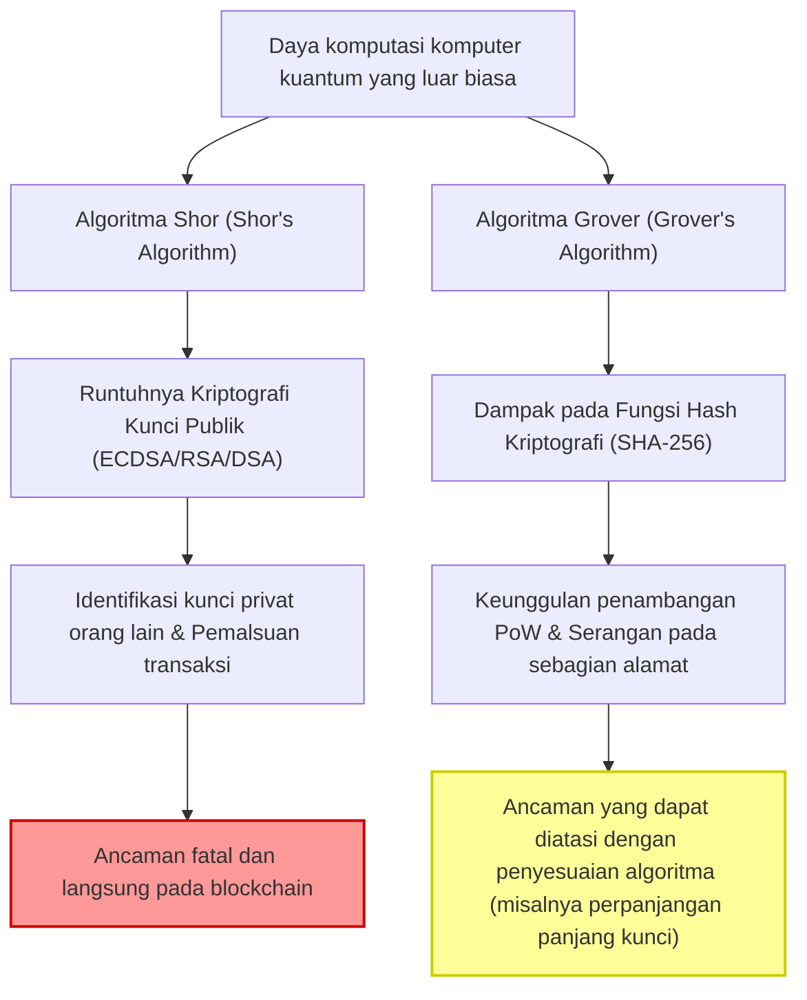
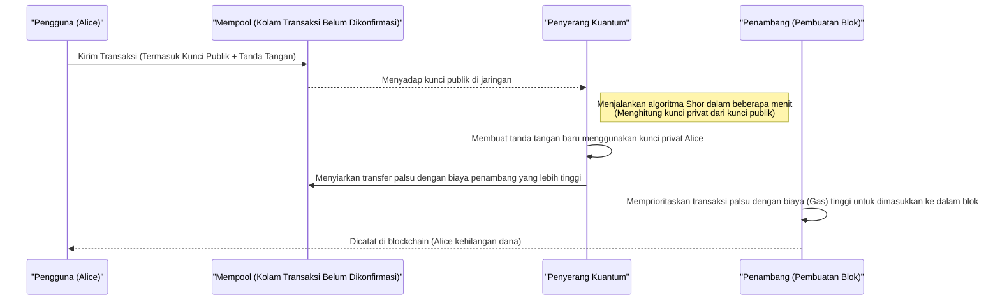
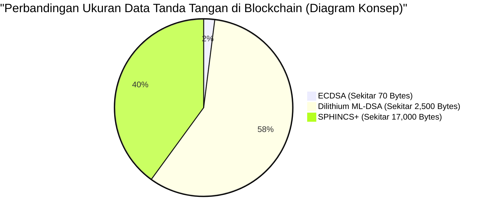

## 1. Pendahuluan: Langkah Era Pasca-Kuantum dan Krisis Blockchain

Sejak Bitcoin diciptakan oleh Satoshi Nakamoto pada tahun 2009, teknologi blockchain telah berkembang menjadi fondasi sistem keuangan dan aplikasi di seluruh dunia sebagai "buku besar yang terdesentralisasi dan tidak dapat diubah". Keamanan yang kuat ini didukung oleh teknologi kriptografi modern yaitu **Kriptografi Kunci Publik (Public Key Cryptography)** dan **Fungsi Hash Kriptografi (Cryptographic Hash Functions)**.

Teknologi kriptografi ini menjamin keamanan berdasarkan "kesulitan komputasi" matematis, di mana komputer klasik (PC dan superkomputer yang kita gunakan saat ini) tidak akan dapat memecahkannya bahkan jika menghabiskan waktu selama umur alam semesta.

Namun, premis ini akan segera runtuh dari akarnya akibat perkembangan pesat dan komersialisasi **Komputer Kuantum (Quantum Computers)**, yang merupakan batas terdepan dari fisika dan ilmu informasi. Komputer kuantum, yang memanfaatkan "Superposisi (Superposition)" dan "Keterikatan Kuantum (Entanglement)" khusus untuk mekanika kuantum, menunjukkan daya komputasi yang mengalahkan komputer klasik konvensional dalam masalah matematika tertentu, yang disebut "Keunggulan Kuantum (Quantum Supremacy)".

Dalam artikel ini, kami akan menjelaskan secara mendalam dari perspektif teknis dan matematis tentang ancaman spesifik apa yang dihadapi teknologi blockchain dari komputer kuantum, serta tren terbaru dalam **Kriptografi Pasca-Kuantum (PQC: Post-Quantum Cryptography)** yang akan menjadi solusinya, dan skenario transisi untuk jaringan aset kripto.

---

## 2. Dasar-dasar Komputer Kuantum dan 2 Ancaman Utama terhadap Blockchain

Sistem blockchain saat ini pada dasarnya terdiri dari dua elemen kriptografi berikut, yang masing-masing terpapar pada ancaman berbeda oleh algoritma kuantum.

### 2.1. Dasar dan Kesulitan Komputasi Kriptografi Kurva Eliptik (ECDSA)

Banyak blockchain, termasuk Bitcoin dan Ethereum, menggunakan **Algoritma Tanda Tangan Digital Kurva Eliptik (ECDSA: Elliptic Curve Digital Signature Algorithm)** sebagai algoritma tanda tangan digital. Secara khusus, Bitcoin menggunakan kurva eliptik dengan parameter `secp256k1`.

Keamanan kriptografi kurva eliptik bergantung pada kesulitan komputasi dari **Masalah Logaritma Diskrit Kurva Eliptik (ECDLP: Elliptic Curve Discrete Logarithm Problem)**.
Kurva eliptik didefinisikan oleh persamaan dalam bentuk standar Weierstrass berikut.

$$
y^2 \equiv x^3 + ax + b \pmod{p}
$$

Pada `secp256k1` Bitcoin, $a = 0, b = 7$, dan $p$ adalah bilangan prima yang sangat besar.
Misalkan titik dasar (base point) pada kurva ini adalah $G$, dan kunci privat adalah bilangan bulat raksasa 256-bit yang dipilih secara acak $k$. Pada saat ini, kunci publik $K$ diperoleh dengan menambahkan titik dasar sebanyak $k$ kali (perkalian skalar).

$$
K = k \times G = \underbrace{G + G + \dots + G}_{k \text{ times}}
$$

Menghitung mundur (mencari logaritma diskrit) kunci privat $k$ dari kunci publik yang dipublikasikan $K$ dan titik dasar $G$ menggunakan komputer klasik akan memakan waktu komputasi eksponensial $\mathcal{O}(\sqrt{p})$ bahkan menggunakan algoritma klasik terbaik seperti metode faktorisasi rho Pollard. Untuk kunci 256-bit, diperlukan sekitar $2^{128}$ operasi, yang merupakan tingkat yang tidak dapat dipecahkan bahkan jika superkomputer saat ini dioperasikan selama miliaran tahun.

### 2.2. Keruntuhan oleh Algoritma Shor (Shor's Algorithm)

Namun, **Algoritma Shor** yang diumumkan oleh Peter Shor pada tahun 1994, menghancurkan premis ini sepenuhnya. Algoritma Shor pada awalnya diusulkan untuk memecahkan masalah faktorisasi prima (dasar kriptografi RSA) dalam waktu polinomial, tetapi algoritma ini juga dapat diterapkan pada masalah logaritma diskrit dan masalah logaritma diskrit kurva eliptik.

Inti dari Algoritma Shor terletak pada penggunaan **Transformasi Fourier Kuantum (QFT: Quantum Fourier Transform)** untuk menemukan "Periode (Period)" dari suatu fungsi dengan kecepatan tinggi.

$$
\text{Kompleksitas komputasi klasik} = \mathcal{O}(2^{n/2}) \quad (n\text{ adalah panjang bit})
$$
$$
\text{Kompleksitas algoritma kuantum} = \mathcal{O}(n^3)
$$

Dengan cara ini, Algoritma Shor secara dramatis mempersingkat waktu eksponensial menjadi **Waktu Polinomial (Polynomial Time)**. Setelah komputer kuantum dengan qubit logis yang memadai selesai dibangun, akan memungkinkan untuk mengidentifikasi kunci privat $k$ dalam beberapa menit atau detik dari kunci publik $K$ yang dipublikasikan di jaringan. Akibatnya, penyerang dapat dengan mudah mendapatkan kunci privat dompet orang lain dan sepenuhnya mengendalikan dana mereka.

#### 2.2.1 Langkah-demi-Langkah Pemecahan ECDLP oleh Algoritma Shor

Mari kita ikuti langkah demi langkah bagaimana komputer kuantum memecahkan Masalah Logaritma Diskrit Kurva Eliptik (ECDLP).

Pengaturan masalah: Dalam $K = k \times G$, $G$ dan $K$ diketahui, dan kita ingin mencari bilangan bulat $k$ (kunci privat) yang tidak diketahui. Misalkan orde dari kurva eliptik adalah $N$.

**Langkah 1: Membuat Status Superposisi**
Pertama, siapkan dua register kuantum dan terapkan Gerbang Hadamard (Hadamard Gate) pada masing-masingnya untuk membuat status superposisi dari semua kombinasi bilangan bulat yang mungkin.
$$
|\psi_1\rangle = \frac{1}{N} \sum_{x=0}^{N-1} \sum_{y=0}^{N-1} |x\rangle |y\rangle |0\rangle
$$

**Langkah 2: Menerapkan Oracle Kuantum (Evaluasi Fungsi)**
Selanjutnya, dengan menggunakan sirkuit kuantum (oracle) yang melakukan penambahan titik pada kurva eliptik, hitung fungsi $f(x, y) = x \times G + y \times K$ ke dalam register ketiga.
$$
|\psi_2\rangle = \frac{1}{N} \sum_{x=0}^{N-1} \sum_{y=0}^{N-1} |x\rangle |y\rangle |x \times G + y \times K\rangle
$$
Hal penting di sini adalah, karena $K = k \times G$, maka dapat ditulis ulang sebagai $f(x, y) = (x + y \cdot k) \times G$.

**Langkah 3: Pengukuran Register Ketiga**
Ketika mengukur register ketiga, status akan menyusut ke titik $R$ pada suatu kurva eliptik tertentu. Akibatnya, register pertama dan kedua menyusut ke status superposisi dari pasangan $(x, y)$ yang memenuhi $x + y \cdot k \equiv c \pmod{N}$ ($c$ adalah konstanta).
$$
|\psi_3\rangle = \frac{1}{\sqrt{N}} \sum_{y=0}^{N-1} |c - y \cdot k \pmod{N}\rangle |y\rangle
$$

**Langkah 4: Menerapkan Transformasi Fourier Kuantum (QFT)**
Status ini memiliki periodisitas yang berkaitan dengan periode $k$. Dengan menerapkan Transformasi Fourier Kuantum Invers (Inverse QFT) pada titik ini, hal itu menyebabkan interferensi fase dan mengubah informasi periode menjadi amplitudo.

**Langkah 5: Pengukuran dan Pasca-pemrosesan Klasik**
Ketika mengukur register pertama dan kedua, dengan probabilitas tinggi akan diperoleh nilai yang berisi informasi tentang $k$. Dengan menerapkan algoritma teori bilangan klasik seperti Ekspansi Fraksi Berlanjut (Continued Fractions) pada nilai yang diukur, kunci privat $k$ yang tidak diketahui dapat diidentifikasi sepenuhnya.

Jumlah gerbang kuantum yang diperlukan dalam seluruh proses ini adalah $\mathcal{O}(\log^3 N)$, yang akan mengungkapkan kunci privat dengan kecepatan super tinggi yang tidak sebanding dengan pencarian $\mathcal{O}(\sqrt{N})$ oleh komputer klasik.

### 2.3. Algoritma Grover (Grover's Algorithm) dan Dampak pada Fungsi Hash

Ancaman lainnya adalah **Algoritma Grover**, yang diusulkan oleh Lov Grover pada tahun 1996. Ini berdampak besar pada fungsi hash (misalnya SHA-256).

Dalam blockchain, fungsi hash digunakan untuk memastikan integritas data, menghasilkan alamat, dan sebagai dasar penambangan **PoW (Proof of Work)** pada Bitcoin. Perhitungan mundur dari fungsi hash (komputasi pracitra) dapat dianggap sebagai "masalah pencarian basis data tidak terstruktur" untuk menemukan nilai input $x$ sehingga $H(x) = y$ untuk nilai output tertentu $y$.

Dalam komputer klasik, diperlukan rata-rata $\frac{N}{2}$ percobaan, dan paling banyak $N$ percobaan, untuk menemukan jawaban yang benar dari $N$ kemungkinan. Artinya, kompleksitas komputasi adalah $\mathcal{O}(N)$.
Namun, algoritma Grover menggunakan teknologi kuantum yang disebut "Amplifikasi Amplitudo (Amplitude Amplification)". Dengan memperkuat amplitudo probabilitas status yang menjadi jawaban yang benar secara iteratif dari semua kemungkinan dalam status superposisi, waktu pencarian dipersingkat menjadi akar kuadrat.

$$
\text{Kompleksitas Algoritma Grover} = \mathcal{O}(\sqrt{N})
$$

Dalam kasus SHA-256, karena $N = 2^{256}$, pencarian brute-force klasik membutuhkan sekitar $2^{256}$ percobaan. Namun, dengan algoritma Grover, hanya diperlukan $\sqrt{2^{256}} = 2^{128}$ percobaan. Ini berarti fungsi hash 256-bit akan dibelah dua menjadi **kekuatan keamanan yang efektif sebesar 128-bit** terhadap komputer kuantum.

#### 2.3.1. Akankah SHA-256 Bertahan? (Quantum Supremacy in Hashing)

Bahkan jika keamanannya dibelah dua, "keamanan 128-bit" masih sangat kuat. Sebanyak $2^{128}$ operasi merupakan angka astronomis bahkan dari tingkat teknologi saat ini dan membutuhkan skala waktu setara umur alam semesta.
Oleh karena itu, secara luas diyakini bahwa **"SHA-256 akan mempertahankan keamanan praktisnya bahkan terhadap komputer kuantum"**. Jika diperlukan untuk meningkatkan margin keamanan di masa depan, kita cukup menggandakan panjang keluaran hash (misalnya transisi dari SHA-256 ke SHA-512) untuk mempertahankan keamanan klasik 256-bit di dunia kuantum.

Kesimpulannya, ancaman kuantum terhadap fungsi hash "ringan dan dapat diatasi", sedangkan ancaman terhadap kriptografi kunci publik (ECDSA) adalah "fatal".

---

## 3. Analisis Dampak Spesifik pada Aset Kripto Saat Ini (Bitcoin, Ethereum)

Di dunia di mana komputer kuantum dapat memecahkan ECDSA, kerentanan spesifik apa yang akan dihadapi oleh jaringan aset kripto? Di sini, dengan menggunakan mekanisme Bitcoin sebagai contoh, kita akan melakukan analisis terperinci dari perspektif **"waktu pemaparan kunci publik"**.

### 3.1. Pembuatan Alamat dan Sifat "Tertutup" dari Kunci Publik

Alamat Bitcoin (seperti P2PKH: Pay-to-Public-Key-Hash atau P2WPKH: Pay-to-Witness-Public-Key-Hash) tidak menggunakan kunci publik itu sendiri, melainkan hash dari kunci publik yang diproses beberapa kali.

$$
\text{Bitcoin Address} = \text{Base58Check}(\text{RIPEMD160}(\text{SHA256}(\text{Public Key})))
$$

Seperti disebutkan di atas, karena fungsi hash tahan terhadap serangan kuantum (Algoritma Grover), komputer kuantum tidak dapat menghitung mundur "kunci publik" asli dari "alamat" yang merupakan nilai hash.
Artinya, untuk **"alamat yang belum digunakan (alamat yang belum pernah mengirim dana sekalipun)"**, kunci publik sama sekali tidak diekspos di blockchain, dan hanya nilai hash yang dicatat. Oleh karena itu, selama kunci publik tidak diketahui, tidak ada target untuk menjalankan algoritma Shor, dan kunci privat tidak dapat diidentifikasi. Dompet dalam status ini dapat dikatakan aman secara kuantum (Quantum-safe).

### 3.2. Kerentanan Fatal saat Mengirim Transaksi (Serangan Front-running)

Masalah muncul ketika pengguna mengirim dana.
Saat menyiarkan (mengirim) transaksi ke jaringan, pengguna harus menyertakan **kunci publik mereka sendiri dalam data transaksi dan mempublikasikannya ke seluruh jaringan** bersama dengan tanda tangan digital untuk keperluan verifikasi.

Setelah kunci publik dikirim ke Mempool (tempat tunggu untuk transaksi yang belum dikonfirmasi), data tersebut dibagikan dengan node di seluruh dunia. Jika penyerang memiliki komputer kuantum super cepat, mereka dapat mencuri dana dengan proses berikut.

1. Menyadap transaksi pengguna yang sah (Alice) dari Mempool, dan **mengekstrak kunci publik**.
2. Menjalankan algoritma Shor, dan **menghitung kunci privat dari kunci publik dalam beberapa menit (sebelum blok dikonfirmasi)**.
3. Menggunakan kunci privat yang diperoleh untuk **membuat transaksi palsu** yang mengirimkan dana Alice ke alamat penyerang.
4. Menyiarkan transaksi palsu ini ke jaringan dengan **menetapkan biaya penambang (Fee) yang jauh lebih tinggi** daripada transaksi asli Alice.

Penambang, mengikuti insentif ekonomi, memprioritaskan transaksi dengan biaya tinggi untuk dimasukkan ke dalam blok. Akibatnya, transfer palsu penyerang disetujui (Confirm) lebih dulu, dan transfer sah Alice dibuang sebagai "Dana Tidak Cukup (Double Spend)".
Rangkaian aliran ini disebut **Serangan Front-running (Front-running Attack)**, dan di dunia di mana komputer kuantum direalisasikan, akan menyebabkan situasi mengerikan di mana dana dicuri oleh peretas pada saat seseorang menekan tombol kirim.

### 3.3. Krisis Alamat Penggunaan Ulang dan Alamat Lama (P2PK)

Masalah yang lebih serius adalah alamat yang pernah digunakan untuk mengirim dana sekali saja di masa lalu (misalnya jika digunakan kembali sebagai alamat kembalian) memiliki kunci publik yang telah dicatat secara permanen di blockchain. Alamat-alamat ini selalu berisiko kehilangan saldonya dengan kunci privat yang dihitung tanpa harus menunggu transaksi dikirim.

Selain itu, hadiah penambangan awal Satoshi Nakamoto (lebih dari 1 juta BTC), format yang lazim dari tahun 2009 hingga 2010 yaitu **P2PK (Pay-to-Public-Key)**, mencatat kunci publik secara langsung ke dalam blockchain, bukan sebagai hash. Bitcoin dorman dalam jumlah besar ini akan menjadi target paling mudah bagi komputer kuantum, dan berpotensi memicu keruntuhan harga besar-besaran karena dicuri sekaligus dan di-dump di pasar.

---

## 4. Skenario Transisi ke Kriptografi Pasca-Kuantum (PQC)

Untuk menghindari bencana "Q-Day (Hari di mana komputer kuantum menembus kriptografi)", komunitas kriptografi dan blockchain merencanakan transisi ke **Kriptografi Pasca-Kuantum (PQC)** yang sulit dipecahkan bahkan oleh algoritma kuantum.
Institut Standar dan Teknologi Nasional AS (NIST) telah melakukan proses standardisasi PQC selama bertahun-tahun, dan setelah melalui evaluasi ketat yang berurutan, beberapa metode kriptografi yang menjanjikan dipilih sebagai standar final.

Kami akan menjelaskan secara terperinci algoritma PQC utama yang menarik perhatian sebagai alternatif tanda tangan digital blockchain, beserta mekanisme matematisnya.

### 4.1. Tanda Tangan Berbasis Hash (Hash-Based Signatures)

Tanda tangan berbasis hash adalah metode kriptografi yang keamanannya hanya bergantung pada dasar yang sangat sederhana dan kuat: "ketahanan benturan dari fungsi hash". Karena keamanan fungsi hash terhadap komputer kuantum telah terbukti (seperti disebutkan di atas, margin keamanan 128-bit sudah cukup), ini adalah pendekatan yang sangat andal.
Contoh yang menonjol adalah **Tanda Tangan Lamport (Lamport Signatures)**, atau ekstensinya WOTS (Winternitz One-Time Signature), dan kandidat standardisasi NIST **SPHINCS+** (saat ini distandardisasi sebagai FIPS 205 dan disebut SLH-DSA).

#### 4.1.1. Detail Matematis Tanda Tangan Lamport (One-Time Signature)

Mari kita perhatikan mekanisme Tanda Tangan Lamport secara lebih terperinci secara matematis.
Misalkan fungsi hash $H: \{0, 1\}^* \to \{0, 1\}^{256}$.

**【Pembuatan Kunci】**
Alice (pengirim) menggunakan Generator Angka Acak Sejati (TRNG) untuk menghasilkan 256 pasang pasangan kunci privat.
$$
\text{sk}_{i,0} \in \{0, 1\}^{256}, \quad \text{sk}_{i,1} \in \{0, 1\}^{256} \quad (1 \le i \le 256)
$$
Akibatnya, kunci privat $\text{sk}$ terdiri dari total 512 string 256-bit (ukuran: $512 \times 32 = 16.384$ byte).

Selanjutnya, hitung kunci publik $\text{pk}$. Hash-kan setiap komponen kunci privat satu per satu.
$$
\text{pk}_{i,0} = H(\text{sk}_{i,0}), \quad \text{pk}_{i,1} = H(\text{sk}_{i,1})
$$
Kunci publik juga akan berukuran $16.384$ byte. Publikasikan ini ke jaringan blockchain.

**【Pembuatan Tanda Tangan】**
Untuk menandatangani data transaksi $M$, Alice pertama-tama menghitung nilai hash-nya.
$$
h = H(M) \in \{0, 1\}^{256}
$$
Misalkan bit ke-$i$ dari nilai hash $h$ adalah $h_i \in \{0, 1\}$.
Tanda tangan Alice $\sigma$ akan menjadi kumpulan komponen kunci privat yang sesuai dengan setiap bit $h_i$.
$$
\sigma = (\text{sk}_{1, h_1}, \text{sk}_{2, h_2}, \dots, \text{sk}_{256, h_{256}})
$$
Dengan kata lain, jika bit hash pesan adalah `0`, ekspos $\text{sk}_{i,0}$, dan jika `1`, ekspos $\text{sk}_{i,1}$. Ukuran tanda tangan akan menjadi $256 \times 32 = 8.192$ byte.

**【Verifikasi Tanda Tangan】**
Penambang (pemverifikasi) memverifikasi menggunakan transaksi yang diterima $M$, tanda tangan $\sigma = (s_1, s_2, \dots, s_{256})$, dan kunci publik $\text{pk}$.
Hitung ulang hash transaksi $h = H(M)$, dan pastikan apakah setiap nilai hash dari $s_i$ cocok dengan elemen kunci publik yang sesuai $\text{pk}_{i, h_i}$.
$$
H(s_i) \overset{?}{=} \text{pk}_{i, h_i} \quad (\text{untuk semua } 1 \le i \le 256)
$$

Proses ini sangat sederhana secara matematis, dan tidak mungkin untuk memalsukan tanda tangan kecuali jika komputer kuantum dapat menghitung mundur $H$. Namun, karena setengah dari kunci privat diekspos ke jaringan setelah ditandatangani, terdapat kendala kuat bahwa ini hanya dapat digunakan "satu kali (One-Time)", karena menandatangani pesan lain dengan pasangan kunci yang sama akan menggabungkan kunci privat yang terekspos dan memberikan ruang bagi penyerang untuk melakukan pemalsuan.
Untuk membuatnya praktis, teknologi seperti **XMSS**, yang menggunakan Merkle Tree untuk mengelompokkan sejumlah besar kunci sekali pakai ke dalam satu kunci publik root, dan **SPHINCS+** yang stateless, telah dikembangkan, tetapi mereka memiliki kelemahan ukuran tanda tangan mencapai puluhan kilobyte.

### 4.2. Kriptografi Berbasis Kisi (Lattice-Based Cryptography)

Saat ini, yang paling diharapkan sebagai arus utama PQC dan diadopsi sebagai standar utama NIST (FIPS 204: ML-DSA / sebelumnya CRYSTALS-Dilithium, Falcon, dll.) adalah **Kriptografi Kisi**.

Keamanan kriptografi kisi bergantung pada masalah yang terbukti secara matematis sulit seperti "Masalah Vektor Terpendek dalam kisi multidimensi (SVP: Shortest Vector Problem)" dan "Pembelajaran dengan Masalah Galat (LWE: Learning With Errors)". Tidak ada algoritma yang ditemukan yang dapat memecahkan masalah kisi secara efisien bahkan menggunakan komputer kuantum.

**Model Matematis LWE (Learning With Errors):**
Gagasan dasar masalah LWE adalah untuk membuat masalah menjadi lebih sulit secara dramatis dengan secara sengaja menambahkan "noise (galat) kecil" ke dalam sistem persamaan linear.
Misalkan vektor rahasia adalah $\mathbf{s} \in \mathbb{Z}_q^n$.
Ada matriks publik raksasa yang dipilih secara acak $\mathbf{A} \in \mathbb{Z}_q^{m \times n}$, dan vektor noise kecil yang sengaja ditambahkan $\mathbf{e} \in \mathbb{Z}_q^m$.
Kunci publik $\mathbf{b}$ dihitung sebagai berikut.

$$
\mathbf{b} = \mathbf{A}\mathbf{s} + \mathbf{e} \pmod{q}
$$

Meskipun matriks $\mathbf{A}$ dan vektor $\mathbf{b}$ (kunci publik) dipublikasikan, sangat sulit untuk menghitung mundur kunci privat $\mathbf{s}$ dari sana karena adanya noise $\mathbf{e}$. Tanpa noise, itu bisa diselesaikan dengan eliminasi Gauss sederhana, tetapi dengan noise, ruang pencarian meledak di semua dimensi, memberikan keamanan yang kuat baik terhadap komputer klasik maupun kuantum.
Dalam algoritma yang sebenarnya digunakan di blockchain dan sejenisnya (seperti Dilithium), ini diperluas pada cincin polinomial menggunakan **Ring-LWE (atau Module-LWE)**, yang mengurangi ukuran kunci dan mempercepat komputasi.

* **Kelebihan**: Dibandingkan dengan tanda tangan berbasis hash, ukuran kunci publik dan tanda tangan relatif kecil (sekitar beberapa kilobyte), dan kecepatan perhitungan pembuatan dan verifikasi tanda tangan sangat cepat (setara atau lebih cepat dari ECDSA).
* **Kekurangan**: Struktur matematisnya kompleks, dan karena periode verifikasi historisnya pendek, risiko ditemukannya algoritma dekripsi baru di masa depan bukanlah nol.

---

## 5. Tantangan Teknis Transisi PQC di Blockchain

Fakta bahwa algoritma PQC (seperti Dilithium dan SPHINCS+) ada tidak berarti bahwa mereka dapat segera diterapkan ke Bitcoin atau Ethereum. Terdapat beberapa tantangan berat yang khusus untuk sistem terdesentralisasi.

### 5.1. Peningkatan Ukuran Tanda Tangan dan Keruntuhan Skalabilitas

Hambatan terbesar dalam mengadopsi PQC adalah peningkatan ukuran data yang signifikan.
Sementara ukuran tanda tangan ECDSA saat ini sekitar 70 byte, ukuran tanda tangan untuk ML-DSA (Dilithium) kriptografi kisi adalah sekitar 2.420 byte hingga 4.595 byte (tergantung pada tingkat keamanan), dan ukuran kunci publik melebihi 1.300 byte. Untuk SPHINCS+ berbasis hash, ukuran tanda tangan mencapai puluhan ribu byte.

Jika Bitcoin mengadopsi PQC sambil mempertahankan batas ukuran blok saat ini (berat sekitar 4MB termasuk SegWit), jumlah transaksi yang dapat ditampung dalam satu blok akan menurun drastis. Throughput jaringan (TPS: Transactions Per Second) akan turun secara tak terhindarkan, dan kemacetan transfer akan menjadi normal.
Untuk mengatasi ini, batas ukuran blok perlu ditingkatkan secara signifikan, namun ini akan meningkatkan persyaratan penyimpanan dan bandwidth jaringan node penuh, membuat operasi node oleh individu menjadi sulit, yang pada akhirnya mengarah pada dilema **sentralisasi jaringan**.

*(※ Peningkatan ukuran data transaksi karena pengenalan PQC akan menjadi hambatan fatal bagi skalabilitas)*

### 5.2. Dampak pada Ethereum Virtual Machine (EVM) dan Precompiled Contracts

Di platform kontrak pintar Turing-complete seperti Ethereum, adopsi PQC membutuhkan peningkatan fundamental pada EVM (Ethereum Virtual Machine).
Saat ini EVM menyediakan kontrak pra-kompilasi (Precompiled Contract) yang disebut `ecrecover` (alamat: `0x01`) untuk memverifikasi tanda tangan ECDSA, yang dioptimalkan untuk memverifikasi tanda tangan dengan biaya gas yang sangat rendah (3000 Gas).

Namun, proses verifikasi algoritma kriptografi kisi baru seperti Dilithium dan Falcon melibatkan operasi polinomial kompleks dan operasi matriks, dan jika diimplementasikan menggunakan opcode (Opcode) EVM yang ada, memverifikasi satu tanda tangan saja dapat memakan biaya jutaan hingga puluhan juta gas. Ini merupakan tingkat yang dapat menghabiskan batas gas blok (sekitar 30 juta Gas) saat ini dalam satu transaksi.

Untuk menghindari ini, diperlukan untuk mengintegrasikan kontrak pra-kompilasi baru (Precompiled Contract) untuk verifikasi PQC (misalnya, menugaskan `0x10` untuk DilithiumVerify) ke dalam EVM itu sendiri melalui pembaruan sistem yang besar pada jaringan (Hard Fork). Hal ini membutuhkan pengembang inti masing-masing klien Ethereum (Geth, Nethermind, Erigon, dll.) untuk bekerja sama dalam mengoptimalkan logika verifikasi kriptografi kisi di tingkat bahasa pemrograman seperti C++, Go, atau Rust, dan melakukan audit keamanan, yang merupakan proses yang akan memakan waktu bertahun-tahun.

### 5.3. Kesulitan Membangun Konsensus melalui Hard Fork

Untuk mengubah algoritma tanda tangan yang mendasarinya, **Hard Fork**, yang memperbarui protokol di seluruh jaringan, sangat penting. Namun, dalam komunitas seperti Bitcoin yang berfokus pada "tidak mengubah aturan dan tetap terdesentralisasi", proses membangun konsensus sangat sulit dari sudut pandang politik. Mulai dari mengajukan BIP (Bitcoin Improvement Proposal) mengenai transisi PQC hingga diimplementasikan, kemungkinan akan memakan waktu perdebatan dan pengujian bertahun-tahun.

---

## 6. Kapan "Q-Day" akan Tiba? Peta Jalan menuju Transisi

Kapan akan tiba hari di mana "komputer kuantum sepenuhnya memecahkan kriptografi kurva eliptik 256-bit (Q-Day)"?
Pendapat para ahli terbagi, namun sebagian besar memprediksi kemunculan komputer kuantum berskala besar yang memiliki setidaknya beberapa ribu hingga puluhan ribu qubit logis stabil (qubit toleran noise dan dikoreksi galat) pada **"pertengahan 2030-an hingga 2040-an"**. Namun, waktu ini tidak dapat disangkal bisa lebih awal (sekitar 2030) tergantung pada terobosan dalam arsitektur perangkat keras atau penemuan algoritma kuantum yang lebih efisien.

Berikut adalah peta jalan yang harus diambil ekosistem aset kripto sebelum terlambat.

### Fase 1: Tanda Tangan Hibrida dan Abstraksi Akun (Sekarang hingga sekitar 2028)
Kalangan blockchain saat ini, terutama tim pengembangan Ethereum (seperti Vitalik Buterin), sedang mempertimbangkan **"Tanda Tangan Hibrida"** yang menggabungkan ECDSA dan PQC (tanda tangan berbasis hash atau kriptografi kisi). Pendekatan ini menyertakan tanda tangan ECDSA yang aman saat ini bersama dengan tanda tangan PQC ke dalam transaksi, sehingga jika salah satu ditembus, keamanan masih tetap terjaga.
Selain itu, melalui pemanfaatan abstraksi akun (Account Abstraction, ERC-4337), ada upaya untuk mengimplementasikan dan mendukung tanda tangan PQC secara opsional (bagi pengguna yang menginginkannya saja) di atas dompet kontrak pintar, tanpa harus menunggu hard fork tingkat protokol.

### Fase 2: Pemanfaatan Zero-Knowledge Proofs (ZK-Rollups) (Dari 2025 dan seterusnya)
Sebagai kartu truf untuk menyelesaikan "peningkatan ukuran tanda tangan", yang merupakan kelemahan terbesar PQC, harapan diletakkan pada penggunaan **ZK-Rollups (Zero-Knowledge Proofs)** yang merupakan teknologi layer 2.
Daripada menulis data tanda tangan PQC berukuran sangat besar langsung ke Layer 1 (rantai utama), banyak transaksi PQC diverifikasi dan diagregasikan di atas Layer 2. Kemudian, mereka dikompresi menjadi sebuah "data bukti (Proof)" yang sangat kecil menggunakan ZK-SNARKs atau ZK-STARKs untuk direkam di Layer 1.
Perlu dicatat, karena beberapa konfigurasi SNARKs (seperti Groth16) rentan secara kuantum, penerapan **ZK-STARKs** yang hanya bergantung pada fungsi hash tahan kuantum akan menjadi kunci.

### Fase 3: Hard Fork Tingkat Protokol (Sekitar 2030)
Setelah standardisasi NIST untuk PQC sepenuhnya mapan, dan standar industri dirilis dan diuji secara memadai, diharapkan bahwa blockchain utama seperti Bitcoin dan Ethereum akan melakukan hard fork yang sepenuhnya mentransisikan metode tanda tangan default ke PQC. Selama masa transisi ini, akan ada pengumuman besar-besaran kepada pengguna yang mendesak mereka untuk "memindahkan dana dari dompet lama ke dompet baru yang mendukung PQC".

### Studi Kasus Proyek Perintis

Beberapa proyek blockchain telah mengantisipasi ancaman kuantum ini, dan dikembangkan sejak tahap awal dengan mempromosikan ketahanan kuantum.
* **QRL (Quantum Resistant Ledger)**: Sebuah blockchain tahap awal yang mengimplementasikan PQC berbasis hash, XMSS (Skema Tanda Tangan Merkle yang Diperluas) secara natif pada tingkat protokol.
* **Algorand / Cellframe**: Proyek-proyek ini memiliki arsitektur modular dari lapisan kriptografi yang fleksibel untuk mengantisipasi pembaruan PQC di masa depan, secara proaktif mengeksplorasi integrasi kriptografi kisi.

---

## 7. Kesimpulan: Masa Depan Aset Kripto dan Perlindungan Aset Kita

Ketibaan "Era Pasca-Kuantum" bukan lagi sekadar khayalan fiksi ilmiah, melainkan sudah berada tepat di hadapan kita sebagai tantangan teknis nyata terhadap sistem kriptografi saat ini.

Dua pedang komputer kuantum, algoritma Shor dan algoritma Grover, secara berurutan mengancam kriptografi kunci publik dan fungsi hash yang menjadi fondasi blockchain saat ini. Khususnya, kerentanan ECDSA berakibat fatal, dan transisi ke kriptografi tahan kuantum (PQC) adalah rute yang mutlak tak terhindarkan untuk mencegah risiko pencurian dana dari serangan front-running.

Namun, dunia teknologi dan komunitas blockchain tidak hanya duduk diam menunggu kehancuran. Pemilihan dan standardisasi algoritma PQC seperti kriptografi kisi dan tanda tangan berbasis hash terus berkembang dengan stabil, dan melalui penggunaan zero-knowledge proofs (ZK-STARKs) serta teknologi penskalaan Layer 2, kita mulai melihat jalan keluar untuk mengatasi "peningkatan ukuran data" yang merupakan hambatan terbesar adopsi PQC.

Tidak perlu bagi kita pengguna dan investor aset kripto pada umumnya untuk panik saat ini dan menjual seluruh dana. Akan tetapi, sangat penting untuk memiliki literasi mendasar dan kesadaran pertahanan diri sebagai berikut.

* **Hindari menggunakan ulang alamat**: Untuk menegakkan keamanan, bukan hanya privasi, disarankan untuk tidak menyimpan dana dalam jangka waktu lama di "alamat yang telah digunakan (alamat yang pernah digunakan untuk mengirim dana sekali saja, sehingga kunci publiknya terpapar di blockchain)".
* **Mengamati tren teknologi**: Terus awasi diskusi tentang transisi PQC di jaringan utama seperti BIP Bitcoin atau EIP Ethereum, serta berita mengenai hard fork, agar Anda dapat melakukan operasi migrasi dompet pada waktu yang diperlukan dengan benar.

Sejarah blockchain adalah sejarah berkelanjutan antara ketahanan (resiliensi) dan pembaruan sistem dalam menghadapi ancaman teknis baru. Sama seperti mereka yang mengatasi masalah skalabilitas dan isu lingkungan (seperti transisi dari PoW ke PoS), seluruh ekosistem kemungkinan besar akan mencari solusi dan beradaptasi terhadap ancaman kuantum yang belum pernah terjadi ini.
Kita dapat berharap pada masa depan di mana komputer kuantum sebagai kearifan baru umat manusia dan teknologi tepercaya berupa buku besar terdesentralisasi, bukan bertabrakan dan hancur, namun menyatu menjadi sistem kuat di dimensi yang lebih tinggi.

---
*Referensi & Tautan Terkait:*
* National Institute of Standards and Technology (NIST) - Post-Quantum Cryptography Standardization Project
* Shor, P. W. (1994). Algorithms for quantum computation: discrete logarithms and factoring.
* Grover, L. K. (1996). A fast quantum mechanical algorithm for database search.
* Buterin, V. (2024). How to hard-fork to save most users' funds in a quantum emergency.
