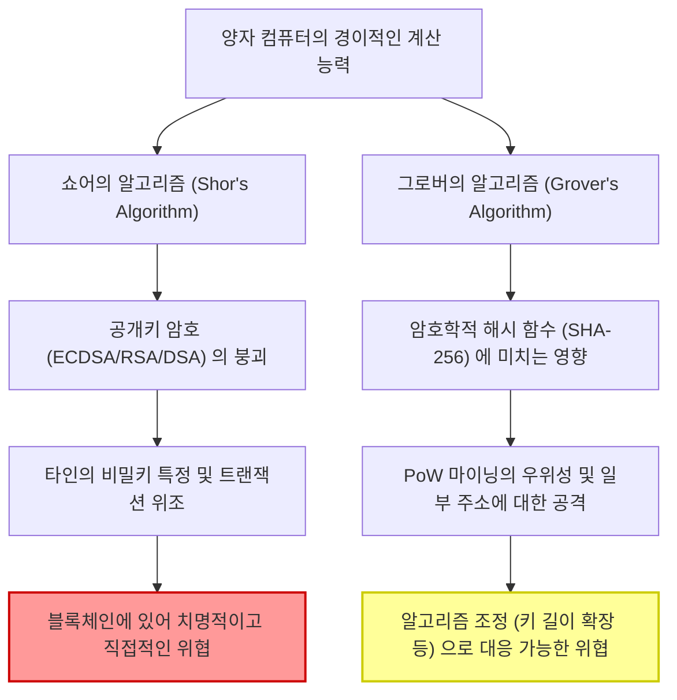
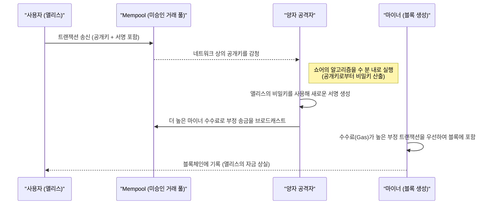
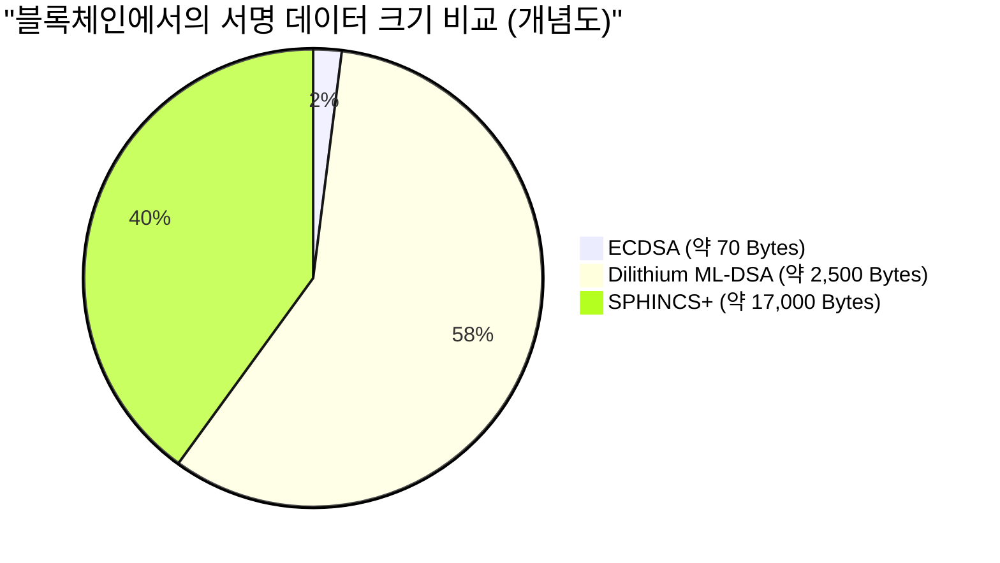

## 1. 인트로덕션: 포스트 양자 시대의 발소리와 블록체인의 위기

2009년 사토시 나카모트에 의해 비트코인(Bitcoin)이 탄생한 이래, 블록체인 기술은 '탈중앙화되고 위변조가 불가능한 원장'으로서 전 세계 금융 시스템과 애플리케이션의 기반으로 성장했습니다. 이러한 견고한 보안을 지탱하고 있는 것이 **공개키 암호(Public Key Cryptography)**와 **암호학적 해시 함수(Cryptographic Hash Functions)**라는 현대 암호 기술입니다.

이러한 암호 기술은 고전적인 컴퓨터(현재 우리가 사용하고 있는 PC나 슈퍼컴퓨터)로는 우주의 수명만큼의 시간을 들여도 해독할 수 없다는 수학적인 '계산 곤란성(Computational Hardness)'을 근거로 안전성을 보장하고 있습니다.

하지만 이 전제는 물리학과 정보과학의 프론티어인 **양자 컴퓨터(Quantum Computers)**의 급속한 발전과 실용화로 인해 근본부터 뒤집히려 하고 있습니다. 양자역학 특유의 '중첩(Superposition)'이나 '양자 얽힘(Entanglement)'을 이용하는 양자 컴퓨터는 특정 수학적 문제에 있어 기존의 고전 컴퓨터를 압도하는 계산 능력, 이른바 '양자 초월성(Quantum Supremacy)'을 발휘합니다.

본 기사에서는 블록체인 기술이 양자 컴퓨터에 의해 구체적으로 어떤 위협에 직면해 있는지, 그리고 그 해결책이 될 **내양자 암호(PQC: Post-Quantum Cryptography)**의 최신 동향과 암호자산 네트워크의 전환 시나리오에 대해 기술적이고 수리적인 관점에서 철저하게 깊이 파고들어 해설합니다.

---

## 2. 양자 컴퓨터의 기초와 블록체인에 미치는 2가지 큰 위협

현재의 블록체인 시스템은 주로 다음 2가지 암호 요소로 구성되어 있으며, 이들은 각각 양자 알고리즘에 의한 서로 다른 위협에 노출되어 있습니다.

### 2.1. 타원곡선 암호(ECDSA)의 기초와 계산 곤란성

비트코인이나 이더리움(Ethereum)을 비롯한 많은 블록체인은 디지털 서명 알고리즘으로 **타원곡선 디지털 서명 알고리즘(ECDSA: Elliptic Curve Digital Signature Algorithm)**을 채택하고 있습니다. 구체적으로 비트코인은 `secp256k1`이라는 매개변수의 타원곡선을 사용합니다.

타원곡선 암호의 안전성은 **타원곡선 이산대수 문제(ECDLP: Elliptic Curve Discrete Logarithm Problem)**의 계산 곤란성에 의존하고 있습니다.
타원곡선은 아래의 바이어슈트라스(Weierstrass) 표준형으로 표현되는 방정식으로 정의됩니다.

$$
y^2 \equiv x^3 + ax + b \pmod{p}
$$

비트코인의 `secp256k1`에서는 $a = 0, b = 7$이며, $p$는 매우 큰 소수입니다.
이 곡선 상에 있는 베이스 포인트(기준점)를 $G$라 하고, 무작위로 선택된 256비트의 거대한 정수인 비밀키를 $k$라고 합니다. 이때, 공개키 $K$는 베이스 포인트의 $k$번 덧셈(스칼라 곱셈)을 통해 구해집니다.

$$
K = k \times G = \underbrace{G + G + \dots + G}_{k \text{ times}}
$$

고전 컴퓨터를 사용하여 공개된 공개키 $K$와 베이스 포인트 $G$로부터 비밀키 $k$를 역산(이산대수를 구함)하는 것은, 폴라드 로(Pollard's rho) 알고리즘과 같은 최선의 고전적 알고리즘을 사용하더라도 $\mathcal{O}(\sqrt{p})$의 지수함수적인 계산 시간이 걸립니다. 256비트 키의 경우 약 $2^{128}$번의 연산이 필요하며, 이는 현재의 슈퍼컴퓨터를 수십억 년 가동해도 풀 수 없는 수준입니다.

### 2.2. 쇼어의 알고리즘(Shor's Algorithm)에 의한 붕괴

하지만 1994년에 피터 쇼어가 발표한 **쇼어의 알고리즘**은 이 전제를 완전히 파괴했습니다. 쇼어의 알고리즘은 원래 소인수분해 문제(RSA 암호의 기반)를 다항식 시간에 풀기 위해 제안되었지만, 이산대수 문제나 타원곡선 이산대수 문제에도 적용 가능합니다.

쇼어 알고리즘의 핵심은 **양자 푸리에 변환(QFT: Quantum Fourier Transform)**을 사용하여 함수의 '주기(Period)'를 고속으로 찾아내는 데 있습니다.

$$
\text{고전적인 계산량} = \mathcal{O}(2^{n/2}) \quad (n\text{은 비트 길이})
$$
$$
\text{양자 알고리즘의 계산량} = \mathcal{O}(n^3)
$$

이처럼 쇼어의 알고리즘은 지수함수적인 시간을 **다항식 시간(Polynomial Time)**으로 극적으로 단축시킵니다. 충분한 논리적 양자 비트를 가진 양자 컴퓨터가 완성되면 네트워크 상에 공개된 공개키 $K$로부터 단 몇 분 또는 몇 초 만에 비밀키 $k$를 특정할 수 있게 됩니다. 이로 인해 공격자는 타인 지갑의 비밀키를 쉽게 입수하여 자금을 완전히 장악할 수 있게 됩니다.

#### 2.2.1 쇼어의 알고리즘에 의한 ECDLP 해독의 단계별 과정

양자 컴퓨터가 어떻게 타원곡선 이산대수 문제(ECDLP)를 푸는지, 그 내부 프로세스를 순서대로 살펴보겠습니다.

문제 설정: $K = k \times G$에서 $G$와 $K$를 알고 있으며, 미지의 정수 $k$(비밀키)를 구하고자 합니다. 타원곡선의 위수(order)를 $N$이라고 합니다.

**Step 1: 중첩 상태 생성**
먼저 2개의 양자 레지스터를 준비하고 각각에 아다마르 게이트(Hadamard Gate)를 적용하여 가능한 모든 정수 조합의 중첩 상태를 생성합니다.
$$
|\psi_1\rangle = \frac{1}{N} \sum_{x=0}^{N-1} \sum_{y=0}^{N-1} |x\rangle |y\rangle |0\rangle
$$

**Step 2: 양자 오라클 적용 (함수 평가)**
다음으로 타원곡선 상의 점 덧셈을 수행하는 양자 회로(오라클)를 사용하여 함수 $f(x, y) = x \times G + y \times K$를 제3 레지스터에 계산합니다.
$$
|\psi_2\rangle = \frac{1}{N} \sum_{x=0}^{N-1} \sum_{y=0}^{N-1} |x\rangle |y\rangle |x \times G + y \times K\rangle
$$
여기서 중요한 것은 $K = k \times G$이므로 $f(x, y) = (x + y \cdot k) \times G$로 다시 쓸 수 있다는 점입니다.

**Step 3: 제3 레지스터 측정**
제3 레지스터를 측정하면 어떤 타원곡선 상의 점 $R$로 수축(collapse)합니다. 이로 인해 제1, 제2 레지스터는 $x + y \cdot k \equiv c \pmod{N}$ ($c$는 상수)를 만족하는 $(x, y)$ 쌍의 중첩 상태로 수축합니다.
$$
|\psi_3\rangle = \frac{1}{\sqrt{N}} \sum_{y=0}^{N-1} |c - y \cdot k \pmod{N}\rangle |y\rangle
$$

**Step 4: 양자 푸리에 변환(QFT) 적용**
이 상태는 주기 $k$와 관련된 주기성을 가지고 있습니다. 여기에 역 양자 푸리에 변환(Inverse QFT)을 적용함으로써 위상의 간섭을 일으켜 주기 정보를 진폭으로 변환합니다.

**Step 5: 측정과 고전적 후처리**
제1, 제2 레지스터를 측정하면 높은 확률로 $k$에 관한 정보를 포함하는 값을 얻을 수 있습니다. 측정된 값에 대해 연분수 전개(Continued Fractions)와 같은 고전적인 정수론 알고리즘을 적용함으로써 미지의 비밀키 $k$를 완전히 특정할 수 있습니다.

이 전체 프로세스에서 필요로 하는 양자 게이트의 수는 $\mathcal{O}(\log^3 N)$이며, 고전 컴퓨터를 통한 $\mathcal{O}(\sqrt{N})$의 탐색과는 비교할 수 없을 정도의 초고속으로 비밀키를 파헤칩니다.

### 2.3. 그로버의 알고리즘(Grover's Algorithm)과 해시 함수에 미치는 영향

또 다른 위협은 1996년 로브 그로버(Lov Grover)가 제안한 **그로버의 알고리즘**입니다. 이는 해시 함수(예: SHA-256)에 큰 영향을 미칩니다.

블록체인에서 해시 함수는 데이터 무결성 보장, 주소 생성, 그리고 비트코인의 **PoW(Proof of Work) 마이닝** 기반으로 사용되고 있습니다. 해시 함수의 역산(원상 계산)은 특정 출력값 $y$에 대해 $H(x) = y$가 되는 입력값 $x$를 찾는 '비구조화 데이터베이스 탐색 문제'로 간주할 수 있습니다.

고전 컴퓨터에서는 $N$개의 가능성 중에서 정답을 찾기 위해 평균적으로 $\frac{N}{2}$번, 최악의 경우 $N$번의 시도가 필요합니다. 즉, 계산량은 $\mathcal{O}(N)$입니다.
하지만 그로버의 알고리즘은 '진폭 증폭(Amplitude Amplification)'이라 불리는 양자 기술을 사용합니다. 중첩 상태에 있는 모든 가능성 중에서 정답이 되는 상태의 확률 진폭을 반복적으로 증폭시킴으로써 탐색 시간을 제곱근으로 단축시킵니다.

$$
\text{그로버의 알고리즘의 계산량} = \mathcal{O}(\sqrt{N})
$$

SHA-256의 경우 $N = 2^{256}$이므로 고전적인 무차별 대입(Brute-force) 탐색으로는 약 $2^{256}$번의 시도가 필요합니다. 하지만 그로버의 알고리즘을 사용하면 $\sqrt{2^{256}} = 2^{128}$번의 시도만으로 충분하게 됩니다. 이는 256비트의 해시 함수가 양자 컴퓨터에 대해서는 **실질적으로 128비트의 보안 강도로 반감된다**는 것을 의미합니다.

#### 2.3.1. SHA-256은 살아남을 것인가? (Quantum Supremacy in Hashing)

보안이 절반으로 줄어든다고는 해도 '128비트의 보안'은 여전히 극도로 견고합니다. $2^{128}$번의 연산은 현재의 기술 수준에서 보아도 천문학적인 수치이며, 우주의 수명 스케일의 시간이 필요합니다.
따라서 **"SHA-256은 양자 컴퓨터에 대해서도 실용적인 안전성을 유지한다"**고 널리 여겨지고 있습니다. 향후 보안 여유도를 높일 필요가 있는 경우에는 단순히 해시의 출력 길이를 2배(예: SHA-256에서 SHA-512로의 전환)로 늘리는 것만으로 고전적인 256비트 보안을 양자 세계에서도 유지할 수 있습니다.

결론적으로 해시 함수에 대한 양자의 위협은 '경미하고 대응 가능'한 반면, 공개키 암호(ECDSA)에 대한 위협은 '치명적'이라고 할 수 있습니다.

---

## 3. 현재의 암호자산(Bitcoin, Ethereum)에 미치는 구체적인 영향 분석

양자 컴퓨터에 의한 ECDSA 해독이 가능해진 세계에서 암호자산 네트워크는 구체적으로 어떤 취약성에 직면하게 될까요? 여기서는 비트코인의 구조를 예로 들어 **'공개키의 노출 타이밍'**이라는 관점에서 상세한 분석을 진행합니다.

### 3.1. 주소 생성과 공개키의 '비공개성'

비트코인의 주소(P2PKH: Pay-to-Public-Key-Hash나 P2WPKH: Pay-to-Witness-Public-Key-Hash)는 공개키 그 자체가 아니라 공개키를 여러 번 해시화한 것을 사용합니다.

$$
\text{Bitcoin Address} = \text{Base58Check}(\text{RIPEMD160}(\text{SHA256}(\text{Public Key})))
$$

앞서 언급했듯이 해시 함수는 양자 공격(그로버의 알고리즘)에 대해 내성을 가지므로, 해시값인 '주소'로부터 원래의 '공개키'를 역산하는 것은 양자 컴퓨터로도 불가능합니다.
즉, **'미사용(한 번도 자금을 송금하지 않은) 주소'**에 대해서는 블록체인 상에 공개키가 일절 노출되어 있지 않고 해시값만이 기록되어 있는 상태입니다. 따라서 공개키를 모르는 이상 쇼어의 알고리즘을 실행할 표적이 존재하지 않아 비밀키를 특정할 수 없습니다. 이 상태의 지갑은 양자적으로 안전(Quantum-safe)하다고 할 수 있습니다.

### 3.2. 트랜잭션 송신 시의 치명적인 취약성(프론트 러닝 공격)

문제가 발생하는 것은 사용자가 자금을 송금하는 타이밍입니다.
트랜잭션을 네트워크에 브로드캐스트(송신)할 때, 사용자는 디지털 서명과 함께 검증을 위해 **자신의 공개키를 트랜잭션 데이터 내에 포함시켜 네트워크 전체에 공개**해야 합니다.

일단 공개키가 Mempool(미승인 트랜잭션의 대기 장소)에 송신되면, 그 데이터는 전 세계의 노드에 공유됩니다. 만약 공격자가 초고속 양자 컴퓨터를 보유하고 있다면, 다음의 프로세스로 자금을 빼앗을 수 있습니다.

1. Mempool에서 정당한 사용자(앨리스)의 트랜잭션을 감청하여 **공개키를 추출**한다.
2. 쇼어의 알고리즘을 실행하여 공개키로부터 **비밀키를 수 분 이내(블록이 승인되기 전)에 계산**한다.
3. 획득한 비밀키를 사용하여 앨리스의 자금을 공격자의 주소로 송금하는 **가짜 트랜잭션을 생성**한다.
4. 이 가짜 트랜잭션에 앨리스의 원래 트랜잭션보다 **훨씬 높은 마이너 수수료(Fee)를 설정**하여 네트워크에 송신한다.

마이너는 경제적 인센티브에 따라 수수료가 높은 트랜잭션을 우선적으로 블록에 포함시킵니다. 결과적으로 공격자의 부정 송금이 먼저 승인(Confirm)되고, 앨리스의 정당한 송금은 '잔고 부족(Double Spend)'으로 파기됩니다.
이 일련의 흐름은 **프론트 러닝 공격(Front-running Attack)**이라 불리며, 양자 컴퓨터가 실용화된 세계에서는 누군가가 송금 버튼을 누른 순간에 자금을 해커에게 빼앗기는 끔찍한 사태를 야기합니다.

### 3.3. 재사용 주소와 오래된 주소(P2PK)의 위기

더욱 심각한 문제로, 과거에 한 번이라도 송금을 한 적이 있는 주소(잔돈 주소 등으로 재사용하고 있는 경우)는 이미 블록체인 상에 공개키가 영구적으로 기록되어 있습니다. 이들은 트랜잭션 송신을 기다릴 것도 없이 언제든지 비밀키가 계산되어 잔고를 빼앗길 위험에 노출되어 있습니다.

또한, 사토시 나카모토의 초기 마이닝 보상(약 100만 BTC 이상)을 포함하여 2009년~2010년경에 주류였던 **P2PK(Pay-to-Public-Key)** 포맷에서는 주소로 해시가 아닌 공개키 자체가 직접 블록체인에 기록되었습니다. 이러한 대량의 휴면 비트코인은 양자 컴퓨터에게 가장 쉬운 표적이 되어 일제히 도난당하고 시장에 덤핑됨으로써 가격 대폭락을 일으킬 가능성이 있습니다.

---

## 4. 내양자 암호(PQC: Post-Quantum Cryptography)로의 전환 시나리오

이러한 'Q-Day(양자 컴퓨터에 의한 암호 돌파의 날)'의 파국을 피하기 위해, 암호학계와 블록체인 커뮤니티는 양자 알고리즘으로도 해독이 어려운 **내양자 암호(PQC)**로의 전환을 계획하고 있습니다.
미국 국립표준기술연구소(NIST)는 수년간 PQC의 표준화 프로세스를 진행해 왔으며, 수차례에 걸친 엄격한 평가를 거쳐 유망한 몇 가지 암호 방식이 최종 표준으로 선정되었습니다.

블록체인의 디지털 서명 대체재로 주목받고 있는 주요 PQC 알고리즘을 그 수리적 메커니즘과 함께 상세히 해설합니다.

### 4.1. 해시 기반 서명(Hash-Based Signatures)

해시 기반 서명은 그 안전성이 '해시 함수의 충돌 내성'이라는 매우 단순하고 견고한 기반에만 의존하는 암호 방식입니다. 양자 컴퓨터에 대한 해시 함수의 안전성은 이미 증명되었기 때문에(앞서 언급했듯이 128비트의 보안 여유도만 있으면 충분함) 매우 신뢰성이 높은 접근 방식입니다.
대표적인 것으로 **램포트 서명(Lamport Signatures)**이나 이를 확장한 WOTS(Winternitz One-Time Signature), 그리고 NIST 표준화 후보인 **SPHINCS+**(현재는 FIPS 205로서 SLH-DSA라 불림)가 있습니다.

#### 4.1.1. 램포트 서명의 수리적 상세 (One-Time Signature)

램포트 서명의 구조를 더욱 수학적으로 상세히 살펴보겠습니다.
해시 함수를 $H: \{0, 1\}^* \to \{0, 1\}^{256}$이라고 합시다.

**【키 생성】**
앨리스(송신자)는 진난수 생성기(TRNG)를 사용하여 256쌍의 비밀키 쌍을 생성합니다.
$$
\text{sk}_{i,0} \in \{0, 1\}^{256}, \quad \text{sk}_{i,1} \in \{0, 1\}^{256} \quad (1 \le i \le 256)
$$
이로 인해 비밀키 $\text{sk}$는 총 512개의 256비트 문자열로 구성됩니다(크기: $512 \times 32 = 16,384$ 바이트).

다음으로 공개키 $\text{pk}$를 계산합니다. 각 비밀키 컴포넌트를 각각 해시화합니다.
$$
\text{pk}_{i,0} = H(\text{sk}_{i,0}), \quad \text{pk}_{i,1} = H(\text{sk}_{i,1})
$$
공개키 역시 동일하게 $16,384$ 바이트가 됩니다. 이를 블록체인 네트워크에 공개합니다.

**【서명 생성】**
앨리스는 트랜잭션 데이터 $M$에 서명하기 위해 먼저 그 해시값을 계산합니다.
$$
h = H(M) \in \{0, 1\}^{256}
$$
해시값 $h$의 $i$번째 비트를 $h_i \in \{0, 1\}$이라고 합니다.
앨리스의 서명 $\sigma$는 각 비트 $h_i$에 대응하는 비밀키 컴포넌트의 집합이 됩니다.
$$
\sigma = (\text{sk}_{1, h_1}, \text{sk}_{2, h_2}, \dots, \text{sk}_{256, h_{256}})
$$
즉, 메시지 해시의 비트가 `0`이라면 $\text{sk}_{i,0}$을 공개하고, `1`이라면 $\text{sk}_{i,1}$을 공개합니다. 서명 크기는 $256 \times 32 = 8,192$ 바이트가 됩니다.

**【서명 검증】**
마이너(검증자)는 수신한 트랜잭션 $M$과 서명 $\sigma = (s_1, s_2, \dots, s_{256})$, 그리고 공개키 $\text{pk}$를 사용하여 검증을 수행합니다.
트랜잭션의 해시 $h = H(M)$을 재계산하여, 각 $s_i$를 해시화한 것이 공개키의 대응하는 요소 $\text{pk}_{i, h_i}$와 일치하는지 확인합니다.
$$
H(s_i) \overset{?}{=} \text{pk}_{i, h_i} \quad (\text{for all } 1 \le i \le 256)
$$

이 프로세스는 수학적으로 지극히 단순하며, 양자 컴퓨터가 $H$의 역산을 할 수 없는 한 서명을 위조하는 것은 불가능합니다. 하지만 한 번 서명을 하면 비밀키의 절반이 네트워크에 노출되기 때문에 같은 키 쌍으로 다른 메시지에 서명하게 되면 노출된 비밀키들이 조합되어 공격자에게 위조의 여지를 주게 되므로, '단 한 번(One-Time)'밖에 쓸 수 없다는 강한 제약이 생깁니다.
이를 실용화하기 위해 머클 트리(Merkle Tree)를 사용하여 다수의 원타임 키를 하나의 루트 공개키로 묶는 **XMSS**나 상태 비저장(Stateless) 방식인 **SPHINCS+** 등의 기술이 개발되었으나, 서명 크기가 수십 킬로바이트에 달한다는 단점이 있습니다.

### 4.2. 격자 기반 암호(Lattice-Based Cryptography)

현재 PQC의 주류로서 가장 기대받고 있으며, NIST의 메인 표준 규격(FIPS 204: ML-DSA / 구 CRYSTALS-Dilithium이나 Falcon 등)으로 채택된 것이 **격자 기반 암호**입니다.

격자 기반 암호의 안전성은 '다차원 격자에서의 최단 벡터 문제(SVP: Shortest Vector Problem)'나 '오차가 있는 학습 문제(LWE: Learning With Errors)'와 같이 수학적으로 증명된 어려운 문제에 의존하고 있습니다. 격자 문제는 양자 컴퓨터를 사용하더라도 효율적으로 푸는 알고리즘이 발견되지 않았습니다.

**LWE(Learning With Errors)의 수리 모델:**
LWE 문제의 기본적인 아이디어는 연립일차방정식에 의도적으로 '작은 노이즈(오차)'를 더함으로써 문제를 극적으로 어렵게 만든다는 것입니다.
비밀 벡터를 $\mathbf{s} \in \mathbb{Z}_q^n$이라고 합시다.
무작위로 선택된 거대한 공개 행렬 $\mathbf{A} \in \mathbb{Z}_q^{m \times n}$과 의도적으로 부가되는 작은 노이즈 벡터 $\mathbf{e} \in \mathbb{Z}_q^m$이 있습니다.
공개키 $\mathbf{b}$는 다음과 같이 계산됩니다.

$$
\mathbf{b} = \mathbf{A}\mathbf{s} + \mathbf{e} \pmod{q}
$$

행렬 $\mathbf{A}$와 벡터 $\mathbf{b}$(공개키)가 공개되어 있더라도 그로부터 비밀키 $\mathbf{s}$를 역산하는 것은 노이즈 $\mathbf{e}$의 존재로 인해 매우 어려워집니다. 노이즈가 없다면 단순한 가우스 소거법으로 풀 수 있지만, 노이즈가 있음으로써 모든 차원에서의 탐색 공간이 폭발적으로 증가하여 고전 컴퓨터와 양자 컴퓨터 모두에 대해 견고한 보안을 제공합니다.
블록체인 등에서 사용되는 실제 알고리즘(Dilithium 등)에서는 이를 다항식 환(Polynomial Ring) 위에서 전개한 **Ring-LWE(또는 Module-LWE)**가 사용되어, 키 크기 축소 및 계산의 고속화가 이루어지고 있습니다.

* **장점**: 해시 기반 서명에 비해 공개키나 서명의 크기가 비교적 작고(수 킬로바이트 정도), 서명 생성 및 검증의 계산 속도가 매우 빠릅니다(ECDSA와 동등 이상).
* **단점**: 수학적인 구조가 복잡하고 역사적인 검증 기간이 짧기 때문에, 향후 새로운 해독 알고리즘이 발견될 위험이 제로는 아닙니다.

---

## 5. 블록체인의 PQC 전환에 있어서의 기술적 과제

PQC 알고리즘(Dilithium이나 SPHINCS+ 등)이 존재한다고 해서 이를 내일 당장 비트코인이나 이더리움에 도입할 수 있는 것은 아닙니다. 분산형 시스템 특유의 무거운 과제들이 여러 가지 존재합니다.

### 5.1. 서명 크기의 비대화와 확장성의 붕괴

PQC 도입에 있어서 가장 큰 장벽은 데이터 크기의 대폭적인 비대화입니다.
현재 ECDSA의 서명 크기가 약 70바이트인 것에 반해, 격자 기반 암호인 Dilithium(ML-DSA)에서는 서명 크기가 약 2,420바이트~4,595바이트(보안 레벨에 따라 다름)이며 공개키 크기도 1,300바이트를 넘습니다. 해시 기반인 SPHINCS+에 이르러서는 서명만으로 수만 바이트에 달합니다.

만약 비트코인이 현재와 동일한 블록 크기 상한(SegWit 포함 약 4MB의 가중치) 그대로 PQC를 도입할 경우, 1개의 블록에 저장할 수 있는 트랜잭션의 수는 격감합니다. 네트워크의 처리량(TPS: Transactions Per Second)은 파멸적으로 저하되고 송금 지연이 상태화될 것입니다.
이를 해결하기 위해서는 블록 크기를 대폭 늘려야 하지만, 이는 풀 노드의 스토리지 요구 사항이나 네트워크 대역폭 요구 사항을 증대시켜 개인의 노드 운영을 어렵게 만들고, 결과적으로 **네트워크의 중앙집권화**를 초래한다는 딜레마에 빠지게 됩니다.

*(※ PQC 도입에 따른 트랜잭션 데이터의 비대화는 확장성에 대한 치명적인 병목이 됩니다)*

### 5.2. Ethereum Virtual Machine (EVM)에 미치는 영향과 사전 컴파일된 컨트랙트

이더리움(Ethereum)과 같은 튜링 완전한 스마트 컨트랙트 플랫폼에서 PQC의 도입은 EVM(Ethereum Virtual Machine)의 근본적인 업그레이드를 요구합니다.
현재의 EVM에서는 ECDSA 서명 검증을 위해 `ecrecover` (주소: `0x01`)라는 사전 컴파일된 컨트랙트(Precompiled Contract)가 마련되어 있어, 매우 낮은 가스비(3000 Gas)로 서명 검증을 수행할 수 있도록 최적화되어 있습니다.

하지만 Dilithium이나 Falcon과 같은 새로운 격자 기반 암호 알고리즘의 검증 처리는 복잡한 다항식 연산이나 행렬 연산을 수반하기 때문에, 기존의 EVM 연산 코드(Opcode)만으로 구현하면 단 1회의 서명 검증만으로 수백만에서 수천만 가스를 소비할 가능성이 있습니다. 이는 현재의 블록 가스 한도(약 3000만 Gas)를 1개의 트랜잭션으로 고갈시키는 수준입니다.

이를 회피하기 위해서는 네트워크의 하드포크를 통해 새롭게 PQC 검증용 사전 컴파일된 컨트랙트(예: `0x10`에 DilithiumVerify를 할당하는 등)를 EVM 자체에 내장해야 합니다. 여기에는 각 이더리움 클라이언트(Geth, Nethermind, Erigon 등)의 코어 개발자가 협력하여 C++, Go, Rust 등의 언어 레벨에서 격자 기반 암호 검증 로직을 최적화하여 구현하고, 보안 감사를 실시하는 장기간에 걸친 프로세스가 필요합니다.

### 5.3. 하드포크를 통한 합의 형성의 어려움

기반이 되는 서명 알고리즘을 변경하려면 네트워크 전체의 프로토콜을 갱신하는 **하드포크(Hard Fork)**가 불가피합니다. 하지만 비트코인처럼 '규칙을 바꾸지 않는 것, 탈중앙화되어 있을 것'에 무게를 두는 커뮤니티에서 합의를 이끌어내는 프로세스는 정치적으로도 매우 어렵습니다. PQC로의 전환에 관한 BIP(Bitcoin Improvement Proposal)가 제안된 후 구현에 이르기까지는 수년에 걸친 논의와 테스트가 필요할 것입니다.

---

## 6. 언제 'Q-Day'는 오는가? 전환을 향한 로드맵

'양자 컴퓨터가 256비트의 타원곡선 암호를 완전히 해독하는 날(Q-Day)'은 언제 올까요?
연구자들 사이에서도 의견이 분분하지만, 많은 전문가들은 **'2030년대 중반에서 2040년대에 걸쳐'**, 적어도 수천에서 수만 개의 안정적인 논리적 양자 비트(노이즈 내성을 가진 오류가 정정된 양자 비트)를 가진 대규모 양자 컴퓨터가 등장할 것으로 예측하고 있습니다. 하지만 하드웨어 아키텍처의 돌파구나 보다 효율적인 양자 알고리즘의 발견에 따라 그 시기가 앞당겨질 가능성(2030년 전후)도 부정할 수 없습니다.

암호자산 생태계가 늦기 전에 취해야 할 로드맵은 다음과 같습니다.

### 1단계: 하이브리드 서명과 계정 추상화 (현재~2028년경)
현재의 블록체인 업계, 특히 Ethereum의 개발진(Vitalik Buterin 등)은 ECDSA와 PQC(해시 기반 서명이나 격자 기반 암호)를 결합한 **'하이브리드 서명'**을 검토하고 있습니다. 이는 기존의 안전한 ECDSA에 의한 서명과 PQC에 의한 서명을 모두 트랜잭션에 부여하여, 어느 한쪽이 뚫리더라도 안전성을 유지한다는 접근 방식입니다.
또한, 계정 추상화(Account Abstraction, ERC-4337)를 활용함으로써 프로토콜 레벨의 하드포크를 기다리지 않고 스마트 컨트랙트 지갑 상에서 옵트인(희망하는 사용자만) 방식으로 PQC 서명을 구현 및 지원하는 노력도 진행되고 있습니다.

### 2단계: 영지식 증명(ZK-Rollups)의 활용 (2025년~)
PQC의 가장 큰 약점인 '서명 데이터의 비대화'를 해결할 비장의 카드로 기대되고 있는 것이 레이어 2 기술인 **ZK-Rollups(영지식 증명)**의 활용입니다.
거대한 PQC 서명 데이터를 Layer 1(메인 체인)에 직접 기록하는 것이 아니라, Layer 2 상에서 다수의 PQC 트랜잭션을 검증 및 집약합니다. 그리고 ZK-SNARKs나 ZK-STARKs를 사용하여 이들을 하나의 극히 작은 '증명 데이터(Proof)'로 압축하여 Layer 1에 기록하는 것입니다.
참고로 SNARKs의 일부 구성(Groth16 등)은 그 자체가 양자 컴퓨터에 취약하기 때문에 내양자성을 가진 해시 함수에만 의존하는 **ZK-STARKs**의 채택이 핵심이 됩니다.

### 3단계: 프로토콜 레벨의 하드포크 (2030년경)
NIST에 의한 PQC 표준화가 완전히 정착되고 업계 표준 라이브러리가 갖추어져 충분히 테스트된 단계에서, Bitcoin이나 Ethereum 등 주요 체인의 기본 서명 방식을 완전히 PQC로 전환하는 하드포크가 실시될 것으로 예상됩니다. 이 전환기에는 사용자에게 '오래된 지갑에서 PQC를 지원하는 새로운 지갑으로 자금을 이동하도록 촉구하는' 대규모 공지가 이루어지게 될 것입니다.

### 선구적인 프로젝트 사례

일부 블록체인 프로젝트는 이러한 양자 위협을 선제적으로 인지하고 초기 단계부터 내양자성을 표방하며 개발되고 있습니다.
* **QRL (Quantum Resistant Ledger)**: XMSS(확장 머클 서명 방식)라는 해시 기반의 PQC를 프로토콜 레벨에서 네이티브하게 구현한 초기 블록체인입니다.
* **Algorand / Cellframe**: 미래의 PQC 업데이트를 염두에 둔 유연한 암호 계층의 모듈형 아키텍처를 가지고 있으며, 격자 기반 암호의 통합을 적극적으로 모색하고 있는 프로젝트들입니다.

---

## 7. 결론: 암호자산의 미래와 우리의 자산을 지키기 위해

'포스트 양자 시대'의 도래는 단순한 SF(공상과학)의 상상 영역을 넘어 이미 현실의 암호 시스템에 대한 구체적인 기술적 과제로서 우리 눈앞에 다가와 있습니다.

쇼어의 알고리즘과 그로버의 알고리즘이라는 양자 컴퓨터의 두 자루의 검은 현재 블록체인의 기반인 공개키 암호와 해시 함수를 각각 위협합니다. 특히 ECDSA의 취약성은 치명적이며, 프론트 러닝 공격에 의한 자금 도난 위험을 피하기 위해서는 내양자 암호(PQC)로의 전환이 절대적으로 피할 수 없는 길입니다.

하지만 기술계와 블록체인 커뮤니티는 그저 손을 놓고 파멸을 기다리고 있는 것만은 아닙니다. 격자 기반 암호나 해시 기반 서명과 같은 PQC 알고리즘의 선정과 표준화가 착실히 진행되고 있으며, 영지식 증명(ZK-STARKs)이나 Layer 2의 스케일링 기술을 활용함으로써 PQC 도입의 가장 큰 장벽인 '데이터 크기의 비대화'를 극복할 길도 보이기 시작했습니다.

우리 일반 암호자산 사용자나 투자자가 지금 당장 패닉에 빠져 자금을 모두 매각할 필요는 없습니다. 하지만 다음과 같은 기본적인 리터러시와 자기방어 의식을 가지는 것이 중요합니다.

* **주소 재사용을 피한다**: '사용된 주소(한 번이라도 자금을 송금하여 공개키가 블록체인 상에 노출된 주소)'에는 자금을 장기간 보관하지 않도록, 프라이버시 관점뿐만 아니라 보안 관점에서도 철저히 한다.
* **기술 동향에 주목한다**: Bitcoin의 BIP나 Ethereum의 EIP 등 주요 네트워크의 PQC 전환에 관한 논의나 하드포크 뉴스에 촉각을 곤두세우고, 필요해진 타이밍에 적절히 지갑 전환 작업을 수행할 수 있도록 한다.

블록체인의 역사는 항상 새로운 기술적 위협에 대한 업그레이드와 레질리언스(회복력)의 역사이기도 합니다. 확장성 문제나 환경 문제(PoW에서 PoS로의 전환 등)를 극복해 온 것처럼, 이 전대미문의 양자 위협에 대해서도 생태계 전체가 해결책을 모색하고 적응해 나갈 것입니다.
양자 컴퓨터라는 인류의 새로운 지혜와 탈중앙화된 분산 원장이라는 신뢰의 기술이 충돌로 인해 붕괴하는 것이 아니라, 더 높은 차원에서 융합된 견고한 시스템으로 승화되어 가는 미래를 기대해 봅니다.

---
*참고 문헌 및 관련 링크:*
* National Institute of Standards and Technology (NIST) - Post-Quantum Cryptography Standardization Project
* Shor, P. W. (1994). Algorithms for quantum computation: discrete logarithms and factoring.
* Grover, L. K. (1996). A fast quantum mechanical algorithm for database search.
* Buterin, V. (2024). How to hard-fork to save most users' funds in a quantum emergency.
