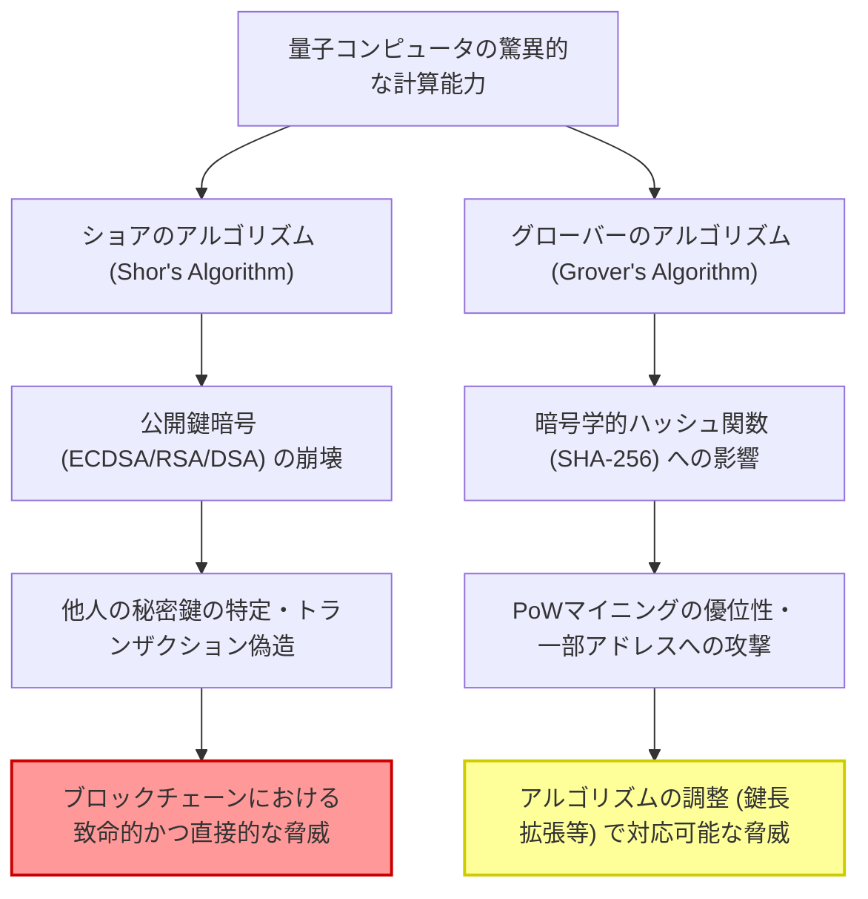
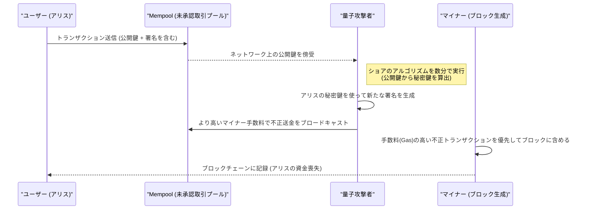
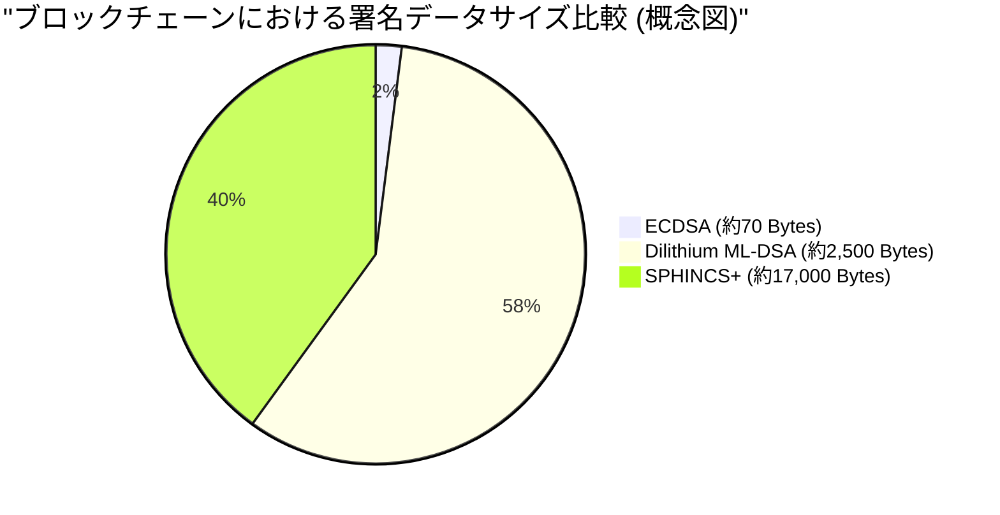

## 1. イントロダクション：ポスト量子時代の足音とブロックチェーンの危機

2009年にサトシ・ナカモトによってビットコイン（Bitcoin）が誕生して以来、ブロックチェーン技術は「非中央集権的で改ざん不可能な台帳」として、世界中の金融システムやアプリケーションの基盤へと成長しました。この堅牢なセキュリティを支えているのが、**公開鍵暗号（Public Key Cryptography）**と**暗号学的ハッシュ関数（Cryptographic Hash Functions）**という現代暗号技術です。

これらの暗号技術は、古典的なコンピュータ（現在私たちが使用しているPCやスーパーコンピュータ）では、宇宙の寿命ほどの時間をかけても解読できないという数学的な「計算困難性」を根拠に安全性を保証しています。

しかし、この前提は、物理学と情報科学のフロンティアである**量子コンピュータ（Quantum Computers）**の急速な発展と実用化によって、根本から覆されようとしています。量子力学特有の「重ね合わせ（Superposition）」や「量子もつれ（Entanglement）」を利用する量子コンピュータは、特定の数学的問題において、従来の古典コンピュータを圧倒する計算能力、いわゆる「量子超越性（Quantum Supremacy）」を発揮します。

本記事では、ブロックチェーン技術が量子コンピュータによって具体的にどのような脅威に直面しているのか、そしてその解決策となる**耐量子計算機暗号（PQC：Post-Quantum Cryptography）**の最新動向と、暗号資産ネットワークの移行シナリオについて、技術的かつ数理的な観点から徹底的に深く掘り下げて解説します。

---

## 2. 量子コンピュータの基礎とブロックチェーンに与える2つの大きな脅威

現在のブロックチェーンシステムは、主に以下の2つの暗号要素で構成されており、これらはそれぞれ量子アルゴリズムによる異なる脅威に晒されています。

### 2.1. 楕円曲線暗号（ECDSA）の基礎と計算困難性

ビットコインやイーサリアム（Ethereum）をはじめとする多くのブロックチェーンは、デジタル署名アルゴリズムとして**楕円曲線デジタル署名アルゴリズム（ECDSA：Elliptic Curve Digital Signature Algorithm）**を採用しています。具体的には、ビットコインは `secp256k1` というパラメータの楕円曲線を使用しています。

楕円曲線暗号の安全性は、**楕円曲線離散対数問題（ECDLP：Elliptic Curve Discrete Logarithm Problem）**の計算困難性に依存しています。
楕円曲線は以下のワイエルシュトラス標準形で表される方程式で定義されます。

$$
y^2 \equiv x^3 + ax + b \pmod{p}
$$

ビットコインの `secp256k1` では、$a = 0, b = 7$ であり、$p$ は非常に大きな素数です。
この曲線上にあるベースポイント（基準点）を $G$ とし、ランダムに選ばれた256ビットの巨大な整数である秘密鍵を $k$ とします。このとき、公開鍵 $K$ はベースポイントの $k$ 回の足し算（スカラー倍算）によって求められます。

$$
K = k \times G = \underbrace{G + G + \dots + G}_{k \text{ times}}
$$

古典コンピュータを使用して、公開された公開鍵 $K$ とベースポイント $G$ から秘密鍵 $k$ を逆算（離散対数を求める）することは、ポラード・ロー素因数分解法などの最良の古典的アルゴリズムを用いても $\mathcal{O}(\sqrt{p})$ の指数関数的な計算時間がかかります。256ビットの鍵の場合、約 $2^{128}$ 回の演算が必要となり、これは現在のスーパーコンピュータを何十億年稼働させても解けないレベルです。

### 2.2. ショアのアルゴリズム（Shor's Algorithm）による崩壊

しかし、1994年にピーター・ショアが発表した**ショアのアルゴリズム**は、この前提を完全に破壊しました。ショアのアルゴリズムはもともと素因数分解問題（RSA暗号の基盤）を多項式時間で解くために提案されましたが、離散対数問題や楕円曲線離散対数問題にも適用可能です。

ショアのアルゴリズムの核心は、**量子フーリエ変換（QFT：Quantum Fourier Transform）**を用いて、関数の「周期（Period）」を高速に見つけ出す点にあります。

$$
\text{古典的な計算量} = \mathcal{O}(2^{n/2}) \quad (n\text{はビット長})
$$
$$
\text{量子アルゴリズムの計算量} = \mathcal{O}(n^3)
$$

このように、ショアのアルゴリズムは指数関数的な時間を**多項式時間（Polynomial Time）**へと劇的に短縮します。十分な論理量子ビットを持つ量子コンピュータが完成すれば、ネットワーク上に公開された公開鍵 $K$ から、数分あるいは数秒で秘密鍵 $k$ を特定することが可能になります。これにより、攻撃者は他人のウォレットの秘密鍵を容易に入手し、資金を完全に掌握できるようになります。

#### 2.2.1 ショアのアルゴリズムによるECDLP解読のステップ・バイ・ステップ

量子コンピュータがどのようにして楕円曲線離散対数問題（ECDLP）を解くのか、その内部プロセスを順を追って見ていきましょう。

問題設定：$K = k \times G$ において、$G$ と $K$ が既知であり、未知の整数 $k$ （秘密鍵）を求めたい。楕円曲線の位数を $N$ とします。

**Step 1: 重ね合わせ状態の作成**
まず、2つの量子レジスタを用意し、それぞれにアダマールゲート（Hadamard Gate）を適用して、全ての可能な整数の組み合わせの重ね合わせ状態を作成します。
$$
|\psi_1\rangle = \frac{1}{N} \sum_{x=0}^{N-1} \sum_{y=0}^{N-1} |x\rangle |y\rangle |0\rangle
$$

**Step 2: 量子オラクルの適用（関数の評価）**
次に、楕円曲線上の点の加算を行う量子回路（オラクル）を用いて、関数 $f(x, y) = x \times G + y \times K$ を第3レジスタに計算します。
$$
|\psi_2\rangle = \frac{1}{N} \sum_{x=0}^{N-1} \sum_{y=0}^{N-1} |x\rangle |y\rangle |x \times G + y \times K\rangle
$$
ここで重要なのは、$K = k \times G$ であるため、$f(x, y) = (x + y \cdot k) \times G$ と書き直せる点です。

**Step 3: 第3レジスタの測定**
第3レジスタを測定すると、ある楕円曲線上の点 $R$ に収縮します。これにより、第1、第2レジスタは $x + y \cdot k \equiv c \pmod{N}$ （$c$ は定数）を満たす $(x, y)$ の組の重ね合わせ状態に収縮します。
$$
|\psi_3\rangle = \frac{1}{\sqrt{N}} \sum_{y=0}^{N-1} |c - y \cdot k \pmod{N}\rangle |y\rangle
$$

**Step 4: 量子フーリエ変換（QFT）の適用**
この状態は周期 $k$ に関連する周期性を持っています。ここに逆量子フーリエ変換（Inverse QFT）を適用することで、位相の干渉を引き起こし、周期の情報を振幅に変換します。

**Step 5: 測定と古典的後処理**
第1、第2レジスタを測定すると、高確率で $k$ に関する情報を含む値が得られます。測定された値に対して、連分数展開（Continued Fractions）などの古典的な数論アルゴリズムを適用することで、未知の秘密鍵 $k$ を完全に特定することができます。

このプロセス全体で必要とされる量子ゲートの数は $\mathcal{O}(\log^3 N)$ であり、古典コンピュータによる $\mathcal{O}(\sqrt{N})$ の探索とは比較にならないほどの超高速で秘密鍵を暴き出します。

### 2.3. グローバーのアルゴリズム（Grover's Algorithm）とハッシュ関数への影響

もう一つの脅威は、ロブ・グローバーが1996年に提案した**グローバーのアルゴリズム**です。これはハッシュ関数（例：SHA-256）に対して大きな影響を与えます。

ブロックチェーンにおいて、ハッシュ関数はデータの完全性の担保、アドレスの生成、そしてビットコインにおける**PoW（Proof of Work）マイニング**の基盤として使用されています。ハッシュ関数の逆算（原像計算）は、特定の出力値 $y$ に対して $H(x) = y$ となる入力値 $x$ を探す「非構造化データベース探索問題」とみなすことができます。

古典コンピュータでは、$N$ 個の可能性から正解を見つけるために、平均して $\frac{N}{2}$ 回、最悪で $N$ 回の試行が必要です。つまり計算量は $\mathcal{O}(N)$ です。
しかし、グローバーのアルゴリズムは「振幅増幅（Amplitude Amplification）」と呼ばれる量子技術を用います。重ね合わせ状態にある全ての可能性の中から、正解となる状態の確率振幅を反復的に増幅させることで、探索時間を平方根に短縮します。

$$
\text{グローバーのアルゴリズムの計算量} = \mathcal{O}(\sqrt{N})
$$

SHA-256の場合、$N = 2^{256}$ であるため、古典的な総当たり探索では約 $2^{256}$ 回の試行が必要です。しかし、グローバーのアルゴリズムを用いれば $\sqrt{2^{256}} = 2^{128}$ 回の試行で済むことになります。これは、256ビットのハッシュ関数が、量子コンピュータに対しては**実質的に128ビットのセキュリティ強度に半減する**ことを意味します。

#### 2.3.1. SHA-256は生き残るか？（Quantum Supremacy in Hashing）

セキュリティが半分になるとはいえ、「128ビットのセキュリティ」は依然として極めて強固です。$2^{128}$ 回の演算は、現在の技術レベルから見ても天文学的な数字であり、宇宙の寿命スケールを要します。
したがって、**「SHA-256は量子コンピュータに対しても実用的な安全性を維持する」**と広く考えられています。将来的にセキュリティマージンを高める必要がある場合は、単純にハッシュの出力長を2倍（例：SHA-256からSHA-512への移行）にするだけで、古典的な256ビットセキュリティを量子世界でも維持することができます。

結論として、ハッシュ関数に対する量子の脅威は「軽微かつ対応可能」であるのに対し、公開鍵暗号（ECDSA）に対する脅威は「致命的」であると言えます。

---

## 3. 現在の暗号資産（Bitcoin, Ethereum）への具体的な影響分析

量子コンピュータによるECDSAの解読が可能になった世界において、暗号資産ネットワークは具体的にどのような脆弱性に直面するのでしょうか。ここでは、ビットコインの仕組みを例に、**「公開鍵の露出タイミング」**という観点から詳細な分析を行います。

### 3.1. アドレスの生成と公開鍵の「非公開性」

ビットコインのアドレス（P2PKH: Pay-to-Public-Key-Hash や P2WPKH: Pay-to-Witness-Public-Key-Hash）は、公開鍵そのものではなく、公開鍵を複数回ハッシュ化したものを使用しています。

$$
\text{Bitcoin Address} = \text{Base58Check}(\text{RIPEMD160}(\text{SHA256}(\text{Public Key})))
$$

前述の通り、ハッシュ関数は量子攻撃（グローバーのアルゴリズム）に対して耐性を持つため、ハッシュ値である「アドレス」から元の「公開鍵」を逆算することは量子コンピュータでも不可能です。
つまり、**「未使用（一度も資金の送信を行っていない）のアドレス」**については、ブロックチェーン上に公開鍵が一切露出しておらず、ハッシュ値のみが記録されている状態です。したがって、公開鍵が分からない以上、ショアのアルゴリズムを実行する標的が存在せず、秘密鍵を特定することはできません。この状態のウォレットは量子的に安全（Quantum-safe）であると言えます。

### 3.2. トランザクション送信時の致命的な脆弱性（フロントランニング攻撃）

問題が発生するのは、ユーザーが資金を送金するタイミングです。
トランザクションをネットワークにブロードキャスト（送信）する際、ユーザーはデジタル署名とともに、検証のために**自身の公開鍵をトランザクションデータ内に含めてネットワーク全体に公開**する必要があります。

一度公開鍵がMempool（未承認トランザクションの待機場所）に送信されると、そのデータは世界中のノードに共有されます。もし攻撃者が超高速な量子コンピュータを保持していた場合、以下のプロセスで資金を奪うことができます。

1. Mempoolから正当なユーザー（アリス）のトランザクションを傍受し、**公開鍵を抽出**する。
2. ショアのアルゴリズムを実行し、公開鍵から**秘密鍵を数分以内（ブロックが承認される前）に計算**する。
3. 取得した秘密鍵を用いて、アリスの資金を攻撃者のアドレスに送金する**偽のトランザクションを作成**する。
4. この偽トランザクションに、アリスの元のトランザクションよりも**はるかに高いマイナー手数料（Fee）を設定**してネットワークに送信する。

マイナーは経済的インセンティブに従い、手数料の高いトランザクションを優先的にブロックに組み込みます。結果として、攻撃者の不正な送金が先に承認（Confirm）され、アリスの正当な送金は「残高不足（Double Spend）」として破棄されます。
この一連の流れは**フロントランニング攻撃（Front-running Attack）**と呼ばれ、量子コンピュータが実用化された世界では、誰かが送金ボタンを押した瞬間に資金がハッカーに奪われるという恐ろしい事態を引き起こします。

### 3.3. 再利用アドレスと古いアドレス（P2PK）の危機

さらに深刻な問題として、過去に一度でも送金を行ったことのあるアドレス（お釣りアドレスなどとして再利用している場合）は、すでにブロックチェーン上に公開鍵が永続的に記録されています。これらはトランザクションの送信を待つまでもなく、いつでも秘密鍵を計算されて残高を奪われる危険に晒されています。

また、サトシ・ナカモトの初期マイニング報酬（約100万BTC以上）を含む、2009年〜2010年頃に主流だった**P2PK（Pay-to-Public-Key）**フォーマットでは、アドレスとしてハッシュではなく公開鍵そのものが直接ブロックチェーンに記録されていました。これらの大量の休眠ビットコインは、量子コンピュータにとって最も容易な標的となり、一斉に盗まれて市場でダンピングされることで、価格の大暴落を引き起こす可能性があります。

---

## 4. 耐量子計算機暗号（PQC: Post-Quantum Cryptography）への移行シナリオ

このような「Q-Day（量子コンピュータによる暗号突破の日）」の破局を回避するため、暗号学界とブロックチェーンコミュニティは、量子アルゴリズムでも解読が困難な**耐量子計算機暗号（PQC）**への移行を計画しています。
米国立標準技術研究所（NIST）は長年にわたりPQCの標準化プロセスを進めており、数次にわたる厳しい評価を経て、いくつかの有望な暗号方式が最終標準として選定されました。

ブロックチェーンのデジタル署名代替として注目されている主要なPQCアルゴリズムを、その数理的メカニズムとともに詳細に解説します。

### 4.1. ハッシュベース署名（Hash-Based Signatures）

ハッシュベース署名は、その安全性が「ハッシュ関数の衝突耐性」という非常にシンプルかつ強固な基盤のみに依存する暗号方式です。量子コンピュータに対するハッシュ関数の安全性は既に証明されているため（前述の通り128ビットのセキュリティマージンがあれば十分）、非常に信頼性が高いアプローチです。
代表的なものに、**ランポート署名（Lamport Signatures）**や、それを拡張したWOTS（Winternitz One-Time Signature）、そしてNIST標準化候補の**SPHINCS+**（現在ではFIPS 205としてSLH-DSAと呼ばれる）があります。

#### 4.1.1. ランポート署名の数理的詳細（One-Time Signature）

ランポート署名の仕組みをさらに数学的に詳細に見ていきましょう。
ハッシュ関数を $H: \{0, 1\}^* \to \{0, 1\}^{256}$ とします。

**【鍵生成】**
アリス（送信者）は、真の乱数生成器（TRNG）を用いて、256対の秘密鍵ペアを生成します。
$$
\text{sk}_{i,0} \in \{0, 1\}^{256}, \quad \text{sk}_{i,1} \in \{0, 1\}^{256} \quad (1 \le i \le 256)
$$
これにより、秘密鍵 $\text{sk}$ は合計512個の256ビット文字列から成ります（サイズ：$512 \times 32 = 16,384$ バイト）。

次に、公開鍵 $\text{pk}$ を計算します。各秘密鍵コンポーネントをそれぞれハッシュ化します。
$$
\text{pk}_{i,0} = H(\text{sk}_{i,0}), \quad \text{pk}_{i,1} = H(\text{sk}_{i,1})
$$
公開鍵も同様に $16,384$ バイトとなります。これをブロックチェーンネットワークに公開します。

**【署名生成】**
アリスは、トランザクションデータ $M$ に署名するために、まずそのハッシュ値を計算します。
$$
h = H(M) \in \{0, 1\}^{256}
$$
ハッシュ値 $h$ の $i$ 番目のビットを $h_i \in \{0, 1\}$ とします。
アリスの署名 $\sigma$ は、各ビット $h_i$ に対応する秘密鍵コンポーネントの集合となります。
$$
\sigma = (\text{sk}_{1, h_1}, \text{sk}_{2, h_2}, \dots, \text{sk}_{256, h_{256}})
$$
つまり、メッセージハッシュのビットが `0` ならば $\text{sk}_{i,0}$ を公開し、`1` ならば $\text{sk}_{i,1}$ を公開します。署名サイズは $256 \times 32 = 8,192$ バイトとなります。

**【署名検証】**
マイナー（検証者）は、受け取ったトランザクション $M$ と署名 $\sigma = (s_1, s_2, \dots, s_{256})$、そして公開鍵 $\text{pk}$ を用いて検証を行います。
トランザクションのハッシュ $h = H(M)$ を再計算し、各 $s_i$ をハッシュ化したものが、公開鍵の対応する要素 $\text{pk}_{i, h_i}$ と一致するかを確認します。
$$
H(s_i) \overset{?}{=} \text{pk}_{i, h_i} \quad (\text{for all } 1 \le i \le 256)
$$

このプロセスは数学的に極めてシンプルであり、量子コンピュータが $H$ の逆算を行えない限り署名を偽造することは不可能です。しかし、一度署名を行うと秘密鍵の半分がネットワークに暴露されるため、同じ鍵ペアで別のメッセージに署名すると、暴露された秘密鍵が組み合わさって攻撃者に偽造の余地を与えるため、「一度きり（One-Time）」しか使えないという強い制約が生じます。
これを実用化するために、マークルツリーを用いて多数のワンタイム鍵を一つのルート公開鍵に束ねる**XMSS**や、ステートレスな**SPHINCS+**などの技術が開発されましたが、署名サイズが数十キロバイトに達するという欠点があります。

### 4.2. 格子暗号（Lattice-Based Cryptography）

現在、PQCの主流として最も期待されており、NISTのメイン標準規格（FIPS 204: ML-DSA / 旧CRYSTALS-Dilithium や、Falconなど）として採用されているのが**格子暗号**です。

格子暗号の安全性は、「多次元格子における最短ベクトル問題（SVP: Shortest Vector Problem）」や、「誤差付き学習問題（LWE: Learning With Errors）」といった、数学的に証明された困難な問題に依存しています。格子問題は量子コンピュータを用いても効率的に解くアルゴリズムが発見されていません。

**LWE（Learning With Errors）の数理モデル：**
LWE問題の基本的な考え方は、連立一次方程式に意図的に「小さなノイズ（誤差）」を加えることで、問題を劇的に難しくするというものです。
秘密のベクトルを $\mathbf{s} \in \mathbb{Z}_q^n$ とします。
ランダムに選ばれた巨大な公開行列 $\mathbf{A} \in \mathbb{Z}_q^{m \times n}$ と、意図的に付加される小さなノイズベクトル $\mathbf{e} \in \mathbb{Z}_q^m$ があります。
公開鍵 $\mathbf{b}$ は以下のように計算されます。

$$
\mathbf{b} = \mathbf{A}\mathbf{s} + \mathbf{e} \pmod{q}
$$

行列 $\mathbf{A}$ とベクトル $\mathbf{b}$ （公開鍵）が公開されていても、そこから秘密鍵 $\mathbf{s}$ を逆算することは、ノイズ $\mathbf{e}$ の存在によって非常に困難となります。ノイズがなければ単なるガウス消去法で解けますが、ノイズがあることで全ての次元における探索空間が爆発的に増加し、古典・量子双方のコンピュータに対しても堅牢なセキュリティを提供します。
ブロックチェーン等で使われる実際のアルゴリズム（Dilithium等）では、これを多項式環上で展開した**Ring-LWE（またはModule-LWE）**が用いられ、鍵サイズの縮小と計算の高速化が図られています。

* **メリット**：ハッシュベース署名に比べて、公開鍵や署名のサイズが比較的小さく（数キロバイト程度）、署名生成・検証の計算速度が非常に高速（ECDSAと同等以上）です。
* **デメリット**：数学的な構造が複雑であり、歴史的な検証期間が短いため、将来的に新たな解読アルゴリズムが発見されるリスクがゼロではありません。

---

## 5. ブロックチェーンのPQC移行における技術的課題

PQCのアルゴリズム（DilithiumやSPHINCS+など）が存在するからといって、これを明日にでもビットコインやイーサリアムに導入できるわけではありません。分散型システム特有の重い課題がいくつも存在します。

### 5.1. 署名サイズの肥大化とスケーラビリティの崩壊

PQC導入における最大の障壁は、データサイズの大幅な肥大化です。
現在のECDSAの署名サイズが約70バイトであるのに対し、格子暗号のDilithium（ML-DSA）では署名サイズが約2,420バイト〜4,595バイト（セキュリティレベルによる）、公開鍵サイズも1,300バイトを超えます。ハッシュベースのSPHINCS+に至っては署名だけで数万バイトに達します。

もしビットコインが現在と同じブロックサイズ上限（SegWit込みで約4MBのウェイト）のままPQCを導入した場合、1つのブロックに格納できるトランザクションの数は激減します。ネットワークのスループット（TPS：Transactions Per Second）は壊滅的に低下し、送金詰まりが常態化するでしょう。
これを解決するためにはブロックサイズの大幅な引き上げが必要となりますが、それはフルノードのストレージ要件やネットワーク帯域幅の要件を増大させ、個人でのノード運用を困難にし、結果として**ネットワークの中央集権化**を招くというジレンマに陥ります。

*(※ PQC導入に伴うトランザクションデータの肥大化は、スケーラビリティに対する致命的なボトルネックとなります)*

### 5.2. Ethereum Virtual Machine (EVM) への影響と事前コンパイル済みコントラクト

Ethereumのようなチューリング完全なスマートコントラクトプラットフォームにおいて、PQCの導入はEVM（Ethereum Virtual Machine）の根本的なアップグレードを要求します。
現在のEVMでは、ECDSA署名の検証のために `ecrecover` (アドレス: `0x01`) という事前コンパイル済みコントラクト（Precompiled Contract）が用意されており、非常に低いガス代（3000 Gas）で署名検証が行えるよう最適化されています。

しかし、DilithiumやFalconといった新しい格子暗号アルゴリズムの検証処理は、複雑な多項式演算や行列演算を伴うため、既存のEVMオペコード（Opcode）だけで実装すると、1回の署名検証だけで数百万から数千万ガスを消費する可能性があります。これは、現在のブロックガスリミット（約3000万Gas）を1トランザクションで枯渇させるレベルです。

これを回避するためには、ネットワークのハードフォークを通じて、新たにPQC検証用のPrecompiled Contract（例：`0x10` に DilithiumVerify を割り当てるなど）をEVM自体に組み込む必要があります。これには、各イーサリアムクライアント（Geth, Nethermind, Erigonなど）のコア開発者が協調してC++、Go、Rustなどの言語レベルで格子暗号検証ロジックを最適化実装し、セキュリティ監査を実施するという長期間にわたるプロセスが必要です。

### 5.3. ハードフォークによる合意形成の難しさ

基盤となる署名アルゴリズムを変更するには、ネットワーク全体のプロトコルを更新する**ハードフォーク（Hard Fork）**が不可欠です。しかし、ビットコインのように「ルールを変えないこと、非中央集権であること」に重きを置くコミュニティにおいて、コンセンサスを得るプロセスは政治的にも非常に困難です。PQCへの移行に関するBIP（Bitcoin Improvement Proposal）が提案されてから実装に至るまでには、数年にわたる議論とテストが必要となるでしょう。

---

## 6. いつ「Q-Day」は来るのか？ 移行に向けたロードマップ

「量子コンピュータが256ビットの楕円曲線暗号を完全に解読する日（Q-Day）」はいつ来るのでしょうか。
研究者の間でも意見は分かれていますが、多くの専門家は**「2030年代半ばから2040年代にかけて」**、少なくとも数千から数万の安定した論理量子ビット（ノイズ耐性を持つエラー訂正された量子ビット）を持つ大規模な量子コンピュータが登場すると予測しています。しかし、ハードウェアアーキテクチャのブレイクスルーや、より効率的な量子アルゴリズムの発見によっては、その時期が早まる可能性（2030年前後）も否定できません。

暗号資産のエコシステムが手遅れになる前に取るべきロードマップは以下の通りです。

### フェーズ1：ハイブリッド署名とアカウント抽象化（現在〜2028年頃）
現在のブロックチェーン界隈、特にEthereumの開発陣（Vitalik Buterin氏など）は、ECDSAとPQC（ハッシュベース署名や格子暗号）を組み合わせた**「ハイブリッド署名」**を検討しています。これは、既存の安全なECDSAによる署名と、PQCによる署名の両方をトランザクションに付与し、どちらか一方が破られても安全性を保つというアプローチです。
また、アカウント抽象化（Account Abstraction, ERC-4337）を利用することで、プロトコルレベルのハードフォークを待たずに、スマートコントラクトウォレット上でオプトイン（希望するユーザーのみ）でPQC署名を実装・サポートする取り組みも進められています。

### フェーズ2：ゼロ知識証明（ZK-Rollups）の活用（2025年〜）
PQCの最大の弱点である「署名データの肥大化」を解決する切り札として期待されているのが、レイヤー2技術である**ZK-Rollups（ゼロ知識証明）**の活用です。
巨大なPQC署名データをLayer 1（メインチェーン）に直接書き込むのではなく、Layer 2上で多数のPQCトランザクションを検証・集約します。そして、ZK-SNARKs や ZK-STARKs を使ってそれらを一つの極めて小さな「証明データ（Proof）」に圧縮し、Layer 1に記録するのです。
なお、SNARKsの一部の構成（Groth16など）はそれ自体が量子脆弱であるため、耐量子性を持つハッシュ関数のみに依存する**ZK-STARKs**の採用が鍵となります。

### フェーズ3：プロトコルレベルのハードフォーク（2030年頃）
NISTによるPQCの標準化が完全に定着し、業界標準のライブラリが出揃い十分にテストされた段階で、BitcoinやEthereumなどの主要チェーンにおいて、デフォルトの署名方式を完全にPQCへ移行するハードフォークが実施されると予想されます。この移行期には、ユーザーに対して「古いウォレットからPQC対応の新しいウォレットへ資金を移動するよう促す」大規模なアナウンスメントが行われることになります。

### 先駆的なプロジェクト事例

一部のブロックチェーンプロジェクトは、この量子脅威を先取りし、初期段階から耐量子性を謳って開発されています。
* **QRL (Quantum Resistant Ledger)**: XMSS（拡張マークル署名方式）というハッシュベースのPQCをプロトコルレベルでネイティブに実装した初期のブロックチェーンです。
* **Algorand / Cellframe**: 将来のPQCアップデートを見据えた柔軟な暗号層のモジュラーアーキテクチャを持ち、格子暗号の統合を積極的に模索しているプロジェクト群です。

---

## 7. 結論：暗号資産の未来と私たちの資産を守るために

「ポスト量子時代」の到来は、単なるSF（サイエンス・フィクション）の空想領域を越え、すでに現実の暗号システムに対する具体的な技術的課題として私たちの目の前に迫っています。

ショアのアルゴリズムとグローバーのアルゴリズムという量子コンピュータの二つの剣は、現在のブロックチェーンの基盤である公開鍵暗号とハッシュ関数をそれぞれ脅かします。特にECDSAの脆弱性は致命的であり、フロントランニング攻撃による資金の盗難リスクを避けるためには、耐量子計算機暗号（PQC）への移行が絶対的に避けられない道です。

しかし、技術界とブロックチェーンコミュニティはただ指をくわえて破滅を待っているわけではありません。格子暗号やハッシュベース署名といったPQCアルゴリズムの選定と標準化が着実に進んでおり、ゼロ知識証明（ZK-STARKs）やLayer 2のスケーリング技術を活用することで、PQC導入の最大の壁である「データサイズの肥大化」を克服する道筋も見え始めています。

私たち一般の暗号資産ユーザーや投資家が今すぐパニックになって資金をすべて売却する必要はありません。しかし、以下のような基本的なリテラシーと自己防衛の意識を持つことが重要です。

* **アドレスの再利用を避ける**：「使用済みのアドレス（一度でも資金を送信し、公開鍵がブロックチェーン上に露出したアドレス）」には資金を長期間保管しないよう、プライバシーの観点だけでなくセキュリティの観点からも徹底する。
* **技術動向に注目する**：BitcoinのBIPやEthereumのEIPなど、主要ネットワークのPQC移行に関する議論やハードフォークのニュースにアンテナを張っておき、必要になったタイミングで適切にウォレットの移行作業を行えるようにする。

ブロックチェーンの歴史は、常に新たな技術的脅威に対するアップグレードとレジリエンス（回復力）の歴史でもあります。スケーラビリティ問題や環境問題（PoWからPoSへの移行など）を乗り越えてきたように、この未曾有の量子脅威に対しても、エコシステム全体で解決策を模索し適応していくことでしょう。
量子コンピュータという人類の新たな叡智と、非中央集権的な分散型台帳という信頼のテクノロジーが、衝突によって崩壊するのではなく、より高い次元で融合した強固なシステムへと昇華していく未来に期待したいところです。

---
*参考文献・関連リンク:*
* National Institute of Standards and Technology (NIST) - Post-Quantum Cryptography Standardization Project
* Shor, P. W. (1994). Algorithms for quantum computation: discrete logarithms and factoring.
* Grover, L. K. (1996). A fast quantum mechanical algorithm for database search.
* Buterin, V. (2024). How to hard-fork to save most users' funds in a quantum emergency.
