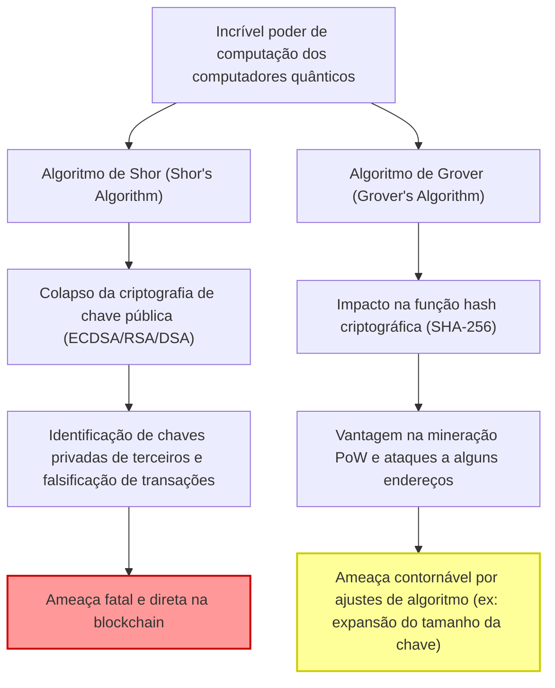
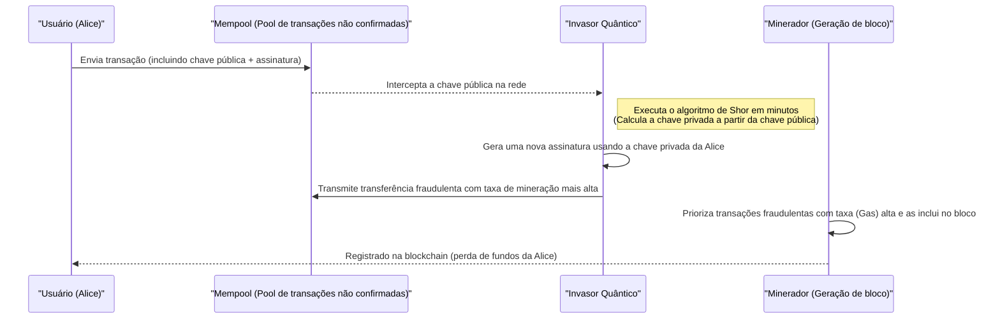
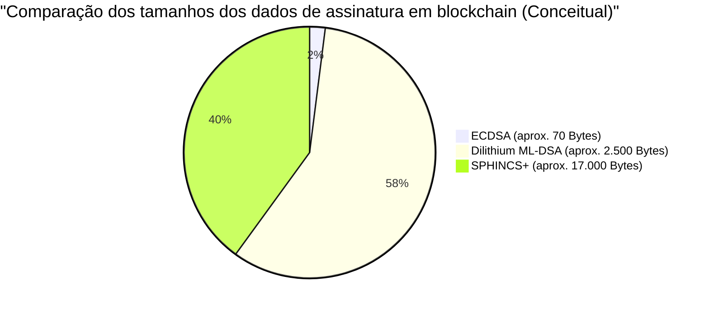

## 1. Introdução: Os passos da era pós-quântica e a crise da blockchain

Desde a criação do Bitcoin por Satoshi Nakamoto em 2009, a tecnologia blockchain cresceu para se tornar a base de sistemas financeiros e aplicativos em todo o mundo como um "livro-razão descentralizado e à prova de adulteração". Essa segurança robusta é sustentada pela criptografia moderna, especificamente a **Criptografia de Chave Pública (Public Key Cryptography)** e as **Funções Hash Criptográficas (Cryptographic Hash Functions)**.

Essas tecnologias criptográficas garantem a segurança com base na "dificuldade computacional" matemática, segundo a qual computadores clássicos (os PCs e supercomputadores que usamos atualmente) levariam um tempo equivalente à idade do universo para decifrá-las.

No entanto, essa premissa está prestes a ser fundamentalmente derrubada pelo rápido desenvolvimento e implementação prática de **Computadores Quânticos (Quantum Computers)**, a fronteira da física e da ciência da informação. Utilizando a "Superposição (Superposition)" e o "Emaranhamento Quântico (Entanglement)" exclusivos da mecânica quântica, os computadores quânticos exibem um poder computacional que supera os computadores clássicos convencionais em problemas matemáticos específicos, alcançando a chamada "Supremacia Quântica (Quantum Supremacy)".

Neste artigo, exploraremos detalhadamente, de uma perspectiva técnica e matemática, as ameaças específicas que a tecnologia blockchain enfrenta devido aos computadores quânticos. Também discutiremos a solução: as últimas tendências em **Criptografia Pós-Quântica (PQC: Post-Quantum Cryptography)** e os cenários de transição para redes de criptoativos.

---

## 2. Fundamentos da computação quântica e duas grandes ameaças à blockchain

Os sistemas de blockchain atuais são compostos principalmente pelos dois elementos criptográficos a seguir, cada um exposto a diferentes ameaças de algoritmos quânticos.

### 2.1. Fundamentos e dificuldade computacional da Criptografia de Curva Elíptica (ECDSA)

Muitas blockchains, incluindo Bitcoin e Ethereum, adotam o **Algoritmo de Assinatura Digital de Curva Elíptica (ECDSA: Elliptic Curve Digital Signature Algorithm)** como seu algoritmo de assinatura digital. Especificamente, o Bitcoin usa uma curva elíptica com o parâmetro `secp256k1`.

A segurança da criptografia de curva elíptica depende da dificuldade computacional do **Problema do Logaritmo Discreto em Curvas Elípticas (ECDLP: Elliptic Curve Discrete Logarithm Problem)**.
Uma curva elíptica é definida pela equação na forma padrão de Weierstrass a seguir:

$$
y^2 \equiv x^3 + ax + b \pmod{p}
$$

No `secp256k1` do Bitcoin, $a = 0, b = 7$, e $p$ é um número primo extremamente grande.
Seja $G$ o ponto base (ponto de referência) nesta curva, e $k$ a chave privada, que é um número inteiro gigante de 256 bits escolhido aleatoriamente. Neste caso, a chave pública $K$ é obtida pela adição (multiplicação escalar) do ponto base por $k$ vezes.

$$
K = k \times G = \underbrace{G + G + \dots + G}_{k \text{ vezes}}
$$

Usar um computador clássico para calcular reversamente (encontrar o logaritmo discreto) a chave privada $k$ a partir da chave pública publicada $K$ e do ponto base $G$ leva um tempo computacional exponencial de $\mathcal{O}(\sqrt{p})$, mesmo usando os melhores algoritmos clássicos, como o método de fatoração rho de Pollard. Para uma chave de 256 bits, seriam necessárias cerca de $2^{128}$ operações, um nível impossível de resolver mesmo executando os supercomputadores atuais por bilhões de anos.

### 2.2. Colapso pelo Algoritmo de Shor (Shor's Algorithm)

No entanto, o **Algoritmo de Shor**, publicado por Peter Shor em 1994, destruiu completamente essa premissa. O algoritmo de Shor foi originalmente proposto para resolver o problema de fatoração de inteiros (a base da criptografia RSA) em tempo polinomial, mas também pode ser aplicado ao problema do logaritmo discreto e ao problema do logaritmo discreto em curvas elípticas.

O núcleo do algoritmo de Shor reside em sua capacidade de encontrar rapidamente o "Período (Period)" de uma função usando a **Transformada de Fourier Quântica (QFT: Quantum Fourier Transform)**.

$$
\text{Complexidade clássica} = \mathcal{O}(2^{n/2}) \quad (\text{onde } n \text{ é o comprimento em bits})
$$
$$
\text{Complexidade do algoritmo quântico} = \mathcal{O}(n^3)
$$

Dessa forma, o algoritmo de Shor reduz drasticamente o tempo exponencial para **Tempo Polinomial (Polynomial Time)**. Se um computador quântico com qubits lógicos suficientes for concluído, será possível identificar a chave privada $k$ a partir de uma chave pública $K$ publicada na rede em minutos ou até segundos. Isso permite que os invasores obtenham facilmente as chaves privadas das carteiras de outras pessoas e assumam o controle total de seus fundos.

#### 2.2.1 Passo a passo da decodificação do ECDLP com o Algoritmo de Shor

Vamos observar, passo a passo, o processo interno de como um computador quântico resolve o Problema do Logaritmo Discreto em Curvas Elípticas (ECDLP).

Definição do problema: Em $K = k \times G$, $G$ e $K$ são conhecidos e queremos encontrar o número inteiro desconhecido $k$ (chave privada). Seja $N$ a ordem da curva elíptica.

**Passo 1: Criação do estado de superposição**
Primeiro, preparamos dois registradores quânticos e aplicamos uma porta Hadamard (Hadamard Gate) a cada um para criar um estado de superposição de todas as combinações de números inteiros possíveis.
$$
|\psi_1\rangle = \frac{1}{N} \sum_{x=0}^{N-1} \sum_{y=0}^{N-1} |x\rangle |y\rangle |0\rangle
$$

**Passo 2: Aplicação do oráculo quântico (avaliação da função)**
Em seguida, usando um circuito quântico (oráculo) que realiza a adição de pontos na curva elíptica, calculamos a função $f(x, y) = x \times G + y \times K$ no terceiro registrador.
$$
|\psi_2\rangle = \frac{1}{N} \sum_{x=0}^{N-1} \sum_{y=0}^{N-1} |x\rangle |y\rangle |x \times G + y \times K\rangle
$$
O ponto importante aqui é que, como $K = k \times G$, a função pode ser reescrita como $f(x, y) = (x + y \cdot k) \times G$.

**Passo 3: Medição do terceiro registrador**
A medição do terceiro registrador o colapsa para um determinado ponto $R$ na curva elíptica. Como resultado, o primeiro e o segundo registradores colapsam para uma superposição de pares $(x, y)$ que satisfazem $x + y \cdot k \equiv c \pmod{N}$ (onde $c$ é uma constante).
$$
|\psi_3\rangle = \frac{1}{\sqrt{N}} \sum_{y=0}^{N-1} |c - y \cdot k \pmod{N}\rangle |y\rangle
$$

**Passo 4: Aplicação da Transformada de Fourier Quântica (QFT)**
Este estado possui uma periodicidade relacionada ao período $k$. Ao aplicar a Transformada de Fourier Quântica Inversa (Inverse QFT) a isso, causamos interferência de fase e convertemos a informação do período em amplitude.

**Passo 5: Medição e pós-processamento clássico**
Ao medir o primeiro e o segundo registradores, obtemos valores contendo informações sobre $k$ com alta probabilidade. Aplicando algoritmos clássicos de teoria dos números, como Frações Contínuas (Continued Fractions), aos valores medidos, a chave privada desconhecida $k$ pode ser perfeitamente identificada.

O número de portas quânticas exigido para todo esse processo é $\mathcal{O}(\log^3 N)$, o que revela a chave privada a uma velocidade incomparável em relação à busca $\mathcal{O}(\sqrt{N})$ realizada por computadores clássicos.

### 2.3. O Algoritmo de Grover (Grover's Algorithm) e o impacto nas funções hash

Outra ameaça é o **Algoritmo de Grover**, proposto por Lov Grover em 1996. Ele tem um impacto significativo nas funções hash (ex: SHA-256).

Na blockchain, as funções hash são usadas para garantir a integridade dos dados, gerar endereços e servir como base para a **mineração PoW (Proof of Work)** no Bitcoin. O cálculo reverso (cálculo de pré-imagem) de uma função hash pode ser visto como um "problema de busca em banco de dados não estruturado" no qual, para um valor de saída específico $y$, buscamos um valor de entrada $x$ tal que $H(x) = y$.

Com computadores clássicos, para encontrar a resposta correta dentre $N$ possibilidades, é necessária uma média de $\frac{N}{2}$ tentativas, ou $N$ tentativas no pior dos casos. Ou seja, a complexidade é $\mathcal{O}(N)$.
No entanto, o algoritmo de Grover usa uma técnica quântica chamada "Amplificação de Amplitude (Amplitude Amplification)". Ele amplifica repetidamente a amplitude de probabilidade do estado que é a resposta correta dentre todas as possibilidades em superposição, reduzindo assim o tempo de busca para a raiz quadrada.

$$
\text{Complexidade do Algoritmo de Grover} = \mathcal{O}(\sqrt{N})
$$

No caso do SHA-256, $N = 2^{256}$, então uma busca de força bruta clássica requer cerca de $2^{256}$ tentativas. No entanto, o uso do algoritmo de Grover exigiria apenas $\sqrt{2^{256}} = 2^{128}$ tentativas. Isso significa que, para computadores quânticos, uma função hash de 256 bits terá sua **força de segurança efetivamente cortada pela metade, para 128 bits**.

#### 2.3.1. O SHA-256 sobreviverá? (Supremacia Quântica no Hashing)

Embora a segurança caia pela metade, "128 bits de segurança" ainda é incrivelmente forte. O número de cálculos $2^{128}$ é astronômico e, do ponto de vista do nível de tecnologia atual, levaria um tempo na escala de vida do universo.
Portanto, considera-se amplamente que **"o SHA-256 manterá a segurança prática mesmo contra computadores quânticos"**. Se for necessário aumentar a margem de segurança no futuro, a segurança clássica de 256 bits pode ser mantida no mundo quântico simplesmente dobrando o comprimento de saída do hash (ex: migrando do SHA-256 para o SHA-512).

Em conclusão, embora a ameaça quântica às funções hash seja "leve e contornável", a ameaça à criptografia de chave pública (ECDSA) pode ser considerada "fatal".

---

## 3. Análise detalhada do impacto atual nos criptoativos (Bitcoin, Ethereum)

Em um mundo onde a quebra do ECDSA por computadores quânticos se torna possível, com quais vulnerabilidades específicas as redes de criptoativos lidarão? Aqui, com base na estrutura do Bitcoin, conduzimos uma análise detalhada da perspectiva do **"momento em que a chave pública é exposta"**.

### 3.1. Geração de endereços e "não divulgação" de chaves públicas

Os endereços do Bitcoin (P2PKH: Pay-to-Public-Key-Hash e P2WPKH: Pay-to-Witness-Public-Key-Hash) não usam a própria chave pública, mas a chave pública com hash aplicado múltiplas vezes.

$$
\text{Endereço Bitcoin} = \text{Base58Check}(\text{RIPEMD160}(\text{SHA256}(\text{Chave Pública})))
$$

Como mencionado, como as funções hash são resistentes a ataques quânticos (algoritmo de Grover), não é possível reverter da "chave pública" original a partir do "endereço", que é um valor de hash, mesmo com um computador quântico.
Ou seja, para **"endereços não utilizados (que nunca enviaram fundos)"**, a chave pública não foi exposta de forma alguma na blockchain, e apenas o valor hash foi registrado. Portanto, contanto que a chave pública seja desconhecida, não há alvo para o algoritmo de Shor, impossibilitando a identificação da chave privada. Uma carteira nesse estado pode ser considerada quanticamente segura (Quantum-safe).

### 3.2. A vulnerabilidade fatal no momento do envio da transação (Ataque Front-running)

O problema ocorre quando os usuários enviam fundos.
Ao transmitir (enviar) uma transação para a rede, o usuário deve **incluir sua chave pública nos dados da transação juntamente com a assinatura digital, expondo-a para toda a rede** para verificação.

Uma vez que a chave pública é enviada ao Mempool (área de espera para transações não confirmadas), os dados são compartilhados com os nós ao redor do mundo. Se um invasor possuísse um computador quântico super-rápido, ele poderia roubar os fundos através do seguinte processo:

1. Interceptar a transação do usuário legítimo (Alice) no Mempool e **extrair a chave pública**.
2. Executar o algoritmo de Shor e **calcular a chave privada a partir da chave pública em minutos (antes que o bloco seja confirmado)**.
3. Usar a chave privada obtida para **criar uma transação falsa** transferindo os fundos da Alice para o endereço do invasor.
4. Enviar essa transação falsa para a rede **definindo uma taxa de mineração (Fee) muito maior** do que a da transação original da Alice.

Seguindo o incentivo econômico, os mineradores priorizarão a transação com as taxas mais altas e a incluirão no bloco. Como resultado, a transferência fraudulenta do invasor é aprovada (Confirm) primeiro e a transferência legítima da Alice é rejeitada como "saldo insuficiente (Double Spend)".
Essa sequência de eventos é chamada de **Ataque Front-running (Front-running Attack)** e, em um mundo onde computadores quânticos são colocados em uso prático, as pessoas terão seus fundos roubados por hackers no instante em que clicarem no botão enviar.

### 3.3. A crise dos endereços reutilizados e endereços antigos (P2PK)

Um problema ainda mais sério é que os endereços que enviaram fundos pelo menos uma vez no passado (por exemplo, quando reutilizados como endereços de troco) já têm suas chaves públicas registradas permanentemente na blockchain. Essas carteiras correm o risco de ter as chaves privadas calculadas e os saldos roubados a qualquer momento, sem precisar aguardar que enviem novas transações.

Além disso, o formato **P2PK (Pay-to-Public-Key)**, popular em 2009-2010 e que inclui as recompensas iniciais de mineração de Satoshi Nakamoto (mais de 1 milhão de BTC), registra a chave pública em si, e não o hash, diretamente na blockchain como endereço. Esses enormes Bitcoins inativos se tornarão os alvos mais fáceis para os computadores quânticos, podendo ser roubados de uma vez e despejados (dumping) no mercado, o que poderia causar um crash no preço.

---

## 4. O cenário de transição para a Criptografia Pós-Quântica (PQC)

Para evitar tal catástrofe no "Q-Day (o dia em que os computadores quânticos romperão a criptografia)", a comunidade acadêmica de criptografia e a comunidade blockchain estão planejando migrar para a **Criptografia Pós-Quântica (PQC)**, que é extremamente difícil de decifrar até mesmo com algoritmos quânticos.
O Instituto Nacional de Padrões e Tecnologia dos EUA (NIST) tem promovido a padronização da PQC há muitos anos e, após múltiplas rodadas de avaliação rigorosa, selecionou vários sistemas de criptografia promissores como padrões finais.

Abaixo, detalhamos os principais algoritmos de PQC que estão chamando atenção como alternativas de assinatura digital para a blockchain, bem como seus mecanismos matemáticos.

### 4.1. Assinaturas Baseadas em Hash (Hash-Based Signatures)

As assinaturas baseadas em hash são esquemas de criptografia cuja segurança baseia-se puramente em um alicerce muito simples e robusto: a "resistência a colisões das funções hash". Como a segurança das funções hash contra computadores quânticos já foi provada (como mencionado, uma margem de segurança de 128 bits é suficiente), esta é uma abordagem incrivelmente confiável.
Alguns exemplos representativos incluem a **Assinatura de Lamport (Lamport Signatures)**, e as suas extensões como a WOTS (Winternitz One-Time Signature), e o candidato à padronização do NIST, o **SPHINCS+** (atualmente chamado de SLH-DSA como FIPS 205).

#### 4.1.1. Detalhes matemáticos da Assinatura de Lamport (One-Time Signature)

Vejamos mais a fundo os detalhes matemáticos do funcionamento da assinatura de Lamport.
Seja a função hash $H: \{0, 1\}^* \to \{0, 1\}^{256}$.

**[Geração de chaves]**
Alice (a remetente) usa um gerador de números aleatórios verdadeiros (TRNG) para gerar 256 pares de chaves privadas.
$$
\text{sk}_{i,0} \in \{0, 1\}^{256}, \quad \text{sk}_{i,1} \in \{0, 1\}^{256} \quad (1 \le i \le 256)
$$
Com isso, a chave privada $\text{sk}$ consistirá de um total de 512 strings de 256 bits (Tamanho: $512 \times 32 = 16.384$ bytes).

Em seguida, calcula-se a chave pública $\text{pk}$. Aplica-se hash em cada um dos componentes da chave privada.
$$
\text{pk}_{i,0} = H(\text{sk}_{i,0}), \quad \text{pk}_{i,1} = H(\text{sk}_{i,1})
$$
A chave pública será também de $16.384$ bytes. Ela publicará isso na rede da blockchain.

**[Geração de assinatura]**
Alice, para assinar os dados da transação $M$, primeiro calculará seu valor de hash.
$$
h = H(M) \in \{0, 1\}^{256}
$$
Seja o $i$-ésimo bit do valor de hash $h$ expresso como $h_i \in \{0, 1\}$.
A assinatura $\sigma$ de Alice será um conjunto de componentes da chave privada correspondente a cada bit $h_i$.
$$
\sigma = (\text{sk}_{1, h_1}, \text{sk}_{2, h_2}, \dots, \text{sk}_{256, h_{256}})
$$
Ou seja, se o bit do hash da mensagem for `0`, será revelado o $\text{sk}_{i,0}$, se for `1`, será revelado o $\text{sk}_{i,1}$. O tamanho da assinatura será de $256 \times 32 = 8.192$ bytes.

**[Verificação de assinatura]**
O minerador (o verificador) fará a verificação usando a transação $M$ recebida, a assinatura $\sigma = (s_1, s_2, \dots, s_{256})$ e a chave pública $\text{pk}$.
O hash da transação $h = H(M)$ é recalculado e, em seguida, verifica-se se o hash de cada $s_i$ corresponde ao elemento da chave pública, $\text{pk}_{i, h_i}$.
$$
H(s_i) \overset{?}{=} \text{pk}_{i, h_i} \quad (\text{para todo } 1 \le i \le 256)
$$

Este processo é matematicamente extremamente simples e impossível de forjar assinaturas a menos que o computador quântico consiga reverter $H$. No entanto, ao assinar uma vez, metade da chave privada é exposta à rede. Isso resulta em uma forte limitação de que pode ser usada "apenas uma vez (One-Time)", pois se a mesma chave for usada para assinar outra mensagem, a combinação das chaves privadas expostas daria ao invasor espaço para falsificações.
Para tornar isso prático, foram desenvolvidas tecnologias como **XMSS**, que agrupa várias chaves one-time sob uma chave pública raiz através da Árvore de Merkle, e o **SPHINCS+** sem estado, mas com o lado negativo de que o tamanho da assinatura pode chegar a dezenas de kilobytes.

### 4.2. Criptografia Baseada em Reticulados (Lattice-Based Cryptography)

Atualmente, a mais promissora forma de PQC e que foi adotada como o principal padrão NIST (FIPS 204: ML-DSA / antigo CRYSTALS-Dilithium e Falcon) é a **criptografia baseada em reticulados (Lattice-Based Cryptography)**.

A segurança da criptografia de reticulados depende de problemas matemáticos comprovadamente difíceis como o "Problema do Vetor Mais Curto em reticulados multidimensionais (SVP: Shortest Vector Problem)" e o "Aprendizado com Erros (LWE: Learning With Errors)". Nenhum algoritmo eficiente, seja clássico ou quântico, foi descoberto para resolver problemas de reticulados.

**O modelo matemático do LWE (Learning With Errors):**
A ideia fundamental por trás do problema LWE é adicionar intencionalmente um "pequeno ruído (erro)" a um sistema de equações lineares, tornando o problema dramaticamente mais difícil de ser resolvido.
Seja o vetor secreto $\mathbf{s} \in \mathbb{Z}_q^n$.
Existe uma matriz pública enorme, escolhida aleatoriamente, $\mathbf{A} \in \mathbb{Z}_q^{m \times n}$, e um pequeno vetor de ruído adicionado intencionalmente $\mathbf{e} \in \mathbb{Z}_q^m$.
A chave pública $\mathbf{b}$ é calculada da seguinte forma:

$$
\mathbf{b} = \mathbf{A}\mathbf{s} + \mathbf{e} \pmod{q}
$$

Mesmo que a matriz $\mathbf{A}$ e o vetor $\mathbf{b}$ (a chave pública) sejam de conhecimento público, devido ao ruído $\mathbf{e}$, calcular de trás pra frente a chave privada $\mathbf{s}$ será extremamente difícil. Sem o ruído, poderia ser resolvido via eliminação gaussiana simples, mas a adição do ruído causa um aumento explosivo no espaço de busca em todas as dimensões, o que confere forte segurança contra computadores clássicos e quânticos.
Em algoritmos práticos usados pela blockchain (como Dilithium), utilizam-se essas instâncias em anéis polinomiais, conhecidos como **Ring-LWE (ou Module-LWE)**, para reduzir o tamanho da chave e acelerar os cálculos.

* **Vantagens**: Em relação às assinaturas baseadas em hash, a chave pública e as assinaturas têm um tamanho relativamente pequeno (por volta de alguns kilobytes), e as velocidades de verificação e geração de assinaturas são incrivelmente altas (iguais ou superiores às do ECDSA).
* **Desvantagens**: Possui estruturas matemáticas complexas, e por conta do curto período de avaliação histórica, o risco do descobrimento de novos algoritmos de decodificação no futuro não é nulo.

---

## 5. Desafios técnicos na transição de PQC em Blockchains

Apenas a existência dos algoritmos de PQC (como Dilithium ou SPHINCS+) não significa que possam ser imediatamente implementados no Bitcoin ou no Ethereum amanhã. Sistemas descentralizados enfrentam diversos obstáculos enormes.

### 5.1. Aumento do tamanho das assinaturas e quebra da escalabilidade

O maior obstáculo na introdução de PQC é o aumento em larga escala dos dados.
O tamanho atual da assinatura ECDSA ronda cerca de 70 bytes. Por outro lado, com o Dilithium da criptografia de reticulado (ML-DSA), o tamanho da assinatura está por volta de 2.420 bytes a 4.595 bytes (dependendo do nível de segurança), e a chave pública ultrapassa 1.300 bytes. O tamanho total por transação do SPHINCS+, que é baseado em hash, ultrapassa as dezenas de milhares de bytes só para a assinatura.

Se a rede Bitcoin implementar a PQC mas continuar a ter o mesmo limite do tamanho de blocos que possui no presente (aproximadamente o peso de 4MB, incluindo a SegWit), a quantidade de transações que caberão em 1 bloco despencará agressivamente. A velocidade das transações (TPS: Transactions Per Second) diminuirá absurdamente, e as paralisações das transferências se tornarão normais.
Para resolver esse problema, é imprescindível um tremendo crescimento no tamanho do bloco, mas tal solução requer mais armazenamento e requisitos de banda de internet dos full nodes, tornando muito mais complicado executar um nó de forma independente. Como resultado, cairá no dilema de induzir uma forte **centralização da rede**.

*(※ O aumento dos dados de transação que decorre com a implementação da PQC será um gargalo fatal para a escalabilidade)*

### 5.2. O impacto no Ethereum Virtual Machine (EVM) e os Contratos Pré-compilados (Precompiled Contracts)

Em uma plataforma Turing completa como o Ethereum, a introdução de PQC precisa demandar uma atualização profunda do EVM (Ethereum Virtual Machine).
Atualmente, no EVM, o `ecrecover` (no endereço: `0x01`) é um Precompiled Contract oferecido especificamente para verificação da assinatura do ECDSA. Isso reduz o custo e serve como otimização para verificar as assinaturas gastando o mínimo possível de Gas (3000 Gas).

Todavia, os novos algoritmos de criptografia de reticulados, como o Dilithium e Falcon, requerem operações de matrizes e polinômios complexos na verificação, logo, seriam necessários milhões e até dezenas de milhões de gás, utilizando os Opcodes que já estão lá atualmente. Esse é o limite atual do Gas consumido no bloco inteiro (perto dos 30 milhões de Gas) sumindo inteiramente num único uso por uma transação.

A melhor maneira de combater essa questão é inserir um Precompiled Contract próprio para verificação PQC através de Hard Forks na rede (Ex.: usar o endereço `0x10` para DilithiumVerify) inseridos no próprio EVM. E isso, é claro, implica em uma colaboração profunda dos desenvolvedores principais do Ethereum de todos os clientes (Geth, Nethermind, Erigon, etc.), aplicando a verificação num nível mais denso pelas linguagens como C++, Go, e Rust; além de necessitar passar por auditorias duradouras pelo processo.

### 5.3. A dificuldade de formar consenso através do Hard Fork

Para alterar o algoritmo basilar de assinatura, é necessária uma forte mudança em toda a rede de blockchain, mais conhecida como **Hard Fork**. Porém, a comunidade, como a do Bitcoin que valoriza "ser imutável sob suas normas", "descentralizada", etc. tende a ter dificuldades para obter o consenso político. Assim, entre propor uma BIP (Bitcoin Improvement Proposal) e a implementação na mainnet, anos e mais anos de discussões e testnets seriam essenciais para esse salto com a PQC.

---

## 6. Quando o "Q-Day" chegará? Roadmap rumo à transição

Quando chegará o dia em que o computador quântico vai totalmente aniquilar a criptografia de curvas elípticas de 256-bit, chamado de "Q-Day"?
Enquanto as previsões diferem de um perito para outro, muitos estipulam algo **"de meados de 2030 aos anos 2040"**. Acreditam na aparição de um computador quântico de nível escalar (com qubits livres de interferência - Logical Qubits) de fato funcional na escala de milhares e talvez até dezenas de milhares. Mas também não se descarta que a grande evolução da tecnologia possa acontecer bem mais cedo, de volta aos anos 2030, antecipando uma série de arquiteturas.

Aqui está um mapa básico delineando as rotas da comunidade antes de sucumbir para sempre:

### Fase 1: Assinatura Híbrida e Abstração de Contas (Hoje - 2028)
No campo de desenvolvimento atual, o corpo principal da blockchain do Ethereum (Vitalik Buterin e cia.) foca nas **"Assinaturas Híbridas (Hybrid Signatures)"**, que englobam a PQC (seja baseada em hash, reticulados, ou outros métodos) e a clássica ECDSA. Essa transação exige ambos e, mesmo quando uma é corrompida, as barreiras da outra impedem os estragos, assim validando o procedimento de forma pacífica.
Ao invés de contar só com forks pesados a nível de protocolo, implementações adicionais como a Abstração da Conta (Account Abstraction, ERC-4337) em Smart Contract Wallets com formato Opt-in já estão sendo oferecidas por aqueles que desejam testar a PQC em suas próprias chaves.

### Fase 2: Uso de Provas de Conhecimento Zero (ZK-Rollups) (2025 -)
Para combater a "ampliação do tamanho das assinaturas", um defeito crônico da PQC, o salvador parece ser o advento da tecnologia Layer-2 focada em **ZK-Rollups (Zero-Knowledge Proofs)**.
Os dados superpesados da PQC serão registrados inicialmente e verificados nas transações fora da cadeia da Main Layer (Layer 1). A Layer-2 consolida todos em blocos enormes utilizando a criptografia de ZK-SNARKs ou ZK-STARKs. Transformados nessas singulares "provas minúsculas (Proof)", eles serão arquivados na rede original em fração do tamanho da PQC.
Detalhando, um pequeno grupo de SNARKs, na sua total base estrutural do Groth16, também é indefeso contra ataques quânticos. Então a solução foca puramente no que usa Hash, as **ZK-STARKs**.

### Fase 3: Hard Fork em Nível de Protocolo (em torno de 2030)
E então a padronização oficial através das avaliações do NIST. Ao se solidificarem e as bibliotecas estarem sendo usadas por um bom momento, cadeias centrais como Bitcoin ou Ethereum implementarão sem dúvidas os Hard Forks definitivos em nível padrão e primário. A imensa migração demandaria o incentivo global do mercado por inúmeras campanhas aconselhando "migrar os fundos das carteiras velhas para uma recém adaptada para PQC".

### Projetos Pioneiros
Existem alguns projetos inovadores na era blockchain focados exclusivamente nessa barreira quântica:
* **QRL (Quantum Resistant Ledger)**: A XMSS (eXtended Merkle Signature Scheme) em formato hash serviu de alicerce da blockchain com PQC inserida na base desde seus primórdios em mainnets mais antigos.
* **Algorand / Cellframe**: Sistemas modelados com foco na evolução para PQC de camadas mais flexíveis da criptografia, abraçando e aprofundando o formato nos reticulados num momento precoce.

---

## 7. Conclusão: Para o futuro e a salvaguarda de nossas moedas

A era pós-quântica está deixando de ser uma premissa da FC (Ficção Científica) para transformar-se numa ameaça tangível de problemas e riscos graves na própria infraestrutura do ecossistema criptográfico hoje.

Com o machado de ponta-dupla do Algoritmo de Shor e do Algoritmo de Grover pelas frentes quânticas, tanto o ECDSA da Chave Pública quanto a Função Hash encaram o seu extermínio respectivo. Notoriamente a fragilidade destrutiva do ECDSA dita as regras: os perigos vindos da extração dos fundos via ataques front-running (Front-Running Attacks) exigirão medidas impetuosas para o PQC sem demora.

Felizmente, não é apenas um fim apocalíptico onde sentam-se à espera. As soluções de reticulados, hashes sob novos padrões validados do PQC, os recursos Layer-2 ZK-STARKs provaram ser barreiras excelentes no desafio iminente, controlando por fim a praga da enorme quantia e tamanho que as transações requerem.

Para qualquer indivíduo normal investido nesse campo, não precisa de ataques de pânico momentâneos hoje. Contudo, todos necessitarão portar os conhecimentos de auto-preservação:

* **Evitar reciclar endereços**: Evite endereços (os já manuseados e cujas chaves públicas perambulam na blockchain exposta). E também manter no radar as regras básicas de privacidade.
* **Ficar atento nas tecnologias e relatórios**: Como ler BIPs e EIPs da comunidade de Bitcoin/Ethereum focadas nos Hard Forks. Isso propicia que seja fácil fazer a manobra da sua carteira se requerido num anúncio do tipo, da melhor maneira possível.

A resiliência das Blockchains define seu ciclo imortal e histórico, superando e vencendo a escalabilidade (a conversão brutal que aconteceu no PoW e PoS no ecossistema atual e a própria camada sustentável ambiental) com melhoria vital. Em frente as crises de magnitude quântica global, é um embate que exigirá todos de nós no coletivo inteiro das rotas descentralizadas para superar o dilema sem igual.
E no decorrer dessa odisseia, quem dirá se o choque dessas duas esferas intelectuais criadas pelas mentes humanas (A tecnologia Blockchain imutável versus a capacidade máxima Quântica), gerem não apenas destruição e escombros, mas uma transcendência suprema da tecnologia baseada em segurança superior no amanhecer sem fim da posteridade!

---
*Referências e links úteis:*
* National Institute of Standards and Technology (NIST) - Post-Quantum Cryptography Standardization Project
* Shor, P. W. (1994). Algorithms for quantum computation: discrete logarithms and factoring.
* Grover, L. K. (1996). A fast quantum mechanical algorithm for database search.
* Buterin, V. (2024). How to hard-fork to save most users' funds in a quantum emergency.
