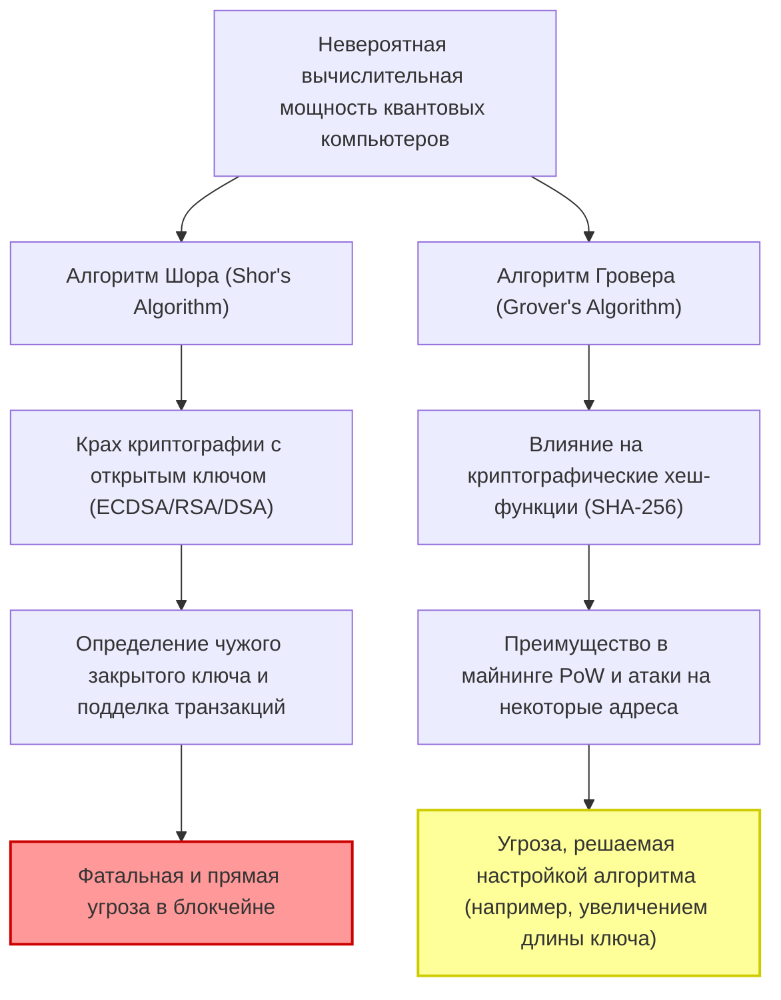
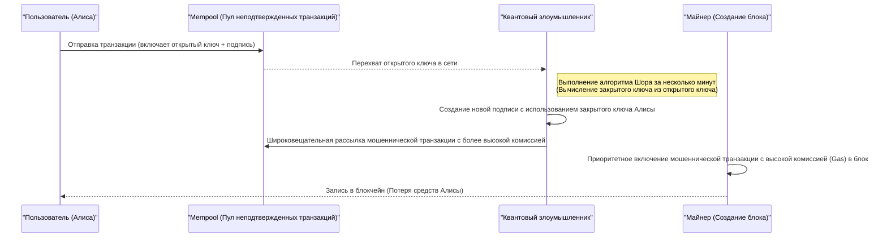
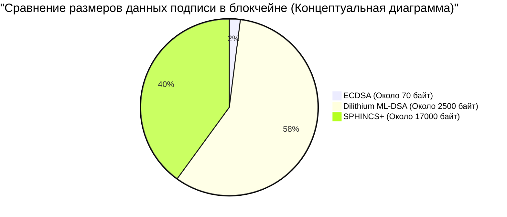

## 1. Введение: Приближение постквантовой эры и кризис блокчейна

С момента создания Биткоина (Bitcoin) Сатоши Накамото в 2009 году, технология блокчейн выросла в основу финансовых систем и приложений по всему миру как «децентрализованный реестр, устойчивый к фальсификациям». Эта надежная безопасность опирается на современную криптографию: **криптографию с открытым ключом (Public Key Cryptography)** и **криптографические хеш-функции (Cryptographic Hash Functions)**.

Эти криптографические технологии гарантируют безопасность на основе математической «вычислительной сложности», подразумевающей, что классическим компьютерам (ПК и суперкомпьютерам, которые мы используем сегодня) потребовалось бы время, сравнимое с возрастом Вселенной, для их взлома.

Однако это предположение вот-вот будет фундаментально опровергнуто стремительным развитием и практическим применением **квантовых компьютеров (Quantum Computers)** — передового рубежа физики и информатики. Используя квантово-механические явления, такие как «суперпозиция (Superposition)» и «квантовая запутанность (Entanglement)», квантовые компьютеры демонстрируют вычислительную мощь, превосходящую традиционные классические компьютеры в определенных математических задачах, что называется «квантовым превосходством (Quantum Supremacy)».

В этой статье мы глубоко и детально, с технической и математической точек зрения, рассмотрим, с какими конкретными угрозами со стороны квантовых компьютеров сталкивается технология блокчейн, а также новейшие тенденции в области **постквантовой криптографии (PQC: Post-Quantum Cryptography)** как решения этой проблемы, и сценарии миграции криптовалютных сетей.

---

## 2. Основы квантовых компьютеров и две главные угрозы для блокчейна

Современные блокчейн-системы в основном состоят из следующих двух криптографических элементов, каждый из которых подвержен различным угрозам со стороны квантовых алгоритмов.

### 2.1. Основы криптографии на эллиптических кривых (ECDSA) и вычислительная сложность

Многие блокчейны, включая Bitcoin и Ethereum, используют **алгоритм цифровой подписи на эллиптических кривых (ECDSA: Elliptic Curve Digital Signature Algorithm)** в качестве алгоритма цифровой подписи. В частности, Биткоин использует эллиптическую кривую с параметрами `secp256k1`.

Безопасность криптографии на эллиптических кривых зависит от вычислительной сложности **задачи дискретного логарифмирования на эллиптической кривой (ECDLP: Elliptic Curve Discrete Logarithm Problem)**.
Эллиптическая кривая определяется уравнением в нормальной форме Вейерштрасса:

$$
y^2 \equiv x^3 + ax + b \pmod{p}
$$

В `secp256k1` Биткоина $a = 0, b = 7$, а $p$ — очень большое простое число.
Пусть базовая точка на этой кривой равна $G$, а закрытый ключ $k$ — это огромное случайно выбранное 256-битное целое число. Тогда открытый ключ $K$ находится путем сложения базовой точки $G$ с самой собой $k$ раз (скалярное умножение).

$$
K = k \times G = \underbrace{G + G + \dots + G}_{k \text{ раз}}
$$

Использование классического компьютера для обратного вычисления закрытого ключа $k$ (нахождение дискретного логарифма) из известного открытого ключа $K$ и базовой точки $G$ требует экспоненциального времени вычислений $\mathcal{O}(\sqrt{p})$ даже при использовании лучших классических алгоритмов, таких как ро-алгоритм Полларда. Для 256-битного ключа потребуется около $2^{128}$ операций, что является уровнем, который современные суперкомпьютеры не смогли бы решить, даже проработав миллиарды лет.

### 2.2. Крах из-за алгоритма Шора (Shor's Algorithm)

Однако **алгоритм Шора**, опубликованный Питером Шором в 1994 году, полностью разрушил это предположение. Изначально алгоритм Шора был предложен для решения задачи факторизации (основы криптографии RSA) за полиномиальное время, но он также применим к задаче дискретного логарифмирования и задаче дискретного логарифмирования на эллиптической кривой.

Суть алгоритма Шора заключается в использовании **квантового преобразования Фурье (QFT: Quantum Fourier Transform)** для быстрого нахождения «периода (Period)» функции.

$$
\text{Классическая сложность вычислений} = \mathcal{O}(2^{n/2}) \quad (n\text{ — длина в битах})
$$
$$
\text{Сложность квантового алгоритма} = \mathcal{O}(n^3)
$$

Таким образом, алгоритм Шора радикально сокращает время с экспоненциального до **полиномиального (Polynomial Time)**. Если будет создан квантовый компьютер с достаточным количеством логических кубитов, он сможет определить закрытый ключ $k$ из опубликованного в сети открытого ключа $K$ за несколько минут или секунд. Это позволит злоумышленникам легко получать закрытые ключи от чужих кошельков и полностью контролировать их средства.

#### 2.2.1 Пошаговый взлом ECDLP с помощью алгоритма Шора

Давайте шаг за шагом рассмотрим внутренний процесс того, как квантовый компьютер решает задачу дискретного логарифмирования на эллиптической кривой (ECDLP).

Постановка задачи: В $K = k \times G$, где $G$ и $K$ известны, мы хотим найти неизвестное целое число $k$ (закрытый ключ). Пусть порядок эллиптической кривой равен $N$.

**Шаг 1: Создание состояния суперпозиции**
Сначала мы подготавливаем два квантовых регистра и применяем к каждому из них вентиль Адамара (Hadamard Gate), чтобы создать состояние суперпозиции всех возможных комбинаций целых чисел.
$$
|\psi_1\rangle = \frac{1}{N} \sum_{x=0}^{N-1} \sum_{y=0}^{N-1} |x\rangle |y\rangle |0\rangle
$$

**Шаг 2: Применение квантового оракула (вычисление функции)**
Затем с помощью квантовой цепи (оракула), которая выполняет сложение точек на эллиптической кривой, мы вычисляем функцию $f(x, y) = x \times G + y \times K$ в третьем регистре.
$$
|\psi_2\rangle = \frac{1}{N} \sum_{x=0}^{N-1} \sum_{y=0}^{N-1} |x\rangle |y\rangle |x \times G + y \times K\rangle
$$
Здесь важно то, что, поскольку $K = k \times G$, это можно переписать как $f(x, y) = (x + y \cdot k) \times G$.

**Шаг 3: Измерение третьего регистра**
Когда мы измеряем третий регистр, он коллапсирует в некоторую точку $R$ на эллиптической кривой. В результате первый и второй регистры коллапсируют в состояние суперпозиции пар $(x, y)$, которые удовлетворяют условию $x + y \cdot k \equiv c \pmod{N}$ (где $c$ — константа).
$$
|\psi_3\rangle = \frac{1}{\sqrt{N}} \sum_{y=0}^{N-1} |c - y \cdot k \pmod{N}\rangle |y\rangle
$$

**Шаг 4: Применение квантового преобразования Фурье (QFT)**
Это состояние имеет периодичность, связанную с периодом $k$. Применяя к нему обратное квантовое преобразование Фурье (Inverse QFT), мы вызываем фазовую интерференцию и преобразуем информацию о периоде в амплитуду.

**Шаг 5: Измерение и классическая постобработка**
Когда мы измеряем первый и второй регистры, с высокой вероятностью получается значение, содержащее информацию о $k$. Применяя классические теоретико-числовые алгоритмы, такие как разложение в непрерывные дроби (Continued Fractions), к измеренным значениям, можно полностью определить неизвестный закрытый ключ $k$.

Количество квантовых вентилей, требуемых для всего этого процесса, составляет $\mathcal{O}(\log^3 N)$, что позволяет раскрывать закрытые ключи с молниеносной скоростью по сравнению с классическим поиском компьютера за $\mathcal{O}(\sqrt{N})$.

### 2.3. Алгоритм Гровера (Grover's Algorithm) и влияние на хеш-функции

Еще одна угроза — **алгоритм Гровера**, предложенный Ловом Гровером в 1996 году. Он оказывает значительное влияние на хеш-функции (например, SHA-256).

В блокчейне хеш-функции используются для обеспечения целостности данных, генерации адресов, а также в качестве основы для майнинга **PoW (Proof of Work)** в Биткоине. Обратное вычисление хеш-функции (нахождение прообраза) можно рассматривать как «задачу поиска в неструктурированной базе данных», где ищется входное значение $x$, для которого $H(x) = y$ при заданном выходном значении $y$.

На классическом компьютере, чтобы найти правильный ответ из $N$ вариантов, требуется в среднем $\frac{N}{2}$ и в худшем случае $N$ попыток. Иными словами, сложность составляет $\mathcal{O}(N)$.
Однако алгоритм Гровера использует квантовый метод, называемый «усилением амплитуды (Amplitude Amplification)». Итеративно усиливая амплитуду вероятности правильного состояния среди всех возможных состояний в суперпозиции, он сокращает время поиска до квадратного корня.

$$
\text{Сложность алгоритма Гровера} = \mathcal{O}(\sqrt{N})
$$

Для SHA-256 $N = 2^{256}$, поэтому классический поиск полным перебором требует около $2^{256}$ попыток. Однако при использовании алгоритма Гровера потребуется всего $\sqrt{2^{256}} = 2^{128}$ попыток. Это означает, что для квантового компьютера криптографическая стойкость 256-битной хеш-функции **фактически снижается вдвое, до уровня 128 бит**.

#### 2.3.1. Выживет ли SHA-256? (Quantum Supremacy in Hashing)

Хотя безопасность уменьшается вдвое, «128-битная безопасность» все еще остается чрезвычайно надежной. $2^{128}$ операций — это астрономическое число даже при нынешнем уровне технологий, для выполнения которого потребуется время в масштабах жизни Вселенной.
Поэтому широко распространено мнение, что **«SHA-256 сохранит практическую безопасность даже против квантовых компьютеров»**. Если в будущем потребуется увеличить запас прочности безопасности, то простое удвоение длины выходного хеша (например, переход от SHA-256 к SHA-512) позволит сохранить 256-битный уровень классической безопасности в квантовом мире.

В заключение можно сказать, что квантовая угроза для хеш-функций «незначительна и решаема», тогда как угроза для криптографии с открытым ключом (ECDSA) является «фатальной».

---

## 3. Анализ конкретного влияния на современные криптоактивы (Bitcoin, Ethereum)

С какими конкретными уязвимостями столкнутся сети криптовалют в мире, где ECDSA можно будет взломать с помощью квантового компьютера? Здесь мы проведем подробный анализ на примере механизма Биткоина с точки зрения **«момента раскрытия открытого ключа»**.

### 3.1. Генерация адреса и «непубличность» открытого ключа

Адреса Биткоина (P2PKH: Pay-to-Public-Key-Hash или P2WPKH: Pay-to-Witness-Public-Key-Hash) не являются самими открытыми ключами, а представляют собой результат многократного хеширования открытого ключа.

$$
\text{Bitcoin Address} = \text{Base58Check}(\text{RIPEMD160}(\text{SHA256}(\text{Public Key})))
$$

Как упоминалось ранее, поскольку хеш-функции устойчивы к квантовым атакам (алгоритм Гровера), обратное вычисление исходного «открытого ключа» из хеш-значения («адреса») невозможно даже для квантового компьютера.
То есть, для **«неиспользованных адресов (с которых никогда не отправлялись средства)»** открытый ключ вообще не представлен в блокчейне, записано только хеш-значение. Таким образом, пока открытый ключ неизвестен, не существует цели для выполнения алгоритма Шора, и закрытый ключ не может быть определен. Кошелек в этом состоянии можно считать квантово-безопасным (Quantum-safe).

### 3.2. Фатальная уязвимость при отправке транзакции (атака фронтраннинга)

Проблема возникает в тот момент, когда пользователь отправляет средства.
При широковещательной рассылке (отправке) транзакции в сеть пользователь должен включить **свой открытый ключ в данные транзакции и опубликовать его для всей сети** для проверки вместе с цифровой подписью.

Как только открытый ключ попадает в Mempool (место ожидания неподтвержденных транзакций), эти данные передаются узлам по всему миру. Если у злоумышленника есть сверхбыстрый квантовый компьютер, он может украсть средства с помощью следующего процесса:

1. Перехватить транзакцию легитимного пользователя (Алисы) в Mempool и **извлечь открытый ключ**.
2. Выполнить алгоритм Шора и **вычислить закрытый ключ из открытого ключа за несколько минут** (до того, как блок будет подтвержден).
3. Используя полученный закрытый ключ, **создать фальшивую транзакцию**, которая переводит средства Алисы на адрес злоумышленника.
4. Отправить эту фальшивую транзакцию в сеть с **гораздо более высокой комиссией майнеру (Fee)**, чем у исходной транзакции Алисы.

Майнеры, следуя экономическим стимулам, будут отдавать приоритет транзакциям с более высокими комиссиями при их включении в блок. В результате мошеннический перевод злоумышленника будет подтвержден (Confirm) первым, а законный перевод Алисы будет отклонен как попытка «двойной траты (Double Spend)».
Эта последовательность действий называется **атакой фронтраннинга (Front-running Attack)**, и в мире, где квантовые компьютеры станут реальностью, это приведет к ужасающей ситуации, когда средства будут украдены хакерами в ту же секунду, как кто-то нажмет кнопку «отправить».

### 3.3. Опасность повторного использования адресов и старых адресов (P2PK)

Еще более серьезная проблема заключается в том, что адреса, которые использовались для перевода средств хотя бы раз в прошлом (например, повторно используемые в качестве адресов для сдачи), уже навсегда сохранили свой открытый ключ в блокчейне. Эти адреса находятся под угрозой того, что их закрытый ключ будет вычислен, а баланс украден в любой момент, даже без ожидания отправки транзакции.

Кроме того, в формате **P2PK (Pay-to-Public-Key)**, который был популярен примерно в 2009–2010 годах, открытый ключ напрямую записывался в блокчейн в качестве адреса, а не его хеш. Сюда входят ранние награды Сатоши Накамото за майнинг (более 1 миллиона BTC). Эти огромные запасы «спящих» биткоинов станут самой легкой мишенью для квантовых компьютеров; они могут быть украдены все разом и сброшены на рынок, что приведет к катастрофическому обвалу цен.

---

## 4. Сценарий перехода на постквантовую криптографию (PQC: Post-Quantum Cryptography)

Чтобы избежать катастрофы «Q-Day» (дня, когда квантовые компьютеры взломают криптографию), криптографическое сообщество и сообщество блокчейна планируют переход на **постквантовую криптографию (PQC)**, которую трудно взломать даже с помощью квантовых алгоритмов.
Национальный институт стандартов и технологий США (NIST) на протяжении многих лет проводит процесс стандартизации PQC, и после нескольких раундов строгой оценки несколько перспективных схем шифрования были выбраны в качестве окончательных стандартов.

Ниже приводится подробное описание, включая математические механизмы, основных алгоритмов PQC, которые привлекают внимание как альтернативы цифровым подписям в блокчейне.

### 4.1. Подписи на основе хешей (Hash-Based Signatures)

Подписи на основе хешей — это криптографическая схема, безопасность которой зависит исключительно от очень простой и надежной основы: «устойчивости хеш-функций к коллизиям». Поскольку устойчивость хеш-функций к квантовым компьютерам уже доказана (как упоминалось ранее, запаса безопасности в 128 бит вполне достаточно), это очень надежный подход.
Типичными примерами являются **подпись Лэмпорта (Lamport Signatures)**, ее расширение WOTS (Winternitz One-Time Signature), а также кандидат на стандартизацию NIST **SPHINCS+** (в настоящее время называемый SLH-DSA в рамках FIPS 205).

#### 4.1.1. Математические детали подписи Лэмпорта (One-Time Signature)

Давайте подробнее рассмотрим математику подписи Лэмпорта.
Пусть хеш-функция будет $H: \{0, 1\}^* \to \{0, 1\}^{256}$.

**[Генерация ключей]**
Алиса (отправитель) использует аппаратный генератор случайных чисел (TRNG) для генерации 256 пар закрытых ключей.
$$
\text{sk}_{i,0} \in \{0, 1\}^{256}, \quad \text{sk}_{i,1} \in \{0, 1\}^{256} \quad (1 \le i \le 256)
$$
В результате закрытый ключ $\text{sk}$ состоит в общей сложности из 512 строк по 256 бит (размер: $512 \times 32 = 16 384$ байта).

Затем она вычисляет открытый ключ $\text{pk}$. Каждый компонент закрытого ключа хешируется.
$$
\text{pk}_{i,0} = H(\text{sk}_{i,0}), \quad \text{pk}_{i,1} = H(\text{sk}_{i,1})
$$
Размер открытого ключа также составляет $16 384$ байта. Он публикуется в сети блокчейн.

**[Создание подписи]**
Чтобы подписать данные транзакции $M$, Алиса сначала вычисляет их хеш-значение.
$$
h = H(M) \in \{0, 1\}^{256}
$$
Обозначим $i$-й бит хеш-значения $h$ как $h_i \in \{0, 1\}$.
Подпись Алисы $\sigma$ представляет собой набор компонентов закрытого ключа, соответствующих каждому биту $h_i$.
$$
\sigma = (\text{sk}_{1, h_1}, \text{sk}_{2, h_2}, \dots, \text{sk}_{256, h_{256}})
$$
То есть, если бит хеша сообщения равен `0`, раскрывается $\text{sk}_{i,0}$, а если он равен `1`, раскрывается $\text{sk}_{i,1}$. Размер подписи составит $256 \times 32 = 8 192$ байта.

**[Проверка подписи]**
Майнер (проверяющий) использует полученную транзакцию $M$, подпись $\sigma = (s_1, s_2, \dots, s_{256})$ и открытый ключ $\text{pk}$ для проверки.
Он заново вычисляет хеш транзакции $h = H(M)$ и проверяет, совпадает ли хеш каждого $s_i$ с соответствующим элементом открытого ключа $\text{pk}_{i, h_i}$.
$$
H(s_i) \overset{?}{=} \text{pk}_{i, h_i} \quad (\text{для всех } 1 \le i \le 256)
$$

Этот процесс математически предельно прост, и до тех пор, пока квантовый компьютер не сможет вычислить обратную функцию $H$, подделать подпись невозможно. Однако после однократного подписания половина закрытого ключа раскрывается в сети, и если та же пара ключей будет использована для подписания другого сообщения, комбинация раскрытых закрытых ключей даст злоумышленнику возможность подделать подпись. Отсюда возникает строгое ограничение на использование ключа **только один раз (One-Time)**.
Для практического применения были разработаны такие технологии, как **XMSS**, использующая деревья Меркла для объединения множества одноразовых ключей в один корневой открытый ключ, и **SPHINCS+** без сохранения состояния (stateless), но они имеют недостаток в виде размера подписей, достигающего десятков килобайт.

### 4.2. Криптография на решетках (Lattice-Based Cryptography)

В настоящее время наиболее перспективным направлением PQC, принятым в качестве основного стандарта NIST (FIPS 204: ML-DSA / ранее CRYSTALS-Dilithium, а также Falcon и др.), является **криптография на решетках**.

Безопасность криптографии на решетках основана на математически доказанных сложных задачах, таких как «задача о кратчайшем векторе в многомерной решетке (SVP: Shortest Vector Problem)» и «задача обучения с ошибками (LWE: Learning With Errors)». Алгоритмов для эффективного решения задач на решетках не найдено даже для квантовых компьютеров.

**Математическая модель LWE (Learning With Errors):**
Основная идея задачи LWE заключается в том, что намеренное добавление «небольшого шума (ошибок)» в систему линейных уравнений делает задачу экспоненциально сложнее.
Пусть секретный вектор $\mathbf{s} \in \mathbb{Z}_q^n$.
Имеется огромная случайно выбранная открытая матрица $\mathbf{A} \in \mathbb{Z}_q^{m \times n}$ и вектор небольшого шума $\mathbf{e} \in \mathbb{Z}_q^m$, который добавляется намеренно.
Открытый ключ $\mathbf{b}$ вычисляется следующим образом:

$$
\mathbf{b} = \mathbf{A}\mathbf{s} + \mathbf{e} \pmod{q}
$$

Даже если матрица $\mathbf{A}$ и вектор $\mathbf{b}$ (открытый ключ) известны, вычислить из них закрытый ключ $\mathbf{s}$ чрезвычайно сложно из-за наличия шума $\mathbf{e}$. Без шума задачу можно было бы решить простым методом Гаусса, но присутствие шума приводит к взрывному росту пространства поиска во всех измерениях, обеспечивая надежную безопасность как против классических, так и против квантовых компьютеров.
В реальных алгоритмах, используемых в блокчейне (таких как Dilithium), применяется **Ring-LWE (или Module-LWE)**, развернутая над кольцом многочленов, что позволяет уменьшить размер ключа и ускорить вычисления.

* **Преимущества**: По сравнению с подписями на основе хешей размер открытого ключа и подписи относительно невелик (несколько килобайт), а скорость генерации и проверки подписи очень высока (на уровне ECDSA или даже быстрее).
* **Недостатки**: Математическая структура сложна, и история тестирования относительно коротка, поэтому риск того, что в будущем будет обнаружен новый алгоритм дешифрования, не равен нулю.

---

## 5. Технические трудности перехода блокчейна на PQC

Наличие алгоритмов PQC (таких как Dilithium или SPHINCS+) не означает, что их можно внедрить в Bitcoin или Ethereum прямо завтра. Существует ряд серьезных проблем, характерных для децентрализованных систем.

### 5.1. Раздувание размера подписей и коллапс масштабируемости

Самым большим препятствием для внедрения PQC является значительное увеличение размера данных.
В то время как текущий размер подписи ECDSA составляет около 70 байт, подпись Dilithium (ML-DSA) на основе решеток занимает около 2420–4595 байт (в зависимости от уровня безопасности), а размер открытого ключа превышает 1300 байт. Для SPHINCS+ на основе хешей размер только одной подписи достигает десятков тысяч байт.

Если бы Биткоин внедрил PQC при текущем пределе размера блока (около 4 МБ с учетом SegWit), количество транзакций, которое можно уместить в одном блоке, резко бы сократилось. Пропускная способность сети (TPS: Transactions Per Second) катастрофически упала бы, а задержки при переводе стали бы нормой.
Для решения этой проблемы потребуется значительное увеличение размера блока, но это, в свою очередь, увеличит требования к хранилищу полных узлов (full nodes) и пропускной способности сети, что усложнит запуск узлов для обычных пользователей и, как следствие, приведет к дилемме — **централизации сети**.

*(※ Увеличение размера данных транзакций из-за внедрения PQC станет фатальным узким местом для масштабируемости)*

### 5.2. Влияние на Ethereum Virtual Machine (EVM) и предварительно скомпилированные смарт-контракты

В таких тьюринг-полных платформах смарт-контрактов, как Ethereum, внедрение PQC потребует фундаментального обновления EVM (виртуальной машины Ethereum).
В текущей версии EVM для проверки подписей ECDSA предусмотрен предварительно скомпилированный контракт (Precompiled Contract) под названием `ecrecover` (адрес: `0x01`), который оптимизирован для выполнения проверки с очень низкой комиссией (3000 Gas).

Однако процесс проверки для новых алгоритмов на решетках, таких как Dilithium или Falcon, включает сложные полиномиальные и матричные операции. Если их реализовать только с использованием существующих опкодов (Opcodes) EVM, одна проверка подписи может потреблять от нескольких миллионов до десятков миллионов единиц газа. Это уровень, при котором весь лимит газа блока (около 30 миллионов Gas) исчерпывается одной транзакцией.

Чтобы избежать этого, необходимо интегрировать новые предварительно скомпилированные контракты для проверки PQC (например, назначив DilithiumVerify на `0x10`) непосредственно в саму EVM через хардфорк сети. Это потребует длительного процесса, в ходе которого основные разработчики каждого клиента Ethereum (Geth, Nethermind, Erigon и др.) будут сотрудничать для оптимизации логики проверки криптографии на решетках на таких языках, как C++, Go или Rust, и проведения аудита безопасности.

### 5.3. Сложность достижения консенсуса через хардфорк

Изменение базового алгоритма подписи требует **хардфорка (Hard Fork)** — обновления протокола всей сети. Однако в сообществах, которые придают большое значение «неизменности правил и децентрализации», таких как Биткоин, процесс достижения консенсуса очень сложен с политической точки зрения. От момента предложения BIP (Bitcoin Improvement Proposal) о переходе на PQC до его внедрения, вероятно, потребуются годы обсуждений и тестирования.

---

## 6. Когда наступит «Q-Day»? Дорожная карта перехода

Когда наступит «день, когда квантовые компьютеры полностью взломают 256-битную криптографию на эллиптических кривых (Q-Day)»?
Хотя мнения исследователей расходятся, многие эксперты прогнозируют, что масштабные квантовые компьютеры с тысячами или десятками тысяч стабильных логических кубитов (с исправлением ошибок и устойчивостью к шуму) появятся в период **«с середины 2030-х до 2040-х годов»**. Однако, в зависимости от прорывов в архитектуре аппаратного обеспечения или открытия более эффективных квантовых алгоритмов, нельзя исключать, что это может произойти и раньше (около 2030 года).

Дорожная карта, которой должна следовать экосистема криптоактивов, пока не стало слишком поздно, выглядит следующим образом:

### Фаза 1: Гибридные подписи и абстракция аккаунта (От настоящего момента до ~2028 года)
В текущей сфере блокчейна, особенно среди разработчиков Ethereum (таких как Виталик Бутерин), рассматриваются **«гибридные подписи»**, сочетающие ECDSA и PQC (подписи на основе хешей или на решетках). Это подход, при котором к транзакции прикрепляются как существующая безопасная подпись ECDSA, так и подпись PQC, обеспечивая безопасность, даже если одна из них будет взломана.
Кроме того, благодаря использованию абстракции аккаунта (Account Abstraction, ERC-4337), предпринимаются усилия по внедрению и поддержке подписей PQC в смарт-контрактных кошельках по принципу opt-in (только для желающих пользователей) без ожидания хардфорка на уровне протокола.

### Фаза 2: Использование доказательств с нулевым разглашением (ZK-Rollups) (С 2025 года)
Ожидается, что козырем для решения самой большой слабости PQC — «раздувания данных подписи» — станет использование технологии масштабирования второго уровня (Layer 2) **ZK-Rollups (Доказательства с нулевым разглашением)**.
Вместо того, чтобы записывать огромные данные подписей PQC непосредственно в Layer 1 (основную цепь), большое количество PQC-транзакций будет проверяться и агрегироваться на Layer 2. Затем с помощью ZK-SNARKs или ZK-STARKs они будут сжиматься в одни крошечные «данные доказательства (Proof)» и записываться в Layer 1.
Поскольку некоторые конфигурации SNARKs (например, Groth16) сами по себе уязвимы к квантовым атакам, ключом станет использование **ZK-STARKs**, безопасность которых опирается исключительно на хеш-функции, обладающие квантовой устойчивостью.

### Фаза 3: Хардфорк на уровне протокола (Около 2030 года)
Когда стандартизация PQC от NIST будет полностью закреплена, а отраслевые стандарты библиотек станут доступны и достаточно протестированы, ожидается проведение хардфорков в основных сетях, таких как Bitcoin и Ethereum, для полного перехода на PQC в качестве метода цифровой подписи по умолчанию. В течение этого переходного периода будут проводиться масштабные кампании, призывающие пользователей «перевести свои средства со старых кошельков на новые кошельки с поддержкой PQC».

### Примеры новаторских проектов

Некоторые блокчейн-проекты предвидели эту квантовую угрозу и с самого начала разрабатывались с заявленной квантовой устойчивостью.
* **QRL (Quantum Resistant Ledger)**: Ранний блокчейн, в котором на уровне протокола изначально реализована схема PQC на основе хешей под названием XMSS (eXtended Merkle Signature Scheme).
* **Algorand / Cellframe**: Проекты с гибкой модульной архитектурой криптографического уровня, которые готовятся к будущим обновлениям PQC и активно изучают возможности интеграции криптографии на решетках.

---

## 7. Заключение: Будущее криптоактивов и защита наших средств

Наступление «постквантовой эры» выходит за рамки научной фантастики и уже стало реальной технической проблемой для современных криптографических систем, стоящей прямо перед нами.

Два «меча» квантовых вычислений — алгоритмы Шора и Гровера — угрожают основе современных блокчейнов: криптографии с открытым ключом и хеш-функциям соответственно. В частности, уязвимость ECDSA является фатальной, и чтобы избежать риска кражи средств с помощью атак фронтраннинга, переход на постквантовую криптографию (PQC) абсолютно неизбежен.

Однако технологическая отрасль и блокчейн-сообщество не сидят сложа руки в ожидании краха. Процесс выбора и стандартизации алгоритмов PQC, таких как криптография на решетках и подписи на основе хешей, неуклонно продвигается вперед, и использование доказательств с нулевым разглашением (ZK-STARKs) и технологий масштабирования Layer 2 открывает путь к преодолению самого большого барьера для внедрения PQC — «раздувания размера данных».

Обычным пользователям криптовалют и инвесторам не нужно паниковать и продавать все свои средства прямо сейчас. Однако важно иметь базовую техническую грамотность и осознавать необходимость самозащиты:

* **Избегать повторного использования адресов**: Из соображений не только конфиденциальности, но и безопасности, избегайте длительного хранения средств на «использованных адресах (с которых хотя бы раз отправлялись средства, и чей открытый ключ раскрыт в блокчейне)».
* **Следить за технологическими тенденциями**: Будьте в курсе обсуждений перехода на PQC, таких как BIP в Биткоине или EIP в Ethereum, а также новостей о хардфорках, чтобы вовремя перевести свои средства на новые кошельки, когда это потребуется.

История блокчейна — это также история обновлений и устойчивости (resilience) перед лицом новых технологических угроз. Подобно тому, как экосистема преодолела проблемы масштабируемости и экологические проблемы (например, переход от PoW к PoS), она, несомненно, найдет решения и адаптируется к этой беспрецедентной квантовой угрозе.
Остается надеяться на будущее, в котором новая мудрость человечества — квантовые компьютеры — и технология доверия — децентрализованный распределенный реестр — не уничтожат друг друга при столкновении, а сольются в более совершенную и надежную систему на более высоком уровне.

---
*Ссылки и сопутствующие материалы:*
* National Institute of Standards and Technology (NIST) - Post-Quantum Cryptography Standardization Project
* Shor, P. W. (1994). Algorithms for quantum computation: discrete logarithms and factoring.
* Grover, L. K. (1996). A fast quantum mechanical algorithm for database search.
* Buterin, V. (2024). How to hard-fork to save most users' funds in a quantum emergency.
