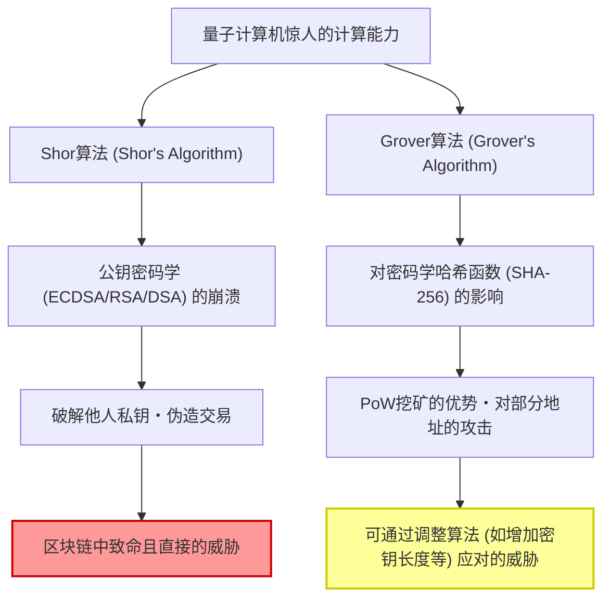
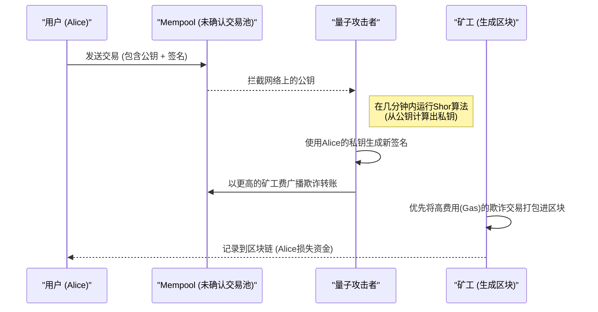
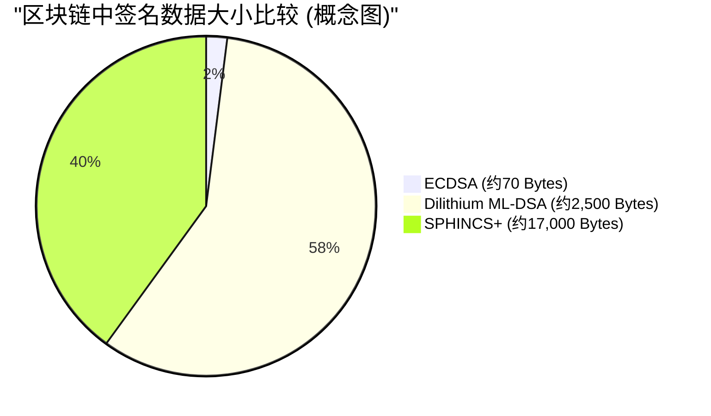

## 1. 引言：后量子时代的脚步声与区块链的危机

自2009年中本聪（Satoshi Nakamoto）创造比特币（Bitcoin）以来，区块链技术作为“去中心化且不可篡改的账本”，已成长为全球金融系统和应用程序的基础设施。支撑这种坚如磐石的安全性的是**公钥密码学（Public Key Cryptography）**和**密码学哈希函数（Cryptographic Hash Functions）**等现代密码技术。

这些密码技术保证安全性的依据是数学上的“计算困难性”，即使用经典计算机（我们现在使用的个人电脑和超级计算机），即使花费宇宙寿命般漫长的时间也无法破解。

然而，这一前提正随着物理学和信息科学的前沿领域——**量子计算机（Quantum Computers）**的快速发展和实用化，面临着被彻底颠覆的危险。利用量子力学特有的“叠加态（Superposition）”和“量子纠缠（Entanglement）”，量子计算机在某些特定数学问题上展现出压倒传统经典计算机的计算能力，即所谓的“量子霸权（Quantum Supremacy）”。

本文将深入探讨区块链技术具体面临着量子计算机的哪些威胁，并从技术和数学的角度，彻底解析作为解决方案的**抗量子计算密码学（PQC：Post-Quantum Cryptography）**的最新动态，以及加密资产网络的过渡方案。

---

## 2. 量子计算机的基础及对区块链的两大威胁

当前的区块链系统主要由以下两种密码要素构成，它们分别面临着不同量子算法的威胁。

### 2.1. 椭圆曲线密码学（ECDSA）的基础与计算困难性

包括比特币和以太坊（Ethereum）在内的许多区块链，都采用了**椭圆曲线数字签名算法（ECDSA：Elliptic Curve Digital Signature Algorithm）**作为其数字签名算法。具体而言，比特币使用的是参数名为 `secp256k1` 的椭圆曲线。

椭圆曲线密码学的安全性依赖于**椭圆曲线离散对数问题（ECDLP：Elliptic Curve Discrete Logarithm Problem）**的计算困难性。
椭圆曲线由以下Weierstrass标准形式的方程定义：

$$
y^2 \equiv x^3 + ax + b \pmod{p}
$$

在比特币的 `secp256k1` 中，$a = 0, b = 7$，且 $p$ 是一个极大的素数。
设该曲线上的一基点（参考点）为 $G$，随机选择的256位巨大整数（私钥）为 $k$。此时，公钥 $K$ 可以通过对基点进行 $k$ 次加法（标量乘法）求得。

$$
K = k \times G = \underbrace{G + G + \dots + G}_{k \text{ 次}}
$$

使用经典计算机，从公开的公钥 $K$ 和基点 $G$ 反推私钥 $k$（求解离散对数），即使使用Pollard's rho算法等最佳经典算法，也需要 $\mathcal{O}(\sqrt{p})$ 的指数级计算时间。对于256位的密钥，大约需要进行 $2^{128}$ 次运算，这即使让目前的超级计算机运行几十亿年也无法破解。

### 2.2. Shor算法（Shor's Algorithm）导致的崩溃

然而，彼得·肖尔（Peter Shor）在1994年提出的**Shor算法**彻底打破了这一前提。Shor算法最初是为了在多项式时间内解决整数分解问题（RSA密码的基础）而提出的，但它同样适用于离散对数问题和椭圆曲线离散对数问题。

Shor算法的核心在于利用**量子傅里叶变换（QFT：Quantum Fourier Transform）**来快速找到函数的“周期（Period）”。

$$
\text{经典计算的复杂度} = \mathcal{O}(2^{n/2}) \quad (n\text{为位长})
$$
$$
\text{量子算法的复杂度} = \mathcal{O}(n^3)
$$

这样，Shor算法将指数级的时间急剧缩短到了**多项式时间（Polynomial Time）**。一旦拥有足够多逻辑量子比特的量子计算机问世，攻击者就能在几分钟甚至几秒钟内，从网络上公开的公钥 $K$ 中推导出私钥 $k$。这将使攻击者能够轻易获取他人钱包的私钥，从而完全控制其资金。

#### 2.2.1 Shor算法破解ECDLP的分步解析

让我们逐步了解量子计算机是如何解决椭圆曲线离散对数问题（ECDLP）的。

问题设定：在 $K = k \times G$ 中，$G$ 和 $K$ 已知，求未知的整数 $k$（私钥）。设椭圆曲线的阶为 $N$。

**Step 1: 创建叠加态**
首先，准备两个量子寄存器，并分别应用阿达马门（Hadamard Gate），创建所有可能整数组合的叠加态。
$$
|\psi_1\rangle = \frac{1}{N} \sum_{x=0}^{N-1} \sum_{y=0}^{N-1} |x\rangle |y\rangle |0\rangle
$$

**Step 2: 应用量子预言机（函数评估）**
接着，使用执行椭圆曲线点加法的量子电路（预言机），在第三个寄存器中计算函数 $f(x, y) = x \times G + y \times K$。
$$
|\psi_2\rangle = \frac{1}{N} \sum_{x=0}^{N-1} \sum_{y=0}^{N-1} |x\rangle |y\rangle |x \times G + y \times K\rangle
$$
这里的关键是，由于 $K = k \times G$，因此可以重写为 $f(x, y) = (x + y \cdot k) \times G$。

**Step 3: 测量第三个寄存器**
当测量第三个寄存器时，它会坍缩到椭圆曲线上的某个点 $R$。此时，第一和第二个寄存器会坍缩到满足 $x + y \cdot k \equiv c \pmod{N}$（$c$ 为常数）的 $(x, y)$ 组合的叠加态。
$$
|\psi_3\rangle = \frac{1}{\sqrt{N}} \sum_{y=0}^{N-1} |c - y \cdot k \pmod{N}\rangle |y\rangle
$$

**Step 4: 应用量子傅里叶变换（QFT）**
这个状态具有与周期 $k$ 相关的周期性。通过对其应用逆量子傅里叶变换（Inverse QFT），可以引起相位干涉，将周期信息转换为振幅。

**Step 5: 测量与经典后处理**
测量第一和第二个寄存器后，将以极高的概率获得包含 $k$ 相关信息的值。对测量出的值应用连分数展开（Continued Fractions）等经典的数论算法，就可以完全确定未知的私钥 $k$。

整个过程所需的量子门数量为 $\mathcal{O}(\log^3 N)$，它能以经典计算机 $\mathcal{O}(\sqrt{N})$ 搜索完全无法比拟的超高速度破解出私钥。

### 2.3. Grover算法（Grover's Algorithm）及对哈希函数的影响

另一个威胁是洛夫·格罗弗（Lov Grover）在1996年提出的**Grover算法**。这会对哈希函数（例如：SHA-256）产生重大影响。

在区块链中，哈希函数被用于保证数据的完整性、生成地址，以及作为比特币**PoW（工作量证明）挖矿**的基础。哈希函数的反向计算（原像计算）可以被视为一个“非结构化数据库搜索问题”，即寻找一个输入值 $x$，使得 $H(x)$ 等于某个特定的输出值 $y$。

在经典计算机中，要从 $N$ 个可能性中找到正确答案，平均需要 $\frac{N}{2}$ 次尝试，最坏情况下需要 $N$ 次尝试。即计算复杂度为 $\mathcal{O}(N)$。
然而，Grover算法使用了一种称为“振幅放大（Amplitude Amplification）”的量子技术。通过迭代放大处于叠加态的所有可能性中正确答案状态的概率振幅，将搜索时间缩短到其平方根。

$$
\text{Grover算法的计算复杂度} = \mathcal{O}(\sqrt{N})
$$

对于SHA-256而言，$N = 2^{256}$，因此经典的穷举搜索大约需要 $2^{256}$ 次尝试。但是，如果使用Grover算法，则只需要 $\sqrt{2^{256}} = 2^{128}$ 次尝试。这意味着，256位的哈希函数在面对量子计算机时，其**安全强度实质上减半至128位**。

#### 2.3.1. SHA-256 能否幸存？（哈希中的量子霸权）

尽管安全性减半，但“128位的安全性”依然极其坚固。即使从当前的技术水平来看，$2^{128}$ 次运算也是一个天文数字，需要耗费宇宙寿命级别的时间。
因此，业界普遍认为**“SHA-256 在面对量子计算机时依然能够保持实用的安全性”**。如果未来需要提高安全余量，只需简单地将哈希的输出长度加倍（例如从SHA-256迁移到SHA-512），就可以在量子世界中维持经典的256位安全性。

总而言之，可以说量子计算机对哈希函数的威胁是“轻微且可应对的”，而对公钥密码学（ECDSA）的威胁则是“致命的”。

---

## 3. 对当前加密资产（Bitcoin, Ethereum）的具体影响分析

在一个能够用量子计算机破解ECDSA的世界里，加密资产网络具体会面临怎样的漏洞呢？在这里，我们将以比特币的机制为例，从**“公钥暴露时机”**的角度进行详细分析。

### 3.1. 地址的生成与公钥的“非公开性”

比特币地址（如P2PKH: Pay-to-Public-Key-Hash 或 P2WPKH: Pay-to-Witness-Public-Key-Hash）并不是公钥本身，而是经过多次哈希处理后的公钥。

$$
\text{比特币地址} = \text{Base58Check}(\text{RIPEMD160}(\text{SHA256}(\text{公钥})))
$$

如前所述，哈希函数对量子攻击（Grover算法）具有抗性，因此即使是量子计算机，也无法从作为哈希值的“地址”反推出原始的“公钥”。
也就是说，对于**“未使用的地址（从未进行过资金发送的地址）”**，公钥完全没有暴露在区块链上，只记录了哈希值。因此，由于不知道公钥，Shor算法就没有执行的目标，也就无法计算出私钥。这种状态下的钱包可以说是量子安全的（Quantum-safe）。

### 3.2. 发送交易时的致命漏洞（抢跑攻击）

问题出现在用户发送资金的时候。
当向网络广播（发送）交易时，为了进行验证，用户必须附上数字签名，并**将自己的公钥包含在交易数据中，向整个网络公开**。

一旦公钥被发送到Mempool（未确认交易的等待区），该数据就会被全球的节点共享。如果攻击者拥有超高速的量子计算机，就可以通过以下过程盗取资金：

1. 从Mempool中拦截合法用户（Alice）的交易，并**提取公钥**。
2. 运行Shor算法，在**几分钟内（区块确认之前）**从公钥计算出私钥。
3. 使用获取的私钥，**创建一笔伪造的交易**，将Alice的资金发送到攻击者的地址。
4. 为这笔伪造的交易设置比Alice原交易**高得多的矿工费（Fee）**，并发送到网络中。

矿工受经济利益驱使，会优先将手续费高的交易打包进区块。结果就是，攻击者的欺诈转账被率先确认（Confirm），而Alice的合法转账则因“余额不足（Double Spend）”被丢弃。
这一系列流程被称为**抢跑攻击（Front-running Attack）**。在量子计算机普及的世界里，这会导致当有人按下发送按钮的瞬间，资金就会被黑客卷走的可怕局面。

### 3.3. 重用地址与旧地址（P2PK）的危机

更严重的问题是，那些过去哪怕只发送过一次资金的地址（例如被重复用作找零地址的情况），其公钥已经永久记录在区块链上了。这些地址根本不需要等待发送交易，随时都面临着被计算出私钥并盗走余额的风险。

此外，包括中本聪早期挖矿奖励（约100万枚以上的BTC）在内的，在2009年至2010年间主流的**P2PK（Pay-to-Public-Key）**格式中，公钥本身并没有经过哈希处理，而是直接作为地址记录在区块链上。这些大量休眠的比特币将成为量子计算机最容易攻击的目标，一旦被集中盗取并在市场上抛售，可能会引发价格的暴跌。

---

## 4. 向抗量子计算密码学（PQC: Post-Quantum Cryptography）的过渡方案

为了避免这种“Q-Day（量子计算机破解密码之日）”的灾难，密码学界和区块链社区正在计划向**抗量子计算密码学（PQC）**过渡，这种密码学即使使用量子算法也很难破解。
美国国家标准与技术研究院（NIST）多年来一直在推进PQC的标准化进程，经过多轮严格的评估，已选定了几种极具潜力的密码方案作为最终标准。

下面我们将结合数学机制，详细介绍有望替代区块链数字签名的主要PQC算法。

### 4.1. 基于哈希的签名（Hash-Based Signatures）

基于哈希的签名是一种仅依赖于“哈希函数的抗碰撞性”这一极其简单而坚固的基础的安全密码方案。如前所述，只要有128位的安全余量，哈希函数对量子计算机的安全性就已得到证明，因此这是一种非常可靠的方法。
代表性的算法包括**Lamport签名（Lamport Signatures）**、其扩展版WOTS（Winternitz One-Time Signature），以及NIST标准化候选算法**SPHINCS+**（现在称为FIPS 205，即SLH-DSA）。

#### 4.1.1. Lamport签名的数学细节（一次性签名）

让我们进一步从数学上详细了解Lamport签名的机制。
设哈希函数为 $H: \{0, 1\}^* \to \{0, 1\}^{256}$。

**【密钥生成】**
Alice（发送方）使用真随机数生成器（TRNG）生成256对私钥对。
$$
\text{sk}_{i,0} \in \{0, 1\}^{256}, \quad \text{sk}_{i,1} \in \{0, 1\}^{256} \quad (1 \le i \le 256)
$$
因此，私钥 $\text{sk}$ 共有512个256位的字符串（大小：$512 \times 32 = 16,384$ 字节）。

接下来计算公钥 $\text{pk}$。对每个私钥组件进行哈希处理。
$$
\text{pk}_{i,0} = H(\text{sk}_{i,0}), \quad \text{pk}_{i,1} = H(\text{sk}_{i,1})
$$
公钥同样为 $16,384$ 字节。将该公钥发布到区块链网络中。

**【签名生成】**
为了对交易数据 $M$ 进行签名，Alice首先计算其哈希值。
$$
h = H(M) \in \{0, 1\}^{256}
$$
设哈希值 $h$ 的第 $i$ 位为 $h_i \in \{0, 1\}$。
Alice的签名 $\sigma$ 就是与每一位 $h_i$ 相对应的私钥组件的集合。
$$
\sigma = (\text{sk}_{1, h_1}, \text{sk}_{2, h_2}, \dots, \text{sk}_{256, h_{256}})
$$
也就是说，如果消息哈希的某一位是 `0`，则公开 $\text{sk}_{i,0}$；如果是 `1`，则公开 $\text{sk}_{i,1}$。签名的大小为 $256 \times 32 = 8,192$ 字节。

**【签名验证】**
矿工（验证方）使用接收到的交易 $M$、签名 $\sigma = (s_1, s_2, \dots, s_{256})$ 以及公钥 $\text{pk}$ 进行验证。
重新计算交易的哈希值 $h = H(M)$，并检查对每个 $s_i$ 进行哈希处理后的结果是否与公钥中对应的元素 $\text{pk}_{i, h_i}$ 一致。
$$
H(s_i) \overset{?}{=} \text{pk}_{i, h_i} \quad (\text{对于所有 } 1 \le i \le 256)
$$

这个过程在数学上极其简单，只要量子计算机无法对 $H$ 进行逆向计算，就不可能伪造签名。但是，由于一旦签名，一半的私钥就会暴露在网络上，如果使用同一个密钥对为另一条消息签名，暴露的私钥组件就会增加，从而给攻击者留下伪造的余地。因此产生了“只能使用一次（One-Time）”的强限制。
为了使其能够投入实际应用，研究人员开发了使用默克尔树（Merkle Tree）将大量一次性密钥捆绑到一个根公钥上的**XMSS**技术，以及无状态的**SPHINCS+**等技术，但它们的缺点是签名大小动辄达到几十KB。

### 4.2. 基于格的密码学（Lattice-Based Cryptography）

目前作为PQC主流最受期待，并且被NIST采纳为主要标准规格（FIPS 204: ML-DSA / 前称CRYSTALS-Dilithium，以及Falcon等）的，就是**格密码学（Lattice-Based Cryptography）**。

格密码学的安全性依赖于“多维格中的最短向量问题（SVP: Shortest Vector Problem）”以及“带错学习问题（LWE: Learning With Errors）”等在数学上已被证明为困难的问题。即使使用量子计算机，目前也还没有发现能够有效解决格问题的算法。

**LWE（Learning With Errors）的数学模型：**
LWE问题的基本思路是，通过在联立一次方程组中故意加入“微小的噪声（误差）”，使得问题的求解变得极其困难。
设未知的秘密向量为 $\mathbf{s} \in \mathbb{Z}_q^n$。
有一个随机选择的巨大公开矩阵 $\mathbf{A} \in \mathbb{Z}_q^{m \times n}$，以及故意附加的微小噪声向量 $\mathbf{e} \in \mathbb{Z}_q^m$。
公钥 $\mathbf{b}$ 的计算方法如下：

$$
\mathbf{b} = \mathbf{A}\mathbf{s} + \mathbf{e} \pmod{q}
$$

即使矩阵 $\mathbf{A}$ 和向量 $\mathbf{b}$（公钥）是公开的，由于噪声 $\mathbf{e}$ 的存在，从中反推私钥 $\mathbf{s}$ 会变得极其困难。如果没有噪声，仅用高斯消元法就能解开；但加入了噪声之后，所有维度上的搜索空间将呈爆炸性增长，从而为对抗经典和量子计算机提供了坚固的安全性。
在区块链等实际使用的算法（如Dilithium等）中，会将此问题扩展到多项式环上（即**Ring-LWE**或**Module-LWE**），以减小密钥大小并提高计算速度。

* **优点**：与基于哈希的签名相比，其公钥和签名大小相对较小（几KB左右），而且签名生成和验证的计算速度非常快（等于或快于ECDSA）。
* **缺点**：数学结构复杂，且经过历史验证的时间较短，未来发现新的破解算法的风险并不为零。

---

## 5. 区块链向PQC过渡中的技术挑战

尽管PQC算法（如Dilithium或SPHINCS+等）已经存在，但这并不意味着我们明天就可以直接将其引入到比特币或以太坊中。分布式系统特有的许多沉重课题仍然存在。

### 5.1. 签名大小膨胀与可扩展性的崩溃

引入PQC面临的最大障碍是数据量的大幅膨胀。
目前的ECDSA签名大小约为70字节，而格密码学Dilithium（ML-DSA）的签名大小约为2,420到4,595字节（取决于安全级别），公钥大小也超过1,300字节。基于哈希的SPHINCS+的单个签名大小更是高达几万字节。

如果比特币在不改变现有区块大小上限（包含SegWit在内约4MB的权重）的情况下引入PQC，那么一个区块能容纳的交易数量将急剧下降。网络的吞吐量（TPS：Transactions Per Second）将遭到毁灭性打击，转账拥堵将成为常态。
为了解决这个问题，需要大幅提高区块大小，但这会增加全节点的存储和网络带宽要求，让个人运行节点变得更加困难，从而陷入导致**网络中心化**的困境。

*(※ 引入PQC带来的交易数据膨胀，将成为限制可扩展性的致命瓶颈)*

### 5.2. 对以太坊虚拟机（EVM）的影响及预编译合约

在像以太坊这样图灵完备的智能合约平台中，引入PQC需要对EVM（以太坊虚拟机）进行底层的升级。
在当前的EVM中，为了验证ECDSA签名，准备了一个名为 `ecrecover`（地址：`0x01`）的预编译合约（Precompiled Contract），它经过了优化，能以非常低的Gas费用（3000 Gas）执行签名验证。

然而，Dilithium或Falcon等新格密码算法的验证处理涉及复杂的多项式和矩阵运算，如果仅使用现有的EVM操作码（Opcode）来实现，一次签名验证可能就会消耗数百万甚至数千万Gas。这足以在单笔交易中就耗尽目前的区块Gas限制（约3000万Gas）。

为了避免这种情况，必须通过网络硬分叉，将用于验证PQC的新预编译合约（例如：将 `0x10` 分配给 DilithiumVerify）直接内置到EVM中。这需要各个以太坊客户端（如Geth、Nethermind、Erigon等）的核心开发者协同合作，在C++、Go、Rust等语言层面上优化实现格密码学验证逻辑，并进行安全审计，这是一个极其漫长的过程。

### 5.3. 硬分叉达成共识的困难性

要更改底层的签名算法，就必须进行**硬分叉（Hard Fork）**以更新整个网络的协议。然而，在一个像比特币这样极度重视“不改变规则、保持去中心化”的社区中，达成共识的过程在政治层面上是极其艰难的。关于过渡到PQC的BIP（比特币改进提案）从提出到最终实现，可能需要长达数年的讨论和测试。

---

## 6. “Q-Day”何时到来？ 过渡路线图

“量子计算机完全破解256位椭圆曲线密码学的日子（Q-Day）”究竟何时到来？
虽然研究人员之间存在分歧，但许多专家预测，拥有数千至数万个稳定的逻辑量子比特（具备容错和错误纠正能力的量子比特）的大规模量子计算机，将会在**“2030年代中期到2040年代”**出现。不过，如果硬件架构取得突破，或是发现了更高效的量子算法，这一时间表也有可能提前（2030年左右）。

加密资产的生态系统应当在为时已晚之前采取以下路线图：

### 阶段1：混合签名与账户抽象（现在〜2028年左右）
当前的区块链领域，尤其是以太坊的核心开发团队（如Vitalik Buterin等），正在探讨将ECDSA和PQC（基于哈希的签名或格密码学）相结合的**“混合签名”**方案。这是一种在交易中同时附加现有的、安全的ECDSA签名和PQC签名的方法，即使其中一种被破解也能保持安全性。
此外，借助账户抽象（Account Abstraction, ERC-4337），开发者正在努力让智能合约钱包能够在无需等待协议层硬分叉的情况下，选择性地（Opt-in，仅限有意愿的用户）实现和支持PQC签名。

### 阶段2：利用零知识证明（ZK-Rollups）（2025年〜）
作为解决PQC最大弱点——“签名数据膨胀”的王牌，业界寄希望于Layer 2技术的**ZK-Rollups（零知识证明）**。
不是将庞大的PQC签名数据直接写入Layer 1（主链），而是在Layer 2上验证并汇总大量PQC交易。然后，使用ZK-SNARKs或ZK-STARKs将它们压缩成一个极小的“证明数据（Proof）”，再将其记录到Layer 1中。
需要注意的是，部分SNARKs的构造（如Groth16等）本身也具有量子脆弱性，因此采用仅依赖具有抗量子能力的哈希函数的**ZK-STARKs**将成为关键。

### 阶段3：协议层面的硬分叉（2030年左右）
当NIST的PQC标准化完全落地，行业标准库也已齐备并经过充分测试后，预计Bitcoin和Ethereum等主流公链将进行硬分叉，把默认的签名方式完全迁移到PQC。在这一过渡期，各方将会进行大规模的宣发，呼吁用户“将资金从旧钱包转移到支持PQC的新钱包”。

### 先锋项目案例

一些区块链项目已经提前预见到了量子威胁，从初期阶段便打出抗量子特性进行开发。
* **QRL (Quantum Resistant Ledger)**：一个早期的区块链项目，在协议层原生实现了一种名为XMSS（扩展默克尔签名方案）的基于哈希的PQC。
* **Algorand / Cellframe**：这些项目采用了灵活的模块化密码层架构，着眼于未来的PQC升级，正在积极探索整合格密码学方案。

---

## 7. 结论：加密资产的未来与保护我们的资产

“后量子时代”的到来不再仅仅是科幻小说（SF）中的空想，它已经作为现实密码系统面临的具体技术挑战，逼近了我们的眼前。

Shor算法和Grover算法这两把量子计算机的利剑，分别威胁着当前区块链根基的公钥密码学和哈希函数。特别是ECDSA的漏洞是致命的，为了避免因抢跑攻击而导致资金被盗的风险，向抗量子计算密码学（PQC）过渡是绝对无法回避的道路。

然而，科技界和区块链社区并没有坐以待毙。格密码学和基于哈希的签名等PQC算法的选型和标准化正在稳步推进；通过利用零知识证明（ZK-STARKs）和Layer 2扩容技术，克服PQC引入最大障碍（数据大小膨胀）的路径也已初现端倪。

对于我们普通的加密资产用户和投资者而言，现在无需恐慌并立刻抛售所有资产。但重要的是，我们必须具备以下基本的认知和自我保护意识：

* **避免地址重用**：不仅出于隐私保护的考量，更应从安全性出发，坚决不在“已使用的地址（哪怕只发送过一次资金，公钥已暴露在区块链上的地址）”中长期存放资金。
* **关注技术动向**：时刻留意主要网络关于PQC迁移的讨论或硬分叉新闻（如Bitcoin的BIP、Ethereum的EIP等），确保在需要时能妥善完成钱包的迁移工作。

区块链的历史，也是一部不断应对新技术威胁进行升级与自我修复（Resilience）的历史。正如克服可扩展性问题和环境问题（从PoW转向PoS等）一样，面对这前所未有的量子威胁，整个生态系统也定会摸索出解决方案并成功适应。
我们有理由期待，量子计算机这一人类新智慧的结晶，与去中心化分布式账本这一信任技术的碰撞，将不会走向毁灭，而是升华为更高维度、更加坚不可摧的融合系统。

---
*参考文献・相关链接:*
* National Institute of Standards and Technology (NIST) - Post-Quantum Cryptography Standardization Project
* Shor, P. W. (1994). Algorithms for quantum computation: discrete logarithms and factoring.
* Grover, L. K. (1996). A fast quantum mechanical algorithm for database search.
* Buterin, V. (2024). How to hard-fork to save most users' funds in a quantum emergency.
