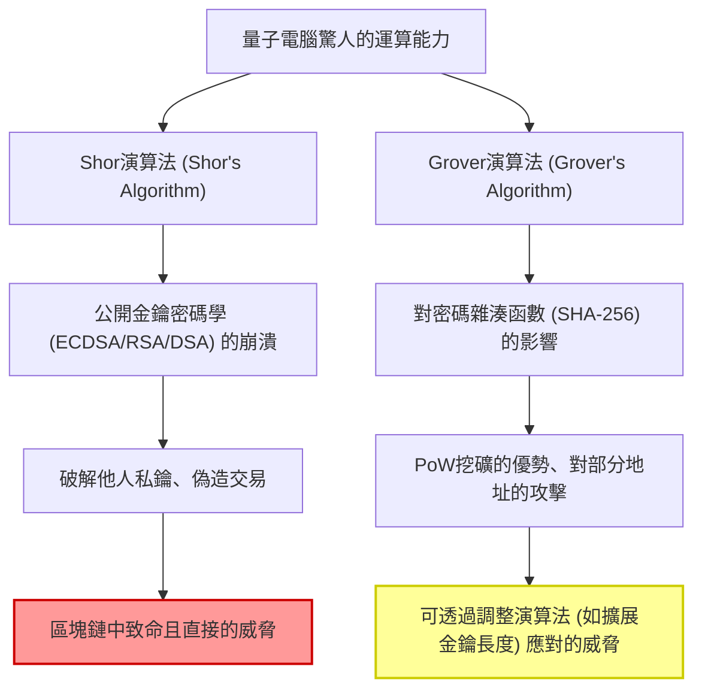
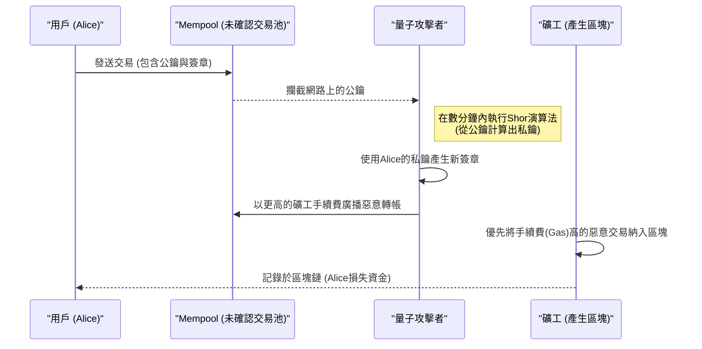
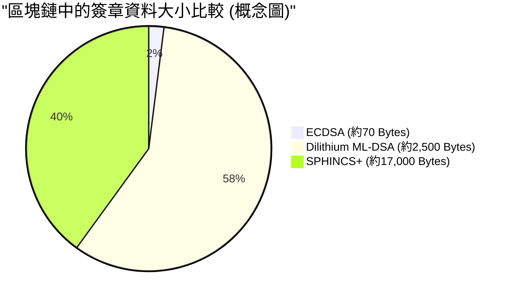

## 1. 簡介：後量子時代的腳步聲與區塊鏈的危機

自2009年中本聰（Satoshi Nakamoto）創造比特幣（Bitcoin）以來，區塊鏈技術作為「去中心化且不可篡改的帳本」，已發展成為全球金融系統與應用程式的基礎。支撐這種強大安全性的，正是**公開金鑰密碼學（Public Key Cryptography）**與**密碼雜湊函數（Cryptographic Hash Functions）**等現代密碼技術。

這些密碼技術的安全性，建立在數學上的「計算困難度」之上，即使是傳統電腦（我們目前使用的個人電腦或超級電腦）花費等同宇宙壽命的時間，也無法破解。

然而，這個前提正因為物理學與資訊科學的前沿——**量子電腦（Quantum Computers）**的快速發展與實用化，而面臨根本性的顛覆。利用量子力學特有的「疊加（Superposition）」與「量子糾纏（Entanglement）」特性的量子電腦，在特定數學問題上展現出壓倒傳統電腦的運算能力，也就是所謂的「量子霸權（Quantum Supremacy）」。

在本文中，我們將從技術與數學的角度，徹底深入探討區塊鏈技術具體面臨了量子電腦的哪些威脅，以及作為解決方案的**後量子密碼學（PQC：Post-Quantum Cryptography）**最新動態和加密資產網路的過渡方案。

---

## 2. 量子電腦的基礎與對區塊鏈的兩大威脅

目前的區塊鏈系統主要由以下兩種密碼元素構成，而它們各自面臨著不同量子演算法的威脅。

### 2.1. 橢圓曲線密碼學（ECDSA）的基礎與計算困難度

包括比特幣和以太坊（Ethereum）在內的許多區塊鏈，都採用**橢圓曲線數位簽章演算法（ECDSA：Elliptic Curve Digital Signature Algorithm）**作為數位簽章演算法。具體來說，比特幣使用的是名為 `secp256k1` 參數的橢圓曲線。

橢圓曲線密碼學的安全性依賴於**橢圓曲線離散對數問題（ECDLP：Elliptic Curve Discrete Logarithm Problem）**的計算困難度。
橢圓曲線由以下Weierstrass標準式的方程式定義：

$$
y^2 \equiv x^3 + ax + b \pmod{p}
$$

在比特幣的 `secp256k1` 中，$a = 0, b = 7$，且 $p$ 是一個非常大的質數。
假設曲線上的一個基點（基準點）為 $G$，隨機選擇一個256位元的巨大整數作為私鑰 $k$。此時，公鑰 $K$ 可透過將基點進行 $k$ 次加法（純量乘法）來求得。

$$
K = k \times G = \underbrace{G + G + \dots + G}_{k \text{ times}}
$$

使用傳統電腦從公開的公鑰 $K$ 和基點 $G$ 反推私鑰 $k$（求解離散對數），即使使用Pollard's rho質因數分解法等最佳傳統演算法，也需要 $\mathcal{O}(\sqrt{p})$ 的指數級運算時間。對於256位元的金鑰，大約需要 $2^{128}$ 次運算，這即使讓目前的超級電腦運行幾十億年也無法破解。

### 2.2. Shor演算法（Shor's Algorithm）導致的崩潰

然而，Peter Shor在1994年發表的**Shor演算法**徹底破壞了這個前提。Shor演算法最初是為了解決質因數分解問題（RSA密碼學的基礎）而在多項式時間內被提出，但它同樣適用於離散對數問題與橢圓曲線離散對數問題。

Shor演算法的核心在於，利用**量子傅立葉變換（QFT：Quantum Fourier Transform）**高速找出函數的「週期（Period）」。

$$
\text{傳統運算複雜度} = \mathcal{O}(2^{n/2}) \quad (n\text{為位元長度})
$$
$$
\text{量子演算法運算複雜度} = \mathcal{O}(n^3)
$$

就這樣，Shor演算法將指數級的時間大幅縮短至**多項式時間（Polynomial Time）**。只要擁有足夠邏輯量子位元的量子電腦完成開發，就能在數分鐘或數秒內，從網路上公開的公鑰 $K$ 找出私鑰 $k$。這將使攻擊者能夠輕易取得他人錢包的私鑰，並完全掌控其資金。

#### 2.2.1 透過Shor演算法破解ECDLP的逐步解析

讓我們循序漸進地了解，量子電腦是如何解決橢圓曲線離散對數問題（ECDLP）的內部過程。

問題設定：在 $K = k \times G$ 中，已知 $G$ 和 $K$，欲求未知的整數 $k$（私鑰）。設橢圓曲線的階為 $N$。

**Step 1: 建立疊加態**
首先，準備兩個量子暫存器，並分別套用Hadamard閘（Hadamard Gate），建立所有可能整數組合的疊加態。
$$
|\psi_1\rangle = \frac{1}{N} \sum_{x=0}^{N-1} \sum_{y=0}^{N-1} |x\rangle |y\rangle |0\rangle
$$

**Step 2: 套用量子神諭（函數評估）**
接著，利用執行橢圓曲線點加法的量子電路（神諭），在第三個暫存器中計算函數 $f(x, y) = x \times G + y \times K$。
$$
|\psi_2\rangle = \frac{1}{N} \sum_{x=0}^{N-1} \sum_{y=0}^{N-1} |x\rangle |y\rangle |x \times G + y \times K\rangle
$$
這裡的關鍵在於，由於 $K = k \times G$，可以將其改寫為 $f(x, y) = (x + y \cdot k) \times G$。

**Step 3: 測量第三暫存器**
當測量第三暫存器時，它會坍縮到橢圓曲線上的某一點 $R$。如此一來，第一、第二暫存器將坍縮為滿足 $x + y \cdot k \equiv c \pmod{N}$（$c$ 為常數）的 $(x, y)$ 組合的疊加態。
$$
|\psi_3\rangle = \frac{1}{\sqrt{N}} \sum_{y=0}^{N-1} |c - y \cdot k \pmod{N}\rangle |y\rangle
$$

**Step 4: 套用量子傅立葉變換（QFT）**
這個狀態擁有與週期 $k$ 相關的週期性。透過套用反量子傅立葉變換（Inverse QFT），可以引發相位干涉，並將週期資訊轉換為振幅。

**Step 5: 測量與傳統後處理**
測量第一和第二暫存器後，有很高的機率會得到包含 $k$ 相關資訊的值。對測量得到的值套用連分數展開（Continued Fractions）等傳統數論演算法，即可完全推導出未知的私鑰 $k$。

整個過程所需的量子閘數量為 $\mathcal{O}(\log^3 N)$，能以傳統電腦 $\mathcal{O}(\sqrt{N})$ 搜尋無法比擬的超高速揭露私鑰。

### 2.3. Grover演算法（Grover's Algorithm）與對雜湊函數的影響

另一個威脅是Lov Grover在1996年提出的**Grover演算法**。這對雜湊函數（如：SHA-256）產生了巨大影響。

在區塊鏈中，雜湊函數被用來確保資料完整性、產生地址，以及作為比特幣中**PoW（工作量證明）挖礦**的基礎。雜湊函數的反推（原像計算）可以被視為在未結構化的資料庫中搜尋，也就是針對特定輸出值 $y$，尋找能使 $H(x) = y$ 的輸入值 $x$。

在傳統電腦中，為了從 $N$ 個可能性中找到正確答案，平均需要 $\frac{N}{2}$ 次嘗試，最壞的情況下需要 $N$ 次嘗試。換言之，運算複雜度為 $\mathcal{O}(N)$。
然而，Grover演算法使用了稱為「振幅放大（Amplitude Amplification）」的量子技術。透過在疊加態的所有可能性中，反覆放大正確狀態的機率振幅，可將搜尋時間縮短至平方根。

$$
\text{Grover演算法的運算複雜度} = \mathcal{O}(\sqrt{N})
$$

在SHA-256的情況下，$N = 2^{256}$，因此傳統的暴力搜尋大約需要 $2^{256}$ 次嘗試。然而，如果使用Grover演算法，只需 $\sqrt{2^{256}} = 2^{128}$ 次嘗試即可。這意味著256位元的雜湊函數在面對量子電腦時，**其安全強度實質上減半為128位元**。

#### 2.3.1. SHA-256能倖存嗎？（Quantum Supremacy in Hashing）

儘管安全性減半，但「128位元的安全性」依然極其堅固。從目前的技術水平來看，$2^{128}$ 次運算是一個天文數字，需要耗費等同宇宙壽命的時間。
因此，普遍認為**「SHA-256即使在面對量子電腦時，仍能維持實用等級的安全性」**。未來若需要提高安全邊際，只需單純將雜湊輸出長度加倍（例如從SHA-256過渡到SHA-512），即可在量子世界中維持傳統的256位元安全性。

總結來說，針對雜湊函數的量子威脅是「輕微且可應對的」，而對公開金鑰密碼學（ECDSA）的威脅則是「致命的」。

---

## 3. 對現有加密資產（Bitcoin, Ethereum）具體影響的分析

在一個量子電腦能夠破解ECDSA的世界中，加密資產網路究竟會面臨什麼樣的漏洞？在這裡，我們以比特幣的運作機制為例，從**「公鑰暴露的時機」**這一觀點進行詳細分析。

### 3.1. 地址的產生與公鑰的「非公開性」

比特幣的地址（如P2PKH: Pay-to-Public-Key-Hash 或 P2WPKH: Pay-to-Witness-Public-Key-Hash）並非使用公鑰本身，而是將公鑰進行多次雜湊後生成。

$$
\text{Bitcoin Address} = \text{Base58Check}(\text{RIPEMD160}(\text{SHA256}(\text{Public Key})))
$$

如前所述，由於雜湊函數對量子攻擊（Grover演算法）具有抵抗力，即使是量子電腦也無法從身為雜湊值的「地址」反推回原始的「公鑰」。
也就是說，對於**「未使用（從未發送過資金）的地址」**，其公鑰完全沒有在區塊鏈上暴露過，只有雜湊值被記錄。因此，只要公鑰未知，就不存在執行Shor演算法的目標，也無法推導出私鑰。這種狀態的錢包在量子層面上可以說是安全的（Quantum-safe）。

### 3.2. 發送交易時的致命漏洞（搶先交易攻擊）

問題發生在用戶匯出資金的時機。
當交易廣播（發送）到網路時，為了進行驗證，用戶必須將數位簽章連同**自己的公鑰包含在交易資料內，並向整個網路公開**。

一旦公鑰發送到Mempool（未確認交易的等待區），這些資料就會與全球的節點共享。如果攻擊者擁有超高速的量子電腦，就可以透過以下流程竊取資金。

1. 從Mempool中攔截合法用戶（Alice）的交易，並**提取公鑰**。
2. 執行Shor演算法，在**數分鐘內（區塊確認前）從公鑰計算出私鑰**。
3. 利用取得的私鑰，**建立偽造交易**，將Alice的資金轉入攻擊者的地址。
4. 為這筆偽造交易**設定遠高於Alice原始交易的礦工手續費（Fee）**，並將其發送到網路。

礦工受到經濟誘因驅使，會優先將手續費較高的交易納入區塊中。結果，攻擊者的非法轉帳將率先被確認（Confirm），而Alice的合法轉帳則會被當作「餘額不足（Double Spend）」遭到捨棄。
這一連串過程被稱為**搶先交易攻擊（Front-running Attack）**。在量子電腦實用化的世界裡，只要有人按下轉帳按鈕的瞬間，資金就會被駭客奪走，這將是極其可怕的情況。

### 3.3. 重複使用地址與舊地址（P2PK）的危機

更嚴重的問題在於，過去只要曾經發送過一次資金的地址（例如被當作找零地址重複使用的情況），其公鑰就已經永久記錄在區塊鏈上。這些地址不需要等待發送交易，隨時都暴露在被計算出私鑰並盜取餘額的危險之中。

此外，包含中本聰初期挖礦獎勵（約超過100萬枚BTC）在內，在2009年至2010年期間主流的**P2PK（Pay-to-Public-Key）**格式中，地址並非雜湊值，而是直接將公鑰本身記錄在區塊鏈上。這些大量休眠的比特幣，將成為量子電腦最容易下手的目標。一旦它們被集體盜取並在市場上傾銷，可能會引發價格的崩盤。

---

## 4. 邁向後量子密碼學（PQC: Post-Quantum Cryptography）的過渡方案

為了避免這種「Q-Day（量子電腦攻破密碼學之日）」的災難發生，密碼學界與區塊鏈社群正在計畫過渡至即使是量子演算法也難以破解的**後量子密碼學（PQC）**。
美國國家標準暨技術研究院（NIST）多年來一直推動PQC的標準化流程，經過多輪嚴格評估後，幾個具潛力的密碼演算法已被選定為最終標準。

以下我們將連同其數學機制，詳細解說備受矚目、可作為區塊鏈數位簽章替代方案的主要PQC演算法。

### 4.1. 雜湊簽章（Hash-Based Signatures）

雜湊簽章是一種安全性僅依賴於「雜湊函數的抗碰撞性」這個非常簡單且堅固基礎的密碼系統。由於雜湊函數對抗量子電腦的安全性已獲得證明（如前所述，128位元的安全邊際已十分充足），因此是一種非常可靠的方法。
代表性的有**Lamport簽章（Lamport Signatures）**、其延伸的WOTS（Winternitz One-Time Signature），以及NIST標準化候選的**SPHINCS+**（現在作為FIPS 205被稱為SLH-DSA）。

#### 4.1.1. Lamport簽章的數學細節（One-Time Signature）

讓我們在數學上更詳細地探討Lamport簽章的機制。
假設雜湊函數為 $H: \{0, 1\}^* \to \{0, 1\}^{256}$。

**【金鑰生成】**
Alice（發送者）使用真亂數產生器（TRNG）產生256對私鑰。
$$
\text{sk}_{i,0} \in \{0, 1\}^{256}, \quad \text{sk}_{i,1} \in \{0, 1\}^{256} \quad (1 \le i \le 256)
$$
如此一來，私鑰 $\text{sk}$ 總共由512個256位元字串組成（大小：$512 \times 32 = 16,384$ 位元組）。

接著，計算公鑰 $\text{pk}$。將每個私鑰元件分別進行雜湊化。
$$
\text{pk}_{i,0} = H(\text{sk}_{i,0}), \quad \text{pk}_{i,1} = H(\text{sk}_{i,1})
$$
公鑰的大小同樣是 $16,384$ 位元組。並將此公鑰發布到區塊鏈網路。

**【簽章生成】**
為了對交易資料 $M$ 進行簽章，Alice首先計算其雜湊值。
$$
h = H(M) \in \{0, 1\}^{256}
$$
令雜湊值 $h$ 的第 $i$ 個位元為 $h_i \in \{0, 1\}$。
Alice的簽章 $\sigma$ 便是對應每個位元 $h_i$ 的私鑰元件集合。
$$
\sigma = (\text{sk}_{1, h_1}, \text{sk}_{2, h_2}, \dots, \text{sk}_{256, h_{256}})
$$
也就是說，如果訊息雜湊的位元為 `0`，就公開 $\text{sk}_{i,0}$；如果為 `1`，就公開 $\text{sk}_{i,1}$。簽章大小為 $256 \times 32 = 8,192$ 位元組。

**【簽章驗證】**
礦工（驗證者）使用收到的交易 $M$、簽章 $\sigma = (s_1, s_2, \dots, s_{256})$，以及公鑰 $\text{pk}$ 進行驗證。
重新計算交易的雜湊值 $h = H(M)$，並確認每個 $s_i$ 的雜湊值是否與公鑰中對應的元素 $\text{pk}_{i, h_i}$ 一致。
$$
H(s_i) \overset{?}{=} \text{pk}_{i, h_i} \quad (\text{對於所有 } 1 \le i \le 256)
$$

這個過程在數學上極其簡單，只要量子電腦無法對 $H$ 進行反推，就不可能偽造簽章。然而，一旦進行簽章，一半的私鑰就會暴露在網路上。如果用同一對金鑰對另一則訊息進行簽章，暴露的私鑰組合起來就會給攻擊者提供偽造空間。這產生了強烈的「一次性（One-Time）」限制。
為了使其能實際應用，人們開發了使用Merkle Tree將大量一次性金鑰綁定到單一根公鑰的**XMSS**，以及無狀態的**SPHINCS+**等技術，但它們都有簽章大小達到數十KB的缺點。

### 4.2. 晶格密碼學（Lattice-Based Cryptography）

目前作為PQC主流備受期待，並被NIST採納為主要標準規格（FIPS 204: ML-DSA / 前身為CRYSTALS-Dilithium，以及Falcon等）的，是**晶格密碼學**。

晶格密碼學的安全性依賴於「多維晶格中的最短向量問題（SVP: Shortest Vector Problem）」和「錯誤學習問題（LWE: Learning With Errors）」等經過數學證明的困難問題。即便使用量子電腦，目前也尚未發現能有效解決晶格問題的演算法。

**LWE（Learning With Errors）的數學模型：**
LWE問題的基本概念是，在聯立一次方程式中刻意加入「微小的雜訊（誤差）」，使問題變得極度困難。
令秘密向量為 $\mathbf{s} \in \mathbb{Z}_q^n$。
隨機選取一個巨大的公開矩陣 $\mathbf{A} \in \mathbb{Z}_q^{m \times n}$，以及刻意附加的微小雜訊向量 $\mathbf{e} \in \mathbb{Z}_q^m$。
公鑰 $\mathbf{b}$ 如下計算：

$$
\mathbf{b} = \mathbf{A}\mathbf{s} + \mathbf{e} \pmod{q}
$$

即使矩陣 $\mathbf{A}$ 和向量 $\mathbf{b}$（公鑰）被公開，由於雜訊 $\mathbf{e}$ 的存在，要從中反推私鑰 $\mathbf{s}$ 變得非常困難。如果沒有雜訊，只需透過高斯消去法即可解出，但加入了雜訊後，所有維度的搜尋空間會發生爆炸性增長，從而對傳統與量子電腦都提供了堅固的安全性。
在區塊鏈等使用的實際演算法（如Dilithium）中，採用了在多項式環上展開的**Ring-LWE（或Module-LWE）**，以縮減金鑰大小並提升運算速度。

* **優點**：與雜湊簽章相比，公鑰與簽章大小相對較小（約數KB），且簽章產生和驗證的運算速度非常快（與ECDSA相當甚至更快）。
* **缺點**：數學結構複雜，且歷史驗證期較短，無法完全排除未來發現新破解演算法的風險。

---

## 5. 區塊鏈轉向PQC的技術挑戰

儘管存在PQC演算法（如Dilithium和SPHINCS+），這並不代表我們明天就能將其導入比特幣或以太坊。仍有許多分散式系統特有的沉重挑戰需要克服。

### 5.1. 簽章大小膨脹與可擴展性的崩潰

導入PQC最大的障礙在於資料大小的大幅膨脹。
目前ECDSA的簽章大小約為70位元組，而晶格密碼學的Dilithium（ML-DSA）的簽章大小則高達約2,420到4,595位元組（視安全等級而定），公鑰大小也超過1,300位元組。至於基於雜湊的SPHINCS+，光是簽章就可能達到數萬位元組。

如果比特幣在保持現有區塊大小上限（含SegWit約4MB的權重）的情況下導入PQC，單個區塊能容納的交易數量將大幅減少。網路吞吐量（TPS：Transactions Per Second）將遭受毀滅性打擊，網路壅塞將成為常態。
為了解決這個問題，必須大幅提高區塊大小。然而，這將增加全節點的儲存空間及網路頻寬需求，使個人運行節點變得困難，最終陷入導致**網路中心化**的困境。

*(※ 導入PQC伴隨的交易資料膨脹，將成為可擴展性的致命瓶頸)*

### 5.2. 對以太坊虛擬機（EVM）的影響與預先編譯合約

在像以太坊這樣圖靈完備的智慧合約平台中，導入PQC需要對EVM（以太坊虛擬機）進行根本性的升級。
目前的EVM中，為了驗證ECDSA簽章，準備了名為 `ecrecover`（地址: `0x01`）的預先編譯合約（Precompiled Contract），經過最佳化後只需非常低的Gas費用（3000 Gas）即可進行簽章驗證。

然而，像Dilithium或Falcon等新晶格密碼演算法的驗證過程，牽涉到複雜的多項式運算與矩陣運算。如果僅用現有的EVM操作碼（Opcode）來實作，單次簽章驗證就可能消耗數百萬到數千萬的Gas。這足以在單筆交易中耗盡目前的區塊Gas上限（約3000萬Gas）。

為了避免這個情況，必須透過網路的硬分叉（Hard Fork），在EVM內部新增專門用於驗證PQC的Precompiled Contract（例如將 `0x10` 分配給 DilithiumVerify）。這需要各個以太坊客戶端（Geth, Nethermind, Erigon等）的核心開發者協同合作，在C++、Go、Rust等語言層級上進行晶格密碼學驗證邏輯的最佳化實作，並執行安全審計，這將是一個漫長的過程。

### 5.3. 硬分叉達成共識的困難度

要更改基礎的簽章演算法，必須進行更新整個網路協定的**硬分叉（Hard Fork）**。然而，在像比特幣這種重視「不改變規則、去中心化」的社群中，達成共識的過程在政治上也極為困難。關於過渡至PQC的BIP（比特幣改進提案）從提出到落實，可能需要長達數年的討論與測試。

---

## 6. 「Q-Day」何時到來？ 過渡路線圖

「量子電腦完全破解256位元橢圓曲線密碼學的那一天（Q-Day）」何時會到來？
研究人員之間的意見雖然存在分歧，但許多專家預測，擁有數千到數萬個穩定邏輯量子位元（具備抗雜訊與錯誤修正能力）的大型量子電腦，將在**「2030年代中期到2040年代間」**出現。不過，若硬體架構取得突破，或發現更有效率的量子演算法，這個時間點也有提早的可能（如2030年前後）。

為了避免加密資產生態系錯失良機，應該採取的路線圖如下：

### 階段1：混合簽章與帳戶抽象化（現在～2028年左右）
目前的區塊鏈領域，尤其是以太坊的開發陣營（如Vitalik Buterin等人），正在研究結合ECDSA與PQC（雜湊簽章或晶格密碼學）的**「混合簽章」**。這種方法在交易中同時附加現有安全的ECDSA簽章與PQC簽章，即使其中一方被破解，也能維持安全性。
此外，透過利用帳戶抽象化（Account Abstraction, ERC-4337），也正在推動無需等待協定層級硬分叉，就能在智慧合約錢包上以可選擇加入（Opt-in，僅限有意願的用戶）的方式支援PQC簽章。

### 階段2：零知識證明（ZK-Rollups）的應用（2025年～）
被寄予厚望用來解決PQC最大弱點「簽章資料膨脹」的王牌，是應用Layer 2技術的**ZK-Rollups（零知識證明）**。
不將龐大的PQC簽章資料直接寫入Layer 1（主鏈），而是在Layer 2上驗證並彙總大量PQC交易。然後，使用ZK-SNARKs或ZK-STARKs將它們壓縮成一個極小的「證明資料（Proof）」，再記錄到Layer 1。
需要注意的是，SNARKs的某些構造（如Groth16）本身具備量子脆弱性，因此採用僅依賴抗量子雜湊函數的**ZK-STARKs**將成為關鍵。

### 階段3：協定層級的硬分叉（2030年左右）
當NIST的PQC標準化完全確立，業界標準函式庫齊備並經過充分測試後，預期Bitcoin或Ethereum等主流公鏈將執行硬分叉，把預設簽章方式全面過渡到PQC。在這個過渡期，將會對用戶發出大規模公告，「呼籲用戶將資金從舊錢包轉移到支援PQC的新錢包」。

### 先驅專案案例

少數區塊鏈專案已經預見了這場量子威脅，從初期階段就主打抗量子特性進行開發。
* **QRL (Quantum Resistant Ledger)**: 是一個在協定層級原生實作XMSS（延伸Merkle簽章方案）這種基於雜湊的PQC的早期區塊鏈。
* **Algorand / Cellframe**: 具備彈性密碼層的模組化架構，以應對未來的PQC升級，並正積極探索晶格密碼學的整合。

---

## 7. 結論：加密資產的未來與保護我們的資產

「後量子時代」的到來已不再只是科幻小說中的空想領域，而是作為針對現實密碼系統的具體技術挑戰，逼近我們的眼前。

Shor演算法和Grover演算法這兩把量子電腦的利劍，分別威脅著目前區塊鏈基礎的公開金鑰密碼學與雜湊函數。特別是ECDSA的脆弱性最為致命。為了避免遭受搶先交易攻擊導致資金被盜的風險，過渡到後量子密碼學（PQC）是絕對無法避免的道路。

然而，科技界與區塊鏈社群並非束手無策坐以待斃。包含晶格密碼學與雜湊簽章在內的PQC演算法選定及標準化正穩步推進。透過運用零知識證明（ZK-STARKs）與Layer 2擴容技術，克服導入PQC最大難關「資料大小膨脹」的道路也開始浮現。

身為一般加密資產用戶或投資者的我們，現在不需要恐慌地拋售所有資產。但是，具備以下基本素養與自我保護意識非常重要。

* **避免重複使用地址**：不僅基於隱私考量，基於安全考量更應嚴格遵守，不要將資金長時間存放在「已使用的地址（只要發送過一次資金，公鑰就暴露在區塊鏈上的地址）」。
* **關注科技趨勢**：留意比特幣BIP或以太坊EIP等主要網路關於PQC過渡的討論及硬分叉新聞，在必要的時機，妥善進行錢包轉移操作。

區塊鏈的歷史，一直都是一段面對新技術威脅不斷升級與展現韌性（回復力）的歷史。正如我們克服了可擴展性問題與環境問題（如PoW過渡到PoS），面對這場前所未見的量子威脅，整個生態系也將會探索出解決方案並加以適應。
我們期待，代表人類新智慧的量子電腦，與作為信任科技的去中心化分散式帳本，並不會在衝突中走向毀滅，而是能在更高層次上融合，昇華為一個更堅固的系統。

---
*參考文獻・相關連結:*
* National Institute of Standards and Technology (NIST) - Post-Quantum Cryptography Standardization Project
* Shor, P. W. (1994). Algorithms for quantum computation: discrete logarithms and factoring.
* Grover, L. K. (1996). A fast quantum mechanical algorithm for database search.
* Buterin, V. (2024). How to hard-fork to save most users' funds in a quantum emergency.
