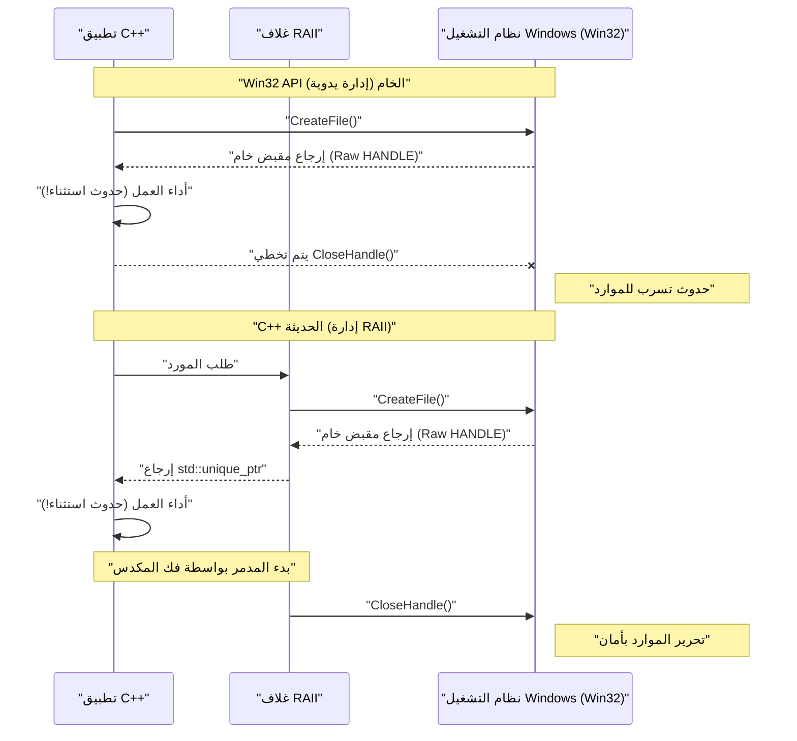
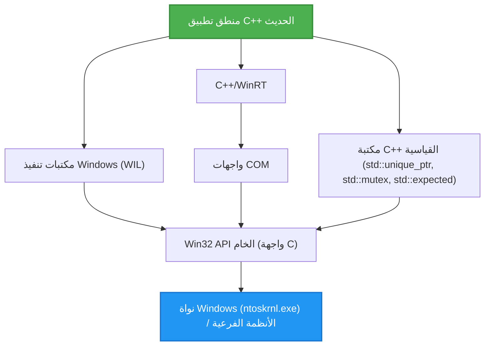

## 1. مقدمة: الفجوة بين Win32 API المعتمد على لغة C و C++ الحديثة

تعد **Windows API (المعروفة بـ Win32 API)** الأساس لنظام التشغيل Windows، وهي واجهة ضخمة للغة C تم توارثها منذ أيام Windows NT و Windows 95 في التسعينيات. حتى اليوم، عند تطوير تطبيقات أصلية لنظام Windows، يجب في النهاية استدعاء Win32 API للوصول إلى الوظائف الأساسية لنظام التشغيل (إدارة العمليات، إدخال/إخراج الملفات، مزامنة الخيوط، التحكم في النوافذ، إلخ).

ومع ذلك، تم تصميم Win32 API خصيصًا للغة C البحتة، ولا تفترض الميزات اللغوية المتقدمة لـ **C++ الحديثة (Modern C++)** (مثل معالجة الاستثناءات، الإدارة التلقائية للموارد بواسطة RAII، دلالات النقل (move semantics)، التعدادات الآمنة للأنواع، والمؤشرات الذكية (smart pointers)). ونتيجة لذلك، فإن مزج Win32 API الخام كما هو في كود C++ يؤدي إلى المشاكل التالية:

*   **الإدارة اليدوية للموارد:** يجب دائمًا تحرير `HANDLE` الذي تم الحصول عليه بواسطة `CreateFile` أو `CreateEvent` باستخدام `CloseHandle`.
*   **الافتقار إلى أمان الاستثناءات:** في حالة طرح استثناء في C++، إذا لم يتم كتابة الكود لاستدعاء `CloseHandle` بشكل صحيح، فستحدث تسريبات للموارد بسهولة.
*   **تمثيل غير متناسق للأخطاء:** تعيد بعض واجهات برمجة التطبيقات `BOOL`، وتتطلب استدعاء `GetLastError()` عند الفشل. وتعيد واجهات أخرى `HRESULT`، بينما تعيد واجهات أخرى (مثل GDI) `NULL`.
*   **الافتقار إلى أمان الأنواع:** عند توسيع وحدات الماكرو، غالبًا ما تكون `HANDLE` و `HWND` و `HDC` مجرد `void*`، مما يجعل التحقق الصارم من الأنواع بواسطة المترجم (compiler) غير فعال.

في هذه المقالة، سنشرح بالتفصيل كيفية تجنب فخاخ "واجهات C القديمة" واستخدام ميزات C++ الحديثة (C++11/14/17/20/23) **للتعامل مع Win32 API بأمان وحداثة**.

---

## 2. مخاطر Win32 API الخام: تسريبات الموارد وفخاخ معالجة الأخطاء

أولاً، دعونا نلقي نظرة على الكود الشائع لاستدعاء Win32 API بالنمط القديم للغة C. للوهلة الأولى، يبدو أنه لا توجد مشكلة، ولكنه يحتوي على ثغرات قاتلة من منظور C++ الحديثة.

```cpp
#include <windows.h>
#include <iostream>
#include <vector>

void ProcessFileLegacy(const std::wstring& filename) {
    // 1. الحصول على مقبض الملف
    HANDLE hFile = ::CreateFileW(
        filename.c_str(),
        GENERIC_READ,
        FILE_SHARE_READ,
        NULL,
        OPEN_EXISTING,
        FILE_ATTRIBUTE_NORMAL,
        NULL
    );

    if (hFile == INVALID_HANDLE_VALUE) {
        std::cerr << "Failed to open file. Error: " << ::GetLastError() << std::endl;
        return;
    }

    // 2. الحصول على حجم الملف
    LARGE_INTEGER fileSize;
    if (!::GetFileSizeEx(hFile, &fileSize)) {
        ::CloseHandle(hFile); // التحرير اليدوي عند الخطأ
        return;
    }

    // 3. حجز الذاكرة والقراءة
    std::vector<char> buffer(fileSize.QuadPart);
    DWORD bytesRead = 0;
    
    if (!::ReadFile(hFile, buffer.data(), buffer.size(), &bytesRead, NULL)) {
        ::CloseHandle(hFile); // التحرير اليدوي عند الخطأ
        return;
    }

    // --- افترض أن هناك عملية هنا قد تطرح استثناء ---
    // مثال: الدالة التي تحلل محتويات الـ buffer تطرح std::runtime_error
    // ParseBuffer(buffer); // إذا تم طرح استثناء، فلن يتم استدعاء CloseHandle أدناه وسيتسرب!

    // 4. التحرير اليدوي للموارد
    ::CloseHandle(hFile);
}
```

### ما المشكلة في هذا الكود؟

1.  **تكرار الكود وتعقيده:** في كل مرة يتم فيها الإرجاع المبكر (`return`)، يلزم كتابة `::CloseHandle(hFile);`، وهو ما يتعارض مع مبدأ DRY (Don't Repeat Yourself).
2.  **الافتقار التام لأمان الاستثناءات (Exception Unsafe):** في لغة C++، عند فشل تخصيص الذاكرة لـ `std::vector` (`std::bad_alloc`)، أو عندما تطرح دوال أخرى استثناءات، يتم الخروج قسريًا من الدالة. في هذه الحالة، لا يتم تنفيذ `CloseHandle` في النهاية، وبالتالي **يتسرب مقبض الملف إلى الأبد** (مما يتسبب في أخطاء خطيرة مثل بقاء الملف مقفلاً حتى تنتهي العملية).

---

## 3. النموذج الرياضي لأمان الاستثناءات وإدارة الموارد

الآن، دعونا نضع نموذجًا رياضيًا (احتماليًا) يوضح مدى ضعف الإدارة اليدوية للموارد.

افترض أن هناك $N$ من حجز الموارد (أو نقاط الإرجاع المبكر، أو نقاط حدوث الاستثناءات) داخل دالة. في كل خطوة $i$، يكون احتمال حدوث خطأ أو استثناء والخروج من الدالة هو $P(\text{Exit}_i)$. لنفكر في احتمال حدوث تسرب للموارد بسبب عدم القدرة على كتابة كود التنظيف (`CloseHandle` إلخ) بشكل صحيح يدويًا في جميع مسارات الخروج.

إذا وضعنا احتمال حدوث تسرب بسبب الإغفال البشري أو الخروج غير المتوقع بسبب استثناء غير معروف (احتمال التسرب لكل مسار) كـ $p$، فإن احتمال $P(\text{Leak})$ لحدوث تسرب واحد على الأقل للموارد في البرنامج بأكمله يعبر عنه بالمعادلة التالية:

$$ P(\text{Leak}) = 1 - (1 - p)^N $$

على سبيل المثال، إذا كان $p = 0.05$ (احتمال 5٪ لارتكاب خطأ في معالجة الاستثناءات أو التنظيف) و $N = 20$ (دالة معقدة بها 20 نقطة إرجاع خطأ أو استثناء):

$$ P(\text{Leak}) = 1 - (1 - 0.05)^{20} \approx 1 - 0.358 = 0.642 $$

بشكل مفاجئ، **هناك احتمال بنسبة 64.2٪ تقريبًا لوجود خطأ تسرب للموارد في مكان ما**. مع زيادة حجم البرنامج واقتراب $N \to \infty$، يصبح $P(\text{Leak}) \to 1$، وسينهار النظام حتمًا.

الوسيلة المنطقية الوحيدة لمواجهة هذا الواقع الرياضي هي استخدام **RAII (Resource Acquisition Is Initialization)** في C++.

---

## 4. أساسيات RAII (اكتساب الموارد هو التهيئة)

RAII هو مفهوم اقترحه بيارن ستروستروب، مبتكر لغة C++. مبادئه بسيطة للغاية وقوية.

1.  يتم تنفيذ اكتساب المورد (Acquisition) في **المنشئ (Initialization)** الخاص بالكائن (Constructor).
2.  يتم تنفيذ تحرير المورد في **المدمر (Destructor)** الخاص بالكائن.

وفقًا لمواصفات لغة C++، عند الخروج من النطاق (سواء كان ذلك عبر `return` طبيعي، أو أثناء فك المكدس (stack unwinding) بسبب استثناء)، يتم استدعاء المدمر الخاص بالكائنات المخصصة على المكدس **بشكل مؤكد وتلقائي**.

بهذا، يمكن جعل احتمال الخطأ البشري $p$ في المعادلة السابقة رياضياً **$0$**.

### تصور دورة حياة الكائن

يوضح مخطط التسلسل أدناه الفرق في دورة الحياة بين الإدارة اليدوية باستخدام واجهات برمجة التطبيقات الخام والإدارة التلقائية باستخدام RAII.



---

## 5. طريقة التغليف الآمنة لـ `HANDLE` باستخدام `std::unique_ptr`

بدءًا من C++11، توفر المكتبة القياسية `std::unique_ptr` كغلاف عام لـ RAII. هذا لا يقتصر فقط على إدارة الذاكرة البسيطة (`new/delete`)، بل يمكن تطبيقه لإدارة أي مورد من خلال تحديد **مزيل مخصص (Custom Deleter)**.

يمكن كتابة المزيل الأساسي لإدارة `HANDLE` الخاص بـ Win32 باستخدام `std::unique_ptr` على النحو التالي:

```cpp
#include <windows.h>
#include <memory>

// مزيل مخصص لـ HANDLE
struct handle_deleter {
    // تحديد نوع المؤشر الذي يعالجه std::unique_ptr داخليًا
    using pointer = HANDLE; 

    void operator()(HANDLE handle) const noexcept {
        if (handle != nullptr && handle != INVALID_HANDLE_VALUE) {
            ::CloseHandle(handle);
        }
    }
};

// اسم مستعار لنوع المقبض الآمن
using unique_handle = std::unique_ptr<void, handle_deleter>;
```

باستخدام `unique_handle` هذا، سيتحول الكود الخطير السابق إلى الكود التالي:

```cpp
void ProcessFileModern(const std::wstring& filename) {
    // تمرير الملكية إلى كائن RAII فور الحصول عليه
    unique_handle hFile(::CreateFileW(
        filename.c_str(), GENERIC_READ, FILE_SHARE_READ, NULL,
        OPEN_EXISTING, FILE_ATTRIBUTE_NORMAL, NULL
    ));

    // التحقق من الأخطاء (سيتم مناقشة التعامل مع INVALID_HANDLE_VALUE لاحقًا)
    if (hFile.get() == INVALID_HANDLE_VALUE) {
        throw std::runtime_error("Failed to open file");
    }

    LARGE_INTEGER fileSize;
    if (!::GetFileSizeEx(hFile.get(), &fileSize)) {
        throw std::runtime_error("Failed to get file size");
    }

    std::vector<char> buffer(fileSize.QuadPart);
    DWORD bytesRead = 0;
    
    if (!::ReadFile(hFile.get(), buffer.data(), buffer.size(), &bytesRead, NULL)) {
        throw std::runtime_error("Failed to read file");
    }

    // حتى في حالة حدوث استثناء هنا، أو الإرجاع المبكر،
    // سيقوم المدمر الخاص بـ unique_handle باستدعاء CloseHandle لحظة الخروج من الدالة!
}
```

---

## 6. تعمق: حل مشكلة `INVALID_HANDLE_VALUE` و `nullptr`

أحد أكثر المواصفات التي تزعج مبرمجي C++ عند التعامل مع Win32 API هو **التمثيل غير المتناسق للمقابض غير الصالحة**.

*   `CreateEvent` و `CreateThread` وما شابهها: تعيد `NULL` (`nullptr`) عند الفشل.
*   `CreateFile` وما شابهها: تعيد `INVALID_HANDLE_VALUE` (كقيمة `(HANDLE)-1`) عند الفشل.

يعتبر `std::unique_ptr` القياسي أن الحالة التي يكون فيها المؤشر الداخلي `nullptr` هي "حالة فارغة (لا يمتلك موردًا)" كمعاملة خاصة. وهذا يعني أن التقييم المنطقي مثل `if (ptr)` سيعيد `false` فقط لـ `nullptr`.

ومع ذلك، إذا فشلت `CreateFile` وأعادت `INVALID_HANDLE_VALUE`، فإن `std::unique_ptr` سيعتبرها خطأً "كمؤشر غير NULL صالح".

لحل هذه المشكلة بأناقة، سنستفيد من المواصفات المتقدمة لـ `std::unique_ptr` في C++ ونعرف **نوع مؤشر مخصص**.

```cpp
#include <windows.h>
#include <memory>

struct win32_handle_traits {
    // تعريف نوع المؤشر المخصص
    class pointer {
        HANDLE m_handle;
    public:
        // على الرغم من أنه يمكن تصميمه بحيث يكون INVALID_HANDLE_VALUE هو القيمة الأولية عند البناء الافتراضي أو تخصيص nullptr،
        // لزيادة المرونة، سنتعامل مع كل من nullptr و INVALID_HANDLE_VALUE كحالات غير صالحة.
        pointer() noexcept : m_handle(nullptr) {}
        pointer(std::nullptr_t) noexcept : m_handle(nullptr) {}
        pointer(HANDLE h) noexcept : m_handle(h) {}
        
        // التحميل الزائد لـ operator bool وتجاهل كلا القيمتين غير الصالحتين لـ Win32
        explicit operator bool() const noexcept {
            return m_handle != nullptr && m_handle != INVALID_HANDLE_VALUE;
        }
        
        operator HANDLE() const noexcept { return m_handle; }
        
        friend bool operator==(pointer a, pointer b) noexcept { return a.m_handle == b.m_handle; }
        friend bool operator!=(pointer a, pointer b) noexcept { return a.m_handle != b.m_handle; }
    };
    
    void operator()(pointer p) const noexcept {
        if (p) { // سيتم استدعاء operator bool
            ::CloseHandle(p);
        }
    }
};

using safe_win32_handle = std::unique_ptr<void, win32_handle_traits>;
```

باستخدام هذا التنفيذ، يمكنك كتابة كود بديهي وآمن كما يلي:

```cpp
safe_win32_handle hFile(::CreateFileW(...));
if (!hFile) {
    // يمكن التقاط كل من nullptr و INVALID_HANDLE_VALUE هنا!
    throw std::system_error(::GetLastError(), std::system_category(), "CreateFile failed");
}
```

---

## 7. إدارة RAII المتقدمة لكائنات GDI (`HDC`, `HBITMAP`)

المشكلة الأخرى الصعبة في Win32 هي إدارة الموارد الخاصة بـ GDI (Graphics Device Interface).
كائنات GDI (القلم، الفرشاة، الخط، الصورة النقطية، إلخ) تتطلب بروتوكولًا مزعجًا للغاية: بعد الإنشاء، يجب تحديدها في سياق الجهاز (`HDC`) باستخدام `SelectObject` لاستخدامها، وعند الانتهاء، **يجب تحديد الكائن الأصلي مرة أخرى باستخدام SelectObject لاستعادته، ثم إتلافه باستخدام DeleteObject**.

الغلاف الذي يحل هذه المشكلة باستخدام RAII سيكون على النحو التالي:

```cpp
// مزيل لحذف كائنات GDI
struct gdi_deleter {
    using pointer = HGDIOBJ;
    void operator()(HGDIOBJ obj) const noexcept {
        if (obj != nullptr) {
            ::DeleteObject(obj);
        }
    }
};

using unique_gdi_obj = std::unique_ptr<void, gdi_deleter>;

// غلاف RAII لـ SelectObject (يستعيد الكائن الأصلي عند الخروج من النطاق)
class gdi_selector {
    HDC m_hdc;
    HGDIOBJ m_oldObj;

public:
    gdi_selector(HDC hdc, HGDIOBJ newObj) : m_hdc(hdc) {
        // تحديد الكائن الجديد وحفظ الكائن القديم
        m_oldObj = ::SelectObject(m_hdc, newObj);
    }

    ~gdi_selector() {
        if (m_oldObj != nullptr && m_oldObj != HGDI_ERROR) {
            // الاستعادة التلقائية عند الخروج من النطاق
            ::SelectObject(m_hdc, m_oldObj);
        }
    }

    // منع النسخ
    gdi_selector(const gdi_selector&) = delete;
    gdi_selector& operator=(const gdi_selector&) = delete;
};
```

### مثال على الاستخدام

```cpp
void DrawMyGraphics(HDC hdc) {
    // إنشاء القلم (بإدارة RAII)
    unique_gdi_obj hPen(::CreatePen(PS_SOLID, 1, RGB(255, 0, 0)));
    
    {
        // تحديد القلم لـ HDC (إدارة النطاق)
        gdi_selector penSelect(hdc, hPen.get());
        
        // عمليات الرسم...
        ::MoveToEx(hdc, 0, 0, NULL);
        ::LineTo(hdc, 100, 100);
        
        // عند الخروج من النطاق، يستعيد المدمر الخاص بـ penSelect القلم القديم بواسطة SelectObject
    }
    
    // عند الخروج من الدالة، يستدعي المدمر الخاص بـ hPen الدالة DeleteObject
}
```
كما هو موضح، إدارة الموارد ذات دورات الحياة المتداخلة هي ملعب RAII.

---

## 8. تحديث كائنات مزامنة الخيوط

يحتوي Win32 على آليات مزامنة الخيوط (Thread Synchronization Primitives) مثل `CRITICAL_SECTION` و `SRWLOCK`. استدعاء `EnterCriticalSection` / `LeaveCriticalSection` يدويًا يعد من المحرمات من منظور أمان الاستثناءات.

على الرغم من أن `std::mutex` و `std::lock_guard` في C++11 مريحة للغاية، إلا أن هناك مواقف ترغب فيها باستخدام آليات القفل الأصلية السريعة لنظام التشغيل مباشرة (خاصة وأن SRWLock خفيفة الوزن جدًا).
تقبل `std::lock_guard` القياسية أي نوع يحتوي على الدوال الأعضاء `lock()` و `unlock()` (مواصفات قالب تشبه Duck Typing). سنستفيد من هذا.

```cpp
class win32_srwlock {
    SRWLOCK m_lock;
public:
    win32_srwlock() noexcept {
        ::InitializeSRWLock(&m_lock);
    }
    
    // الواجهة التي يطلبها std::lock_guard
    void lock() noexcept {
        ::AcquireSRWLockExclusive(&m_lock);
    }
    void unlock() noexcept {
        ::ReleaseSRWLockExclusive(&m_lock);
    }
    
    // منع النسخ والنقل
    win32_srwlock(const win32_srwlock&) = delete;
    win32_srwlock& operator=(const win32_srwlock&) = delete;
};
```

بهذا، يمكنك التعامل مع أقفال Win32 تمامًا كما تتعامل مع المكتبة القياسية لـ C++.

```cpp
win32_srwlock g_myLock;
int g_sharedData = 0;

void UpdateData() {
    // الحصول على القفل بأمان الاستثناء
    std::lock_guard<win32_srwlock> lock(g_myLock);
    
    g_sharedData++;
    if (g_sharedData > 100) {
        throw std::runtime_error("Overflow"); // يتم تحرير القفل بأمان حتى في حالة حدوث استثناء!
    }
}
```

---

## 9. التكامل مع مكتبة C++ القياسية: `std::system_error` و `HRESULT`

أخطاء Win32 بشكل أساسي تأتي كـ `GetLastError()` (من نوع DWORD) و `HRESULT` المستخدم في COM و DirectX. من خلال تحويل هذه الأخطاء إلى استثناءات C++ `std::system_error`، يمكننا تحديث معالجة الأخطاء.

عند طرح استثناء بناءً على `GetLastError()`، في تنفيذ MSVC (Visual C++)، توفر `std::system_category()` تعيينًا بين رموز الخطأ في Win32 والرسائل الخاصة بها.

```cpp
inline void throw_if_win32_error(BOOL result, const char* msg = "Win32 API failed") {
    if (!result) {
        DWORD err = ::GetLastError();
        // يستدعي std::system_category داخليًا واجهة برمجة التطبيقات FormatMessage لإنشاء سلسلة الخطأ
        throw std::system_error(err, std::system_category(), msg);
    }
}
```

من ناحية أخرى، بالنسبة لـ `HRESULT`، نقوم إما بإنشاء فئة أخطاء مخصصة أو استخدام `_com_error` القياسي في Windows.

---

## 10. معالجة الأخطاء الحديثة باستخدام `std::expected` (C++23)

بدءًا من C++23، تم تقديم `std::expected`، وهو يعادل نوع `Result` في لغة Rust. إنها الطريقة المثلى لتحديث القيم المعادة من Win32 في المشاريع التي لا تفضل الاستثناءات (لأسباب تتعلق بالأداء، أو لتصميمات تتكرر فيها الأخطاء).

```cpp
#include <expected>
#include <string>

// عند النجاح يعيد unique_handle، وعند الفشل يعيد DWORD (رمز الخطأ)
std::expected<safe_win32_handle, DWORD> OpenFileModern(const std::wstring& path) {
    safe_win32_handle h(::CreateFileW(
        path.c_str(), GENERIC_READ, 0, nullptr, OPEN_EXISTING, 0, nullptr));
        
    if (!h) {
        return std::unexpected(::GetLastError());
    }
    return std::move(h); // عند النجاح، يتم نقل المقبض وإرجاعه
}

void Usage() {
    auto result = OpenFileModern(L"C:\\test.txt");
    if (result) {
        // المعالجة عند النجاح
        safe_win32_handle& hFile = *result;
        // ...
    } else {
        // المعالجة عند الفشل
        DWORD err = result.error();
        std::cerr << "Error code: " << err << std::endl;
    }
}
```

بهذه الطريقة، باستخدام C++23، يمكن تحقيق كل من معالجة الأخطاء عبر القيم المعادة وفوائد RAII.

---

## 11. إجابة Microsoft (1): الاستفادة من مكتبات WIL (Windows Implementation Libraries)

لقد قدمنا أغلفة مخصصة حتى الآن، ولكن في الواقع تنظر Microsoft بجدية إلى هذه المشكلة ونشرت مكتبة الرأس فقط الرسمية لـ C++ الحديثة **WIL (Windows Implementation Libraries)** كمصدر مفتوح (متاحة على GitHub).

باستخدام WIL، يتم توفير جميع الأغلفة التي كافحنا لإنشائها أعلاه بشكل قياسي.

```cpp
#include <wil/resource.h>
#include <wil/result.h>

void ProcessWithWIL() {
    // wil::unique_handle يدعم كلاً من INVALID_HANDLE_VALUE و NULL
    wil::unique_handle hFile;
    
    // ماكرو THROW_IF_WIN32_BOOL_FALSE يقوم بالتحقق من الأخطاء وطرح الاستثناءات تلقائيًا
    THROW_IF_WIN32_BOOL_FALSE(
        ::CreateFileW(L"test.txt", GENERIC_READ, 0, nullptr, OPEN_EXISTING, 0, nullptr),
        hFile.put() // مساعد لاستقبال مؤشر الإخراج الخاص بـ WIL
    );
    
    // يحتوي أيضًا على أغلفة قوية لإدارة الذاكرة مثل wil::unique_cotaskmem_string
}
```

تكمن قوة WIL الحقيقية في قالب ضخم يسمى `wil::unique_any`، حيث يمكنه إنشاء أغلفة RAII في بضعة أسطر لأي مورد من موارد Win32 تقريبًا، وليس فقط مقابض الملفات، بل يشمل مفاتيح التسجيل، وكائنات GDI، والذاكرة المحلية، وغيرها الكثير.

---

## 12. إجابة Microsoft (2): تجريد COM بواسطة C++/WinRT

العديد من واجهات برمجة تطبيقات Win32 (خاصة إضافات Shell و DirectX) تُقدم من خلال واجهات COM (Component Object Model) القائمة على لغة C.
قامت Microsoft بتطوير كل من `CComPtr` (ATL) و `ComPtr` (WRL) التقليديين، وتوصي رسميًا الآن باستخدام **C++/WinRT**.

يمكن لـ C++/WinRT التعامل بذكاء فائق ليس فقط مع Windows Runtime (WinRT)، بل أيضًا مع كائنات COM التقليدية.

```cpp
#include <winrt/base.h>

void ComExample() {
    // تهيئة COM (تحويل إلى RAII)
    winrt::init_apartment();

    // إدارة واجهة COM التي ترث IUnknown بأمان باستخدام winrt::com_ptr
    winrt::com_ptr<IDXGIFactory> factory;
    winrt::check_hresult(
        ::CreateDXGIFactory(__uuidof(IDXGIFactory), factory.put_void())
    );
    
    // لا حاجة على الإطلاق لاستدعاء AddRef أو Release يدويًا
}
```

---

## 13. تصور البنية ودورة الحياة

دعونا ننظم البنية الطبقية في تطوير تطبيقات C++ الحديثة لنظام Windows.



لا ينبغي أبدًا أن يلمس منطق التطبيق Win32 API الخام (الطبقة E) بشكل مباشر. من خلال ضمان الوصول إليها دائمًا عبر أي من طبقات التجريد: المكتبة القياسية، أو WIL، أو C++/WinRT، يتم تحسين أمان الذاكرة بشكل كبير.

---

## 14. تحليل الأداء للتجريد الصفري التكلفة

قد يتساءل البعض: "ألا يؤدي استخدام أغلفة RAII والمؤشرات الذكية إلى إبطاء التنفيذ مقارنة بـ API لغة C الخام؟".
هنا، دعونا نلقي نظرة على النموذج الرياضي لتكلفة الأداء.

يمكن تقسيم وقت التنفيذ $T_{\text{total}}$ على النحو التالي:

$$ T_{\text{total}} = T_{\text{syscall}} + T_{\text{wrapper}} + T_{\text{cleanup}} $$

*   $T_{\text{syscall}}$: الوقت المستغرق في الانتقال إلى وضع النواة (kernel mode) والمعالجة الفعلية داخل Win32 API. عادةً ما يكون بالميلي ثانية أو الميكرو ثانية.
*   $T_{\text{wrapper}}$: الوقت المستغرق لبناء فئات الغلاف مثل `std::unique_ptr` أو WIL.
*   $T_{\text{cleanup}}$: الوقت المستغرق في استدعاء المدمر.

تتمتع مترجمات C++ (مثل MSVC, Clang, GCC) بكفاءة استثنائية في تحسين الدمج المضمن (Inlining). يتم توسيع المجمعات والمدمرات الخاصة بـ `std::unique_ptr`، و `operator*` و `operator bool` المحملة بشكل زائد كلها كـ `inline`، وتُجمع كـ كود آلة (machine code) مطابق تمامًا لعمليات المعالجة المباشرة للمؤشرات الخام في الذاكرة.

بمعنى آخر، سيكون **$T_{\text{wrapper}} \approx 0$**. وهذا دليل على الفلسفة العظمى لـ C++ وهي **التجريد الصفري التكلفة (Zero-cost Abstraction)**. حتى مع اكتساب الأمان، فإن عبء التنفيذ الإضافي يكون حرفيًا صفراً.

---

## 15. الخلاصة: مستقبل برمجة Windows الآمنة

تُعد Win32 API تراثًا قديمًا جيدًا تم تصميمه بنموذج لغة C لأسباب تاريخية. ومع ذلك، فإن لغة C++ التي تستدعيها مستمرة في التطور، وأصبح من الممكن الآن كتابة كود آمن للغاية ومعبر بوضوح.

لنتراجع خطوة ونستعرض النقاط الهامة التي تمت مناقشتها في هذه المقالة:

1.  **لا تكتب أبدًا `CloseHandle` أو `DeleteObject` يدويًا.** قم باحتواء كل شيء داخل حاويات RAII مثل `std::unique_ptr`.
2.  **افهم فخ `INVALID_HANDLE_VALUE`.** قم بتنفيذ مزيل مخصص وسمات مؤشر مخصصة، أو استخدم `wil::unique_handle` الخاص بـ WIL.
3.  **قم بتحديث معالجة الأخطاء.** ارمِ `GetLastError()` أو `HRESULT` كاستثناءات `std::system_error`، أو استخدم `std::expected` في C++23 لمعالجتها بأمان نوع.
4.  **قف على أكتاف العمالقة.** تبنّى رسميًا WIL و C++/WinRT من Microsoft لتجنب إعادة اختراع العجلة.

في تطوير C++ الحديث، يعتبر حمل المؤشرات والمقابض الخام المكشوفة بمثابة القيادة على الطريق السريع بدون حزام أمان. استفد من نظام الأنواع القوي و RAII الذي توفره C++، واستمتع بتطوير تطبيقات Windows آمنة وقوية.
