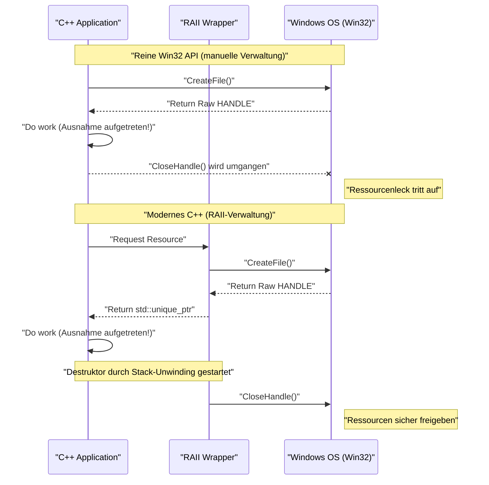
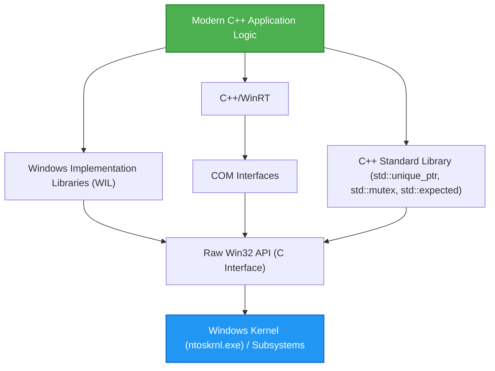

## 1. Einführung: Die Diskrepanz zwischen der C-basierten Win32 API und modernem C++

Die **Windows API (allgemein bekannt als Win32 API)**, die die Grundlage des Windows-Betriebssystems bildet, ist eine riesige C-Sprachschnittstelle, die seit den Tagen von Windows NT und Windows 95 in den 1990er Jahren weitergegeben wurde. Auch heute noch müssen Sie beim Entwickeln nativer Anwendungen für Windows letztendlich diese Win32 API aufrufen, um auf die Kernfunktionen des Betriebssystems (Prozessverwaltung, Datei-I/O, Thread-Synchronisation, Fenstersteuerung usw.) zuzugreifen.

Die Win32 API wurde jedoch für reines C entwickelt und geht nicht von den fortschrittlichen Sprachfunktionen aus, die **modernes C++ (Modern C++)** bietet (Ausnahmebehandlung, automatische Ressourcenverwaltung durch RAII, Move-Semantik, typsichere Aufzählungen, Smart Pointer usw.). Wenn man folglich die reine Win32 API so wie sie ist in C++-Code mischt, treten folgende Probleme auf:

*   **Manuelle Ressourcenverwaltung:** Ein mit `CreateFile` oder `CreateEvent` erhaltenes `HANDLE` muss zwingend mit `CloseHandle` freigegeben werden.
*   **Mangelnde Ausnahmesicherheit:** Wenn eine C++-Ausnahme ausgelöst wird, kommt es leicht zu Ressourcenlecks, falls der Code für den ordnungsgemäßen Aufruf von `CloseHandle` nicht vorhanden ist.
*   **Inkonsistente Fehlerdarstellung:** Einige APIs geben ein `BOOL` zurück und erfordern im Fehlerfall den Aufruf von `GetLastError()`. Andere geben ein `HRESULT` zurück und wieder andere (wie GDI) geben `NULL` zurück.
*   **Fehlende Typsicherheit:** `HANDLE`, `HWND`, `HDC` usw. sind nach der Makroauflösung oft nur einfache `void*`, was strenge Typprüfungen durch den Compiler erschwert.

In diesem Artikel wird äußerst detailliert erklärt, wie Sie diese "Fallen der alten C-Schnittstelle" vermeiden und **die Win32 API mit Funktionen von modernem C++ (C++11/14/17/20/23) sicher (Safe) und modern (Modern) handhaben** können.

---

## 2. Die Gefahren der reinen Win32 API: Ressourcenlecks und Fallen bei der Fehlerbehandlung

Betrachten wir zunächst den typischen Code für den Aufruf der Win32 API im alten C-Stil. Auf den ersten Blick mag er unproblematisch erscheinen, aber aus der Perspektive des modernen C++ birgt er fatale Schwachstellen.

```cpp
#include <windows.h>
#include <iostream>
#include <vector>

void ProcessFileLegacy(const std::wstring& filename) {
    // 1. Datei-Handle abrufen
    HANDLE hFile = ::CreateFileW(
        filename.c_str(),
        GENERIC_READ,
        FILE_SHARE_READ,
        NULL,
        OPEN_EXISTING,
        FILE_ATTRIBUTE_NORMAL,
        NULL
    );

    if (hFile == INVALID_HANDLE_VALUE) {
        std::cerr << "Failed to open file. Error: " << ::GetLastError() << std::endl;
        return;
    }

    // 2. Dateigröße abrufen
    LARGE_INTEGER fileSize;
    if (!::GetFileSizeEx(hFile, &fileSize)) {
        ::CloseHandle(hFile); // Manuelle Freigabe im Fehlerfall
        return;
    }

    // 3. Speicher zuweisen und lesen
    std::vector<char> buffer(fileSize.QuadPart);
    DWORD bytesRead = 0;
    
    if (!::ReadFile(hFile, buffer.data(), buffer.size(), &bytesRead, NULL)) {
        ::CloseHandle(hFile); // Manuelle Freigabe im Fehlerfall
        return;
    }

    // --- Angenommen, hier gibt es Code, der eine Ausnahme auslöst ---
    // Beispiel: Eine Funktion, die den Pufferinhalt parst, löst std::runtime_error aus
    // ParseBuffer(buffer); // Wenn eine Ausnahme ausgelöst wird, wird CloseHandle unten nicht aufgerufen und es entsteht ein Leck!

    // 4. Manuelle Ressourcenfreigabe
    ::CloseHandle(hFile);
}
```

### Was ist das Problem mit diesem Code?

1.  **Code-Duplizierung und Komplexität:** Für jedes vorzeitige Zurückkehren (`return`) muss `::CloseHandle(hFile);` geschrieben werden, was dem DRY-Prinzip (Don't Repeat Yourself) widerspricht.
2.  **Völliges Fehlen von Ausnahmesicherheit (Exception Unsafe):** In C++ wird die Funktion zwangsweise verlassen, wenn die Speicherzuweisung von `std::vector` fehlschlägt (`std::bad_alloc`) oder andere Funktionen eine Ausnahme auslösen. In diesem Fall wird das `CloseHandle` am Ende nicht ausgeführt, sodass **das Datei-Handle für immer leckt** (was zu schwerwiegenden Fehlern führt, wie z.B. dass die Datei gesperrt bleibt, bis der Prozess beendet wird).

---

## 3. Mathematisches Modell von Ausnahmesicherheit und Ressourcenverwaltung

Lassen Sie uns hier mathematisch (probabilistisch) modellieren, wie anfällig die manuelle Ressourcenverwaltung ist.

Angenommen, es gibt $N$ Ressourcenallokationen (oder Punkte für vorzeitige Rückkehr, Auslösepunkte für Ausnahmen) innerhalb einer Funktion. Sei $P(\text{Exit}_i)$ die Wahrscheinlichkeit, dass die Funktion bei jedem Schritt $i$ aufgrund eines Fehlers oder einer Ausnahme verlassen wird. Betrachten wir die Wahrscheinlichkeit, dass Bereinigungscode (wie `CloseHandle`) manuell nicht auf allen Ausstiegspfaden korrekt geschrieben wird und eine Ressource leckt.

Wenn wir die Wahrscheinlichkeit von menschlichen Fehlern oder unerwarteten Austritten durch unbekannte Ausnahmen (die Leckwahrscheinlichkeit pro Pfad) als $p$ ansetzen, wird die Wahrscheinlichkeit $P(\text{Leak})$, dass mindestens ein Ressourcenleck im gesamten Programm auftritt, durch die folgende Formel ausgedrückt:

$$ P(\text{Leak}) = 1 - (1 - p)^N $$

Wenn zum Beispiel $p = 0.05$ (eine 5%ige Chance, dass bei der Fehlerbehandlung oder Bereinigung ein Fehler gemacht wird) und $N = 20$ (es gibt 20 Fehler-Return- oder Ausnahmepunkte in einer komplexen Funktion):

$$ P(\text{Leak}) = 1 - (1 - 0.05)^{20} \approx 1 - 0.358 = 0.642 $$

Überraschenderweise bedeutet dies, dass **mit einer Wahrscheinlichkeit von etwa 64,2% irgendwo ein Ressourcenleck-Bug verborgen ist**. Wenn der Umfang der Software zunimmt und $N \to \infty$, dann $P(\text{Leak}) \to 1$, und das System wird unweigerlich zusammenbrechen.

Das einzige vernünftige Mittel, um dieser mathematischen Realität entgegenzuwirken, ist das C++ **RAII (Resource Acquisition Is Initialization)**.

---

## 4. Grundlagen von RAII (Resource Acquisition Is Initialization)

RAII ist ein Konzept, das von Bjarne Stroustrup, dem Schöpfer von C++, vorgeschlagen wurde. Seine Prinzipien sind extrem einfach und mächtig.

1.  Die Ressourcenbeschaffung (Acquisition) wird im **Konstruktor (Initialization)** des Objekts durchgeführt.
2.  Die Ressourcenfreigabe wird im **Destruktor** des Objekts durchgeführt.

Durch die Sprachspezifikation von C++ wird der Destruktor des auf dem Stack allozierten Objekts **zuverlässig und automatisch** aufgerufen, wenn der Gültigkeitsbereich (Scope) verlassen wird (sei es durch ein normales `return` oder während des Stack-Unwindings aufgrund einer Ausnahme).

Dies erlaubt es, die menschliche Fehlerwahrscheinlichkeit $p$ in der obigen Formel mathematisch auf **$0$** zu reduzieren.

### Visualisierung des Objektlebenszyklus

Das folgende Sequenzdiagramm zeigt den Unterschied im Lebenszyklus zwischen der manuellen Verwaltung mit Raw-APIs und der automatischen Verwaltung mit RAII.



---

## 5. Sichere Wrapper-Methoden für `HANDLE` unter Verwendung von `std::unique_ptr`

Seit C++11 stellt die Standardbibliothek einen universellen RAII-Wrapper, `std::unique_ptr`, zur Verfügung. Dieser kann nicht nur für einfache Speicherverwaltung (`new/delete`) verwendet werden, sondern durch Angabe eines **benutzerdefinierten Deleters (Custom Deleter)** auch für die Verwaltung beliebiger Ressourcen eingesetzt werden.

Ein grundlegender Deleter zur Verwaltung von Win32 `HANDLE`s mit `std::unique_ptr` kann wie folgt geschrieben werden:

```cpp
#include <windows.h>
#include <memory>

// Benutzerdefinierter Deleter für HANDLE
struct handle_deleter {
    // Gibt den intern von std::unique_ptr verwendeten Zeigertyp an
    using pointer = HANDLE; 

    void operator()(HANDLE handle) const noexcept {
        if (handle != nullptr && handle != INVALID_HANDLE_VALUE) {
            ::CloseHandle(handle);
        }
    }
};

// Sicherer Typ-Alias für Handles
using unique_handle = std::unique_ptr<void, handle_deleter>;
```

Mit diesem `unique_handle` lässt sich der zuvor gesehene gefährliche Code wie folgt neu schreiben:

```cpp
void ProcessFileModern(const std::wstring& filename) {
    // Übergabe des Besitzes an das RAII-Objekt unmittelbar nach dem Abrufen
    unique_handle hFile(::CreateFileW(
        filename.c_str(), GENERIC_READ, FILE_SHARE_READ, NULL,
        OPEN_EXISTING, FILE_ATTRIBUTE_NORMAL, NULL
    ));

    // Fehlerüberprüfung (Behandlung von INVALID_HANDLE_VALUE wird später erläutert)
    if (hFile.get() == INVALID_HANDLE_VALUE) {
        throw std::runtime_error("Failed to open file");
    }

    LARGE_INTEGER fileSize;
    if (!::GetFileSizeEx(hFile.get(), &fileSize)) {
        throw std::runtime_error("Failed to get file size");
    }

    std::vector<char> buffer(fileSize.QuadPart);
    DWORD bytesRead = 0;
    
    if (!::ReadFile(hFile.get(), buffer.data(), buffer.size(), &bytesRead, NULL)) {
        throw std::runtime_error("Failed to read file");
    }

    // Selbst wenn hier eine Ausnahme auftritt oder frühzeitig zurückgekehrt wird,
    // ruft der Destruktor von unique_handle im Moment des Verlassens der Funktion CloseHandle auf!
}
```

---

## 6. Vertiefung: Lösung des Problems mit `INVALID_HANDLE_VALUE` und `nullptr`

Eine der irritierendsten Eigenheiten für C++-Programmierer beim Umgang mit der Win32 API ist die **inkonsistente Darstellung ungültiger Handles**.

*   `CreateEvent`, `CreateThread` usw.: Bei Fehlschlag wird `NULL` (`nullptr`) zurückgegeben.
*   `CreateFile` usw.: Bei Fehlschlag wird `INVALID_HANDLE_VALUE` (als Wert `(HANDLE)-1`) zurückgegeben.

Der standardmäßige `std::unique_ptr` behandelt den Fall, dass der interne Zeiger `nullptr` ist, als "leeren Zustand" (ein Zustand, in dem keine Ressource gehalten wird). Das heißt, ein boolescher Test wie `if (ptr)` liefert nur für `nullptr` den Wert `false`.

Wenn `CreateFile` jedoch fehlschlägt und `INVALID_HANDLE_VALUE` zurückgibt, missversteht `std::unique_ptr` dies als einen "gültigen Nicht-NULL-Zeiger".

Um dieses Problem elegant zu lösen, nutzen wir erweiterte Spezifikationen des C++ `std::unique_ptr` und definieren einen **benutzerdefinierten Zeigertyp**.

```cpp
#include <windows.h>
#include <memory>

struct win32_handle_traits {
    // Definition eines benutzerdefinierten Zeigertyps
    class pointer {
        HANDLE m_handle;
    public:
        // Es ist möglich, bei Standardkonstruktion oder Zuweisung von nullptr 
        // INVALID_HANDLE_VALUE als Anfangswert festzulegen, aber um die 
        // Vielseitigkeit zu erhöhen, werden sowohl nullptr als auch INVALID_HANDLE_VALUE als ungültige Zustände behandelt.
        pointer() noexcept : m_handle(nullptr) {}
        pointer(std::nullptr_t) noexcept : m_handle(nullptr) {}
        pointer(HANDLE h) noexcept : m_handle(h) {}
        
        // Überladen von operator bool, um beide Arten von ungültigen Win32-Werten abzufangen
        explicit operator bool() const noexcept {
            return m_handle != nullptr && m_handle != INVALID_HANDLE_VALUE;
        }
        
        operator HANDLE() const noexcept { return m_handle; }
        
        friend bool operator==(pointer a, pointer b) noexcept { return a.m_handle == b.m_handle; }
        friend bool operator!=(pointer a, pointer b) noexcept { return a.m_handle != b.m_handle; }
    };
    
    void operator()(pointer p) const noexcept {
        if (p) { // operator bool wird aufgerufen
            ::CloseHandle(p);
        }
    }
};

using safe_win32_handle = std::unique_ptr<void, win32_handle_traits>;
```

Diese Implementierung ermöglicht es, intuitiven und sicheren Code wie den folgenden zu schreiben:

```cpp
safe_win32_handle hFile(::CreateFileW(...));
if (!hFile) {
    // Sowohl nullptr als auch INVALID_HANDLE_VALUE können hier abgefangen werden!
    throw std::system_error(::GetLastError(), std::system_category(), "CreateFile failed");
}
```

---

## 7. Erweiterte RAII-Verwaltung von GDI-Objekten (`HDC`, `HBITMAP`)

Ein weiteres heikles Thema in Win32 ist die Verwaltung von GDI-Ressourcen (Graphics Device Interface).
GDI-Objekte (Stifte, Pinsel, Schriftarten, Bitmaps usw.) erfordern eine sehr mühsame Vorgehensweise: Nach der Erstellung werden sie mit `SelectObject` in den Gerätekontext (`HDC`) ausgewählt, um sie zu verwenden, und wenn Sie fertig sind, müssen Sie **das ursprüngliche Objekt erneut mit SelectObject auswählen, um es wiederherzustellen, bevor Sie es mit DeleteObject zerstören**.

Ein Wrapper zur Lösung dieses Problems mit RAII sieht wie folgt aus:

```cpp
// Deleter zum Löschen von GDI-Objekten
struct gdi_deleter {
    using pointer = HGDIOBJ;
    void operator()(HGDIOBJ obj) const noexcept {
        if (obj != nullptr) {
            ::DeleteObject(obj);
        }
    }
};

using unique_gdi_obj = std::unique_ptr<void, gdi_deleter>;

// RAII-Wrapper für SelectObject (stellt das ursprüngliche Objekt beim Verlassen des Gültigkeitsbereichs wieder her)
class gdi_selector {
    HDC m_hdc;
    HGDIOBJ m_oldObj;

public:
    gdi_selector(HDC hdc, HGDIOBJ newObj) : m_hdc(hdc) {
        // Das neue Objekt auswählen und das alte Objekt speichern
        m_oldObj = ::SelectObject(m_hdc, newObj);
    }

    ~gdi_selector() {
        if (m_oldObj != nullptr && m_oldObj != HGDI_ERROR) {
            // Automatische Wiederherstellung beim Verlassen des Gültigkeitsbereichs
            ::SelectObject(m_hdc, m_oldObj);
        }
    }

    // Kopieren verbieten
    gdi_selector(const gdi_selector&) = delete;
    gdi_selector& operator=(const gdi_selector&) = delete;
};
```

### Verwendungsbeispiel

```cpp
void DrawMyGraphics(HDC hdc) {
    // Stift erstellen (RAII-verwaltet)
    unique_gdi_obj hPen(::CreatePen(PS_SOLID, 1, RGB(255, 0, 0)));
    
    {
        // Stift in HDC auswählen (Scope-Verwaltung)
        gdi_selector penSelect(hdc, hPen.get());
        
        // Zeichenoperationen...
        ::MoveToEx(hdc, 0, 0, NULL);
        ::LineTo(hdc, 100, 100);
        
        // Beim Verlassen des Bereichs stellt der Destruktor von penSelect den alten Stift mit SelectObject wieder her
    }
    
    // Beim Verlassen der Funktion ruft der Destruktor von hPen DeleteObject auf
}
```
Auf diese Weise eignet sich RAII hervorragend für die Verwaltung von Ressourcen mit verschachtelten Lebenszyklen.

---

## 8. Modernisierung von Objekten zur Thread-Synchronisation

In Win32 gibt es Thread-Synchronisationsprimitive wie `CRITICAL_SECTION` oder `SRWLOCK`. Das manuelle Aufrufen von `EnterCriticalSection` / `LeaveCriticalSection` ist aus Sicht der Ausnahmesicherheit ein No-Go.

Obwohl `std::mutex` und `std::lock_guard` aus C++11 sehr nützlich sind, gibt es Situationen, in denen man direkt die schnellen nativen Sperrmechanismen des Betriebssystems verwenden möchte (insbesondere SRWLock ist sehr ressourcenschonend).
Der standardmäßige `std::lock_guard` ist so konzipiert, dass er jeden Typ akzeptiert (ähnlich dem Duck-Typing bei Templates), der die Elementfunktionen `lock()` und `unlock()` besitzt. Dies machen wir uns zunutze.

```cpp
class win32_srwlock {
    SRWLOCK m_lock;
public:
    win32_srwlock() noexcept {
        ::InitializeSRWLock(&m_lock);
    }
    
    // Von std::lock_guard geforderte Schnittstelle
    void lock() noexcept {
        ::AcquireSRWLockExclusive(&m_lock);
    }
    void unlock() noexcept {
        ::ReleaseSRWLockExclusive(&m_lock);
    }
    
    // Kopieren und Verschieben verbieten
    win32_srwlock(const win32_srwlock&) = delete;
    win32_srwlock& operator=(const win32_srwlock&) = delete;
};
```

Damit können Win32-Sperren vollständig in der Manier der C++-Standardbibliothek gehandhabt werden.

```cpp
win32_srwlock g_myLock;
int g_sharedData = 0;

void UpdateData() {
    // Ausnahmesicheres Beziehen der Sperre
    std::lock_guard<win32_srwlock> lock(g_myLock);
    
    g_sharedData++;
    if (g_sharedData > 100) {
        throw std::runtime_error("Overflow"); // Selbst wenn eine Ausnahme geworfen wird, wird die Sperre sicher freigegeben!
    }
}
```

---

## 9. Integration mit der C++ Standardbibliothek: `std::system_error` und `HRESULT`

Win32-Fehler basieren hauptsächlich auf zwei Arten: `GetLastError()` (DWORD-Typ) und `HRESULT`, das in COM und DirectX verwendet wird. Durch die Konvertierung dieser in die C++-Ausnahme `std::system_error` kann die Fehlerbehandlung modernisiert werden.

Wenn Sie `GetLastError()` werfen, bietet die Implementierung von MSVC (Visual C++) `std::system_category()`, welche eine Zuordnung zwischen Win32-Fehlercodes und Meldungen bereitstellt.

```cpp
inline void throw_if_win32_error(BOOL result, const char* msg = "Win32 API failed") {
    if (!result) {
        DWORD err = ::GetLastError();
        // std::system_category ruft intern die FormatMessage API auf und generiert einen Fehlerstring
        throw std::system_error(err, std::system_category(), msg);
    }
}
```

Für `HRESULT` kann entweder eine dedizierte Fehlerkategorie erstellt oder das Windows-Standard `_com_error` verwendet werden.

---

## 10. Moderne Fehlerbehandlung mit `std::expected` (C++23)

Ab C++23 wurde `std::expected` eingeführt, was dem `Result`-Typ in Rust entspricht. Für Projekte, die Ausnahmen vermeiden wollen (aus Leistungsgründen oder wegen eines Designs, bei dem Fehler häufig auftreten), ist dies die beste Methode zur Modernisierung von Win32-Rückgabewerten.

```cpp
#include <expected>
#include <string>

// Gibt unique_handle bei Erfolg und DWORD (Fehlercode) bei Fehlschlag zurück
std::expected<safe_win32_handle, DWORD> OpenFileModern(const std::wstring& path) {
    safe_win32_handle h(::CreateFileW(
        path.c_str(), GENERIC_READ, 0, nullptr, OPEN_EXISTING, 0, nullptr));
        
    if (!h) {
        return std::unexpected(::GetLastError());
    }
    return std::move(h); // Bei Erfolg wird das Handle verschoben und zurückgegeben
}

void Usage() {
    auto result = OpenFileModern(L"C:\\test.txt");
    if (result) {
        // Verarbeitung im Erfolgsfall
        safe_win32_handle& hFile = *result;
        // ...
    } else {
        // Verarbeitung im Fehlerfall
        DWORD err = result.error();
        std::cerr << "Error code: " << err << std::endl;
    }
}
```

Auf diese Weise können Sie durch die Verwendung von C++23 sowohl von der Fehlerbehandlung durch Rückgabewerte als auch von den Vorteilen von RAII profitieren.

---

## 11. Microsofts Antwort (1): Die Nutzung der WIL (Windows Implementation Libraries)

Bisher haben wir selbst erstellte Wrapper vorgestellt, aber in Wahrheit nimmt Microsoft selbst dieses Problem ernst und hat die **WIL (Windows Implementation Libraries)**, eine offizielle Header-Only-Bibliothek für modernes C++, als Open Source veröffentlicht (verfügbar auf GitHub).

Wenn Sie WIL verwenden, werden all die Wrapper, die wir uns oben mühsam selbst gebaut haben, standardmäßig bereitgestellt.

```cpp
#include <wil/resource.h>
#include <wil/result.h>

void ProcessWithWIL() {
    // wil::unique_handle unterstützt sowohl INVALID_HANDLE_VALUE als auch NULL
    wil::unique_handle hFile;
    
    // Das Makro THROW_IF_WIN32_BOOL_FALSE automatisiert die Fehlerüberprüfung und das Werfen von Ausnahmen
    THROW_IF_WIN32_BOOL_FALSE(
        ::CreateFileW(L"test.txt", GENERIC_READ, 0, nullptr, OPEN_EXISTING, 0, nullptr),
        hFile.put() // Ein WIL-spezifischer Helfer für den Empfang von Ausgabezeigern
    );
    
    // Auch Speicherverwaltungs-Wrapper wie wil::unique_cotaskmem_string sind reichhaltig vorhanden
}
```

Die wahre Stärke von WIL liegt in einem mächtigen Template namens `wil::unique_any`. Es ermöglicht die Generierung von RAII-Wrappern mit nur wenigen Zeilen Code für jede denkbare Win32-Ressource, nicht nur Datei-Handles, sondern auch Registrierungsschlüssel, GDI-Objekte, lokalen Speicher usw.

---

## 12. Microsofts Antwort (2): COM-Abstraktion durch C++/WinRT

Viele Win32-APIs (insbesondere Shell-Erweiterungen, DirectX usw.) werden über C-basierte COM-Schnittstellen (Component Object Model) bereitgestellt.
Als Weiterentwicklung der traditionellen `CComPtr` (ATL) und `ComPtr` (WRL) empfiehlt Microsoft heute offiziell **C++/WinRT**.

C++/WinRT kann nicht nur die Windows-Runtime (WinRT), sondern auch herkömmliche COM-Objekte äußerst elegant handhaben.

```cpp
#include <winrt/base.h>

void ComExample() {
    // COM-Initialisierung (als RAII umgesetzt)
    winrt::init_apartment();

    // COM-Schnittstellen, die von IUnknown erben, werden sicher mit winrt::com_ptr verwaltet
    winrt::com_ptr<IDXGIFactory> factory;
    winrt::check_hresult(
        ::CreateDXGIFactory(__uuidof(IDXGIFactory), factory.put_void())
    );
    
    // Manuelles Aufrufen von AddRef oder Release ist überhaupt nicht erforderlich
}
```

---

## 13. Visualisierung von Architektur und Lebenszyklus

Lassen Sie uns die Ebenenstruktur der modernen Windows C++-Anwendungsentwicklung strukturieren.



Die Anwendungslogik sollte niemals die reine Win32 API (Ebene E) direkt berühren. Durch eine Architektur, bei der der Zugriff immer über eine der Abstraktionsschichten erfolgt – sei es die Standardbibliothek, WIL oder C++/WinRT – wird die Speichersicherheit drastisch verbessert.

---

## 14. Leistungsanalyse der Zero-Cost-Abstraktion

Einige fragen sich vielleicht: "Wird die Ausführung nicht langsamer als bei rohen C-APIs, wenn man RAII-Wrapper oder Smart Pointer verwendet?"
Betrachten wir hier das mathematische Modell der Leistungskosten.

Die Ausführungszeit $T_{\text{total}}$ kann wie folgt zerlegt werden:

$$ T_{\text{total}} = T_{\text{syscall}} + T_{\text{wrapper}} + T_{\text{cleanup}} $$

*   $T_{\text{syscall}}$: Die für Übergänge in den Kernel-Modus und die eigentliche Verarbeitung innerhalb der Win32 API aufgewendete Zeit. Normalerweise in der Größenordnung von Millisekunden bis Mikrosekunden.
*   $T_{\text{wrapper}}$: Die zum Konstruieren der Wrapper-Klassen wie `std::unique_ptr` oder aus WIL aufgewendete Zeit.
*   $T_{\text{cleanup}}$: Die für Aufrufe von Destruktoren aufgewendete Zeit.

C++-Compiler (MSVC, Clang, GCC) zeichnen sich in hohem Maße durch die Optimierung des Inlinings (Inlining) aus. Die Konstruktoren und Destruktoren von `std::unique_ptr` sowie die überladenen `operator*` und `operator bool` werden alle `inline` expandiert und in Maschinencode übersetzt, der exakt identisch mit direkten Operationen auf nackten Zeigern im Speicher ist.

Das heißt, es gilt **$T_{\text{wrapper}} \approx 0$**. Dies ist der Beweis für die größte Philosophie von C++, die **Zero-cost Abstraction (Null-Kosten-Abstraktion)**. Selbst wenn man Sicherheit gewinnt, ist der Laufzeit-Overhead im wahrsten Sinne des Wortes null.

---

## 15. Fazit: Die Zukunft der sicheren Windows-Programmierung

Die Win32 API ist ein altbewährtes Erbe, das aus historischen Gründen im Paradigma der C-Sprache konzipiert wurde. C++, als aufrufende Sprache, entwickelt sich jedoch stetig weiter und ermöglicht es heutzutage, extrem sicheren und ausdrucksstarken Code zu schreiben.

Fassen wir die wichtigen Punkte dieses Artikels noch einmal zusammen:

1.  **Schreiben Sie niemals manuell `CloseHandle` oder `DeleteObject`.** Kapseln Sie alles in RAII-Containern wie `std::unique_ptr`.
2.  **Verstehen Sie die Falle von `INVALID_HANDLE_VALUE`.** Implementieren Sie spezielle benutzerdefinierte Deleter und Zeiger-Traits oder verwenden Sie `wil::unique_handle` aus WIL.
3.  **Modernisieren Sie die Fehlerbehandlung.** Werfen Sie `GetLastError()` oder `HRESULT` als `std::system_error`-Ausnahme oder verwenden Sie `std::expected` aus C++23 für eine typsichere Behandlung.
4.  **Stehen Sie auf den Schultern von Riesen.** Setzen Sie aktiv offizielle Tools von Microsoft wie WIL und C++/WinRT ein, um das Rad nicht neu erfinden zu müssen.

In der modernen C++-Entwicklung mit bloßen Zeigern oder Handles herumzulaufen, ist so, als würde man ohne angelegten Sicherheitsgurt auf der Autobahn fahren. Nutzen Sie das leistungsstarke Typsystem und RAII, die C++ bietet, und genießen Sie die Entwicklung sicherer und robuster Windows-Anwendungen.
