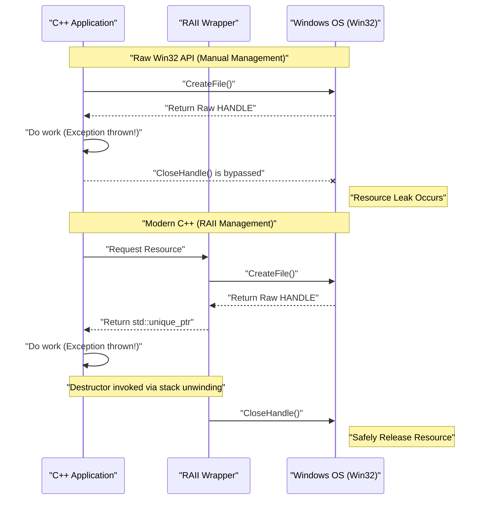
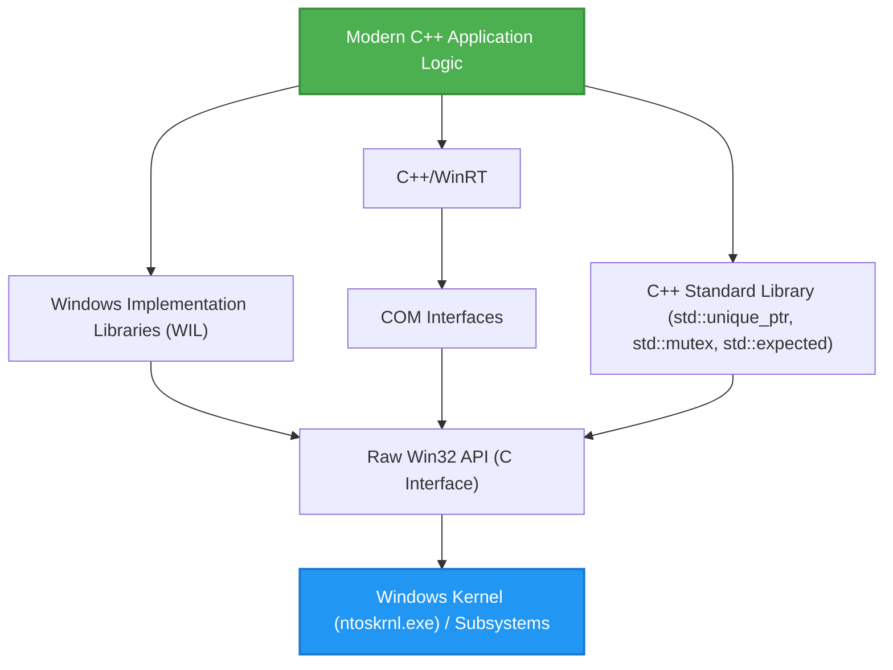

## 1. Introduction: The Gap Between C-based Win32 API and Modern C++

The **Windows API (commonly known as Win32 API)**, which serves as the foundation of the Windows OS, is a massive C-language interface that has been continuously inherited since the era of Windows NT and Windows 95 in the 1990s. Even today, when developing native applications for Windows, it is ultimately necessary to call this Win32 API to access the OS's core functions (process management, file I/O, thread synchronization, window control, etc.).

However, the Win32 API was designed purely for the C language and does not assume the advanced language features (such as exception handling, automatic resource management via RAII, move semantics, type-safe enumerations, smart pointers, etc.) possessed by **Modern C++**. As a result, mixing raw Win32 APIs directly into C++ code causes the following problems:

*   **Manual Resource Management:** A `HANDLE` acquired by `CreateFile` or `CreateEvent` must unfailingly be released using `CloseHandle`.
*   **Lack of Exception Safety:** If a C++ exception is thrown, resource leaks easily occur unless processing to appropriately call `CloseHandle` is written.
*   **Inconsistent Error Representation:** One API returns a `BOOL` and requires calling `GetLastError()` upon failure. Another API returns an `HRESULT`, and yet another (such as GDI) returns `NULL`.
*   **Lack of Type Safety:** Macros for `HANDLE`, `HWND`, `HDC`, etc., often expand to nothing more than `void*`, making it difficult for the compiler to perform strict type checking.

In this article, we will explain in extreme detail the methods to avoid the traps of these "legacy C interfaces" and handle the Win32 API **safely and modernly** using the features of modern C++ (C++11/14/17/20/23).

---

## 2. The Dangers of Raw Win32 API: Resource Leaks and Error Handling Traps

First, let's look at common code that calls the Win32 API in the traditional C style. At first glance, it seems to have no issues, but from the perspective of modern C++, it holds fatal vulnerabilities.

```cpp
#include <windows.h>
#include <iostream>
#include <vector>

void ProcessFileLegacy(const std::wstring& filename) {
    // 1. Acquire file handle
    HANDLE hFile = ::CreateFileW(
        filename.c_str(),
        GENERIC_READ,
        FILE_SHARE_READ,
        NULL,
        OPEN_EXISTING,
        FILE_ATTRIBUTE_NORMAL,
        NULL
    );

    if (hFile == INVALID_HANDLE_VALUE) {
        std::cerr << "Failed to open file. Error: " << ::GetLastError() << std::endl;
        return;
    }

    // 2. Get file size
    LARGE_INTEGER fileSize;
    if (!::GetFileSizeEx(hFile, &fileSize)) {
        ::CloseHandle(hFile); // Manual release on error
        return;
    }

    // 3. Allocate memory and read
    std::vector<char> buffer(fileSize.QuadPart);
    DWORD bytesRead = 0;
    
    if (!::ReadFile(hFile, buffer.data(), buffer.size(), &bytesRead, NULL)) {
        ::CloseHandle(hFile); // Manual release on error
        return;
    }

    // --- Assume there is processing here that might throw an exception ---
    // Example: A function parsing the buffer contents throws std::runtime_error
    // ParseBuffer(buffer); // If an exception is thrown, the CloseHandle below won't be called, causing a leak!

    // 4. Manual resource release
    ::CloseHandle(hFile);
}
```

### What is the problem with this code?

1.  **Code Duplication and Clutter:** It is necessary to write `::CloseHandle(hFile);` at every early return point (`return`), which violates the DRY (Don't Repeat Yourself) principle.
2.  **Complete Lack of Exception Safety (Exception Unsafe):** In C++, when memory allocation for `std::vector` fails (`std::bad_alloc`) or another function throws an exception, the function forcibly exits. At this time, the `CloseHandle` at the end is not executed, so **the file handle leaks forever** (causing serious bugs such as the file remaining locked until the process terminates).

---

## 3. Mathematical Model of Exception Safety and Resource Management

Here, let's mathematically (probabilistically) model how fragile manual resource management is.

Suppose there are $N$ resource allocations (or early return points, exception throwing points) within a function. Let the probability of exiting the function due to an error or exception at each step $i$ be $P(\text{Exit}_i)$. We consider the probability that cleanup code (like `CloseHandle`) cannot be manually and correctly written for all exit paths, resulting in a resource leak.

If we let $p$ be the probability of an omission due to human attention span or unexpected exits caused by unknown exceptions (the leak probability per path), the probability $P(\text{Leak})$ that at least one resource leak occurs in the entire program is expressed by the following formula:

$$ P(\text{Leak}) = 1 - (1 - p)^N $$

For example, if $p = 0.05$ (a 5% chance of missing exception handling or cleanup) and $N = 20$ (a complex function with 20 error return or exception points):

$$ P(\text{Leak}) = 1 - (1 - 0.05)^{20} \approx 1 - 0.358 = 0.642 $$

Surprisingly, **there is about a 64.2% probability that a resource leak bug lurks somewhere**. As the scale of software grows and $N \to \infty$, $P(\text{Leak}) \to 1$, and the system will inevitably collapse.

The only rational means to counter this mathematical reality is C++'s **RAII (Resource Acquisition Is Initialization)**.

---

## 4. Fundamentals of RAII (Resource Acquisition Is Initialization)

RAII is a concept advocated by Bjarne Stroustrup, the creator of C++. Its principles are extremely simple and powerful.

1.  Perform resource Acquisition in the object's **constructor (Initialization)**.
2.  Perform resource release in the object's **destructor**.

Due to C++'s language specifications, when leaving a scope (whether through a normal `return` or during stack unwinding due to an exception), the destructors of objects allocated on the stack are **reliably and automatically** called.

As a result, the human error probability $p$ in the previous formula can be mathematically reduced to **$0$**.

### Visualizing the Object Lifecycle

The sequence diagram below shows the difference in lifecycle between manual management using raw APIs and automatic management using RAII.



---

## 5. Safe Wrapping Technique for `HANDLE` Using `std::unique_ptr`

Since C++11, the standard library provides `std::unique_ptr`, a versatile RAII wrapper. This can be applied not just to managing simple memory (`new/delete`), but to managing any resource by specifying a **Custom Deleter**.

A basic deleter for managing a Win32 `HANDLE` with `std::unique_ptr` can be written as follows:

```cpp
#include <windows.h>
#include <memory>

// Custom deleter for HANDLE
struct handle_deleter {
    // Specify the pointer type used internally by std::unique_ptr
    using pointer = HANDLE; 

    void operator()(HANDLE handle) const noexcept {
        if (handle != nullptr && handle != INVALID_HANDLE_VALUE) {
            ::CloseHandle(handle);
        }
    }
};

// Type alias for a safe handle
using unique_handle = std::unique_ptr<void, handle_deleter>;
```

By using this `unique_handle`, the dangerous code from earlier is reborn as follows:

```cpp
void ProcessFileModern(const std::wstring& filename) {
    // Pass ownership to the RAII object immediately after acquisition
    unique_handle hFile(::CreateFileW(
        filename.c_str(), GENERIC_READ, FILE_SHARE_READ, NULL,
        OPEN_EXISTING, FILE_ATTRIBUTE_NORMAL, NULL
    ));

    // Error check (Handling INVALID_HANDLE_VALUE is discussed later)
    if (hFile.get() == INVALID_HANDLE_VALUE) {
        throw std::runtime_error("Failed to open file");
    }

    LARGE_INTEGER fileSize;
    if (!::GetFileSizeEx(hFile.get(), &fileSize)) {
        throw std::runtime_error("Failed to get file size");
    }

    std::vector<char> buffer(fileSize.QuadPart);
    DWORD bytesRead = 0;
    
    if (!::ReadFile(hFile.get(), buffer.data(), buffer.size(), &bytesRead, NULL)) {
        throw std::runtime_error("Failed to read file");
    }

    // Even if an exception occurs here, or there is an early return,
    // the unique_handle's destructor calls CloseHandle the moment we exit the function!
}
```

---

## 6. Deep Dive: Solving the Problem of `INVALID_HANDLE_VALUE` and `nullptr`

One of the most vexing specifications for C++ programmers dealing with the Win32 API is that **the representation of an invalid handle is inconsistent**.

*   `CreateEvent`, `CreateThread`, etc.: Return `NULL` (`nullptr`) on failure.
*   `CreateFile`, etc.: Return `INVALID_HANDLE_VALUE` (which as a value is `(HANDLE)-1`) on failure.

The standard `std::unique_ptr` treats the internal pointer being `nullptr` as a special "empty state (a state where no resource is owned)". In other words, a boolean evaluation like `if (ptr)` returns `false` only for `nullptr`.

However, if `CreateFile` fails and returns `INVALID_HANDLE_VALUE`, `std::unique_ptr` mistakenly recognizes it as a "valid non-NULL pointer".

To elegantly solve this problem, we utilize the advanced specifications of C++'s `std::unique_ptr` and define a **custom pointer type**.

```cpp
#include <windows.h>
#include <memory>

struct win32_handle_traits {
    // Definition of the custom pointer type
    class pointer {
        HANDLE m_handle;
    public:
        // While it's possible to design INVALID_HANDLE_VALUE as the initial value for default construction or nullptr assignment,
        // we treat both nullptr and INVALID_HANDLE_VALUE as invalid states to increase versatility.
        pointer() noexcept : m_handle(nullptr) {}
        pointer(std::nullptr_t) noexcept : m_handle(nullptr) {}
        pointer(HANDLE h) noexcept : m_handle(h) {}
        
        // Overload operator bool to filter out both types of Win32 invalid values
        explicit operator bool() const noexcept {
            return m_handle != nullptr && m_handle != INVALID_HANDLE_VALUE;
        }
        
        operator HANDLE() const noexcept { return m_handle; }
        
        friend bool operator==(pointer a, pointer b) noexcept { return a.m_handle == b.m_handle; }
        friend bool operator!=(pointer a, pointer b) noexcept { return a.m_handle != b.m_handle; }
    };
    
    void operator()(pointer p) const noexcept {
        if (p) { // operator bool is called
            ::CloseHandle(p);
        }
    }
};

using safe_win32_handle = std::unique_ptr<void, win32_handle_traits>;
```

With this implementation, intuitive and safe code can be written as follows:

```cpp
safe_win32_handle hFile(::CreateFileW(...));
if (!hFile) {
    // Both nullptr and INVALID_HANDLE_VALUE can be caught here!
    throw std::system_error(::GetLastError(), std::system_category(), "CreateFile failed");
}
```

---

## 7. Advanced RAII Management for GDI Objects (`HDC`, `HBITMAP`)

Another difficult point in Win32 is resource management for GDI (Graphics Device Interface).
GDI objects (pens, brushes, fonts, bitmaps, etc.) require an extremely tedious etiquette: after creation, they are selected into a device context (`HDC`) using `SelectObject` for use, and when finished, **the original object must be re-selected using SelectObject to restore it before destroying the new one with DeleteObject**.

A wrapper to solve this with RAII looks like this:

```cpp
// Deleter for deleting GDI objects
struct gdi_deleter {
    using pointer = HGDIOBJ;
    void operator()(HGDIOBJ obj) const noexcept {
        if (obj != nullptr) {
            ::DeleteObject(obj);
        }
    }
};

using unique_gdi_obj = std::unique_ptr<void, gdi_deleter>;

// RAII wrapper for SelectObject (restores the original object when exiting scope)
class gdi_selector {
    HDC m_hdc;
    HGDIOBJ m_oldObj;

public:
    gdi_selector(HDC hdc, HGDIOBJ newObj) : m_hdc(hdc) {
        // Select the new object and save the old one
        m_oldObj = ::SelectObject(m_hdc, newObj);
    }

    ~gdi_selector() {
        if (m_oldObj != nullptr && m_oldObj != HGDI_ERROR) {
            // Auto-restore when exiting scope
            ::SelectObject(m_hdc, m_oldObj);
        }
    }

    // Disable copying
    gdi_selector(const gdi_selector&) = delete;
    gdi_selector& operator=(const gdi_selector&) = delete;
};
```

### Usage Example

```cpp
void DrawMyGraphics(HDC hdc) {
    // Create a pen (RAII managed)
    unique_gdi_obj hPen(::CreatePen(PS_SOLID, 1, RGB(255, 0, 0)));
    
    {
        // Select pen into HDC (Scope managed)
        gdi_selector penSelect(hdc, hPen.get());
        
        // Drawing process...
        ::MoveToEx(hdc, 0, 0, NULL);
        ::LineTo(hdc, 100, 100);
        
        // When exiting the scope, penSelect's destructor restores the old pen via SelectObject
    }
    
    // When exiting the function, hPen's destructor calls DeleteObject
}
```
Thus, managing resources with nested lifecycles is where RAII truly shines.

---

## 8. Modernizing Thread Synchronization Objects

Win32 contains thread synchronization primitives like `CRITICAL_SECTION` and `SRWLOCK`. Manually calling `EnterCriticalSection` / `LeaveCriticalSection` for these is strictly forbidden from an exception safety standpoint.

While C++11's `std::mutex` and `std::lock_guard` are very convenient, there are situations where you want to directly use OS-native fast locking mechanisms (especially since SRWLock is very lightweight).
The standard `std::lock_guard` is designed to accept any type that has `lock()` and `unlock()` member functions (a template specification akin to duck typing). We can take advantage of this.

```cpp
class win32_srwlock {
    SRWLOCK m_lock;
public:
    win32_srwlock() noexcept {
        ::InitializeSRWLock(&m_lock);
    }
    
    // Interface required by std::lock_guard
    void lock() noexcept {
        ::AcquireSRWLockExclusive(&m_lock);
    }
    void unlock() noexcept {
        ::ReleaseSRWLockExclusive(&m_lock);
    }
    
    // Disable copying and moving
    win32_srwlock(const win32_srwlock&) = delete;
    win32_srwlock& operator=(const win32_srwlock&) = delete;
};
```

This allows you to handle Win32 locks entirely within the conventions of the C++ standard library.

```cpp
win32_srwlock g_myLock;
int g_sharedData = 0;

void UpdateData() {
    // Exception-safe lock acquisition
    std::lock_guard<win32_srwlock> lock(g_myLock);
    
    g_sharedData++;
    if (g_sharedData > 100) {
        throw std::runtime_error("Overflow"); // Lock is safely released even if an exception is thrown!
    }
}
```

---

## 9. Integration with the C++ Standard Library: `std::system_error` and `HRESULT`

The mainstream Win32 errors are `GetLastError()` (DWORD type) and `HRESULT`, which is used in COM and DirectX. By converting these into `std::system_error`, a C++ exception, error handling can be modernized.

When throwing `GetLastError()`, the implementation in MSVC (Visual C++) provides `std::system_category()`, which offers a mapping between Win32 error codes and messages.

```cpp
inline void throw_if_win32_error(BOOL result, const char* msg = "Win32 API failed") {
    if (!result) {
        DWORD err = ::GetLastError();
        // std::system_category calls the FormatMessage API internally to generate the error string
        throw std::system_error(err, std::system_category(), msg);
    }
}
```

For `HRESULT`, you can either create a dedicated error category or use the Windows standard `_com_error`.

---

## 10. Modern Error Handling Using `std::expected` (C++23)

C++23 introduced `std::expected`, which is equivalent to Rust's `Result` type. In projects that avoid exceptions (for performance reasons or in designs where errors occur frequently), it is the optimal method for modernizing Win32 return values.

```cpp
#include <expected>
#include <string>

// Returns unique_handle on success, DWORD (error code) on failure
std::expected<safe_win32_handle, DWORD> OpenFileModern(const std::wstring& path) {
    safe_win32_handle h(::CreateFileW(
        path.c_str(), GENERIC_READ, 0, nullptr, OPEN_EXISTING, 0, nullptr));
        
    if (!h) {
        return std::unexpected(::GetLastError());
    }
    return std::move(h); // Move and return the handle on success
}

void Usage() {
    auto result = OpenFileModern(L"C:\\test.txt");
    if (result) {
        // Processing on success
        safe_win32_handle& hFile = *result;
        // ...
    } else {
        // Processing on failure
        DWORD err = result.error();
        std::cerr << "Error code: " << err << std::endl;
    }
}
```

By using C++23 in this way, you can achieve both the benefits of RAII and error handling via return values.

---

## 11. Microsoft's Answer (1): Utilizing WIL (Windows Implementation Libraries)

We have introduced custom wrappers thus far, but in truth, Microsoft themselves takes this issue seriously and has released an official header-only library for modern C++, **WIL (Windows Implementation Libraries)**, as open source (available on GitHub).

When utilizing WIL, all the wrappers we painstakingly created above are provided as standard.

```cpp
#include <wil/resource.h>
#include <wil/result.h>

void ProcessWithWIL() {
    // wil::unique_handle already handles both INVALID_HANDLE_VALUE and NULL
    wil::unique_handle hFile;
    
    // The THROW_IF_WIN32_BOOL_FALSE macro automates error checking and exception throwing
    THROW_IF_WIN32_BOOL_FALSE(
        ::CreateFileW(L"test.txt", GENERIC_READ, 0, nullptr, OPEN_EXISTING, 0, nullptr),
        hFile.put() // Helper for receiving output pointers specific to WIL
    );
    
    // Memory management wrappers like wil::unique_cotaskmem_string are also extensive
}
```

The essence of WIL lies in a formidable template called `wil::unique_any`, which allows you to generate RAII wrappers with just a few lines of definition for any and all Win32 resources, including not only file handles but also registry keys, GDI objects, local memory, etc.

---

## 12. Microsoft's Answer (2): Abstracting COM via C++/WinRT

Many Win32 APIs (especially shell extensions and DirectX) are provided through C-based COM (Component Object Model) interfaces.
Further evolving from the legacy `CComPtr` (ATL) and `ComPtr` (WRL), **C++/WinRT** is currently officially recommended by Microsoft.

C++/WinRT can handle not only the Windows Runtime (WinRT) but also traditional COM objects with extreme elegance.

```cpp
#include <winrt/base.h>

void ComExample() {
    // COM initialization (RAII-fied)
    winrt::init_apartment();

    // Safely manage COM interfaces inheriting IUnknown with winrt::com_ptr
    winrt::com_ptr<IDXGIFactory> factory;
    winrt::check_hresult(
        ::CreateDXGIFactory(__uuidof(IDXGIFactory), factory.put_void())
    );
    
    // There is absolutely no need to manually call AddRef or Release
}
```

---

## 13. Visualizing Architecture and Lifecycle

Let's organize the layer structure in modern Windows C++ application development.



Application logic should never touch the raw Win32 API (Layer E) directly. By adopting an architecture that always accesses it via one of the abstraction layers—the standard library, WIL, or C++/WinRT—memory safety improves dramatically.

---

## 14. Performance Analysis of Zero-cost Abstractions

Some might wonder, "Doesn't using RAII wrappers and smart pointers make the execution slower than raw C APIs?"
Let's look at the mathematical model of the performance cost here.

The execution time $T_{\text{total}}$ can be decomposed as follows:

$$ T_{\text{total}} = T_{\text{syscall}} + T_{\text{wrapper}} + T_{\text{cleanup}} $$

*   $T_{\text{syscall}}$: The time taken for kernel-mode transitions and actual processing inside the Win32 API. Usually on the order of milliseconds to microseconds.
*   $T_{\text{wrapper}}$: The time taken to construct wrapper classes like `std::unique_ptr` or WIL.
*   $T_{\text{cleanup}}$: The time taken for destructor invocation.

C++ compilers (MSVC, Clang, GCC) are extremely adept at Inlining optimization. Constructors and destructors of `std::unique_ptr`, as well as overloaded `operator*` or `operator bool`, are all expanded `inline` and compiled into exactly the same machine code as direct manipulations on raw pointers in memory.

In other words, **$T_{\text{wrapper}} \approx 0$**. This is the proof of **Zero-cost Abstraction**, which is the greatest philosophy of C++. Even if you acquire safety, the execution overhead is literally zero.

---

## 15. Conclusion: The Future of Safe Windows Programming

The Win32 API is a good old legacy designed in the paradigm of the C language due to historical reasons. However, C++, the language that calls it, continues to evolve, and it is now possible to write extremely safe and expressive code.

Let's review the key points explained in this article.

1.  **Never write manual `CloseHandle` or `DeleteObject`.** Encapsulate everything in RAII containers like `std::unique_ptr`.
2.  **Understand the trap of `INVALID_HANDLE_VALUE`.** Implement custom deleters and custom pointer traits, or use WIL's `wil::unique_handle`.
3.  **Modernize error handling.** Throw `GetLastError()` and `HRESULT` as `std::system_error` exceptions, or process them in a type-safe manner using C++23's `std::expected`.
4.  **Stand on the shoulders of giants.** Actively adopt Microsoft's official WIL and C++/WinRT to avoid reinventing the wheel.

In modern C++ development, carrying around naked raw pointers or handles is like driving on the highway without wearing a seatbelt. Make full use of the powerful type system and RAII provided by C++, and enjoy developing safe and robust Windows applications.
