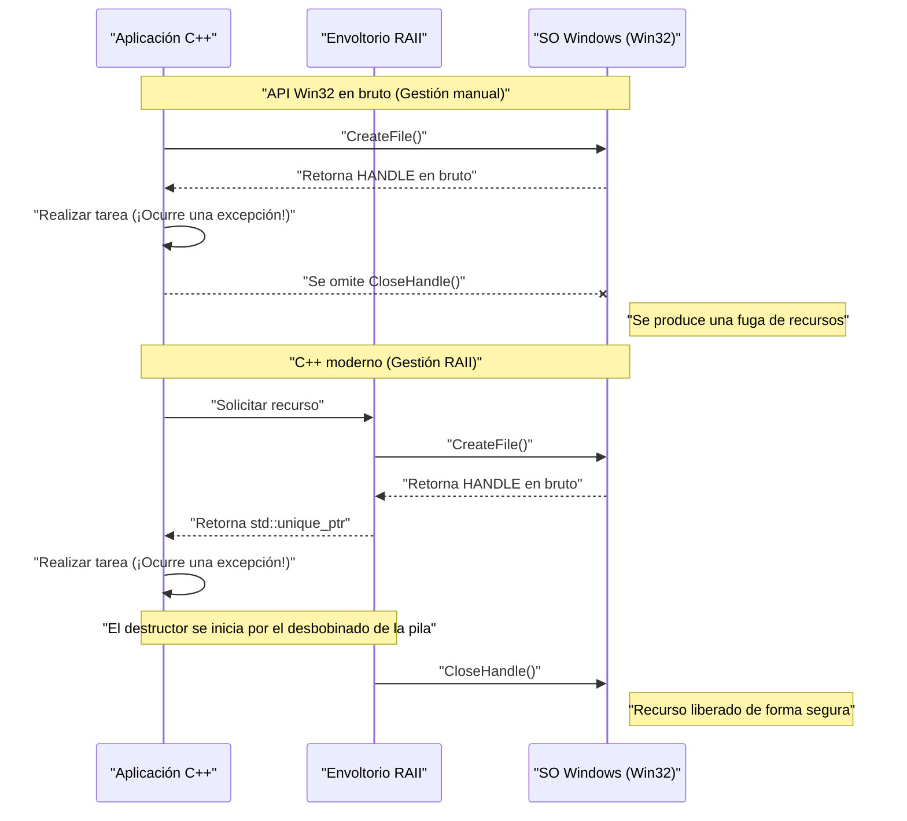
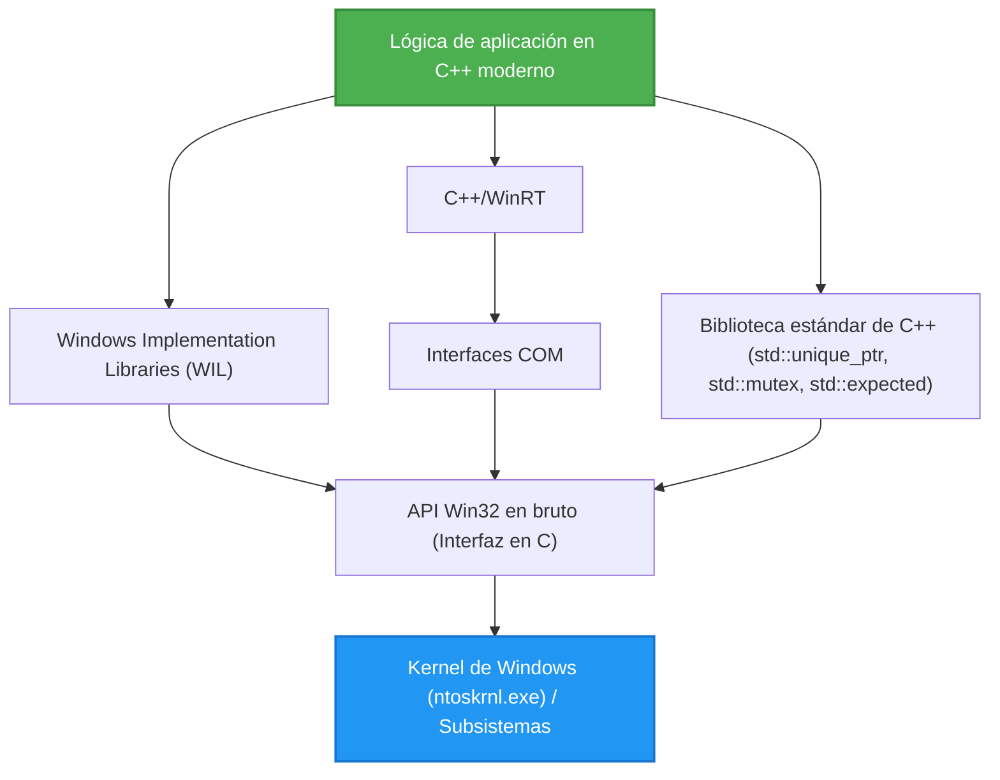

## 1. Introducción: La brecha entre la API de Win32 basada en C y el C++ moderno

La **API de Windows (comúnmente conocida como API Win32)**, que constituye la base del sistema operativo Windows, es una enorme interfaz en lenguaje C que se ha transmitido de forma continua desde la época de Windows NT y Windows 95 en la década de 1990. Incluso hoy en día, al desarrollar aplicaciones nativas para Windows, en última instancia es necesario llamar a esta API Win32 para acceder a las funciones principales del sistema operativo (gestión de procesos, E/S de archivos, sincronización de hilos, control de ventanas, etc.).

Sin embargo, la API Win32 fue diseñada puramente para el lenguaje C, y no presupone las características avanzadas del lenguaje que posee el **C++ moderno (Modern C++)** (manejo de excepciones, gestión automática de recursos mediante RAII, semántica de movimiento, enumeraciones con seguridad de tipos, punteros inteligentes, etc.). Como resultado, si se mezcla la API Win32 en bruto directamente en el código de C++, surgen los siguientes problemas:

*   **Gestión manual de recursos:** Un `HANDLE` obtenido con `CreateFile` o `CreateEvent` debe ser liberado obligatoriamente con `CloseHandle`.
*   **Falta de seguridad frente a excepciones:** Si se lanza una excepción de C++, y no se ha escrito el código para llamar adecuadamente a `CloseHandle`, se produce fácilmente una fuga de recursos.
*   **Representación de errores inconsistente:** Algunas APIs devuelven un `BOOL`, requiriendo llamar a `GetLastError()` en caso de fallo. Otras APIs devuelven un `HRESULT`, y otras (como GDI) devuelven `NULL`.
*   **Falta de seguridad de tipos:** Tipos como `HANDLE`, `HWND` o `HDC`, al expandir sus macros, a menudo resultan ser simples `void*`, dificultando que el compilador aplique una verificación de tipos estricta.

En este artículo, explicaremos de forma extremadamente detallada las técnicas para evitar estas trampas de las "interfaces C heredadas" y **manejar la API Win32 de forma segura (Safe) y moderna (Modern)** utilizando las características del C++ contemporáneo (C++11/14/17/20/23).

---

## 2. Los peligros de la API Win32 en bruto: Fugas de recursos y trampas en el manejo de errores

Primero, veamos un código común que llama a la API Win32 al estilo C antiguo. A simple vista parece no tener problemas, pero desde la perspectiva del C++ moderno, alberga vulnerabilidades fatales.

```cpp
#include <windows.h>
#include <iostream>
#include <vector>

void ProcessFileLegacy(const std::wstring& filename) {
    // 1. Obtención del manejador de archivo
    HANDLE hFile = ::CreateFileW(
        filename.c_str(),
        GENERIC_READ,
        FILE_SHARE_READ,
        NULL,
        OPEN_EXISTING,
        FILE_ATTRIBUTE_NORMAL,
        NULL
    );

    if (hFile == INVALID_HANDLE_VALUE) {
        std::cerr << "Failed to open file. Error: " << ::GetLastError() << std::endl;
        return;
    }

    // 2. Obtención del tamaño del archivo
    LARGE_INTEGER fileSize;
    if (!::GetFileSizeEx(hFile, &fileSize)) {
        ::CloseHandle(hFile); // Liberación manual en caso de error
        return;
    }

    // 3. Asignación de memoria y lectura
    std::vector<char> buffer(fileSize.QuadPart);
    DWORD bytesRead = 0;
    
    if (!::ReadFile(hFile, buffer.data(), buffer.size(), &bytesRead, NULL)) {
        ::CloseHandle(hFile); // Liberación manual en caso de error
        return;
    }

    // --- Supongamos que hay un proceso que lanza una excepción aquí ---
    // Ejemplo: una función que analiza el contenido del buffer lanza std::runtime_error
    // ParseBuffer(buffer); // ¡Si se lanza una excepción, el CloseHandle de abajo no será llamado y habrá una fuga!

    // 4. Liberación manual del recurso
    ::CloseHandle(hFile);
}
```

### ¿Cuál es el problema con este código?

1.  **Duplicación y complejidad del código:** Cada vez que hay un retorno anticipado (`return`), es necesario escribir `::CloseHandle(hFile);`, lo cual viola el principio DRY (Don't Repeat Yourself).
2.  **Falta total de seguridad frente a excepciones (Exception Unsafe):** En C++, cuando falla la asignación de memoria de `std::vector` (`std::bad_alloc`), o cuando otra función lanza una excepción, se escapa forzosamente de la función. En este momento, el `CloseHandle` del final no se ejecuta, por lo que **el manejador del archivo se filtra para siempre** (causando errores graves, como que el archivo quede bloqueado hasta que termine el proceso).

---

## 3. Modelo matemático de seguridad frente a excepciones y gestión de recursos

Aquí, modelemos matemáticamente (de forma probabilística) cuán frágil es la gestión manual de recursos.

Supongamos que hay $N$ puntos de asignación de recursos (o puntos de retorno anticipado, puntos de generación de excepciones) dentro de una función. Sea $P(\text{Exit}_i)$ la probabilidad de escapar de la función debido a un error o excepción en cada paso $i$. Consideremos la probabilidad de que se produzca una fuga de recursos por no poder escribir manualmente de forma correcta el código de limpieza (como `CloseHandle`) en todas las rutas de escape.

Si definimos $p$ como la probabilidad de que ocurra una omisión en la escritura por falta de atención humana o un escape inesperado debido a una excepción desconocida (la probabilidad de fuga por cada ruta), la probabilidad $P(\text{Leak})$ de que ocurra al menos una fuga de recursos en todo el programa se expresa con la siguiente fórmula:

$$ P(\text{Leak}) = 1 - (1 - p)^N $$

Por ejemplo, si $p = 0.05$ (5% de probabilidad de equivocarse en el manejo de excepciones o la limpieza) y $N = 20$ (hay 20 puntos de retorno por error o puntos de excepción en una función compleja):

$$ P(\text{Leak}) = 1 - (1 - 0.05)^{20} \approx 1 - 0.358 = 0.642 $$

Sorprendentemente, **hay aproximadamente un 64.2% de probabilidad de que se oculte un bug de fuga de recursos en alguna parte**. A medida que la escala del software crece y $N \to \infty$, $P(\text{Leak}) \to 1$, y el sistema fracasará inevitablemente.

El único medio racional para contrarrestar esta realidad matemática es el **RAII (Resource Acquisition Is Initialization)** de C++.

---

## 4. Fundamentos del RAII (Resource Acquisition Is Initialization)

RAII es un concepto propuesto por el creador de C++, Bjarne Stroustrup. Su principio es extremadamente simple y poderoso.

1.  La adquisición (Acquisition) del recurso se realiza en el **constructor (Initialization)** del objeto.
2.  La liberación del recurso se realiza en el **destructor** del objeto.

Por las especificaciones del lenguaje C++, al salir del alcance (ya sea por un `return` normal o durante el desbobinado de la pila por una excepción), los destructores de los objetos creados en la pila son llamados de forma **segura y automática**.

De este modo, se puede reducir la probabilidad de error humano $p$ en la fórmula anterior matemáticamente a **$0$**.

### Visualización del ciclo de vida del objeto

El siguiente diagrama de secuencia muestra la diferencia en el ciclo de vida entre la gestión manual usando la API en bruto y la gestión automática usando RAII.



---

## 5. Método para envolver de forma segura un `HANDLE` usando `std::unique_ptr`

Desde C++11, la biblioteca estándar provee `std::unique_ptr`, un envoltorio RAII de uso general. Esto no solo se aplica a la gestión de memoria (`new/delete`), sino que al especificar un **eliminador personalizado (Custom Deleter)**, se puede aplicar a la gestión de cualquier recurso.

El eliminador básico para gestionar un `HANDLE` de Win32 con `std::unique_ptr` se puede escribir de la siguiente manera.

```cpp
#include <windows.h>
#include <memory>

// Eliminador personalizado para HANDLE
struct handle_deleter {
    // Especifica el tipo de puntero que std::unique_ptr maneja internamente
    using pointer = HANDLE; 

    void operator()(HANDLE handle) const noexcept {
        if (handle != nullptr && handle != INVALID_HANDLE_VALUE) {
            ::CloseHandle(handle);
        }
    }
};

// Alias de tipo para un manejador seguro
using unique_handle = std::unique_ptr<void, handle_deleter>;
```

Usando este `unique_handle`, el código peligroso anterior renace de la siguiente forma.

```cpp
void ProcessFileModern(const std::wstring& filename) {
    // Pasamos la propiedad al objeto RAII inmediatamente después de adquirirla
    unique_handle hFile(::CreateFileW(
        filename.c_str(), GENERIC_READ, FILE_SHARE_READ, NULL,
        OPEN_EXISTING, FILE_ATTRIBUTE_NORMAL, NULL
    ));

    // Comprobación de errores (el manejo de INVALID_HANDLE_VALUE se explica más adelante)
    if (hFile.get() == INVALID_HANDLE_VALUE) {
        throw std::runtime_error("Failed to open file");
    }

    LARGE_INTEGER fileSize;
    if (!::GetFileSizeEx(hFile.get(), &fileSize)) {
        throw std::runtime_error("Failed to get file size");
    }

    std::vector<char> buffer(fileSize.QuadPart);
    DWORD bytesRead = 0;
    
    if (!::ReadFile(hFile.get(), buffer.data(), buffer.size(), &bytesRead, NULL)) {
        throw std::runtime_error("Failed to read file");
    }

    // Incluso si ocurre una excepción aquí o hay un retorno anticipado,
    // ¡el destructor de unique_handle llamará a CloseHandle en el momento de salir de la función!
}
```

---

## 6. Análisis profundo: Solución al problema de `INVALID_HANDLE_VALUE` y `nullptr`

Una de las especificaciones que más atormenta a los programadores de C++ al usar la API Win32 es **la inconsistencia en la representación de manejadores no válidos**.

*   `CreateEvent` o `CreateThread`, etc.: Devuelven `NULL` (`nullptr`) cuando fallan.
*   `CreateFile`, etc.: Devuelven `INVALID_HANDLE_VALUE` (como valor, `(HANDLE)-1`) cuando fallan.

El `std::unique_ptr` estándar trata el caso donde el puntero interno es `nullptr` de forma especial como un "estado vacío (estado sin poseer recursos)". Es decir, una evaluación booleana como `if (ptr)` solo devolverá `false` para `nullptr`.

Sin embargo, si `CreateFile` falla y devuelve `INVALID_HANDLE_VALUE`, `std::unique_ptr` lo interpretará erróneamente como un "puntero válido distinto de NULL".

Para solucionar este problema de manera elegante, utilizamos las características avanzadas de `std::unique_ptr` de C++ y definimos un **tipo de puntero personalizado**.

```cpp
#include <windows.h>
#include <memory>

struct win32_handle_traits {
    // Definición del tipo de puntero personalizado
    class pointer {
        HANDLE m_handle;
    public:
        // Es posible diseñar INVALID_HANDLE_VALUE como valor inicial en la construcción por defecto o asignación de nullptr,
        // pero para aumentar la generalidad, tratamos tanto a nullptr como a INVALID_HANDLE_VALUE como estados inválidos.
        pointer() noexcept : m_handle(nullptr) {}
        pointer(std::nullptr_t) noexcept : m_handle(nullptr) {}
        pointer(HANDLE h) noexcept : m_handle(h) {}
        
        // Sobrecarga de operator bool para rechazar ambos tipos de valores inválidos de Win32
        explicit operator bool() const noexcept {
            return m_handle != nullptr && m_handle != INVALID_HANDLE_VALUE;
        }
        
        operator HANDLE() const noexcept { return m_handle; }
        
        friend bool operator==(pointer a, pointer b) noexcept { return a.m_handle == b.m_handle; }
        friend bool operator!=(pointer a, pointer b) noexcept { return a.m_handle != b.m_handle; }
    };
    
    void operator()(pointer p) const noexcept {
        if (p) { // se llama a operator bool
            ::CloseHandle(p);
        }
    }
};

using safe_win32_handle = std::unique_ptr<void, win32_handle_traits>;
```

Con esta implementación, es posible escribir un código intuitivo y seguro de la siguiente manera.

```cpp
safe_win32_handle hFile(::CreateFileW(...));
if (!hFile) {
    // ¡Aquí se pueden capturar tanto nullptr como INVALID_HANDLE_VALUE!
    throw std::system_error(::GetLastError(), std::system_category(), "CreateFile failed");
}
```

---

## 7. Gestión avanzada mediante RAII de objetos GDI (`HDC`, `HBITMAP`)

Otro de los puntos críticos de Win32 es la gestión de recursos de GDI (Graphics Device Interface).
Los objetos GDI (plumas, pinceles, fuentes, mapas de bits, etc.) requieren una convención muy tediosa: tras crearlos, se seleccionan en un contexto de dispositivo (`HDC`) mediante `SelectObject` para su uso, y cuando se terminan de usar, **se debe volver a seleccionar el objeto original para restaurarlo con SelectObject, y luego destruirlo con DeleteObject**.

Un envoltorio para solucionar esto con RAII sería de la siguiente manera.

```cpp
// Eliminador para borrar objetos GDI
struct gdi_deleter {
    using pointer = HGDIOBJ;
    void operator()(HGDIOBJ obj) const noexcept {
        if (obj != nullptr) {
            ::DeleteObject(obj);
        }
    }
};

using unique_gdi_obj = std::unique_ptr<void, gdi_deleter>;

// Envoltorio RAII para SelectObject (Restaura el objeto original al salir del alcance)
class gdi_selector {
    HDC m_hdc;
    HGDIOBJ m_oldObj;

public:
    gdi_selector(HDC hdc, HGDIOBJ newObj) : m_hdc(hdc) {
        // Selecciona el nuevo objeto y guarda el antiguo
        m_oldObj = ::SelectObject(m_hdc, newObj);
    }

    ~gdi_selector() {
        if (m_oldObj != nullptr && m_oldObj != HGDI_ERROR) {
            // Restauración automática al salir del alcance
            ::SelectObject(m_hdc, m_oldObj);
        }
    }

    // Copia prohibida
    gdi_selector(const gdi_selector&) = delete;
    gdi_selector& operator=(const gdi_selector&) = delete;
};
```

### Ejemplo de uso

```cpp
void DrawMyGraphics(HDC hdc) {
    // Crear una pluma (Gestión RAII)
    unique_gdi_obj hPen(::CreatePen(PS_SOLID, 1, RGB(255, 0, 0)));
    
    {
        // Seleccionar pluma en HDC (Gestión de alcance)
        gdi_selector penSelect(hdc, hPen.get());
        
        // Proceso de dibujo...
        ::MoveToEx(hdc, 0, 0, NULL);
        ::LineTo(hdc, 100, 100);
        
        // Al salir del alcance, el destructor de penSelect restaura la antigua pluma con SelectObject
    }
    
    // Al salir de la función, el destructor de hPen llama a DeleteObject
}
```
De esta manera, la gestión de recursos con ciclos de vida anidados es el dominio exclusivo de RAII.

---

## 8. Modernización de objetos de sincronización de hilos

En Win32 existen primitivas de sincronización de hilos como `CRITICAL_SECTION` o `SRWLOCK`. Llamar manualmente a `EnterCriticalSection` / `LeaveCriticalSection` también está prohibido desde el punto de vista de la seguridad frente a excepciones.

`std::mutex` y `std::lock_guard` de C++11 son muy convenientes, pero hay situaciones donde se desea usar directamente los mecanismos de bloqueo nativos y rápidos del sistema operativo (especialmente SRWLock, que es muy ligero).
El `std::lock_guard` estándar tiene una especificación (como un tipado de pato en plantillas) que acepta cualquier tipo que tenga funciones miembro `lock()` y `unlock()`. Utilizaremos esto.

```cpp
class win32_srwlock {
    SRWLOCK m_lock;
public:
    win32_srwlock() noexcept {
        ::InitializeSRWLock(&m_lock);
    }
    
    // Interfaz requerida por std::lock_guard
    void lock() noexcept {
        ::AcquireSRWLockExclusive(&m_lock);
    }
    void unlock() noexcept {
        ::ReleaseSRWLockExclusive(&m_lock);
    }
    
    // Copia/Movimiento prohibidos
    win32_srwlock(const win32_srwlock&) = delete;
    win32_srwlock& operator=(const win32_srwlock&) = delete;
};
```

Con esto, puedes manejar los bloqueos de Win32 completamente siguiendo las convenciones de la biblioteca estándar de C++.

```cpp
win32_srwlock g_myLock;
int g_sharedData = 0;

void UpdateData() {
    // Adquisición de bloqueo segura frente a excepciones
    std::lock_guard<win32_srwlock> lock(g_myLock);
    
    g_sharedData++;
    if (g_sharedData > 100) {
        throw std::runtime_error("Overflow"); // ¡Incluso si se lanza una excepción, el bloqueo se libera de forma segura!
    }
}
```

---

## 9. Integración con la biblioteca estándar de C++: `std::system_error` y `HRESULT`

Los errores en Win32 se presentan principalmente de dos formas: `GetLastError()` (tipo DWORD) y `HRESULT`, utilizado en COM y DirectX. Al convertir estos a `std::system_error`, que es la excepción de C++, se puede modernizar el manejo de errores.

Al lanzar `GetLastError()`, en la implementación de MSVC (Visual C++), `std::system_category()` proporciona un mapeo entre el código de error de Win32 y el mensaje correspondiente.

```cpp
inline void throw_if_win32_error(BOOL result, const char* msg = "Win32 API failed") {
    if (!result) {
        DWORD err = ::GetLastError();
        // std::system_category llama internamente a la API FormatMessage para generar la cadena de error
        throw std::system_error(err, std::system_category(), msg);
    }
}
```

Por otro lado, con respecto a `HRESULT`, se puede crear una categoría de error dedicada o usar `_com_error` que es estándar de Windows.

---

## 10. Manejo de errores moderno utilizando `std::expected` (C++23)

A partir de C++23, se introdujo `std::expected`, equivalente al tipo `Result` de Rust. Es el método óptimo para modernizar los valores de retorno de Win32 en proyectos a los que no les gustan las excepciones (por razones de rendimiento o diseño donde los errores son frecuentes).

```cpp
#include <expected>
#include <string>

// En caso de éxito retorna unique_handle, en caso de fallo retorna DWORD (código de error)
std::expected<safe_win32_handle, DWORD> OpenFileModern(const std::wstring& path) {
    safe_win32_handle h(::CreateFileW(
        path.c_str(), GENERIC_READ, 0, nullptr, OPEN_EXISTING, 0, nullptr));
        
    if (!h) {
        return std::unexpected(::GetLastError());
    }
    return std::move(h); // En caso de éxito, retorna moviendo el manejador
}

void Usage() {
    auto result = OpenFileModern(L"C:\\test.txt");
    if (result) {
        // Proceso en caso de éxito
        safe_win32_handle& hFile = *result;
        // ...
    } else {
        // Proceso en caso de fallo
        DWORD err = result.error();
        std::cerr << "Error code: " << err << std::endl;
    }
}
```

De esta manera, utilizando C++23, es posible combinar el manejo de errores por valores de retorno y los beneficios de RAII.

---

## 11. La respuesta de Microsoft (1): Uso de WIL (Windows Implementation Libraries)

Hasta ahora hemos introducido envoltorios hechos por nosotros mismos, pero la realidad es que el propio Microsoft también se toma este problema en serio, y ha publicado de código abierto **WIL (Windows Implementation Libraries)**, una biblioteca oficial solo de cabeceras para C++ moderno (disponible en GitHub).

Al utilizar WIL, todos los envoltorios que creamos con tanto esfuerzo arriba se proporcionan de forma estándar.

```cpp
#include <wil/resource.h>
#include <wil/result.h>

void ProcessWithWIL() {
    // wil::unique_handle ya es compatible tanto con INVALID_HANDLE_VALUE como con NULL
    wil::unique_handle hFile;
    
    // El macro THROW_IF_WIN32_BOOL_FALSE automatiza la comprobación de errores y el lanzamiento de excepciones
    THROW_IF_WIN32_BOOL_FALSE(
        ::CreateFileW(L"test.txt", GENERIC_READ, 0, nullptr, OPEN_EXISTING, 0, nullptr),
        hFile.put() // Un ayudante específico de WIL para recibir punteros de salida
    );
    
    // También cuenta con envoltorios de gestión de memoria, como wil::unique_cotaskmem_string
}
```

La verdadera esencia de WIL reside en una poderosa plantilla llamada `wil::unique_any`, con la cual se pueden generar envoltorios RAII para toda clase de recursos de Win32, no solo manejadores de archivos, sino también claves de registro, objetos GDI, memoria local, etc., con tan solo unas pocas líneas de definición.

---

## 12. La respuesta de Microsoft (2): Abstracción de COM con C++/WinRT

Muchas de las APIs de Win32 (especialmente extensiones de Shell y DirectX, etc.) se proporcionan a través de la interfaz COM (Component Object Model) basada en C.
Avanzando los tradicionales `CComPtr` (ATL) y `ComPtr` (WRL), lo que Microsoft recomienda oficialmente en la actualidad es **C++/WinRT**.

C++/WinRT permite manejar de manera extremadamente inteligente no solo el Windows Runtime (WinRT), sino también los objetos COM tradicionales.

```cpp
#include <winrt/base.h>

void ComExample() {
    // Inicialización de COM (Convertido a RAII)
    winrt::init_apartment();

    // Gestionar de forma segura con winrt::com_ptr la interfaz COM que hereda de IUnknown
    winrt::com_ptr<IDXGIFactory> factory;
    winrt::check_hresult(
        ::CreateDXGIFactory(__uuidof(IDXGIFactory), factory.put_void())
    );
    
    // No hay necesidad alguna de llamar manualmente a AddRef o Release
}
```

---

## 13. Visualización de la arquitectura y el ciclo de vida

Ordenemos la estructura de capas en el desarrollo actual de aplicaciones Windows en C++.



La lógica de la aplicación no debe tocar directamente la API Win32 en bruto (Capa E). Asegurarse de tener una arquitectura en la que siempre se acceda a través de las capas de abstracción como la biblioteca estándar, WIL o C++/WinRT, mejorará drásticamente la seguridad de la memoria.

---

## 14. Análisis de rendimiento de la abstracción de coste cero

Es posible que algunos se pregunten: "¿Usar envoltorios RAII y punteros inteligentes no hace que se ejecute más lento que la API de lenguaje C en bruto?".
Veamos un modelo matemático del costo de rendimiento.

El tiempo de ejecución $T_{\text{total}}$ se puede descomponer de la siguiente manera.

$$ T_{\text{total}} = T_{\text{syscall}} + T_{\text{wrapper}} + T_{\text{cleanup}} $$

*   $T_{\text{syscall}}$: Tiempo invertido en la transición al modo de kernel dentro de la API Win32 y el proceso real. Por lo general, en milisegundos o microsegundos.
*   $T_{\text{wrapper}}$: Tiempo invertido en construir clases de envoltura como `std::unique_ptr` o las de WIL.
*   $T_{\text{cleanup}}$: Tiempo invertido en llamar a los destructores.

Los compiladores de C++ (MSVC, Clang, GCC) son extremadamente buenos en la optimización de expansiones en línea (Inlining). Los constructores y destructores de `std::unique_ptr`, y las sobrecargas de `operator*` y `operator bool` se expanden todos en línea (con `inline`), y se compilan en exactamente el mismo código de máquina que las operaciones directas sobre los punteros en bruto en memoria.

Es decir, **$T_{\text{wrapper}} \approx 0$**. Esto es la prueba de la mayor filosofía de C++, **Abstracción de coste cero (Zero-cost Abstraction)**. Incluso al ganar seguridad, la sobrecarga en tiempo de ejecución es literalmente cero.

---

## 15. Conclusión: El futuro de la programación segura en Windows

Por razones históricas, la API Win32 es un antiguo y buen legado diseñado bajo el paradigma del lenguaje C. Sin embargo, C++, el lado que la invoca, ha seguido evolucionando, y hoy en día es posible escribir código extremadamente seguro y expresivo.

Repasemos los puntos importantes explicados en este artículo.

1.  **No escribir nunca `CloseHandle` o `DeleteObject` de forma manual.** Confinar todo en contenedores RAII como `std::unique_ptr`.
2.  **Entender la trampa de `INVALID_HANDLE_VALUE`.** Implementar un eliminador personalizado o rasgos de punteros personalizados, o utilizar el `wil::unique_handle` de WIL.
3.  **Modernizar el manejo de errores.** Lanzar `GetLastError()` o `HRESULT` como una excepción de `std::system_error`, o utilizar el `std::expected` de C++23 para procesar con seguridad de tipos.
4.  **Subirse a hombros de gigantes.** Adoptar activamente WIL o C++/WinRT oficiales de Microsoft, evitando reinventar la rueda.

En el desarrollo moderno de C++, llevar a cuestas punteros o manejadores en bruto desnudos es como conducir por la autopista sin ponerse el cinturón de seguridad. Aproveche al máximo el potente sistema de tipos y RAII proporcionados por C++, y disfrute del desarrollo seguro y robusto de aplicaciones para Windows.
