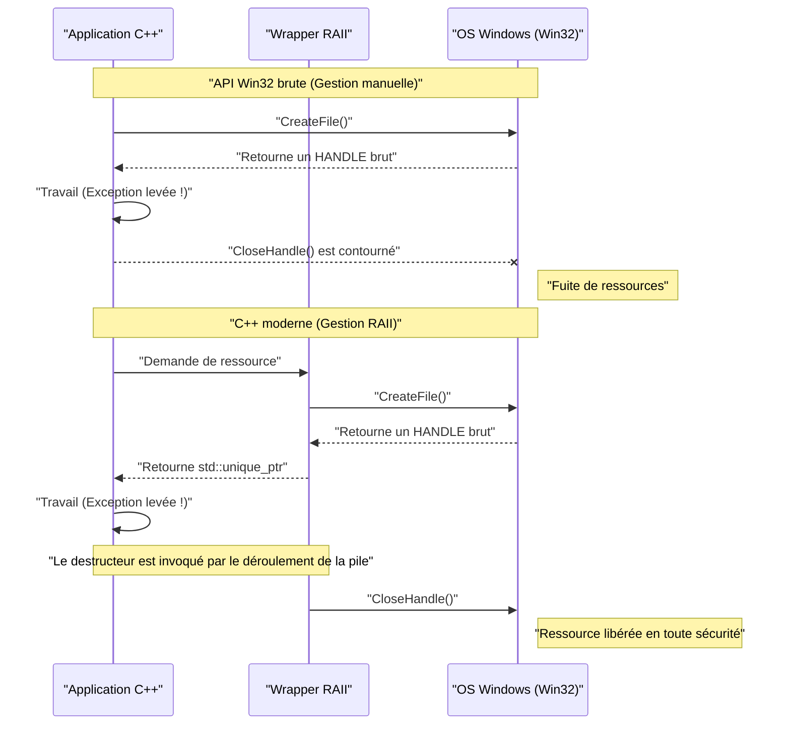
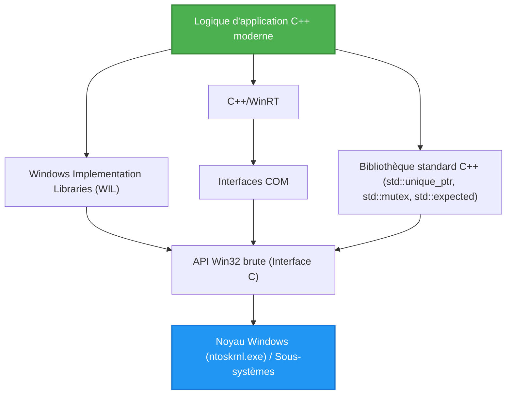

## 1. Introduction : L'écart entre l'API Win32 basée sur C et le C++ moderne

L'**API Windows (communément appelée API Win32)**, qui constitue la base du système d'exploitation Windows, est une vaste interface en langage C qui a été transmise depuis l'ère de Windows NT et Windows 95 dans les années 1990. Même aujourd'hui, lors du développement d'applications natives pour Windows, il est nécessaire d'appeler en fin de compte cette API Win32 pour accéder aux fonctions principales du système d'exploitation (gestion des processus, E/S de fichiers, synchronisation des threads, contrôle des fenêtres, etc.).

Cependant, l'API Win32 a été conçue pour le langage C pur, et ne présuppose pas les fonctionnalités de langage avancées (gestion des exceptions, gestion automatique des ressources par RAII, sémantique de déplacement, énumérations fortement typées, pointeurs intelligents, etc.) du **C++ moderne**. Par conséquent, si vous mélangez directement l'API Win32 brute dans votre code C++, les problèmes suivants surviendront :

*   **Gestion manuelle des ressources :** Un `HANDLE` obtenu via `CreateFile` ou `CreateEvent` doit obligatoirement être libéré via `CloseHandle`.
*   **Manque de sécurité des exceptions :** Si une exception C++ est levée, des fuites de ressources se produiront facilement si le code pour appeler correctement `CloseHandle` n'est pas écrit.
*   **Représentation incohérente des erreurs :** Certaines API renvoient un `BOOL` et nécessitent d'appeler `GetLastError()` en cas d'échec. D'autres API renvoient un `HRESULT`, et d'autres encore (comme GDI) renvoient `NULL`.
*   **Manque de sécurité du typage :** `HANDLE`, `HWND`, `HDC`, etc., ne sont souvent que de simples `void*` une fois les macros développées, ce qui rend difficile une vérification stricte des types par le compilateur.

Dans cet article, nous expliquerons en détail comment éviter ces pièges de "l'interface C héritée" et manipuler l'API Win32 de manière **sûre (Safe) et moderne (Modern)** en utilisant les fonctionnalités du C++ moderne (C++11/14/17/20/23).

---

## 2. Les dangers de l'API Win32 brute : Les pièges des fuites de ressources et de la gestion des erreurs

Tout d'abord, regardons un code courant qui appelle l'API Win32 dans le style C traditionnel. À première vue, cela semble ne poser aucun problème, mais du point de vue du C++ moderne, cela présente des vulnérabilités fatales.

```cpp
#include <windows.h>
#include <iostream>
#include <vector>

void ProcessFileLegacy(const std::wstring& filename) {
    // 1. Obtention du handle de fichier
    HANDLE hFile = ::CreateFileW(
        filename.c_str(),
        GENERIC_READ,
        FILE_SHARE_READ,
        NULL,
        OPEN_EXISTING,
        FILE_ATTRIBUTE_NORMAL,
        NULL
    );

    if (hFile == INVALID_HANDLE_VALUE) {
        std::cerr << "Failed to open file. Error: " << ::GetLastError() << std::endl;
        return;
    }

    // 2. Obtention de la taille du fichier
    LARGE_INTEGER fileSize;
    if (!::GetFileSizeEx(hFile, &fileSize)) {
        ::CloseHandle(hFile); // Libération manuelle en cas d'erreur
        return;
    }

    // 3. Allocation de la mémoire et lecture
    std::vector<char> buffer(fileSize.QuadPart);
    DWORD bytesRead = 0;
    
    if (!::ReadFile(hFile, buffer.data(), buffer.size(), &bytesRead, NULL)) {
        ::CloseHandle(hFile); // Libération manuelle en cas d'erreur
        return;
    }

    // --- Supposons qu'il y ait ici un traitement qui lève une exception ---
    // Exemple : La fonction qui analyse le contenu de buffer lève std::runtime_error
    // ParseBuffer(buffer); // Si une exception est levée, le CloseHandle ci-dessous n'est pas appelé et une fuite se produit !

    // 4. Libération manuelle des ressources
    ::CloseHandle(hFile);
}
```

### Quel est le problème avec ce code ?

1.  **Duplication et complexité du code :** À chaque retour anticipé (`return`), il est nécessaire d'écrire `::CloseHandle(hFile);`, ce qui va à l'encontre du principe DRY (Don't Repeat Yourself).
2.  **Manque total de sécurité des exceptions (Exception Unsafe) :** En C++, lors de l'échec de l'allocation de mémoire de `std::vector` (`std::bad_alloc`) ou si une autre fonction lève une exception, le programme quitte la fonction de force. À ce moment-là, le `CloseHandle` final n'étant pas exécuté, **le handle de fichier fuira pour toujours** (ce qui provoque de graves bugs, comme le maintien du verrouillage du fichier jusqu'à la fin du processus).

---

## 3. Le modèle mathématique de la sécurité des exceptions et de la gestion des ressources

Ici, modélisons mathématiquement (probabilistiquement) à quel point la gestion manuelle des ressources est vulnérable.

Supposons qu'il y ait $N$ allocations de ressources (ou points de retour anticipé, ou points d'exception) dans une fonction. Soit $P(\text{Exit}_i)$ la probabilité qu'une erreur ou une exception se produise à chaque étape $i$ et force à quitter la fonction. Considérons la probabilité d'une fuite de ressources si le code de nettoyage (comme `CloseHandle`) n'est pas correctement écrit manuellement pour tous les chemins de sortie.

Si l'on pose $p$ la probabilité qu'une omission due à l'inattention humaine ou qu'une sortie inattendue due à une exception inconnue se produise (la probabilité de fuite par chemin), la probabilité $P(\text{Leak})$ qu'au moins une fuite de ressources se produise dans l'ensemble du programme s'exprime par la formule suivante :

$$ P(\text{Leak}) = 1 - (1 - p)^N $$

Par exemple, si $p = 0.05$ (5 % de probabilité de faire une erreur de gestion des exceptions ou de nettoyage) et $N = 20$ (il y a 20 retours d'erreur ou points d'exception dans une fonction complexe) :

$$ P(\text{Leak}) = 1 - (1 - 0.05)^{20} \approx 1 - 0.358 = 0.642 $$

Étonnamment, **il y a environ 64,2 % de probabilité qu'un bug de fuite de ressources se cache quelque part**. Lorsque la taille du logiciel augmente et que $N \to \infty$, alors $P(\text{Leak}) \to 1$, et le système est inévitablement voué à l'échec.

Le seul moyen rationnel de contrer cette réalité mathématique est le **RAII (Resource Acquisition Is Initialization)** du C++.

---

## 4. Les bases du RAII (Resource Acquisition Is Initialization)

Le RAII est un concept proposé par le créateur du C++, Bjarne Stroustrup. Son principe est extrêmement simple et puissant.

1.  L'acquisition de la ressource (Acquisition) est effectuée dans le **constructeur de l'objet (Initialization)**.
2.  La libération de la ressource est effectuée dans le **destructeur** de l'objet.

Grâce aux spécifications du langage C++, à la sortie de la portée (que ce soit par un `return` normal ou lors du déroulement de la pile dû à une exception), le destructeur d'un objet alloué sur la pile est appelé **systématiquement et automatiquement**.

Cela permet de réduire mathématiquement la probabilité d'erreur humaine $p$ de la formule précédente à **$0$**.

### Visualisation du cycle de vie des objets

Le diagramme de séquence suivant illustre la différence de cycle de vie entre la gestion manuelle utilisant l'API brute et la gestion automatique utilisant le RAII.



---

## 5. Méthode d'encapsulation sécurisée d'un `HANDLE` en utilisant `std::unique_ptr`

Depuis C++11, la bibliothèque standard fournit `std::unique_ptr`, qui est un wrapper RAII polyvalent. Il ne sert pas seulement à gérer la mémoire (`new/delete`), mais peut être appliqué à la gestion de n'importe quelle ressource en spécifiant un **suppresseur personnalisé (Custom Deleter)**.

Un suppresseur de base pour gérer un `HANDLE` Win32 avec `std::unique_ptr` peut être écrit de la manière suivante.

```cpp
#include <windows.h>
#include <memory>

// Suppresseur personnalisé pour HANDLE
struct handle_deleter {
    // Spécifie le type de pointeur géré en interne par std::unique_ptr
    using pointer = HANDLE; 

    void operator()(HANDLE handle) const noexcept {
        if (handle != nullptr && handle != INVALID_HANDLE_VALUE) {
            ::CloseHandle(handle);
        }
    }
};

// Alias de type pour un handle sécurisé
using unique_handle = std::unique_ptr<void, handle_deleter>;
```

En utilisant ce `unique_handle`, le code dangereux précédent se transforme comme suit.

```cpp
void ProcessFileModern(const std::wstring& filename) {
    // Transfert de la propriété à l'objet RAII immédiatement après l'obtention
    unique_handle hFile(::CreateFileW(
        filename.c_str(), GENERIC_READ, FILE_SHARE_READ, NULL,
        OPEN_EXISTING, FILE_ATTRIBUTE_NORMAL, NULL
    ));

    // Vérification d'erreur (la gestion de INVALID_HANDLE_VALUE sera détaillée plus tard)
    if (hFile.get() == INVALID_HANDLE_VALUE) {
        throw std::runtime_error("Failed to open file");
    }

    LARGE_INTEGER fileSize;
    if (!::GetFileSizeEx(hFile.get(), &fileSize)) {
        throw std::runtime_error("Failed to get file size");
    }

    std::vector<char> buffer(fileSize.QuadPart);
    DWORD bytesRead = 0;
    
    if (!::ReadFile(hFile.get(), buffer.data(), buffer.size(), &bytesRead, NULL)) {
        throw std::runtime_error("Failed to read file");
    }

    // Même si une exception se produit ici, ou si un retour anticipé a lieu,
    // le destructeur de unique_handle appellera CloseHandle au moment précis où l'on quitte la fonction !
}
```

---

## 6. En profondeur : Résolution du problème de `INVALID_HANDLE_VALUE` et `nullptr`

L'une des spécifications qui tourmente le plus les programmeurs C++ lors de la manipulation de l'API Win32 est **l'incohérence dans la représentation des handles invalides**.

*   `CreateEvent`, `CreateThread`, etc. : renvoient `NULL` (`nullptr`) en cas d'échec.
*   `CreateFile`, etc. : renvoient `INVALID_HANDLE_VALUE` (valant `(HANDLE)-1`) en cas d'échec.

Le `std::unique_ptr` standard traite de manière spéciale le cas où le pointeur interne est `nullptr` en le considérant comme un "état vide (état sans propriété de ressource)". C'est-à-dire que l'évaluation booléenne comme `if (ptr)` renvoie `false` uniquement pour `nullptr`.

Cependant, si `CreateFile` échoue et renvoie `INVALID_HANDLE_VALUE`, `std::unique_ptr` l'interprétera à tort comme un "pointeur non-NULL valide".

Pour résoudre ce problème de manière élégante, nous utilisons les spécifications avancées de `std::unique_ptr` du C++ pour définir un **type de pointeur personnalisé**.

```cpp
#include <windows.h>
#include <memory>

struct win32_handle_traits {
    // Définition du type de pointeur personnalisé
    class pointer {
        HANDLE m_handle;
    public:
        // Bien qu'il soit possible de concevoir pour que la valeur initiale soit INVALID_HANDLE_VALUE lors de la construction par défaut ou l'affectation de nullptr,
        // nous traitons à la fois nullptr et INVALID_HANDLE_VALUE comme des états invalides pour plus de polyvalence.
        pointer() noexcept : m_handle(nullptr) {}
        pointer(std::nullptr_t) noexcept : m_handle(nullptr) {}
        pointer(HANDLE h) noexcept : m_handle(h) {}
        
        // Surcharge de operator bool pour rejeter les deux types de valeurs invalides de Win32
        explicit operator bool() const noexcept {
            return m_handle != nullptr && m_handle != INVALID_HANDLE_VALUE;
        }
        
        operator HANDLE() const noexcept { return m_handle; }
        
        friend bool operator==(pointer a, pointer b) noexcept { return a.m_handle == b.m_handle; }
        friend bool operator!=(pointer a, pointer b) noexcept { return a.m_handle != b.m_handle; }
    };
    
    void operator()(pointer p) const noexcept {
        if (p) { // operator bool est appelé
            ::CloseHandle(p);
        }
    }
};

using safe_win32_handle = std::unique_ptr<void, win32_handle_traits>;
```

Grâce à cette implémentation, il est désormais possible d'écrire un code intuitif et sûr comme le suivant.

```cpp
safe_win32_handle hFile(::CreateFileW(...));
if (!hFile) {
    // nullptr et INVALID_HANDLE_VALUE peuvent tous deux être interceptés ici !
    throw std::system_error(::GetLastError(), std::system_category(), "CreateFile failed");
}
```

---

## 7. Gestion avancée par RAII des objets GDI (`HDC`, `HBITMAP`)

Un autre point difficile de Win32 est la gestion des ressources de GDI (Graphics Device Interface).
Les objets GDI (stylos, pinceaux, polices, bitmaps, etc.) exigent une procédure très fastidieuse : après leur création, ils sont sélectionnés dans le contexte de périphérique (`HDC`) via `SelectObject` pour être utilisés, et une fois terminés, **l'objet original doit être de nouveau restauré via SelectObject avant d'être détruit avec DeleteObject**.

Le wrapper pour résoudre cela via RAII est le suivant.

```cpp
// Suppresseur pour la suppression d'objets GDI
struct gdi_deleter {
    using pointer = HGDIOBJ;
    void operator()(HGDIOBJ obj) const noexcept {
        if (obj != nullptr) {
            ::DeleteObject(obj);
        }
    }
};

using unique_gdi_obj = std::unique_ptr<void, gdi_deleter>;

// Wrapper RAII pour SelectObject (restaure l'objet original à la sortie de la portée)
class gdi_selector {
    HDC m_hdc;
    HGDIOBJ m_oldObj;

public:
    gdi_selector(HDC hdc, HGDIOBJ newObj) : m_hdc(hdc) {
        // Sélectionne le nouvel objet et sauvegarde l'ancien
        m_oldObj = ::SelectObject(m_hdc, newObj);
    }

    ~gdi_selector() {
        if (m_oldObj != nullptr && m_oldObj != HGDI_ERROR) {
            // Restauration automatique en quittant la portée
            ::SelectObject(m_hdc, m_oldObj);
        }
    }

    // Interdiction de copie
    gdi_selector(const gdi_selector&) = delete;
    gdi_selector& operator=(const gdi_selector&) = delete;
};
```

### Exemple d'utilisation

```cpp
void DrawMyGraphics(HDC hdc) {
    // Création du stylo (Gestion RAII)
    unique_gdi_obj hPen(::CreatePen(PS_SOLID, 1, RGB(255, 0, 0)));
    
    {
        // Sélection du stylo dans le HDC (Gestion par portée)
        gdi_selector penSelect(hdc, hPen.get());
        
        // Traitement de dessin...
        ::MoveToEx(hdc, 0, 0, NULL);
        ::LineTo(hdc, 100, 100);
        
        // En quittant la portée, le destructeur de penSelect restaure l'ancien stylo avec SelectObject
    }
    
    // En quittant la fonction, le destructeur de hPen appelle DeleteObject
}
```
Comme on peut le voir, la gestion des ressources dont les cycles de vie sont imbriqués est le domaine de prédilection du RAII.

---

## 8. Modernisation des objets de synchronisation de threads

Il existe des primitives de synchronisation de threads telles que `CRITICAL_SECTION` et `SRWLOCK` dans Win32. Appeler manuellement `EnterCriticalSection` / `LeaveCriticalSection` pour celles-ci est également prohibé du point de vue de la sécurité des exceptions.

Bien que `std::mutex` et `std::lock_guard` de C++11 soient très pratiques, il existe des situations où l'on souhaite utiliser directement les mécanismes de verrouillage rapides natifs de l'OS (en particulier SRWLock qui est très léger).
Le `std::lock_guard` standard est conçu pour accepter n'importe quel type possédant les fonctions membres `lock()` et `unlock()` (une spécification de modèle semblable au duck typing). Nous allons exploiter cela.

```cpp
class win32_srwlock {
    SRWLOCK m_lock;
public:
    win32_srwlock() noexcept {
        ::InitializeSRWLock(&m_lock);
    }
    
    // L'interface requise par std::lock_guard
    void lock() noexcept {
        ::AcquireSRWLockExclusive(&m_lock);
    }
    void unlock() noexcept {
        ::ReleaseSRWLockExclusive(&m_lock);
    }
    
    // Interdiction de copie et de déplacement
    win32_srwlock(const win32_srwlock&) = delete;
    win32_srwlock& operator=(const win32_srwlock&) = delete;
};
```

Grâce à cela, il est possible de manipuler les verrous Win32 de la manière standard de la bibliothèque C++.

```cpp
win32_srwlock g_myLock;
int g_sharedData = 0;

void UpdateData() {
    // Acquisition de verrouillage avec sécurité des exceptions
    std::lock_guard<win32_srwlock> lock(g_myLock);
    
    g_sharedData++;
    if (g_sharedData > 100) {
        throw std::runtime_error("Overflow"); // Le verrou est libéré en toute sécurité même si une exception est levée !
    }
}
```

---

## 9. Intégration avec la bibliothèque standard C++ : `std::system_error` et `HRESULT`

Les erreurs Win32 sont principalement de deux types : `GetLastError()` (type DWORD) et `HRESULT`, utilisé dans COM et DirectX. En convertissant celles-ci en `std::system_error` (qui est l'exception de C++), la gestion des erreurs peut être modernisée.

Pour lancer une exception liée à `GetLastError()`, l'implémentation de MSVC (Visual C++) fournit un mappage entre les codes d'erreur Win32 et les messages via `std::system_category()`.

```cpp
inline void throw_if_win32_error(BOOL result, const char* msg = "Win32 API failed") {
    if (!result) {
        DWORD err = ::GetLastError();
        // std::system_category appelle l'API FormatMessage en interne pour générer la chaîne d'erreur
        throw std::system_error(err, std::system_category(), msg);
    }
}
```

D'autre part, en ce qui concerne `HRESULT`, on crée une catégorie d'erreur dédiée ou on utilise le `_com_error` standard de Windows.

---

## 10. Gestion moderne des erreurs à l'aide de `std::expected` (C++23)

À partir de C++23, `std::expected`, qui équivaut au type `Result` de Rust, a été introduit. Dans les projets où les exceptions ne sont pas souhaitées (pour des raisons de performances ou parce que la conception implique des erreurs fréquentes), c'est la méthode optimale pour moderniser les valeurs de retour de Win32.

```cpp
#include <expected>
#include <string>

// Retourne un unique_handle en cas de succès, un DWORD (code d'erreur) en cas d'échec
std::expected<safe_win32_handle, DWORD> OpenFileModern(const std::wstring& path) {
    safe_win32_handle h(::CreateFileW(
        path.c_str(), GENERIC_READ, 0, nullptr, OPEN_EXISTING, 0, nullptr));
        
    if (!h) {
        return std::unexpected(::GetLastError());
    }
    return std::move(h); // Déplace et retourne le handle en cas de succès
}

void Usage() {
    auto result = OpenFileModern(L"C:\\test.txt");
    if (result) {
        // Traitement en cas de succès
        safe_win32_handle& hFile = *result;
        // ...
    } else {
        // Traitement en cas d'échec
        DWORD err = result.error();
        std::cerr << "Error code: " << err << std::endl;
    }
}
```

De cette façon, l'utilisation de C++23 permet de combiner les avantages de la gestion des erreurs par valeur de retour et du RAII.

---

## 11. La réponse de Microsoft (1) : L'utilisation de WIL (Windows Implementation Libraries)

Bien que nous ayons présenté des wrappers faits maison jusqu'à présent, en réalité, Microsoft prend également ce problème très au sérieux, et publie une bibliothèque d'en-tête officielle pour le C++ moderne, **WIL (Windows Implementation Libraries)**, en open source (disponible sur GitHub).

En utilisant WIL, tous les wrappers que nous avons pris la peine de créer ci-dessus sont fournis en standard.

```cpp
#include <wil/resource.h>
#include <wil/result.h>

void ProcessWithWIL() {
    // wil::unique_handle prend déjà en charge à la fois INVALID_HANDLE_VALUE et NULL
    wil::unique_handle hFile;
    
    // La macro THROW_IF_WIN32_BOOL_FALSE automatise la vérification d'erreur et le lancement d'exception
    THROW_IF_WIN32_BOOL_FALSE(
        ::CreateFileW(L"test.txt", GENERIC_READ, 0, nullptr, OPEN_EXISTING, 0, nullptr),
        hFile.put() // Aider de réception de pointeur de sortie spécifique à WIL
    );
    
    // De nombreux wrappers de gestion de la mémoire, tels que wil::unique_cotaskmem_string, sont également disponibles
}
```

La véritable force de WIL réside dans un puissant modèle appelé `wil::unique_any`, qui permet de générer des wrappers RAII en quelques lignes de code pour n'importe quelle ressource Win32, et pas seulement les handles de fichiers, comme les clés de registre, les objets GDI, ou la mémoire locale.

---

## 12. La réponse de Microsoft (2) : L'abstraction de COM avec C++/WinRT

Une grande partie des API Win32 (en particulier les extensions de shell et DirectX) est fournie via l'interface COM (Component Object Model) basée sur C.
En faisant évoluer les anciens `CComPtr` (ATL) et `ComPtr` (WRL), ce que Microsoft recommande officiellement aujourd'hui, c'est **C++/WinRT**.

C++/WinRT permet de manipuler de manière extrêmement intelligente non seulement le Windows Runtime (WinRT), mais aussi les objets COM traditionnels.

```cpp
#include <winrt/base.h>

void ComExample() {
    // Initialisation de COM (Convertie en RAII)
    winrt::init_apartment();

    // Gestion sécurisée de l'interface COM héritant d'IUnknown avec winrt::com_ptr
    winrt::com_ptr<IDXGIFactory> factory;
    winrt::check_hresult(
        ::CreateDXGIFactory(__uuidof(IDXGIFactory), factory.put_void())
    );
    
    // Il n'est pas du tout nécessaire d'appeler manuellement AddRef ou Release
}
```

---

## 13. Visualisation de l'architecture et du cycle de vie

Mettons de l'ordre dans la structure en couches du développement d'applications Windows en C++ moderne.



La logique de l'application ne devrait jamais toucher directement l'API Win32 brute (Couche E). L'architecture doit toujours y accéder par le biais d'une des couches d'abstraction telles que la bibliothèque standard, WIL ou C++/WinRT, ce qui améliore considérablement la sécurité de la mémoire.

---

## 14. Analyse des performances de l'abstraction à coût zéro

Certains pourraient se demander : "Si j'utilise des wrappers RAII ou des pointeurs intelligents, l'exécution ne sera-t-elle pas plus lente que l'API en langage C brut ?"
Regardons maintenant le modèle mathématique du coût des performances.

Le temps d'exécution $T_{\text{total}}$ peut être décomposé comme suit :

$$ T_{\text{total}} = T_{\text{syscall}} + T_{\text{wrapper}} + T_{\text{cleanup}} $$

*   $T_{\text{syscall}}$ : Temps pris pour la transition vers le mode noyau à l'intérieur de l'API Win32 et pour le traitement réel. Généralement de l'ordre des millisecondes aux microsecondes.
*   $T_{\text{wrapper}}$ : Temps pris pour construire des classes d'encapsulation telles que `std::unique_ptr` ou WIL.
*   $T_{\text{cleanup}}$ : Temps pris pour l'appel au destructeur.

Les compilateurs C++ (MSVC, Clang, GCC) excellent dans l'optimisation par inlining (déploiement en ligne). Les constructeurs et destructeurs de `std::unique_ptr`, ainsi que les `operator*` et `operator bool` surchargés, sont tous étendus par `inline` et compilés dans le même code machine que les manipulations directes de pointeurs bruts en mémoire.

Autrement dit, on a **$T_{\text{wrapper}} \approx 0$**. C'est la preuve de la plus grande philosophie du C++, l'**Abstraction à Coût Zéro (Zero-cost Abstraction)**. Même si l'on acquiert la sécurité, la surcharge à l'exécution est littéralement nulle.

---

## 15. Conclusion : L'avenir de la programmation Windows sécurisée

L'API Win32 est un héritage de la belle époque, conçu avec les paradigmes du langage C pour des raisons historiques. Cependant, le C++, qui est le côté appelant, a continué d'évoluer, et il est aujourd'hui possible d'écrire un code extrêmement sûr et expressif.

Récapitulons les points importants abordés dans cet article.

1.  **N'écrivez aucun appel manuel à `CloseHandle` ou `DeleteObject`.** Enfermez tout dans des conteneurs RAII tels que `std::unique_ptr`.
2.  **Comprendre le piège de `INVALID_HANDLE_VALUE`.** Implémentez un suppresseur personnalisé et des traits de pointeurs personnalisés, ou utilisez le `wil::unique_handle` de WIL.
3.  **Modernisez la gestion des erreurs.** Levez `GetLastError()` ou `HRESULT` en tant qu'exceptions `std::system_error`, ou utilisez `std::expected` de C++23 pour une gestion avec typage sécurisé.
4.  **Montez sur les épaules des géants.** Adoptez activement WIL ou C++/WinRT, officiels de Microsoft, et évitez de réinventer la roue.

Dans le développement moderne en C++, transporter des pointeurs ou des handles bruts à nu revient à conduire sur l'autoroute sans attacher sa ceinture de sécurité. Utilisez à fond le système de typage puissant et le RAII fournis par le C++, et profitez du développement d'applications Windows sûres et robustes.
