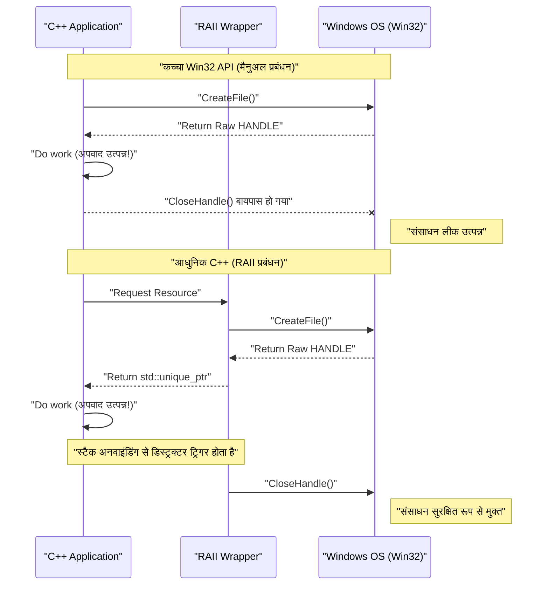
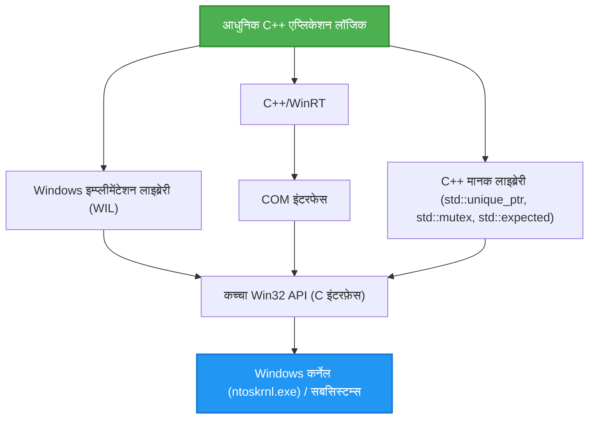

## 1. परिचय: C-आधारित Win32 API और आधुनिक C++ के बीच का अंतर

Windows OS का आधारभूत **Windows API (जिसे सामान्यतः Win32 API कहा जाता है)** एक विशाल C भाषा इंटरफ़ेस है, जिसे 1990 के दशक में Windows NT और Windows 95 के युग से लगातार आगे बढ़ाया गया है। आज भी, Windows के लिए नेटिव एप्लिकेशन विकसित करते समय, OS के कोर फ़ंक्शंस (प्रोसेस प्रबंधन, फ़ाइल I/O, थ्रेड सिंक्रोनाइज़ेशन, विंडो नियंत्रण, आदि) तक पहुँचने के लिए अंततः इस Win32 API को कॉल करना आवश्यक है।

हालाँकि, Win32 API को शुद्ध C भाषा के लिए डिज़ाइन किया गया था, और यह **आधुनिक C++ (Modern C++)** की उन्नत भाषा विशेषताओं (जैसे अपवाद प्रबंधन, RAII के माध्यम से स्वचालित संसाधन प्रबंधन, मूव सिमेंटिक्स, टाइप-सेफ एन्यूमरेशन, और स्मार्ट पॉइंटर्स) को ध्यान में नहीं रखता है। परिणामस्वरूप, कच्चे Win32 API को सीधे C++ कोड के साथ मिलाने पर निम्नलिखित समस्याएँ उत्पन्न होती हैं:

*   **मैनुअल संसाधन प्रबंधन:** `CreateFile` या `CreateEvent` से प्राप्त `HANDLE` को हमेशा `CloseHandle` का उपयोग करके रिलीज़ करना पड़ता है।
*   **अपवाद सुरक्षा का अभाव:** यदि C++ अपवाद (exception) फेंका जाता है और `CloseHandle` को सही ढंग से कॉल करने के लिए कोड नहीं लिखा गया है, तो आसानी से संसाधन लीक (resource leak) हो सकता है।
*   **असंगत त्रुटि प्रतिनिधित्व:** कुछ API `BOOL` लौटाते हैं और विफलता पर `GetLastError()` को कॉल करने की आवश्यकता होती है। अन्य API `HRESULT` लौटाते हैं, और कुछ अन्य (जैसे GDI) `NULL` लौटाते हैं।
*   **टाइप सुरक्षा की कमी:** मैक्रोज़ के विस्तार के बाद `HANDLE`, `HWND`, `HDC` आदि अक्सर केवल `void*` बन जाते हैं, जिससे कंपाइलर द्वारा सख्त टाइप चेकिंग मुश्किल हो जाती है।

यह लेख इन "विरासत (legacy) C इंटरफेस" के जाल से बचने और आधुनिक C++ (C++11/14/17/20/23) की विशेषताओं का उपयोग करके **सुरक्षित (Safe) और आधुनिक (Modern) तरीके से Win32 API को संभालने की तकनीक** के बारे में अत्यंत विस्तार से बताएगा।

---

## 2. कच्चे Win32 API के खतरे: संसाधन लीक और त्रुटि प्रबंधन का जाल

सबसे पहले, आइए पुराने C-शैली के Win32 API कॉल्स वाले सामान्य कोड को देखें। पहली नज़र में यह ठीक लग सकता है, लेकिन आधुनिक C++ के दृष्टिकोण से इसमें गंभीर कमज़ोरियाँ हैं।

```cpp
#include <windows.h>
#include <iostream>
#include <vector>

void ProcessFileLegacy(const std::wstring& filename) {
    // 1. फ़ाइल हैंडल प्राप्त करना
    HANDLE hFile = ::CreateFileW(
        filename.c_str(),
        GENERIC_READ,
        FILE_SHARE_READ,
        NULL,
        OPEN_EXISTING,
        FILE_ATTRIBUTE_NORMAL,
        NULL
    );

    if (hFile == INVALID_HANDLE_VALUE) {
        std::cerr << "Failed to open file. Error: " << ::GetLastError() << std::endl;
        return;
    }

    // 2. फ़ाइल का आकार प्राप्त करना
    LARGE_INTEGER fileSize;
    if (!::GetFileSizeEx(hFile, &fileSize)) {
        ::CloseHandle(hFile); // त्रुटि होने पर मैनुअल रिलीज़
        return;
    }

    // 3. मेमोरी आवंटन और पढ़ना
    std::vector<char> buffer(fileSize.QuadPart);
    DWORD bytesRead = 0;
    
    if (!::ReadFile(hFile, buffer.data(), buffer.size(), &bytesRead, NULL)) {
        ::CloseHandle(hFile); // त्रुटि होने पर मैनुअल रिलीज़
        return;
    }

    // --- मान लें कि यहाँ कोई अपवाद (exception) फेंकने वाला कोड है ---
    // उदाहरण: बफ़र को पार्स करने वाला फ़ंक्शन जो std::runtime_error फेंकता है
    // ParseBuffer(buffer); // यदि अपवाद फेंका जाता है, तो नीचे का CloseHandle कॉल नहीं होगा और लीक हो जाएगा!

    // 4. संसाधन को मैनुअल रूप से रिलीज़ करना
    ::CloseHandle(hFile);
}
```

### इस कोड में क्या समस्या है?

1.  **कोड का दोहराव और जटिलता:** प्रत्येक अर्ली रिटर्न (`return`) पर `::CloseHandle(hFile);` लिखना पड़ता है, जो DRY (Don't Repeat Yourself) सिद्धांत का उल्लंघन करता है।
2.  **अपवाद सुरक्षा का पूर्ण अभाव (Exception Unsafe):** C++ में, यदि `std::vector` का मेमोरी आवंटन विफल हो जाता है (`std::bad_alloc`) या यदि कोई अन्य फ़ंक्शन अपवाद फेंकता है, तो फ़ंक्शन से जबरन बाहर निकलना पड़ता है। इस समय, अंत में मौजूद `CloseHandle` निष्पादित नहीं होता है, इसलिए **फ़ाइल हैंडल हमेशा के लिए लीक हो जाता है** (जिससे गंभीर बग उत्पन्न हो सकते हैं, जैसे प्रक्रिया समाप्त होने तक फ़ाइल का लॉक रहना)।

---

## 3. अपवाद सुरक्षा और संसाधन प्रबंधन का गणितीय मॉडल

यहाँ, आइए गणितीय रूप से (प्रायिकता सिद्धांत का उपयोग करके) मॉडल करें कि मैन्युअल संसाधन प्रबंधन कितना कमज़ोर है।

मान लें कि एक फ़ंक्शन में $N$ संसाधन आवंटन (या अर्ली रिटर्न पॉइंट, अपवाद बिंदु) हैं। प्रत्येक चरण $i$ में, त्रुटि या अपवाद के कारण फ़ंक्शन से बाहर निकलने की प्रायिकता $P(\text{Exit}_i)$ है। विचार करें कि सभी निकास मार्गों पर मैन्युअल रूप से क्लीनअप कोड (जैसे `CloseHandle`) को सही ढंग से लिखने में विफलता के कारण संसाधन के लीक होने की प्रायिकता क्या है।

मान लें कि मानवीय चूक या किसी अज्ञात अपवाद के कारण अप्रत्याशित निकास (प्रति निकास मार्ग लीक की प्रायिकता) की प्रायिकता $p$ है, तो पूरे प्रोग्राम में कम से कम एक संसाधन लीक होने की प्रायिकता $P(\text{Leak})$ को निम्नलिखित समीकरण द्वारा दर्शाया जा सकता है:

$$ P(\text{Leak}) = 1 - (1 - p)^N $$

उदाहरण के लिए, यदि $p = 0.05$ (5% संभावना है कि आप अपवाद प्रबंधन या क्लीनअप कोड मिस कर देंगे) और $N = 20$ (एक जटिल फ़ंक्शन में 20 त्रुटि रिटर्न या अपवाद बिंदु हैं):

$$ P(\text{Leak}) = 1 - (1 - 0.05)^{20} \approx 1 - 0.358 = 0.642 $$

आश्चर्यजनक रूप से, **लगभग 64.2% संभावना है कि कहीं न कहीं संसाधन लीक बग छिपा होगा**। जैसे-जैसे सॉफ़्टवेयर का आकार बढ़ता है और $N \to \infty$ होता है, $P(\text{Leak}) \to 1$ हो जाता है, और सिस्टम अनिवार्य रूप से विफल हो जाएगा।

इस गणितीय वास्तविकता का मुकाबला करने का एकमात्र तार्किक तरीका C++ के **RAII (Resource Acquisition Is Initialization)** का उपयोग करना है।

---

## 4. RAII (Resource Acquisition Is Initialization) की बुनियादी बातें

RAII C++ के निर्माता, Bjarne Stroustrup द्वारा प्रस्तावित एक अवधारणा है। इसका सिद्धांत अत्यंत सरल और शक्तिशाली है।

1.  संसाधन का अधिग्रहण (Acquisition) ऑब्जेक्ट के **कंस्ट्रक्टर (Initialization)** में किया जाता है।
2.  संसाधन की मुक्ति (Release) ऑब्जेक्ट के **डिस्ट्रक्टर** में की जाती है।

C++ भाषा विनिर्देश के कारण, जब स्कोप से बाहर निकला जाता है (चाहे वह सामान्य `return` हो या अपवाद के कारण स्टैक अनवाइंडिंग हो), स्टैक पर आवंटित ऑब्जेक्ट का डिस्ट्रक्टर **निश्चित और स्वचालित रूप से** कॉल किया जाता है।

इसके परिणामस्वरूप, पिछले समीकरण में मानवीय त्रुटि की प्रायिकता $p$ को गणितीय रूप से **$0$** किया जा सकता है।

### ऑब्जेक्ट लाइफसाइकल का विज़ुअलाइज़ेशन

निम्नलिखित अनुक्रम आरेख (sequence diagram) कच्चे API का उपयोग करके मैन्युअल प्रबंधन और RAII का उपयोग करके स्वचालित प्रबंधन के लाइफसाइकल के बीच का अंतर दिखाता है।



---

## 5. `std::unique_ptr` का उपयोग करके `HANDLE` को सुरक्षित रूप से रैप करने की विधि

C++11 के बाद से, मानक लाइब्रेरी एक सामान्य-उद्देश्यीय RAII रैपर, `std::unique_ptr` प्रदान करती है। इसका उपयोग न केवल मेमोरी (`new/delete`) के प्रबंधन के लिए किया जा सकता है, बल्कि **कस्टम डिलीटर (Custom Deleter)** निर्दिष्ट करके किसी भी संसाधन के प्रबंधन के लिए भी किया जा सकता है।

Win32 के `HANDLE` को `std::unique_ptr` के साथ प्रबंधित करने के लिए एक बुनियादी डिलीटर इस प्रकार लिखा जा सकता है:

```cpp
#include <windows.h>
#include <memory>

// HANDLE के लिए कस्टम डिलीटर
struct handle_deleter {
    // वह पॉइंटर प्रकार निर्दिष्ट करें जिसे std::unique_ptr आंतरिक रूप से प्रबंधित करता है
    using pointer = HANDLE; 

    void operator()(HANDLE handle) const noexcept {
        if (handle != nullptr && handle != INVALID_HANDLE_VALUE) {
            ::CloseHandle(handle);
        }
    }
};

// सुरक्षित हैंडल का टाइप एलियास (Type Alias)
using unique_handle = std::unique_ptr<void, handle_deleter>;
```

इस `unique_handle` का उपयोग करके, पहले वाला खतरनाक कोड निम्नलिखित तरीके से फिर से लिखा जा सकता है:

```cpp
void ProcessFileModern(const std::wstring& filename) {
    // प्राप्त करने के तुरंत बाद RAII ऑब्जेक्ट को स्वामित्व (ownership) सौंपें
    unique_handle hFile(::CreateFileW(
        filename.c_str(), GENERIC_READ, FILE_SHARE_READ, NULL,
        OPEN_EXISTING, FILE_ATTRIBUTE_NORMAL, NULL
    ));

    // त्रुटि जांच (INVALID_HANDLE_VALUE को संभालने के बारे में बाद में चर्चा की गई है)
    if (hFile.get() == INVALID_HANDLE_VALUE) {
        throw std::runtime_error("Failed to open file");
    }

    LARGE_INTEGER fileSize;
    if (!::GetFileSizeEx(hFile.get(), &fileSize)) {
        throw std::runtime_error("Failed to get file size");
    }

    std::vector<char> buffer(fileSize.QuadPart);
    DWORD bytesRead = 0;
    
    if (!::ReadFile(hFile.get(), buffer.data(), buffer.size(), &bytesRead, NULL)) {
        throw std::runtime_error("Failed to read file");
    }

    // भले ही यहाँ कोई अपवाद उत्पन्न हो या अर्ली रिटर्न हो,
    // जैसे ही फ़ंक्शन बाहर निकलता है, unique_handle का डिस्ट्रक्टर CloseHandle को कॉल करेगा!
}
```

---

## 6. गहराई में: `INVALID_HANDLE_VALUE` और `nullptr` समस्याओं का समाधान

Win32 API के साथ काम करते समय C++ प्रोग्रामर को सबसे ज़्यादा परेशान करने वाली चीज़ों में से एक है **अमान्य (invalid) हैंडल का असंगत प्रतिनिधित्व**।

*   `CreateEvent` या `CreateThread` आदि: विफल होने पर `NULL` (`nullptr`) लौटाते हैं।
*   `CreateFile` आदि: विफल होने पर `INVALID_HANDLE_VALUE` (मूल्य के रूप में `(HANDLE)-1`) लौटाते हैं।

मानक `std::unique_ptr` आंतरिक पॉइंटर के `nullptr` होने को "खाली स्थिति (संसाधन के बिना)" के रूप में विशेष रूप से मानता है। इसका मतलब है कि बुलियन जांच जैसे `if (ptr)` केवल `nullptr` के लिए `false` लौटाएगा।

हालाँकि, यदि `CreateFile` विफल हो जाता है और `INVALID_HANDLE_VALUE` लौटाता है, तो `std::unique_ptr` गलती से इसे "वैध गैर-NULL पॉइंटर" मान लेगा।

इस समस्या को शालीनता से हल करने के लिए, हम C++ के `std::unique_ptr` के उन्नत विनिर्देशों का लाभ उठा सकते हैं और एक **कस्टम पॉइंटर प्रकार** परिभाषित कर सकते हैं।

```cpp
#include <windows.h>
#include <memory>

struct win32_handle_traits {
    // कस्टम पॉइंटर प्रकार की परिभाषा
    class pointer {
        HANDLE m_handle;
    public:
        // हालाँकि डिफ़ॉल्ट निर्माण या nullptr असाइनमेंट के दौरान प्रारंभिक मान के रूप में INVALID_HANDLE_VALUE का उपयोग करना संभव है,
        // अधिक बहुमुखी प्रतिभा के लिए, हम nullptr और INVALID_HANDLE_VALUE दोनों को अमान्य स्थितियों के रूप में मानते हैं।
        pointer() noexcept : m_handle(nullptr) {}
        pointer(std::nullptr_t) noexcept : m_handle(nullptr) {}
        pointer(HANDLE h) noexcept : m_handle(h) {}
        
        // ऑपरेटर bool को ओवरलोड करें, और Win32 के दोनों अमान्य मानों को फ़िल्टर करें
        explicit operator bool() const noexcept {
            return m_handle != nullptr && m_handle != INVALID_HANDLE_VALUE;
        }
        
        operator HANDLE() const noexcept { return m_handle; }
        
        friend bool operator==(pointer a, pointer b) noexcept { return a.m_handle == b.m_handle; }
        friend bool operator!=(pointer a, pointer b) noexcept { return a.m_handle != b.m_handle; }
    };
    
    void operator()(pointer p) const noexcept {
        if (p) { // operator bool कॉल किया जाएगा
            ::CloseHandle(p);
        }
    }
};

using safe_win32_handle = std::unique_ptr<void, win32_handle_traits>;
```

इस कार्यान्वयन के साथ, हम अब सहज और सुरक्षित कोड लिख सकते हैं जैसे:

```cpp
safe_win32_handle hFile(::CreateFileW(...));
if (!hFile) {
    // nullptr और INVALID_HANDLE_VALUE दोनों को यहाँ पकड़ा जा सकता है!
    throw std::system_error(::GetLastError(), std::system_category(), "CreateFile failed");
}
```

---

## 7. GDI ऑब्जेक्ट्स (`HDC`, `HBITMAP`) का उन्नत RAII प्रबंधन

Win32 का एक और मुश्किल हिस्सा GDI (Graphics Device Interface) संसाधन प्रबंधन है।
GDI ऑब्जेक्ट्स (पेन, ब्रश, फ़ॉन्ट, बिटमैप, आदि) को बनाने के बाद `SelectObject` के माध्यम से डिवाइस कॉन्टेक्स्ट (`HDC`) में चुना जाना चाहिए। उपयोग के बाद, उन्हें नष्ट करने के लिए `DeleteObject` को कॉल करने से पहले **मूल ऑब्जेक्ट को वापस `SelectObject` करके पुनर्स्थापित करने** की बहुत बोझिल आवश्यकता होती है।

इसे RAII के साथ हल करने के लिए रैपर कुछ इस तरह दिखता है:

```cpp
// GDI ऑब्जेक्ट विलोपन के लिए डिलीटर
struct gdi_deleter {
    using pointer = HGDIOBJ;
    void operator()(HGDIOBJ obj) const noexcept {
        if (obj != nullptr) {
            ::DeleteObject(obj);
        }
    }
};

using unique_gdi_obj = std::unique_ptr<void, gdi_deleter>;

// SelectObject का RAII रैपर (स्कोप छोड़ने पर मूल ऑब्जेक्ट को पुनर्स्थापित करता है)
class gdi_selector {
    HDC m_hdc;
    HGDIOBJ m_oldObj;

public:
    gdi_selector(HDC hdc, HGDIOBJ newObj) : m_hdc(hdc) {
        // नया ऑब्जेक्ट चुनें और पुराना ऑब्जेक्ट सेव करें
        m_oldObj = ::SelectObject(m_hdc, newObj);
    }

    ~gdi_selector() {
        if (m_oldObj != nullptr && m_oldObj != HGDI_ERROR) {
            // स्कोप से बाहर निकलते समय स्वचालित पुनर्स्थापना
            ::SelectObject(m_hdc, m_oldObj);
        }
    }

    // कॉपी करना प्रतिबंधित है
    gdi_selector(const gdi_selector&) = delete;
    gdi_selector& operator=(const gdi_selector&) = delete;
};
```

### उपयोग का उदाहरण

```cpp
void DrawMyGraphics(HDC hdc) {
    // एक पेन बनाएँ (RAII प्रबंधन)
    unique_gdi_obj hPen(::CreatePen(PS_SOLID, 1, RGB(255, 0, 0)));
    
    {
        // HDC में पेन चुनें (स्कोप प्रबंधन)
        gdi_selector penSelect(hdc, hPen.get());
        
        // ड्राइंग प्रक्रिया...
        ::MoveToEx(hdc, 0, 0, NULL);
        ::LineTo(hdc, 100, 100);
        
        // स्कोप से बाहर निकलते समय, penSelect का डिस्ट्रक्टर SelectObject का उपयोग करके पुराने पेन को पुनर्स्थापित करेगा
    }
    
    // फ़ंक्शन से बाहर निकलते समय, hPen का डिस्ट्रक्टर DeleteObject को कॉल करेगा
}
```
इस प्रकार, नेस्टेड लाइफसाइकिल वाले संसाधन प्रबंधन में RAII उत्कृष्ट है।

---

## 8. थ्रेड सिंक्रोनाइज़ेशन ऑब्जेक्ट्स का आधुनिकीकरण

Win32 में `CRITICAL_SECTION` और `SRWLOCK` जैसे थ्रेड सिंक्रोनाइज़ेशन प्रिमिटिव मौजूद हैं। अपवाद सुरक्षा के दृष्टिकोण से `EnterCriticalSection` / `LeaveCriticalSection` को मैन्युअल रूप से कॉल करना निषिद्ध है।

C++11 के `std::mutex` और `std::lock_guard` बहुत सुविधाजनक हैं, لیکن ऐसे समय भी होते हैं जब आप सीधे OS-नेटिव हाई-स्पीड लॉक मैकेनिज्म (विशेष रूप से SRWLock बहुत हल्का होता है) का उपयोग करना चाहते हैं।
मानक `std::lock_guard` को किसी भी ऐसे प्रकार को स्वीकार करने के लिए डिज़ाइन किया गया है जिसमें `lock()` और `unlock()` सदस्य फ़ंक्शन हों (डक टाइपिंग के समान एक टेम्पलेट विनिर्देश)। हम इसका उपयोग कर सकते हैं।

```cpp
class win32_srwlock {
    SRWLOCK m_lock;
public:
    win32_srwlock() noexcept {
        ::InitializeSRWLock(&m_lock);
    }
    
    // std::lock_guard द्वारा आवश्यक इंटरफ़ेस
    void lock() noexcept {
        ::AcquireSRWLockExclusive(&m_lock);
    }
    void unlock() noexcept {
        ::ReleaseSRWLockExclusive(&m_lock);
    }
    
    // कॉपी और मूव निषिद्ध
    win32_srwlock(const win32_srwlock&) = delete;
    win32_srwlock& operator=(const win32_srwlock&) = delete;
};
```

इसके साथ, हम Win32 लॉक्स को पूरी तरह से C++ स्टैंडर्ड लाइब्रेरी की शैली में संभाल सकते हैं।

```cpp
win32_srwlock g_myLock;
int g_sharedData = 0;

void UpdateData() {
    // अपवाद-सुरक्षित लॉक प्राप्ति
    std::lock_guard<win32_srwlock> lock(g_myLock);
    
    g_sharedData++;
    if (g_sharedData > 100) {
        throw std::runtime_error("Overflow"); // यदि अपवाद फेंका जाता है तो भी सुरक्षित रूप से लॉक रिलीज़ करें!
    }
}
```

---

## 9. C++ मानक लाइब्रेरी के साथ एकीकरण: `std::system_error` और `HRESULT`

Win32 त्रुटियों की दो मुख्य श्रेणियां हैं: `GetLastError()` (DWORD प्रकार) और `HRESULT` जिसका उपयोग COM और DirectX में किया जाता है। इन्हें C++ अपवाद, `std::system_error` में परिवर्तित करके त्रुटि प्रबंधन को आधुनिक बनाया जा सकता है।

`GetLastError()` को फेंकते समय, MSVC (Visual C++) कार्यान्वयन `std::system_category()` प्रदान करता है जो Win32 त्रुटि कोड को त्रुटि संदेशों में मैप करता है।

```cpp
inline void throw_if_win32_error(BOOL result, const char* msg = "Win32 API failed") {
    if (!result) {
        DWORD err = ::GetLastError();
        // std::system_category आंतरिक रूप से FormatMessage API को कॉल करता है और एक त्रुटि स्ट्रिंग उत्पन्न करता है
        throw std::system_error(err, std::system_category(), msg);
    }
}
```

दूसरी ओर, `HRESULT` के लिए, आप या तो एक समर्पित त्रुटि श्रेणी बना सकते हैं या Windows मानक `_com_error` का उपयोग कर सकते हैं।

---

## 10. `std::expected` (C++23) का उपयोग करते हुए आधुनिक त्रुटि प्रबंधन

C++23 से, `std::expected` (जो Rust के `Result` प्रकार के बराबर है) पेश किया गया था। उन परियोजनाओं में जो अपवाद पसंद नहीं करते हैं (प्रदर्शन कारणों से या अक्सर त्रुटियां उत्पन्न करने वाले डिज़ाइनों के कारण), Win32 रिटर्न वैल्यू को आधुनिक बनाने का यह सबसे अच्छा तरीका है।

```cpp
#include <expected>
#include <string>

// सफलता पर unique_handle, विफलता पर DWORD (त्रुटि कोड) लौटाता है
std::expected<safe_win32_handle, DWORD> OpenFileModern(const std::wstring& path) {
    safe_win32_handle h(::CreateFileW(
        path.c_str(), GENERIC_READ, 0, nullptr, OPEN_EXISTING, 0, nullptr));
        
    if (!h) {
        return std::unexpected(::GetLastError());
    }
    return std::move(h); // सफलता पर हैंडल को मूव करें और लौटाएं
}

void Usage() {
    auto result = OpenFileModern(L"C:\\test.txt");
    if (result) {
        // सफलता के मामले में हैंडलिंग
        safe_win32_handle& hFile = *result;
        // ...
    } else {
        // विफलता के मामले में हैंडलिंग
        DWORD err = result.error();
        std::cerr << "Error code: " << err << std::endl;
    }
}
```

इस तरह, C++23 का उपयोग करके, आप रिटर्न वैल्यू-आधारित त्रुटि प्रबंधन और RAII के लाभों को संतुलित कर सकते हैं।

---

## 11. Microsoft का उत्तर (1): WIL (Windows Implementation Libraries) का लाभ उठाना

अब तक, हमने कस्टम-निर्मित रैपर प्रस्तुत किए हैं, लेकिन वास्तविकता में, Microsoft भी इस समस्या को गंभीरता से लेता है और उसने एक आधिकारिक हेडर-ओनली लाइब्रेरी **WIL (Windows Implementation Libraries)** को आधुनिक C++ के लिए ओपन सोर्स (GitHub पर उपलब्ध) के रूप में प्रकाशित किया है।

WIL का उपयोग करके, ऊपर हमारे द्वारा बनाए गए सभी रैपर मानक के रूप में प्रदान किए जाते हैं।

```cpp
#include <wil/resource.h>
#include <wil/result.h>

void ProcessWithWIL() {
    // wil::unique_handle पहले से ही INVALID_HANDLE_VALUE और NULL दोनों को संभालता है
    wil::unique_handle hFile;
    
    // THROW_IF_WIN32_BOOL_FALSE मैक्रो स्वचालित रूप से त्रुटि जांच करता है और अपवाद फेंकता है
    THROW_IF_WIN32_BOOL_FALSE(
        ::CreateFileW(L"test.txt", GENERIC_READ, 0, nullptr, OPEN_EXISTING, 0, nullptr),
        hFile.put() // WIL-विशिष्ट आउटपुट पॉइंटर प्राप्त करने के लिए सहायक
    );
    
    // मेमोरी प्रबंधन रैपर जैसे wil::unique_cotaskmem_string भी उपलब्ध हैं
}
```

WIL का वास्तविक सार `wil::unique_any` नामक इसके शक्तिशाली टेम्पलेट में निहित है, जो आपको केवल कुछ पंक्तियों के कोड के साथ किसी भी Win32 संसाधन (केवल फ़ाइल हैंडल ही नहीं, बल्कि रजिस्ट्री कुंजियाँ, GDI ऑब्जेक्ट, स्थानीय मेमोरी आदि) के लिए RAII रैपर उत्पन्न करने की अनुमति देता है।

---

## 12. Microsoft का उत्तर (2): C++/WinRT के साथ COM अमूर्तन (Abstraction)

कई Win32 API (विशेष रूप से शेल एक्सटेंशन और DirectX) C-आधारित COM (Component Object Model) इंटरफेस के माध्यम से प्रदान किए जाते हैं।
पारंपरिक `CComPtr` (ATL) और `ComPtr` (WRL) से आगे बढ़ते हुए, Microsoft अब आधिकारिक तौर पर **C++/WinRT** की सिफारिश करता है।

C++/WinRT न केवल Windows Runtime (WinRT) बल्कि पारंपरिक COM ऑब्जेक्ट्स को भी बेहद स्मार्ट तरीके से संभाल सकता है।

```cpp
#include <winrt/base.h>

void ComExample() {
    // COM आरंभीकरण (RAII-कृत)
    winrt::init_apartment();

    // winrt::com_ptr के साथ IUnknown को विरासत में प्राप्त करने वाले COM इंटरफेस को सुरक्षित रूप से प्रबंधित करें
    winrt::com_ptr<IDXGIFactory> factory;
    winrt::check_hresult(
        ::CreateDXGIFactory(__uuidof(IDXGIFactory), factory.put_void())
    );
    
    // मैन्युअल रूप से AddRef या Release कॉल करने की कोई आवश्यकता नहीं है
}
```

---

## 13. वास्तुकला (Architecture) और लाइफसाइकल का विज़ुअलाइज़ेशन

आइए आधुनिक Windows C++ एप्लिकेशन विकास में लेयर संरचना को व्यवस्थित करें।



एप्लिकेशन लॉजिक को कभी भी कच्चे Win32 API (लेयर E) के सीधे संपर्क में नहीं आना चाहिए। हमेशा मानक लाइब्रेरी, WIL या C++/WinRT जैसे अमूर्तन लेयर के माध्यम से पहुंचने वाली वास्तुकला को अपनाकर मेमोरी सुरक्षा में नाटकीय रूप से सुधार किया जा सकता है।

---

## 14. ज़ीरो-कॉस्ट अमूर्तन (Zero-cost Abstraction) का प्रदर्शन विश्लेषण

कुछ लोगों को यह आश्चर्य हो सकता है, "क्या RAII रैपर या स्मार्ट पॉइंटर्स का उपयोग कच्चे C API की तुलना में प्रदर्शन को धीमा कर देगा?"
आइए यहां प्रदर्शन लागत के गणितीय मॉडल को देखें।

कुल निष्पादन समय $T_{\text{total}}$ को निम्नानुसार विभाजित किया जा सकता है:

$$ T_{\text{total}} = T_{\text{syscall}} + T_{\text{wrapper}} + T_{\text{cleanup}} $$

*   $T_{\text{syscall}}$: Win32 API के अंदर कर्नेल-मोड संक्रमण और वास्तविक प्रसंस्करण में लगने वाला समय। आमतौर पर मिलीसेकंड से माइक्रोसेकंड में।
*   $T_{\text{wrapper}}$: `std::unique_ptr` या WIL रैपर कक्षाओं के निर्माण में लगने वाला समय।
*   $T_{\text{cleanup}}$: डिस्ट्रक्टर को कॉल करने में लगने वाला समय।

C++ कंपाइलर (MSVC, Clang, GCC) इनलाइनिंग (Inlining) अनुकूलन में बहुत उत्कृष्ट हैं। `std::unique_ptr` के कंस्ट्रक्टर्स, डिस्ट्रक्टर्स और ओवरलोडेड `operator*` या `operator bool` सभी को `inline` विस्तारित किया जाता है, और यह मेमोरी में कच्चे पॉइंटर्स के प्रत्यक्ष हेरफेर के समान मशीन कोड में संकलित होता है।

अर्थात्, **$T_{\text{wrapper}} \approx 0$** है। यह C++ के सबसे बड़े दर्शन, **Zero-cost Abstraction (ज़ीरो-कॉस्ट अमूर्तन)** का प्रमाण है। भले ही आप सुरक्षा प्राप्त करते हैं, रनटाइम ओवरहेड वस्तुतः शून्य है।

---

## 15. निष्कर्ष: सुरक्षित Windows प्रोग्रामिंग का भविष्य

ऐतिहासिक कारणों से, Win32 API एक अच्छी पुरानी विरासत है जिसे C भाषा प्रतिमान (paradigm) में डिज़ाइन किया गया है। हालाँकि, इसे कॉल करने वाला C++ विकसित होता रहा है, और अब बेहद सुरक्षित और अभिव्यंजक (expressive) कोड लिखना संभव है।

आइए इस लेख में शामिल मुख्य बिंदुओं की समीक्षा करें।

1.  **मैनुअल `CloseHandle` या `DeleteObject` कभी न लिखें।** हर चीज़ को `std::unique_ptr` जैसे RAII कंटेनरों में एनकैप्सुलेट (encapsulate) करें।
2.  **`INVALID_HANDLE_VALUE` के जाल को समझें।** एक कस्टम डिलीटर/कस्टम पॉइंटर ट्रेट्स लागू करें, या WIL के `wil::unique_handle` का उपयोग करें।
3.  **त्रुटि प्रबंधन को आधुनिक बनाएं।** `GetLastError()` या `HRESULT` को `std::system_error` अपवाद के रूप में फेंकें, या टाइप-सुरक्षित हैंडलिंग के लिए C++23 के `std::expected` का उपयोग करें।
4.  **दिग्गजों के कंधों पर खड़े हों।** सक्रिय रूप से Microsoft के आधिकारिक WIL और C++/WinRT को अपनाएं और पहिया का फिर से आविष्कार करने से बचें।

आधुनिक C++ विकास में, नग्न (raw) पॉइंटर्स या हैंडल्स को चारों ओर ले जाना बिना सीटबेल्ट के हाईवे पर गाड़ी चलाने जैसा है। कृपया C++ द्वारा प्रदान किए गए शक्तिशाली टाइप सिस्टम और RAII का पूरा उपयोग करें और सुरक्षित और मजबूत Windows एप्लिकेशन विकास का आनंद लें।
