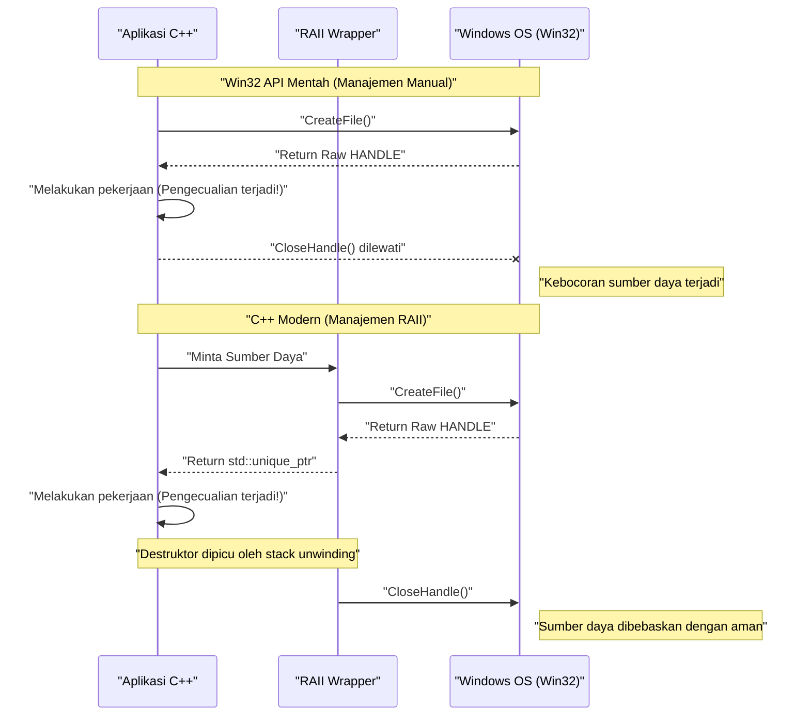
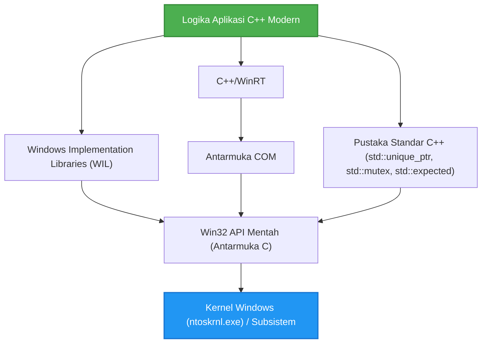

## 1. Pendahuluan: Kesenjangan antara Win32 API berbasis Bahasa C dan C++ Modern

Windows OS memiliki fondasi berupa **Windows API (dikenal sebagai Win32 API)**, yaitu antarmuka bahasa C masif yang telah diwariskan sejak era Windows NT dan Windows 95 pada tahun 1990-an. Bahkan saat ini, ketika mengembangkan aplikasi natif untuk Windows, pada akhirnya kita harus memanggil Win32 API ini untuk mengakses fungsionalitas inti OS (manajemen proses, I/O file, sinkronisasi thread, kontrol jendela, dll.).

Namun, Win32 API dirancang murni untuk bahasa C, dan tidak mengasumsikan fitur bahasa tingkat lanjut yang dimiliki oleh **C++ Modern** (penanganan pengecualian, manajemen sumber daya otomatis oleh RAII, *move semantics*, tipe enumerasi yang aman, *smart pointer*, dll.). Akibatnya, jika Win32 API mentah dicampur ke dalam kode C++ apa adanya, masalah berikut akan terjadi:

*   **Manajemen sumber daya manual:** `HANDLE` yang diperoleh dari `CreateFile` atau `CreateEvent` harus selalu dibebaskan menggunakan `CloseHandle`.
*   **Kurangnya keamanan pengecualian:** Jika pengecualian C++ dilontarkan, kebocoran sumber daya akan mudah terjadi kecuali penanganan untuk memanggil `CloseHandle` dengan tepat telah ditulis.
*   **Representasi kesalahan yang tidak konsisten:** Beberapa API mengembalikan `BOOL` dan mengharuskan panggilan ke `GetLastError()` saat gagal. API lain mengembalikan `HRESULT`, dan API lainnya (seperti GDI) mengembalikan `NULL`.
*   **Kurangnya keamanan tipe (*Type Safety*):** `HANDLE`, `HWND`, `HDC`, dll. seringkali hanyalah `void*` ketika makronya diekspansi, sehingga menyulitkan kompilator untuk menerapkan pemeriksaan tipe yang ketat.

Dalam artikel ini, kami akan menjelaskan dengan sangat rinci tentang cara menghindari jebakan "antarmuka C warisan" ini dan **menangani Win32 API secara Aman (*Safe*) dan Modern** menggunakan fitur-fitur C++ modern (C++11/14/17/20/23).

---

## 2. Bahaya Win32 API Mentah: Jebakan Kebocoran Sumber Daya dan Penanganan Kesalahan

Pertama, mari kita lihat kode umum untuk memanggil Win32 API dengan gaya C kuno. Sepintas tampaknya baik-baik saja, tetapi dari perspektif C++ modern, kode ini memiliki kerentanan yang fatal.

```cpp
#include <windows.h>
#include <iostream>
#include <vector>

void ProcessFileLegacy(const std::wstring& filename) {
    // 1. Mendapatkan file handle
    HANDLE hFile = ::CreateFileW(
        filename.c_str(),
        GENERIC_READ,
        FILE_SHARE_READ,
        NULL,
        OPEN_EXISTING,
        FILE_ATTRIBUTE_NORMAL,
        NULL
    );

    if (hFile == INVALID_HANDLE_VALUE) {
        std::cerr << "Failed to open file. Error: " << ::GetLastError() << std::endl;
        return;
    }

    // 2. Mendapatkan ukuran file
    LARGE_INTEGER fileSize;
    if (!::GetFileSizeEx(hFile, &fileSize)) {
        ::CloseHandle(hFile); // Pembebasan manual saat terjadi kesalahan
        return;
    }

    // 3. Mengalokasikan memori dan membaca
    std::vector<char> buffer(fileSize.QuadPart);
    DWORD bytesRead = 0;
    
    if (!::ReadFile(hFile, buffer.data(), buffer.size(), &bytesRead, NULL)) {
        ::CloseHandle(hFile); // Pembebasan manual saat terjadi kesalahan
        return;
    }

    // --- Misalkan ada proses yang menghasilkan pengecualian di sini ---
    // Contoh: Fungsi yang mem-parsing isi buffer melontarkan std::runtime_error
    // ParseBuffer(buffer); // Jika pengecualian dilontarkan, CloseHandle di bawah tidak dipanggil dan terjadi kebocoran!

    // 4. Pembebasan sumber daya manual
    ::CloseHandle(hFile);
}
```

### Apa masalah dari kode ini?

1.  **Duplikasi dan kerumitan kode:** `::CloseHandle(hFile);` harus ditulis setiap kali terjadi *early return* (`return`), yang melanggar prinsip DRY (*Don't Repeat Yourself*).
2.  **Ketiadaan total keamanan pengecualian (*Exception Unsafe*):** Di C++, fungsi akan keluar secara paksa saat alokasi memori `std::vector` gagal (`std::bad_alloc`) atau saat fungsi lain melontarkan pengecualian. Pada saat ini, `CloseHandle` di bagian akhir tidak dieksekusi, sehingga **file handle akan bocor selamanya** (menyebabkan bug serius seperti file terus terkunci sampai proses berakhir).

---

## 3. Model Matematika dari Keamanan Pengecualian dan Manajemen Sumber Daya

Sekarang mari kita modelkan secara matematis (probabilistik) betapa rentannya manajemen sumber daya manual.

Misalkan ada $N$ titik alokasi sumber daya (atau titik *early return*, titik terjadinya pengecualian) di dalam fungsi. Biarkan $P(\text{Exit}_i)$ menjadi probabilitas keluar dari fungsi karena kesalahan atau pengecualian pada setiap langkah $i$. Kita pertimbangkan probabilitas kebocoran sumber daya akibat gagal menuliskan kode pembersihan (seperti `CloseHandle`) secara manual dan benar untuk semua jalur keluar.

Jika probabilitas kelalaian manusia atau jalan keluar tak terduga akibat pengecualian yang tidak diketahui (probabilitas kebocoran per jalur) ditetapkan sebagai $p$, probabilitas $P(\text{Leak})$ bahwa setidaknya satu kebocoran sumber daya akan terjadi di seluruh program dinyatakan oleh rumus berikut:

$$ P(\text{Leak}) = 1 - (1 - p)^N $$

Misalnya, jika $p = 0.05$ (probabilitas 5% melakukan kesalahan dalam penanganan pengecualian atau pembersihan) dan $N = 20$ (fungsi kompleks dengan 20 titik return kesalahan atau pengecualian):

$$ P(\text{Leak}) = 1 - (1 - 0.05)^{20} \approx 1 - 0.358 = 0.642 $$

Secara mengejutkan, **ada probabilitas sekitar 64,2% bahwa bug kebocoran sumber daya akan bersembunyi di suatu tempat**. Saat skala perangkat lunak tumbuh dan $N \to \infty$, $P(\text{Leak}) \to 1$, dan sistem pada akhirnya akan hancur.

Satu-satunya cara rasional untuk melawan realitas matematis ini adalah RAII (*Resource Acquisition Is Initialization*) dari C++.

---

## 4. Dasar-dasar RAII (*Resource Acquisition Is Initialization*)

RAII adalah konsep yang dikemukakan oleh Bjarne Stroustrup, pencipta C++. Prinsipnya sangat sederhana dan kuat:

1.  Perolehan sumber daya (*Acquisition*) dilakukan di **konstruktor (*Initialization*)** objek.
2.  Pembebasan sumber daya dilakukan di **destruktor** objek.

Berdasarkan spesifikasi bahasa C++, saat keluar dari *scope* (baik itu `return` normal maupun selama *stack unwinding* karena pengecualian), destruktor objek yang dialokasikan di *stack* akan **pasti dan secara otomatis** dipanggil.

Ini memungkinkan kita secara matematis mereduksi probabilitas kesalahan manusia $p$ dalam rumus sebelumnya menjadi **$0$**.

### Visualisasi Siklus Hidup Objek

Diagram urutan (*sequence diagram*) berikut menunjukkan perbedaan siklus hidup antara manajemen manual menggunakan API mentah dan manajemen otomatis menggunakan RAII.



---

## 5. Teknik Pembungkusan `HANDLE` yang Aman Menggunakan `std::unique_ptr`

Sejak C++11, pustaka standar telah menyediakan `std::unique_ptr` sebagai *wrapper* RAII serbaguna. Ini tidak hanya untuk mengelola memori (`new/delete`), tetapi dapat diterapkan pada pengelolaan sumber daya apa pun dengan menentukan **penghapus kustom (*Custom Deleter*)**.

*Deleter* dasar untuk mengelola `HANDLE` dari Win32 dengan `std::unique_ptr` dapat ditulis sebagai berikut:

```cpp
#include <windows.h>
#include <memory>

// Deleter kustom untuk HANDLE
struct handle_deleter {
    // Menentukan tipe pointer yang ditangani secara internal oleh std::unique_ptr
    using pointer = HANDLE; 

    void operator()(HANDLE handle) const noexcept {
        if (handle != nullptr && handle != INVALID_HANDLE_VALUE) {
            ::CloseHandle(handle);
        }
    }
};

// Alias tipe untuk handle yang aman
using unique_handle = std::unique_ptr<void, handle_deleter>;
```

Dengan `unique_handle` ini, kode berbahaya sebelumnya dapat diubah menjadi seperti ini:

```cpp
void ProcessFileModern(const std::wstring& filename) {
    // Segera setelah diperoleh, berikan kepemilikan kepada objek RAII
    unique_handle hFile(::CreateFileW(
        filename.c_str(), GENERIC_READ, FILE_SHARE_READ, NULL,
        OPEN_EXISTING, FILE_ATTRIBUTE_NORMAL, NULL
    ));

    // Pengecekan kesalahan (penanganan untuk INVALID_HANDLE_VALUE dijelaskan kemudian)
    if (hFile.get() == INVALID_HANDLE_VALUE) {
        throw std::runtime_error("Failed to open file");
    }

    LARGE_INTEGER fileSize;
    if (!::GetFileSizeEx(hFile.get(), &fileSize)) {
        throw std::runtime_error("Failed to get file size");
    }

    std::vector<char> buffer(fileSize.QuadPart);
    DWORD bytesRead = 0;
    
    if (!::ReadFile(hFile.get(), buffer.data(), buffer.size(), &bytesRead, NULL)) {
        throw std::runtime_error("Failed to read file");
    }

    // Bahkan jika pengecualian terjadi di sini atau melakukan early return,
    // destruktor unique_handle akan memanggil CloseHandle saat keluar dari fungsi!
}
```

---

## 6. Pembahasan Mendalam: Menyelesaikan Masalah `INVALID_HANDLE_VALUE` dan `nullptr`

Salah satu spesifikasi yang paling membingungkan programmer C++ saat menangani Win32 API adalah **tidak konsistennya representasi handle yang tidak valid**.

*   `CreateEvent`, `CreateThread`, dll.: Mengembalikan `NULL` (`nullptr`) jika gagal.
*   `CreateFile`, dll.: Mengembalikan `INVALID_HANDLE_VALUE` (sebagai nilai `(HANDLE)-1`) jika gagal.

`std::unique_ptr` standar memperlakukan kasus di mana pointer internalnya `nullptr` sebagai status khusus yaitu "kondisi kosong (tidak memiliki sumber daya)". Artinya, evaluasi boolean seperti `if (ptr)` hanya mengembalikan `false` untuk `nullptr`.

Namun, jika `CreateFile` gagal dan mengembalikan `INVALID_HANDLE_VALUE`, `std::unique_ptr` salah mengartikannya sebagai "pointer non-NULL yang valid".

Untuk menyelesaikan masalah ini secara elegan, kita dapat menggunakan spesifikasi lanjutan dari `std::unique_ptr` di C++ dan mendefinisikan **tipe pointer kustom**.

```cpp
#include <windows.h>
#include <memory>

struct win32_handle_traits {
    // Mendefinisikan tipe pointer kustom
    class pointer {
        HANDLE m_handle;
    public:
        // Anda dapat mendesain INVALID_HANDLE_VALUE sebagai nilai awal untuk konstruksi default atau penugasan nullptr,
        // tetapi untuk meningkatkan fleksibilitas, kami memperlakukan baik nullptr maupun INVALID_HANDLE_VALUE sebagai status tidak valid.
        pointer() noexcept : m_handle(nullptr) {}
        pointer(std::nullptr_t) noexcept : m_handle(nullptr) {}
        pointer(HANDLE h) noexcept : m_handle(h) {}
        
        // Melakukan overload operator bool untuk menolak kedua nilai tak valid dari Win32
        explicit operator bool() const noexcept {
            return m_handle != nullptr && m_handle != INVALID_HANDLE_VALUE;
        }
        
        operator HANDLE() const noexcept { return m_handle; }
        
        friend bool operator==(pointer a, pointer b) noexcept { return a.m_handle == b.m_handle; }
        friend bool operator!=(pointer a, pointer b) noexcept { return a.m_handle != b.m_handle; }
    };
    
    void operator()(pointer p) const noexcept {
        if (p) { // operator bool dipanggil
            ::CloseHandle(p);
        }
    }
};

using safe_win32_handle = std::unique_ptr<void, win32_handle_traits>;
```

Dengan implementasi ini, Anda bisa menulis kode yang intuitif dan aman seperti berikut:

```cpp
safe_win32_handle hFile(::CreateFileW(...));
if (!hFile) {
    // Kedua nullptr dan INVALID_HANDLE_VALUE dapat ditangkap di sini!
    throw std::system_error(::GetLastError(), std::system_category(), "CreateFile failed");
}
```

---

## 7. Manajemen RAII Lanjutan untuk Objek GDI (`HDC`, `HBITMAP`)

Kelemahan lain dari Win32 adalah manajemen sumber daya GDI (*Graphics Device Interface*).
Objek GDI (pena, kuas, font, bitmap, dll.) memerlukan prosedur yang sangat merepotkan: setelah dibuat, objek tersebut dipilih ke dalam *device context* (`HDC`) menggunakan `SelectObject` untuk digunakan, dan setelah selesai, **objek aslinya harus dipulihkan dengan SelectObject lagi sebelum dihancurkan menggunakan DeleteObject**.

Wrapper untuk menyelesaikannya dengan RAII adalah sebagai berikut:

```cpp
// Deleter untuk penghapusan objek GDI
struct gdi_deleter {
    using pointer = HGDIOBJ;
    void operator()(HGDIOBJ obj) const noexcept {
        if (obj != nullptr) {
            ::DeleteObject(obj);
        }
    }
};

using unique_gdi_obj = std::unique_ptr<void, gdi_deleter>;

// Wrapper RAII untuk SelectObject (memulihkan objek asli saat keluar scope)
class gdi_selector {
    HDC m_hdc;
    HGDIOBJ m_oldObj;

public:
    gdi_selector(HDC hdc, HGDIOBJ newObj) : m_hdc(hdc) {
        // Pilih objek baru, simpan objek lama
        m_oldObj = ::SelectObject(m_hdc, newObj);
    }

    ~gdi_selector() {
        if (m_oldObj != nullptr && m_oldObj != HGDI_ERROR) {
            // Pulihkan otomatis saat keluar scope
            ::SelectObject(m_hdc, m_oldObj);
        }
    }

    // Melarang penyalinan
    gdi_selector(const gdi_selector&) = delete;
    gdi_selector& operator=(const gdi_selector&) = delete;
};
```

### Contoh Penggunaan

```cpp
void DrawMyGraphics(HDC hdc) {
    // Membuat pena (Dikelola oleh RAII)
    unique_gdi_obj hPen(::CreatePen(PS_SOLID, 1, RGB(255, 0, 0)));
    
    {
        // Memilih pena ke HDC (Manajemen scope)
        gdi_selector penSelect(hdc, hPen.get());
        
        // Proses menggambar...
        ::MoveToEx(hdc, 0, 0, NULL);
        ::LineTo(hdc, 100, 100);
        
        // Saat keluar scope, destruktor dari penSelect akan memulihkan pena lama dengan SelectObject
    }
    
    // Saat keluar fungsi, destruktor dari hPen akan memanggil DeleteObject
}
```
Dengan cara ini, manajemen sumber daya yang siklus hidupnya bersarang (nested) sangat cocok menggunakan RAII.

---

## 8. Modernisasi Objek Sinkronisasi Thread

Win32 memiliki primitif sinkronisasi thread seperti `CRITICAL_SECTION` dan `SRWLOCK`. Memanggil `EnterCriticalSection` / `LeaveCriticalSection` secara manual sangat dilarang dari sudut pandang keamanan pengecualian.

`std::mutex` dan `std::lock_guard` dari C++11 sangat nyaman, tetapi ada saatnya kita ingin menggunakan mekanisme penguncian asli OS secara langsung (khususnya SRWLock karena sangat ringan).
`std::lock_guard` standar dirancang untuk menerima tipe apa pun yang memiliki fungsi anggota `lock()` dan `unlock()` (spesifikasi templat yang mirip dengan *duck typing*). Kita akan memanfaatkan ini.

```cpp
class win32_srwlock {
    SRWLOCK m_lock;
public:
    win32_srwlock() noexcept {
        ::InitializeSRWLock(&m_lock);
    }
    
    // Antarmuka yang dibutuhkan oleh std::lock_guard
    void lock() noexcept {
        ::AcquireSRWLockExclusive(&m_lock);
    }
    void unlock() noexcept {
        ::ReleaseSRWLockExclusive(&m_lock);
    }
    
    // Melarang copy dan move
    win32_srwlock(const win32_srwlock&) = delete;
    win32_srwlock& operator=(const win32_srwlock&) = delete;
};
```

Ini memungkinkan Anda menangani *lock* Win32 sepenuhnya dengan gaya pustaka standar C++.

```cpp
win32_srwlock g_myLock;
int g_sharedData = 0;

void UpdateData() {
    // Perolehan lock yang aman terhadap pengecualian
    std::lock_guard<win32_srwlock> lock(g_myLock);
    
    g_sharedData++;
    if (g_sharedData > 100) {
        throw std::runtime_error("Overflow"); // Bahkan jika pengecualian terjadi, lock akan dilepas dengan aman!
    }
}
```

---

## 9. Integrasi dengan Pustaka Standar C++: `std::system_error` dan `HRESULT`

Kesalahan Win32 didominasi oleh dua jenis: `GetLastError()` (tipe DWORD) dan `HRESULT` yang digunakan dalam COM dan DirectX. Anda dapat memodernisasi penanganan kesalahan dengan mengonversinya menjadi pengecualian C++, yaitu `std::system_error`.

Saat melempar `GetLastError()`, pada implementasi MSVC (Visual C++), `std::system_category()` menyediakan pemetaan antara kode kesalahan Win32 dan pesan kesalahan.

```cpp
inline void throw_if_win32_error(BOOL result, const char* msg = "Win32 API failed") {
    if (!result) {
        DWORD err = ::GetLastError();
        // std::system_category secara internal memanggil API FormatMessage untuk menghasilkan string kesalahan
        throw std::system_error(err, std::system_category(), msg);
    }
}
```

Di sisi lain, untuk `HRESULT`, Anda membuat kategori kesalahan khusus atau menggunakan `_com_error` standar dari Windows.

---

## 10. Penanganan Kesalahan Modern Menggunakan `std::expected` (C++23)

Mulai dari C++23, `std::expected`, yang setara dengan tipe `Result` dari Rust, telah diperkenalkan. Dalam proyek yang tidak menyukai pengecualian (karena alasan kinerja atau desain di mana kesalahan sering terjadi), ini adalah cara terbaik untuk memodernisasi nilai kembalian dari Win32.

```cpp
#include <expected>
#include <string>

// Mengembalikan unique_handle jika sukses, DWORD (kode kesalahan) jika gagal
std::expected<safe_win32_handle, DWORD> OpenFileModern(const std::wstring& path) {
    safe_win32_handle h(::CreateFileW(
        path.c_str(), GENERIC_READ, 0, nullptr, OPEN_EXISTING, 0, nullptr));
        
    if (!h) {
        return std::unexpected(::GetLastError());
    }
    return std::move(h); // Memindahkan (move) handle sebagai nilai kembalian jika sukses
}

void Usage() {
    auto result = OpenFileModern(L"C:\\test.txt");
    if (result) {
        // Proses jika sukses
        safe_win32_handle& hFile = *result;
        // ...
    } else {
        // Proses jika gagal
        DWORD err = result.error();
        std::cerr << "Error code: " << err << std::endl;
    }
}
```

Dengan cara ini, menggunakan C++23 memungkinkan Anda memperoleh manfaat penanganan kesalahan melalui nilai kembalian (*return value*) dan RAII secara bersamaan.

---

## 11. Jawaban Microsoft (1): Memanfaatkan WIL (*Windows Implementation Libraries*)

Sejauh ini, kita telah memperkenalkan wrapper buatan sendiri, namun kenyataannya Microsoft sendiri menanggapi masalah ini dengan serius dan telah merilis pustaka modern C++ resmi berbentuk *header-only* bernama **WIL (Windows Implementation Libraries)** sebagai *open-source* (Tersedia di GitHub).

Dengan menggunakan WIL, semua wrapper yang susah payah kita buat sendiri di atas akan disediakan secara standar.

```cpp
#include <wil/resource.h>
#include <wil/result.h>

void ProcessWithWIL() {
    // wil::unique_handle sudah mendukung baik INVALID_HANDLE_VALUE maupun NULL
    wil::unique_handle hFile;
    
    // Makro THROW_IF_WIN32_BOOL_FALSE mengotomatiskan pengecekan kesalahan dan pelemparan pengecualian
    THROW_IF_WIN32_BOOL_FALSE(
        ::CreateFileW(L"test.txt", GENERIC_READ, 0, nullptr, OPEN_EXISTING, 0, nullptr),
        hFile.put() // Helper khusus WIL untuk menerima pointer output
    );
    
    // Wrapper untuk manajemen memori seperti wil::unique_cotaskmem_string juga tersedia dan lengkap
}
```

Inti kekuatan WIL terletak pada templat yang sangat kuat yaitu `wil::unique_any`. Ini memungkinkan Anda untuk menghasilkan wrapper RAII untuk setiap sumber daya Win32, tidak hanya file handle, tetapi juga *registry key*, objek GDI, dan memori lokal, hanya dengan beberapa baris definisi.

---

## 12. Jawaban Microsoft (2): Abstraksi COM melalui C++/WinRT

Banyak dari Win32 API (terutama ekstensi Shell dan DirectX) disediakan melalui antarmuka COM (*Component Object Model*) berbasis C.
Evolusi dari `CComPtr` (ATL) dan `ComPtr` (WRL) tradisional yang saat ini direkomendasikan secara resmi oleh Microsoft adalah **C++/WinRT**.

C++/WinRT memungkinkan Anda menangani tidak hanya Windows Runtime (WinRT) tetapi juga objek COM tradisional dengan sangat cerdas.

```cpp
#include <winrt/base.h>

void ComExample() {
    // Inisialisasi COM (dijadikan RAII)
    winrt::init_apartment();

    // Mengelola antarmuka COM yang mewarisi IUnknown secara aman dengan winrt::com_ptr
    winrt::com_ptr<IDXGIFactory> factory;
    winrt::check_hresult(
        ::CreateDXGIFactory(__uuidof(IDXGIFactory), factory.put_void())
    );
    
    // Tidak perlu memanggil AddRef atau Release secara manual sama sekali
}
```

---

## 13. Visualisasi Arsitektur dan Siklus Hidup

Mari kita mengatur struktur lapisan (layer) dalam pengembangan aplikasi Windows C++ modern.



Logika aplikasi tidak boleh secara langsung menyentuh Win32 API mentah (Lapisan E). Dengan mengadopsi arsitektur yang selalu mengaksesnya melalui pustaka standar, WIL, atau lapisan abstraksi C++/WinRT, keamanan memori akan meningkat drastis.

---

## 14. Analisis Performa Abstraksi Tanpa Biaya (Zero-cost Abstraction)

Beberapa orang mungkin bertanya-tanya, "Apakah menggunakan wrapper RAII atau smart pointer tidak membuat aplikasi berjalan lebih lambat daripada menggunakan API bahasa C mentah?"
Mari kita lihat model rumus matematis untuk biaya kinerja (performance cost).

Total waktu eksekusi $T_{\text{total}}$ dapat diuraikan sebagai berikut:

$$ T_{\text{total}} = T_{\text{syscall}} + T_{\text{wrapper}} + T_{\text{cleanup}} $$

*   $T_{\text{syscall}}$: Waktu yang dihabiskan untuk transisi ke *kernel-mode* dan pemrosesan aktual di dalam Win32 API. Biasanya dalam satuan milidetik hingga mikrodetik.
*   $T_{\text{wrapper}}$: Waktu yang dihabiskan untuk mengonstruksi kelas wrapper seperti `std::unique_ptr` atau WIL.
*   $T_{\text{cleanup}}$: Waktu yang dihabiskan untuk memanggil destruktor.

Kompilator C++ (MSVC, Clang, GCC) sangat unggul dalam optimisasi sebaris (*Inlining*). Konstruktor dan destruktor dari `std::unique_ptr`, serta fungsi yang di-overload seperti `operator*` dan `operator bool`, semuanya diekspansi secara `inline`, dan dikompilasi ke dalam kode mesin yang persis sama dengan manipulasi langsung pada pointer mentah di memori.

Dengan kata lain, **$T_{\text{wrapper}} \approx 0$**. Ini adalah bukti dari filosofi terbesar C++, yaitu **Abstraksi Tanpa Biaya (*Zero-cost Abstraction*)**. Meskipun Anda mendapatkan keamanan, tambahan beban waktu eksekusi (*overhead*) secara harfiah adalah nol.

---

## 15. Kesimpulan: Masa Depan Pemrograman Windows yang Aman

Win32 API adalah warisan masa lalu yang dirancang dengan paradigma bahasa C karena alasan historis. Namun, C++ sebagai pemanggil API terus berkembang, dan hari ini sangat memungkinkan untuk menulis kode yang sangat aman dan ekspresif.

Mari kita tinjau kembali poin-poin penting yang dibahas dalam artikel ini:

1.  **Jangan pernah menulis `CloseHandle` atau `DeleteObject` secara manual.** Enkapsulasi semuanya ke dalam kontainer RAII seperti `std::unique_ptr`.
2.  **Pahami jebakan `INVALID_HANDLE_VALUE`.** Implementasikan *custom deleter* dan *custom pointer traits* khusus, atau gunakan `wil::unique_handle` dari WIL.
3.  **Modernisasi penanganan kesalahan.** Lontarkan `GetLastError()` dan `HRESULT` sebagai pengecualian `std::system_error`, atau tangani mereka dengan aman terhadap tipe menggunakan `std::expected` dari C++23.
4.  **Berdiri di bahu raksasa.** Adopsi secara aktif pustaka WIL resmi dari Microsoft atau C++/WinRT, dan hindari penemuan ulang roda (*reinventing the wheel*).

Dalam pengembangan C++ modern, membawa pointer atau *handle* mentah ke mana-mana ibarat mengemudi di jalan tol tanpa mengenakan sabuk pengaman. Manfaatkan sistem tipe yang kuat dan RAII yang ditawarkan oleh C++ secara penuh, dan nikmati pengembangan aplikasi Windows yang aman dan kuat.
