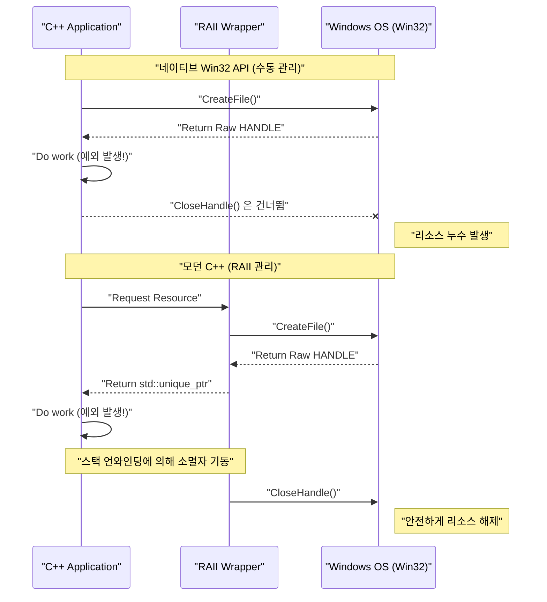
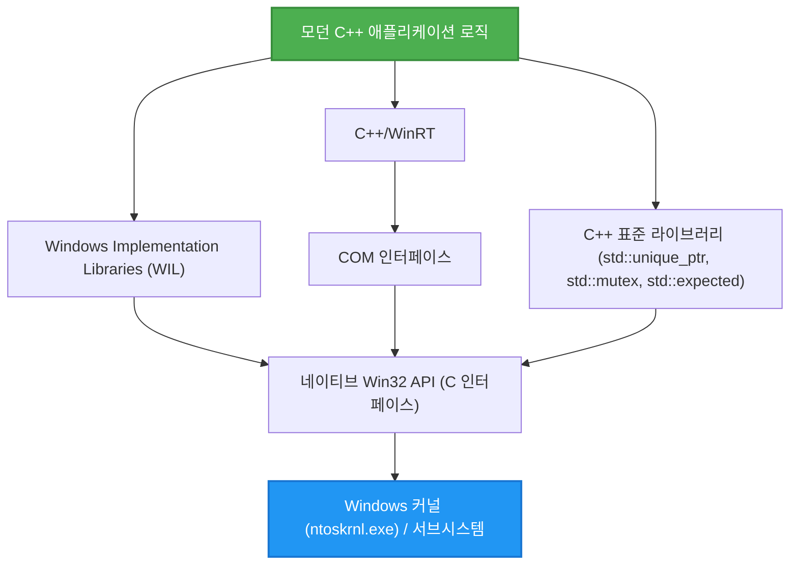

## 1. 시작하며: C언어 기반의 Win32 API와 현대 C++의 괴리

Windows OS의 기반이 되는 **Windows API (통칭 Win32 API)**는 1990년대 Windows NT나 Windows 95 시절부터 면면히 이어져 온 거대한 C언어 인터페이스입니다. 현재도 Windows용 네이티브 애플리케이션을 개발할 때 OS의 핵심 기능(프로세스 관리, 파일 I/O, 스레드 동기화, 창 제어 등)에 접근하려면 최종적으로 이 Win32 API를 호출해야 합니다.

하지만 Win32 API는 순수 C언어용으로 설계되어 있어, **현대 C++ (Modern C++)**이 가진 고도의 언어 기능(예외 처리, RAII를 통한 자동 리소스 관리, 이동 의미론(Move Semantics), 타입 안전한 열거형, 스마트 포인터 등)을 전제로 하지 않습니다. 그 결과, 네이티브 Win32 API를 그대로 C++ 코드에 섞어 쓰면 다음과 같은 문제가 발생합니다.

*   **수동 리소스 관리:** `CreateFile`이나 `CreateEvent`로 얻은 `HANDLE`은 반드시 `CloseHandle`로 해제해야 한다.
*   **예외 안전성의 부재:** C++ 예외가 발생(Throw)했을 때, 적절하게 `CloseHandle`을 호출하는 처리를 작성해두지 않으면 쉽게 리소스 누수(Leak)가 발생한다.
*   **일관성 없는 에러 표현:** 어떤 API는 `BOOL`을 반환하고 실패 시 `GetLastError()`를 호출해야 한다. 다른 API는 `HRESULT`를 반환하고, 또 다른 API(GDI 등)는 `NULL`을 반환한다.
*   **타입 안전성 결여:** `HANDLE`이나 `HWND`, `HDC` 등은 매크로를 확장하면 단순한 `void*`에 불과한 경우가 많아, 컴파일러에 의한 엄격한 타입 검사가 제대로 작동하지 않는다.

본 문서에서는 이러한 '레거시 C 인터페이스'의 함정을 피하고, 현대 C++ (C++11/14/17/20/23)의 기능을 사용하여 **안전(Safe)하고 모던(Modern)하게 Win32 API를 다루는 방법**에 대해 매우 상세히 해설합니다.

---

## 2. 네이티브 Win32 API의 위험성: 리소스 누수와 에러 처리의 함정

우선 기존의 C 스타일로 Win32 API를 호출하는 일반적인 코드를 살펴보겠습니다. 언뜻 보기에는 문제없어 보이지만, 현대 C++의 관점에서는 치명적인 취약성을 안고 있습니다.

```cpp
#include <windows.h>
#include <iostream>
#include <vector>

void ProcessFileLegacy(const std::wstring& filename) {
    // 1. 파일 핸들 얻기
    HANDLE hFile = ::CreateFileW(
        filename.c_str(),
        GENERIC_READ,
        FILE_SHARE_READ,
        NULL,
        OPEN_EXISTING,
        FILE_ATTRIBUTE_NORMAL,
        NULL
    );

    if (hFile == INVALID_HANDLE_VALUE) {
        std::cerr << "Failed to open file. Error: " << ::GetLastError() << std::endl;
        return;
    }

    // 2. 파일 크기 얻기
    LARGE_INTEGER fileSize;
    if (!::GetFileSizeEx(hFile, &fileSize)) {
        ::CloseHandle(hFile); // 에러 시 수동 해제
        return;
    }

    // 3. 메모리 확보 및 읽기
    std::vector<char> buffer(fileSize.QuadPart);
    DWORD bytesRead = 0;
    
    if (!::ReadFile(hFile, buffer.data(), buffer.size(), &bytesRead, NULL)) {
        ::CloseHandle(hFile); // 에러 시 수동 해제
        return;
    }

    // --- 여기서 예외가 발생하는 처리가 있다고 가정 ---
    // 예: buffer 내용을 분석하는 함수가 std::runtime_error를 발생(Throw)
    // ParseBuffer(buffer); // 만약 예외가 날아가면, 아래의 CloseHandle은 호출되지 않고 누수된다!

    // 4. 리소스 수동 해제
    ::CloseHandle(hFile);
}
```

### 이 코드의 무엇이 문제일까?

1.  **코드의 중복과 번잡함:** 조기 리턴(`return`)을 할 때마다 `::CloseHandle(hFile);`을 작성해야 하므로, DRY(Don't Repeat Yourself) 원칙에 위배됩니다.
2.  **예외 안전성의 완전한 결여 (Exception Unsafe):** C++에서는 `std::vector`의 메모리 할당 실패 시(`std::bad_alloc`)나 다른 함수가 예외를 발생시켰을 때 함수에서 강제로 빠져나갑니다. 이때 마지막의 `CloseHandle`은 실행되지 않으므로, **파일 핸들이 영원히 누수**됩니다(프로세스가 종료될 때까지 파일이 계속 잠겨 있는 등 심각한 버그를 유발합니다).

---

## 3. 예외 안전과 리소스 관리의 수학적 모델

여기서 수동 리소스 관리가 얼마나 취약한지 수학적(확률론적)으로 모델링해 보겠습니다.

함수 내에 $N$개의 리소스 확보(또는 조기 리턴 포인트, 예외 발생 포인트)가 있다고 가정합니다. 각 단계 $i$에서 에러나 예외가 발생하여 함수에서 빠져나갈 확률을 $P(\text{Exit}_i)$라고 합니다. 수동으로 올바르게 정리 코드(`CloseHandle` 등)를 모든 탈출 경로에 작성하지 못해 리소스가 누수될 확률을 생각해보겠습니다.

인간의 부주의에 의한 작성 누락이나 미지의 예외로 인한 예기치 못한 탈출이 발생할 확률(하나의 경로당 누수 확률)을 $p$라고 두면, 프로그램 전체에서 적어도 하나의 리소스 누수가 발생할 확률 $P(\text{Leak})$는 다음 식으로 나타납니다.

$$ P(\text{Leak}) = 1 - (1 - p)^N $$

예를 들어, $p = 0.05$(5%의 확률로 예외 처리나 정리를 실수한다)이고, $N = 20$(복잡한 함수에서 20곳의 에러 리턴이나 예외 포인트가 있다)인 경우:

$$ P(\text{Leak}) = 1 - (1 - 0.05)^{20} \approx 1 - 0.358 = 0.642 $$

놀랍게도, **약 64.2%의 확률로 어딘가에 리소스 누수 버그가 숨어있게** 됩니다. 소프트웨어의 규모가 커져서 $N \to \infty$가 되면, $P(\text{Leak}) \to 1$이 되어 시스템은 필연적으로 파탄납니다.

이러한 수학적 현실에 대항하기 위한 유일한 합리적인 수단이 C++의 **RAII (Resource Acquisition Is Initialization)**입니다.

---

## 4. RAII (Resource Acquisition Is Initialization)의 기초

RAII는 C++의 창시자인 비야네 스트롭스트룹(Bjarne Stroustrup)이 제창한 개념입니다. 그 원칙은 매우 단순하고 강력합니다.

1.  리소스 확보(Acquisition)를 객체의 **생성자(Initialization)**에서 수행한다.
2.  리소스 해제를 객체의 **소멸자**에서 수행한다.

C++의 언어 사양에 따라, 스코프를 벗어날 때(정상적인 `return`이든 예외에 의한 스택 언와인딩 중이든) 스택에 확보된 객체의 소멸자는 **확실하고 자동적으로** 호출됩니다.

이를 통해 앞서 언급한 수식에서 인간의 실수 확률 $p$를 수학적으로 **$0$**으로 만들 수 있습니다.

### 객체 라이프사이클의 시각화

다음 시퀀스 다이어그램은 네이티브 API를 사용한 수동 관리와 RAII를 사용한 자동 관리의 라이프사이클 차이를 보여줍니다.



---

## 5. `std::unique_ptr`을 이용한 `HANDLE`의 안전한 래핑 방법

C++11 이후 표준 라이브러리에는 범용적인 RAII 래퍼인 `std::unique_ptr`이 준비되어 있습니다. 이는 단순한 메모리(`new/delete`) 관리뿐만 아니라 **커스텀 삭제자(Custom Deleter)**를 지정하여 모든 리소스 관리에 응용할 수 있습니다.

Win32의 `HANDLE`을 `std::unique_ptr`로 관리하기 위한 기본적인 삭제자는 다음과 같이 작성할 수 있습니다.

```cpp
#include <windows.h>
#include <memory>

// HANDLE용 커스텀 삭제자
struct handle_deleter {
    // std::unique_ptr이 내부적으로 다룰 포인터 타입 지정
    using pointer = HANDLE; 

    void operator()(HANDLE handle) const noexcept {
        if (handle != nullptr && handle != INVALID_HANDLE_VALUE) {
            ::CloseHandle(handle);
        }
    }
};

// 안전한 핸들의 타입 별칭
using unique_handle = std::unique_ptr<void, handle_deleter>;
```

이 `unique_handle`을 사용하면, 앞서 본 위험한 코드는 다음과 같이 거듭납니다.

```cpp
void ProcessFileModern(const std::wstring& filename) {
    // 확보한 직후 RAII 객체에 소유권을 넘긴다
    unique_handle hFile(::CreateFileW(
        filename.c_str(), GENERIC_READ, FILE_SHARE_READ, NULL,
        OPEN_EXISTING, FILE_ATTRIBUTE_NORMAL, NULL
    ));

    // 에러 체크 (INVALID_HANDLE_VALUE에 대한 대응은 후술)
    if (hFile.get() == INVALID_HANDLE_VALUE) {
        throw std::runtime_error("Failed to open file");
    }

    LARGE_INTEGER fileSize;
    if (!::GetFileSizeEx(hFile.get(), &fileSize)) {
        throw std::runtime_error("Failed to get file size");
    }

    std::vector<char> buffer(fileSize.QuadPart);
    DWORD bytesRead = 0;
    
    if (!::ReadFile(hFile.get(), buffer.data(), buffer.size(), &bytesRead, NULL)) {
        throw std::runtime_error("Failed to read file");
    }

    // 여기서 예외가 발생해도, 조기 리턴을 해도,
    // 함수를 빠져나가는 순간 unique_handle의 소멸자가 CloseHandle을 호출한다!
}
```

---

## 6. 심화: `INVALID_HANDLE_VALUE`와 `nullptr` 문제의 해결

Win32 API를 다룰 때 C++ 프로그래머를 가장 괴롭히는 사양 중 하나가 **유효하지 않은 핸들의 표현이 일관되지 않다는 것**입니다.

*   `CreateEvent`나 `CreateThread` 등: 실패하면 `NULL` (`nullptr`)을 반환한다.
*   `CreateFile` 등: 실패하면 `INVALID_HANDLE_VALUE` (값으로는 `(HANDLE)-1`)를 반환한다.

표준 `std::unique_ptr`은 내부 포인터가 `nullptr`인 경우를 '비어 있는 상태(리소스를 소유하지 않은 상태)'로 특별 취급합니다. 즉, `if (ptr)`과 같은 진위 여부 판정은 `nullptr`에 대해서만 `false`를 반환합니다.

하지만 `CreateFile`이 실패하여 `INVALID_HANDLE_VALUE`를 반환한 경우, `std::unique_ptr`은 이를 '유효한 비-NULL 포인터'로 오인하고 맙니다.

이 문제를 우아하게 해결하려면 C++의 `std::unique_ptr`의 고도화된 사양을 이용하여 **커스텀 포인터 타입**을 정의합니다.

```cpp
#include <windows.h>
#include <memory>

struct win32_handle_traits {
    // 커스텀 포인터 타입 정의
    class pointer {
        HANDLE m_handle;
    public:
        // 기본 생성이나 nullptr 대입 시 INVALID_HANDLE_VALUE를 초기값으로 하는 설계도 가능하지만,
        // 범용성을 높이기 위해 nullptr과 INVALID_HANDLE_VALUE를 모두 무효 상태로 취급한다.
        pointer() noexcept : m_handle(nullptr) {}
        pointer(std::nullptr_t) noexcept : m_handle(nullptr) {}
        pointer(HANDLE h) noexcept : m_handle(h) {}
        
        // operator bool을 오버로딩하여 Win32의 2종류의 무효 값을 모두 거른다
        explicit operator bool() const noexcept {
            return m_handle != nullptr && m_handle != INVALID_HANDLE_VALUE;
        }
        
        operator HANDLE() const noexcept { return m_handle; }
        
        friend bool operator==(pointer a, pointer b) noexcept { return a.m_handle == b.m_handle; }
        friend bool operator!=(pointer a, pointer b) noexcept { return a.m_handle != b.m_handle; }
    };
    
    void operator()(pointer p) const noexcept {
        if (p) { // operator bool이 호출된다
            ::CloseHandle(p);
        }
    }
};

using safe_win32_handle = std::unique_ptr<void, win32_handle_traits>;
```

이 구현을 통해 다음과 같이 직관적이고 안전한 코드를 작성할 수 있게 됩니다.

```cpp
safe_win32_handle hFile(::CreateFileW(...));
if (!hFile) {
    // nullptr과 INVALID_HANDLE_VALUE 양쪽 모두 여기서 캐치할 수 있다!
    throw std::system_error(::GetLastError(), std::system_category(), "CreateFile failed");
}
```

---

## 7. GDI 객체(`HDC`, `HBITMAP`)의 고도화된 RAII 관리

Win32의 또 다른 난관은 GDI (Graphics Device Interface)의 리소스 관리입니다.
GDI 객체(펜, 브러시, 폰트, 비트맵 등)는 생성 후 `SelectObject`로 장치 컨텍스트(`HDC`)에 선택하여 사용하고, 사용이 끝나면 **원래의 객체를 다시 SelectObject하여 복원한 뒤, DeleteObject로 파기해야 한다**는 매우 번거로운 방식이 요구됩니다.

이를 RAII로 해결하기 위한 래퍼는 다음과 같습니다.

```cpp
// GDI 객체 삭제용 삭제자
struct gdi_deleter {
    using pointer = HGDIOBJ;
    void operator()(HGDIOBJ obj) const noexcept {
        if (obj != nullptr) {
            ::DeleteObject(obj);
        }
    }
};

using unique_gdi_obj = std::unique_ptr<void, gdi_deleter>;

// SelectObject의 RAII 래퍼 (스코프를 빠져나갈 때 원래의 객체를 복원한다)
class gdi_selector {
    HDC m_hdc;
    HGDIOBJ m_oldObj;

public:
    gdi_selector(HDC hdc, HGDIOBJ newObj) : m_hdc(hdc) {
        // 새로운 객체를 선택하고, 이전 객체를 저장
        m_oldObj = ::SelectObject(m_hdc, newObj);
    }

    ~gdi_selector() {
        if (m_oldObj != nullptr && m_oldObj != HGDI_ERROR) {
            // 스코프를 빠져나갈 때 자동 복원
            ::SelectObject(m_hdc, m_oldObj);
        }
    }

    // 복사 금지
    gdi_selector(const gdi_selector&) = delete;
    gdi_selector& operator=(const gdi_selector&) = delete;
};
```

### 사용 예시

```cpp
void DrawMyGraphics(HDC hdc) {
    // 펜 생성 (RAII 관리)
    unique_gdi_obj hPen(::CreatePen(PS_SOLID, 1, RGB(255, 0, 0)));
    
    {
        // 펜을 HDC에 선택 (스코프 관리)
        gdi_selector penSelect(hdc, hPen.get());
        
        // 그리기 처리...
        ::MoveToEx(hdc, 0, 0, NULL);
        ::LineTo(hdc, 100, 100);
        
        // 스코프를 빠져나갈 때 penSelect의 소멸자가 이전 펜을 SelectObject로 복원한다
    }
    
    // 함수를 빠져나갈 때 hPen의 소멸자가 DeleteObject를 호출한다
}
```
이처럼 라이프사이클이 중첩되는 리소스 관리는 RAII의 독무대입니다.

---

## 8. 스레드 동기화 객체의 모더니제이션

Win32에는 `CRITICAL_SECTION`이나 `SRWLOCK` 등의 스레드 동기화 원시(Primitive) 요소들이 존재합니다. 이들 역시 `EnterCriticalSection` / `LeaveCriticalSection`을 수동으로 호출하는 것은 예외 안전성의 관점에서 금물입니다.

C++11의 `std::mutex`나 `std::lock_guard`는 매우 편리하지만, OS 네이티브의 고속 잠금 기구를 직접 사용하고 싶은 상황(특히 SRWLock은 매우 가볍습니다)도 있습니다.
표준 `std::lock_guard`는 `lock()`과 `unlock()`이라는 멤버 함수를 가진 임의의 타입을 받아들이는 사양(덕 타이핑 같은 템플릿 사양)으로 되어 있습니다. 이를 활용합니다.

```cpp
class win32_srwlock {
    SRWLOCK m_lock;
public:
    win32_srwlock() noexcept {
        ::InitializeSRWLock(&m_lock);
    }
    
    // std::lock_guard가 요구하는 인터페이스
    void lock() noexcept {
        ::AcquireSRWLockExclusive(&m_lock);
    }
    void unlock() noexcept {
        ::ReleaseSRWLockExclusive(&m_lock);
    }
    
    // 복사·이동 금지
    win32_srwlock(const win32_srwlock&) = delete;
    win32_srwlock& operator=(const win32_srwlock&) = delete;
};
```

이를 통해 완전히 C++ 표준 라이브러리의 방식대로 Win32의 잠금을 다룰 수 있습니다.

```cpp
win32_srwlock g_myLock;
int g_sharedData = 0;

void UpdateData() {
    // 예외 안전한 잠금 획득
    std::lock_guard<win32_srwlock> lock(g_myLock);
    
    g_sharedData++;
    if (g_sharedData > 100) {
        throw std::runtime_error("Overflow"); // 예외가 발생해도 안전하게 잠금 해제!
    }
}
```

---

## 9. C++ 표준 라이브러리와의 통합: `std::system_error`와 `HRESULT`

Win32의 에러는 `GetLastError()` (DWORD 타입)와 COM이나 DirectX에서 사용되는 `HRESULT`의 2종류가 주류입니다. 이들을 C++의 예외인 `std::system_error`로 변환함으로써 에러 핸들링을 모던화할 수 있습니다.

`GetLastError()`를 발생(Throw)시킬 때, MSVC(Visual C++)의 구현에서는 `std::system_category()`가 Win32의 에러 코드와 메시지의 매핑을 제공해 줍니다.

```cpp
inline void throw_if_win32_error(BOOL result, const char* msg = "Win32 API failed") {
    if (!result) {
        DWORD err = ::GetLastError();
        // std::system_category는 FormatMessage API를 내부에서 호출하여, 에러 문자열을 생성해 준다
        throw std::system_error(err, std::system_category(), msg);
    }
}
```

한편 `HRESULT`에 대해서는 전용 에러 카테고리를 작성하거나 Windows 표준인 `_com_error`를 사용합니다.

---

## 10. `std::expected` (C++23)를 이용한 모던한 에러 핸들링

C++23부터는 Rust의 `Result` 타입에 해당하는 `std::expected`가 도입되었습니다. 예외를 선호하지 않는(성능상의 이유나 에러가 빈번하게 발생하는 설계) 프로젝트에서 Win32의 반환값을 모던화하는 최적의 방법입니다.

```cpp
#include <expected>
#include <string>

// 성공 시에는 unique_handle, 실패 시에는 DWORD(에러 코드)를 반환한다
std::expected<safe_win32_handle, DWORD> OpenFileModern(const std::wstring& path) {
    safe_win32_handle h(::CreateFileW(
        path.c_str(), GENERIC_READ, 0, nullptr, OPEN_EXISTING, 0, nullptr));
        
    if (!h) {
        return std::unexpected(::GetLastError());
    }
    return std::move(h); // 성공 시에는 핸들을 이동(move)하여 반환
}

void Usage() {
    auto result = OpenFileModern(L"C:\\test.txt");
    if (result) {
        // 성공 시 처리
        safe_win32_handle& hFile = *result;
        // ...
    } else {
        // 실패 시 처리
        DWORD err = result.error();
        std::cerr << "Error code: " << err << std::endl;
    }
}
```

이와 같이 C++23을 사용함으로써 반환값에 의한 에러 핸들링과 RAII의 이점을 양립시킬 수 있습니다.

---

## 11. Microsoft의 해답 (1): WIL (Windows Implementation Libraries)의 활용

지금까지 자작 래퍼를 소개했습니다만, 사실 Microsoft 자신도 이 문제를 심각하게 생각하여 모던 C++용 공식 헤더 온리 라이브러리인 **WIL (Windows Implementation Libraries)**를 오픈소스로 공개하고 있습니다(GitHub에서 얻을 수 있음).

WIL을 이용하면 위에서 고생해서 만든 래퍼들이 모두 표준으로 제공됩니다.

```cpp
#include <wil/resource.h>
#include <wil/result.h>

void ProcessWithWIL() {
    // wil::unique_handle은 INVALID_HANDLE_VALUE와 NULL 양쪽 모두 대응되어 있음
    wil::unique_handle hFile;
    
    // THROW_IF_WIN32_BOOL_FALSE 매크로가 에러 체크와 예외 발생을 자동화
    THROW_IF_WIN32_BOOL_FALSE(
        ::CreateFileW(L"test.txt", GENERIC_READ, 0, nullptr, OPEN_EXISTING, 0, nullptr),
        hFile.put() // WIL 특유의 출력 포인터 수신용 헬퍼
    );
    
    // wil::unique_cotaskmem_string 등 메모리 관리 래퍼도 충실
}
```

WIL의 진수는 `wil::unique_any`라는 강력한 템플릿에 있으며, 파일 핸들뿐만 아니라 레지스트리 키, GDI 객체, 로컬 메모리 등 모든 Win32 리소스의 RAII 래퍼를 단 몇 줄의 정의로 생성할 수 있다는 점에 있습니다.

---

## 12. Microsoft의 해답 (2): C++/WinRT를 통한 COM의 추상화

Win32 API의 상당수(특히 셸 확장이나 DirectX 등)는 C언어 기반의 COM (Component Object Model) 인터페이스를 통해 제공됩니다.
기존의 `CComPtr` (ATL)이나 `ComPtr` (WRL)을 더욱 발전시켜 현재 Microsoft가 공식적으로 권장하고 있는 것이 **C++/WinRT**입니다.

C++/WinRT는 Windows 런타임 (WinRT)뿐만 아니라 기존의 COM 객체도 매우 스마트하게 다룰 수 있습니다.

```cpp
#include <winrt/base.h>

void ComExample() {
    // COM 초기화 (RAII화)
    winrt::init_apartment();

    // IUnknown을 상속하는 COM 인터페이스를 winrt::com_ptr로 안전하게 관리
    winrt::com_ptr<IDXGIFactory> factory;
    winrt::check_hresult(
        ::CreateDXGIFactory(__uuidof(IDXGIFactory), factory.put_void())
    );
    
    // AddRef나 Release를 수동으로 호출할 필요가 전혀 없다
}
```

---

## 13. 아키텍처와 라이프사이클의 시각화

현대 Windows C++ 애플리케이션 개발에 있어서의 계층 구조를 정리해 봅시다.



애플리케이션 로직은 결코 네이티브 Win32 API(계층 E)에 직접 접근해서는 안 됩니다. 반드시 표준 라이브러리, WIL, 또는 C++/WinRT 중 하나의 추상화 계층을 통해 접근하는 아키텍처로 만듦으로써 메모리 안전성이 비약적으로 향상됩니다.

---

## 14. 제로 코스트 추상화의 성능 분석

"RAII 래퍼나 스마트 포인터를 쓰면 네이티브 C언어 API보다 동작이 느려지는 건 아닐까?"라는 의문을 가질 분들도 있을지 모릅니다.
여기서 성능 비용의 수식 모델을 살펴봅시다.

실행 시간 $T_{\text{total}}$은 다음과 같이 분해할 수 있습니다.

$$ T_{\text{total}} = T_{\text{syscall}} + T_{\text{wrapper}} + T_{\text{cleanup}} $$

*   $T_{\text{syscall}}$: Win32 API 내부의 커널 모드 전환이나 실제 처리에 걸리는 시간. 보통 밀리초~마이크로초 단위.
*   $T_{\text{wrapper}}$: `std::unique_ptr`이나 WIL의 래퍼 클래스 구축에 걸리는 시간.
*   $T_{\text{cleanup}}$: 소멸자 호출에 걸리는 시간.

C++ 컴파일러(MSVC, Clang, GCC)는 인라인화 (Inlining) 최적화에 매우 뛰어납니다. `std::unique_ptr`의 생성자와 소멸자, 오버로딩된 `operator*`나 `operator bool`은 모두 `inline` 전개되어 메모리상의 네이티브 포인터에 대한 직접 조작과 완전히 똑같은 기계어로 컴파일됩니다.

즉, **$T_{\text{wrapper}} \approx 0$**이 됩니다. 이것이 C++의 최대 철학인 **Zero-cost Abstraction (제로 코스트 추상화)**의 증명입니다. 안전성을 얻더라도 실행 시의 오버헤드는 문자 그대로 제로인 것입니다.

---

## 15. 마무리: 안전한 Windows 프로그래밍의 미래

Win32 API는 역사적인 이유로 C언어의 패러다임에서 설계된 훌륭한 옛 유산입니다. 그러나 이를 호출하는 쪽인 C++는 진화를 계속하고 있으며, 현재는 매우 안전하고 표현력 풍부한 코드를 작성하는 것이 가능합니다.

본 문서에서 해설한 중요 포인트를 되짚어 봅니다.

1.  **수동 `CloseHandle`이나 `DeleteObject`는 일절 작성하지 않는다.** 모든 것을 `std::unique_ptr` 등의 RAII 컨테이너에 봉인한다.
2.  **`INVALID_HANDLE_VALUE`의 함정을 이해한다.** 전용 커스텀 삭제자·커스텀 포인터 트레이트를 구현하거나, WIL의 `wil::unique_handle`을 사용한다.
3.  **에러 핸들링을 모던화한다.** `GetLastError()`나 `HRESULT`를 `std::system_error` 예외로 던지거나, C++23의 `std::expected`를 이용하여 타입 안전하게 처리한다.
4.  **거인의 어깨 위에 올라탄다.** Microsoft 공식 WIL이나 C++/WinRT를 적극적으로 채택하여 바퀴의 재발명을 피한다.

현대의 C++ 개발에서 네이티브 포인터나 핸들을 날것 그대로 들고 다니는 것은, 안전벨트를 매지 않고 고속도로를 달리는 것과 같습니다. C++이 제공하는 강력한 타입 시스템과 RAII를 구사하여, 안전하고 견고한 Windows 애플리케이션 개발을 즐기시기 바랍니다.
