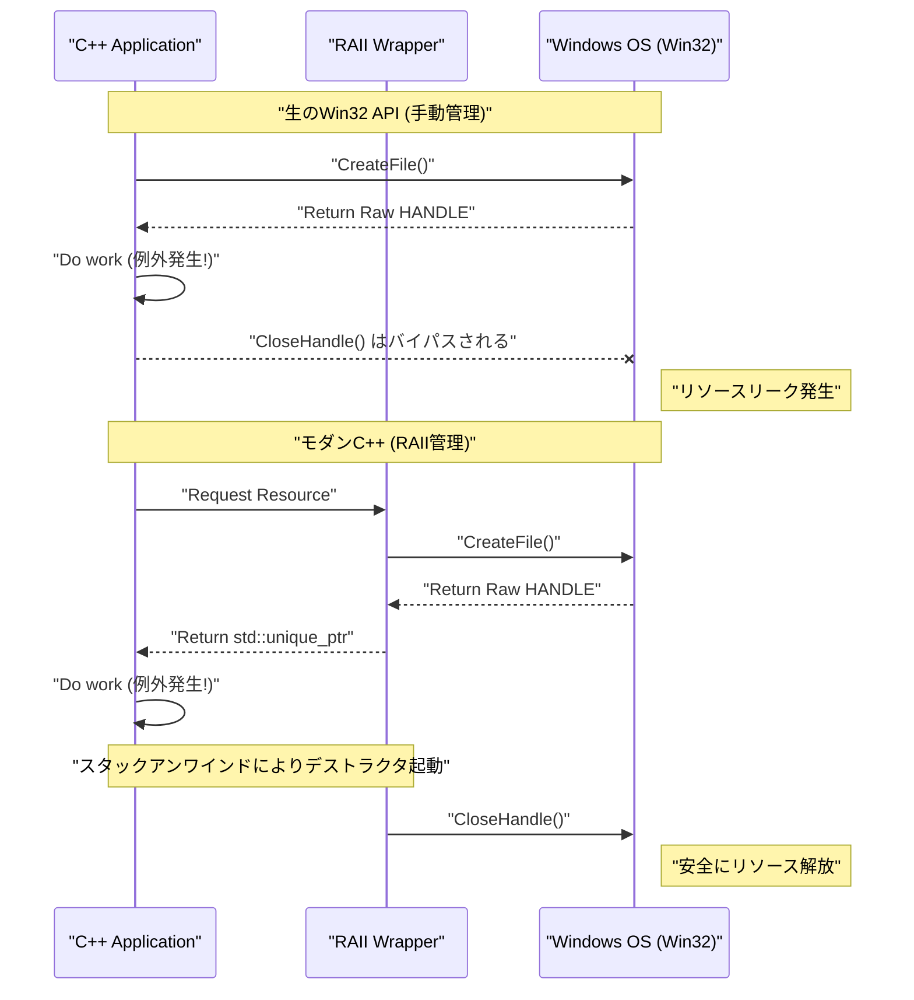
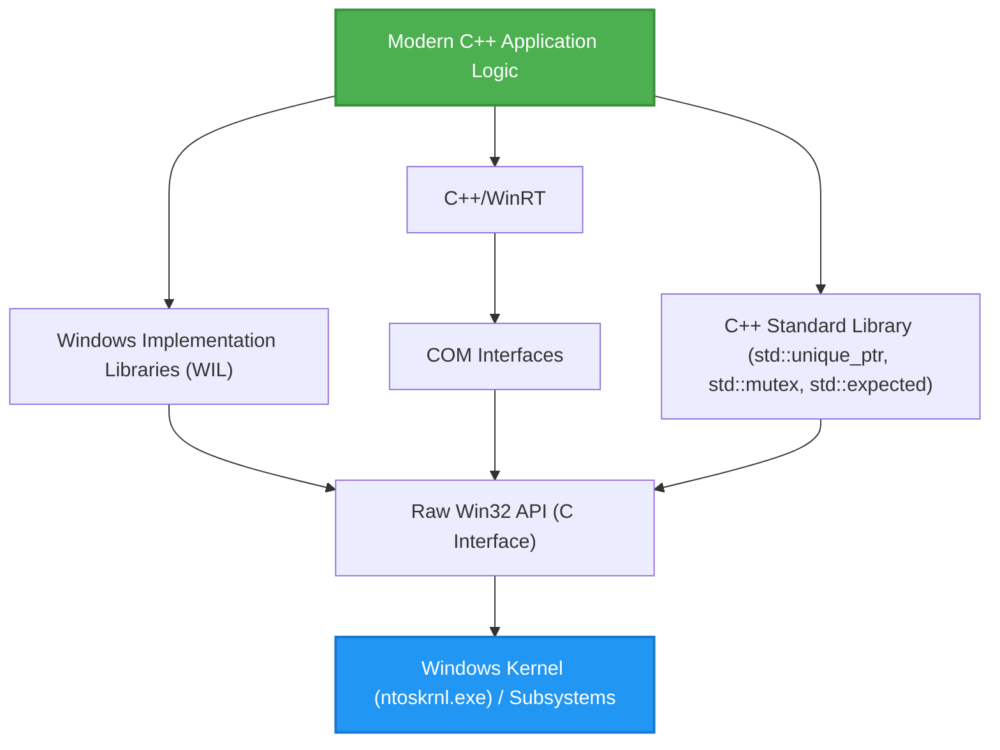

## 1. はじめに：C言語ベースのWin32 APIと現代のC++の乖離

Windows OSの基盤となる **Windows API (通称 Win32 API)** は、1990年代の Windows NT や Windows 95 の時代から脈々と受け継がれてきた巨大なC言語のインターフェースです。現在でも、Windows向けのネイティブアプリケーションを開発する際、OSのコア機能（プロセス管理、ファイルI/O、スレッド同期、ウィンドウ制御など）にアクセスするためには、最終的にこのWin32 APIを呼び出す必要があります。

しかし、Win32 APIは純粋なC言語向けに設計されており、**現代のC++（Modern C++）**が持つ高度な言語機能（例外処理、RAIIによる自動リソース管理、ムーブセマンティクス、型安全な列挙型、スマートポインタなど）を前提としていません。その結果、生のWin32 APIをそのままC++のコードに混ぜ込むと、以下のような問題が発生します。

*   **手動のリソース管理:** `CreateFile` や `CreateEvent` で取得した `HANDLE` を、必ず `CloseHandle` で解放しなければならない。
*   **例外安全性の欠如:** C++の例外がスローされた場合、適切に `CloseHandle` を呼び出す処理を記述しておかないと、容易にリソースリークが発生する。
*   **一貫性のないエラー表現:** あるAPIは `BOOL` を返し、失敗時は `GetLastError()` を呼ぶ必要がある。別のAPIは `HRESULT` を返し、また別のAPI（GDIなど）は `NULL` を返す。
*   **型安全性の欠落:** `HANDLE` や `HWND`, `HDC` などは、マクロを展開すると単なる `void*` に過ぎないことが多く、コンパイラによる厳密な型チェックが効きにくい。

本記事では、これらの「レガシーなCインターフェース」の罠を回避し、現代のC++ (C++11/14/17/20/23) の機能を用いて **安全（Safe）かつモダン（Modern）にWin32 APIを扱う手法** について、極めて詳細に解説します。

---

## 2. 生のWin32 APIの危険性：リソースリークとエラー処理の罠

まずは、旧来のCスタイルでWin32 APIを呼び出す一般的なコードを見てみましょう。一見すると問題ないように見えますが、現代のC++の観点からは致命的な脆弱性を抱えています。

```cpp
#include <windows.h>
#include <iostream>
#include <vector>

void ProcessFileLegacy(const std::wstring& filename) {
    // 1. ファイルハンドルの取得
    HANDLE hFile = ::CreateFileW(
        filename.c_str(),
        GENERIC_READ,
        FILE_SHARE_READ,
        NULL,
        OPEN_EXISTING,
        FILE_ATTRIBUTE_NORMAL,
        NULL
    );

    if (hFile == INVALID_HANDLE_VALUE) {
        std::cerr << "Failed to open file. Error: " << ::GetLastError() << std::endl;
        return;
    }

    // 2. ファイルサイズの取得
    LARGE_INTEGER fileSize;
    if (!::GetFileSizeEx(hFile, &fileSize)) {
        ::CloseHandle(hFile); // エラー時の手動解放
        return;
    }

    // 3. メモリの確保と読み込み
    std::vector<char> buffer(fileSize.QuadPart);
    DWORD bytesRead = 0;
    
    if (!::ReadFile(hFile, buffer.data(), buffer.size(), &bytesRead, NULL)) {
        ::CloseHandle(hFile); // エラー時の手動解放
        return;
    }

    // --- ここで例外が発生する処理があるとする ---
    // 例: bufferの内容を解析する関数が std::runtime_error をスロー
    // ParseBuffer(buffer); // もし例外が飛べば、下の CloseHandle は呼ばれずリークする！

    // 4. リソースの手動解放
    ::CloseHandle(hFile);
}
```

### このコードの何が問題なのか？

1.  **コードの重複と煩雑さ:** 早期リターン（`return`）のたびに `::CloseHandle(hFile);` を書く必要があり、DRY (Don't Repeat Yourself) 原則に反します。
2.  **例外安全性の完全な欠落 (Exception Unsafe):** C++では、`std::vector` のメモリアロケーション失敗時 (`std::bad_alloc`) や、他の関数が例外をスローした場合に、関数から強制的に脱出します。このとき、末尾の `CloseHandle` は実行されないため、**ファイルハンドルが永遠にリーク**します（プロセスが終了するまでファイルがロックされ続けるなどの深刻なバグを引き起こします）。

---

## 3. 例外安全とリソース管理の数学的モデル

ここで、手動のリソース管理がいかに脆弱であるかを数学的（確率論的）にモデリングしてみましょう。

関数内に $N$ 個のリソース確保（または早期リターンポイント、例外発生ポイント）があるとします。各ステップ $i$ で、エラーや例外が発生して関数から脱出する確率を $P(\text{Exit}_i)$ とします。手動で正しくクリーンアップコード（`CloseHandle` など）を全ての脱出経路に記述しきれず、リソースがリークする確率を考えます。

人間の注意力による記述漏れや、未知の例外による予期せぬ脱出が発生する確率（1つの経路あたりのリーク確率）を $p$ と置くと、プログラム全体で少なくとも1つのリソースリークが発生する確率 $P(\text{Leak})$ は次の式で表されます。

$$ P(\text{Leak}) = 1 - (1 - p)^N $$

例えば、$p = 0.05$（5%の確率で例外処理やクリーンアップをミスする）であり、$N = 20$（複雑な関数で20箇所のエラーリターンや例外ポイントがある）の場合：

$$ P(\text{Leak}) = 1 - (1 - 0.05)^{20} \approx 1 - 0.358 = 0.642 $$

なんと、**約64.2%の確率でどこかしらにリソースリークのバグが潜む**ことになります。ソフトウェアの規模が大きくなり $N \to \infty$ となると、$P(\text{Leak}) \to 1$ となり、システムは必然的に破綻します。

この数学的現実に対抗するための唯一の合理的な手段が、C++の **RAII (Resource Acquisition Is Initialization)** なのです。

---

## 4. RAII (Resource Acquisition Is Initialization) の基礎

RAIIは、C++の生みの親であるビャーネ・ストロヴストルップ氏が提唱した概念です。その原則は極めてシンプルかつ強力です。

1.  リソースの確保（Acquisition）を、オブジェクトの**コンストラクタ (Initialization)** で行う。
2.  リソースの解放を、オブジェクトの**デストラクタ**で行う。

C++の言語仕様により、スコープを抜けるとき（正常な `return` であろうと、例外によるスタックアンワインド中であろうと）、スタック上に確保されたオブジェクトのデストラクタは**確実かつ自動的**に呼び出されます。

これにより、先ほどの数式における人間のミス確率 $p$ を数学的に **$0$** にすることができます。

### オブジェクトライフサイクルの可視化

以下のシーケンス図は、生APIを用いた手動管理と、RAIIを用いた自動管理のライフサイクルの違いを示しています。



---

## 5. `std::unique_ptr` を用いた `HANDLE` の安全なラップ手法

C++11以降、標準ライブラリには汎用的なRAIIラッパーである `std::unique_ptr` が用意されています。これは単なるメモリ（`new/delete`）の管理だけでなく、**カスタムデリータ (Custom Deleter)** を指定することで、あらゆるリソースの管理に応用できます。

Win32の `HANDLE` を `std::unique_ptr` で管理するための基本的なデリータは次のように書けます。

```cpp
#include <windows.h>
#include <memory>

// HANDLE用のカスタムデリータ
struct handle_deleter {
    // std::unique_ptr が内部で扱うポインタ型を指定
    using pointer = HANDLE; 

    void operator()(HANDLE handle) const noexcept {
        if (handle != nullptr && handle != INVALID_HANDLE_VALUE) {
            ::CloseHandle(handle);
        }
    }
};

// 安全なハンドルの型エイリアス
using unique_handle = std::unique_ptr<void, handle_deleter>;
```

この `unique_handle` を使えば、先ほどの危険なコードは以下のように生まれ変わります。

```cpp
void ProcessFileModern(const std::wstring& filename) {
    // 取得した直後に RAII オブジェクトに所有権を渡す
    unique_handle hFile(::CreateFileW(
        filename.c_str(), GENERIC_READ, FILE_SHARE_READ, NULL,
        OPEN_EXISTING, FILE_ATTRIBUTE_NORMAL, NULL
    ));

    // エラーチェック (INVALID_HANDLE_VALUEへの対応は後述)
    if (hFile.get() == INVALID_HANDLE_VALUE) {
        throw std::runtime_error("Failed to open file");
    }

    LARGE_INTEGER fileSize;
    if (!::GetFileSizeEx(hFile.get(), &fileSize)) {
        throw std::runtime_error("Failed to get file size");
    }

    std::vector<char> buffer(fileSize.QuadPart);
    DWORD bytesRead = 0;
    
    if (!::ReadFile(hFile.get(), buffer.data(), buffer.size(), &bytesRead, NULL)) {
        throw std::runtime_error("Failed to read file");
    }

    // ここで例外が発生しても、早期リターンしても、
    // 関数を抜ける瞬間に unique_handle のデストラクタが CloseHandle を呼び出す！
}
```

---

## 6. 深入：`INVALID_HANDLE_VALUE` と `nullptr` の問題の解決

Win32 APIを扱う上で、C++プログラマを最も悩ませる仕様の1つが**無効なハンドルの表現が一貫していないこと**です。

*   `CreateEvent` や `CreateThread` など：失敗すると `NULL` (`nullptr`) を返す。
*   `CreateFile` など：失敗すると `INVALID_HANDLE_VALUE` (値としては `(HANDLE)-1`) を返す。

標準の `std::unique_ptr` は、内部ポインタが `nullptr` の場合を「空の状態（リソースを所有していない状態）」として特別扱いします。つまり、`if (ptr)` のような真偽値判定は `nullptr` に対してのみ `false` を返します。

しかし、`CreateFile` が失敗して `INVALID_HANDLE_VALUE` を返した場合、`std::unique_ptr` はそれを「有効な非NULLポインタ」と誤認してしまいます。

この問題をエレガントに解決するには、C++の `std::unique_ptr` の高度な仕様を利用し、**カスタムポインタ型** を定義します。

```cpp
#include <windows.h>
#include <memory>

struct win32_handle_traits {
    // カスタムポインタ型の定義
    class pointer {
        HANDLE m_handle;
    public:
        // デフォルト構築やnullptr代入時は INVALID_HANDLE_VALUE を初期値とする設計も可能だが、
        // 汎用性を高めるため nullptr と INVALID_HANDLE_VALUE の両方を無効状態として扱う。
        pointer() noexcept : m_handle(nullptr) {}
        pointer(std::nullptr_t) noexcept : m_handle(nullptr) {}
        pointer(HANDLE h) noexcept : m_handle(h) {}
        
        // operator bool をオーバーロードし、Win32の2種類の無効値を両方弾く
        explicit operator bool() const noexcept {
            return m_handle != nullptr && m_handle != INVALID_HANDLE_VALUE;
        }
        
        operator HANDLE() const noexcept { return m_handle; }
        
        friend bool operator==(pointer a, pointer b) noexcept { return a.m_handle == b.m_handle; }
        friend bool operator!=(pointer a, pointer b) noexcept { return a.m_handle != b.m_handle; }
    };
    
    void operator()(pointer p) const noexcept {
        if (p) { // operator bool が呼ばれる
            ::CloseHandle(p);
        }
    }
};

using safe_win32_handle = std::unique_ptr<void, win32_handle_traits>;
```

この実装により、次のように直感的で安全なコードが書けるようになります。

```cpp
safe_win32_handle hFile(::CreateFileW(...));
if (!hFile) {
    // nullptr と INVALID_HANDLE_VALUE の両方をここでキャッチできる！
    throw std::system_error(::GetLastError(), std::system_category(), "CreateFile failed");
}
```

---

## 7. GDIオブジェクト（`HDC`, `HBITMAP`）の高度なRAII管理

Win32のもう一つの鬼門が、GDI (Graphics Device Interface) のリソース管理です。
GDIオブジェクト（ペン、ブラシ、フォント、ビットマップなど）は、作成後に `SelectObject` でデバイスコンテキスト (`HDC`) に選択して使用し、使い終わったら **元のオブジェクトを再度 SelectObject して復元してから、DeleteObject で破棄する** という非常に面倒な作法が要求されます。

これをRAIIで解決するためのラッパーは以下のようになります。

```cpp
// GDIオブジェクト削除用デリータ
struct gdi_deleter {
    using pointer = HGDIOBJ;
    void operator()(HGDIOBJ obj) const noexcept {
        if (obj != nullptr) {
            ::DeleteObject(obj);
        }
    }
};

using unique_gdi_obj = std::unique_ptr<void, gdi_deleter>;

// SelectObjectのRAIIラッパー (スコープを抜けると元のオブジェクトを復元する)
class gdi_selector {
    HDC m_hdc;
    HGDIOBJ m_oldObj;

public:
    gdi_selector(HDC hdc, HGDIOBJ newObj) : m_hdc(hdc) {
        // 新しいオブジェクトを選択し、古いオブジェクトを保存
        m_oldObj = ::SelectObject(m_hdc, newObj);
    }

    ~gdi_selector() {
        if (m_oldObj != nullptr && m_oldObj != HGDI_ERROR) {
            // スコープを抜ける際に自動復元
            ::SelectObject(m_hdc, m_oldObj);
        }
    }

    // コピー禁止
    gdi_selector(const gdi_selector&) = delete;
    gdi_selector& operator=(const gdi_selector&) = delete;
};
```

### 使用例

```cpp
void DrawMyGraphics(HDC hdc) {
    // ペンを作成 (RAII管理)
    unique_gdi_obj hPen(::CreatePen(PS_SOLID, 1, RGB(255, 0, 0)));
    
    {
        // ペンをHDCに選択 (スコープ管理)
        gdi_selector penSelect(hdc, hPen.get());
        
        // 描画処理...
        ::MoveToEx(hdc, 0, 0, NULL);
        ::LineTo(hdc, 100, 100);
        
        // スコープを抜ける際、penSelectのデストラクタが古いペンをSelectObjectで復元する
    }
    
    // 関数を抜ける際、hPenのデストラクタが DeleteObject を呼び出す
}
```
このように、ライフサイクルが入れ子になるリソース管理はRAIIの独壇場です。

---

## 8. スレッド同期オブジェクトのモダナイズ

Win32には `CRITICAL_SECTION` や `SRWLOCK` などのスレッド同期プリミティブが存在します。これらも `EnterCriticalSection` / `LeaveCriticalSection` を手動で呼び出すのは例外安全の観点から御法度です。

C++11の `std::mutex` や `std::lock_guard` は非常に便利ですが、OSネイティブの高速なロック機構を直接使いたい場面（特にSRWLockは非常に軽量です）もあります。
標準の `std::lock_guard` は、`lock()` と `unlock()` というメンバ関数を持つ任意の型を受け入れる仕様（ダックタイピングのようなテンプレート仕様）になっています。これを利用します。

```cpp
class win32_srwlock {
    SRWLOCK m_lock;
public:
    win32_srwlock() noexcept {
        ::InitializeSRWLock(&m_lock);
    }
    
    // std::lock_guard が要求するインターフェース
    void lock() noexcept {
        ::AcquireSRWLockExclusive(&m_lock);
    }
    void unlock() noexcept {
        ::ReleaseSRWLockExclusive(&m_lock);
    }
    
    // コピー・ムーブ禁止
    win32_srwlock(const win32_srwlock&) = delete;
    win32_srwlock& operator=(const win32_srwlock&) = delete;
};
```

これにより、完全にC++標準ライブラリの作法でWin32のロックを扱えます。

```cpp
win32_srwlock g_myLock;
int g_sharedData = 0;

void UpdateData() {
    // 例外安全なロック取得
    std::lock_guard<win32_srwlock> lock(g_myLock);
    
    g_sharedData++;
    if (g_sharedData > 100) {
        throw std::runtime_error("Overflow"); // 例外が飛んでも安全にロック解放！
    }
}
```

---

## 9. C++の標準ライブラリとの統合：`std::system_error` と `HRESULT`

Win32のエラーは `GetLastError()` (DWORD型) と、COMやDirectXで使われる `HRESULT` の2種類が主流です。これらをC++の例外である `std::system_error` に変換することで、エラーハンドリングをモダナイズできます。

`GetLastError()` を投げる場合、MSVC（Visual C++）の実装では `std::system_category()` がWin32のエラーコードとメッセージのマッピングを提供してくれます。

```cpp
inline void throw_if_win32_error(BOOL result, const char* msg = "Win32 API failed") {
    if (!result) {
        DWORD err = ::GetLastError();
        // std::system_category は FormatMessage API を内部で呼び出し、エラー文字列を生成してくれる
        throw std::system_error(err, std::system_category(), msg);
    }
}
```

一方、`HRESULT` に関しては、専用のエラーカテゴリを作成するか、Windows標準の `_com_error` を使用します。

---

## 10. `std::expected` (C++23) を用いたモダンなエラーハンドリング

C++23からは、Rustの `Result` 型に相当する `std::expected` が導入されました。例外を好まない（パフォーマンス上の理由や、エラーが頻発する設計）プロジェクトにおいて、Win32の戻り値をモダナイズする最適な手法です。

```cpp
#include <expected>
#include <string>

// 成功時は unique_handle、失敗時は DWORD(エラーコード) を返す
std::expected<safe_win32_handle, DWORD> OpenFileModern(const std::wstring& path) {
    safe_win32_handle h(::CreateFileW(
        path.c_str(), GENERIC_READ, 0, nullptr, OPEN_EXISTING, 0, nullptr));
        
    if (!h) {
        return std::unexpected(::GetLastError());
    }
    return std::move(h); // 成功時はハンドルをムーブして返す
}

void Usage() {
    auto result = OpenFileModern(L"C:\\test.txt");
    if (result) {
        // 成功時の処理
        safe_win32_handle& hFile = *result;
        // ...
    } else {
        // 失敗時の処理
        DWORD err = result.error();
        std::cerr << "Error code: " << err << std::endl;
    }
}
```

このように、C++23を用いることで、戻り値によるエラーハンドリングとRAIIの恩恵を両立させることができます。

---

## 11. Microsoftの回答 (1)：WIL (Windows Implementation Libraries) の活用

これまで自作のラッパーを紹介してきましたが、実のところ Microsoft 自身もこの問題を重く見ており、モダンC++向けの公式ヘッダオンリーライブラリ **WIL (Windows Implementation Libraries)** をオープンソースとして公開しています（GitHub上で入手可能）。

WILを利用すると、上記で苦労して自作したラッパーが全て標準で提供されます。

```cpp
#include <wil/resource.h>
#include <wil/result.h>

void ProcessWithWIL() {
    // wil::unique_handle は INVALID_HANDLE_VALUE と NULL の両方に対応済み
    wil::unique_handle hFile;
    
    // THROW_IF_WIN32_BOOL_FALSE マクロがエラーチェックと例外スローを自動化
    THROW_IF_WIN32_BOOL_FALSE(
        ::CreateFileW(L"test.txt", GENERIC_READ, 0, nullptr, OPEN_EXISTING, 0, nullptr),
        hFile.put() // WIL特有の出力ポインタ受け取り用ヘルパー
    );
    
    // wil::unique_cotaskmem_string など、メモリ管理のラッパーも充実
}
```

WILの真髄は `wil::unique_any` という強大なテンプレートにあり、ファイルハンドルだけでなく、レジストリキー、GDIオブジェクト、ローカルメモリなど、ありとあらゆるWin32リソースのRAIIラッパーを数行の定義で生成できる点にあります。

---

## 12. Microsoftの回答 (2)：C++/WinRT によるCOMの抽象化

Win32 APIの多く（特にシェルの拡張やDirectXなど）は、C言語ベースのCOM (Component Object Model) インターフェースを通じて提供されます。
従来の `CComPtr` (ATL) や `ComPtr` (WRL) をさらに進化させ、現在 Microsoft が公式に推奨しているのが **C++/WinRT** です。

C++/WinRT は、Windows ランタイム (WinRT) だけでなく、従来のCOMオブジェクトも極めてスマートに扱うことができます。

```cpp
#include <winrt/base.h>

void ComExample() {
    // COMの初期化 (RAII化)
    winrt::init_apartment();

    // IUnknownを継承するCOMインターフェースを winrt::com_ptr で安全に管理
    winrt::com_ptr<IDXGIFactory> factory;
    winrt::check_hresult(
        ::CreateDXGIFactory(__uuidof(IDXGIFactory), factory.put_void())
    );
    
    // AddRef や Release を手動で呼ぶ必要は一切ない
}
```

---

## 13. アーキテクチャとライフサイクルの可視化

現代のWindows C++アプリケーション開発におけるレイヤー構造を整理しましょう。



アプリケーションロジックは決して生のWin32 API（レイヤーE）に直接触れるべきではありません。必ず、標準ライブラリ、WIL、またはC++/WinRTのいずれかの抽象化レイヤーを介してアクセスするアーキテクチャにすることで、メモリ安全性が飛躍的に向上します。

---

## 14. ゼロコスト抽象化のパフォーマンス分析

「RAIIラッパーやスマートポインタを使うと、生のC言語APIより動作が遅くなるのではないか？」という疑問を持つ方もいるかもしれません。
ここで、パフォーマンスコストの数式モデルを見てみましょう。

実行時間 $T_{\text{total}}$ は次のように分解できます。

$$ T_{\text{total}} = T_{\text{syscall}} + T_{\text{wrapper}} + T_{\text{cleanup}} $$

*   $T_{\text{syscall}}$: Win32 API内部のカーネルモード遷移や実処理にかかる時間。通常ミリ秒〜マイクロ秒単位。
*   $T_{\text{wrapper}}$: `std::unique_ptr` や WIL のラッパークラス構築にかかる時間。
*   $T_{\text{cleanup}}$: デストラクタ呼び出しにかかる時間。

C++のコンパイラ（MSVC, Clang, GCC）は、インライン化 (Inlining) の最適化に極めて優れています。`std::unique_ptr` のコンストラクタやデストラクタ、オーバーロードされた `operator*` や `operator bool` は全て `inline` 展開され、メモリ上の生のポインタに対する直接操作と全く同じ機械語にコンパイルされます。

すなわち、**$T_{\text{wrapper}} \approx 0$** となります。これはC++の最大の哲学である **Zero-cost Abstraction (ゼロコスト抽象化)** の証明です。安全性を手に入れても、実行時のオーバーヘッドは文字通りゼロなのです。

---

## 15. まとめ：安全なWindowsプログラミングの未来

Win32 APIは、歴史的な理由によりC言語のパラダイムで設計された古き良き遺産です。しかし、それを呼び出す側であるC++は進化を続けており、現在では極めて安全で表現力豊かなコードを書くことが可能です。

本記事で解説した重要ポイントを振り返ります。

1.  **手動の `CloseHandle` や `DeleteObject` は一切書かない。** すべてを `std::unique_ptr` などのRAIIコンテナに封じ込める。
2.  **`INVALID_HANDLE_VALUE` の罠を理解する。** 専用のカスタムデリータ・カスタムポインタトレイトを実装するか、WILの `wil::unique_handle` を使う。
3.  **エラーハンドリングをモダナイズする。** `GetLastError()` や `HRESULT` を `std::system_error` の例外として投げるか、C++23の `std::expected` を用いて型安全に処理する。
4.  **巨人の肩に乗る。** Microsoft公式の WIL や C++/WinRT を積極的に採用し、車輪の再発明を避ける。

現代のC++開発において、生のポインタやハンドルを裸のまま持ち歩くことは、シートベルトを締めずに高速道路を走るようなものです。C++が提供する強力な型システムとRAIIを駆使し、安全で堅牢なWindowsアプリケーション開発を楽しんでください。
