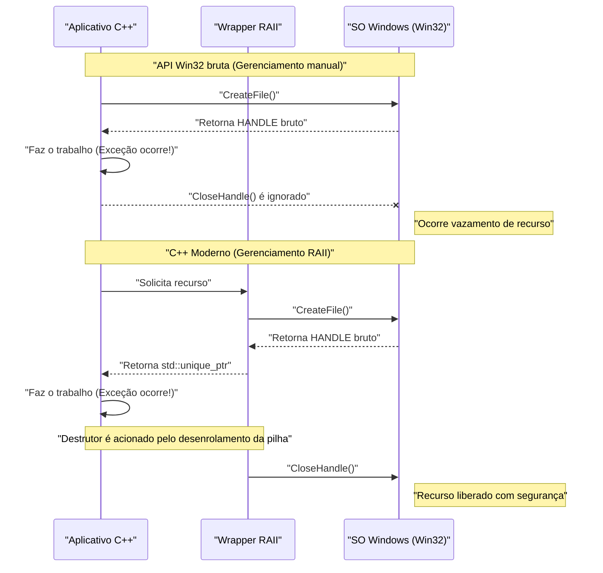
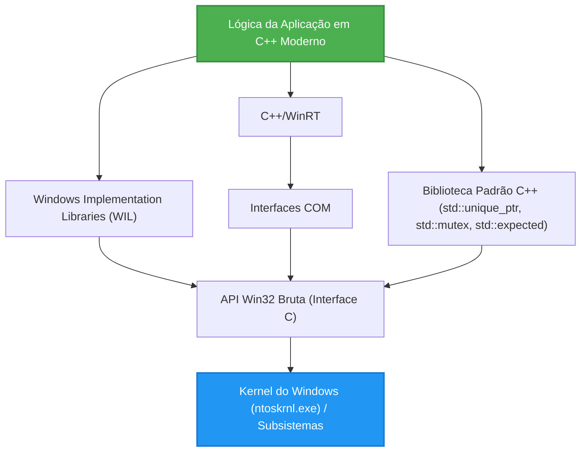

## 1. Introdução: A divergência entre a API Win32 baseada em C e o C++ moderno

A **Windows API (comumente conhecida como Win32 API)**, que serve como base do sistema operacional Windows, é uma enorme interface em linguagem C que tem sido continuamente transmitida desde a era do Windows NT e Windows 95 na década de 1990. Mesmo hoje, ao desenvolver aplicativos nativos para Windows, você deve, em última análise, chamar essa API Win32 para acessar as funções principais do SO (gerenciamento de processos, E/S de arquivos, sincronização de threads, controle de janelas, etc.).

No entanto, a API Win32 foi projetada para a linguagem C pura e não pressupõe os recursos de linguagem avançados (tratamento de exceções, gerenciamento automático de recursos via RAII, semântica de movimento, enumerações com tipagem segura, ponteiros inteligentes, etc.) do **C++ moderno (Modern C++)**. Como resultado, se você misturar a API Win32 bruta diretamente no código C++, os seguintes problemas ocorrerão:

*   **Gerenciamento manual de recursos:** Um `HANDLE` obtido com `CreateFile` ou `CreateEvent` deve ser obrigatoriamente liberado com `CloseHandle`.
*   **Falta de segurança de exceções:** Se uma exceção do C++ for lançada, a menos que o código para chamar adequadamente o `CloseHandle` tenha sido escrito, ocorrerão facilmente vazamentos de recursos.
*   **Representação inconsistente de erros:** Algumas APIs retornam `BOOL` e exigem uma chamada a `GetLastError()` em caso de falha. Outras APIs retornam `HRESULT`, e ainda outras (como a GDI) retornam `NULL`.
*   **Falta de segurança de tipos:** `HANDLE`, `HWND`, `HDC` etc. são frequentemente apenas `void*` quando as macros são expandidas, dificultando a verificação estrita de tipos pelo compilador.

Neste artigo, explicaremos de forma extremamente detalhada métodos para evitar essas armadilhas das "interfaces C legadas" e usar os recursos do C++ moderno (C++11/14/17/20/23) para **lidar com a API Win32 de forma segura (Safe) e moderna (Modern)**.

---

## 2. Os perigos da API Win32 bruta: Vazamentos de recursos e armadilhas no tratamento de erros

Primeiro, vejamos um código típico que chama a API Win32 no estilo C antigo. À primeira vista, parece não haver problemas, mas do ponto de vista do C++ moderno, possui vulnerabilidades fatais.

```cpp
#include <windows.h>
#include <iostream>
#include <vector>

void ProcessFileLegacy(const std::wstring& filename) {
    // 1. Obtenção do handle do arquivo
    HANDLE hFile = ::CreateFileW(
        filename.c_str(),
        GENERIC_READ,
        FILE_SHARE_READ,
        NULL,
        OPEN_EXISTING,
        FILE_ATTRIBUTE_NORMAL,
        NULL
    );

    if (hFile == INVALID_HANDLE_VALUE) {
        std::cerr << "Failed to open file. Error: " << ::GetLastError() << std::endl;
        return;
    }

    // 2. Obtenção do tamanho do arquivo
    LARGE_INTEGER fileSize;
    if (!::GetFileSizeEx(hFile, &fileSize)) {
        ::CloseHandle(hFile); // Liberação manual em caso de erro
        return;
    }

    // 3. Alocação de memória e leitura
    std::vector<char> buffer(fileSize.QuadPart);
    DWORD bytesRead = 0;
    
    if (!::ReadFile(hFile, buffer.data(), buffer.size(), &bytesRead, NULL)) {
        ::CloseHandle(hFile); // Liberação manual em caso de erro
        return;
    }

    // --- Suponha que haja um processamento aqui que lança uma exceção ---
    // Ex: uma função que analisa o conteúdo do buffer lança std::runtime_error
    // ParseBuffer(buffer); // Se a exceção voar, o CloseHandle abaixo não é chamado e há vazamento!

    // 4. Liberação manual do recurso
    ::CloseHandle(hFile);
}
```

### Qual é o problema deste código?

1.  **Duplicação e complexidade do código:** É necessário escrever `::CloseHandle(hFile);` a cada retorno antecipado (`return`), violando o princípio DRY (Don't Repeat Yourself).
2.  **Falta total de segurança de exceções (Exception Unsafe):** No C++, ao falhar a alocação de memória do `std::vector` (`std::bad_alloc`) ou quando outra função lança uma exceção, há uma saída forçada da função. Nesse momento, o `CloseHandle` no final não é executado, portanto, **o handle do arquivo vaza para sempre** (causando bugs graves, como o arquivo ficar bloqueado até o término do processo).

---

## 3. Modelo matemático de segurança de exceções e gerenciamento de recursos

Aqui, vamos modelar matematicamente (probabilisticamente) quão frágil é o gerenciamento manual de recursos.

Suponha que existam $N$ alocações de recursos (ou pontos de retorno antecipado, pontos de ocorrência de exceções) em uma função. Seja $P(\text{Exit}_i)$ a probabilidade de um erro ou exceção ocorrer em cada etapa $i$ e causar a saída da função. Considere a probabilidade de o código de limpeza (como `CloseHandle`) não ser escrito corretamente de forma manual em todas as rotas de saída e um recurso vazar.

Se a probabilidade de falhar ao escrever o tratamento de exceção ou a limpeza devido à falta de atenção humana ou a uma saída inesperada por causa de uma exceção desconhecida (a probabilidade de vazamento por rota) for definida como $p$, a probabilidade $P(\text{Leak})$ de ocorrer pelo menos um vazamento de recurso em todo o programa é dada pela seguinte fórmula:

$$ P(\text{Leak}) = 1 - (1 - p)^N $$

Por exemplo, se $p = 0.05$ (5% de chance de cometer um erro no tratamento de exceção ou na limpeza) e $N = 20$ (uma função complexa com 20 pontos de retorno de erro ou exceção):

$$ P(\text{Leak}) = 1 - (1 - 0.05)^{20} \approx 1 - 0.358 = 0.642 $$

Surpreendentemente, **há uma probabilidade de cerca de 64,2% de haver um bug de vazamento de recurso escondido em algum lugar**. À medida que a escala do software aumenta e $N \to \infty$, $P(\text{Leak}) \to 1$, e o sistema inevitavelmente falhará.

A única medida racional para combater essa realidade matemática é a **RAII (Resource Acquisition Is Initialization)** do C++.

---

## 4. O básico da RAII (Resource Acquisition Is Initialization)

A RAII é um conceito proposto por Bjarne Stroustrup, o criador do C++. Seus princípios são extremamente simples e poderosos.

1.  A aquisição de recursos (Acquisition) é realizada no **construtor (Initialization)** do objeto.
2.  A liberação de recursos é realizada no **destrutor** do objeto.

Devido às especificações da linguagem C++, ao sair do escopo (seja um `return` normal ou durante o desenrolamento da pilha devido a uma exceção), o destrutor de um objeto alocado na pilha é chamado de forma **certa e automática**.

Com isso, a probabilidade $p$ de erro humano na equação anterior pode ser reduzida matematicamente a **$0$**.

### Visualização do ciclo de vida do objeto

O diagrama de sequência a seguir mostra a diferença no ciclo de vida entre o gerenciamento manual usando APIs brutas e o gerenciamento automático usando RAII.



---

## 5. Método de encapsulamento seguro de `HANDLE` usando `std::unique_ptr`

A partir do C++11, a biblioteca padrão fornece `std::unique_ptr`, um wrapper RAII de uso geral. Ele pode ser aplicado não apenas ao simples gerenciamento de memória (`new/delete`), mas ao gerenciamento de qualquer recurso especificando um **Deletador Personalizado (Custom Deleter)**.

Um deletador básico para gerenciar um `HANDLE` do Win32 com `std::unique_ptr` pode ser escrito da seguinte forma:

```cpp
#include <windows.h>
#include <memory>

// Deletador personalizado para HANDLE
struct handle_deleter {
    // Especifica o tipo de ponteiro que std::unique_ptr manipula internamente
    using pointer = HANDLE; 

    void operator()(HANDLE handle) const noexcept {
        if (handle != nullptr && handle != INVALID_HANDLE_VALUE) {
            ::CloseHandle(handle);
        }
    }
};

// Alias de tipo para um handle seguro
using unique_handle = std::unique_ptr<void, handle_deleter>;
```

Usando este `unique_handle`, o código perigoso anterior renasce da seguinte forma:

```cpp
void ProcessFileModern(const std::wstring& filename) {
    // Passa a propriedade para o objeto RAII imediatamente após obtê-la
    unique_handle hFile(::CreateFileW(
        filename.c_str(), GENERIC_READ, FILE_SHARE_READ, NULL,
        OPEN_EXISTING, FILE_ATTRIBUTE_NORMAL, NULL
    ));

    // Verificação de erro (o tratamento para INVALID_HANDLE_VALUE é discutido mais tarde)
    if (hFile.get() == INVALID_HANDLE_VALUE) {
        throw std::runtime_error("Failed to open file");
    }

    LARGE_INTEGER fileSize;
    if (!::GetFileSizeEx(hFile.get(), &fileSize)) {
        throw std::runtime_error("Failed to get file size");
    }

    std::vector<char> buffer(fileSize.QuadPart);
    DWORD bytesRead = 0;
    
    if (!::ReadFile(hFile.get(), buffer.data(), buffer.size(), &bytesRead, NULL)) {
        throw std::runtime_error("Failed to read file");
    }

    // Mesmo que ocorra uma exceção ou um retorno antecipado aqui,
    // o destrutor do unique_handle chamará CloseHandle no momento em que sair da função!
}
```

---

## 6. Aprofundamento: Solucionando o problema do `INVALID_HANDLE_VALUE` e `nullptr`

Uma das especificações que mais incomodam os programadores de C++ ao lidar com a API Win32 é **a inconsistência na representação de handles inválidos**.

*   `CreateEvent`, `CreateThread`, etc.: Em caso de falha, retornam `NULL` (`nullptr`).
*   `CreateFile`, etc.: Em caso de falha, retornam `INVALID_HANDLE_VALUE` (como valor, `(HANDLE)-1`).

O padrão `std::unique_ptr` trata o caso em que o ponteiro interno é `nullptr` como um caso especial de um "estado vazio (estado em que não possui nenhum recurso)". Ou seja, uma avaliação booleana como `if (ptr)` retorna `false` apenas para `nullptr`.

No entanto, se `CreateFile` falhar e retornar `INVALID_HANDLE_VALUE`, o `std::unique_ptr` o identificará erroneamente como um "ponteiro não-NULL válido".

Para resolver esse problema de forma elegante, podemos usar os recursos avançados de `std::unique_ptr` do C++ e definir um **tipo de ponteiro personalizado**.

```cpp
#include <windows.h>
#include <memory>

struct win32_handle_traits {
    // Definição do tipo de ponteiro personalizado
    class pointer {
        HANDLE m_handle;
    public:
        // O design poderia ter INVALID_HANDLE_VALUE como o valor inicial por construção padrão ou na atribuição de nullptr,
        // mas para aumentar a versatilidade, nós tratamos ambos nullptr e INVALID_HANDLE_VALUE como estados inválidos.
        pointer() noexcept : m_handle(nullptr) {}
        pointer(std::nullptr_t) noexcept : m_handle(nullptr) {}
        pointer(HANDLE h) noexcept : m_handle(h) {}
        
        // Sobrecarrega operator bool e descarta ambos os valores inválidos do Win32
        explicit operator bool() const noexcept {
            return m_handle != nullptr && m_handle != INVALID_HANDLE_VALUE;
        }
        
        operator HANDLE() const noexcept { return m_handle; }
        
        friend bool operator==(pointer a, pointer b) noexcept { return a.m_handle == b.m_handle; }
        friend bool operator!=(pointer a, pointer b) noexcept { return a.m_handle != b.m_handle; }
    };
    
    void operator()(pointer p) const noexcept {
        if (p) { // operator bool é chamado
            ::CloseHandle(p);
        }
    }
};

using safe_win32_handle = std::unique_ptr<void, win32_handle_traits>;
```

Com esta implementação, você pode escrever códigos intuitivos e seguros como a seguir:

```cpp
safe_win32_handle hFile(::CreateFileW(...));
if (!hFile) {
    // Tanto nullptr quanto INVALID_HANDLE_VALUE podem ser capturados aqui!
    throw std::system_error(::GetLastError(), std::system_category(), "CreateFile failed");
}
```

---

## 7. Gerenciamento RAII avançado para objetos GDI (`HDC`, `HBITMAP`)

Outro desafio no Win32 é o gerenciamento de recursos da GDI (Graphics Device Interface).
Os objetos da GDI (caneta, pincel, fonte, bitmap, etc.) devem ser selecionados em um contexto de dispositivo (`HDC`) com `SelectObject` após a criação para serem usados, e quando você terminar de usá-los, você deve seguir um procedimento muito incômodo de **restaurar o objeto original selecionando-o novamente com SelectObject e, em seguida, destruí-lo com DeleteObject**.

Um wrapper para resolver isso com RAII seria o seguinte:

```cpp
// Deletador para objetos GDI
struct gdi_deleter {
    using pointer = HGDIOBJ;
    void operator()(HGDIOBJ obj) const noexcept {
        if (obj != nullptr) {
            ::DeleteObject(obj);
        }
    }
};

using unique_gdi_obj = std::unique_ptr<void, gdi_deleter>;

// Wrapper RAII para SelectObject (restaura o objeto original ao sair do escopo)
class gdi_selector {
    HDC m_hdc;
    HGDIOBJ m_oldObj;

public:
    gdi_selector(HDC hdc, HGDIOBJ newObj) : m_hdc(hdc) {
        // Seleciona o novo objeto e salva o objeto antigo
        m_oldObj = ::SelectObject(m_hdc, newObj);
    }

    ~gdi_selector() {
        if (m_oldObj != nullptr && m_oldObj != HGDI_ERROR) {
            // Restaura automaticamente ao sair do escopo
            ::SelectObject(m_hdc, m_oldObj);
        }
    }

    // Cópia desabilitada
    gdi_selector(const gdi_selector&) = delete;
    gdi_selector& operator=(const gdi_selector&) = delete;
};
```

### Exemplo de uso

```cpp
void DrawMyGraphics(HDC hdc) {
    // Cria a caneta (Gerenciado via RAII)
    unique_gdi_obj hPen(::CreatePen(PS_SOLID, 1, RGB(255, 0, 0)));
    
    {
        // Seleciona a caneta no HDC (Gerenciado por escopo)
        gdi_selector penSelect(hdc, hPen.get());
        
        // Processamento de desenho...
        ::MoveToEx(hdc, 0, 0, NULL);
        ::LineTo(hdc, 100, 100);
        
        // Ao sair do escopo, o destrutor do penSelect restaura a caneta antiga com SelectObject
    }
    
    // Ao sair da função, o destrutor de hPen chama DeleteObject
}
```
Como você pode ver, gerenciar recursos cujos ciclos de vida são aninhados é onde a RAII brilha.

---

## 8. Modernizando objetos de sincronização de threads

O Win32 possui primitivas de sincronização de threads, como `CRITICAL_SECTION` e `SRWLOCK`. Chamar manualmente `EnterCriticalSection` / `LeaveCriticalSection` também é estritamente proibido do ponto de vista da segurança de exceções.

`std::mutex` e `std::lock_guard` do C++11 são extremamente convenientes, mas pode haver casos em que você queira usar o mecanismo de bloqueio nativo e rápido do sistema operacional diretamente (particularmente, o SRWLock é muito leve).
O `std::lock_guard` padrão é projetado para aceitar qualquer tipo que tenha funções-membro `lock()` e `unlock()` (uma especificação de template semelhante ao duck typing). Nós usamos isso.

```cpp
class win32_srwlock {
    SRWLOCK m_lock;
public:
    win32_srwlock() noexcept {
        ::InitializeSRWLock(&m_lock);
    }
    
    // Interface requerida pelo std::lock_guard
    void lock() noexcept {
        ::AcquireSRWLockExclusive(&m_lock);
    }
    void unlock() noexcept {
        ::ReleaseSRWLockExclusive(&m_lock);
    }
    
    // Proíbe cópia e movimento
    win32_srwlock(const win32_srwlock&) = delete;
    win32_srwlock& operator=(const win32_srwlock&) = delete;
};
```

Isso permite que você manipule locks do Win32 perfeitamente com os costumes da biblioteca padrão do C++.

```cpp
win32_srwlock g_myLock;
int g_sharedData = 0;

void UpdateData() {
    // Aquisição de lock com segurança de exceção
    std::lock_guard<win32_srwlock> lock(g_myLock);
    
    g_sharedData++;
    if (g_sharedData > 100) {
        throw std::runtime_error("Overflow"); // O lock é liberado com segurança mesmo que uma exceção seja lançada!
    }
}
```

---

## 9. Integração com a Biblioteca Padrão C++: `std::system_error` e `HRESULT`

O erro no Win32 tem duas vertentes principais: `GetLastError()` (tipo DWORD) e `HRESULT`, usado em COM e DirectX. Você pode modernizar o tratamento de erros convertendo-os na exceção C++ `std::system_error`.

Ao lançar de `GetLastError()`, a implementação MSVC (Visual C++) fornece mapeamento de códigos de erro e mensagens do Win32 com `std::system_category()`.

```cpp
inline void throw_if_win32_error(BOOL result, const char* msg = "Win32 API failed") {
    if (!result) {
        DWORD err = ::GetLastError();
        // std::system_category chama internamente a API FormatMessage para gerar uma string de erro
        throw std::system_error(err, std::system_category(), msg);
    }
}
```

Para `HRESULT`, você pode criar uma categoria de erro dedicada ou usar a classe padrão do Windows `_com_error`.

---

## 10. Tratamento de erros moderno usando `std::expected` (C++23)

A partir do C++23, `std::expected`, equivalente ao tipo `Result` em Rust, foi introduzido. É o método ideal para modernizar o valor de retorno de Win32 em projetos que não gostam de exceções (devido a razões de desempenho ou a um design onde os erros ocorrem frequentemente).

```cpp
#include <expected>
#include <string>

// Retorna unique_handle em caso de sucesso, ou DWORD (código de erro) em caso de falha
std::expected<safe_win32_handle, DWORD> OpenFileModern(const std::wstring& path) {
    safe_win32_handle h(::CreateFileW(
        path.c_str(), GENERIC_READ, 0, nullptr, OPEN_EXISTING, 0, nullptr));
        
    if (!h) {
        return std::unexpected(::GetLastError());
    }
    return std::move(h); // Move e retorna o handle em caso de sucesso
}

void Usage() {
    auto result = OpenFileModern(L"C:\\test.txt");
    if (result) {
        // Processamento em caso de sucesso
        safe_win32_handle& hFile = *result;
        // ...
    } else {
        // Processamento em caso de falha
        DWORD err = result.error();
        std::cerr << "Error code: " << err << std::endl;
    }
}
```

Assim, usando C++23, é possível equilibrar os benefícios de tratamento de erros através de valores de retorno e RAII.

---

## 11. Resposta da Microsoft (1): Utilizando as Bibliotecas de Implementação do Windows (WIL)

Até agora, introduzimos wrappers auto-construídos, mas a própria Microsoft levou esse problema a sério e publicou a biblioteca de cabeçalho único (header-only) oficial para C++ moderno, a **WIL (Windows Implementation Libraries)**, como open source (disponível no GitHub).

Ao usar a WIL, todos os wrappers que você se esforçou para construir acima são fornecidos como padrão.

```cpp
#include <wil/resource.h>
#include <wil/result.h>

void ProcessWithWIL() {
    // wil::unique_handle já suporta tanto INVALID_HANDLE_VALUE quanto NULL
    wil::unique_handle hFile;
    
    // A macro THROW_IF_WIN32_BOOL_FALSE automatiza a verificação de erros e o lançamento de exceções
    THROW_IF_WIN32_BOOL_FALSE(
        ::CreateFileW(L"test.txt", GENERIC_READ, 0, nullptr, OPEN_EXISTING, 0, nullptr),
        hFile.put() // Ajudante específico da WIL para receber um ponteiro de saída
    );
    
    // Wrappers de gerenciamento de memória como wil::unique_cotaskmem_string também são abundantes
}
```

A verdadeira essência da WIL está num template formidável chamado `wil::unique_any`. Com ele, você pode gerar wrappers RAII para todo e qualquer recurso Win32 (não apenas handles de arquivo, mas chaves de registro, objetos GDI, memória local, etc.) com apenas algumas linhas de definição.

---

## 12. Resposta da Microsoft (2): Abstração COM usando C++/WinRT

A maioria das APIs Win32 (especialmente extensões shell e DirectX) é fornecida através da interface COM (Component Object Model) baseada em linguagem C.
Evoluindo ainda mais o `CComPtr` (ATL) ou `ComPtr` (WRL) tradicional, a solução atualmente recomendada pela Microsoft é o **C++/WinRT**.

O C++/WinRT não apenas pode manipular o Windows Runtime (WinRT), mas também os objetos COM tradicionais de forma extremamente inteligente.

```cpp
#include <winrt/base.h>

void ComExample() {
    // Inicialização COM (RAII)
    winrt::init_apartment();

    // Uma interface COM herdando IUnknown é gerenciada com segurança com winrt::com_ptr
    winrt::com_ptr<IDXGIFactory> factory;
    winrt::check_hresult(
        ::CreateDXGIFactory(__uuidof(IDXGIFactory), factory.put_void())
    );
    
    // Não há necessidade alguma de chamar manualmente AddRef ou Release
}
```

---

## 13. Visualização de arquitetura e ciclo de vida

Vamos organizar a estrutura de camadas no desenvolvimento de aplicações modernas em C++ no Windows.



A lógica da aplicação nunca deve tocar na API Win32 bruta (Camada E) diretamente. Ao criar uma arquitetura que sempre acessa através da biblioteca padrão, da WIL ou de uma das camadas de abstração C++/WinRT, a segurança da memória melhorará drasticamente.

---

## 14. Análise de desempenho de abstração de custo zero

Alguns podem questionar: "O uso de wrappers RAII ou ponteiros inteligentes não tornará a execução mais lenta do que com as APIs em linguagem C bruta?".
Aqui, vejamos um modelo matemático do custo de desempenho.

O tempo de execução $T_{\text{total}}$ pode ser decomposto da seguinte forma:

$$ T_{\text{total}} = T_{\text{syscall}} + T_{\text{wrapper}} + T_{\text{cleanup}} $$

*   $T_{\text{syscall}}$: O tempo gasto nas transições do modo kernel e no processamento real dentro da API Win32. Geralmente em milissegundos ou microssegundos.
*   $T_{\text{wrapper}}$: O tempo necessário para construir as classes de wrapper como `std::unique_ptr` ou os da WIL.
*   $T_{\text{cleanup}}$: O tempo necessário para a chamada do destrutor.

Os compiladores C++ (MSVC, Clang, GCC) são extremamente excelentes na otimização através de inline (Inlining). Os construtores, destrutores e os operadores sobrecarregados `operator*` ou `operator bool` de um `std::unique_ptr` são todos expandidos via `inline` e compilados no exato mesmo código de máquina que a manipulação direta de ponteiros brutos na memória.

Ou seja, obtemos **$T_{\text{wrapper}} \approx 0$**. Esta é a prova da maior filosofia do C++: a **Abstração de Custo Zero (Zero-cost Abstraction)**. Mesmo com a segurança obtida, o custo indireto em tempo de execução é literalmente zero.

---

## 15. Conclusão: O futuro da programação segura no Windows

A API Win32 é um legado dos bons e velhos tempos desenhada com o paradigma da linguagem C por razões históricas. Porém, o C++ que a chama continua a evoluir, e agora é possível escrever um código extremamente seguro e expressivo.

Revisemos os pontos importantes discutidos neste artigo.

1.  **Não escreva NENHUM `CloseHandle` ou `DeleteObject` manualmente.** Encapsule tudo em containers RAII como o `std::unique_ptr`.
2.  **Entenda a armadilha do `INVALID_HANDLE_VALUE`.** Implemente um deletador personalizado e traits de ponteiros personalizados, ou use o `wil::unique_handle` da WIL.
3.  **Modernize o tratamento de erros.** Lance `GetLastError()` ou `HRESULT` como uma exceção do tipo `std::system_error` ou processe-os com segurança de tipo usando `std::expected` do C++23.
4.  **Suba nos ombros de gigantes.** Adote ativamente as soluções oficiais da Microsoft, WIL ou C++/WinRT, e evite reinventar a roda.

No desenvolvimento moderno em C++, passear com ponteiros brutos ou handles expostos é como dirigir em uma rodovia sem usar cinto de segurança. Use o poderoso sistema de tipos e a RAII que o C++ fornece, e aproveite o desenvolvimento seguro e robusto de aplicações para Windows.
