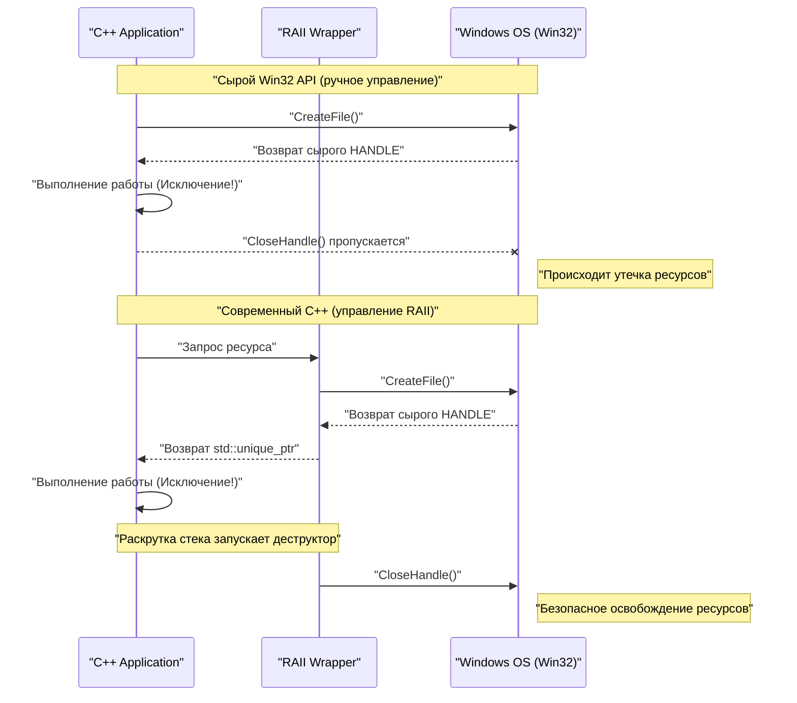
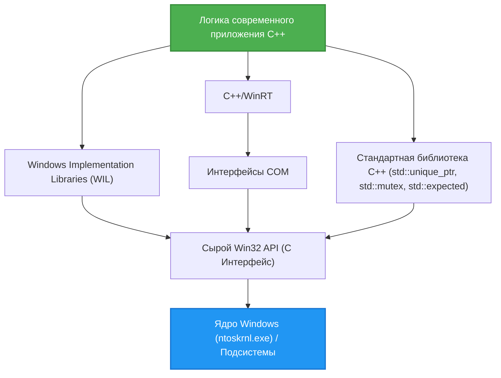

## 1. Введение: Разрыв между Win32 API на базе C и современным C++

**Windows API (или Win32 API)**, являющийся основой ОС Windows — это огромный интерфейс на языке C, который непрерывно передается со времен Windows NT и Windows 95 1990-х годов. Даже сегодня при разработке нативных приложений для Windows для доступа к основным функциям ОС (управление процессами, файловый ввод-вывод, синхронизация потоков, управление окнами и т. д.) в конечном итоге необходимо вызывать этот Win32 API.

Однако Win32 API разрабатывался исключительно для языка C и не предполагает использования продвинутых языковых возможностей **современного C++ (Modern C++)** (обработка исключений, автоматическое управление ресурсами с помощью RAII, семантика перемещения, типобезопасные перечисления, умные указатели и т. д.). В результате, если напрямую смешать сырой Win32 API с кодом C++, возникают следующие проблемы:

*   **Ручное управление ресурсами:** `HANDLE`, полученный через `CreateFile` или `CreateEvent`, обязательно должен быть освобожден с помощью `CloseHandle`.
*   **Отсутствие безопасности исключений:** Если генерируется исключение C++, а соответствующий код для вызова `CloseHandle` не предусмотрен, легко происходит утечка ресурсов.
*   **Непоследовательное представление ошибок:** Один API возвращает `BOOL`, и в случае сбоя необходимо вызывать `GetLastError()`. Другой API возвращает `HRESULT`, а третий (например, GDI) возвращает `NULL`.
*   **Отсутствие типобезопасности:** Макросы `HANDLE`, `HWND`, `HDC` и т. д. часто разворачиваются просто как `void*`, из-за чего строгая проверка типов компилятором работает плохо.

В этой статье мы подробно рассмотрим методы обхода этих ловушек "устаревших C-интерфейсов" и использование функций современного C++ (C++11/14/17/20/23) для **безопасной (Safe) и современной (Modern) работы с Win32 API**.

---

## 2. Опасности сырого Win32 API: утечки ресурсов и ловушки обработки ошибок

Давайте сначала посмотрим на типичный код, вызывающий Win32 API в старом стиле C. На первый взгляд он выглядит нормально, но с точки зрения современного C++ он содержит критическую уязвимость.

```cpp
#include <windows.h>
#include <iostream>
#include <vector>

void ProcessFileLegacy(const std::wstring& filename) {
    // 1. Получение дескриптора файла
    HANDLE hFile = ::CreateFileW(
        filename.c_str(),
        GENERIC_READ,
        FILE_SHARE_READ,
        NULL,
        OPEN_EXISTING,
        FILE_ATTRIBUTE_NORMAL,
        NULL
    );

    if (hFile == INVALID_HANDLE_VALUE) {
        std::cerr << "Failed to open file. Error: " << ::GetLastError() << std::endl;
        return;
    }

    // 2. Получение размера файла
    LARGE_INTEGER fileSize;
    if (!::GetFileSizeEx(hFile, &fileSize)) {
        ::CloseHandle(hFile); // Ручное освобождение при ошибке
        return;
    }

    // 3. Выделение памяти и чтение
    std::vector<char> buffer(fileSize.QuadPart);
    DWORD bytesRead = 0;
    
    if (!::ReadFile(hFile, buffer.data(), buffer.size(), &bytesRead, NULL)) {
        ::CloseHandle(hFile); // Ручное освобождение при ошибке
        return;
    }

    // --- Предположим, что здесь есть код, который вызывает исключение ---
    // Пример: функция, анализирующая содержимое буфера, генерирует std::runtime_error
    // ParseBuffer(buffer); // Если вылетит исключение, CloseHandle ниже не вызовется и произойдет утечка!

    // 4. Ручное освобождение ресурсов
    ::CloseHandle(hFile);
}
```

### В чем проблема этого кода?

1.  **Дублирование кода и громоздкость:** При каждом раннем возврате (`return`) необходимо писать `::CloseHandle(hFile);`, что нарушает принцип DRY (Don't Repeat Yourself).
2.  **Полное отсутствие безопасности исключений (Exception Unsafe):** В C++ при сбое выделения памяти для `std::vector` (`std::bad_alloc`) или если другая функция генерирует исключение, происходит принудительный выход из функции. В этот момент `CloseHandle` в конце не выполняется, поэтому **дескриптор файла будет потерян навсегда** (что может привести к серьезным ошибкам, таким как блокировка файла до завершения процесса).

---

## 3. Математическая модель безопасности исключений и управления ресурсами

Давайте математически (вероятностно) смоделируем, насколько хрупким является ручное управление ресурсами.

Предположим, в функции имеется $N$ выделений ресурсов (или точек раннего возврата, точек возникновения исключений). Пусть на каждом шаге $i$ вероятность возникновения ошибки или исключения и выхода из функции равна $P(\text{Exit}_i)$. Рассмотрим вероятность того, что не удастся вручную правильно написать код очистки (например, `CloseHandle`) на всех путях выхода, и произойдет утечка ресурса.

Если мы обозначим вероятность упущения из-за невнимательности человека или неожиданного выхода из-за неизвестного исключения (вероятность утечки на один путь) как $p$, то вероятность $P(\text{Leak})$ возникновения хотя бы одной утечки ресурса во всей программе выражается следующей формулой:

$$ P(\text{Leak}) = 1 - (1 - p)^N $$

Например, если $p = 0.05$ (вероятность ошибки при обработке исключений или очистке составляет 5%), а $N = 20$ (в сложной функции есть 20 точек возврата ошибок или исключений):

$$ P(\text{Leak}) = 1 - (1 - 0.05)^{20} \approx 1 - 0.358 = 0.642 $$

Поразительно, но **вероятность того, что где-то скрывается ошибка утечки ресурса, составляет около 64,2%**. По мере того, как масштаб программного обеспечения растет и $N \to \infty$, $P(\text{Leak}) \to 1$, и система неизбежно выходит из строя.

Единственным рациональным средством противостоять этой математической реальности является C++ **RAII (Resource Acquisition Is Initialization)**.

---

## 4. Основы RAII (Resource Acquisition Is Initialization)

RAII — это концепция, предложенная Бьёрном Страуструпом, создателем C++. Ее принцип предельно прост и мощен.

1.  Получение ресурса (Acquisition) выполняется в **конструкторе объекта (Initialization)**.
2.  Освобождение ресурса выполняется в **деструкторе** объекта.

Согласно спецификации языка C++, при выходе из области видимости (будь то нормальный `return` или во время раскрутки стека из-за исключения), деструктор объекта, выделенного на стеке, будет вызван **гарантированно и автоматически**.

Таким образом, вероятность человеческой ошибки $p$ в предыдущей формуле может быть математически сведена к **$0$**.

### Визуализация жизненного цикла объекта

Следующая диаграмма последовательности показывает разницу в жизненном цикле между ручным управлением с использованием сырого API и автоматическим управлением с использованием RAII.



---

## 5. Метод безопасной обертки `HANDLE` с использованием `std::unique_ptr`

Начиная с C++11, стандартная библиотека предоставляет `std::unique_ptr`, который является универсальной оберткой RAII. Его можно применять не только для простого управления памятью (`new/delete`), но и для управления любыми ресурсами, указав **кастомный удалитель (Custom Deleter)**.

Базовый удалитель для управления Win32 `HANDLE` с помощью `std::unique_ptr` можно написать следующим образом:

```cpp
#include <windows.h>
#include <memory>

// Пользовательский удалитель для HANDLE
struct handle_deleter {
    // Указываем тип указателя, который std::unique_ptr будет обрабатывать внутри
    using pointer = HANDLE; 

    void operator()(HANDLE handle) const noexcept {
        if (handle != nullptr && handle != INVALID_HANDLE_VALUE) {
            ::CloseHandle(handle);
        }
    }
};

// Псевдоним типа для безопасного дескриптора
using unique_handle = std::unique_ptr<void, handle_deleter>;
```

Используя этот `unique_handle`, опасный код, показанный ранее, перерождается в следующее:

```cpp
void ProcessFileModern(const std::wstring& filename) {
    // Передаем право собственности объекту RAII сразу после получения
    unique_handle hFile(::CreateFileW(
        filename.c_str(), GENERIC_READ, FILE_SHARE_READ, NULL,
        OPEN_EXISTING, FILE_ATTRIBUTE_NORMAL, NULL
    ));

    // Проверка на ошибки (обработка INVALID_HANDLE_VALUE будет описана позже)
    if (hFile.get() == INVALID_HANDLE_VALUE) {
        throw std::runtime_error("Failed to open file");
    }

    LARGE_INTEGER fileSize;
    if (!::GetFileSizeEx(hFile.get(), &fileSize)) {
        throw std::runtime_error("Failed to get file size");
    }

    std::vector<char> buffer(fileSize.QuadPart);
    DWORD bytesRead = 0;
    
    if (!::ReadFile(hFile.get(), buffer.data(), buffer.size(), &bytesRead, NULL)) {
        throw std::runtime_error("Failed to read file");
    }

    // Даже если здесь возникнет исключение или произойдет ранний возврат,
    // деструктор unique_handle вызовет CloseHandle в момент выхода из функции!
}
```

---

## 6. Глубокое погружение: Решение проблемы `INVALID_HANDLE_VALUE` и `nullptr`

Одна из особенностей, которая больше всего беспокоит C++ программистов при работе с Win32 API — это **непоследовательное представление недействительных дескрипторов**.

*   `CreateEvent`, `CreateThread` и др.: При сбое возвращают `NULL` (`nullptr`).
*   `CreateFile` и др.: При сбое возвращают `INVALID_HANDLE_VALUE` (по значению `(HANDLE)-1`).

Стандартный `std::unique_ptr` рассматривает случай, когда внутренний указатель равен `nullptr`, как особый случай "пустого состояния (состояние без владения ресурсом)". Другими словами, логическая проверка, такая как `if (ptr)`, возвращает `false` только для `nullptr`.

Однако, если `CreateFile` завершается неудачно и возвращает `INVALID_HANDLE_VALUE`, `std::unique_ptr` ошибочно воспринимает его как "действительный ненулевой указатель".

Чтобы элегантно решить эту проблему, мы воспользуемся продвинутыми возможностями `std::unique_ptr` в C++ и определим **кастомный тип указателя**.

```cpp
#include <windows.h>
#include <memory>

struct win32_handle_traits {
    // Определение кастомного типа указателя
    class pointer {
        HANDLE m_handle;
    public:
        // Хотя можно спроектировать так, чтобы INVALID_HANDLE_VALUE был начальным значением
        // при создании по умолчанию или присвоении nullptr, для повышения универсальности 
        // и nullptr, и INVALID_HANDLE_VALUE рассматриваются как недействительные состояния.
        pointer() noexcept : m_handle(nullptr) {}
        pointer(std::nullptr_t) noexcept : m_handle(nullptr) {}
        pointer(HANDLE h) noexcept : m_handle(h) {}
        
        // Перегрузка operator bool для отклонения обоих недействительных значений Win32
        explicit operator bool() const noexcept {
            return m_handle != nullptr && m_handle != INVALID_HANDLE_VALUE;
        }
        
        operator HANDLE() const noexcept { return m_handle; }
        
        friend bool operator==(pointer a, pointer b) noexcept { return a.m_handle == b.m_handle; }
        friend bool operator!=(pointer a, pointer b) noexcept { return a.m_handle != b.m_handle; }
    };
    
    void operator()(pointer p) const noexcept {
        if (p) { // Вызывается operator bool
            ::CloseHandle(p);
        }
    }
};

using safe_win32_handle = std::unique_ptr<void, win32_handle_traits>;
```

Благодаря этой реализации вы можете написать интуитивно понятный и безопасный код следующим образом:

```cpp
safe_win32_handle hFile(::CreateFileW(...));
if (!hFile) {
    // Здесь можно перехватить как nullptr, так и INVALID_HANDLE_VALUE!
    throw std::system_error(::GetLastError(), std::system_category(), "CreateFile failed");
}
```

---

## 7. Продвинутое управление RAII для объектов GDI (`HDC`, `HBITMAP`)

Еще одним узким местом в Win32 является управление ресурсами GDI (Graphics Device Interface).
Объекты GDI (перья, кисти, шрифты, растровые изображения и т.д.) требуют очень громоздкого подхода: после создания они должны быть выбраны в контекст устройства (`HDC`) с помощью `SelectObject`, а после использования необходимо **восстановить исходный объект, снова вызвав SelectObject, и только затем уничтожить объект с помощью DeleteObject**.

Обертка для решения этой проблемы с помощью RAII выглядит следующим образом:

```cpp
// Удалитель для объектов GDI
struct gdi_deleter {
    using pointer = HGDIOBJ;
    void operator()(HGDIOBJ obj) const noexcept {
        if (obj != nullptr) {
            ::DeleteObject(obj);
        }
    }
};

using unique_gdi_obj = std::unique_ptr<void, gdi_deleter>;

// Обертка RAII для SelectObject (восстанавливает исходный объект при выходе из области видимости)
class gdi_selector {
    HDC m_hdc;
    HGDIOBJ m_oldObj;

public:
    gdi_selector(HDC hdc, HGDIOBJ newObj) : m_hdc(hdc) {
        // Выбираем новый объект и сохраняем старый
        m_oldObj = ::SelectObject(m_hdc, newObj);
    }

    ~gdi_selector() {
        if (m_oldObj != nullptr && m_oldObj != HGDI_ERROR) {
            // Автоматическое восстановление при выходе из области видимости
            ::SelectObject(m_hdc, m_oldObj);
        }
    }

    // Запрет копирования
    gdi_selector(const gdi_selector&) = delete;
    gdi_selector& operator=(const gdi_selector&) = delete;
};
```

### Пример использования

```cpp
void DrawMyGraphics(HDC hdc) {
    // Создаем перо (управление RAII)
    unique_gdi_obj hPen(::CreatePen(PS_SOLID, 1, RGB(255, 0, 0)));
    
    {
        // Выбираем перо в HDC (управление областью видимости)
        gdi_selector penSelect(hdc, hPen.get());
        
        // Процесс рисования...
        ::MoveToEx(hdc, 0, 0, NULL);
        ::LineTo(hdc, 100, 100);
        
        // При выходе из области видимости деструктор penSelect восстановит старое перо с помощью SelectObject
    }
    
    // При выходе из функции деструктор hPen вызовет DeleteObject
}
```
Как видите, управление ресурсами с вложенными жизненными циклами — это область, где RAII блистает.

---

## 8. Модернизация объектов синхронизации потоков

В Win32 существуют примитивы синхронизации потоков, такие как `CRITICAL_SECTION` или `SRWLOCK`. Использование ручного вызова `EnterCriticalSection` / `LeaveCriticalSection` для них также категорически запрещено с точки зрения безопасности исключений.

`std::mutex` и `std::lock_guard` в C++11 очень удобны, но бывают ситуации, когда хочется напрямую использовать быстрые механизмы блокировки, родные для ОС (особенно SRWLock, который очень легок).
Стандартный `std::lock_guard` принимает любой тип, имеющий функции-члены `lock()` и `unlock()` (похоже на утиную типизацию в шаблонах). Мы этим воспользуемся.

```cpp
class win32_srwlock {
    SRWLOCK m_lock;
public:
    win32_srwlock() noexcept {
        ::InitializeSRWLock(&m_lock);
    }
    
    // Интерфейс, требуемый для std::lock_guard
    void lock() noexcept {
        ::AcquireSRWLockExclusive(&m_lock);
    }
    void unlock() noexcept {
        ::ReleaseSRWLockExclusive(&m_lock);
    }
    
    // Запрет копирования и перемещения
    win32_srwlock(const win32_srwlock&) = delete;
    win32_srwlock& operator=(const win32_srwlock&) = delete;
};
```

Это позволяет работать с блокировками Win32 полностью в стиле стандартной библиотеки C++.

```cpp
win32_srwlock g_myLock;
int g_sharedData = 0;

void UpdateData() {
    // Получение блокировки с безопасностью исключений
    std::lock_guard<win32_srwlock> lock(g_myLock);
    
    g_sharedData++;
    if (g_sharedData > 100) {
        throw std::runtime_error("Overflow"); // Даже если вылетит исключение, блокировка освободится безопасно!
    }
}
```

---

## 9. Интеграция со стандартной библиотекой C++: `std::system_error` и `HRESULT`

Два основных типа ошибок в Win32 — это `GetLastError()` (тип DWORD) и `HRESULT`, используемый в COM и DirectX. Преобразование их в исключения C++ `std::system_error` позволяет модернизировать обработку ошибок.

При выбросе `GetLastError()`, реализация MSVC (Visual C++) через `std::system_category()` обеспечивает сопоставление между кодами ошибок Win32 и сообщениями.

```cpp
inline void throw_if_win32_error(BOOL result, const char* msg = "Win32 API failed") {
    if (!result) {
        DWORD err = ::GetLastError();
        // std::system_category внутренне вызывает API FormatMessage и генерирует строку ошибки
        throw std::system_error(err, std::system_category(), msg);
    }
}
```

Что касается `HRESULT`, вы можете либо создать специальную категорию ошибок, либо использовать стандартный для Windows `_com_error`.

---

## 10. Современная обработка ошибок с использованием `std::expected` (C++23)

В C++23 был введен тип `std::expected`, эквивалентный типу `Result` в Rust. Это лучший способ модернизировать возвращаемые значения Win32 в проектах, которые не одобряют использование исключений (из-за производительности или архитектуры, где ошибки происходят часто).

```cpp
#include <expected>
#include <string>

// В случае успеха возвращает unique_handle, в случае неудачи — DWORD (код ошибки)
std::expected<safe_win32_handle, DWORD> OpenFileModern(const std::wstring& path) {
    safe_win32_handle h(::CreateFileW(
        path.c_str(), GENERIC_READ, 0, nullptr, OPEN_EXISTING, 0, nullptr));
        
    if (!h) {
        return std::unexpected(::GetLastError());
    }
    return std::move(h); // В случае успеха перемещаем дескриптор для возврата
}

void Usage() {
    auto result = OpenFileModern(L"C:\\test.txt");
    if (result) {
        // Обработка успеха
        safe_win32_handle& hFile = *result;
        // ...
    } else {
        // Обработка неудачи
        DWORD err = result.error();
        std::cerr << "Error code: " << err << std::endl;
    }
}
```

Таким образом, использование C++23 позволяет совместить преимущества обработки ошибок на основе возвращаемых значений и RAII.

---

## 11. Ответ Microsoft (1): Использование WIL (Windows Implementation Libraries)

До сих пор мы рассматривали самописные обертки, но на самом деле Microsoft сама серьезно относится к этой проблеме и выпустила официальную библиотеку, состоящую только из заголовков, для современного C++ — **WIL (Windows Implementation Libraries)** с открытым исходным кодом (доступна на GitHub).

Использование WIL предоставляет все обертки, которые мы с трудом создавали сами, прямо из коробки.

```cpp
#include <wil/resource.h>
#include <wil/result.h>

void ProcessWithWIL() {
    // wil::unique_handle поддерживает как INVALID_HANDLE_VALUE, так и NULL
    wil::unique_handle hFile;
    
    // Макрос THROW_IF_WIN32_BOOL_FALSE автоматизирует проверку ошибок и генерацию исключений
    THROW_IF_WIN32_BOOL_FALSE(
        ::CreateFileW(L"test.txt", GENERIC_READ, 0, nullptr, OPEN_EXISTING, 0, nullptr),
        hFile.put() // Помощник для приема выходных указателей, специфичный для WIL
    );
    
    // Также доступны многочисленные обертки управления памятью, такие как wil::unique_cotaskmem_string
}
```

Истинная мощь WIL заключается в мощном шаблоне `wil::unique_any`, который позволяет генерировать обертки RAII не только для файловых дескрипторов, но и для ключей реестра, объектов GDI, локальной памяти и любых других ресурсов Win32 всего несколькими строками определений.

---

## 12. Ответ Microsoft (2): Абстракция COM с помощью C++/WinRT

Многие Win32 API (особенно расширения оболочки и DirectX) предоставляются через интерфейсы COM (Component Object Model) на базе C.
То, что в настоящее время официально рекомендует Microsoft, развивая классические `CComPtr` (ATL) и `ComPtr` (WRL) — это **C++/WinRT**.

C++/WinRT может крайне элегантно работать не только с Windows Runtime (WinRT), но и с традиционными COM-объектами.

```cpp
#include <winrt/base.h>

void ComExample() {
    // Инициализация COM (с RAII)
    winrt::init_apartment();

    // Безопасное управление COM-интерфейсом, наследующим IUnknown, с помощью winrt::com_ptr
    winrt::com_ptr<IDXGIFactory> factory;
    winrt::check_hresult(
        ::CreateDXGIFactory(__uuidof(IDXGIFactory), factory.put_void())
    );
    
    // Нет никакой необходимости вызывать AddRef или Release вручную
}
```

---

## 13. Визуализация архитектуры и жизненного цикла

Давайте систематизируем слоистую структуру в разработке современных C++ приложений для Windows.



Логика приложения никогда не должна обращаться напрямую к сырому Win32 API (Уровень E). Безопасность памяти значительно повышается за счет архитектуры, в которой доступ осуществляется исключительно через слои абстракции: стандартную библиотеку, WIL или C++/WinRT.

---

## 14. Анализ производительности абстракций с нулевой стоимостью

Возможно, некоторые зададутся вопросом: "Не будет ли использование оберток RAII или умных указателей работать медленнее, чем сырые API на C?".
Давайте рассмотрим математическую модель затрат на производительность.

Общее время выполнения $T_{\text{total}}$ можно разложить следующим образом:

$$ T_{\text{total}} = T_{\text{syscall}} + T_{\text{wrapper}} + T_{\text{cleanup}} $$

*   $T_{\text{syscall}}$: Время, затрачиваемое на переходы в режим ядра и фактическую обработку внутри Win32 API. Обычно измеряется миллисекундами или микросекундами.
*   $T_{\text{wrapper}}$: Время, затрачиваемое на создание классов оберток, таких как `std::unique_ptr` или WIL.
*   $T_{\text{cleanup}}$: Время, затрачиваемое на вызов деструкторов.

Компиляторы C++ (MSVC, Clang, GCC) превосходно справляются с оптимизацией встраивания (Inlining). Конструкторы и деструкторы `std::unique_ptr`, а также перегруженные операторы `operator*` и `operator bool` встраиваются `inline` и компилируются в тот же самый машинный код, что и прямые операции с сырыми указателями в памяти.

То есть **$T_{\text{wrapper}} \approx 0$**. Это является доказательством величайшей философии C++ — **Zero-cost Abstraction (Абстракции с нулевой стоимостью)**. Даже получая безопасность, накладные расходы во время выполнения буквально равны нулю.

---

## 15. Заключение: Будущее безопасного программирования под Windows

Win32 API — это старое доброе наследие, спроектированное в парадигме языка C по историческим причинам. Однако вызывающий его язык C++ продолжает развиваться, и теперь на нем можно писать чрезвычайно безопасный и выразительный код.

Давайте вспомним важные моменты, рассмотренные в этой статье:

1.  **Не пишите ручные `CloseHandle` или `DeleteObject`.** Инкапсулируйте все в контейнеры RAII, такие как `std::unique_ptr`.
2.  **Поймите ловушку `INVALID_HANDLE_VALUE`.** Реализуйте специальный кастомный удалитель/кастомный типаж указателя или используйте `wil::unique_handle` из WIL.
3.  **Модернизируйте обработку ошибок.** Бросайте `GetLastError()` или `HRESULT` как исключения `std::system_error` или используйте `std::expected` из C++23 для типобезопасной обработки.
4.  **Стойте на плечах гигантов.** Активно внедряйте официальные инструменты Microsoft, такие как WIL или C++/WinRT, чтобы не изобретать велосипед.

В современной разработке на C++, переносить сырые указатели или дескрипторы в открытом виде — это все равно что ехать по шоссе без пристегнутого ремня безопасности. В полной мере используйте мощную систему типов и RAII, предоставляемые C++, и наслаждайтесь созданием безопасных и надежных приложений для Windows.
