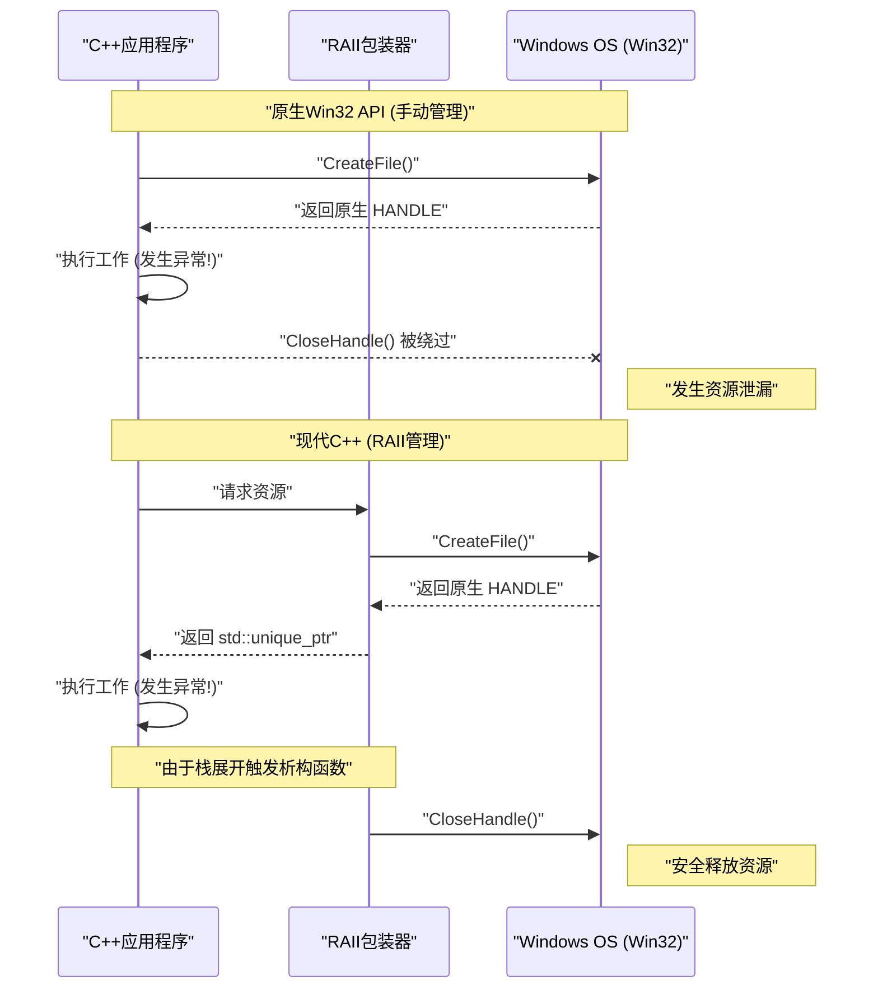
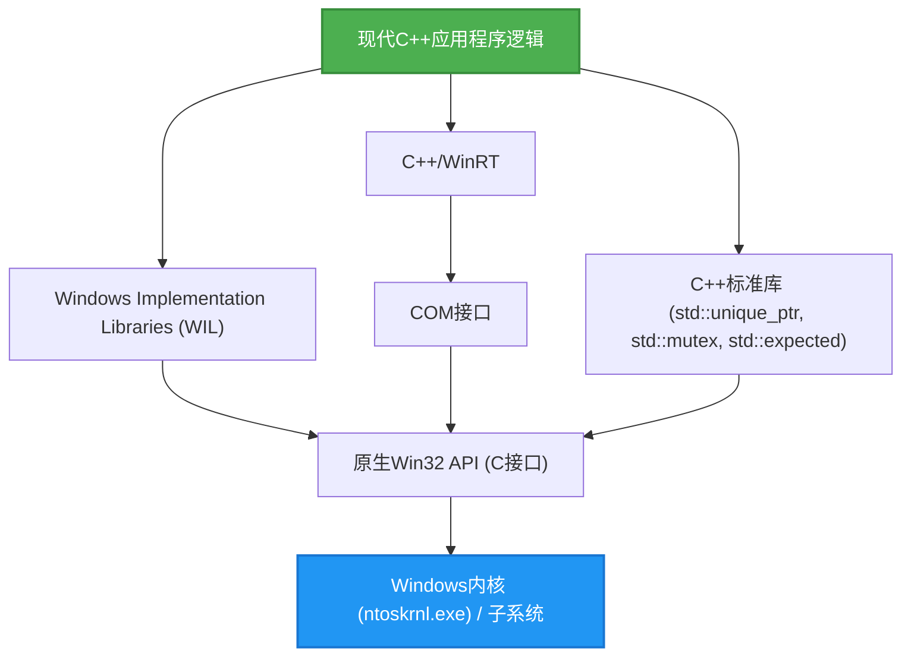

## 1. 引言：基于C语言的Win32 API与现代C++之间的鸿沟

作为Windows OS基础的 **Windows API（通称Win32 API）**，是自1990年代的Windows NT和Windows 95时代以来一脉相承的庞大C语言接口。即使在今天，在开发Windows原生应用程序时，为了访问操作系统的核心功能（如进程管理、文件I/O、线程同步、窗口控制等），最终仍需要调用这个Win32 API。

然而，Win32 API是纯粹为C语言设计的，并未考虑到**现代C++（Modern C++）**所具备的高级语言特性（如异常处理、基于RAII的自动资源管理、移动语义、类型安全的枚举类型、智能指针等）。因此，如果将原生的Win32 API直接混入C++代码中，就会产生以下问题：

*   **手动资源管理：** 必须使用 `CloseHandle` 来释放由 `CreateFile` 或 `CreateEvent` 获取的 `HANDLE`。
*   **缺乏异常安全性：** 当C++抛出异常时，如果没有编写正确调用 `CloseHandle` 的处理代码，很容易发生资源泄漏。
*   **不一致的错误表达：** 某些API返回 `BOOL`，失败时需要调用 `GetLastError()`。其他API可能返回 `HRESULT`，还有一些API（如GDI）则返回 `NULL`。
*   **类型安全缺失：** `HANDLE`、`HWND`、`HDC` 等类型在宏展开后往往只不过是 `void*`，很难发挥编译器严格的类型检查功能。

本文将极其详细地探讨如何避开这些“传统C接口”的陷阱，并利用现代C++（C++11/14/17/20/23）的特性，**安全且现代化地处理Win32 API**。

---

## 2. 原生Win32 API的危险性：资源泄漏与错误处理陷阱

首先，让我们来看一段以传统C风格调用Win32 API的常见代码。乍看之下似乎没有问题，但从现代C++的角度来看，它存在着致命的脆弱性。

```cpp
#include <windows.h>
#include <iostream>
#include <vector>

void ProcessFileLegacy(const std::wstring& filename) {
    // 1. 获取文件句柄
    HANDLE hFile = ::CreateFileW(
        filename.c_str(),
        GENERIC_READ,
        FILE_SHARE_READ,
        NULL,
        OPEN_EXISTING,
        FILE_ATTRIBUTE_NORMAL,
        NULL
    );

    if (hFile == INVALID_HANDLE_VALUE) {
        std::cerr << "Failed to open file. Error: " << ::GetLastError() << std::endl;
        return;
    }

    // 2. 获取文件大小
    LARGE_INTEGER fileSize;
    if (!::GetFileSizeEx(hFile, &fileSize)) {
        ::CloseHandle(hFile); // 发生错误时手动释放
        return;
    }

    // 3. 分配内存并读取
    std::vector<char> buffer(fileSize.QuadPart);
    DWORD bytesRead = 0;
    
    if (!::ReadFile(hFile, buffer.data(), buffer.size(), &bytesRead, NULL)) {
        ::CloseHandle(hFile); // 发生错误时手动释放
        return;
    }

    // --- 假设这里有抛出异常的处理 ---
    // 例如：解析 buffer 内容的函数抛出 std::runtime_error
    // ParseBuffer(buffer); // 如果抛出异常，下方的 CloseHandle 将不会被调用，从而导致泄漏！

    // 4. 手动释放资源
    ::CloseHandle(hFile);
}
```

### 这段代码有什么问题？

1.  **代码重复且繁琐：** 每次提前返回（`return`）时都必须写 `::CloseHandle(hFile);`，违反了 DRY (Don't Repeat Yourself) 原则。
2.  **完全缺乏异常安全性 (Exception Unsafe)：** 在C++中，如果 `std::vector` 内存分配失败（`std::bad_alloc`）或其他函数抛出异常，程序将强制退出该函数。此时，末尾的 `CloseHandle` 不会被执行，从而导致**文件句柄永久泄漏**（引发严重错误，例如文件会被一直锁定直到进程结束）。

---

## 3. 异常安全与资源管理的数学模型

这里，让我们用数学（概率论）模型来看看手动资源管理是多么脆弱。

假设函数内有 $N$ 个资源分配（或者提前返回点、异常抛出点）。在每个步骤 $i$ 中，发生错误或异常导致退出函数的概率记为 $P(\text{Exit}_i)$。考虑由于无法在所有退出路径中手动正确编写清理代码（如 `CloseHandle`）而导致资源泄漏的概率。

假设由于人为疏忽导致遗漏，或由未知异常导致意外退出的概率（每条路径的泄漏概率）为 $p$，那么整个程序中发生至少一次资源泄漏的概率 $P(\text{Leak})$ 可以用以下公式表示：

$$ P(\text{Leak}) = 1 - (1 - p)^N $$

例如，当 $p = 0.05$（有5%的概率在异常处理或清理代码中出错），且 $N = 20$（一个复杂的函数中有20处错误返回或异常点）时：

$$ P(\text{Leak}) = 1 - (1 - 0.05)^{20} \approx 1 - 0.358 = 0.642 $$

令人惊讶的是，**有大约 64.2% 的概率会在某处潜伏着资源泄漏的Bug**。随着软件规模变大，$N \to \infty$，$P(\text{Leak}) \to 1$，系统必然走向崩溃。

要对抗这种数学现实，唯一合理的手段就是C++的 **RAII (Resource Acquisition Is Initialization，资源获取即初始化)**。

---

## 4. RAII (Resource Acquisition Is Initialization) 基础

RAII 是由C++之父 Bjarne Stroustrup 提出的概念。其原则极其简单且强大。

1.  将资源获取（Acquisition）放在对象的**构造函数（Initialization）**中进行。
2.  将资源释放放在对象的**析构函数**中进行。

根据C++的语言规范，当离开作用域时（无论是通过正常的 `return` 还是由于异常导致的栈展开），分配在栈上的对象的析构函数都会被**确切且自动地**调用。

通过这种方式，可以在数学上将前述公式中的人为失误概率 $p$ 降为 **$0$**。

### 对象生命周期的可视化

下面的时序图展示了使用原生API进行手动管理与使用RAII进行自动管理的生命周期差异。



---

## 5. 使用 `std::unique_ptr` 安全封装 `HANDLE` 的方法

从 C++11 开始，标准库提供了通用的 RAII 包装器 `std::unique_ptr`。它不仅可以用于简单的内存（`new/delete`）管理，还可以通过指定**自定义删除器 (Custom Deleter)** 应用于任何资源的管理。

要使用 `std::unique_ptr` 管理 Win32 的 `HANDLE`，其基本的删除器可以这样编写：

```cpp
#include <windows.h>
#include <memory>

// HANDLE用的自定义删除器
struct handle_deleter {
    // 指定 std::unique_ptr 内部处理的指针类型
    using pointer = HANDLE; 

    void operator()(HANDLE handle) const noexcept {
        if (handle != nullptr && handle != INVALID_HANDLE_VALUE) {
            ::CloseHandle(handle);
        }
    }
};

// 安全句柄的类型别名
using unique_handle = std::unique_ptr<void, handle_deleter>;
```

使用这个 `unique_handle`，前面那段危险的代码就能脱胎换骨如下：

```cpp
void ProcessFileModern(const std::wstring& filename) {
    // 在获取之后立即将所有权交给 RAII 对象
    unique_handle hFile(::CreateFileW(
        filename.c_str(), GENERIC_READ, FILE_SHARE_READ, NULL,
        OPEN_EXISTING, FILE_ATTRIBUTE_NORMAL, NULL
    ));

    // 错误检查 (关于处理 INVALID_HANDLE_VALUE 将在下文提及)
    if (hFile.get() == INVALID_HANDLE_VALUE) {
        throw std::runtime_error("Failed to open file");
    }

    LARGE_INTEGER fileSize;
    if (!::GetFileSizeEx(hFile.get(), &fileSize)) {
        throw std::runtime_error("Failed to get file size");
    }

    std::vector<char> buffer(fileSize.QuadPart);
    DWORD bytesRead = 0;
    
    if (!::ReadFile(hFile.get(), buffer.data(), buffer.size(), &bytesRead, NULL)) {
        throw std::runtime_error("Failed to read file");
    }

    // 无论这里抛出异常，还是提前返回，
    // 在离开函数的瞬间，unique_handle 的析构函数都会调用 CloseHandle！
}
```

---

## 6. 深入探究：解决 `INVALID_HANDLE_VALUE` 与 `nullptr` 的问题

在处理Win32 API时，最令C++程序员头疼的规范之一就是**无效句柄的表示不一致**。

*   `CreateEvent`、`CreateThread` 等：失败时返回 `NULL` (`nullptr`)。
*   `CreateFile` 等：失败时返回 `INVALID_HANDLE_VALUE`（其值为 `(HANDLE)-1`）。

标准的 `std::unique_ptr` 会将内部指针为 `nullptr` 的情况作为“空状态（未拥有资源的状态）”进行特殊处理。也就是说，像 `if (ptr)` 这样的布尔值判断，仅针对 `nullptr` 时才会返回 `false`。

然而，当 `CreateFile` 失败并返回 `INVALID_HANDLE_VALUE` 时，`std::unique_ptr` 会将其误认为是一个“有效的非NULL指针”。

为了优雅地解决这个问题，可以利用 C++ 中 `std::unique_ptr` 的高级特性，定义一个**自定义指针类型**。

```cpp
#include <windows.h>
#include <memory>

struct win32_handle_traits {
    // 自定义指针类型的定义
    class pointer {
        HANDLE m_handle;
    public:
        // 虽然在默认构造或赋值为 nullptr 时可以设计成以 INVALID_HANDLE_VALUE 作为初始值，
        // 但为了提高通用性，我们将 nullptr 和 INVALID_HANDLE_VALUE 均视为无效状态。
        pointer() noexcept : m_handle(nullptr) {}
        pointer(std::nullptr_t) noexcept : m_handle(nullptr) {}
        pointer(HANDLE h) noexcept : m_handle(h) {}
        
        // 重载 operator bool，拦截 Win32 中的这两种无效值
        explicit operator bool() const noexcept {
            return m_handle != nullptr && m_handle != INVALID_HANDLE_VALUE;
        }
        
        operator HANDLE() const noexcept { return m_handle; }
        
        friend bool operator==(pointer a, pointer b) noexcept { return a.m_handle == b.m_handle; }
        friend bool operator!=(pointer a, pointer b) noexcept { return a.m_handle != b.m_handle; }
    };
    
    void operator()(pointer p) const noexcept {
        if (p) { // 会调用 operator bool
            ::CloseHandle(p);
        }
    }
};

using safe_win32_handle = std::unique_ptr<void, win32_handle_traits>;
```

通过这种实现，便可以写出如下直观且安全的代码：

```cpp
safe_win32_handle hFile(::CreateFileW(...));
if (!hFile) {
    // nullptr 和 INVALID_HANDLE_VALUE 都可以在这里被捕获！
    throw std::system_error(::GetLastError(), std::system_category(), "CreateFile failed");
}
```

---

## 7. GDI 对象（`HDC`、`HBITMAP`）的高级 RAII 管理

Win32 另一个棘手之处是 GDI (Graphics Device Interface) 的资源管理。
GDI对象（画笔、画刷、字体、位图等）在创建后需要使用 `SelectObject` 选入到设备上下文（`HDC`）中使用，使用完毕后**必须再次使用 SelectObject 恢复原来的对象，然后才能用 DeleteObject 进行销毁**。这一套做法非常繁琐。

为了使用 RAII 解决这个问题，我们可以编写如下的包装器：

```cpp
// GDI对象删除用的删除器
struct gdi_deleter {
    using pointer = HGDIOBJ;
    void operator()(HGDIOBJ obj) const noexcept {
        if (obj != nullptr) {
            ::DeleteObject(obj);
        }
    }
};

using unique_gdi_obj = std::unique_ptr<void, gdi_deleter>;

// SelectObject的RAII包装器 (离开作用域时恢复原对象)
class gdi_selector {
    HDC m_hdc;
    HGDIOBJ m_oldObj;

public:
    gdi_selector(HDC hdc, HGDIOBJ newObj) : m_hdc(hdc) {
        // 选择新对象，并保存旧对象
        m_oldObj = ::SelectObject(m_hdc, newObj);
    }

    ~gdi_selector() {
        if (m_oldObj != nullptr && m_oldObj != HGDI_ERROR) {
            // 离开作用域时自动恢复
            ::SelectObject(m_hdc, m_oldObj);
        }
    }

    // 禁止拷贝
    gdi_selector(const gdi_selector&) = delete;
    gdi_selector& operator=(const gdi_selector&) = delete;
};
```

### 使用示例

```cpp
void DrawMyGraphics(HDC hdc) {
    // 创建画笔 (RAII管理)
    unique_gdi_obj hPen(::CreatePen(PS_SOLID, 1, RGB(255, 0, 0)));
    
    {
        // 将画笔选入HDC (作用域管理)
        gdi_selector penSelect(hdc, hPen.get());
        
        // 绘制操作...
        ::MoveToEx(hdc, 0, 0, NULL);
        ::LineTo(hdc, 100, 100);
        
        // 离开作用域时，penSelect 的析构函数会通过 SelectObject 恢复旧的画笔
    }
    
    // 离开函数时，hPen 的析构函数会调用 DeleteObject
}
```
像这样生命周期嵌套的资源管理，正是 RAII 能够大显身手的地方。

---

## 8. 线程同步对象的现代化

Win32 中存在诸如 `CRITICAL_SECTION` 和 `SRWLOCK` 这样的线程同步原语。从异常安全的角度来看，手动调用 `EnterCriticalSection` / `LeaveCriticalSection` 也是不规范的。

虽然 C++11 的 `std::mutex` 和 `std::lock_guard` 非常方便，但在有些场合，我们可能希望直接使用系统原生的高速锁机制（尤其是 SRWLock 非常轻量）。
标准的 `std::lock_guard` 能够接受任何拥有 `lock()` 和 `unlock()` 成员函数的类型（这是一种类似于鸭子类型的模板规范）。我们可以利用这一点。

```cpp
class win32_srwlock {
    SRWLOCK m_lock;
public:
    win32_srwlock() noexcept {
        ::InitializeSRWLock(&m_lock);
    }
    
    // std::lock_guard 要求的接口
    void lock() noexcept {
        ::AcquireSRWLockExclusive(&m_lock);
    }
    void unlock() noexcept {
        ::ReleaseSRWLockExclusive(&m_lock);
    }
    
    // 禁止拷贝与移动
    win32_srwlock(const win32_srwlock&) = delete;
    win32_srwlock& operator=(const win32_srwlock&) = delete;
};
```

由此，我们完全可以按照C++标准库的做法来操作Win32的锁。

```cpp
win32_srwlock g_myLock;
int g_sharedData = 0;

void UpdateData() {
    // 异常安全的加锁
    std::lock_guard<win32_srwlock> lock(g_myLock);
    
    g_sharedData++;
    if (g_sharedData > 100) {
        throw std::runtime_error("Overflow"); // 即使抛出异常也能安全释放锁！
    }
}
```

---

## 9. 与 C++ 标准库的集成：`std::system_error` 与 `HRESULT`

Win32的错误主要分为两类：`GetLastError()`（DWORD类型）和用于COM及DirectX的 `HRESULT`。将它们转换为 C++ 异常 `std::system_error`，即可实现错误处理的现代化。

如果要抛出 `GetLastError()` 的错误，在 MSVC (Visual C++) 的实现中，`std::system_category()` 已经提供了 Win32 错误代码与错误消息之间的映射。

```cpp
inline void throw_if_win32_error(BOOL result, const char* msg = "Win32 API failed") {
    if (!result) {
        DWORD err = ::GetLastError();
        // std::system_category 会在内部调用 FormatMessage API 来生成错误字符串
        throw std::system_error(err, std::system_category(), msg);
    }
}
```

至于 `HRESULT`，则可以创建一个专用的错误类别，或者直接使用 Windows 标准的 `_com_error`。

---

## 10. 使用 `std::expected` (C++23) 进行现代化的错误处理

从 C++23 开始，引入了相当于 Rust `Result` 类型的 `std::expected`。在不喜欢使用异常（出于性能考量，或是项目中经常出现错误的架构设计）的项目中，这是现代化处理 Win32 返回值的最佳方法。

```cpp
#include <expected>
#include <string>

// 成功时返回 unique_handle，失败时返回 DWORD (错误代码)
std::expected<safe_win32_handle, DWORD> OpenFileModern(const std::wstring& path) {
    safe_win32_handle h(::CreateFileW(
        path.c_str(), GENERIC_READ, 0, nullptr, OPEN_EXISTING, 0, nullptr));
        
    if (!h) {
        return std::unexpected(::GetLastError());
    }
    return std::move(h); // 成功时移动并返回句柄
}

void Usage() {
    auto result = OpenFileModern(L"C:\\test.txt");
    if (result) {
        // 成功时的处理
        safe_win32_handle& hFile = *result;
        // ...
    } else {
        // 失败时的处理
        DWORD err = result.error();
        std::cerr << "Error code: " << err << std::endl;
    }
}
```

像这样，通过使用 C++23，可以兼顾基于返回值的错误处理与 RAII 所带来的好处。

---

## 11. 微软的解答 (1)：利用 WIL (Windows Implementation Libraries)

此前我们介绍了自制的包装器，但事实上微软自身也非常重视这个问题，他们已将面向现代C++的官方纯头文件库 **WIL (Windows Implementation Libraries)** 开源（可在 GitHub 上获取）。

使用 WIL 后，上述所有费尽心思自制的包装器均已作为标准功能提供。

```cpp
#include <wil/resource.h>
#include <wil/result.h>

void ProcessWithWIL() {
    // wil::unique_handle 已经兼容了 INVALID_HANDLE_VALUE 和 NULL
    wil::unique_handle hFile;
    
    // THROW_IF_WIN32_BOOL_FALSE 宏会自动执行错误检查并抛出异常
    THROW_IF_WIN32_BOOL_FALSE(
        ::CreateFileW(L"test.txt", GENERIC_READ, 0, nullptr, OPEN_EXISTING, 0, nullptr),
        hFile.put() // WIL 专用于接收输出指针的辅助函数
    );
    
    // wil::unique_cotaskmem_string 等内存管理的包装器也十分丰富
}
```

WIL的精髓在于 `wil::unique_any` 这个强大的模板，不仅是文件句柄，就连注册表键、GDI对象、本地内存等各种各样的Win32资源，都可以通过寥寥几行定义来生成其 RAII 包装器。

---

## 12. 微软的解答 (2)：通过 C++/WinRT 抽象 COM

许多 Win32 API（尤其是 Shell 扩展和 DirectX 等）都是通过基于 C 语言的 COM (Component Object Model) 接口提供的。
微软目前官方推荐的 **C++/WinRT** 是传统 `CComPtr` (ATL) 和 `ComPtr` (WRL) 的进一步进化版本。

C++/WinRT 不仅能够处理 Windows Runtime (WinRT)，还能极其巧妙地处理传统的 COM 对象。

```cpp
#include <winrt/base.h>

void ComExample() {
    // COM的初始化 (RAII化)
    winrt::init_apartment();

    // 将继承自 IUnknown 的 COM 接口交给 winrt::com_ptr 安全管理
    winrt::com_ptr<IDXGIFactory> factory;
    winrt::check_hresult(
        ::CreateDXGIFactory(__uuidof(IDXGIFactory), factory.put_void())
    );
    
    // 完全不需要手动调用 AddRef 或 Release
}
```

---

## 13. 架构与生命周期的可视化

我们来梳理一下现代 Windows C++ 应用程序开发中的层级结构。



应用程序逻辑绝对不应该直接接触原生 Win32 API（E 层）。必须通过标准库、WIL 或是 C++/WinRT 中的任意一层抽象来进行访问，这样的架构设计能够极大地提升内存安全性。

---

## 14. 零成本抽象的性能分析

或许有人会产生这样的疑问：“使用 RAII 包装器或智能指针，会不会比原生的C语言 API 运行得更慢？”
在这里，我们来看看性能开销的数学模型。

执行时间 $T_{\text{total}}$ 可以分解如下：

$$ T_{\text{total}} = T_{\text{syscall}} + T_{\text{wrapper}} + T_{\text{cleanup}} $$

*   $T_{\text{syscall}}$: Win32 API 内部的内核态切换以及实际处理所花费的时间。通常为毫秒至微秒级别。
*   $T_{\text{wrapper}}$: `std::unique_ptr` 或 WIL 包装类构造所花费的时间。
*   $T_{\text{cleanup}}$: 调用析构函数所花费的时间。

C++ 的编译器（MSVC、Clang、GCC）在内联 (Inlining) 优化方面极其优秀。`std::unique_ptr` 的构造函数和析构函数，以及重载的 `operator*` 和 `operator bool`，都会被 `inline` 展开，并被编译成与直接操作内存中原生指针完全相同的机器码。

也就是说，**$T_{\text{wrapper}} \approx 0$**。这正是 C++ 最大哲学 **Zero-cost Abstraction (零成本抽象)** 的最好证明。即使换取了安全性，运行时的开销也确确实实是零。

---

## 15. 总结：安全的 Windows 编程之未来

由于历史原因，Win32 API 是基于 C 语言范式设计的美好遗产。然而，作为调用方的 C++ 仍在不断发展，现在我们完全可以编写出极其安全且富有表现力的代码。

回顾一下本文讲解的重要知识点：

1.  **绝对不手动编写 `CloseHandle` 或 `DeleteObject`。** 将所有内容都封装到 `std::unique_ptr` 等 RAII 容器中。
2.  **理解 `INVALID_HANDLE_VALUE` 的陷阱。** 实现专属的自定义删除器、自定义指针特征，或是直接使用 WIL 的 `wil::unique_handle`。
3.  **错误处理的现代化。** 将 `GetLastError()` 或 `HRESULT` 作为 `std::system_error` 异常抛出，或者使用 C++23 的 `std::expected` 进行类型安全的处理。
4.  **站在巨人的肩膀上。** 积极采用微软官方的 WIL 和 C++/WinRT，避免重复造轮子。

在现代 C++ 开发中，拿着裸露的原生指针或句柄到处跑，就如同不系安全带在高速公路上飞驰。请充分利用 C++ 提供的强大类型系统和 RAII，享受安全、坚固的 Windows 应用程序开发吧。
