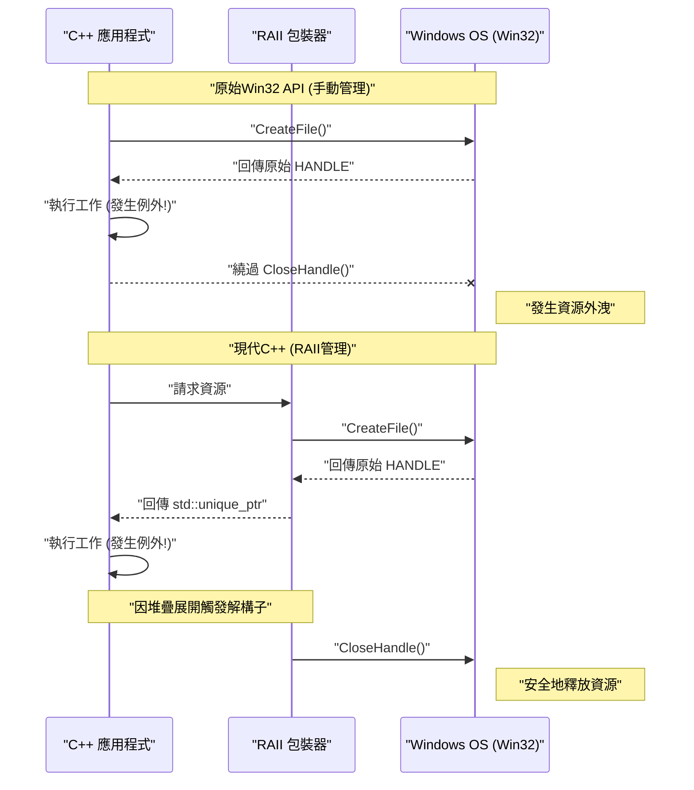
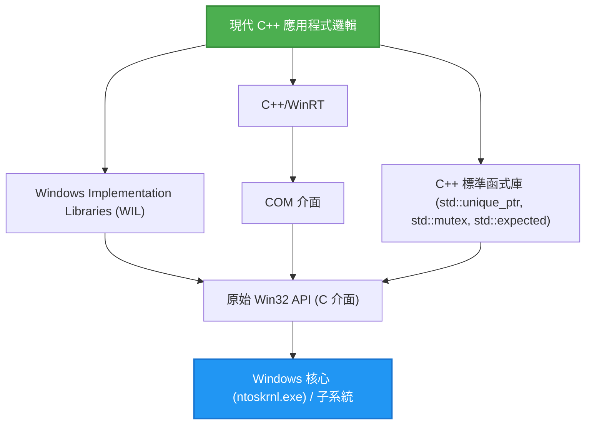

## 1. 簡介：基於C語言的Win32 API與現代C++的脫節

作為Windows OS基礎的 **Windows API（通稱 Win32 API）**，是從1990年代的 Windows NT 和 Windows 95 時代脈脈相傳下來的巨大C語言介面。即便是現在，在開發Windows原生應用程式時，為了存取OS的核心功能（行程管理、檔案I/O、執行緒同步、視窗控制等），最終仍必須呼叫這個Win32 API。

然而，Win32 API純粹是為C語言所設計，並未以**現代C++（Modern C++）**所具備的高階語言功能（例外處理、基於RAII的自動資源管理、移動語意、型別安全的列舉、智慧指標等）為前提。結果，如果將原始的Win32 API直接混入C++程式碼中，就會發生以下問題：

*   **手動的資源管理：** 透過 `CreateFile` 或 `CreateEvent` 取得的 `HANDLE`，必須確保呼叫 `CloseHandle` 來釋放。
*   **缺乏例外安全性：** 當C++拋出例外時，如果沒有撰寫適當呼叫 `CloseHandle` 的處理，很容易發生資源外洩 (Resource leak)。
*   **不一致的錯誤表現：** 某些API會回傳 `BOOL`，失敗時需要呼叫 `GetLastError()`。有些API會回傳 `HRESULT`，而有些API（如GDI）則回傳 `NULL`。
*   **缺乏型別安全性：** `HANDLE`、`HWND`、`HDC` 等，展開巨集後通常不過是單純的 `void*`，編譯器很難進行嚴格的型別檢查。

本文將極其詳細地解說如何避開這些「老舊C介面」的陷阱，並利用現代C++ (C++11/14/17/20/23) 的功能，以**安全（Safe）且現代化（Modern）的方式來處理Win32 API 的手法**。

---

## 2. 原始Win32 API的危險性：資源外洩與錯誤處理的陷阱

首先，讓我們來看看以傳統C風格呼叫Win32 API的一般程式碼。乍看之下似乎沒有問題，但從現代C++的觀點來看，卻抱有致命的脆弱性。

```cpp
#include <windows.h>
#include <iostream>
#include <vector>

void ProcessFileLegacy(const std::wstring& filename) {
    // 1. 取得檔案控制代碼
    HANDLE hFile = ::CreateFileW(
        filename.c_str(),
        GENERIC_READ,
        FILE_SHARE_READ,
        NULL,
        OPEN_EXISTING,
        FILE_ATTRIBUTE_NORMAL,
        NULL
    );

    if (hFile == INVALID_HANDLE_VALUE) {
        std::cerr << "Failed to open file. Error: " << ::GetLastError() << std::endl;
        return;
    }

    // 2. 取得檔案大小
    LARGE_INTEGER fileSize;
    if (!::GetFileSizeEx(hFile, &fileSize)) {
        ::CloseHandle(hFile); // 發生錯誤時手動釋放
        return;
    }

    // 3. 配置記憶體與讀取
    std::vector<char> buffer(fileSize.QuadPart);
    DWORD bytesRead = 0;
    
    if (!::ReadFile(hFile, buffer.data(), buffer.size(), &bytesRead, NULL)) {
        ::CloseHandle(hFile); // 發生錯誤時手動釋放
        return;
    }

    // --- 假設這裡有會發生例外的處理 ---
    // 例：解析 buffer 內容的函數拋出了 std::runtime_error
    // ParseBuffer(buffer); // 如果拋出例外，下方的 CloseHandle 就不會被呼叫，導致外洩！

    // 4. 手動釋放資源
    ::CloseHandle(hFile);
}
```

### 這段程式碼有什麼問題？

1.  **程式碼重複與繁雜：** 每次提早回傳（`return`）時都必須寫上 `::CloseHandle(hFile);`，違反了 DRY (Don't Repeat Yourself) 原則。
2.  **完全缺乏例外安全性 (Exception Unsafe)：** 在C++中，當 `std::vector` 記憶體配置失敗 (`std::bad_alloc`)，或是其他函數拋出例外時，會強制退出函數。此時，末尾的 `CloseHandle` 不會被執行，導致**檔案控制代碼永遠外洩**（會引起行程結束前檔案持續被鎖定等嚴重錯誤）。

---

## 3. 例外安全與資源管理的數學模型

在這裡，讓我們以數學（機率論）的方式來建立模型，看看手動的資源管理是多麼脆弱。

假設函數內有 $N$ 個資源獲取（或是提早回傳點、例外發生點）。在每個步驟 $i$，因發生錯誤或例外而退出函數的機率為 $P(\text{Exit}_i)$。考慮無法在所有退出路徑上手動正確寫滿清理程式碼（如 `CloseHandle`）而導致資源外洩的機率。

將因人類注意力不集中而漏寫，或因未知例外導致預期外退出的機率（每條路徑的外洩機率）設為 $p$，整個程式中發生至少一個資源外洩的機率 $P(\text{Leak})$ 可以用以下公式表示：

$$ P(\text{Leak}) = 1 - (1 - p)^N $$

例如，當 $p = 0.05$（有5%的機率在例外處理或清理上發生失誤），且 $N = 20$（複雜的函數中有20處錯誤回傳或例外點）時：

$$ P(\text{Leak}) = 1 - (1 - 0.05)^{20} \approx 1 - 0.358 = 0.642 $$

居然**有約 64.2% 的機率在某處潛藏著資源外洩的錯誤**。隨著軟體規模變大、$N \to \infty$ 時，$P(\text{Leak}) \to 1$，系統必然會崩潰。

要對抗這個數學現實的唯一合理手段，就是C++的 **RAII (Resource Acquisition Is Initialization)**。

---

## 4. RAII (Resource Acquisition Is Initialization) 的基礎

RAII是由C++之父 Bjarne Stroustrup 先生提倡的概念。其原則極為簡單且強大。

1.  在物件的**建構子 (Initialization)** 中進行資源的獲取 (Acquisition)。
2.  在物件的**解構子**中進行資源的釋放。

根據C++的語言規範，當離開作用域時（無論是正常的 `return`，還是因例外導致的堆疊展開），堆疊上配置的物件的解構子會被**確實且自動地**呼叫。

如此一來，就能在數學上將前面公式中人為失誤的機率 $p$ 降為 **$0$**。

### 物件生命週期的視覺化

以下的循序圖展示了使用原始API的手動管理與使用RAII的自動管理在生命週期上的差異。



---

## 5. 使用 `std::unique_ptr` 安全包裝 `HANDLE` 的手法

從 C++11 開始，標準函式庫提供了通用的 RAII 包裝器 `std::unique_ptr`。這不單單用於記憶體（`new/delete`）的管理，透過指定**自訂刪除器 (Custom Deleter)**，它可以應用於任何資源的管理。

為了用 `std::unique_ptr` 來管理 Win32 的 `HANDLE`，基本的刪除器可以這樣寫：

```cpp
#include <windows.h>
#include <memory>

// 供 HANDLE 使用的自訂刪除器
struct handle_deleter {
    // 指定 std::unique_ptr 內部處理的指標型別
    using pointer = HANDLE; 

    void operator()(HANDLE handle) const noexcept {
        if (handle != nullptr && handle != INVALID_HANDLE_VALUE) {
            ::CloseHandle(handle);
        }
    }
};

// 安全的控制代碼型別別名
using unique_handle = std::unique_ptr<void, handle_deleter>;
```

使用這個 `unique_handle`，前面危險的程式碼就會重生為如下的形式：

```cpp
void ProcessFileModern(const std::wstring& filename) {
    // 取得後立即將所有權交給 RAII 物件
    unique_handle hFile(::CreateFileW(
        filename.c_str(), GENERIC_READ, FILE_SHARE_READ, NULL,
        OPEN_EXISTING, FILE_ATTRIBUTE_NORMAL, NULL
    ));

    // 錯誤檢查 (對 INVALID_HANDLE_VALUE 的對策於後文詳述)
    if (hFile.get() == INVALID_HANDLE_VALUE) {
        throw std::runtime_error("Failed to open file");
    }

    LARGE_INTEGER fileSize;
    if (!::GetFileSizeEx(hFile.get(), &fileSize)) {
        throw std::runtime_error("Failed to get file size");
    }

    std::vector<char> buffer(fileSize.QuadPart);
    DWORD bytesRead = 0;
    
    if (!::ReadFile(hFile.get(), buffer.data(), buffer.size(), &bytesRead, NULL)) {
        throw std::runtime_error("Failed to read file");
    }

    // 在這裡即使發生例外或提早回傳，
    // 在離開函數的瞬間 unique_handle 的解構子都會呼叫 CloseHandle！
}
```

---

## 6. 深入探討：解決 `INVALID_HANDLE_VALUE` 與 `nullptr` 的問題

在處理 Win32 API 時，最讓 C++ 程式設計師苦惱的規格之一，就是**無效控制代碼的表現方式不一致**。

*   `CreateEvent` 或 `CreateThread` 等：失敗時回傳 `NULL` (`nullptr`)。
*   `CreateFile` 等：失敗時回傳 `INVALID_HANDLE_VALUE` (值為 `(HANDLE)-1`)。

標準的 `std::unique_ptr` 會將內部指標為 `nullptr` 的情況視為「空狀態（未擁有資源的狀態）」來特別處理。也就是說，像 `if (ptr)` 這樣的布林值判定，只有在遇到 `nullptr` 時才會回傳 `false`。

然而，當 `CreateFile` 失敗並回傳 `INVALID_HANDLE_VALUE` 時，`std::unique_ptr` 會將其誤認為「有效的非NULL指標」。

為了解決這個問題，我們可以利用 C++ `std::unique_ptr` 的進階規格，定義**自訂指標型別**。

```cpp
#include <windows.h>
#include <memory>

struct win32_handle_traits {
    // 定義自訂指標型別
    class pointer {
        HANDLE m_handle;
    public:
        // 在預設建構或代入 nullptr 時，雖可設計為以 INVALID_HANDLE_VALUE 為初始值，
        // 但為了提高泛用性，這裡將 nullptr 與 INVALID_HANDLE_VALUE 雙雙視為無效狀態。
        pointer() noexcept : m_handle(nullptr) {}
        pointer(std::nullptr_t) noexcept : m_handle(nullptr) {}
        pointer(HANDLE h) noexcept : m_handle(h) {}
        
        // 覆載 operator bool，同時排除 Win32 的兩種無效值
        explicit operator bool() const noexcept {
            return m_handle != nullptr && m_handle != INVALID_HANDLE_VALUE;
        }
        
        operator HANDLE() const noexcept { return m_handle; }
        
        friend bool operator==(pointer a, pointer b) noexcept { return a.m_handle == b.m_handle; }
        friend bool operator!=(pointer a, pointer b) noexcept { return a.m_handle != b.m_handle; }
    };
    
    void operator()(pointer p) const noexcept {
        if (p) { // 會呼叫 operator bool
            ::CloseHandle(p);
        }
    }
};

using safe_win32_handle = std::unique_ptr<void, win32_handle_traits>;
```

透過這個實作，就能寫出如下直覺且安全的程式碼：

```cpp
safe_win32_handle hFile(::CreateFileW(...));
if (!hFile) {
    // 可以在這裡同時捕捉到 nullptr 與 INVALID_HANDLE_VALUE！
    throw std::system_error(::GetLastError(), std::system_category(), "CreateFile failed");
}
```

---

## 7. GDI物件（`HDC`、`HBITMAP`）的進階RAII管理

Win32的另一個鬼門關是 GDI (Graphics Device Interface) 的資源管理。
GDI物件（畫筆、筆刷、字型、點陣圖等）在建立後，需透過 `SelectObject` 選入裝置內容 (`HDC`) 中使用，使用完畢後**必須再次呼叫 SelectObject 恢復原本的物件，然後才能用 DeleteObject 銷毀**。這種作法非常繁瑣。

要用RAII解決這個問題，包裝器會長得像這樣：

```cpp
// 刪除 GDI 物件用的刪除器
struct gdi_deleter {
    using pointer = HGDIOBJ;
    void operator()(HGDIOBJ obj) const noexcept {
        if (obj != nullptr) {
            ::DeleteObject(obj);
        }
    }
};

using unique_gdi_obj = std::unique_ptr<void, gdi_deleter>;

// SelectObject 的 RAII 包裝器 (離開作用域時會恢復原本的物件)
class gdi_selector {
    HDC m_hdc;
    HGDIOBJ m_oldObj;

public:
    gdi_selector(HDC hdc, HGDIOBJ newObj) : m_hdc(hdc) {
        // 選擇新物件，並保存舊物件
        m_oldObj = ::SelectObject(m_hdc, newObj);
    }

    ~gdi_selector() {
        if (m_oldObj != nullptr && m_oldObj != HGDI_ERROR) {
            // 離開作用域時自動恢復
            ::SelectObject(m_hdc, m_oldObj);
        }
    }

    // 禁止複製
    gdi_selector(const gdi_selector&) = delete;
    gdi_selector& operator=(const gdi_selector&) = delete;
};
```

### 使用範例

```cpp
void DrawMyGraphics(HDC hdc) {
    // 建立畫筆 (RAII管理)
    unique_gdi_obj hPen(::CreatePen(PS_SOLID, 1, RGB(255, 0, 0)));
    
    {
        // 將畫筆選入 HDC (作用域管理)
        gdi_selector penSelect(hdc, hPen.get());
        
        // 繪圖處理...
        ::MoveToEx(hdc, 0, 0, NULL);
        ::LineTo(hdc, 100, 100);
        
        // 離開作用域時，penSelect 的解構子會透過 SelectObject 恢復舊畫筆
    }
    
    // 離開函數時，hPen 的解構子會呼叫 DeleteObject
}
```
像這樣，生命週期呈現巢狀結構的資源管理，正是 RAII 大顯身手的領域。

---

## 8. 執行緒同步物件的現代化

Win32 存在著 `CRITICAL_SECTION` 與 `SRWLOCK` 等執行緒同步基元。從例外安全的觀點來看，手動呼叫 `EnterCriticalSection` / `LeaveCriticalSection` 也是大忌。

C++11的 `std::mutex` 與 `std::lock_guard` 雖然非常方便，但有時也會想直接使用 OS 原生的高速鎖定機制（尤其是 SRWLock 非常輕量）。
標準的 `std::lock_guard` 其規格是可以接收任何具有 `lock()` 與 `unlock()` 成員函數的型別（類似鴨子型別 (Duck typing) 的模板規格）。我們就能利用這一點。

```cpp
class win32_srwlock {
    SRWLOCK m_lock;
public:
    win32_srwlock() noexcept {
        ::InitializeSRWLock(&m_lock);
    }
    
    // std::lock_guard 要求的介面
    void lock() noexcept {
        ::AcquireSRWLockExclusive(&m_lock);
    }
    void unlock() noexcept {
        ::ReleaseSRWLockExclusive(&m_lock);
    }
    
    // 禁止複製與移動
    win32_srwlock(const win32_srwlock&) = delete;
    win32_srwlock& operator=(const win32_srwlock&) = delete;
};
```

如此一來，就能完全以 C++ 標準函式庫的作法來處理 Win32 的鎖定。

```cpp
win32_srwlock g_myLock;
int g_sharedData = 0;

void UpdateData() {
    // 例外安全的鎖定獲取
    std::lock_guard<win32_srwlock> lock(g_myLock);
    
    g_sharedData++;
    if (g_sharedData > 100) {
        throw std::runtime_error("Overflow"); // 就算拋出例外也能安全釋放鎖！
    }
}
```

---

## 9. 與 C++ 標準函式庫的整合：`std::system_error` 與 `HRESULT`

Win32 的錯誤主要分為兩類：`GetLastError()`（DWORD 型別），以及 COM 或 DirectX 中使用的 `HRESULT`。將這些轉換為 C++ 的例外 `std::system_error`，可以讓錯誤處理現代化。

在拋出 `GetLastError()` 時，於 MSVC (Visual C++) 的實作中，`std::system_category()` 提供了 Win32 錯誤碼與訊息的映射。

```cpp
inline void throw_if_win32_error(BOOL result, const char* msg = "Win32 API failed") {
    if (!result) {
        DWORD err = ::GetLastError();
        // std::system_category 會在內部呼叫 FormatMessage API，並產生錯誤字串
        throw std::system_error(err, std::system_category(), msg);
    }
}
```

另一方面，關於 `HRESULT`，則可以建立專屬的錯誤類別，或是使用 Windows 標準的 `_com_error`。

---

## 10. 使用 `std::expected` (C++23) 的現代化錯誤處理

從 C++23 開始，引入了相當於 Rust `Result` 型別的 `std::expected`。對於不喜歡例外（出於效能考量，或設計上錯誤頻發）的專案來說，這是讓 Win32 回傳值現代化的最佳手法。

```cpp
#include <expected>
#include <string>

// 成功時回傳 unique_handle，失敗時回傳 DWORD(錯誤碼)
std::expected<safe_win32_handle, DWORD> OpenFileModern(const std::wstring& path) {
    safe_win32_handle h(::CreateFileW(
        path.c_str(), GENERIC_READ, 0, nullptr, OPEN_EXISTING, 0, nullptr));
        
    if (!h) {
        return std::unexpected(::GetLastError());
    }
    return std::move(h); // 成功時使用移動語意回傳控制代碼
}

void Usage() {
    auto result = OpenFileModern(L"C:\\test.txt");
    if (result) {
        // 成功時的處理
        safe_win32_handle& hFile = *result;
        // ...
    } else {
        // 失敗時的處理
        DWORD err = result.error();
        std::cerr << "Error code: " << err << std::endl;
    }
}
```

像這樣，透過使用 C++23，可以兼顧基於回傳值的錯誤處理與 RAII 帶來的好處。

---

## 11. Microsoft的解答 (1)：靈活運用 WIL (Windows Implementation Libraries)

前面介紹了自製的包裝器，但其實 Microsoft 自身也非常重視這個問題，並開源釋出了針對現代 C++ 的官方 Header-only 函式庫 **WIL (Windows Implementation Libraries)**（可於 GitHub 上取得）。

使用 WIL 的話，前面辛苦自製的包裝器全部都有標準提供。

```cpp
#include <wil/resource.h>
#include <wil/result.h>

void ProcessWithWIL() {
    // wil::unique_handle 已同時對應 INVALID_HANDLE_VALUE 與 NULL
    wil::unique_handle hFile;
    
    // THROW_IF_WIN32_BOOL_FALSE 巨集可自動化錯誤檢查與例外拋出
    THROW_IF_WIN32_BOOL_FALSE(
        ::CreateFileW(L"test.txt", GENERIC_READ, 0, nullptr, OPEN_EXISTING, 0, nullptr),
        hFile.put() // WIL 特有的接收輸出指標用輔助函數
    );
    
    // 像是 wil::unique_cotaskmem_string 等，記憶體管理的包裝器也很齊全
}
```

WIL 的精髓在於名為 `wil::unique_any` 的強大模板，它不僅是檔案控制代碼，還能用寥寥數行定義出登錄碼機碼、GDI 物件、本機記憶體等各種 Win32 資源的 RAII 包裝器。

---

## 12. Microsoft的解答 (2)：透過 C++/WinRT 抽象化 COM

許多的 Win32 API（尤其是 Shell 的擴充或是 DirectX 等），是透過基於 C 語言的 COM (Component Object Model) 介面來提供的。
進一步將傳統的 `CComPtr` (ATL) 與 `ComPtr` (WRL) 演進，目前 Microsoft 官方推薦的就是 **C++/WinRT**。

C++/WinRT 不僅能處理 Windows 執行階段 (WinRT)，對於傳統的 COM 物件也能處理得極為聰明。

```cpp
#include <winrt/base.h>

void ComExample() {
    // COM 的初始化 (RAII化)
    winrt::init_apartment();

    // 將繼承 IUnknown 的 COM 介面用 winrt::com_ptr 安全地管理
    winrt::com_ptr<IDXGIFactory> factory;
    winrt::check_hresult(
        ::CreateDXGIFactory(__uuidof(IDXGIFactory), factory.put_void())
    );
    
    // 完全不需要手動呼叫 AddRef 或 Release
}
```

---

## 13. 架構與生命週期的視覺化

讓我們來整理現代 Windows C++ 應用程式開發中的分層結構。



應用程式邏輯絕不應該直接接觸原始的 Win32 API（第 E 層）。務必建立透過標準函式庫、WIL 或 C++/WinRT 任一抽象層進行存取的架構，如此一來記憶體安全性將會飛躍性地提升。

---

## 14. 零成本抽象化的效能分析

「使用 RAII 包裝器或智慧指標，運作起來會不會比原始 C 語言 API 還要慢？」或許有人會有這樣的疑問。
在這裡，讓我們看看效能成本的數學公式模型。

執行時間 $T_{\text{total}}$ 可以分解如下：

$$ T_{\text{total}} = T_{\text{syscall}} + T_{\text{wrapper}} + T_{\text{cleanup}} $$

*   $T_{\text{syscall}}$：Win32 API 內部轉換到核心模式及實際處理所花費的時間。通常為毫秒至微秒等級。
*   $T_{\text{wrapper}}$：建構 `std::unique_ptr` 或 WIL 包裝器類別所花費的時間。
*   $T_{\text{cleanup}}$：呼叫解構子所花費的時間。

C++ 的編譯器（MSVC、Clang、GCC）在行內化 (Inlining) 的最佳化上極為優異。`std::unique_ptr` 的建構子與解構子、覆載的 `operator*` 或 `operator bool` 全部都會被 `inline` 展開，編譯成與直接操作記憶體上的原始指標完全相同的機器碼。

也就是說，**$T_{\text{wrapper}} \approx 0$**。這正是 C++ 最大哲學 **Zero-cost Abstraction (零成本抽象化)** 的證明。即便獲得了安全性，執行時的額外負擔 (Overhead) 依然如字面所說的是零。

---

## 15. 總結：安全的 Windows 程式設計之未來

Win32 API 基於歷史原因，是個以 C 語言典範設計的古老美好遺產。然而，作為呼叫方的 C++ 持續在進化，如今已能寫出極為安全且具表現力的程式碼。

回顧本文解說的重點：

1.  **絕不手動撰寫 `CloseHandle` 或 `DeleteObject`。** 將一切都封裝在 `std::unique_ptr` 等 RAII 容器中。
2.  **理解 `INVALID_HANDLE_VALUE` 的陷阱。** 實作專屬的自訂刪除器・自訂指標特性 (Pointer Traits)，或使用 WIL 的 `wil::unique_handle`。
3.  **現代化錯誤處理。** 將 `GetLastError()` 或 `HRESULT` 作為 `std::system_error` 例外拋出，或使用 C++23 的 `std::expected` 進行型別安全的處理。
4.  **站在巨人的肩膀上。** 積極採用 Microsoft 官方的 WIL 與 C++/WinRT，避免重新發明輪子。

在現代的 C++ 開發中，帶著赤裸裸的原始指標或控制代碼到處跑，就像是不繫安全帶在高速公路上行駛一樣。請充分運用 C++ 提供的強大型別系統與 RAII，享受安全又堅固的 Windows 應用程式開發吧。
