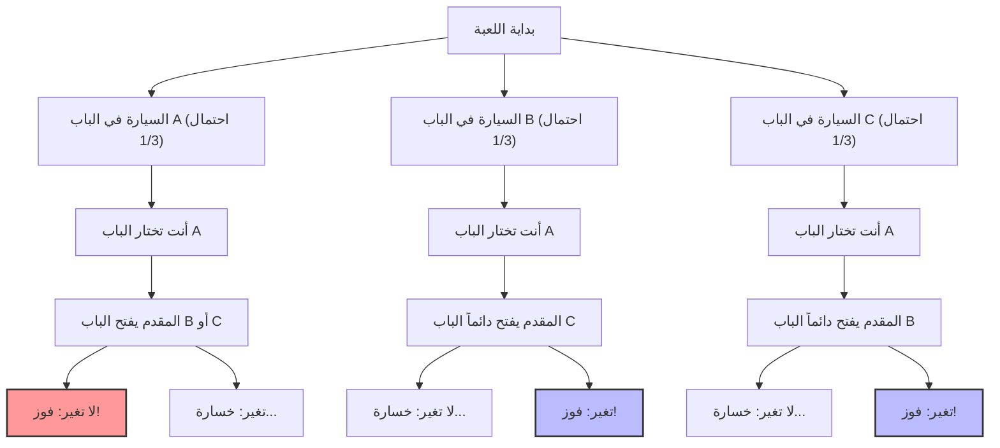
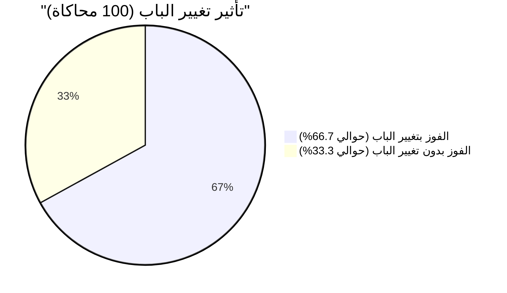

## 1. المسرح هو برنامج مسابقات تلفزيوني: ماذا ستفعل؟

في عام 1990، في عمود "Ask Marilyn" (اسأل مارلين) في المجلة الإخبارية الأمريكية "Parade"، أرسل أحد القراء السؤال التالي:

> أنت مشارك في برنامج ألعاب تلفزيوني. أمامك **3 أبواب (A, B, C)**.
> خلف أحد الأبواب توجد **سيارة جديدة (الفوز)**، وخلف البابين الآخرين يوجد **ماعز (الخسارة)**.
> 
> 1. أنت أولاً اخترت **الباب A**.
> 2. بعد ذلك، قام المقدم مونتي هول، الذي يعرف أين توجد السيارة الجديدة، بفتح **الباب B** الذي يوجد خلفه ماعز من بين الأبواب المتبقية.
> 3. يقول لك مونتي: **"الآن يمكنك التغيير إلى الباب C. ماذا ستفعل؟"**
> 
> هل يجب عليك **تغيير الباب؟**

حدسياً يبدو الأمر وكأن "الأبواب المتبقية هي اثنان: A و C. نظرًا لأن موقع السيارة الجديدة عشوائي تمامًا، فإن احتمال الفوز لأي منهما هو $\frac{1}{2}$ (50%). لذلك، التغيير وعدم التغيير هما نفس الشيء".

ومع ذلك، أجابت كاتبة العمود مارلين فوس سافانت (صاحبة أعلى معدل ذكاء مسجل في موسوعة غينيس): **"يجب عليك التغيير. إذا غيرت، سيتضاعف احتمال فوزك"**.

أثارت هذه الإجابة ضجة كبيرة في جميع أنحاء أمريكا، وانهالت حوالي 10 آلاف رسالة احتجاج (حوالي 1000 منها من علماء يحملون درجة الدكتوراه في الرياضيات). كانت هناك عاصفة من الانتقادات اللاذعة مثل "أنت لا تفهمين أساسيات الاحتمالات" و"هذا منطق نسائي".
ولكن، في النهاية، **كانت إجابة مارلين صحيحة تمامًا من الناحية الرياضية**.

---

## 2. الفجوة بين الحدس والرياضيات: تفرع الاحتمالات كما نراه في Mermaid

لماذا ينخدع حدسنا ونعتقد أن الاحتمال هو "$\frac{1}{2}$"؟
دعونا أولاً نتصور جميع أنماط اللعبة.

بافتراض أنك اخترت "الباب A"، ستحدث السيناريوهات الثلاثة التالية باحتمال متساوٍ ($\frac{1}{3}$).

1. **السيناريو 1 (السيارة في A):** يفتح المقدم الباب B أو C الذي يحتوي على ماعز. إذا غيرت الباب، **ستخسر**.
2. **السيناريو 2 (السيارة في B):** المقدم لا يمكنه سوى فتح الباب C الذي يحتوي على ماعز. إذا غيرت الباب، **ستفوز**.
3. **السيناريو 3 (السيارة في C):** المقدم لا يمكنه سوى فتح الباب B الذي يحتوي على ماعز. إذا غيرت الباب، **ستفوز**.

أي أنه في حالتين من أصل 3 حالات (السيناريوهان 2 و 3)، تكون في وضع **"إذا غيرت الباب ستفوز بالتأكيد"**.
لذلك، نسبة الفوز إذا غيرت الباب تصبح $\frac{2}{3}$، وهي **ضعف** نسبة الفوز $\frac{1}{3}$ إذا لم تغير.

---

## 3. إثبات دقيق باستخدام مبرهنة بايز

لحل هذه المشكلة بدقة رياضية، نستخدم "مبرهنة بايز" التي تحسب الاحتمال الشرطي.

$$ P(H|E) = \frac{P(E|H) P(H)}{P(E)} $$

هنا، نعرّف الأحداث على النحو التالي:
- $C_A, C_B, C_C$ : أحداث وجود السيارة في الباب A، B، C على التوالي. الاحتمال المسبق هو $P(C_A) = P(C_B) = P(C_C) = \frac{1}{3}$
- لنفترض أنك اخترت **الباب A** أولاً.
- $M_B$ : حدث فتح المقدم **للباب B** الذي يحتوي على ماعز.

ما نريد حسابه هو "الاحتمال أن تكون السيارة في الباب C بشرط أن المقدم قد فتح الباب B"، أي الاحتمال اللاحق $P(C_C|M_B)$.

أولاً، بناءً على موقع السيارة، نأخذ في الاعتبار احتمال أن يفتح المقدم الباب B وهو $P(M_B|C_X)$.

1. **إذا كانت السيارة في الباب A ($C_A$)**
   يمكن للمقدم فتح B أو C عشوائيًا.
   $$ P(M_B|C_A) = \frac{1}{2} $$

2. **إذا كانت السيارة في الباب B ($C_B$)**
   بما أن المقدم لا يستطيع فتح الباب الذي توجد فيه السيارة، فإن احتمال فتحه للباب B هو صفر.
   $$ P(M_B|C_B) = 0 $$

3. **إذا كانت السيارة في الباب C ($C_C$)**
   بما أن المقدم لا يستطيع فتح الباب A (الذي اخترته) والباب C (حيث توجد السيارة)، فمن المحتم أن يفتح الباب B.
   $$ P(M_B|C_C) = 1 $$

بعد ذلك، نحسب الاحتمال الكلي لفتح المقدم للباب B وهو $P(M_B)$ من "مبرهنة الاحتمال الكلي".

$$ P(M_B) = P(M_B|C_A)P(C_A) + P(M_B|C_B)P(C_B) + P(M_B|C_C)P(C_C) $$
$$ P(M_B) = \left(\frac{1}{2} \times \frac{1}{3}\right) + \left(0 \times \frac{1}{3}\right) + \left(1 \times \frac{1}{3}\right) = \frac{1}{6} + 0 + \frac{1}{3} = \frac{1}{2} $$

أخيرًا، نطبق مبرهنة بايز لحساب الاحتمال اللاحق للباب A والباب C.

**احتمال وجود السيارة في الباب A (إذا لم تغير):**
$$ P(C_A|M_B) = \frac{P(M_B|C_A) P(C_A)}{P(M_B)} = \frac{\frac{1}{2} \times \frac{1}{3}}{\frac{1}{2}} = \frac{1}{3} $$

**احتمال وجود السيارة في الباب C (إذا غيرت):**
$$ P(C_C|M_B) = \frac{P(M_B|C_C) P(C_C)}{P(M_B)} = \frac{1 \times \frac{1}{3}}{\frac{1}{2}} = \frac{2}{3} $$

حتى من خلال الإثبات الرياضي، تم توضيح أن **"تغيير الباب يضاعف احتمال الفوز (2/3)"** بوضوح.

---

## 4. التحيز المعرفي: قيمة المعلومات في "الاشتراط"

لماذا أخطأ الكثير من علماء الرياضيات العباقرة بشكل حدسي في هذه المشكلة؟
يكمن السبب في "تحيز الاحتمال المتساوي" و"الفشل في تحديث المعلومات" المدمجين في العقل البشري.

### 4.1. تحيز الاحتمال المتساوي (Equiprobability Bias)
يميل البشر، عند إعطائهم خيارات غير معروفة، إلى الافتراض اللاواعي بأن "احتمالات الخيارات المتبقية متساوية دائماً".
بمجرد رؤية بابين متبقيين، يطلق الدماغ تلقائيًا تسمية "$50\%$ : $50\%$".

### 4.2. معلومات عن "نية" المقدم
السبب الرئيسي في خطأ الحدس هو تجاهل حقيقة أن **تصرف المقدم ليس عشوائيًا**.
إذا كانت القاعدة هي "إذا فتح المقدم بابًا عشوائيًا دون أن يعرف مكان السيارة، وصادف أنه ماعز" (تُعرف باسم مشكلة مونتي فول)، فإن احتمال كل من الباب A والباب C سيكون $\frac{1}{2}$.

ولكن في معضلة مونتي هول الحقيقية، يتصرف المقدم وفقًا للقيود الصارمة التالية:
1. لا يمكنه فتح الباب الذي اختاره المشارك.
2. لا يمكنه فتح الباب الذي يحتوي على السيارة.

بسبب هذه القيود، فإن فعل المقدم "بفتح الباب B" في حد ذاته يعطينا **معلومات هائلة حول الباب C**. إنه يحمل رسالة صامتة مفادها: "لم أستطع فتح الباب C (لأن السيارة هناك)".

---

## 5. تصحيح الحدس بمثال متطرف

إذا كنت لا تزال غير مقتنع، فلنحاول زيادة عدد الأبواب إلى **مليون باب**.

1. من بين مليون باب، اخترت أنت **الباب 1**. (احتمال الفوز هو $\frac{1}{1,000,000}$)
2. المقدم الذي يعرف كل شيء يفتح **999,998 بابًا** تحتوي على ماعز من أصل 999,999 بابًا متبقيًا.
3. الأبواب المغلقة هي "الباب 1" الذي اخترته و"الباب 777,777" الذي تركه المقدم عمدًا.

الآن، هل ستغير اختيارك؟
في هذه الحالة، إذا كنت تعتقد أنك جذبت معجزة "واحد في المليون" في البداية، فلا ينبغي لك التغيير. ومع ذلك، في الواقع، ستفهم حدسيًا أن احتمال وجود السيارة في **"الباب الوحيد الذي لم يستطع المقدم فتحه مطلقًا"** هو $\frac{999,999}{1,000,000}$.

معضلة مونتي هول (3 أبواب) هي مجرد تصغير لنطاق ظاهرة "المليون باب" هذه.

## 6. الخلاصة: دروس في الأعمال والحياة من نظرية الاحتمالات

تتجاوز معضلة مونتي هول كونها مجرد مسابقة لتقدم لنا دروسًا مهمة.

1. **الحدس يخطئ غالبًا**: لم يتطور الدماغ البشري لمعالجة الاحتمالات الشرطية المعقدة بشكل حدسي. في اتخاذ القرارات المهمة، من الخطر الاعتماد على الحدس وحده.
2. **تحديث الاحتمالات بمعلومات جديدة (تحديث بايز)**: عندما تتغير الظروف ويتم توفير معلومات جديدة (مثل أي باب فتحه المقدم)، فإن القدرة على تحديث الاحتمالات والاستراتيجيات بمرونة دون التمسك بالأفكار الموجودة مسبقًا هي مفتاح النجاح.

القرار الصغير بـ "تغيير الباب" قد يضاعف من احتمال حصولك على "السيارة الجديدة" في حياتك.
