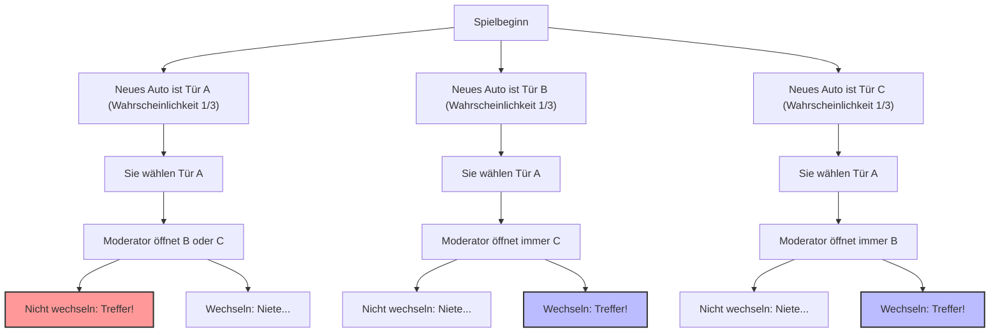
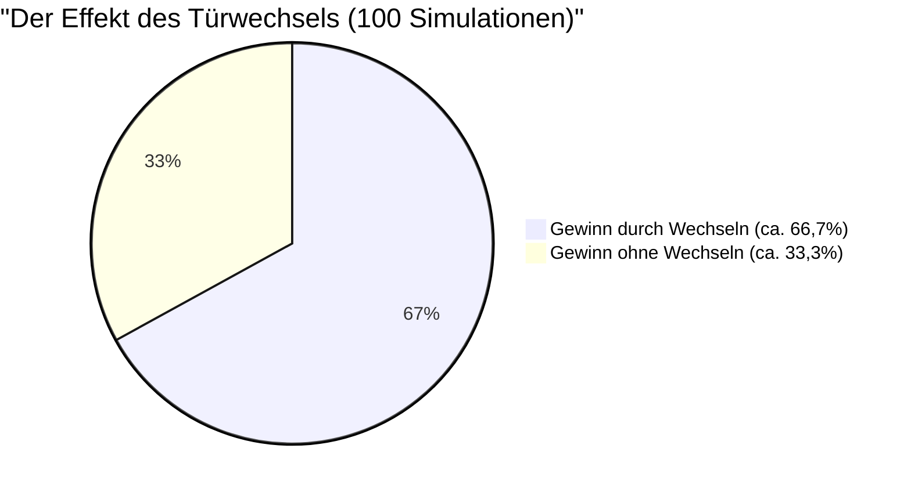

## 1. Die Bühne ist eine Fernsehquizshow: Was würden Sie tun?

Im Jahr 1990 erhielt die Kolumne "Ask Marilyn" des amerikanischen Nachrichtenmagazins *Parade* folgende Frage eines Lesers:

> Sie sind Kandidat in einer Fernsehspielshow. Vor Ihnen befinden sich **3 Türen (A, B, C)**.
> Hinter einer der Türen befindet sich ein **neues Auto (Treffer)**, und hinter den verbleibenden zwei Türen befinden sich **Ziegen (Niete)**.
> 
> 1. Sie wählen zunächst **Tür A**.
> 2. Daraufhin öffnet der Moderator Monty Hall, der weiß, hinter welcher Tür das neue Auto steht, von den verbleibenden Türen die **Tür B**, hinter der sich eine Ziege befindet.
> 3. Monty sagt zu Ihnen: **"Sie dürfen jetzt auf Tür C wechseln. Was tun Sie?"**
> 
> Sollten Sie nun tatsächlich **die Tür wechseln?**

Intuitiv könnte man denken: "Es bleiben zwei Türen, A und C. Da es völlig zufällig ist, wo das neue Auto steht, ist die Wahrscheinlichkeit für beide $\frac{1}{2}$ (50%). Deshalb ist es egal, ob man wechselt oder nicht."

Die Kolumnistin Marilyn vos Savant (die laut Guinness-Buch der Rekorde den höchsten IQ besitzt) antwortete jedoch: **"Sie sollten wechseln. Wenn Sie wechseln, verdoppelt sich Ihre Gewinnwahrscheinlichkeit."**

Diese Antwort sorgte in den gesamten USA für Aufsehen und führte zu einer Flut von etwa 10.000 Protestbriefen (davon etwa 1.000 von Wissenschaftlern mit Doktortitel in Mathematik). Es gab einen Sturm scharfer Kritik wie "Sie verstehen die Grundlagen der Wahrscheinlichkeit nicht" und "Das ist Frauenlogik".
Um es vorwegzunehmen: **Marilyns Antwort war mathematisch absolut korrekt.**

---

## 2. Die Kluft zwischen Intuition und Mathematik: Verzweigungen der Wahrscheinlichkeit mit Mermaid

Warum unterliegen wir der intuitiven Täuschung, dass es "$\frac{1}{2}$" ist?
Lassen Sie uns zunächst alle Muster des Spiels visualisieren.

Wenn wir annehmen, dass Sie "Tür A" gewählt haben, treten die folgenden drei Szenarien mit gleicher Wahrscheinlichkeit ($\frac{1}{3}$) auf.

1. **Szenario 1 (Neues Auto in A):** Der Moderator öffnet B oder C, wo sich eine Ziege befindet. Wenn Sie die Tür wechseln, ist es eine **Niete**.
2. **Szenario 2 (Neues Auto in B):** Der Moderator kann nur C öffnen, wo sich eine Ziege befindet. Wenn Sie die Tür wechseln, ist es ein **Treffer**.
3. **Szenario 3 (Neues Auto in C):** Der Moderator kann nur B öffnen, wo sich eine Ziege befindet. Wenn Sie die Tür wechseln, ist es ein **Treffer**.

Das heißt, in 2 von 3 Fällen (Szenario 2 und 3) befindet man sich in dem Zustand: **"Wenn Sie die Tür wechseln, gewinnen Sie auf jeden Fall"**.
Daher beträgt die Gewinnquote beim Wechsel der Tür $\frac{2}{3}$, was genau **doppelt** so hoch ist wie die Gewinnquote von $\frac{1}{3}$, wenn man nicht wechselt.

---

## 3. Strenger Beweis durch den Satz von Bayes

Um dieses Problem mathematisch exakt zu lösen, verwenden wir den "Satz von Bayes", der bedingte Wahrscheinlichkeiten berechnet.

$$ P(H|E) = \frac{P(E|H) P(H)}{P(E)} $$

Hierbei definieren wir die Ereignisse wie folgt:
- $C_A, C_B, C_C$ : Die Ereignisse, dass sich das neue Auto jeweils hinter Tür A, B oder C befindet. Die a priori Wahrscheinlichkeiten sind $P(C_A) = P(C_B) = P(C_C) = \frac{1}{3}$
- Angenommen, Sie haben anfangs **Tür A** gewählt.
- $M_B$ : Das Ereignis, dass der Moderator **Tür B** öffnet, hinter der sich eine Ziege befindet.

Was wir herausfinden wollen, ist "die Wahrscheinlichkeit, dass sich das neue Auto hinter Tür C befindet, unter der Bedingung, dass der Moderator Tür B geöffnet hat", also die a posteriori Wahrscheinlichkeit $P(C_C|M_B)$.

Zunächst betrachten wir die Wahrscheinlichkeit $P(M_B|C_X)$, dass der Moderator Tür B öffnet, abhängig davon, wo sich das neue Auto befindet.

1. **Wenn das neue Auto hinter Tür A ist ($C_A$)**
   Der Moderator kann zufällig B oder C öffnen.
   $$ P(M_B|C_A) = \frac{1}{2} $$

2. **Wenn das neue Auto hinter Tür B ist ($C_B$)**
   Da der Moderator die Tür mit dem neuen Auto nicht öffnen kann, ist die Wahrscheinlichkeit, B zu öffnen, null.
   $$ P(M_B|C_B) = 0 $$

3. **Wenn das neue Auto hinter Tür C ist ($C_C$)**
   Da der Moderator weder A (die Sie gewählt haben) noch C (wo das neue Auto steht) öffnen kann, muss er zwangsläufig B öffnen.
   $$ P(M_B|C_C) = 1 $$

Als nächstes ermitteln wir die Gesamtwahrscheinlichkeit $P(M_B)$, dass der Moderator Tür B öffnet, durch den "Satz der totalen Wahrscheinlichkeit".

$$ P(M_B) = P(M_B|C_A)P(C_A) + P(M_B|C_B)P(C_B) + P(M_B|C_C)P(C_C) $$
$$ P(M_B) = \left(\frac{1}{2} \times \frac{1}{3}\right) + \left(0 \times \frac{1}{3}\right) + \left(1 \times \frac{1}{3}\right) = \frac{1}{6} + 0 + \frac{1}{3} = \frac{1}{2} $$

Nun wenden wir endlich den Satz von Bayes an, um die a posteriori Wahrscheinlichkeiten für Tür A und Tür C zu berechnen.

**Wahrscheinlichkeit, dass das neue Auto hinter Tür A ist (wenn man nicht wechselt):**
$$ P(C_A|M_B) = \frac{P(M_B|C_A) P(C_A)}{P(M_B)} = \frac{\frac{1}{2} \times \frac{1}{3}}{\frac{1}{2}} = \frac{1}{3} $$

**Wahrscheinlichkeit, dass das neue Auto hinter Tür C ist (wenn man wechselt):**
$$ P(C_C|M_B) = \frac{P(M_B|C_C) P(C_C)}{P(M_B)} = \frac{1 \times \frac{1}{3}}{\frac{1}{2}} = \frac{2}{3} $$

Auch der mathematische Beweis zeigt eindeutig: **"Die Wahrscheinlichkeit zu gewinnen ist doppelt so hoch (2/3), wenn man die Tür wechselt"**.

---

## 4. Kognitive Verzerrung: Der Wert der Information als "Bedingung"

Warum haben selbst so viele geniale Mathematiker dieses Problem intuitiv falsch verstanden?
Die Gründe liegen im "Equiprobability Bias" (Gleichwahrscheinlichkeits-Verzerrung) und im "Versäumnis der Informationsaktualisierung", die in unser menschliches Gehirn eingebaut sind.

### 4.1. Equiprobability Bias (Gleichwahrscheinlichkeits-Verzerrung)
Menschen haben die Eigenschaft, wenn ihnen unbekannte Optionen präsentiert werden, unbewusst davon auszugehen, dass "die Wahrscheinlichkeit der verbleibenden Optionen immer gleichverteilt ist".
In dem Moment, in dem das Gehirn sieht, dass zwei Türen übrig bleiben, etikettiert es diese automatisch mit "$50\%$ : $50\%$".

### 4.2. Die Information der "Absicht" des Moderators
Der Hauptgrund, warum uns unsere Intuition täuscht, ist, dass wir übersehen, dass **die Handlungen des Moderators nicht zufällig sind**.
Wenn die Regel wäre: "Der Moderator öffnet zufällig eine Tür, ohne zu wissen, wo das Auto ist, und es war zufällig eine Ziege" (dies wird als "Monty-Fall-Problem" bezeichnet), dann wäre die Wahrscheinlichkeit für Tür A und Tür C tatsächlich jeweils $\frac{1}{2}$.

Aber beim tatsächlichen Monty-Hall-Problem handelt der Moderator unter den folgenden strengen Einschränkungen:
1. Er darf die vom Kandidaten gewählte Tür nicht öffnen.
2. Er darf die Tür mit dem neuen Auto nicht öffnen.

Aufgrund dieser Einschränkungen gibt uns allein die Tatsache, dass der Moderator "Tür B geöffnet hat", **eine gewaltige Information über Tür C**. Es ist eine unausgesprochene Botschaft darin enthalten: "Ich konnte Tür C nicht öffnen (weil dort das neue Auto ist)".

---

## 5. Die Intuition durch ein extremes Beispiel korrigieren

Wenn Sie immer noch nicht überzeugt sind, erhöhen wir die Anzahl der Türen auf **1 Million**.

1. Sie wählen aus 1 Million Türen **Tür 1**. (Die Gewinnwahrscheinlichkeit ist $\frac{1}{1.000.000}$)
2. Der allwissende Moderator **öffnet** von den verbleibenden 999.999 Türen **alle 999.998 Türen**, hinter denen sich eine Ziege befindet.
3. Geschlossen bleiben nur "Tür 1", die Sie gewählt haben, und "Tür 777.777", die der Moderator absichtlich übrig gelassen hat.

Nun, werden Sie wechseln?
In diesem Fall sollten Sie nicht wechseln, wenn Sie glauben, dass Sie gleich am Anfang das "Eins zu einer Million"-Wunder getroffen haben. Aber realistisch betrachtet wird intuitiv klar, dass die Wahrscheinlichkeit, dass sich das neue Auto hinter der **"einzigen Tür, die der Moderator unter keinen Umständen öffnen konnte"**, befindet, $\frac{999.999}{1.000.000}$ beträgt.

Das Monty-Hall-Problem (mit 3 Türen) ist lediglich dieses "1-Million-Türen-Phänomen" in kleinerem Maßstab.

## 6. Fazit: Was uns die Wahrscheinlichkeitstheorie für Geschäft und Leben lehrt

Das Monty-Hall-Problem geht über ein bloßes Quiz hinaus und lehrt uns wichtige Lektionen.

1. **Die Intuition irrt sich oft**: Das menschliche Gehirn hat sich nicht daraufhin entwickelt, komplexe bedingte Wahrscheinlichkeiten intuitiv zu verarbeiten. Bei wichtigen Entscheidungen ist es gefährlich, sich nur auf die Intuition zu verlassen.
2. **Wahrscheinlichkeiten mit neuen Informationen aktualisieren (Bayes-Aktualisierung)**: Wenn sich die Situation ändert und neue Informationen (z.B. welche Tür der Moderator geöffnet hat) eintreffen, ist der Schlüssel zum Erfolg, nicht an bestehenden Ansichten festzuhalten, sondern Wahrscheinlichkeiten und Strategien flexibel aktualisieren zu können.

Die kleine Entscheidung, "die Tür zu wechseln", könnte die Wahrscheinlichkeit, das "neue Auto" Ihres Lebens zu bekommen, verdoppeln.
