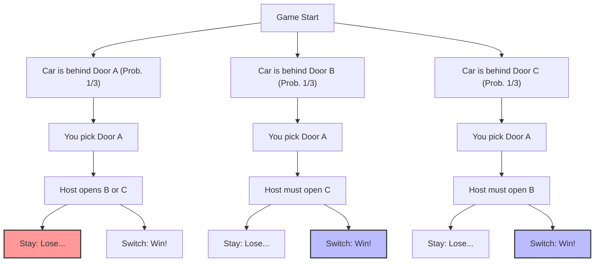
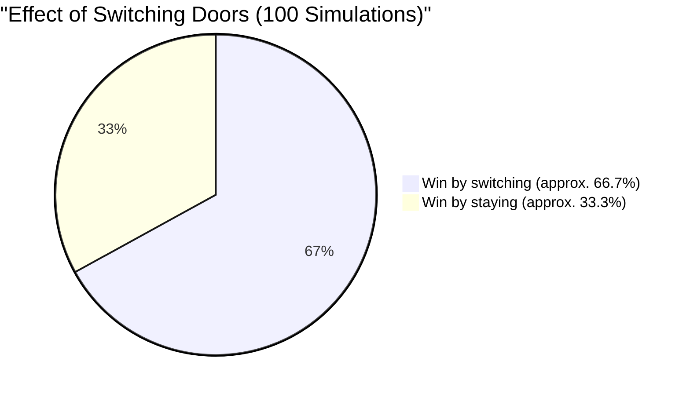

## 1. The Stage is a TV Quiz Show: What Would You Do?

In 1990, the following question was submitted by a reader to the column "Ask Marilyn" in the American news magazine *Parade*.

> You are a contestant on a TV game show. In front of you are **3 doors (A, B, C)**.
> Behind one door is a **new car (the prize)**, and behind the remaining two doors are **goats (the blanks)**.
> 
> 1. First, you choose **Door A**.
> 2. Then, the host, Monty Hall, who knows what is behind each door, opens **Door B**, which has a goat.
> 3. Monty says to you, **"You may now change your choice to Door C if you like. What will you do?"**
> 
> So, **should you change your door?**

Intuitively, it seems: "The remaining doors are A and C. Since the new car is completely random between the two, the probability of winning is $\frac{1}{2}$ (50%) for each. So it doesn't matter whether you change or not."

However, columnist Marilyn vos Savant (recognized by the Guinness Book of Records as having the highest IQ) replied, **"You should change. If you change, your probability of winning doubles."**

This answer caused a sensation across the United States, bringing in a storm of harsh criticism with about 10,000 letters of protest (about 1,000 of which were from scholars with PhDs in mathematics), saying things like "You do not understand the basics of probability" and "That's female logic."
However, to get straight to the conclusion, **Marilyn's answer was mathematically entirely correct**.

---

## 2. The Gap Between Intuition and Mathematics: Branching Probabilities in Mermaid

Why does our intuition create the illusion that it is "$\frac{1}{2}$"?
First, let's visualize all the patterns of the game.

Assuming you chose "Door A", the following three scenarios occur with equal probability ($\frac{1}{3}$).

1. **Scenario 1 (Car is A):** The host opens either B or C, both of which have goats. If you change your door, you **lose**.
2. **Scenario 2 (Car is B):** The host can only open C, which has a goat. If you change your door, you **win**.
3. **Scenario 3 (Car is C):** The host can only open B, which has a goat. If you change your door, you **win**.

In other words, in 2 out of 3 times (Scenarios 2 and 3), you are in a state where **"you will definitely win if you change doors"**.
Therefore, the win rate when you change doors is $\frac{2}{3}$, which is **double** the win rate of $\frac{1}{3}$ when you do not change.

---

## 3. Strict Proof Using Bayes' Theorem

To strictly solve this problem mathematically, we use "Bayes' Theorem" to calculate conditional probabilities.

$$ P(H|E) = \frac{P(E|H) P(H)}{P(E)} $$

Here, we define the events as follows:
- $C_A, C_B, C_C$ : The events that the new car is behind doors A, B, and C, respectively. The prior probabilities are $P(C_A) = P(C_B) = P(C_C) = \frac{1}{3}$
- Suppose you initially selected **Door A**.
- $M_B$ : The event that the host opens **Door B**, which has a goat.

What we want to find is "the probability that the new car is behind Door C given that the host opened Door B", i.e., the posterior probability $P(C_C|M_B)$.

First, let's consider the probability $P(M_B|C_X)$ that the host opens Door B depending on where the new car is.

1. **When the new car is behind Door A ($C_A$)**
   The host can open either B or C randomly.
   $$ P(M_B|C_A) = \frac{1}{2} $$

2. **When the new car is behind Door B ($C_B$)**
   The host cannot open the door with the new car, so the probability of opening B is zero.
   $$ P(M_B|C_B) = 0 $$

3. **When the new car is behind Door C ($C_C$)**
   The host cannot open A (which you picked) or C (where the new car is), so they must inevitably open B.
   $$ P(M_B|C_C) = 1 $$

Next, we find the total probability $P(M_B)$ that the host opens Door B using the "Law of Total Probability".

$$ P(M_B) = P(M_B|C_A)P(C_A) + P(M_B|C_B)P(C_B) + P(M_B|C_C)P(C_C) $$
$$ P(M_B) = \left(\frac{1}{2} \times \frac{1}{3}\right) + \left(0 \times \frac{1}{3}\right) + \left(1 \times \frac{1}{3}\right) = \frac{1}{6} + 0 + \frac{1}{3} = \frac{1}{2} $$

Finally, we apply Bayes' Theorem to calculate the posterior probabilities for Door A and Door C.

**Probability that the new car is behind Door A (if you stay):**
$$ P(C_A|M_B) = \frac{P(M_B|C_A) P(C_A)}{P(M_B)} = \frac{\frac{1}{2} \times \frac{1}{3}}{\frac{1}{2}} = \frac{1}{3} $$

**Probability that the new car is behind Door C (if you switch):**
$$ P(C_C|M_B) = \frac{P(M_B|C_C) P(C_C)}{P(M_B)} = \frac{1 \times \frac{1}{3}}{\frac{1}{2}} = \frac{2}{3} $$

The mathematical proof also clearly demonstrates that **"changing doors doubles your probability of winning (2/3)"**.

---

## 4. Cognitive Bias: The Value of Information as "Conditioning"

Why did even many genius mathematicians intuitively get this problem wrong?
The answer lies in the "equiprobability bias" and the "failure to update information" built into the human brain.

### 4.1. Equiprobability Bias
When presented with unknown options, humans have a tendency to unconsciously assign that "the probabilities of the remaining options are always equal."
The moment we see two doors remaining, our brain automatically labels them as "$50\%$ : $50\%$".

### 4.2. The Information of the Host's "Intent"
The biggest reason intuition goes wrong is overlooking the fact that **the host's actions are not random**.
If the rule was "the host opens a door randomly without knowing where the car is, and it just happened to be a goat" (known as the Monty Fall problem), then the probabilities for Door A and Door C would both be $\frac{1}{2}$.

However, in the actual Monty Hall problem, the host operates under the following strict constraints:
1. They cannot open the door chosen by the contestant.
2. They cannot open the door with the new car.

Because of these constraints, the very act of the host "opening Door B" gives us **massive information about Door C**. It contains the unspoken message, "I couldn't open Door C (because the new car is there)."

---

## 5. Correcting Intuition with an Extreme Example

If you're still not convinced, try increasing the number of doors to **1,000,000**.

1. You pick **Door 1** out of 1,000,000 doors. (Probability of winning is $\frac{1}{1,000,000}$)
2. The host, who knows everything, opens **all 999,998 doors** with goats behind them out of the remaining 999,999 doors.
3. The only doors closed are "Door 1" which you picked, and "Door 777,777" which the host deliberately left closed.

Now, do you change?
In this case, unless you believe you pulled off a "one in a million" miracle right at the start, you should change. Realistically, it should be intuitively clear that the probability of the new car being behind **"the single door the host absolutely could not open"** is $\frac{999,999}{1,000,000}$.

The Monty Hall problem (with 3 doors) is simply a scaled-down phenomenon of this "1,000,000 doors" scenario.

## 6. Conclusion: Life and Business Lessons from Probability Theory

The Monty Hall problem goes beyond a mere quiz and teaches us important lessons.

1. **Intuition is often wrong**: The human brain has not evolved to intuitively process complex conditional probabilities. In important decision-making, relying solely on intuition is dangerous.
2. **Update probabilities with new information (Bayesian updating)**: When situations change and new information (such as which door the host opened) is provided, the key to success is whether you can flexibly update your probabilities and strategies without clinging to existing beliefs.

The small decision to "change your door" just might double the probability of getting a "new car" in your life.
