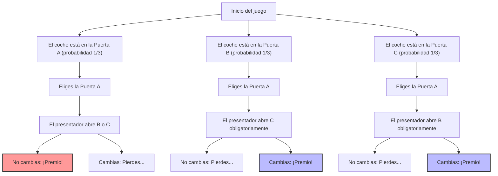
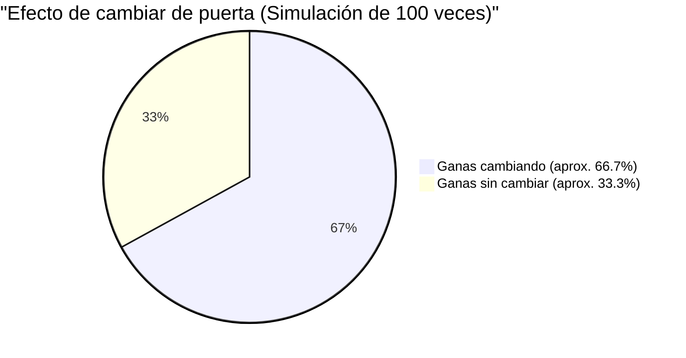

## 1. El escenario es un concurso de televisión: ¿Qué harías tú?

En 1990, en la columna "Ask Marilyn" (Pregúntale a Marilyn) de la revista de noticias estadounidense *Parade*, un lector envió la siguiente pregunta:

> Eres un concursante en un programa de televisión. Frente a ti hay **3 puertas (A, B, C)**.
> Detrás de una de las puertas hay **un coche nuevo (premio)**, y detrás de las otras dos hay **cabras (perdedoras)**.
> 
> 1. Primero, tú eliges la **Puerta A**.
> 2. Entonces, Monty Hall, el presentador que sabe detrás de qué puerta está el coche, abre la **Puerta B**, que revela una cabra.
> 3. Monty te dice: **"Ahora puedes cambiar a la Puerta C. ¿Qué haces?"**
> 
> Y bien, ¿**deberías cambiar de puerta**?

Intuitivamente, podrías pensar: "Quedan dos puertas, A y C. Dado que el coche está en una de ellas de forma completamente aleatoria, la probabilidad de ganar en ambas es de $\frac{1}{2}$ (50%). Así que da lo mismo si cambio o no".

Sin embargo, la columnista Marilyn vos Savant (reconocida en el Libro Guinness de los Récords por tener el coeficiente intelectual más alto) respondió: **"Deberías cambiar. Si cambias, tu probabilidad de ganar se duplica"**.

Esta respuesta causó sensación en todo el país y provocó una avalancha de unas 10.000 cartas de protesta (entre ellas unas 1.000 de académicos con doctorado en matemáticas). Fueron bombardeados con duras críticas como "No entiendes lo básico de la probabilidad" y "Lógica de mujeres".
Pero, en conclusión, **la respuesta de Marilyn era matemáticamente, de manera absoluta, correcta**.

---

## 2. La brecha entre la intuición y las matemáticas: Visualizando las ramas de probabilidad con Mermaid

¿Por qué nuestra intuición nos engaña haciéndonos creer que es "$\frac{1}{2}$"?
Primero, visualicemos todos los patrones del juego.

Si asumimos que has elegido la "Puerta A", ocurrirán los siguientes tres escenarios con igual probabilidad ($\frac{1}{3}$).

1. **Escenario 1 (El coche está en A):** El presentador abre B o C, donde hay una cabra. Si cambias de puerta, **pierdes**.
2. **Escenario 2 (El coche está en B):** El presentador solo puede abrir C, donde hay una cabra. Si cambias de puerta, **ganas**.
3. **Escenario 3 (El coche está en C):** El presentador solo puede abrir B, donde hay una cabra. Si cambias de puerta, **ganas**.

En otras palabras, en 2 de las 3 veces (Escenarios 2 y 3), **"si cambias de puerta, ganas seguro"**.
Por lo tanto, la probabilidad de ganar si cambias de puerta es de $\frac{2}{3}$, que es el **doble** de la probabilidad de $\frac{1}{3}$ de ganar si no cambias.

---

## 3. Demostración rigurosa mediante el Teorema de Bayes

Para resolver estrictamente este problema de forma matemática, utilizamos el "Teorema de Bayes", que calcula la probabilidad condicional.

$$ P(H|E) = \frac{P(E|H) P(H)}{P(E)} $$

Aquí, definimos los eventos de la siguiente manera:
- $C_A, C_B, C_C$ : Los eventos donde el coche está en la Puerta A, B y C respectivamente. Las probabilidades a priori son $P(C_A) = P(C_B) = P(C_C) = \frac{1}{3}$.
- Supongamos que eliges inicialmente la **Puerta A**.
- $M_B$ : El evento en el que el presentador abre la **Puerta B** donde hay una cabra.

Lo que queremos averiguar es "la probabilidad de que el coche esté en la Puerta C, dado que el presentador ha abierto la Puerta B", es decir, la probabilidad a posteriori $P(C_C|M_B)$.

Primero, consideramos la probabilidad de que el presentador abra la puerta B dependiendo de dónde esté el coche, $P(M_B|C_X)$.

1. **Si el coche está en la Puerta A ($C_A$)**
   El presentador puede abrir B o C al azar.
   $$ P(M_B|C_A) = \frac{1}{2} $$

2. **Si el coche está en la Puerta B ($C_B$)**
   El presentador no puede abrir la puerta con el coche, por lo que la probabilidad de abrir B es cero.
   $$ P(M_B|C_B) = 0 $$

3. **Si el coche está en la Puerta C ($C_C$)**
   El presentador no puede abrir A (la que elegiste) ni C (donde está el coche), así que inevitablemente tiene que abrir B.
   $$ P(M_B|C_C) = 1 $$

A continuación, calculamos la probabilidad total de que el presentador abra la puerta B, $P(M_B)$, usando el "Teorema de la probabilidad total".

$$ P(M_B) = P(M_B|C_A)P(C_A) + P(M_B|C_B)P(C_B) + P(M_B|C_C)P(C_C) $$
$$ P(M_B) = \left(\frac{1}{2} \times \frac{1}{3}\right) + \left(0 \times \frac{1}{3}\right) + \left(1 \times \frac{1}{3}\right) = \frac{1}{6} + 0 + \frac{1}{3} = \frac{1}{2} $$

Finalmente, aplicamos el teorema de Bayes para calcular las probabilidades a posteriori para la Puerta A y la Puerta C.

**Probabilidad de que el coche esté en la Puerta A (si no cambias):**
$$ P(C_A|M_B) = \frac{P(M_B|C_A) P(C_A)}{P(M_B)} = \frac{\frac{1}{2} \times \frac{1}{3}}{\frac{1}{2}} = \frac{1}{3} $$

**Probabilidad de que el coche esté en la Puerta C (si cambias):**
$$ P(C_C|M_B) = \frac{P(M_B|C_C) P(C_C)}{P(M_B)} = \frac{1 \times \frac{1}{3}}{\frac{1}{2}} = \frac{2}{3} $$

La demostración matemática también muestra claramente que **"cambiar de puerta duplica tus posibilidades de ganar (2/3)"**.

---

## 4. Sesgo cognitivo: El valor de la información del "condicionamiento"

¿Por qué incluso muchos matemáticos geniales se equivocan intuitivamente en este problema?
Se debe al "sesgo de equiprobabilidad" y al "fallo en la actualización de la información" integrados en el cerebro humano.

### 4.1. Sesgo de equiprobabilidad (Equiprobability Bias)
Los humanos tienden inconscientemente a asignar que "la probabilidad de las opciones restantes es siempre igual" cuando se les presentan opciones desconocidas.
En el momento en que vemos que quedan dos puertas, nuestro cerebro las etiqueta automáticamente como "$50\%$ : $50\%$".

### 4.2. La información de la "intención" del presentador
La principal razón por la que nuestra intuición falla es ignorar el hecho de que **las acciones del presentador no son aleatorias**.
Si la regla fuera que el presentador "abre una puerta al azar sin saber dónde está el coche y da la casualidad de que es una cabra" (conocido como el problema de Monty Fall), la probabilidad para la Puerta A y la Puerta C sería de $\frac{1}{2}$ para ambas.

Sin embargo, en el problema real de Monty Hall, el presentador actúa bajo las siguientes estrictas restricciones:
1. No puede abrir la puerta que eligió el concursante.
2. No puede abrir la puerta donde está el coche.

Debido a estas restricciones, el acto del presentador de "abrir la puerta B" en sí mismo nos da una **información enorme sobre la Puerta C**. Es un mensaje tácito de: "No pude abrir la puerta C (porque allí está el coche)".

---

## 5. Corrigiendo la intuición con un ejemplo extremo

Si aún no estás convencido, intentemos aumentar el número de puertas a **1 millón**.

1. Tú eliges la **Puerta 1** entre 1 millón de puertas. (La probabilidad de acertar es $\frac{1}{1,000,000}$)
2. El presentador, que lo sabe todo, **abre 999.998 puertas** con cabras de las 999.999 restantes.
3. Las únicas puertas cerradas son la "Puerta 1" que tú elegiste y la "Puerta 777.777" que el presentador dejó a propósito.

Ahora, ¿cambias?
En este caso, a menos que creas que lograste el milagro de "uno en un millón" en tu primera elección, no deberías mantenerla. Probablemente puedas entender intuitivamente que la probabilidad de que el coche esté en **"la única puerta que el presentador no pudo abrir bajo ningún concepto"** es de $\frac{999,999}{1,000,000}$.

El problema de Monty Hall (con 3 puertas) es simplemente este mismo fenómeno reducido a la escala de "1 millón de puertas".

## 6. Conclusión: Lecciones para los negocios y la vida de la teoría de la probabilidad

El problema de Monty Hall va más allá de ser un simple concurso y nos enseña valiosas lecciones.

1. **La intuición a menudo se equivoca**: El cerebro humano no ha evolucionado para procesar intuitivamente probabilidades condicionales complejas. Es peligroso basarse solo en la intuición para tomar decisiones importantes.
2. **Actualizar probabilidades con nueva información (Actualización bayesiana)**: Cuando la situación cambia y se dispone de nueva información (como qué puerta abrió el presentador), la clave del éxito está en la capacidad de actualizar tus probabilidades y estrategias de forma flexible, sin aferrarte a tus ideas preconcebidas.

La pequeña decisión de "cambiar de puerta" puede duplicar tus posibilidades de conseguir el "coche nuevo" en tu vida.
